# 序
《FPGA原理和结构》的读书笔记

# 理解FPGA所需的基础知识
## 逻辑电路基础
* 表示逻辑函数的方法有，表达式、真值表、卡诺图、逻辑图、波形图等

### 逻辑代数
* 逻辑运算
   * 与或非
* 布尔代数的定理
   * 交换律，结合律等

### 逻辑表达式
* 标准积之和
   * 与或式，例如：`F(A,B,C,D)=A+B非C+ABC非D`
* 标准和之积
   * 或与式，例如：`F(A,B,C,D)=(A+C+D)(非B+D)(A+非B+非D）`

### 真值表
* 描述逻辑函数的逻辑表达式可以有许多个，而描述逻辑函数的真值表却是唯一的
* 实现真值表所定义的功能的电路称为查找表(Look-up Table, LUT)，是当前主流FPGA的基本单元
* 真值表与逻辑表达式 
   

### 组合逻辑电路
* 逻辑电路根据是否包含记忆元件，分为：
   * 组合逻辑电路
      * 不包含记忆单元
      * 某时间点的输出(逻辑函数值)仅取决于当时的输入
   * 时序逻辑电路
* PLA(Programmable Logic Array，可编程逻辑阵列)
   * 实现AND-OR逻辑电路的器件

### 时序逻辑电路
* 含有记忆元件的逻辑电路被称为时序逻辑电路
* 在时序逻辑电路中，只知道当前的输入并不足以确定当前的输出，也就是说，时序逻辑电路是一种过去的电路状态也会对输出产生影响的逻辑电路
* 时序电路分为：
   * 同步时序逻辑电路
      * 输入和内部状态的变化由时钟信号控制同步进行
   * 异步时序逻辑电路
      * 不需要时钟信号
* 时序逻辑电路中过去的输入所形成并保留下来的状态对当前的输出具有影响，可描述为有限状态机模型： 
   
   * 米勒型时序逻辑电路
      * 输出与输入变量直接相关的时序逻辑电路 
      
   * 摩尔型时序逻辑电路
      * 输出与输入变量无直接关系的时序逻辑电路 
      

## 同步电路设计
* 同步电路设计将系统状态的变化与时钟信号同步，并通过这种理想化的方式降低电路设计难度

### 触发器
* 触发器(Flip Flop, FF)
   * 一种只能存储1个二进制位的存储单元，可用作时序逻辑电路的记忆元件

* D触发器(D-FF)
   * 一种在时钟上升沿(或下降沿)将输入信号的变化传送至输出的边沿触发器 
   

### 建立时间和保持时间
* 为了正确地从输入读取数据，并正确地将数据输出，FPGA内所有的FF都要遵守建立时间和保持时间等时序上的约束

### 时序分析
* 逻辑综合
   * 从硬件语言编写的RTL设计代码 -> 网表(逻辑门间的配线信息)
* 布局和布线
   * 最终决定逻辑综合所生成的电路网表在FPGA中以何种方式实现的两道工序
* 为了保证设计好的电路能正常工作，必须保证
   * 功能(逻辑)正确
   * 时序正确
* 时序分析
   * 静态时序分析(Static Timing Analysis, STA)
      * 遍历电路存在的所有时序路径，根据给定工作条件（PVT）下的时序库.lib文件计算信号在这些路径上的传播延时，检查信号的建立和保持时间是否满足约束要求，根据最大路径延时和最小路径延时找出违背时序约束的错误
      * 不需要给输入激励，只需要提供电路网表就可以进行全面的评估验证，速度快
   * 动态时序分析
      * 主要用于验证设计在器件实际延时情况下的逻辑功能
      * 所有的输入信号都会给一个不同时刻的激励，在testbench（.sp或者.v）中设置一段仿真时间，最后对仿真结果进行时序和功能分析
      * 优点是比较精确，缺点是速度比较慢，而且可能会遗漏一些关键路径(因为需要输入激励)

## FPGA的定位和历史
### FPGA的定位

* FPGA是PLD(Programmable Logic Device, 可编程逻辑器件)的一种

### FPGA的历史
* 20世纪10年代(FPLA、PAL)
   * FPLA - 现场可编程逻辑阵列
   * PLA - 可编程阵列逻辑
* 20世纪80年代
   * GAL(通用阵列逻辑)
   * EPL(可擦除阵列逻辑)
      * SPLD (Simple PLD)，前面的PLD被统称SPLD，因为它们的集成度只有数十到数百门的程度
   * FPGA
   * CPLD(Complex PLD)
* 20世纪90年代
   * FPGA成为了大规模PLD的代表
* 20世纪00年代
   * 百万门时代和系统LSI化

## FPGA专业术语
* ASIC (Application Specific Integrated Circuit, 专用集成电路)
   * 面向特定用途的集成电路
      * 全定制IC
      * 半定制IC
* ASSP (Application Specific Standard Product, 专用标准产品)
   * 某一特定领域或应用的通用LSI
* CPLD (Complex PLD, 复杂可编程逻辑器件)
   * 将多个小规模SPLD作为基本逻辑块，再通过开关链接而成的中规模(大规模)PLD
* DLL (Delay-Locked Loop, 延迟锁定环)
   * 基本功能和PLL相同：可以实现零传输延迟提供低偏移的时钟信号

# FPGA的概要

## FPGA的构成要素

* 岛型(island style)FPGA结构
   * 实现逻辑电路的逻辑要素(逻辑块，Logic Block， LB)
      * 由可以实现任意逻辑电路的可编程部分触发器(Flip-Flop, FF)等数据存储电路和数据选择器组成
   * 和外部进行信号输入/输出的要素(IOB)
   * 连接前两种元素的布线要素
      * 布线通道
      * 开关块(Switch Block, SB)
      * 连接块(Connection Block, CB)

## 可编程技术
FPGA通过可编程的开关来控制电路结构，这种“可编程”的开关可通过以下技术实现：
* EPPROM、EEPROM(技术比较老)
* 闪存
* 反熔丝(通电熔断后导通)
* 静态存储器

### 闪存
* 原理
   * NAND型
      * 写入时需要高电压
   * NOR型
      * 写入时需要大电流
* 优点
   * 非易失
   * 尺寸比SRAM小
* 缺点
   * 重写需要高电压
   * 重写次数有限

### 反熔丝
* 优点
   * 几乎不可能被逆向工程
   * 非易失
* 缺点
   * 无法重写

### 静态存储器
* 采用静态存储器作为可编程开关的FPGA大多在逻辑块中使用查找表，并使用数据选择器等来切换布线连接
* 优点
   * 可重配置
   * 重写次数没有限制
   * 能够应用最先进的CMOS工艺
* 缺点
   * 易失性存储器
   * 接通电阻、负载电容较大

## FPGA的逻辑实现
下面以多路表决电路位例子，解释FPGA上不同的逻辑实现方式：

### 基于乘积项的逻辑实现
* PLA中的逻辑实现是基于乘积项的，简要结构如下： 
   
   * PLA由1个AND阵列和1个OR阵列组成
* 多路表决电路在PLA中的实现如下： 
   

### 基于查找表的逻辑实现
* FPGA上查找表的存储单元大多数是SRAM实现
* k输入的查找表可以实现2^2^k种逻辑函数，例如，k=2时，能表示16种逻辑函数。因为由2^2个SRAM单元，每个单元的值又有1和0两种，所以SRAM可以有2^2^k种选择
* 三输入的查找表结构 
   
* 多路表决器的查找表实现 
   

# FPGA的结构
## 逻辑块的结构
* FPGA三大要素
   * 可编程逻辑要素
   * 可编程输入/输出要素
   * 可编程布线要素

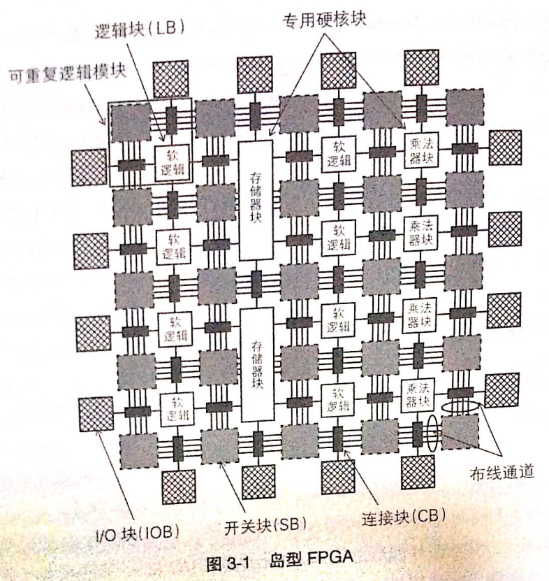
* 上图岛型FPGA结构中
   * 相邻的逻辑块，连接块、开关块组成一个可重复逻辑块(tile)
   * 逻辑块和乘法块用于实现逻辑函数，存储块用来提供存储功能
   * 硬逻辑：乘法块和存储块具有专门用途
   * 软逻辑：逻辑块利用查找表和数据选择器实现任意逻辑函数

## 逻辑簇
* BLE(Basic Logic Element, 基本逻辑单元)是逻辑块的基本要素，其构成如下： 
   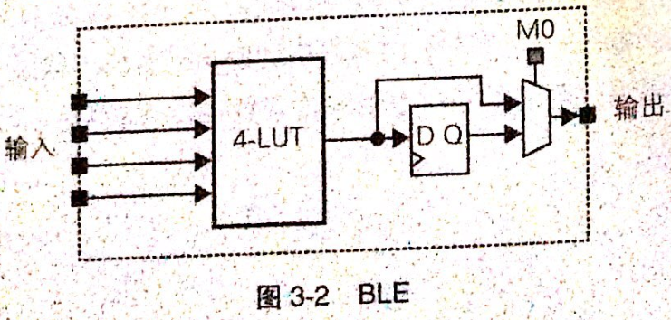
   * 实现组合电路的查找表
   * 实现时序电路的触发器
   * 数据选择器
* 逻辑簇是由多个BLE群组化形成的逻辑块结构 
   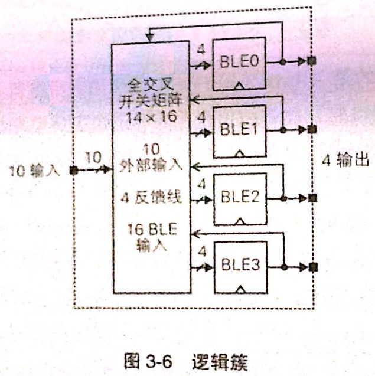
* 逻辑簇最大优势是，在增加逻辑块功能性的同时，不大幅影响FPGA的整体面积

## 自适应查找表
* 自适应查找表和以往的查找表最大的不同，就是它可以通过分解来实现多个逻辑，从而提升资源使用率

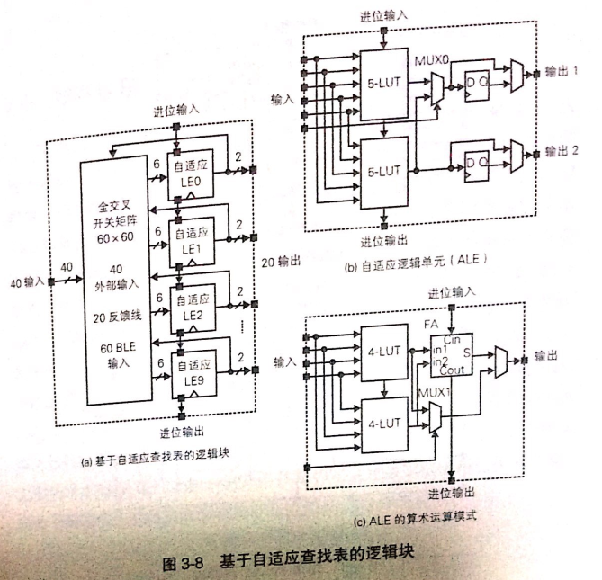

### Altera公司的Stratix II
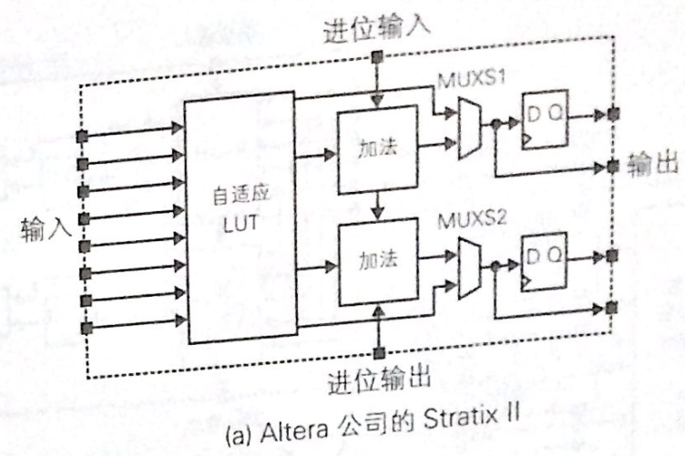
* 上图8输入电路，可实现
   * 一个任意的6输入逻辑
   * 或两个独立的4输入逻辑
   * 或输入独立的一个5输入逻辑+一个3输入逻辑

## 布线线段
* FPGA的布线架构分为
   * 全局布线(global routing)
      * 主要解决逻辑块的连接、布线通道的宽度(连线数量)等高层次的问题
   * 详细布线(detail routing)
      * 决定具体的连接方式，比如逻辑块和布线通道间的开关布局等

### 全局布线架构
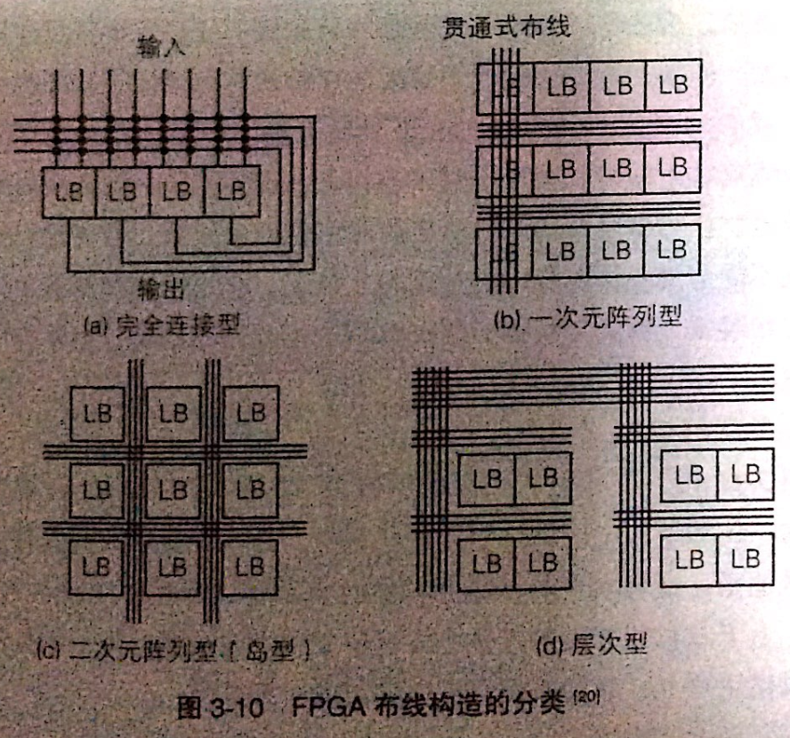
* 完全连接型
   * 外部输入和逻辑块自身的反馈输出总是连接到输入
   * 在含有可编程AND阵列的PLA器件中比较常见
   * 缺点：在大规模电路中比较低效
* 一次元阵列型
   * 只有横向布线通道，上下布线通道间通过贯通式布线连接
   * 缺点：使用的开关较多
* 层次型FPGA 
   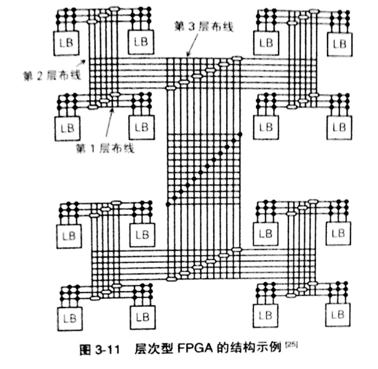
   * 一般层次越高，通道里面连线的数量就越多
   * 优点：同层次内的连接所需开关数量少
   * 缺点：一旦需要跨层连接延时就会增加
* 岛型FPGA 
   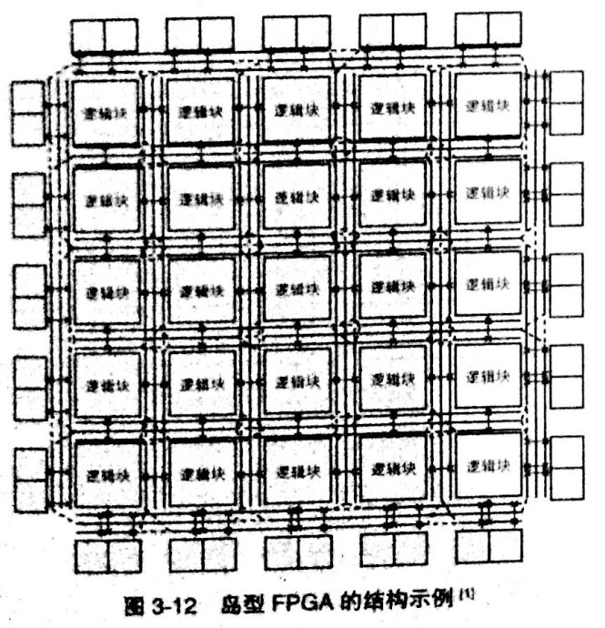
   * 近些年的FPGA大多采用这种架构

### 详细布线架构
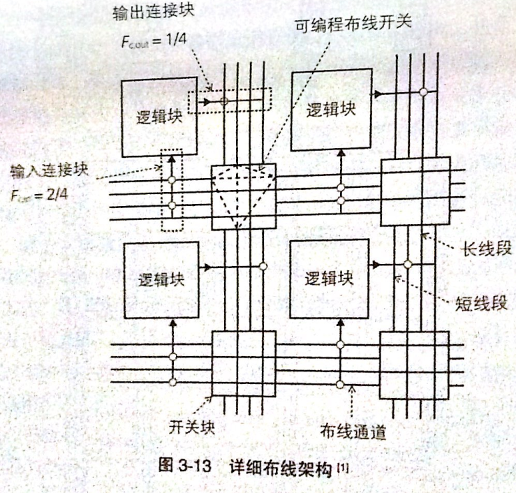
* 详细布线架构需要考虑
   * 逻辑块和布线通道间的连接结构
   * 布线线段长度的种类和比例
   * 布线开关的晶体管参数

## 开关块
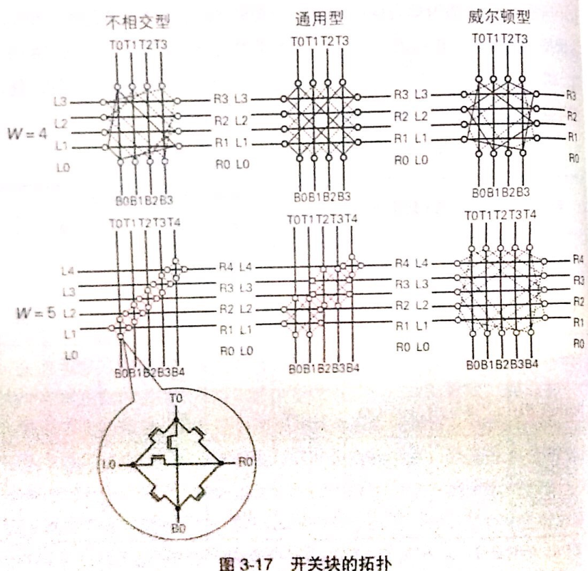

## 连接块
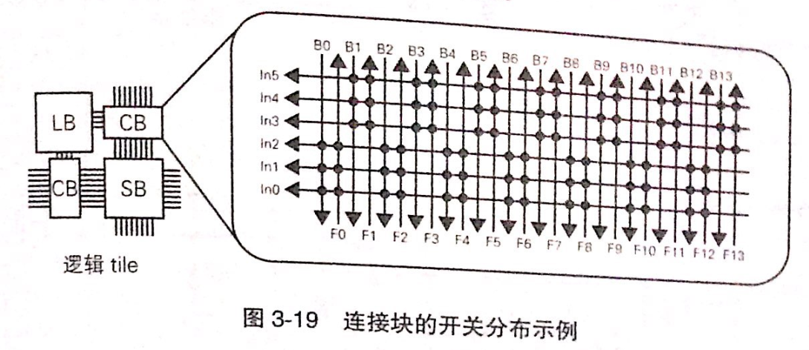
* 连接块的功能是
   * 连接布线通道和逻辑块的输入/输出

## I/O块
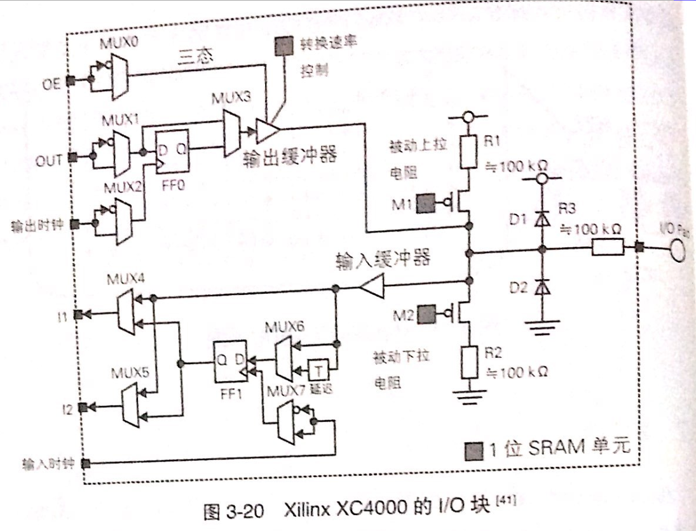

## DSP块
* 引入DSP块的原因
   * 需要进行大量乘法运算，如果基于逻辑块的查找表实现需要大量逻辑块相互连接，因此布线延迟就会增大，难以提高运算性能

## 硬宏
* 专用硬件电路称为硬宏(hard macro)，FPGA上常用的硬宏有：
   * 硬件乘法器和DSP块
   * PCI Express接口
   * 高速串行接口
   * 外部DRAM接口
   * 模拟数字转换器

## 配置链
* 将电路编程到FPGA上的过程叫作配置，向FPGA写入的电路信息叫作配置数据
* 配置数据包含在FPGA上实现的所有信息，比如：
   * 查找表中真值表的数据
   * 开关块中各个开关的开闭状态等
### JTAG接口
* JTAG为边界扫描测试标准的总称，是标准化组织Joint Test Action Group的缩写
* 边界扫描时一种将半导体芯片输入/输出上的寄存器串联成一条长的移位寄存器链，通过从外部访问移位寄存器，在输入引脚上设置测试值，或观测输出引脚上输出值的机制
* 使用JTAG接口进行配置时，要先将配置数据一位一位序列化，再通过边界扫描用的一位寄存器写入FPGA

## PLL和DLL
### PLL的基本结构和工作原理
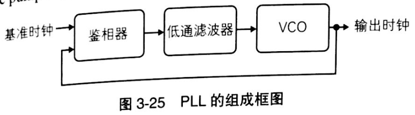
* PLL的目的是：稳定地生成和外部输入时钟相同频率、相同相位的时钟信号
* 锁相环PLL(Phase Lock Loop)的核心是
   * VCO(Voltage-Controlled Oscillator，压控振荡器)，能够根据所加的电压调整频率的振荡器
   * 鉴相器可以比较外部输入的基准时钟和VCO自身输出时钟间的相位差，如果不一致，就通过控制电路对VCO电压进行调整

### DLL(Delay Locked Loop)
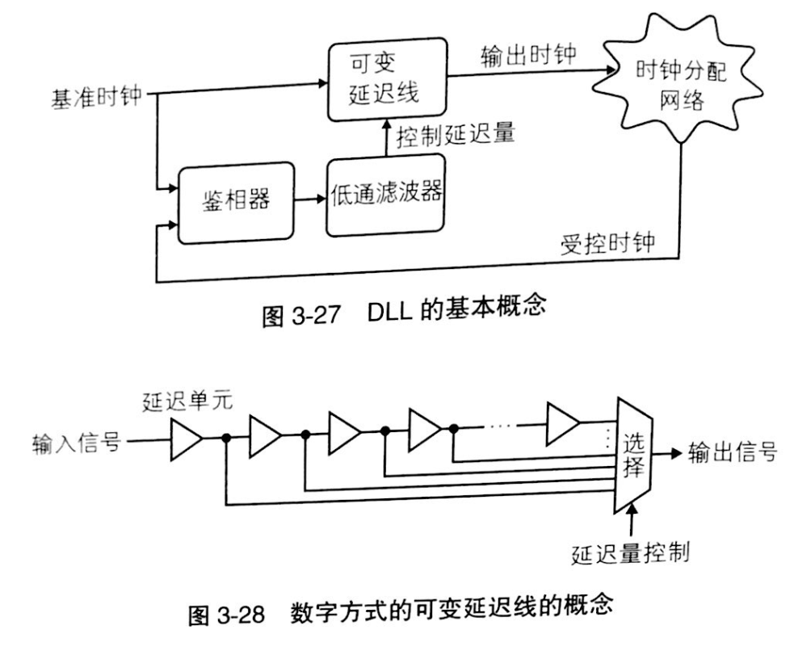
* 有的FPGA的时钟管理机制不是基于PLL而是基于DLL的
* DLL最大的不同之处在于它没有使用VCO，而是通过可变延迟来控制时钟信号的延迟量
* 优点
   * DLL所使用的数字方式的可变延迟线要比PLL所使用的VCO稳定性好，不容易积累相位误差
* 缺点
   * PLL时钟合成的自由度更高，所以目前采用PLL的FPGA架构仍是主流

# 设计流程和工具
## 设计流程
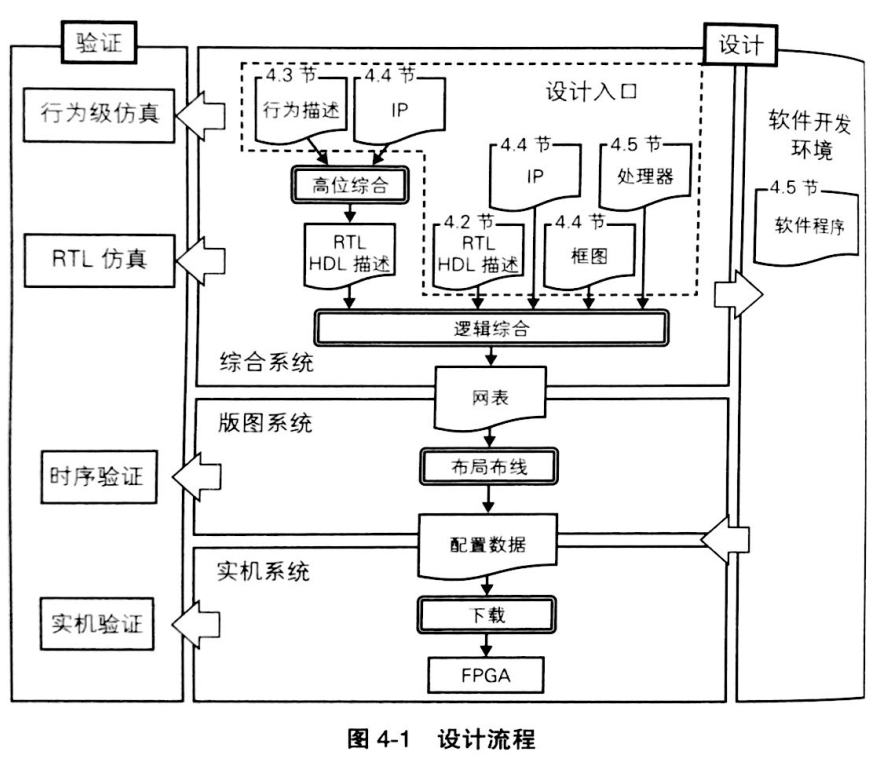

## 基于HDL的设计流程
* 设计对象
   * 由Verilog HDL或VHDL等HDL描述的RTL级别电路
* 设计流程
   * 对RTL描述进行逻辑综合
   * 技术映射
   * 布局布线
   * 生成配置
   * 写入FPGA进行系统验证
* 工程的创建
   * 约束设定
      * 指向工程中输入电路所设计所使用FPGA器件的型号、时钟信号等物理约束
   * 源文件创建
      * 添加电路描述代码
   * 仿真源文件的创建
      * 添加testbench源文件
* 逻辑综合和技术映射
   * 逻辑综合指从RTL描述生成逻辑电路的过程 
      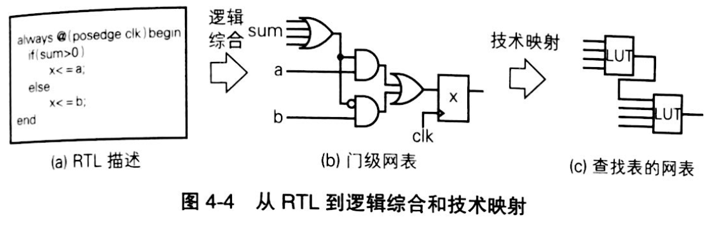
      * 输出是网表文件，其中包括：
         * 逻辑门、触发器等逻辑元素的集合以及它们的连接关系
   * 网表所表示的逻辑映射到FPGA实际的逻辑元素的过程称为技术映射
* RTL仿真
   * 用testbench对RTL电路描述进行仿真的过程
* 布局布线(place and route)
   * 布局布线是利用片上逻辑和布线等资源实现网表的过程 
      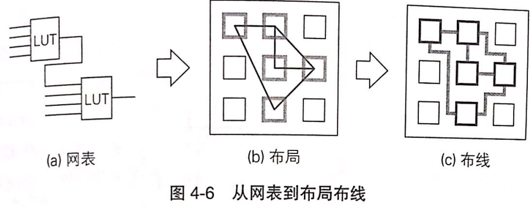
* 配置FPGA
   * 将配置文件通过编程器写入器件 
      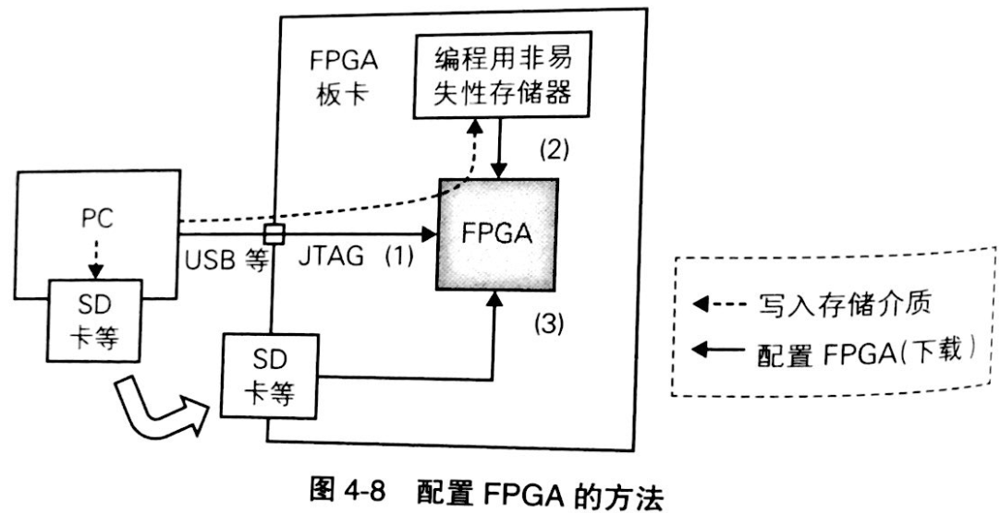
      * 直接通过JTAG写入
      * 通过编程用非易失性存储器写入
      * 通过存储卡或USB存储器写入
* 实机功能验证
* 优化

## HLS设计
* HLS (High Level Synthesis, 高层次综合，或者行为综合)
   * 由行为描述生产电路

### 行为描述
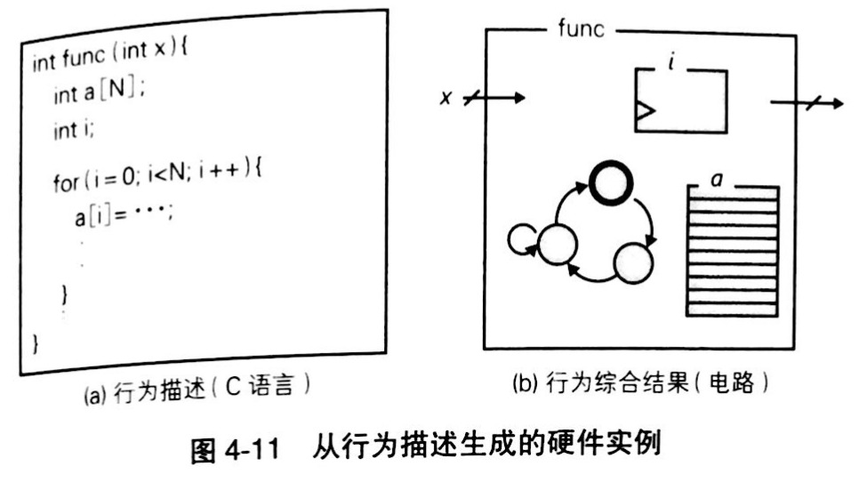

### 行为级仿真
* 定义
   * 用C语言描述的设计对象首先可以作为软件编译并对其实施行为功能验证，这个阶段的仿真称为行为级仿真
* 与RTL仿真的区别
   * 不同于以时钟周期为单位进行事件驱动仿真的RTL级仿真，行为级仿真将设计编译为本地程序执行
   * 优点是：速度快
* 缺点是：没有考虑行为时序，所以无法进行时钟精确的验证

### 行为综合
* 高层次综合或行为综合
   * 从基于C语言的行为级描述生成RTL级描述的过程
* 行为综合的要素 
   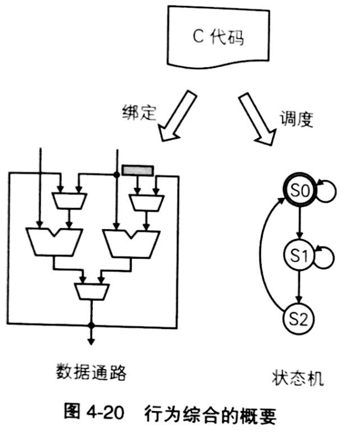
   * 绑定(binding)
      * 将行为记述所使用的变量、数组、运算 -> 寄存器、局部内存、运算器来实现
   * 调度(scheduling)
      * 运算依赖关系 -> 表示为数据流图(DFG)
      * 控制流程 -> 表示为控制流图(CFG)

### 与RTL连接
* 行为综合后的模块再和其他模块群整合

## 包含处理器的设计
* FPGA上的处理器大致可分为
   * 硬核处理器
      * 具备普通处理器的功能，还具备和FPGA连接的结构
   * 软核处理器
      * 在FPGA的可编程逻辑上实现的处理器，需要双重编程

# 设计原理
## FPGA设计流程
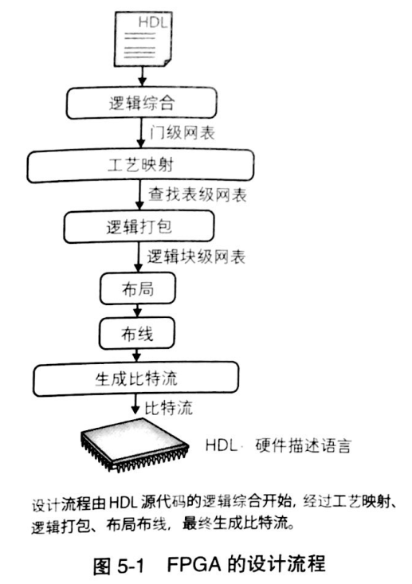
* FPGA的设计流程
   * 逻辑综合
      * 将HDL描述转换为门级网表
   * 工艺映射
      * 将这个网表转换为查找表级别的网表
   * 逻辑打包
      * 将多个查找表和触发器集合到一个逻辑块的过程
   * 布局布线
      * 实现逻辑块的连接
   * 生成比特流

* FPGA和ASIC的区别
   * ASIC通过组合使用标准单元库中的逻辑实现电路
   * 而FPGA则使用统一构造的查找表

## 工艺映射
* 定义
   * 将不依赖于任何工艺的门级网表转换为由特定FPGA逻辑单元所表示的网表的过程
* 工具
   * FlowMap

## 逻辑打包
* 目的
   * 将查找表高效地打包到逻辑块
* 工具
   * VPack
   * AAPack

## 布局布线
* 工具
   * VPR(Versatile Place and Route)

## 低功耗设计工具
* FPGA的动态功耗
   * 对负载电容反复充放电需要消耗能量，该过程中时间和空间上的积分即为动态功耗
* 工具
   * Emap      : 低功耗工艺映射工具
   * P-T-VPack : 低功耗打包工具
   * P-VPR     : 低功耗布局布线工具
   * ACE       : 活动率估算工具

