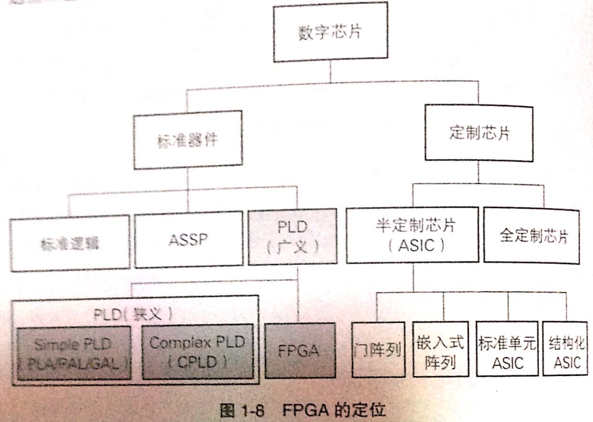

# 序
《FPGA原理和结构》的读书笔记

# 理解FPGA所需的基础知识
## 逻辑电路基础
* 表示逻辑函数的方法有，表达式、真值表、卡诺图、逻辑图、波形图等

### 逻辑代数
* 逻辑运算
   * 与或非
* 布尔代数的定理
   * 交换律，结合律等

### 逻辑表达式
* 标准积之和
   * 与或式，例如：`F(A,B,C,D)=A+B非C+ABC非D`
* 标准和之积
   * 或与式，例如：`F(A,B,C,D)=(A+C+D)(非B+D)(A+非B+非D）`

### 真值表
* 描述逻辑函数的逻辑表达式可以有许多个，而描述逻辑函数的真值表却是唯一的
* 实现真值表所定义的功能的电路称为查找表(Look-up Table, LUT)，是当前主流FPGA的基本单元
* 真值表与逻辑表达式 
   

### 组合逻辑电路
* 逻辑电路根据是否包含记忆元件，分为：
   * 组合逻辑电路
      * 不包含记忆单元
      * 某时间点的输出(逻辑函数值)仅取决于当时的输入
   * 时序逻辑电路
* PLA(Programmable Logic Array，可编程逻辑阵列)
   * 实现AND-OR逻辑电路的器件

### 时序逻辑电路
* 含有记忆元件的逻辑电路被称为时序逻辑电路
* 在时序逻辑电路中，只知道当前的输入并不足以确定当前的输出，也就是说，时序逻辑电路是一种过去的电路状态也会对输出产生影响的逻辑电路
* 时序电路分为：
   * 同步时序逻辑电路
      * 输入和内部状态的变化由时钟信号控制同步进行
   * 异步时序逻辑电路
      * 不需要时钟信号
* 时序逻辑电路中过去的输入所形成并保留下来的状态对当前的输出具有影响，可描述为有限状态机模型： 
   
   * 米勒型时序逻辑电路
      * 输出与输入变量直接相关的时序逻辑电路 
      
   * 摩尔型时序逻辑电路
      * 输出与输入变量无直接关系的时序逻辑电路 
      

## 同步电路设计
* 同步电路设计将系统状态的变化与时钟信号同步，并通过这种理想化的方式降低电路设计难度

### 触发器
* 触发器(Flip Flop, FF)
   * 一种只能存储1个二进制位的存储单元，可用作时序逻辑电路的记忆元件

* D触发器(D-FF)
   * 一种在时钟上升沿(或下降沿)将输入信号的变化传送至输出的边沿触发器 
   

### 建立时间和保持时间
* 为了正确地从输入读取数据，并正确地将数据输出，FPGA内所有的FF都要遵守建立时间和保持时间等时序上的约束

### 时序分析
* 逻辑综合
   * 从硬件语言编写的RTL设计代码 -> 网表(逻辑门间的配线信息)
* 布局和布线
   * 最终决定逻辑综合所生成的电路网表在FPGA中以何种方式实现的两道工序
* 为了保证设计好的电路能正常工作，必须保证
   * 功能(逻辑)正确
   * 时序正确
* 时序分析
   * 静态时序分析(Static Timing Analysis, STA)
      * 遍历电路存在的所有时序路径，根据给定工作条件（PVT）下的时序库.lib文件计算信号在这些路径上的传播延时，检查信号的建立和保持时间是否满足约束要求，根据最大路径延时和最小路径延时找出违背时序约束的错误
      * 不需要给输入激励，只需要提供电路网表就可以进行全面的评估验证，速度快
   * 动态时序分析
      * 主要用于验证设计在器件实际延时情况下的逻辑功能
      * 所有的输入信号都会给一个不同时刻的激励，在testbench（.sp或者.v）中设置一段仿真时间，最后对仿真结果进行时序和功能分析
      * 优点是比较精确，缺点是速度比较慢，而且可能会遗漏一些关键路径(因为需要输入激励)

## FPGA的定位和历史
### FPGA的定位

* FPGA是PLD(Programmable Logic Device, 可编程逻辑器件)的一种

### FPGA的历史
* 20世纪10年代(FPLA、PAL)
   * FPLA - 现场可编程逻辑阵列
   * PLA - 可编程阵列逻辑
* 20世纪80年代
   * GAL(通用阵列逻辑)
   * EPL(可擦除阵列逻辑)
      * SPLD (Simple PLD)，前面的PLD被统称SPLD，因为它们的集成度只有数十到数百门的程度
   * FPGA
   * CPLD(Complex PLD)
* 20世纪90年代
   * FPGA成为了大规模PLD的代表
* 20世纪00年代
   * 百万门时代和系统LSI化

## FPGA专业术语
* ASIC (Application Specific Integrated Circuit, 专用集成电路)
   * 面向特定用途的集成电路
      * 全定制IC
      * 半定制IC
* ASSP (Application Specific Standard Product, 专用标准产品)
   * 某一特定领域或应用的通用LSI
* CPLD (Complex PLD, 复杂可编程逻辑器件)
   * 将多个小规模SPLD作为基本逻辑块，再通过开关链接而成的中规模(大规模)PLD
* DLL (Delay-Locked Loop, 延迟锁定环)
   * 基本功能和PLL相同：可以实现零传输延迟提供低偏移的时钟信号

# FPGA的概要

## FPGA的构成要素

* 岛型(island style)FPGA结构
   * 实现逻辑电路的逻辑要素(逻辑块，Logic Block， LB)
      * 由可以实现任意逻辑电路的可编程部分触发器(Flip-Flop, FF)等数据存储电路和数据选择器组成
   * 和外部进行信号输入/输出的要素(IOB)
   * 连接前两种元素的布线要素
      * 布线通道
      * 开关块(Switch Block, SB)
      * 连接块(Connection Block, CB)

## 可编程技术
FPGA通过可编程的开关来控制电路结构，这种“可编程”的开关可通过以下技术实现：
* EPPROM、EEPROM(技术比较老)
* 闪存
* 反熔丝(通电熔断后导通)
* 静态存储器

### 闪存
* 原理
   * NAND型
      * 写入时需要高电压
   * NOR型
      * 写入时需要大电流
* 优点
   * 非易失
   * 尺寸比SRAM小
* 缺点
   * 重写需要高电压
   * 重写次数有限

### 反熔丝
* 优点
   * 几乎不可能被逆向工程
   * 非易失
* 缺点
   * 无法重写

### 静态存储器
* 采用静态存储器作为可编程开关的FPGA大多在逻辑块中使用查找表，并使用数据选择器等来切换布线连接
* 优点
   * 可重配置
   * 重写次数没有限制
   * 能够应用最先进的CMOS工艺
* 缺点
   * 易失性存储器
   * 接通电阻、负载电容较大

## FPGA的逻辑实现
下面以多路表决电路位例子，解释FPGA上不同的逻辑实现方式：

### 基于乘积项的逻辑实现
* PLA中的逻辑实现是基于乘积项的，简要结构如下： 
   
   * PLA由1个AND阵列和1个OR阵列组成
* 多路表决电路在PLA中的实现如下： 
   

### 基于查找表的逻辑实现
* FPGA上查找表的存储单元大多数是SRAM实现
* k输入的查找表可以实现2^2^k种逻辑函数，例如，k=2时，能表示16种逻辑函数。因为由2^2个SRAM单元，每个单元的值又有1和0两种，所以SRAM可以有2^2^k种选择
* 三输入的查找表结构 
   
* 多路表决器的查找表实现 
   

