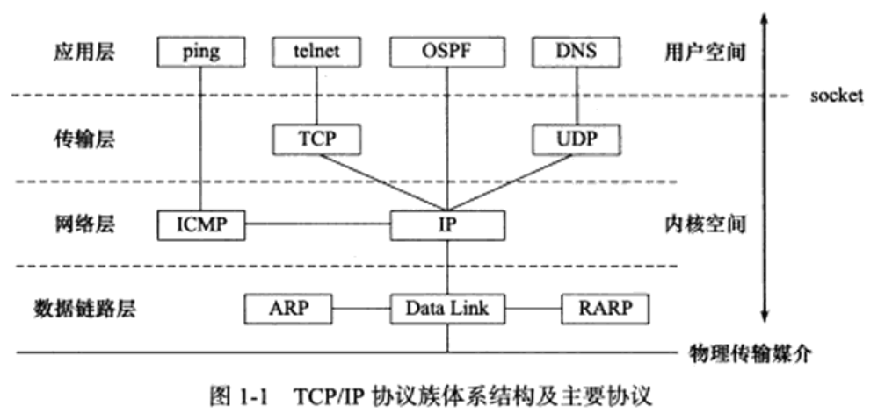
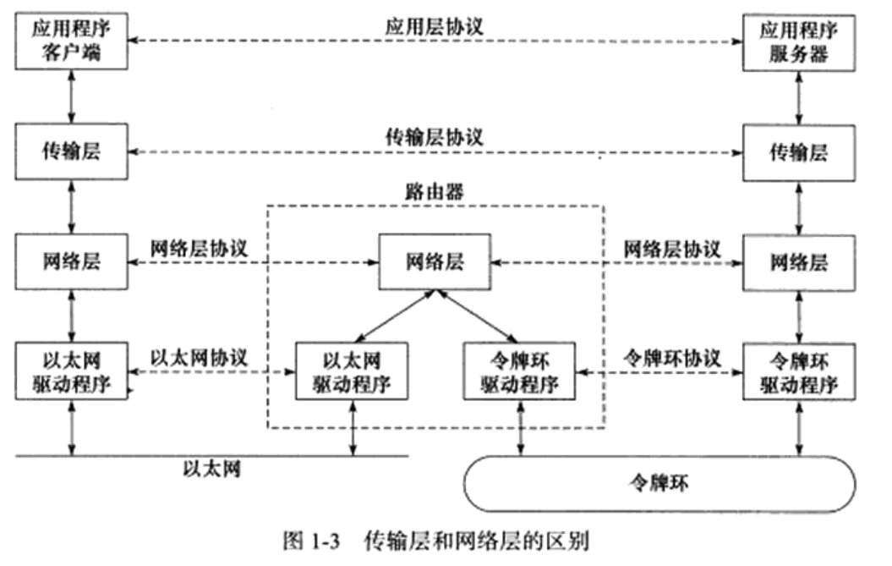
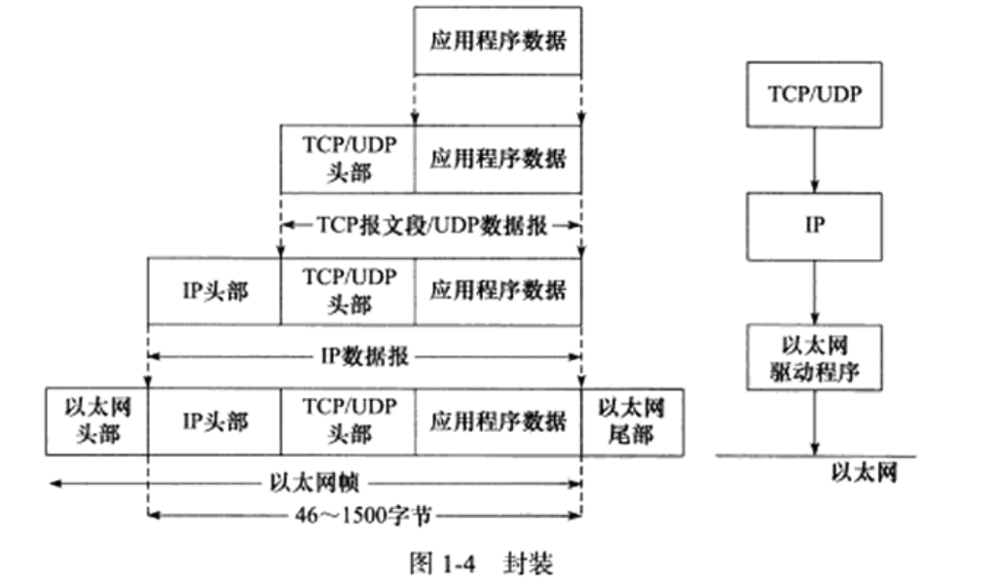
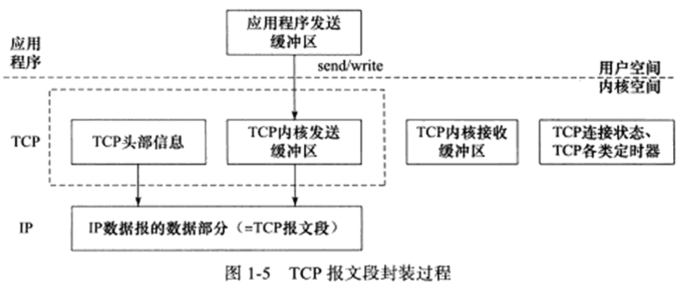
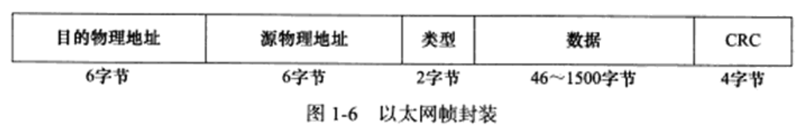

# 序
《Linux高性能服务器编程》 -- 游双

# TCP/IP协议族
## TCP/IP协议族体系结构以及主要协议

### 数据链路层
* 目的 - 实现了IP地址和机器物理地址(MAC地址)之间的转换
    * ARP协议(Address Resolve Protocol, 地址解析协议)
    * RARP协议(Reverse Address Resolve Protocol, 逆地址解析协议)
* 抽象 - 数据链路层隐藏了物理媒介的不同

### 网络层
* 目的 - 实现数据包的选路和转发，网络层的任务是选择主机之间的路由节点，以确定两台主机之间的通信路径
    * IP协议(Internet Protocol, 因特网协议)
    * ICMP协议(Internet Control Message Protocol, 因特网控制报文协议)
        * 用于检测网络连接
* 抽象 - 网络层隐藏了网络拓扑连接的细节

### 传输层

* 目的 - 为两台主机上的应用程序提供端到端(end to end)的通信，与网络层使用的逐跳通信方式不同，传输层只关心通信的起始端和目的端
    * TCP协议(Transmission Control Protocol, 传输控制协议)
    * UDP协议(User Datagram Protocol，用户数报协议)
    * SCTP协议(Stream Control Transmission Protocol, 流控制传输协议)

### 应用层
* 目的 - 处理应用程序的逻辑，在用户空间实现(其他层级在内核中实现)
    * ping应用程序
        * 利用ICMP报文检测网络连接
    * telnet协议
        * 远程登陆协议
    * OSPF协议(Open Shortest Path First, 开放最短路径优先)
        * 动态路由更新协议，用于路由之间的通信
    * DNS协议(Domain Name Service, 域名服务)
        * 提供机器域名到IP地址的转换

## 封装

### TCP封装

* TCP报文段(TCP message segment) - 经TCP封装后的数据
    * 上图中的虚线框构成了TCP报文段，由TCP头部信息和TCP内核缓冲区构成
* UDP数据报(UDP datagram) - 经UDP封装后的数据
    * UDP不保存数据副本，数据发送成功后，内核缓冲区的数据就丢弃了

### IP封装
* IP数据报(IP datagram) - 经过IP封装后的数据
    * 其数据部分可能是
        * TCP报文段
        * UDP数据报
        * ICMP报文

### 数据链路层封装
* 帧(frame) - 经过数据链路层封装的数据
    * 以太网帧(ethernet frame) - 在以太网上传输
    * 令牌环帧(token ring frame) - 在令牌环网络上传输

* 最大传输单元(Max Transmit Unit, MTU) - 最多能携带多少上层协议数据
    * 上图的以太网帧的MTU是1500字节，过长的IP数据报需要被分片(fragment)传输

