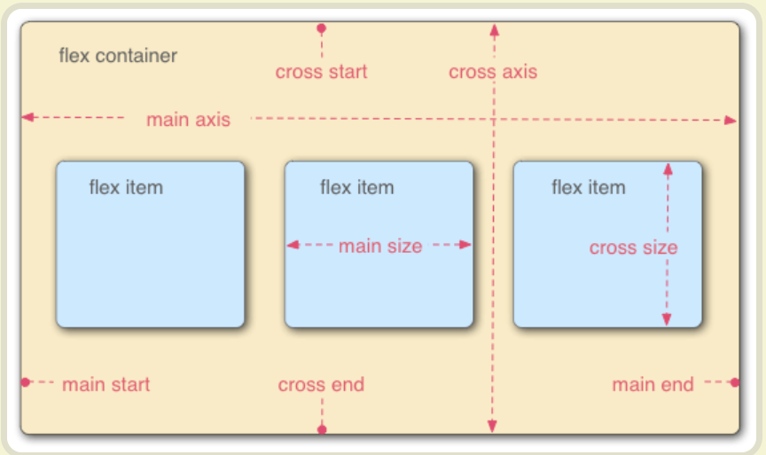
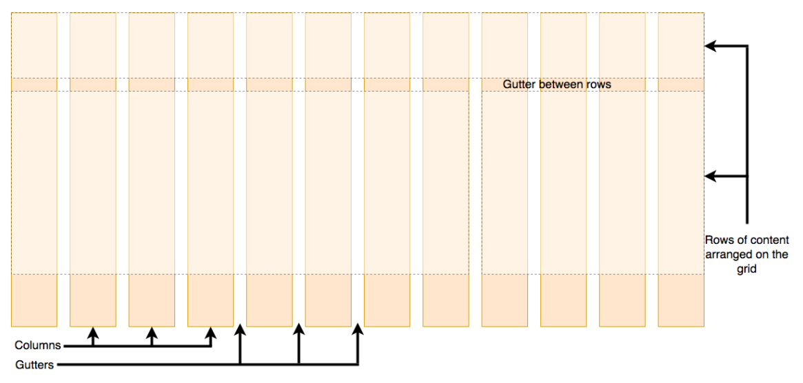
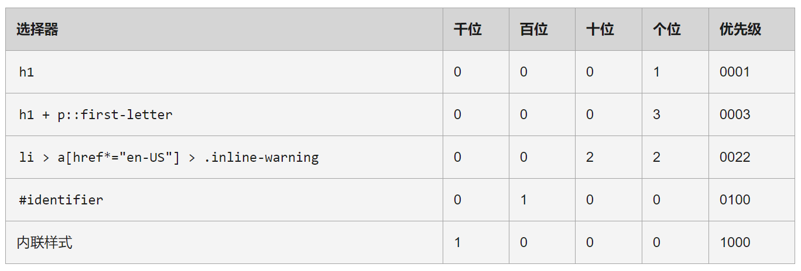
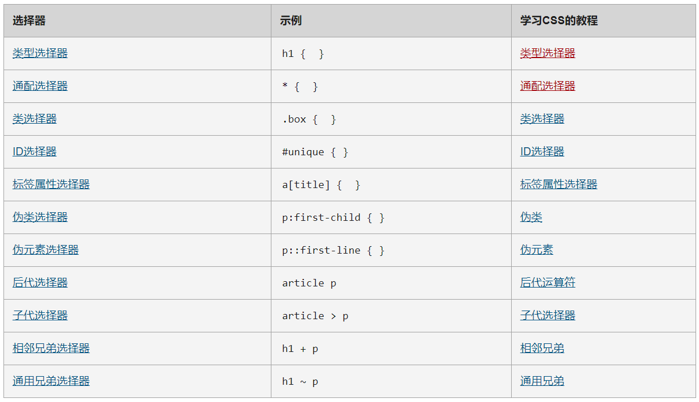

# CSS -- 设计Web
[MDN Learn CSS](https://developer.mozilla.org/zh-CN/docs/Learn/CSS)的读书笔记。

# CSS排版

## [正常布局流](https://developer.mozilla.org/zh-CN/docs/Learn/CSS/CSS_layout/Normal_Flow)

### 默认情况下，元素时如何布局的？
* 块级元素
    * 每个块级元素会在上一个元素下面另起一行，它们会被设置好的margin分隔(重叠情况下，用更大的margin)
* 内联元素
    * 不会另起一行；只要在其父级块级元素的宽度内有足够的空间，它们与其他内联元素、相邻的文本内容（或者被包裹的）被安排在同一行。如果空间不够，溢出的文本或元素将移到新的一行

## [弹性盒子](https://developer.mozilla.org/zh-CN/docs/Learn/CSS/CSS_layout/Flexbox)
弹性盒子是一种用于按行或按列布局元素的**一维**布局方法，可以改变正常布局流。元素可以膨胀以填充额外的空间, 收缩以适应更小的空间。通过[一个简单的例子](./code/flexbox/index.html)可以观察弹性盒子的效果。



### 行还是列
```css
flex-direction: column;
```
* 默认值时row，可以将主轴方向变成column

### 换行
```css
flex-wrap: wrap
```

### 水平和垂直对齐
```css
div {
  display: flex;
  align-items: center;
  justify-content: space-around;
}
```
* align-items
    * 控制flex item在交叉轴上的位置。
* justify-content
    * 控制flex item在主轴上的位置。

## [网格](https://developer.mozilla.org/zh-CN/docs/Learn/CSS/CSS_layout/Grids)
CSS网格是一个用于web的**二维**布局系统。

### 什么是网格布局？


### 定义一个网格
```css
.container {
    display: grid;
    grid-template-columns: 200px 200px 200px;
}
```
* 定义了三个宽度为200px的列

### 网格间隙
```css
.container {
    display: grid;
    grid-template-columns: 2fr 1fr 1fr;
    grid-gap: 20px;
}
```
* `grid-gap`属性用于定义列和行的间隙

### 显式网格与隐式网格
```css
.container {
  display: grid;
  grid-template-columns: repeat(3, 1fr);
  grid-auto-rows: 100px;
  grid-gap: 20px;
}
```
* `grid-auto-rows`和`grid-auto-columns`属性可以手动设定隐式网格的大小。默认参数是auto，即根据放入的内容自动调整
* `minmax`函数为一个行/列的尺寸设置了取值范围。比如设定为`minmax(100px, auto)`，那么尺寸就至少为100像素

## 响应式设计
响应式设计是描述Web设计的一种方式、或者是一组最佳实践的一个词，它是用来建立可以响应查看内容的设备的样式。

### 媒介查询
```css
@media screen and (min-width: 800px) {
  .container {
    margin: 1em 2em;
  }
} 
```
* 当Web页面是屏幕媒体（也就是说不是印刷文档），且视口至少有800像素宽时，应用.container选择器的CSS样式

### 灵活网格
```css
.col {
  width: 6.25%; /* 60 / 960 = 0.0625 */
} 
```
* 利用百分比布局

### 现代布局技术
现代布局方式有：
* 多栏布局
    ```css
    .container {
        column-count: 3;
        column-width: 10em; /* min width */
    } 
    ```
* 伸缩盒
    ```css
    .container {
        display: flex;
    }

    .item {
        flex: 1; /* 占用的空间是在设置 padding 和 margin 之后剩余的空间 */
    } 
    ```
* CSS网格
    ```css
    .container {
        display: grid;
        grid-template-columns: 1fr 1fr 1fr; /* 三个列轨道 */
    }
    ```

### 响应式排版
```css
html {
    font-size: 1em;
}

h1 {
    font-size: 2rem;
}

@media (min-width: 1200px) {
    h1 {
        font-size: 4rem; /* 基础字体的四倍大 */
    }
} 
```

# CSS构建基础

## [层叠与继承](https://developer.mozilla.org/zh-CN/docs/Learn/CSS/Building_blocks/Cascade_and_inheritance)

### 冲突规则

层叠规则：
* 当应用两条同级别的规则到一个元素的时候，写在后面的就是实际使用的规则

优先级规则：
* 一个元素选择器不是很具体 — 会选择页面上该类型的所有元素 — 所以它的优先级就会低一些
* 一个类选择器稍微具体点 — 它会选择该页面中有特定class属性值的元素 — 所以它的优先级就要高一点

继承规则：
* 一些设置在父元素上的css属性是可以被子元素继承的，如：`color`, `font-family`；有些则不能，如：`width`, `margins`, `padding`, `borders`
    * 可以通过每个CSS属性的定义查看是否能被继承，例如，[color](https://developer.mozilla.org/zh-CN/docs/Web/CSS/color)属性的定义

### 理解层叠
三个因素：
* 资源顺序
    * 如果两条规则权重相同，后面的规则会覆盖前面的规则
* 优先级
    * 范围更小的优先级更高，只覆盖相同属性
    * ID选择器 > 类选择器 > 元素选择器，其他选择器参考[文档](https://developer.mozilla.org/zh-CN/docs/Web/CSS/CSS_Selectors)
    * 

## [CSS选择器](https://developer.mozilla.org/zh-CN/docs/Learn/CSS/Building_blocks/Selectors)

### 选择器列表
```css
h1,
.special {
    color: blue;
} 
```
* `h1`和`。special`通过一个逗号组成了一个选择器列表，应用相同的样式

### 选择器的种类
```css
h1 { } /*类型(元素)选择器*/
.box { } /*类选择器*/
#unique { } /*ID选择器*/
a[title] { } /*标签属性选择器*/
a:hover { } /*伪类选择器*/
p::first-line { } /*伪元素选择器*/
article > p { } /*组合器*/
```


