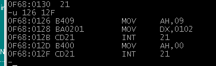

# 王爽《汇编语言》读书笔记

# 第0章 汇编环境搭建
## Windows98下的Debug环境搭建
“debug”工具是早期windows版本中的汇编调试工具，我们可以用这个工具测试一些汇编语句。
* 如何安装debug工具？
   * 由于win10中不含有此工具，推荐安装win98虚拟机，可参考[网页](https://dellwindowsreinstallationguide.com/windows98se-vmwareplayer/)
* debug工具有哪些常用命令？
   * 可通过？查看，或参考[文档](https://thestarman.pcministry.com/asm/debug/debug2.htm#T)<br>
   
### 16位hello例子
* 在debug工具中，输入hello汇编代码到xxxx:0100地址，并通过`g =100`运行，结果如下：<br>

* 通过`d 100 130`命令dump地址0x100的内存，可以看出内存中的字符就是上面汇编代码输入的字符，结果如下：<br>

* 通过`u 126 12F`命令反汇编地址0x126内存中的二进制代码，和上面的汇编代码也是一致的，结果如下：<br>


## Ubuntu20搭建汇编环境
Linux下编译x86的汇编代码需要安装nasm：`sudo apt install nasm`，下面介绍如何在Linux64位系统下编译运行不同位数的汇编代码，可参考对应的[Makefile](./code/hello/Makefile)。

### 64位hello例子
* [代码](./code/hello/hello.asm)
* 编译方式：`nasm -felf64 hello.asm && ld hello.o -o main`
* 运行方式：可直接在terminal中运行，`./main`

### 32位hello例子
* [代码](./code/hello/hello_32.asm)
* 编译方式：`nasm -felf32 hello_32.asm && ld -m elf_i386 -s hello_32.o -o main_32`
* 运行方式：可直接在terminal中运行，`./main_32`
* 运行方式：可直接在terminal中运行，`./main_32`

### 16位hello例子
* [代码](./code/hello/hello_16.asm)
* 编译方式：`nasm -f bin -o main.com hello_16.asm`
* 运行方式
   * 由于编译的时候选择了`-f bin`，所以编译出的是bin文件，需要在dos下运行
   * Linux下可安装dosbox工具运行bin文件，具体参考[网页](https://forum.nasm.us/index.php?topic=1297.0)
   * 在dosbox下运行的结果如下:<br>
   

# 第1章 基础知识
## 汇编语言的产生

为了便于人类记忆，将操作机器指令转换成汇编指令：
* 操作：寄存器BX的内容送到AX中
* 机器指令：1000100111011000
* 汇编指令：mov ax,bx

16位x86寄存器：<br>


32位x86寄存器：<br>


64位x86寄存器：<br>


## 汇编语言的组成
汇编语言有3类指令：
* 汇编指令(核心)
   * 机器码的助记符，有对应的机器码
* 伪指令
   * 没有对应的机器码，由编译器执行，计算机并不执行
* 其他符号
   * 如+、-、*、/等，没有对应的机器码

## CPU对存储器的读写
CPU要想进行数据的读写，必须和外部期间进行下面3类信息交互：
* 存储单元的地址(地址信息)
* 器件的选择，读或写的命令(控制信息)
* 读或写的数据(数据信息)

CPU通过总线和存储芯片交互，总线从逻辑上也分3类：
* 地址总线
* 控制总线
* 数据总线

## 内存地址空间


很多外部设备，如内存，显卡，网卡都由RAM或者ROM构成，CPU访问这类设备由一个共同点：
* CPU对它们进行读或写的时候都通过控制线发出内存读写命令


向地址C000~FFFF的内存单元中写入数据的操作是无效的，因为这等于改写只读存储器中的内容。

# 第2章 寄存器
CPU中的内部组件：
* 运算器 - 进行信息处理；
* 寄存器 - 进程信息存储；
* 控制器 - 控制各种器件进行工作；
* 内部总监 - 连接各种器件，在它们之间进行数据的传送。

汇编程序主要是对寄存器的操作，寄存器是CPU中程序员可以用指令读写的部件，程序员通过改变各种寄存器中的内容来实现对CPU的控制。

## 通用寄存器
AX、BX、CX、DX这四个16位寄存器称为通用寄存器，用于存储一般数据。
* 16位数字如何存储到通用寄存器中？
   * 如果AX中存放0x4E20，则表示AH里面是4E，AL里面是20

常见汇编指令:<br>


## 8086CPU给出物理地址的方法
问题：8086CPU是16位的，但是有20位地址，达到1MB寻址能力。是如何将内部16位地址转换成20位的物理地址？


当8086CPU要读写内存时：
* CPU中的相关部件提供两个16位的地址，一个称为**段地址**，另一个称为偏移地址；
* 段地址和偏移地址通过内部总线送入一个称为地址加法器的部件；
* 地址加法器将两个16位地址合成为一个20位的物理地址；
   * 物理地址=段地址*16+偏移地址
* 地址加法器通过内部总线将20位物理地址送入输入输出控制电路；
* 20位物理地址被地址总线传送到存储器。

## 段寄存器
内存没有被划分成一个一个段，段的划分来自于CPU。8086CPU在访问内存时要由相关部件提供内存单元的段地址和偏移地址。段地址在8086CPU的段寄存器中存放，总共有4个段寄存器：CS、DS、SS、ES

## CS和IP
CS和IP寄存器指示了CPU当前要读取指令的地址。CS为代码段寄存器，IP为指令指针寄存器。


上图的过程如下：
* 8086CPU当前状态：CS中的内容为2000H，IP中的内容为000H；
* 内存20000H~20009H单元存放着可执行的机器码；
   * 对应着4条汇编指令
* 加法器运算段地址CS和偏移IP，得到物理地址20000H<br>
   
* 控制电路将物理地址20000H送上地址总线<br>
   
* 从内存20000H单元开始存放的机器指令B8 23 01通过数据总线被送入CPU<br>
   
* 输入输出控制电路将机器指令B8 23 01送入指令缓冲器<br>
   
* IP中的值自动增加<br>
   
* 执行控制器执行指令B8 23 01(即 mov ax,0123H)<br>
   
* 指令B8 23 01被执行后AX中的内容变为0123H
   

上面的过程，大致是：
* 从CS:IP指向的内存单元读取指令，读取的指令进入指令缓冲器；
* IP = IP + "所读取指令的长度"，从而指向下一条指令；
* 执行指令。转到第一步，重复这个过程。

### CPU刚上电时，CS和IP的值是什么？
在8086CPU加电启动或复位后，CS=FFFFH，IP=000H，即在刚启动时，CPU从内存FFFF0H单元中读取指令执行，一般这条指令会启动BIOS程序。计算机的启动过程可参考：[计算机是如何启动的？](https://www.ruanyifeng.com/blog/2013/02/booting.html)

## 修改CS、IP的指令
8086CPU大部分寄存器的值可以用mov指令来改变，但是mov指令不能用于设置CS、IP的值，需要用jmp指令。

* 若想同时修改CS、IP的内容，可用`jmp 段地址：偏移地址`完成，如：
   ```nasm
   jmp 2AE3:3  ;执行后，CS=2AE3H，IP=0003H，CPU将从2AE33H处读取指令
   jmp 3:0B16  ;执行后，CS=0003H，IP=0B16H，CPU将从00B46H处读取指令
   ```

* 若仅向修改IP的内容，可用`jmp 某一合法寄存器`完成，如：
   ```nasm
   jmp ax      ;执行前：ax=1000H, CS=2000H, IP=0003H. 执行后：ax=1000H, CS=2000H, IP=1000H
   ```

# 第3章 寄存器(内存访问)

## DS和[address]
0886CPU中有一个DS寄存器，通常用来存放要访问数据的段地址。比如我们要读取10000H单元的内容，可用如下程序段进行：
```nasm
mov bx,1000H   ;将数据直接送入寄存器
mov ds,bx      ;将一个寄存器中的内容送入另一个寄存器
mov al,[0]     ;将某偏移的内存单元的值送入寄存器
```
上面的3条指令将10000H中的数据读到al中，**注意CPU不支持直接把数据直接送入段寄存器**，因此不能直接写：`mov ds,1000H`

## mov、add、sub指令

* mov指令
   * mov是把值转移到存储单元，除了段寄存器不能直接mov数据以外(需要通过通用寄存器周转)，其他大部分存储单元都可以通过mov把值转移到其内部。
   * 常见的mov指令有：<br>
   

