# 简介
《编译原理》(龙书）的读书笔记

# 引论

## 一个编译器的结构
* 分析analysis - 前端
   * 把源程序分解成多个组成要素
   * 使用此结构创建该源程序的一个中间表示
   * 把源程序存放在一个符号表(symbol table)的数据结构中
   * 符号表将和中间表示形式一起传送给综合部分
* 综合synthesis - 后端
   * 根据中间表示和符号表中的信息来构造用户期待的目标程序
* 详细步骤如下<br>
   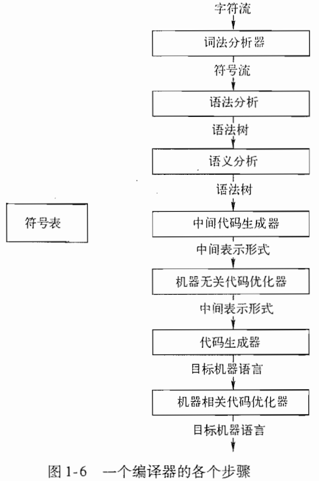

### 词法分析 - lexical analysis
* 目的：生成token
* 对于每个词素，词法分析器产生`<token-name, attribute-value>`词法单元(token)作为输出
   * token-name是一个由语法分析步骤使用的抽象符号
   * attribute-value指向符号表中关于这个词法单元的条目
* `position = initial + rate * 60`语句的词法分析过程
   * `position`词素
      * 被映射成词法单元<id, 1>
         * id表示标识符
         * 1指向符号表中position对应的条目，一个标识符对应的符号表条目存放该标识符有关的信息，比如名字和类型等
   * `=`词素
      * 被映射成<=>
      * 这个词法单元不需要属性，忽略第二个分量
   * `initial`词素
      * 被映射成<id, 2>
   * `+`词素
      * 被映射成<+>
   * `rate`词素
      * 被映射成<id, 3>
   * `*`词素
      * 被映射成<*>
   * `60`词素
      * 被映射成<60>
   * 因此，最终上述赋值语句被表示成：`<id, 1> <=> <id, 2> <+> <id, 3> <*> <60>`<br>
     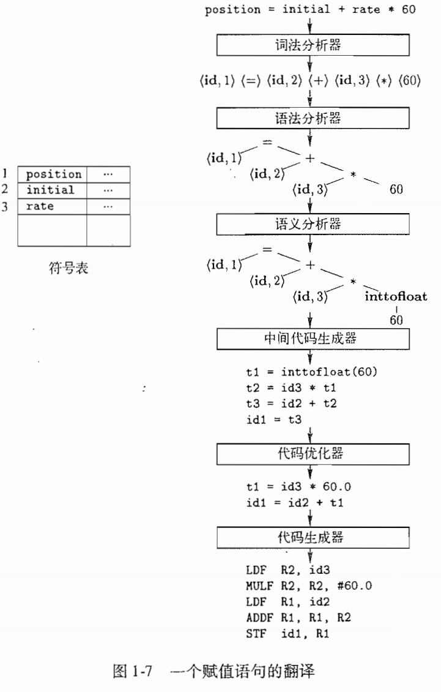

### 语法分析 - syntax analysis
* 目的：根据token-name，生成语法树
* 语法分析器使用由词法分析器生成的各个词法单元的第一个分量来创建树形的中间表示
   * 树种的每个内部结点表示一个运算，而该结点的子结点表示该运算分量

### 语义分析 - semantic analyzer
* 目的：使用语法树和符号表种的信息，检查源程序是否和语言定义的语义一致
   * 类型检查

### 中间代码生成
* 目的：生成一个明确的低级的或类机器语言的中间表示
* 中间表示的两个重要性质
   * 易于生成
   * 能够轻松地翻译为目标机器上的语言
* 三地址代码(three-address code)
   * 每个指令具有三个运算分量，每个运算分量都像一个寄存器，例如：`t3 = id2 + t2`
      * 每个三地址赋值指令的右部最多只有一个运算符
      * 编译器应该生成一个临时名字以存放一个三地址指令计算得到的值
      * 有些三地址指令的运算分量少于三个，如：`id1 = t3`

### 代码优化
编译器可将如下代码优化：
* 优化前
   ```
   t1 = inttofloat(60)
   t2 = id3 * t1
   t3 = id2 + t2
   id1 = t3
   ```
* 优化后
   ```
   t1 = id3 * 60.0
   id1 = id2 + t1
   ```

### 代码生成
* 目的：以源程序的中间表示形式作为输入，映射到目标语言
* 关键：合理分配寄存器以存放变量的值

### 将多个步骤组合成趟
* 定义：每趟读入一个输入文件并产生一个输出文件
* 前端趟：前端步骤中的词法分析、语法分析、语义分析，以及中间代码生成可以被组合在一起成为一趟
* 优化趟：代码优化可以作为一个可选的趟
* 后端趟：为特定目标机生成代码的的后端趟

### 编译器构造工具
* 语法分析器的生成器
   * 可以根据一个程序设计语言的语法描述，自动成词语法分析器
* 扫描器的生成器
   * 可以根据一个语言的语法单元的正则表达式描述，生成词法分析器
* 语法制导的翻译引擎
   * 可以生成一组用于遍历分析树并生成中间代码的例程
* 代码生成器的生成器
* 数据流分析引擎
* 编译器构造工具集
   * 提供了可用于构造编译器的不同阶段的例程的完整集合

## 构建一个编译器的相关科学
### 编译器设计和实现中的建模
* 有穷状态自动机和正则表达式
   * 描述程序的词法单位
   * 描述被编译器用来描述这些单位的算法
* 上下文无关文法
   * 描述程序设计语言的语法结构，比如嵌套的括号和控制结构
* 树形结构
   * 表示程序结构以及程序到目标代码的翻译方法

## 程序设计语言基础
### 静态和动态的区别
* 问题：编译器能够对一个程序做出哪些判定？
* 静态策略
   * 可以在编译时刻决定
* 动态策略
   * 需要在运行时刻做出决定

### 环境与状态
* 环境
   * 是一个从名字到存储位置的映射。因为变量就是指内存位置(左值)，因此环境可以说是，名字到变量的映射。
* 状态
   * 是一个从内存位置到他们的值的映射，即状态把左值映射为它们的相应右值。

环境和状态映射是动态的，但也有例外：<br>
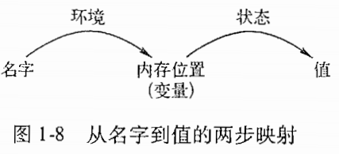
* 名字到位置的静态绑定与动态绑定
   * 某些声明(如全局变量)可以在编译器生成目标代码时一劳永逸地分配一个存储位置
* 从位置到值的静态绑定与动态绑定
   * 一般来说，位置到值的绑定也是动态的，因为外面无法在运行一个程序之前指出一个位置上的值。
   * 被声明的常量时一个例外，如：`#define ARRAYSIZE 1000`

### 静态作用域和块结构
一个声明的作用域有该声明在程序中出现的位置隐含地决定，C语言使用静态作用域，其作用域规则是：
* 一个C程序由一个顶层的变量和函数声明的序列组成
* 函数内部可以声明变量，变量包括局部变量和参数。每个这样的声明的作用域被限制在它们所出现的那个函数内。
* 名字x的一个顶层声明的作用域包括其后的所有程序。但是如果一个函数中也由一个x的声明，那么函数中的那些语句就不再这个顶层声明的作用域内

* 块
   * 块(block)是声明和语句的一个组合，C语言使用`{}`来界定一个块
   * 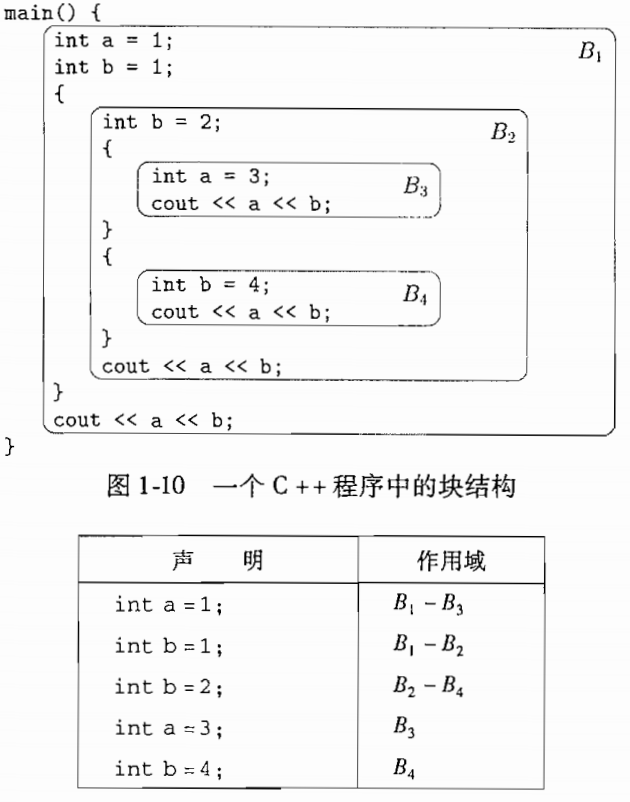

### 显示访问控制
* public, private和protected
* 声明和定义
   * 声明告诉我们事物的类型
   * 定义告诉我们它们的值

### 动态作用域
如果一个作用域策略依赖于一个或多个只有在程序执行时刻才能知道的因素，它就是动态的。例如:
* C预处理器中的宏扩展
* 面向对象编程中的方法解析
   * 多态

* 静态作用域和动态作用域的类比
   * 动态规则处理时间的方式类似于静态作用域处理空间的方式
      * 静态规则让我们寻找的声明位于最内层的、包含了变量使用位置的单元中
      * 动态规则让我们寻找的声明位于最内层的、包含了变量使用时间的单元(过程调用)中

### 参数传递机制
* 值调用(call-by-value)
   * 对实在参数求值(如果是表达式)或拷贝(如果是变量)
* 引用调用(call-by-reference)
   * 实在参数的地址作为相应的形式参数的值被传递给被调用者
* 名调用
   * 实在参数以字面方式替换了被调用者的代码中的形式参数(类似宏替换)，由于有歧义，已经不再采用

## 总结
* 作用域规则：一个x的声明的作用域是一段上下文，在此上下文中对x的使用指向这个声明。如果仅仅通过阅读某个语言的程序就可以确定其作用域，那么这个语言就使用了静态作用域，或者说词法作用域。否则，这个语言就使用了动态作用域。
* 环境：名字和内存位置关联，然后再和值相关联。这个情况可以使用环境和状态来描述。其中环境把名字映射成为存储位置，而状态把位置映射到它的值。

# 一个简单的语法制导翻译器
## 引言
本章的目的：通过开发一个可运行的Java程序，将具有代表性的程序设计语言语句翻译为三地址代码(一种中间表示形式)，着重阐述如下的前端模型。<br>
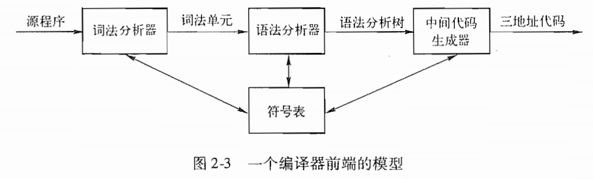
* 先建立一个能够将中缀算术表达式转换为后缀表达式的语法制导翻译器
   * 后缀表达式是一种将运算符置于运算分量之后的表示方法，如：`9-5+2`的后缀形式是`95-2+`
   * 目的是：简化语法分析器，使得它再处理运算分量和运算符时只需要考虑单个字符
* 接下来考虑中间代码的生成<br>
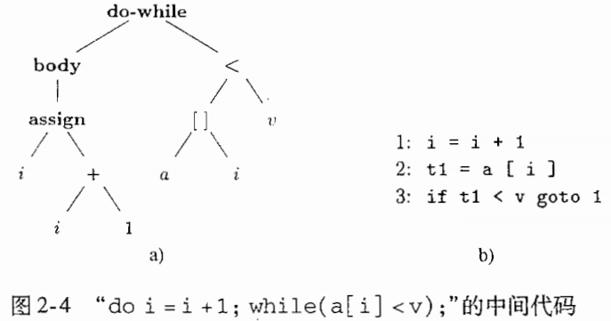
   * 抽象语法树
   * 三地址代码
      * 指令形式：`x = y op z`，其中op是一个二目运算符，y和z是运算分量的地址，x是运算结果的存放地址。三地址指令最多只指向一个运算，通常是计算、比较或者分支跳转运算

## 语法定义
* 产生式：`stmt -> if (expr) stmt else stmt`
   * `->`表示“可具有如下形式”
   * 终结符号：关键字if和括号等
   * 非终结符：expr和stmt这样的变量

### 文法定义
* 上下文无关文法就是说这个文法中所有的产生式左边只有一个非终结符
   * 对应的如`aSb -> aaSbb`就是以上下文相关文法，因为它的第一个产生式左边有不知一个符号，所以你在匹配这个产生式中的S的时候必须要确保这个S有正确的“上下文”
* 上下文无关文法(四个元素)
   * 词法单元(名字+属性)：一个终结符号集合
   * 语法变量：一个非终结符号集合
   * 一个产生式集合，用来表示某个**构造**的某种书写形式
      * 如果产生式头非终结符号代表一个构造，那么该产生式体就代表了该构造的一种书写方式
   * 指定一个非终结符为开始符号
* 例子：加减法表达式，如：`9-5+2`，的文法产生式如下：
   ```
   list -> list + digit | list - digit | digit
   digit -> 0|1|2|3|4|5|6|7|8|9
   ```

### 推导
* 可以从开始符号推导得到的所有终结符号串的集合称为该文法定义的语言
* 语法分析的任务是：
   * 接受一个终结符号串作为输入，找出从文法的开始符号推导出这个串的方法

### 语法分析树
* 语法分析树用图形方式展现了从文法的开始符号推导出相应语言中的符号串的过程
   * 如果非终结符号A有一个产生式`A->XYZ`，那么再语法分析树种就可能有一个标号为A的内部结点，该结点有三个子结点，从做享有标号分别为X、Y、Z
* 一棵语法分析树具有以下性质
   * 根结点的标号为文法的开始符号
   * 每个叶子结点的标号为一个终结符号或空串
   * 每个内部结点的标号为一个非终结符号
   * 如果非终结符号A是某个内部结点的标号，并且它的子结点的标号从左到右分别为X1，X2，... Xn，那么比如存在产生式A->X1X2...Xn。如果A->空串ε是一个产生式，那么标号为A的结点可以只有一个标号为ε的子结点
* 上例中`9-5+2`的推导可以用下图中的树来演示：<br>
   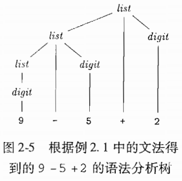
   * 一棵语法分析树的叶子结点从左向右构成了树的结果，也就是从这棵语法分析树的根结点上的非终结符号推导得到的符号串

### 二义性
* 二义性定义
   * 一个文法可能有多棵语法分析树能够生成同一个给定的终结符号串
* 例子，以下文法具有二义性：`string -> string + string | string - string |0|1|2|3|4|5|6|7|8|9`<br>
   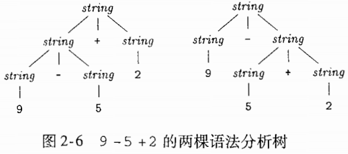

### 运算符的结合性
* 四则运算是左结合，赋值是右结合
   * 例如`a=b=c`可由如下文法产生(对比上面的加减文法，非终止符的位置不同)：
   ```
   right -> letter=right | letter
   letter -> a | b | ... | z
   ```
   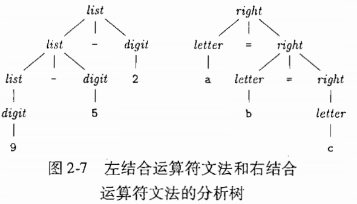

### 运算符的优先级
* 问题：如何构建算术表达式的文法？
* 优先级递增分类，同一级别上的运算符具有相同的结合性和优先级
   * 左结合：+ -
   * 左结合：* /
* 创建非终结符
   * `factor`
      * 不能被任何运算符分开的表达式
   * `term`
      * 可能被高优先级的运算符*和/分开，但不能被低优先级分开的表达式
   * `expr`
      * 可被任何运算符分开的表达式
* 算术表达式文法
   ```
   expr -> expr + term | expr - term | term
   term -> term * factor | term / factor | factor
   factor -> digital | (expr)
   ```

## 语法制导翻译
* 目的：将中缀表达式翻译成后缀表达式，并用于表达式求值
### 后缀表示
* 后缀表示中不需要括号，因为其只有一种解码方式
### 综合属性
* 注释语法分析树
   * 一棵语法分析树的各个结点上标记了相应的属性值
   * 我们用X.a表示该结点上X的属性a的值
   * 下图显示了`9-5+2`的一棵注释分析树<br>
   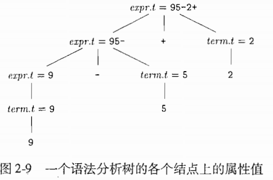
* 综合属性定义
   * 如果某个属性在语法分析树结点N上的值式由N的子结点以及N本身的属性值确定，那么这个属性就称为综合属性(synthesized attribute)
   * 只需要对语法分析树进行一次自底向上的遍历，就可以计算出属性的值
### 简单语法制导定义
* 要得到代表产生式头部的非终结符号的翻译结果的字符串，只需要将产生式体中各非终结符号的翻译结果安装它们在非终结符号中的出现顺序连接起来，并在其中穿插一些附加的串即可。具有这个性质的语法制导定义称为简单语法制导定义。

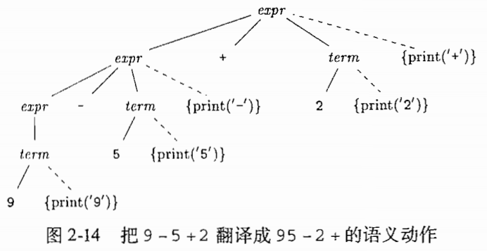
* 上图后续遍历执行时会打印出：`95-2+`，不需要任何附加空间来存放子表达式的翻译结果
* 与注释分析树(把字符串作为属性附加到语法分析树中的结点上)不同，此处是吧翻译结果以增量方式打印出来

### 翻译方案
* 算术表达式的产生式
```
expr -> expr + term
      | expr - term
      | term
term -> term * factor
      | term / factor
      | factor
factor -> digit | (expr)
```
* 后缀表达式翻译方案
```
expr -> expr + term {print('+')}
      | expr - term {print('-')}
      | term
term -> term * factor {print('*')}
      | term / factor {print('/')}
      | factor
factor -> digit {print(digit)} | (expr)
```
* 前缀表达式翻译方案
```
expr -> {print('+')} expr + term
      | {print('-')} expr - term
      | term
term -> {print('*')} term * factor
      | {print('/')} term / factor
      | factor
factor -> digit {print(digit)} | (expr)
```

## 语法分析
* 语法分析式决定如何使用一个文法生成一个终结符号串的过程
* 大多数语法分析方法都可以归入以下两类(构造顺序不同)：
   * 自顶向下(top-down)方法
      * 构造过程从根结点开始，逐步向叶子结点方向进行
      * 容易手工构造出高效的语法分析器
   * 自底向上(bottom-up)方法
      * 构造过程从叶子结点开始，逐步构造出根结点
      * 可以处理更多文法和翻译方案

### 自顶向下分析方法
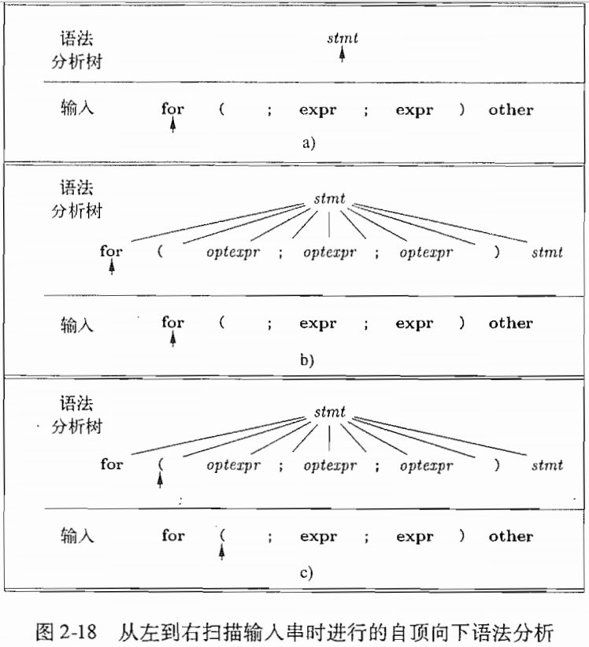
* a)语法分析树的已知部分只包含标号为开始非终结符号stmt的根结点
* b)非终结符号必须推导出一个以向前看符号for开头的串，在文法中，stmt只有一个产生式可以推导出这样的串，所以我们选择这个产生式，并构造出根节点的各个子结点，并使用该产生式中的符号作为这些子结点的标号
* c)如果当前正考虑的语法分析树结点的标号式一个终结符号，而且此终结符号与向前看符号匹配，那么语法分析树的箭头和输入的箭头都前进一步。
* d)再下一步将使得语法分析树的箭头指向标号为非终结符号optexpr的子结点，并将输入的箭头指向终结符号";"。在标号为optexpr的非终结符号上，我们需要再次为一个非终结符号选择产生式。以ε为体的产生式需要特殊处理。

### 预测分析法
* 递归下降分析法(recursive-descent parsing)是一种自顶向下的语法分析方法，它使用一组递归过程来处理输入。文法的每个非终结符都有一个相关联的过程。
   * 预测分析法是递归下降分析法的一种简单形式，各个非终结符号对应的过程中的控制流可以由向前看符号无二义地确定

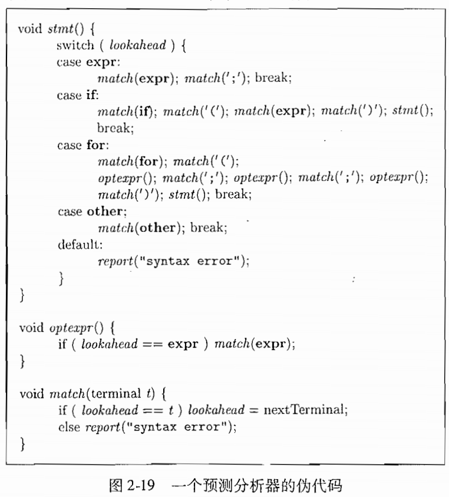
* 在分析输入串时出现的过程调用序列隐式地定义了该输入串的一棵语法分析树，如果需要，还可以通过这些过程调用来构建一个显示的语法分析树
* 每个非终结符都产生一个相对应的过程调用，以`for(;expr;expr)other`输入为例子：
   * lookhead被初始化为第一个终结符号`for`
   * 执行和如下产生式对应的代码：`stmt -> for(optexpr;optexpr;optexpr)stmt`

* 预测分析需要知道那些符号可能成为一个产生式所生成串的第一个符号
   * FIRST(α)定义为可以由α生成的一个或多个终结符号串的第一个符号集合，例如：
      * `FIRST(stmt) = {expr, if, for, other}`
      * `FIRST(expr;) = {expr}`
      * 如果由两个产生式A->α，A->β，预测分析法要求FIRST(α)和FIRST(β)不相交，那么就可以用向前看符号来确定应该使用哪个产生式
         * 如果向前看符号在FIRST(α)中，就使用α；反之，则使用β

### 何时使用ε产生式
* 我们的预测分析其在没有其他产生式可用时，将ε产生式作为默认选择使用，可参考`optexpr`过程

### 设计一个预测分析器
* 对于文法的任何非终结符号，它的各个产生式体的FIRST集合互不相交
* 如果我们有一个翻译方案(即一个增加了语义动作的文法)，那么我们可以将这些语义动作当作此语法分析器的过程的一部分执行
* 一个预测分析器程序由各个非终结符对应的过程组成，对应于非终结符A的过程完成以下两个任务：
   * 检查向前看符号，决定使用A的哪个产生式
      * 如果一个产生式的体为α，且向前看符号在FIRST(α)中，那么就选择这个产生式
      * 对于任何向前看符号，如果两个非空的产生式体存在冲突，我们就不能对这种文法使用预测语法分析
      * 如果A有ε产生式，那么只有当向前看符号不在A的其他产生式体的FIRST集合中时，才会使用A的ε产生式
   * 然后，这个过程模拟被选中产生式的体，从左开始逐个执行此产生式体中的符号
      * 执行一个非终结符号的方法时调用该非终结符号对应的过程

## 简单表达式的翻译器
* 预测语法分析器不能处理左递归的文法
### 抽象语法和具体语法
* 抽象语法树和语法分析树
   * 抽象语法树中，内部结点代表的是程序构造
      * 每个内部结点代表一个运算符，该结点的子结点代表这个运算符的运算分量
   * 语法分析树中，内部结点代表的是非终结符号
      * 存在辅助符号，比如那些代表项、因子或其他表达式变体的非终结符号
* 我们有时把语法分析树称为具体语法树，而相应的文法称为该语言的具体语法

### 调整翻译方案
* 将左递归的算术表达式`A->Aα|Aβ|γ`，转换成右递归：
   ```
   A->γR
   R->αR|βR|ε
   ```
* 消除左递归后，翻译方案变为：
   ```
   expr -> term rest
   rest -> + term {print('+')} rest
         | - term {print('-')} rest
         | ε
   term -> digit {print(digit)}
   ```

### 非终结符号的过程
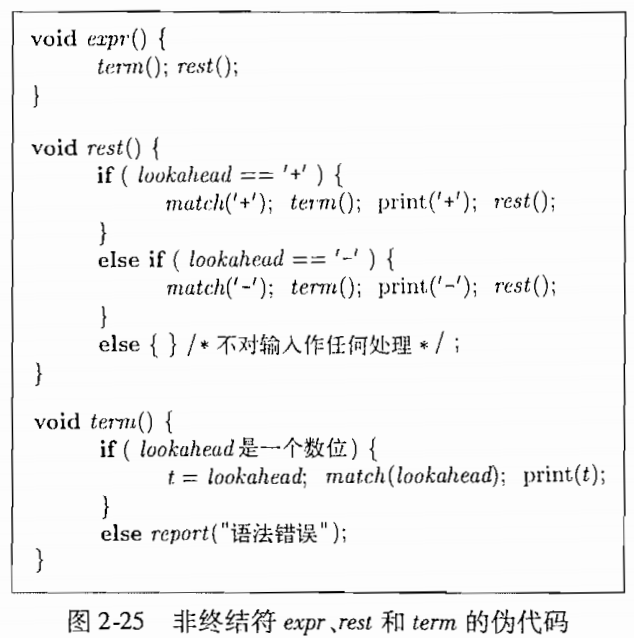

### 翻译器的简化
* 尾递归
   * 如果一个过程体中执行的最后一条语句是对该过程的递归调用，那么这个调用就称为尾递归(tail recursive)
* 对于没有参数的过程，一个尾递归调用可以被替换为跳转到过程开头的语句，例如上面的`rest`尾递归过程可以被改写为：<br>
   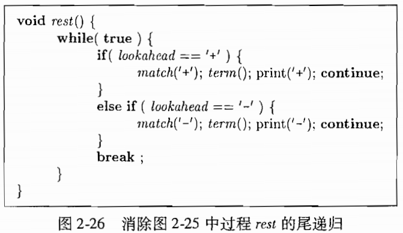
* 参见[代码](./code/postfix/)

## 词法分析
* 构成一个词法单元的输入字符序列称为词素(lexeme)
* 扩展上面的文法，使其支持乘除法和标识符id
   ```
   expr -> expr + term {print('+')}
         | expr - term {print('-')}
         | term
   term -> term * factor {print('*')}
         | term / factor {print('/')}
         | factor
   factor -> (expr)
         | num {print(num.value)}
         | id {print(id.lexeme)}
   ```

### 预读
* 在决定向语法分析器返回哪个词法单元前，词法分析器可能需要预先读入一些字符
   * 一种简单的解决方法是使用一个变量，如peek，来保存下一个输入字符
   * 当词法分析器返回一个词法单元时，变量peek要么保存了当前词法单元的词素后的那个字符，要么保存空白符

### 常量
* 词法分析器向语法分析器传送一个词法单元，例如：`31+28+59`会被转换成序列`<num, 31> <+> <num, 28> <+> <num, 59>`

### 识别关键字和标识符
* 关键字
* 标识符，用来为变量、数组、函数等命名
   * 通常把标识符当作终结符号来进行处理，例如：`count = count + increment;`会被转换成`<id, "count"><=><id, "count"><+><id, "increment"><;>`
* 本节中的词法分析器使用一个表来保存字符串，从而解决了两个问题：
   * 单一表示
   * 保留字

### 词法分析器
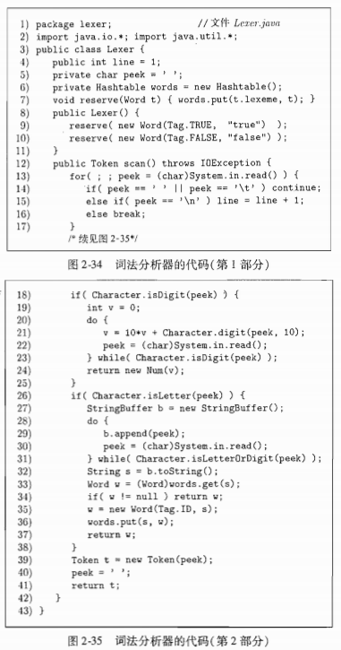

## 符号表
* 我们为每个作用域建立一个单独的符号表来实现作用域
* 我们让语法分析器来创建符号表，因为语法分析器知道一个程序的语法结构，因此相对于词法分析器而言，语法分析器通常更时候创建条目，可以更好地区分一个标识符的不同声明

### 为每个作用域设置一个符号表
* 最近嵌套
   * 例子<br>
   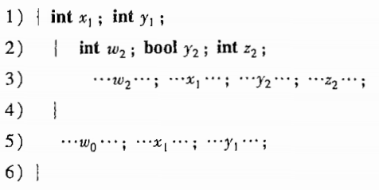
   * 符号表链<br>
   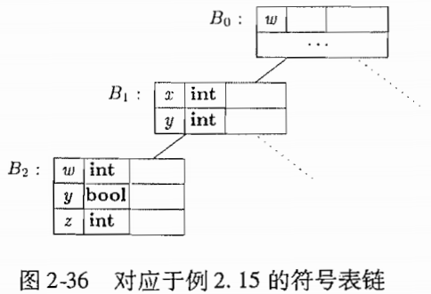
      * B1对应于从第1行开始的语句块
      * 图的顶端时符号表B0，它记录了全局的或由语言提供的默认声明
   * 符号表链代码<br>
   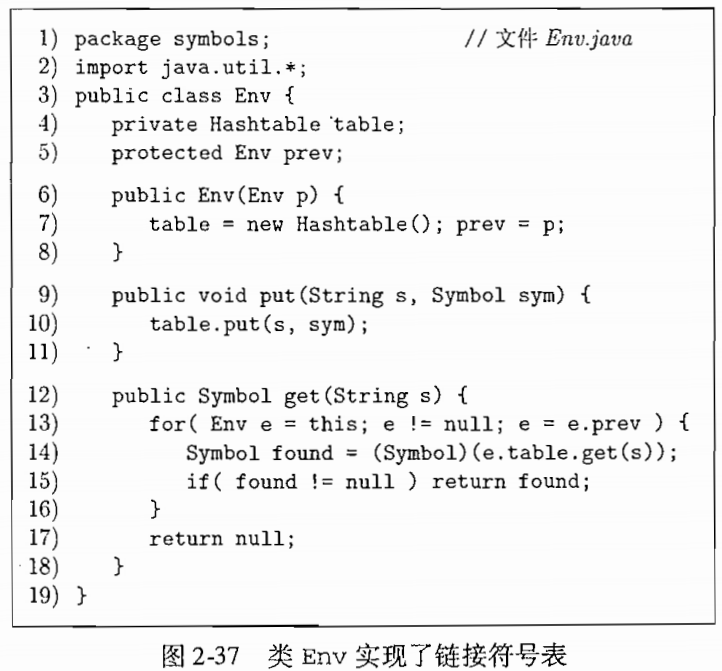

### 符号表的使用
* 符号表的作用是
   * 将信息从声明的地方传递到实际使用的地方
   * 当分析标识符x的声明时，一个语义动作将有关x的信息“放入”符号表中
* 如何使用类`Env`？<br>
   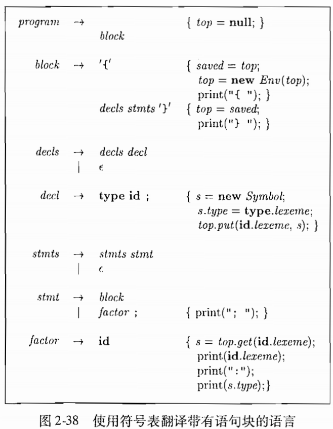
   * 在进入和离开块的时候分别创建和释放符号表
   * 变量top表示一个符号表链的顶部和顶层符号表
   * 第一个产生式`program->block`
      * 在block之前的语义动作将top初始化为null，即不包含任何条目
   * 第二个产生式`block->'{'decls stmts'}'`
      * 包含了进入和离开块时的语义动作
         * 在decls之前，一个语义动作使用局部变量saved保存了对当前符号表的引用
         * 在离开块时，'}'之后的一个语义动作将top的值恢复为进入块时保存起来的值
   * 声明`decl->type id`的结果时创建一个对应于已声明标识符的新条目
   * 产生式`factor->id`中的语义动作通过符号表获取这个标识符的条目

## 生成中间代码

### 两种中间表示形式
* 两种形式：
   * 树型结构，包括语法分析树和抽象语法分析树
      * 将创建抽象语法树的结点来表示有意义的程序构造，随着分析的进行，信息以与结点相关的属性的形式被添加到这些结点上，选择哪些属性要依据待完成的翻译来决定
   * 线性表示形式，特别是“三地址代码”
      * 没有层次化的结构

### 语法树的构造
* 例子：`while(expr)stmt`
   * 具有语义含义的组成部分是表达式expr和语句stmt
   * 有一个运算符`while`，它有两个子结点--分别是expr和stmt的抽象语法树

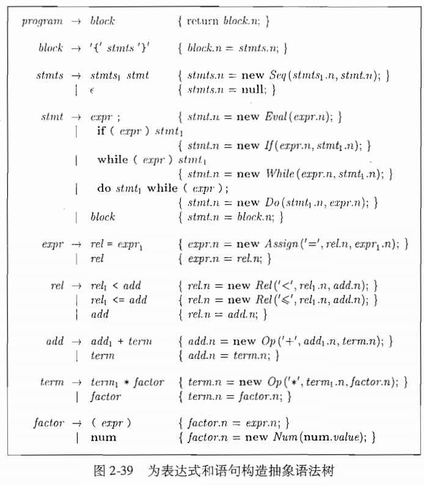

* 语句的抽象语法树
   * 我们在抽象语法中为每一种语句构造定义了相应的运算符
      * 对于以关键字开头的构造，我们使用这个关键字作为对应的运算符

### 静态检查
* 静态检查包括
   * 语法检查
      * 语法要求比文法中的要求的更多
   * 类型检查

* 左值和右值
   * 术语左值和右值分别表示可以出现在赋值表达式左部和右部的值
      * 右值是我们通常所说的“值”
      * 左值是存储位置
   * 静态检查要确保一个赋值表达式的左部表示的是一个左值

* 类型检查
   * 类型检查确保一个构造的类型符合其上下文对它的期望

### 三地址码
* 关键问题：如何通过遍历语法树来生成三地址代码？
* 三地址指令
   * `x = y op z`
* 语句的翻译
   * 通过利用跳转指令实现语句内部的控制流，我们就可以将语句转换成为三地址代码
   * 例子：翻译`if expr then stmt1`，代码布局如下：<br>
   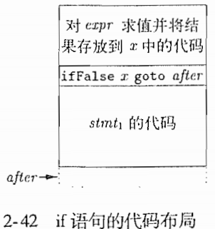
   * 类if中的函数gen生成三地址代码<br>
   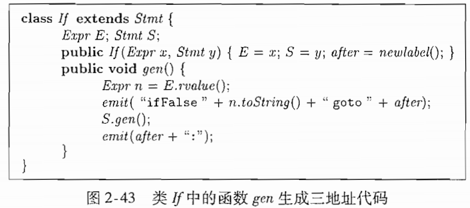
      * If的gen函数调用E.rvalue()函数来翻译表达式E，然后发生一个条件跳转指令，并调用S.gen()来翻译子语句S

* 表达式的翻译
   * 表达式类型有：二目运算符op、数组访问和赋值运算
   * 左值伪代码<br>
   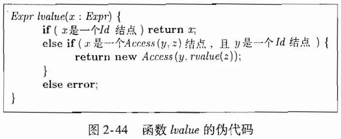
      * 此结点对应一个标识符(即x的类是Id)
      * 此结点代表一个数组访问，比如a[i]，x的类是Access(y, z)，类Access是类Expr的子类，y表示被访问数组的名字，而z表示被访问元素在该数组中的偏移量
      * 以数组访问`a[2*k]`为例，`return new Access(y, rvalue(z))`，其中，y对应于a的结点，z是对应于表达式(2 * k)的结点。对rvalue(x)的调用生成了表达式(2 * k)的代码(即三地址语句t = 2 * k)，并返回表示临时名字t的新结点z'。这个结点就成为新的Access结点x'的第二各字段的值
   * 右值伪代码<br>
   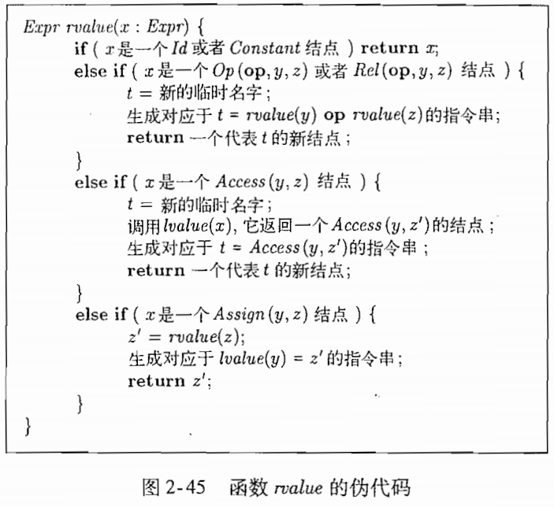
      * 当x代表一个标识符或常量时，rvalue返回x本身
      * 其他情况下，都返回一个对应于新的临时名字t的Id结点
      * 以`a[i] = 2 * a[j-k]`为例子，它的语法树将生成：
      ```
      t3 = j - k
      t2 = a[t3]
      t1 = 2 * t2
      a[i] = t1
      ```
      * 上述三地址代码产生过程：
         * 这棵语法树的根是Assign结点，它的第一个参数是a[i]，第二个参数是2 * a[j-k]
            * 考虑第二个参数是Assign的一个结点，适用于rvalue函数的Assign情况
               * rvalue函数被递归地应用于2 * a[j-k]，这个子树的根结点是Op(*)节点，适用于rvalue的Op情况
                  * rvalue先创建一个临时变量t1，然后处理左运算分类2，再处理右运算分类
                     * 常量2没有生成三地址代码，rvalue返回它的右值，即一个值为2 的Constant节点
                     * 右运算分量a[j-k]是一个Access结点，因此rvalue创建一个新的临时变量t2，然后在这个结点上调用lvalue函数
                        * 函数rvalue被递归的调用来处理表达式j-k，这个调用的符作用是创建临时变量t3，然后生成三地址语句t3 = j - k
                     * 接着，函数的执行返回到正在处理a[j-k]的函数lvalue的活动中，临时名字t2被赋予整个数组访问表达式的右值，即t2 = a[t3]
               * 返回到处理Op结点2 * a[j - k]的rvalue活动中
            * 最后，应用于整个表达式的rvalue的调用活动在最后调用lvalue来处理左部a[i]，然后生成了一条三地址指令a[i] = t1

## 总结
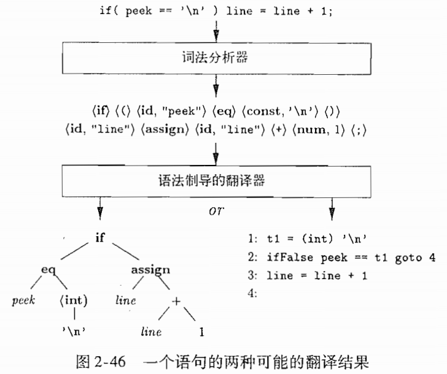
* 源语言文法
   * 产生式：产生式头 -> 产生式体
* 在程序构造中附加属性
* 词法分析器输出一个词法单元的流
* 语法分析从一个文法的开始符合推导出一个给定的终结符号串
   * 创建一棵语法分析树，该树的根结点的标号为文法的开始符合，每个非叶子接待你对应于一个产生式，每个叶子结点的标号为一个终结符号或空串
   * 语法分析树推导出由它的叶子结点从左到右组成的终结符号串
* 预测语法分析法，从顶向下(从语法分析树的根结点到叶子结点)
   * 预测分析器有对应于每个非终结符号的子过程，该过程的过程体模拟了这个非终结符号的各个产生式
* 语法制导翻译通过在文法中添加规则或程序片段来完成
   * 语法制导的翻译方案在产生式体中嵌入了称为语义动作的程序片段，这些语义动作按照语法分析中产生式的使用顺序执行
* 语法分析的结果式源代码的一种中间表示形式，称为中间代码
   * 抽象语法树：各个结点代表了程序构造，一个结点的子结点给出了该构造有意义的子构造
   * 三地址代码：指令序列，每个指令只执行一个运算
* 符号表
   * 存放有关标识符的信息的数据结构

# 一个完整的编译器前端
* [代码](。/code/front_end_all/src)
   * main
   * lexer
   * symbol
   * parser
   * inter
      * 处理用抽象语法表示的语言结构

## 源语言
这个语言的产生式如下：
* 第一级别：声明(basic表示基本类型)和语句
```
program -> block
  block -> { decls stats }
  decls -> decls decl | ε
   decl -> type id;
   type -> type [num] | basic
  stmts -> stmts stmt | ε
```
* 第二级别：赋值和控制语句
   * `loc`代表location(存储位置)
   * `bool`代表表达式
   * 把赋值当作一个语句(而不是表达式中的运算符)可以简化翻译工作
```
   stmt -> loc = bool;
         | if (bool) stmt
         | if (bool) stmt else stmt
         | while (bool) stmt
         | do stmt while (bool);
         | break;
         | block
    loc -> loc[bool] | id
```
* 第三级别：表达式
   * 表达式的产生式处理了运算符的结合性和优先级
   * 非终结符`factor`用来表示括号中的表达式、标识符、数组引用和常量
```
   bool -> bool || join | join
   join -> join && equality | equality
equality-> equality == rel | equality != rel | rel
    rel -> expr < expr | expr <= expr | expr >= expr | expr > expr | expr
   expr -> expr + tem | expr -term | term
   term -> term * unary | term / unary | unary
  unary -> !unary | -unary | factor
 factor -> (bool) | loc | num | real | true | false
```


