# Introduction
This is book notes for "Computer Organization and Design RISC-V Edition" book and 《计算机组成与设计：硬件/软件接口》.

# Preface
## Why this book?
The purpose of this book is to show the relationship between hardware and software. At least the next decade, most programmers are going to have to understand the hardware/software interface if they want programs to run efficiently on parallel computers.

## Why RISC-V?
* RISC-V, which was developed originally at UC Berkeley, not only cleans up the quirks of the MIPS instruction set, but it offers a simple, elegant, modern take on what instruction sets should look like in 2017.
* There are open-source RISC-V simulators, compilers, debuggers, and so on easily available and even open-source RISC-V implementations available written in hardware description languages.

## Goal
* Demonstrate the importance of understanding modern hardware to get good performance and energy efficiency with a concrete example.
* Help readers separate the forest from the trees by identifying eight great ideas of computer architecture early and then pointing out all the places they occur throughout the rest of the book.
* Recognize he generation change in computing from the PC era to the post-PC era.
* Spread the I/O material throughout the book rather than have it in its own chapter.

# Computer Abstractions and Technology
## Key Question
* What level of cost/performance computers will have in the future?

## Introduction
Applications that were economically infeasible suddenly become practical:
* Computers in automobiles
* Cell phones
* Human genome project
* World Wide Web
* Search engines

### 你能从本书中学到什么
* 高级语言编写的程序如何翻译成硬件之间的语言？硬件如何执行程序？
* 什么是软硬件之间的接口，以及软件如何知道硬件完成其功能？
* 哪些因素决定了程序的性能？程序员如何才能改进程序性能？
* 什么技术可供硬件设计者用于改进性能？
* 硬件设计者可使用哪些技术提高能效？
* 为什么串行处理近年来发展为并行处理？这种发展带来的结果是什么？
* 计算机架构师提出的哪些伟大的思想构成了现代计算机的基础？

### 什么影响了程序性能？
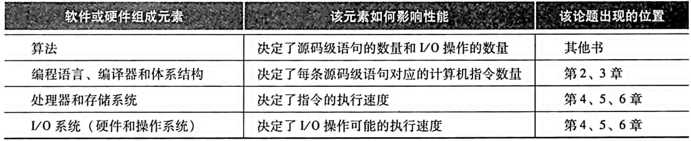

## 计算机系统结构中的8个伟大思想
* 面向摩尔定律的设计
   * 摩尔定律指出单芯片上的集成度每18~24个月翻一翻
* 使用抽象简化设计
   * 提高硬件和软件生产率的主要技术之一是使用抽象来表示不同的设计层次，在高层次中看不到低层次的细节，只能看到一个简化的模型
* 加速大概率事件
   * 加速大概率事件远比优化小概率事件更能提高性能
* 通过并行提高性能
* 通过流水线提高性能
* 通过预测提高性能
* 存储器层次
   * 速度最快、容量最小并且每位价格最昂贵的存储器处于顶层，而速度慢、容量最大且每位价格最便宜的存储器处于最底层
* 通过冗余提高可靠性

## 程序概念入门
### 系统软件
系统软件是提供常用服务的软件，包括操作系统、编译程序、加载程序和汇编程序等。
* 操作系统
   * 处理基本的输入和输出操作
   * 分配外存和内存
   * 为多个应用程序提供共享计算机资源的服务
* 编译程序
   * 把高级语言编写的程序翻译成硬件能执行的指令

### 从高级语言到硬件语言
* 使用数字既表述指令又表示数据是计算机的基础
* 使用高级语言的好处
   * 可以使程序员用更自然的语言思考
   * 提高程序员的生产率
   * 提高了程序相对于计算机的独立性

## 硬件概念入门
任何一台计算机的基础硬件都要完成：
* 输入数据
* 输出数据
* 处理数据
* 存储数据

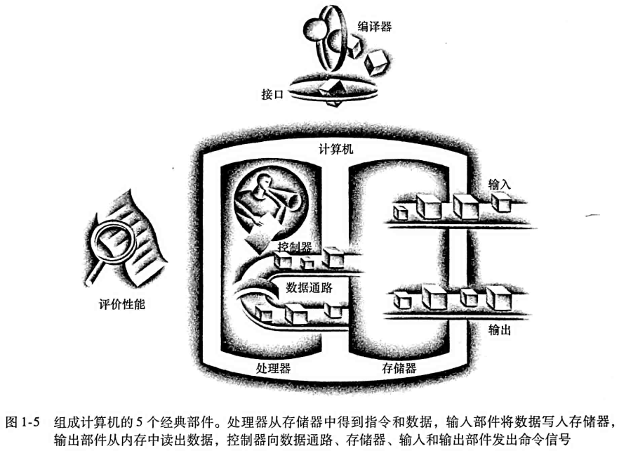

### 处理器
处理器从逻辑上包括两个主要部件：
* 数据通路(datapath)
   * 负责完成算术运算
* 控制器(control)
   * 负责指导数据通路、存储器和I/O设备按照程序的指令正确执行

### 硬件和底层软件之间的接口 - 体系结构
计算机中最重要的抽象之一是硬件和底层软件之间的接口，该抽象被命名为计算机的指令集体系结构。

* 指令集体系结构(instruction set architecture)
   * 也叫体系结构，是低层次软件和硬件之间的抽象结构，包含了需要编写正确运行的机器语言程序所需要的全部信息，包括指令、寄存器、存储访问和I/O等
* 应用二进制接口(ABI)
   * 用户部分的指令加上应用程序员调用的操作系统接口，定义了二进制层次可移植的计算机的标准
   * 一般来说，操作系统需要封装I/O操作、存储器分配和其他低级的系统功能细节，以便应用程序员无需再这些细节上分心

计算机体系结构可以让计算机设计者独立地讨论功能，而不必考虑具体硬件。例如，我们讨论数字时钟的功能(如计时、显示时间、设置闹钟)时，可以不涉及时钟的硬件(如石英晶体、LED显示、按钮)。计算机设计者将体系结构与体系结构的实现(implementation)分开考虑也是沿着同样的思路：硬件的实现方式必须依照体系结构的抽象。

## 处理器和存储器制造技术
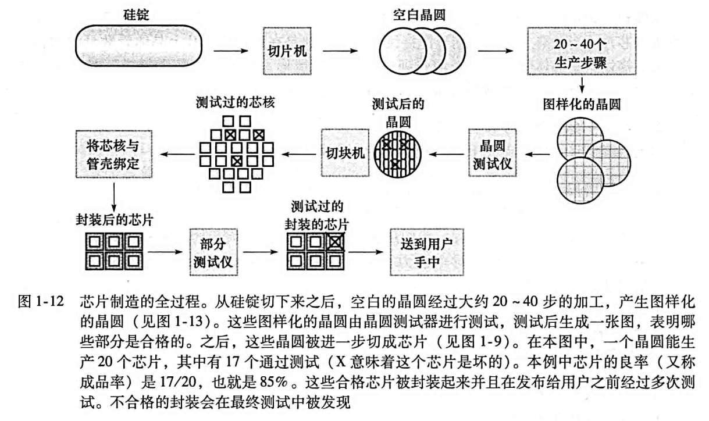
* 硅锭
   * 一块由硅晶体组成的棒
* 晶圆
   * 厚度不超过0.1英寸的硅锭片，用来制造芯片
* 芯片
   * 从晶圆中切割出来的一个单独的矩形区域
* 成品率
   * 合格芯片数占总芯片数的百分比
   * 当芯片尺寸增大时，集成电路的价格会快速上升，因为成品率和晶圆中芯片的总数都下降了。为了降低价格，大芯片常采用下一代工艺进行尺寸收缩，从而改进每晶圆的芯片数和成品率

## 性能
### 性能的度量
* 响应时间
   * 指从开始一个任务到该任务完成的时间，包括硬盘访问、内存访问、I/O活动、操作系统开销和CPU执行时间等
* 吞吐率
   * 也叫带宽(bandwidth)，性能的另一种度量参数，表示单位时间内完成的任务数量
* CPU执行时间
   * 执行某一任务再CPU上所花费的时间
* 用户CPU时间
   * 再程序本身所花费的CPU时间
* 系统CPU时间
   * 为执行程序而花费再操作系统上的时间
* 系统性能
   * 表示空载系统的响应时间
* CPU性能
   * 表示用户CPU时间

### 经典的CPU性能公式

* CPU性能及其因素
   * 一个程序的CPU执行时间 = 一个程序的CPU时钟周期数 * 时钟周期时间

* 指令的性能
   * CPU时钟周期数 = 程序的指令数 * 每条指令的平均时钟周期数
   * CPI (clock cycle per instruction)
      * 表示执行每条指令所需的时钟周期数的平均值

* CPU性能公式
   * `CPU时间 = 指令数 * CPI * 时钟周期时间`，或`CPU时间 = 指令数 * CPI / 时钟频率`

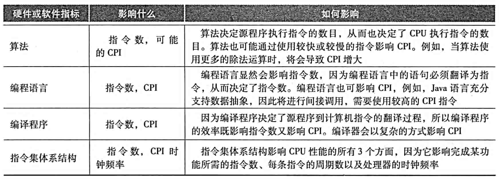

## 从单处理器向多处理器转变

功耗的极限迫使微处理器的设计产生了巨变。在2006年，所有桌面和服务器公司都在单片微处理器中加入了多个处理器，以求更大的吞吐率，而不再继续追求降低单个程序运行在单个处理器上的响应时间。在过去，程序员可以依赖于硬件、体系结构和编译程序的创新，无需修改一行代码，程序的性能每18个月翻一番。而今天，程序员想要显著改进响应时间，必须重写他们的程序以充分利用多处理器的优势。

### 为什么程序员编写显式并行程序如此困难？
* 并行编程以提高性能为目的，必然增加编程的难度。不仅程序要正确，而且运行速度要快，还需要为用户或其他程序提供接口以便使用
* 为了发挥并行硬件的速度，程序员必须将应用划分为每个核上有大致相同数量的任务，并同时完成。还要尽可能减小调度的开销，以不至于浪费并行性能
   * 挑战包括：调度、负载平衡、通信以及同步等开销

# 指令：计算机的语言
本章的目的：讲解符合“设备简单性”原则的一种指令集，介绍它怎样用硬件表示，以及它和高级编程语言之间的关系。

## 引言
ISA (instruction set architecture) is an abstract interface between the hardware and the lowest-level software that encompasses all the information necessary to write a machine language program that will run correctly.

指令集的两种形式：
* 人们编程书写的形式
* 计算机所能识别的形式

instruction set
   * The vocabulary of commands understood by a given architecture.

### 为什么指令集种类繁多，但是差异性却很小？
* 因为所有计算机都是基于基本原理相似的硬件技术所构建的
* 因为所有计算机都必须提供一些基础操作

### 什么是存储程序概念？
存储程序概念(stored-program concept), 即多种类型的指令和数据均以数字形式存储于存储器中的概念，存储程序型计算机即源于此。

### 指令集的组成部分
* 操作数
   * 寄存器(registers)
   * 存储器字(memory words)
* 汇编语言
   * 算术
      * 加法
      * 减法
      * 立即数加法
   * 数据传送
      * 在存储器和寄存器之间移动数据的命令
      * 立即数传输到寄存器
   * 逻辑
      * 与或非
      * 逻辑左移、右移
   * 条件分支
   * 无条件跳转

下图使RISC-V的指令集： 
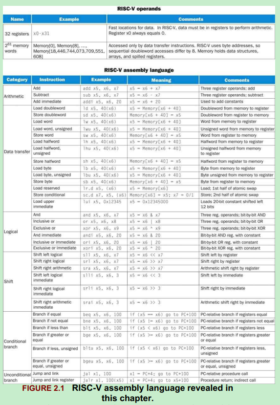

## 硬件设计原则
硬件设计三条基本原则：
* 简单源于规整
   * 硬件算术操作体现了简单性
* 越小越快
   * 寄存器个数的限制，体现了此原则，大量的就差年起可能会使时钟周期变长
* 优秀的设计需要适宜的折中方案
   * 例如，即希望所有指令长度相同，又系统具有统一的指令格式，会因为指令长度不够而产生冲突。

## 计算机硬件的操作数
### 存储器操作数
由于RISC-V(或者MIPS)的算术运算指令只对寄存器进行操作，因此必须包含在存储器和寄存器之间传送数据的指令。这些指令叫做数据传送指令(data transfer instruction)。

### 常数或立即数操作数
常数操作数出现频率高，而且相对于从存储器中取常数，包含常数的算术运算指令执行速率快很多，并且能效较低。

## 计算机中指令的表示
指令在计算机内部是以若干或高或低的电信号的序列表示的，并且形式上和数的表示相同。

### 指令格式(instruction format)
指令的布局形式叫指令格式，以RISC-V的`add x9, x20, x21`为例，其指令格式如下：
* 十进制表示 
   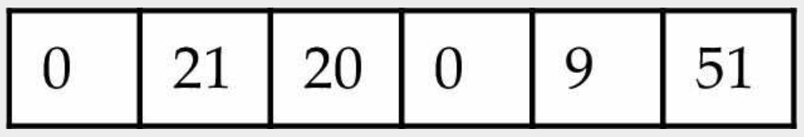
* 二进制表示 
   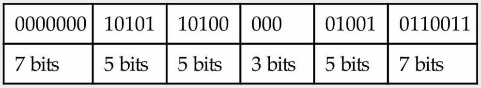
   * 由上图可知，这是一条32位指令，RISC-V的指令长度都是32位的

指令的数字形式称为机器语言(machine language)，这样的指令序列叫机器码(machine code)。

### RISC-V字段
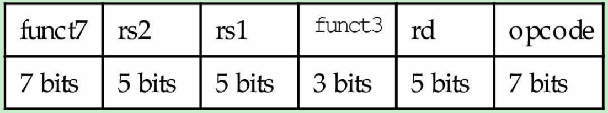
* opcode
   * 指令的基本操作，通常称为操作码(opcode)
* rd
   * register destination
   * 用于存放操作结果的目的寄存器
* funct3/funct7
   * 一般称为功能码(function code)，用于指明opcode字段中操作的特定变式
   * funct3占3-bits
   * funct7占7-bits
* rs1/rs2
   * register source
   * 源操作数寄存器

### 如何解决指令长度和指令格式的冲突？
由于指令长度无法满足有些指令功能，为了保持所有的指令长度相同，不同类型的指令采用了不同的指令格式。

RISC-V的指令格式类型：
* R型 
   
   * 用于寄存器操作
* I型 
   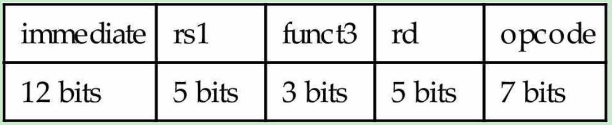
   * 用于立即数操作，如：数据传送指令，或立即数加法addi等
   * 以`ld x9, 64(x22) // Temporary reg x9 gets A[8]`指令为例：
      * 22(寄存器x22)存放于rs1字段
      * 64存放于immediate字段
      * 9(寄存器x9)存放于rd字段
* S型 
   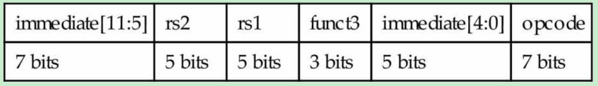
   * 用于双字数据传输至存储器的指令，如:`sd x5,40(x6)`
      * 目标地址是通过immediate字段和rs2得到的
      * 之所以讲immediate拆分成两处，是为了尽量保持三种指令格式其他字段位置的统一

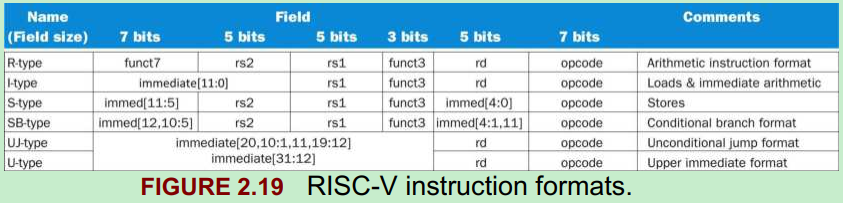

