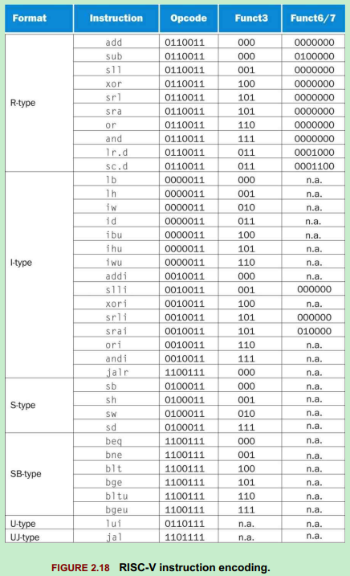
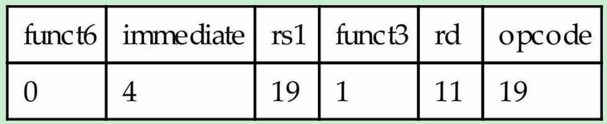
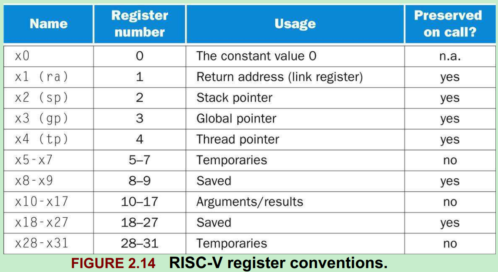
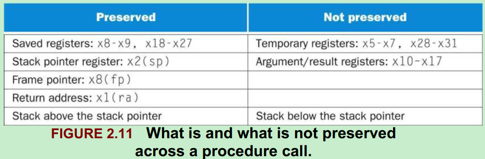
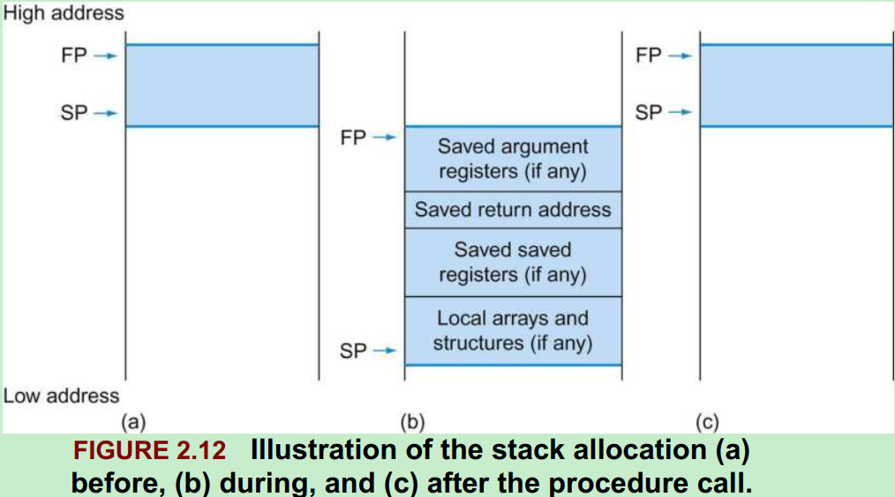
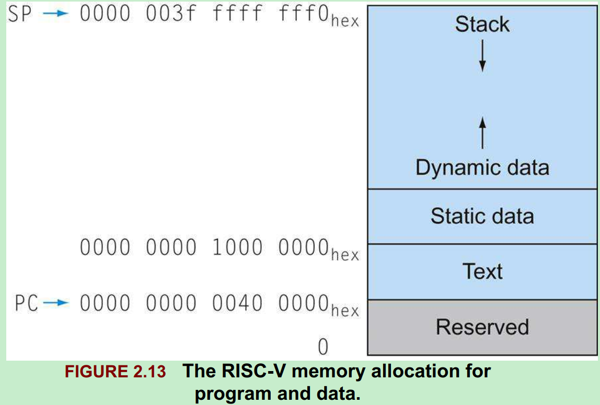
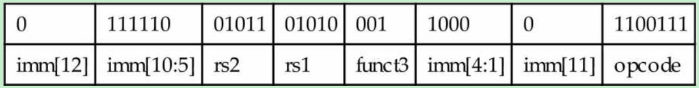
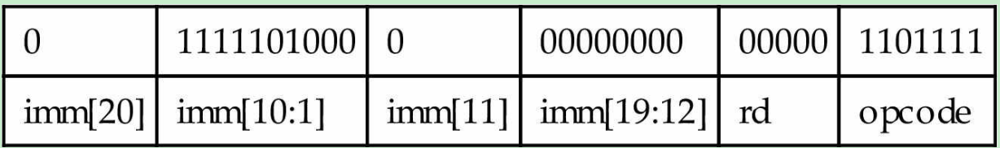
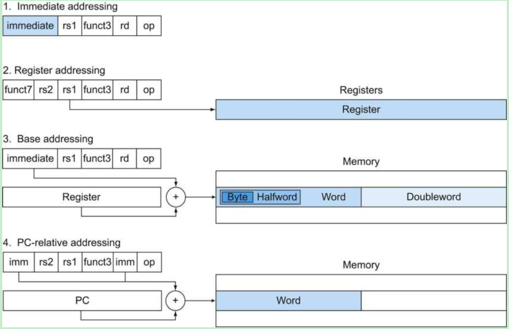
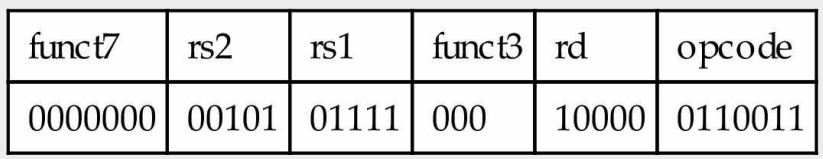

# Introduction
This is book notes for "Computer Organization and Design RISC-V Edition" book and 《计算机组成与设计：硬件/软件接口》.

# Preface
## Why this book?
The purpose of this book is to show the relationship between hardware and software. At least the next decade, most programmers are going to have to understand the hardware/software interface if they want programs to run efficiently on parallel computers.

## Why RISC-V?
* RISC-V, which was developed originally at UC Berkeley, not only cleans up the quirks of the MIPS instruction set, but it offers a simple, elegant, modern take on what instruction sets should look like in 2017.
* There are open-source RISC-V simulators, compilers, debuggers, and so on easily available and even open-source RISC-V implementations available written in hardware description languages.

## Goal
* Demonstrate the importance of understanding modern hardware to get good performance and energy efficiency with a concrete example.
* Help readers separate the forest from the trees by identifying eight great ideas of computer architecture early and then pointing out all the places they occur throughout the rest of the book.
* Recognize he generation change in computing from the PC era to the post-PC era.
* Spread the I/O material throughout the book rather than have it in its own chapter.

# Computer Abstractions and Technology
## Key Question
* What level of cost/performance computers will have in the future?

## Introduction
Applications that were economically infeasible suddenly become practical:
* Computers in automobiles
* Cell phones
* Human genome project
* World Wide Web
* Search engines

### 你能从本书中学到什么
* 高级语言编写的程序如何翻译成硬件之间的语言？硬件如何执行程序？
* 什么是软硬件之间的接口，以及软件如何知道硬件完成其功能？
* 哪些因素决定了程序的性能？程序员如何才能改进程序性能？
* 什么技术可供硬件设计者用于改进性能？
* 硬件设计者可使用哪些技术提高能效？
* 为什么串行处理近年来发展为并行处理？这种发展带来的结果是什么？
* 计算机架构师提出的哪些伟大的思想构成了现代计算机的基础？

### 什么影响了程序性能？


## 计算机系统结构中的8个伟大思想
* 面向摩尔定律的设计
   * 摩尔定律指出单芯片上的集成度每18~24个月翻一翻
* 使用抽象简化设计
   * 提高硬件和软件生产率的主要技术之一是使用抽象来表示不同的设计层次，在高层次中看不到低层次的细节，只能看到一个简化的模型
* 加速大概率事件
   * 加速大概率事件远比优化小概率事件更能提高性能
* 通过并行提高性能
* 通过流水线提高性能
* 通过预测提高性能
* 存储器层次
   * 速度最快、容量最小并且每位价格最昂贵的存储器处于顶层，而速度慢、容量最大且每位价格最便宜的存储器处于最底层
* 通过冗余提高可靠性

## 程序概念入门
### 系统软件
系统软件是提供常用服务的软件，包括操作系统、编译程序、加载程序和汇编程序等。
* 操作系统
   * 处理基本的输入和输出操作
   * 分配外存和内存
   * 为多个应用程序提供共享计算机资源的服务
* 编译程序
   * 把高级语言编写的程序翻译成硬件能执行的指令

### 从高级语言到硬件语言
* 使用数字既表述指令又表示数据是计算机的基础
* 使用高级语言的好处
   * 可以使程序员用更自然的语言思考
   * 提高程序员的生产率
   * 提高了程序相对于计算机的独立性

## 硬件概念入门
任何一台计算机的基础硬件都要完成：
* 输入数据
* 输出数据
* 处理数据
* 存储数据


### 处理器
处理器从逻辑上包括两个主要部件：
* 数据通路(datapath)
   * 负责完成算术运算
* 控制器(control)
   * 负责指导数据通路、存储器和I/O设备按照程序的指令正确执行

### 硬件和底层软件之间的接口 - 体系结构
计算机中最重要的抽象之一是硬件和底层软件之间的接口，该抽象被命名为计算机的指令集体系结构。

* 指令集体系结构(instruction set architecture)
   * 也叫体系结构，是低层次软件和硬件之间的抽象结构，包含了需要编写正确运行的机器语言程序所需要的全部信息，包括指令、寄存器、存储访问和I/O等
* 应用二进制接口(ABI)
   * 用户部分的指令加上应用程序员调用的操作系统接口，定义了二进制层次可移植的计算机的标准
   * 一般来说，操作系统需要封装I/O操作、存储器分配和其他低级的系统功能细节，以便应用程序员无需再这些细节上分心

计算机体系结构可以让计算机设计者独立地讨论功能，而不必考虑具体硬件。例如，我们讨论数字时钟的功能(如计时、显示时间、设置闹钟)时，可以不涉及时钟的硬件(如石英晶体、LED显示、按钮)。计算机设计者将体系结构与体系结构的实现(implementation)分开考虑也是沿着同样的思路：硬件的实现方式必须依照体系结构的抽象。

## 处理器和存储器制造技术

* 硅锭
   * 一块由硅晶体组成的棒
* 晶圆
   * 厚度不超过0.1英寸的硅锭片，用来制造芯片
* 芯片
   * 从晶圆中切割出来的一个单独的矩形区域
* 成品率
   * 合格芯片数占总芯片数的百分比
   * 当芯片尺寸增大时，集成电路的价格会快速上升，因为成品率和晶圆中芯片的总数都下降了。为了降低价格，大芯片常采用下一代工艺进行尺寸收缩，从而改进每晶圆的芯片数和成品率

## 性能
### 性能的度量
* 响应时间
   * 指从开始一个任务到该任务完成的时间，包括硬盘访问、内存访问、I/O活动、操作系统开销和CPU执行时间等
* 吞吐率
   * 也叫带宽(bandwidth)，性能的另一种度量参数，表示单位时间内完成的任务数量
* CPU执行时间
   * 执行某一任务再CPU上所花费的时间
* 用户CPU时间
   * 再程序本身所花费的CPU时间
* 系统CPU时间
   * 为执行程序而花费再操作系统上的时间
* 系统性能
   * 表示空载系统的响应时间
* CPU性能
   * 表示用户CPU时间

### 经典的CPU性能公式

* CPU性能及其因素
   * 一个程序的CPU执行时间 = 一个程序的CPU时钟周期数 * 时钟周期时间

* 指令的性能
   * CPU时钟周期数 = 程序的指令数 * 每条指令的平均时钟周期数
   * CPI (clock cycle per instruction)
      * 表示执行每条指令所需的时钟周期数的平均值

* CPU性能公式
   * `CPU时间 = 指令数 * CPI * 时钟周期时间`，或`CPU时间 = 指令数 * CPI / 时钟频率`


## 从单处理器向多处理器转变

功耗的极限迫使微处理器的设计产生了巨变。在2006年，所有桌面和服务器公司都在单片微处理器中加入了多个处理器，以求更大的吞吐率，而不再继续追求降低单个程序运行在单个处理器上的响应时间。在过去，程序员可以依赖于硬件、体系结构和编译程序的创新，无需修改一行代码，程序的性能每18个月翻一番。而今天，程序员想要显著改进响应时间，必须重写他们的程序以充分利用多处理器的优势。

### 为什么程序员编写显式并行程序如此困难？
* 并行编程以提高性能为目的，必然增加编程的难度。不仅程序要正确，而且运行速度要快，还需要为用户或其他程序提供接口以便使用
* 为了发挥并行硬件的速度，程序员必须将应用划分为每个核上有大致相同数量的任务，并同时完成。还要尽可能减小调度的开销，以不至于浪费并行性能
   * 挑战包括：调度、负载平衡、通信以及同步等开销

# 指令：计算机的语言
本章的目的：讲解符合“设备简单性”原则的一种指令集，介绍它怎样用硬件表示，以及它和高级编程语言之间的关系。

## 引言
ISA (instruction set architecture) is an abstract interface between the hardware and the lowest-level software that encompasses all the information necessary to write a machine language program that will run correctly.

指令集的两种形式：
* 人们编程书写的形式
* 计算机所能识别的形式

instruction set
   * The vocabulary of commands understood by a given architecture.

### 为什么指令集种类繁多，但是差异性却很小？
* 因为所有计算机都是基于基本原理相似的硬件技术所构建的
* 因为所有计算机都必须提供一些基础操作

### 什么是存储程序概念？
存储程序概念(stored-program concept), 即多种类型的指令和数据均以数字形式存储于存储器中的概念，存储程序型计算机即源于此。

### 指令集的组成部分
* 操作数
   * 寄存器(registers)
   * 存储器字(memory words)
* 汇编语言
   * 算术
      * 加法
      * 减法
      * 立即数加法
   * 数据传送
      * 在存储器和寄存器之间移动数据的命令
      * 立即数传输到寄存器
   * 逻辑
      * 与或非
      * 逻辑左移、右移
   * 条件分支
   * 无条件跳转

下图使RISC-V的指令集：<br>


## 硬件设计原则
硬件设计三条基本原则：
* 简单源于规整
   * 硬件算术操作体现了简单性
* 越小越快
   * 寄存器个数的限制，体现了此原则，大量的就差年起可能会使时钟周期变长
* 优秀的设计需要适宜的折中方案
   * 例如，即希望所有指令长度相同，又系统具有统一的指令格式，会因为指令长度不够而产生冲突。

## 计算机硬件的操作数
### 存储器操作数
由于RISC-V(或者MIPS)的算术运算指令只对寄存器进行操作，因此必须包含在存储器和寄存器之间传送数据的指令。这些指令叫做数据传送指令(data transfer instruction)。

### 常数或立即数操作数
常数操作数出现频率高，而且相对于从存储器中取常数，包含常数的算术运算指令执行速率快很多，并且能效较低。

## 计算机中指令的表示
指令在计算机内部是以若干或高或低的电信号的序列表示的，并且形式上和数的表示相同。

### 指令格式(instruction format)
指令的布局形式叫指令格式，以RISC-V的`add x9, x20, x21`为例，其指令格式如下：
* 十进制表示<br>
   
* 二进制表示<br>
   
   * 由上图可知，这是一条32位指令，RISC-V的指令长度都是32位的

指令的数字形式称为机器语言(machine language)，这样的指令序列叫机器码(machine code)。

### RISC-V字段

* opcode
   * 指令的基本操作，通常称为操作码(opcode)
* rd
   * register destination
   * 用于存放操作结果的目的寄存器
* funct3/funct7
   * 一般称为功能码(function code)，用于指明opcode字段中操作的特定变式
   * funct3占3-bits
   * funct7占7-bits
* rs1/rs2
   * register source
   * 源操作数寄存器

### 如何解决指令长度和指令格式的冲突？
由于指令长度无法满足有些指令功能，为了保持所有的指令长度相同，不同类型的指令采用了不同的指令格式。

RISC-V的指令格式类型：
* R型<br>
   
   * 用于寄存器操作
* I型<br>
   
   * 用于立即数操作，如：数据传送指令，或立即数加法addi等
   * 以`ld x9, 64(x22) // Temporary reg x9 gets A[8]`指令为例：
      * 22(寄存器x22)存放于rs1字段
      * 64存放于immediate字段
      * 9(寄存器x9)存放于rd字段
* S型<br>
   
   * 用于双字数据传输至存储器的指令，如:`sd x5,40(x6)`
      * 目标地址是通过immediate字段和rs2得到的
      * 之所以讲immediate拆分成两处，是为了尽量保持三种指令格式其他字段位置的统一

除了上面的三种指令类型，RISC-V还有SB型，UJ型和U型，它们的格式如下图所示：<br>


不同指令格式对应的指令内容如下表所示：<br>



## 逻辑操作
* 逻辑位移
   * 立即数逻辑位移采用I型指令格式，以`slli x11, x19, 4 // reg x11 = reg x19 << 4 bits`为例：<br>
      
      * 由于最大移位数不会超过63，因此I型指令格式中的immediate字段的低6位被使用，而高6位被用作funct6使用

## 决策指令
RISC-V有两种决策指令：
* `beq rs1, rs2, L1`
   * 如果rs1等于rs2，就跳转到L1
   * beq就是branch if equal
* `bne rs1, rs2, L1`
   * 如果rs1不等于rs2，就跳转到L1

### 循环
无论是二选一的if语句，还是循环迭代语句，决策都起着重要作用。

* 基本块
   * 没有分支(可能出现在末尾者除外)并且没有分支目标/分支标签(可能出现在开始者除外)的指令序列
   * 编译最初阶段的任务之一就是将程序分解为若干基本块

RISC-V指令和ARM指令对条件判断的不同：
* RISC-V采用`beq`, `bne`, `blt`(branch if less than), `bge`, `bltu`(for unsigned), `bgeu`等不同指令进行条件判断
* ARM通过标志位来表示比较条件的结果，通过标志位，判断分支运行
   * 此方式的缺点是，当许多指令需要设置标志位时，会存在竞争，从而阻碍了流水线的执行

### case/switch语句
实现switch语句的两种方法：
* 将switch语句转化位if-then-else语句嵌套
* 将多个指令序列分支的地址编码为一张表，即转移地址表(jump address table)

## 计算机硬件对过程的支持

### RISC-V过程调用


RISC-V在为过程调用分配寄存器时遵循以下约定：
* x10-x17：用于传递参数，或返回值的8个参数/值寄存器
* x1：用于返回起始点的返回地址寄存器
* x5-x7和x28-x31：这些寄存器在函数调用过程中，不需要由被调用者负责
* x8-x9和x18-x27：这些寄存器在函数调用过程中，必须由被调用者负责恢复

RISC-V汇编提供了两条无条件跳转指令，实现了caller和callee的动作：
* `jal` - 跳转和链接指令(jump-and-link instruction)
   * 用于在跳转的同时，将返回地址存于某寄存器(通常是x1)中，如：
      * `jal x1, ProcedureAddress // x1 = PC + 4, go to PC + ProcedureAddress`
* `jalr` - 寄存器跳转和链接指令(jump-and-link register instruction)
   * 用于跳转到存于寄存器(通常是x1寄存器)中的地址
      * `jal x0, 0(x1) // x0 = PC + 4, go to x1+0`

### 什么是PC寄存器？
PC(程序计数器，program counter)寄存器存储的是当前执行指令的地址，因此PC寄存器也称为指令地址寄存器(instruction address register)。`jal`指令实际上是将PC+4保存在寄存器x1中，因为一条RISC-V的长度是4bytes。

### 为什么要引入栈寄存器？
两个主要原因：
* 编译器的函数调用需要更多空间传递参数
* 函数调用返回的时候，需要信息用于恢复调用前的现场

### 如何在过程调用中保存寄存器的值？
RISC-V用寄存器x2存放栈指针(64-bits)，x2寄存器也称sp。一次操作，栈指针增加或减少双字(因为一个寄存器需要64-bits存储)。通过约定，RISC-V在函数调用中，被调用者只需要负责一部分寄存器的恢复。过程调用时，对寄存器保存的规则如下图所示：<br>

* 只需要保证被调用者不在sp以上进行写操作，sp以上的栈就可以得到保存
* sp本身的保存时通过按被调用者将减去值的相同数量重新加上来实现的
* 其他寄存器则通过将他们保存到栈再从栈中恢复它们来进行保存

### 如何用RISC-V汇编实现函数嵌套？
下面将一个嵌套函数的C语言转换成汇编形式：
```c
long long int fact(long long int n)
{
   if (n < 1) return 1;
   else return (n * fact(n-1));
}
```
在发生函数调用时，我们需要利用栈保持`fact`函数的参数和返回地址，RISC-V汇编形式如下：
```asm
fact:
   // 1. 进入fact函数时，先保存返回地址寄存器x1和参数寄存器x10
   addi sp, sp, -16  // adjust stack for 2 items
   sd x1, 8(sp)      // save the return address
   sd x10, 0(sp)     // save argument n
   // 2. 对参数n进行分支判断
   addi x5, x10, -1  // x5 = n - 1
   bge x5, x0, L1    // if (n - 1) >= 0, go to L1
   // 3. 分支1：直接返回，通过寄存器x10保存返回值
   addi x10, x0, 1   // return 1
   addi sp, sp, 16   // pop 2 items off stack
   jalr              // return to caller
L1:
   // 4. 分支2：更改参数寄存器x10的之后，调用fact(n-1)
   addi x10, x10, -1 // n >= 1: argument gets (n-1)
   jalx1, fact       // call fact with (n - 1)
   // 5. fact(n-1)调用返回后，用寄存器x6保存fact(n-1)的返回值
   addi x6, x10, 0   // return from jal: move result of fact(n-1) to x6
   // 6. 从栈中弹出最近一次调用者的参数到寄存器x10和返回地址到寄存器x1
   ld x10, 0(sp)     // restore argument n
   ld x1, 8(sp)      // restore the return address
   add sp, sp, 16    // adjust stack pointer to pop 2 items
   // 7. 将n*fact(n-1)的值存入寄存器x10
   mul x10, x10, x6  // return n * fact(n-1)
   // 8. 返回到调用者
   jalr x0, 0(x1)    // return to the caller
```

### 在栈中为新数据分配空间
栈不仅要用做保护现场，还需要存储过程的局部变量，但这些变量不适用于寄存器，例如局部的数组或结构体。栈中包含过程所保存的寄存器和局部变量的片段称为过程帧(procedure frame)或活动记录(activation record)。



上图显示了栈空间在函数调用前后的变化，其中主要有两个指针：
* 帧指针fp
   * 指向该过程帧的第一个字，一般是保存的参数寄存器
* 栈指针sp
   * 指向栈顶

### 在堆中为新数据分配空间


上图是软件规定的RISC-V的内存分配，并非RISC-V的架构。其中，动态数据在某一区域中朝着栈的方向向上生长，该区域称为堆。

## 大立即数和寻址
* 如何加载一个大立即数到寄存器中？
   * 编译器或汇编程序必须把大的常数分解为若干小的常数，然后再合并到一个寄存器中。

* 不同跳转指令的指令格式不太相同
   * `bne x10, x11, 2000 // if x10 ! x11, go to location 2000 = 0111_1101_0000`的指令格式(SB型)如下：<br>
      
   * `jal x0, 2000 // go to location 2000 = 0111_1101_0000`的指令格式(UJ型)如下：<br>
      

### PC相对寻址
PC相对寻址是一种寻址方式，它将PC和指令种的常数相加作为寻址结果。PC相对寻址可以解决`jal`跳转地址最大20-bit的限制。
* RISC-V所有条件/非条件跳转指令都采用PC相对寻址
* 同时，RISC-V也提供了长跳转指令，用于跳转到任何32-bit地址位置。长跳转指令通过两条指令实现：
   * `lui`写地址高20位到临时寄存器的高20位
   * `jalr`将低12位加到临时寄存器中，并以此临时寄存器的值作为地址，进行跳转

### 寻址模式总结

* 上图中，各模式的操作数是蓝色部分
* 一种操作可能可以使用多种寻址模式，例如，加法可以使用立即数寻址(addi)和寄存器寻址(add)

寻址模式是根据对操作数和/或地址的使用不同加以区分的多种寻址方式的一种。
* 立即数寻址(Immediate addressing)
   * 操作数是位于指令自身中的常数
* 寄存器寻址(Register addressing)
   * 操作数在寄存器中
* 基址寻址(Base addressing)
   * 操作数在内存中，其地址是指令中基址寄存器和常数的和
* PC相对寻址(PC-relative addressing)
   * 操作数在内存中，其地址是PC和指令中常数的和

### 机器语言解码
有时候必须通过逆向工程将机器语言恢复到最初的汇编语言，比如检查“核心转储”(core dump)时。下面举例RISC-V的逆向过程。

下面这条机器指令对应的汇编语言语句是什么？
* `00578833`(hex)

解答过程如下：
* 将16进制的机器指令转换成32位二进制
   * `0000_0000_0101_0111_1000_1000_0011_0011`
* 确定opcode
   * 7-bit opcode是`0110011`<br>
      
      * 通过上表可知，`0110011` opcode对应的是R型指令格式
   * 因此，我们按照R型指令格式推出其他各位的值，如下：<br>
      
      * `funct7`和`funct3`都是零，所以此指令是`add`
      * 同样可知此指令用到了寄存器x5,x15,x16
* 查表后可确定指令的意义是
   * `add x16,x15,x5`

## 并行与指令：同步
数据竞争：假如来自不同线程的两个访存请求访问同一个地址，它们连续出现，并且至少其中一个是写操作，那么这两个存储访问形成数据竞争。

在多处理器中实现同步需要一组硬件原语，提供对存储单元进行原子读和原子写的能力，使得在进行存储器原子读或原子写操作时，任何其他操作都不得插入。如果没有这样的硬件原语，那么建立同步机制的代价将会变得很高，并且随着处理器数量的增加情况将更为恶化。我们用原子交换原语(atomic exchange或atomic swap)来延时如何建立基本同步机制。这个原语是将寄存器中的一个值和存储器中的一个值相互交换。

用交换原语实现同步的关键是操作的原子性：交换操作时不可分割的，并且由硬件对两个同时执行的交换操作进行排序。有可能两个处理器同时尝试置位同步遍历，但这两个处理器认为它们同时成功设置了同步变量是不可能的。

实现单个的原子存储器操作给处理器的设计者带来了若干挑战，因为这要求存储器的读、写操作都是有单条不可被终端的指令完成。一种可行的方式是：
* 采用指令对，其中第二条指令返回一个表明这对指令是否原子执行的标志值。当一个指令对是原子的，没有哪个处理器能改变这两个指令执行之间的数据值。
   * RISC-V处理器中这一指令对包括
      * 一条叫作链接取数(load-reserved doubleword, lr.d)的特殊取数指令
      * 一条叫作条件存数(store-conditional doubleword, sc.d)的特殊存数指令，条件存数会做两件事情：
         * 保存寄存器的值到指定内存地址
         * 修改另一个寄存器的值，如果执行成功，则寄存器的值为0。如果执行失败，则寄存器的值是非零
   * 指令对执行过程是：如果链接取数指令所指定的锁单元的内容在相同地址的条件存数指令执行前已被改变，那么条件存数指令就执行失败。
   * 下面的指令序列实现了存储单元的原子交换(将x20指向的内存中的值和x23的值原子互换)，存储单元的地址由x20中的值指出：
      ```
      again: ld.d x10, (x20)        // load-reserved
             sc.d x11, x23, (x20)   // store-conditional
             bne x11, x0, again     // branch if store fails
             addi x23, x10, 0       // put loaded value in x23
      ```

## 翻译并执行程序


