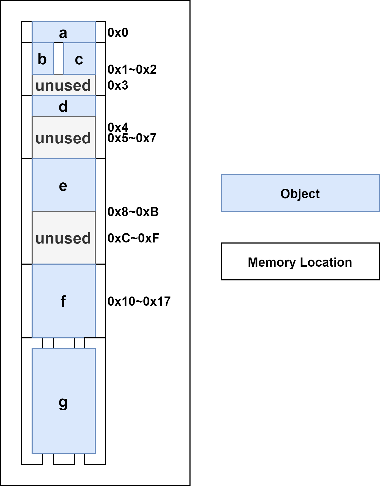
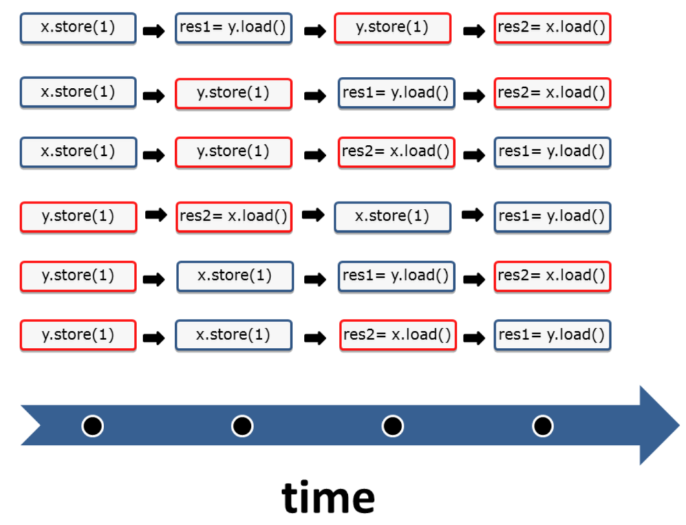
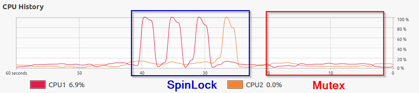
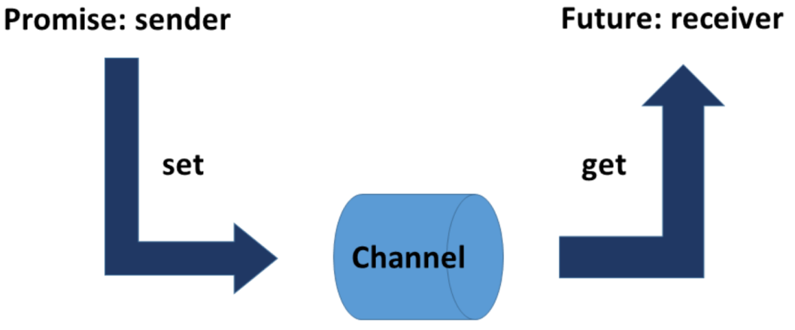

> 《Concurrency with Modern C++》和《C++ Concurrency In Action》的读书笔记

# C++并行历史概述


## 内存模型

内存模型需要处理以下几个方面的内容：

* 原子操作：不受中断地操作
* 部分排序运算：不能重排序的操作序列
* 操作的可见效果：保证其他线程可以看到对共享变量的操作

C++内存模型允许打破顺序一致性的约束(原子操作的默认方式)，顺序一致性提供了两个保证：

* 程序指令按源码顺序执行
* 线程上的所有操作都遵循一个全局顺序

## 原子类型

`std::atomic`可定义原子数据类型，可以建立同步和排序约束。

## 多线程

C++中的多线程由下面几部分组成：

* 线程
    * `std::thread`创建线程，是一个可变参数模板，可接收任何数量的参数
    * `t.detach()`分离线程，线程在后台允许，通常称为**守护线程**
    * `t.join()`等待线程完成，会在其析构函数中调用`std::terminate`
* (共享数据的)同步语义
    * 共享数据是多个线程可同时使用的可变变量，需要通过锁来协调对共享变量的访问
    * `std::lock_guard/std::scoped_lock`可用于简单的锁场景
    * `std::unique_lock/std::shared_lock`用于高级场所
* 线程本地数据
    * `thread-local`可以确保每个线程都有变量的副本，生命周期和线程的生存周期相同
* 条件变量
    * 允许通过消息机制对线程进行同步
* 任务
    * `std::async`，`std::promise`和`std::future`可创建任务，C++运行时会自动处理任务的生存期

### 执行策略

C++17中，大多数STL算法都有并行实现，这样就可以使用执行策略来调用算法。

* 串行执行 - `std::execution::seq`
* 并行执行 - `std::execution::par`
* 与向量化的并行执行 - `std::execution::par_unseq`

# 内存模型

## 什么是内存模型

两个问题：

* 什么是内存位置？
* 如果两个线程访问相同的内存位置，会发生什么？

### 内存位置

* 标量对象
    * 算数类型、指针类型、枚举类型或`std::nullptr_t`
* 非零长度的连续序列

[例子"mem_position"](./code/mem_position/main.cpp)展示了C++变量内存位置的信息：
```cpp
struct S
{
   char a;     // memory location #1
   int b : 5;  // memory location #2
   int c : 11, // memory location #2 （bit field continue）
         : 0,  // 宽度为0的域强制下一位域，对齐到下面成员类型的边界
       d : 8;  // memory location #3
   int e;      // memory location #4
   double f;   // memory location #5
   std::string g; // several memory locations
};
```

`struct S`由七个子对象组成，其中b和c两个字段共享内存位置：

* 每个变量都是一个对象
* 标量类型占用一个内存位置
* 相邻的位字段(b和c)具有相同的内存位置
* 变量至少占用一个内存位置，`std::string`就占用了多个内存位置



两个线程访问相同的内存位置，会发生什么？

* 如果两个线程访问相同的内存位置(相邻位字段共享内存位置)，并且至少有一个线程想要修改它，那么程序就会产生数据竞争，除非满足以下两个条件：
    * 操作为原子操作
        * 原子操作可以避免未定义操作，但是并不能避免竞争，需要指定访问顺序以避免竞争
    * 访问按照某种先行(happens-before)顺序进行
        * 例如，使用互斥量保证同一时间只有一个线程能够访问对应的内存位置

## 编程协议


C++有三种协议级别，协议越强，优化的空间越少。当程序开发者使用弱协议或弱内存模型时，相应就会有许多优化选择。

* 单线程协议
    * 保证程序所观察到的程序行为，与源代码中指令的顺序一致
* 多线程协议
    * C++内存模型
    * 程序开发者在处理共享变量时必须遵守规则
* 原子操作协议
    * 无锁编程
    * 原子操作的顺序一致语义被称为强内存模型
    * 原子操作的自由语义被称为弱内存模型

C++内存模型需要保证以下操作：
* 原子操作：不受中断地执行

* 部分排序操作：操作序列的顺序不能重排
* 可见操作：保证共享变量上的操作对其他线程可见

内存模型越弱，越有优化的空间，以下无锁编程的内存模型依次减弱：
* 顺序一致语义 (强内存模型)
* 获得-释放语义
* 自由语义 (弱内存模型)


## 原子操作
原子操作是C++内存模型的基础。默认情况下，原子操作基于强内存模型。

### 强内存模型

顺序一致性的两个特点：
* 指令按源码顺序执行
    * 任何存储操作都无法在获取操作之前进行
* 线程上的所有操作都遵顼一个全局顺序
    * 线程2看到线程1的操作的顺序与线程1执行它们的顺序相同
    * 时钟每次发出一次滴答声，就会发生一个原子操作，但永远不知道执行的是哪个


C++默认情况下，是固体不过“顺序一致语义”，以下代码等价：
```cpp
x.store(1);
res = x.load();
```
```cpp
x.store(1, std::memory_order_seq_cst);
res = x.load(std::memory_order_seq_cst);
```

顺序一致下，两个线程交错运行的方式有六种：



* 顺序一致模型下，`res1`和`res2`不可能同时为零

### 弱内存模型

使用自由语义(也称为弱内存模型)，线程1可以以不同的顺序查看线程2的操作，全局顺序不再存在。以上面的例子为例，从线程1的角度来看，操作`res=x.load()`可能在`y.store(1)`之前执行。甚至是，线程2可以先执行`res2=x.load()`，再执行`y.store(1)`。

“序列一致语义”和“自由语义”之间还有存在其他内存模型，其中最重要的是“获取-释放语义”。“获取-释放语义”中，开发人员需要遵守比“顺序一致语义”弱的规则。这样，系统有了更多优化空间。

### 原子标志

`std::atomic_flag`是原子布尔类型，可设置为true或者false，但不能获取当前值。通过`std::atomic_flag flag = ATOMIC_FLAG_INIT`初始化。利用`std::atomic_flag`的`test_and_set`函数，可以实现自旋锁。

#### 自旋锁和互斥锁

对比两个例子["spin_lock"](./code/spin_lock)和["mutex"](./code/mutex)，两者CPU的使用率完全不同：


不应该在单处理器系统上使用自旋锁，有可能出现死锁的情况。

### `std::atomic`模板

* 布尔原子类型：`std::atomic<bool>`
* 用户自定义原子类型：`std::atomic<user-defined type>`
* 原子指针类型：`std::atomic<T*>`
* 整数原子类型：`std::atomic<integral type>`

`volatile`和`std::atomic`的区别：

* volatile： 表示不允许对特定的对象进行读写优化
* std::atomic： 用来定义线程安全的原子变量

#### 用`std::atomic<bool>`实现条件变量

[例子"cv_atomic"](./code/cv_atomic/main.cpp)用`std::atomic<bool>`实现了类似条件变量的功能。两者的区别在于：条件变量会让线程等待通知`condVar.notify()`。而原子布尔值利用“拉原则pull principle”，采用轮询的方式实现。

* `compare_exchange_strong`
    * `atomicValue.compare_exchange_strong(expected, desired)`
        * 如果`atomicValue`和`expected`一致，返回`true`，`atomicValue`设为`desired`
        * 如果`atomicValue`和`expected`不一致，返回false，将`expected`设置为`atomicValue`
* `compare_exchange_weak`
    * `while (!atomicValue.compare_exchange_weak(expected, desired))`
        * 即使`atomicValue`和`expected`一致，也可能返回`false`，表明没有设置成功
        * 原因是一些处理器不支持原子比较交换指令

#### 用户自定义类型的原子操作

限制：

* 不能定义复制赋值操作符
* 不能有虚方法
* 必须可按位比较

#### `std::shared_ptr`的原子操作

查看[例子"shared_ptr_atomic"](./code/shared_ptr_atomic/main.cpp)

## 同步和顺序
虽然不能配置原子数据，但是可以调整原子操作的同步和顺序。

### C++的六种内存序

```cpp

enum memory_order
{
    memory_order_relaxed, // 无同步和操作顺序
    memory_order_consume, // 读操作
    memory_order_acquire, // 读操作
    memory_order_release, // 写操作
    memory_order_acq_rel, // 读改写操作
    memory_order_seq_cst  // 读改写操作
}
```
下表根据原子操作的读写特性对它们进行排序。

|        操作名称         | read | write | read-modify-write |
| :---------------------: | :--: | :---: | :---------------: |
|      test_and_set       |      |       |        yes        |
|          clear          |      |  yes  |                   |
|      is_lock_free       | yes  |       |                   |
|          load           | yes  |       |                   |
|          store          |      |  yes  |                   |
|        exchange         |      |       |        yes        |
| compare_exchange_strong |      |       |        yes        |
|  compare_exchange_weak  |      |       |                   |
|      fetch_add, +=      |      |       |        yes        |
|      fetch_sub, -=      |      |       |                   |
|      fetch_or, \|=      |      |       |        yes        |
|      fetch_and, &=      |      |       |                   |
|      fetch_xor, ^=      |      |       |                   |
|         ++, --          |      |       |        yes        |

# 多线程

## 线程

### 线程安全的初始化

C++中有三种以线程安全初始化变量的方法：

* 常量表达式
* `std::call_once`与`std::once_flag`结合的方法
* 作用域的静态变量

## 线程本地数据

类似于静态数据，在第一次使用之前创建

静态变量、thread_local变量和局部变量之间的区别是什么？

* 静态变量与主线程的生命周期相同
* `thread_local`变量与其所在线程的生命周期相同
* 局部变量与创建作用域的生命周期相同

## 任务


* 通讯方式不同
    * 线程 - 共享变量
    * 任务 - 通信通道
        * 因此，任务不需要互斥锁之类的保护机制
        * `fut.get()`只能调用一次
* 异常处理
    * `promise`可以将异常发送给`future`

### 发后即忘

没有用变量接住的`std::async`返回的`future`叫发后即忘的`future`，会在原地等待执行完成。

### `std::packaged_task`

与`std::async`或`std::promise`相比，`std::packaged_task`可以复位并重复使用。

### `std::promise`和`std::future`

`std::promise`和`std::future`可以完全控制任务：

* `promise`可以将值、异常或通知放入数据通道，一个`promise`可以对应多个`std::shared_future`对象

### `std::shared_future`

创建`std::shared_future`的两种方法：

* `std::shared_future<int> fut = prom.get_future()`
* `auto s_fut = fut.shared()`，执行了`fut.shared()`后，`fut.valid()`会返回`false`，以后都通过`s_fut.get()`拿出结果

### 异常

如果`std::async`或`std::packaged_task`的工作包抛出错误，则异常会存储在共享状态中。当`future fut`调用`fut.get()`时，异常将重新抛出。

`std::promise`有一个成员函数`prom.set_value(std::current_exception())`将异常设置为共享状态。

### 通知

`promise`和`future`可实现条件变量的功能，对比

对比标准 | 条件变量 | 任务
--- | --- | ---
多重同步 | Yes | No
临界区保护 | Yes | No
接收错误处理机制 | No | Yes
伪唤醒 | Yes | No

条件变量可以多次同步线程，而promise只能发送一次通知。

# 标准库的并行算法

## 执行策略

```cpp
#include <vector>
#include <algorithm>
#include <execution>

int main()
{
    std::vector<int> coll;
    coll.reserve(10000);
    for (int i = 0; i < 10000; ++i) {
        coll.push_back(i);
    }

    // 并行执行每次循环
    std::for_each(std::execution::par,
        coll.begin(), coll.end(),
        [](auto& val) {
            val *= val;
        }
    );
}
```

除使用多线程外，还可以通过CPU或GPU的向量指令集进行加速，参考[文档](https://ermao.live/C++17%E8%AF%A6%E8%A7%A324-%E5%B9%B6%E8%A1%8CSTL%E7%AE%97%E6%B3%95.html)。

CPU 中此类方法统称`SIMD — Single Instruction Multiple Data`，即单指令多数据。常见的实现有 AVX256、AVX512、NEON。

三种并行策略：

* std::execution::sequenced_policy - 顺序执行
* std::execution::parallel_policy - 并行执行算法，如果采用多线程方式的话，每个线程内的执行是顺序的
* std::execution::parallel_unsequenced_policy - 多线程 + 向量指令集，线程内、线程间均是无序的

标准库预定义了三类策略的全局对象：

* std::execution::seq - 串行
* std::execution::par - 使用并行策略，由STL实现来决定选择最好的并行方案，通常都是利用线程池
    * 不是线程安全的，如果有用到共享数据要自己同步
* std::execution::par_unseq - 该策略不能保证一个线程执行完改元素的所有步骤而不被中断
    * 同样不是线程安全的，而且同一线程内的执行是交错的（interleaved），如果像下面一样加锁的话，会造成死锁。

```cpp
std::vector<int> vec(1000);
std::iota(vec.begin(), vec.end(), 0);
std::vector<int> output;
std::mutex m;
std::for_each(std::execution::par, vec.begin(), vec.end(),
    [&output, &m, &x](int& elem) {
        if (elem % 2 == 0) {
            std::lock_guard guard(m);
            output.push_back(elem);
        }
    }
);
```

# C++20/23的特性

## 可协作中断的线程

`std::jthread`可以自动汇入启动线程，下面的代码不会崩溃。如果是`std::thread`会因为主线程先于子线程退出，而崩溃。

```cpp
#include <iostream>
#include <thread>

int main()
{
   std::jthread thr([]()
                   { std::cout << "Joinable std::thread" << std::endl; });

   std::cout << "thr.joinable():" << thr.joinable() << std::endl;
   //thr.join();

   return 0;
}

```

## 协程

参考[文档1](https://mariusbancila.ro/blog/2020/06/22/a-cpp20-coroutine-example/)和[文档2](https://itnext.io/c-20-coroutines-complete-guide-7c3fc08db89d)

协程是可以挂起，保持函数执行状态，并可以在之后继续执行的方式。

## 事务性内存

事务性内存可以让使用线程变得更加容易，因为：

* 避免数据竞争和死锁
* 可以组合事务

原子块：
```cpp
atomic
{
    statement1;
    statement2;
    statement3;
}
```

事务具有以下属性(ACID)：

* 原子性
    * 执行块中的所有语句或不执行块中任何语句
* 一致性
    * 系统始终处于一致的状态，所有事务确定统一的顺序
* 独立性
    * 每个事务在完全独立的情况下运行
* 持久性 (不适用于C++事务性内存)

# 模式和最佳实践

模式分为三类：

* 创造型
* 结构型
* 行为型

# 同步模式

## 处理共享

* 值传递和引用传递

## 处理冲突

* 锁

运行时多态(面向对象)和编译时多态(模板)：

* 优点
    * 运行时多态
        * 允许运行时配置
        * 更容易理解
    * 编译时多态
        * 无抽象的惩罚，虚表等
        * 扁平的层次结构
* 缺点
    * 运行时多态
        * 额外需要一个指针
        * 可能有很深的派生层次
    * 编译时多态
        * 出错信息不友好

## 线程安全的接口

准则：

* 所有(public)接口都应该使用锁
* 所有(保护的和私有的)方法都不使用锁
* 接口只能使用保护的方法或私有方法调用，而公共方法则不能调用
* 当重写虚接口函数时，即使重写的函数是私有的，也应该有锁，因为继承类的私有函数也能通过多态的方法被外部调用


# 伪共享

如果两个线程，同时读取位于同一高速缓存行上的不同变量a和b，会发生伪共享，造成硬件同步，从而影响并发效率。

```cpp
struct Sum
{
#ifdef NOFALSE
   alignas(64) long long a = 0;
   alignas(64) long long b = 0;
#else
   long long a = 0;
   long long b = 0;
#endif
};
```


