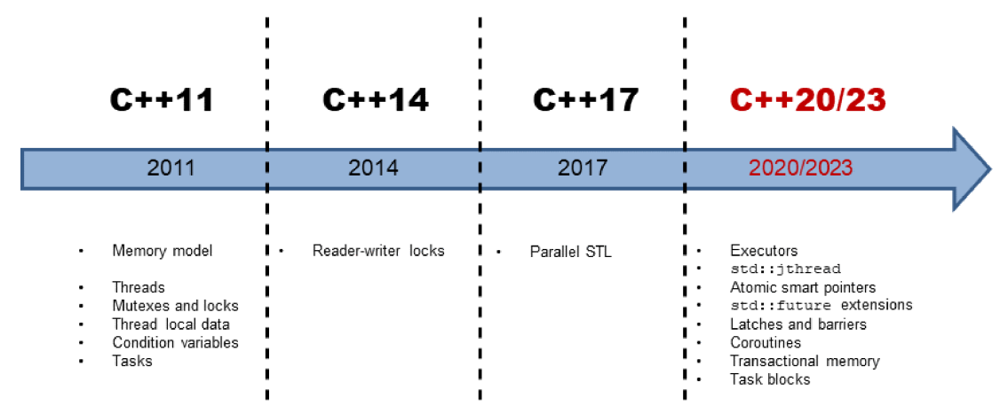

> 《Concurrency with Modern C++》和《C++ Concurrency In Action》的读书笔记

# C++并行历史概述



## 内存模型

内存模型需要处理以下几个方面的内容：

* 原子操作：不受中断地操作
* 部分排序运算：不能重排序的操作序列
* 操作的可见效果：保证其他线程可以看到对共享变量的操作

C++内存模型允许打破顺序一致性的约束(原子操作的默认方式)，顺序一致性提供了两个保证：

* 程序指令按源码顺序执行
* 线程上的所有操作都遵循一个全局顺序

## 原子类型

`std::atomic`可定义原子数据类型，可以建立同步和排序约束。

## 多线程

C++中的多线程由下面几部分组成：

* 线程
    * `std::thread`创建线程，是一个可变参数模板，可接收任何数量的参数
    * `t.detach()`分离线程，线程在后台允许，通常称为**守护线程**
    * `t.join()`等待线程完成，会在其析构函数中调用`std::terminate`
* (共享数据的)同步语义
    * 共享数据是多个线程可同时使用的可变变量，需要通过锁来协调对共享变量的访问
    * `std::lock_guard/std::scoped_lock`可用于简单的锁场景
    * `std::unique_lock/std::shared_lock`用于高级场所
* 线程本地数据
    * `thread-local`可以确保每个线程都有变量的副本，生命周期和线程的生存周期相同
* 条件变量
    * 允许通过消息机制对线程进行同步
* 任务
    * `std::async`，`std::promise`和`std::future`可创建任务，C++运行时会自动处理任务的生存期

### 执行策略

C++17中，大多数STL算法都有并行实现，这样就可以使用执行策略来调用算法。

* 串行执行 - `std::execution::seq`
* 并行执行 - `std::execution::par`
* 与向量化的并行执行 - `std::execution::par_unseq`

# 内存模型

## 什么是内存模型

两个问题：

* 什么是内存位置？
* 如果两个线程访问相同的内存位置，会发生什么？

### 内存位置

* 标量对象
    * 算数类型、指针类型、枚举类型或`std::nullptr_t`
* 非零长度的连续序列

[例子"mem_position"](./code/mem_position/main.cpp)展示了C++变量内存位置的信息：
```cpp
struct S
{
   char a;     // memory location #1
   int b : 5;  // memory location #2
   int c : 11, // memory location #2 （bit field continue）
         : 0,  // 宽度为0的域强制下一位域，对齐到下面成员类型的边界
       d : 8;  // memory location #3
   int e;      // memory location #4
   double f;   // memory location #5
   std::string g; // several memory locations
};
```

`struct S`由七个子对象组成，其中b和c两个字段共享内存位置：

* 每个变量都是一个对象
* 标量类型占用一个内存位置
* 相邻的位字段(b和c)具有相同的内存位置
* 变量至少占用一个内存位置，`std::string`就占用了多个内存位置


两个线程访问相同的内存位置，会发生什么？

* 如果两个线程访问相同的内存位置(相邻位字段共享内存位置)，并且至少有一个线程想要修改它，那么程序就会产生数据竞争，除非满足以下两个条件：
    * 操作为原子操作
        * 原子操作可以避免未定义操作，但是并不能避免竞争，需要指定访问顺序以避免竞争
    * 访问按照某种先行(happens-before)顺序进行
        * 例如，使用互斥量保证同一时间只有一个线程能够访问对应的内存位置

## 编程协议


C++有三种协议级别，协议越强，优化的空间越少。当程序开发者使用弱协议或弱内存模型时，相应就会有许多优化选择。

* 单线程协议
    * 保证程序所观察到的程序行为，与源代码中指令的顺序一致
* 多线程协议
    * C++内存模型
    * 程序开发者在处理共享变量时必须遵守规则
* 原子操作协议
    * 无锁编程
    * 原子操作的顺序一致语义被称为强内存模型
    * 原子操作的自由语义被称为弱内存模型

C++内存模型需要保证以下操作：
* 原子操作：不受中断地执行

* 部分排序操作：操作序列的顺序不能重排
* 可见操作：保证共享变量上的操作对其他线程可见

内存模型越弱，越有优化的空间，以下无锁编程的内存模型依次减弱：
* 顺序一致语义 (强内存模型)
* 获得-释放语义
* 自由语义 (弱内存模型)


## 原子操作
原子操作是C++内存模型的基础。默认情况下，原子操作基于强内存模型。

### 强内存模型

顺序一致性的两个特点：
* 指令按源码顺序执行
    * 任何存储操作都无法在获取操作之前进行
* 线程上的所有操作都遵顼一个全局顺序
    * 线程2看到线程1的操作的顺序与线程1执行它们的顺序相同
    * 时钟每次发出一次滴答声，就会发生一个原子操作，但永远不知道执行的是哪个


