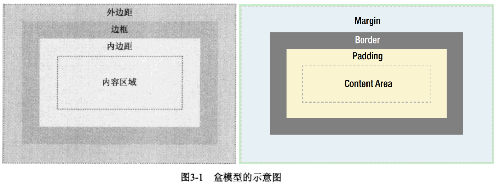
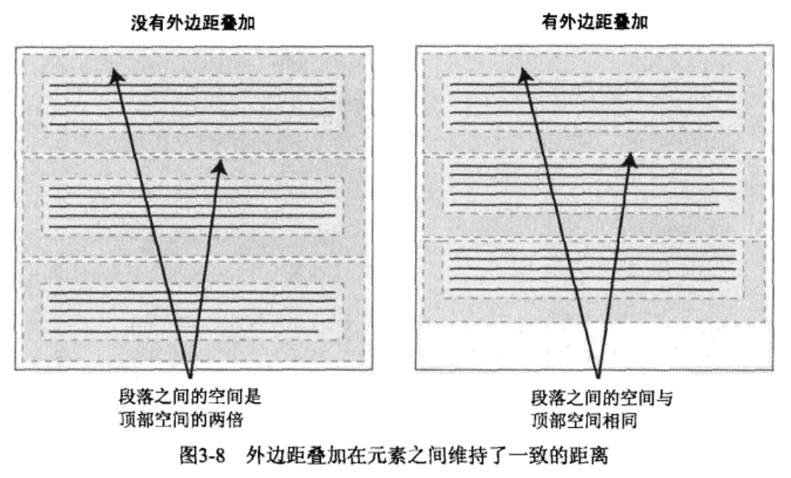
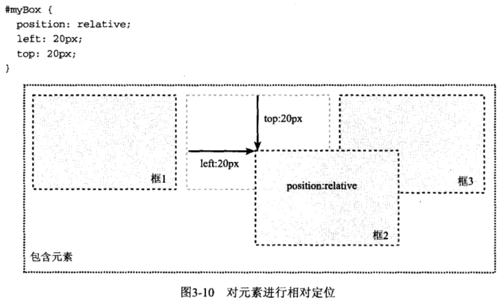
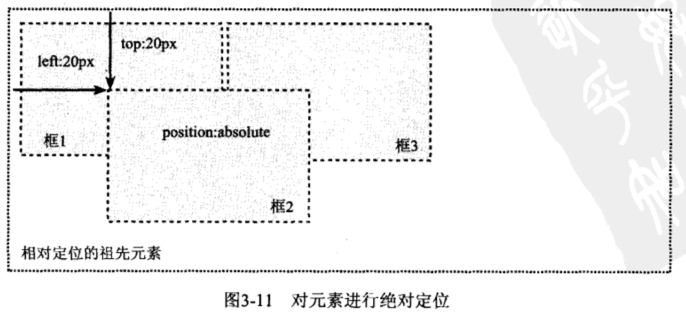
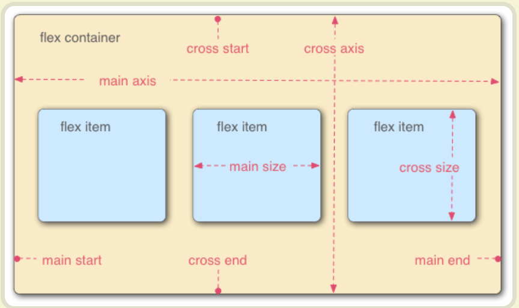

# 序
《精通CSS：高级Web标准解决方案》读书笔记

# 基础知识

## 设计代码的结构
### 标记简史
* HTML有意义的元素
    * h1,h2
    * ul, ol, dl
    * strong, em
    * blockquote, cite
    * abbr, acronym, code
    * fieldset, legend, label
    * caption, thread, tbody, tfoot
* ID和类名
    * ID用于标识页面上的特定元素(比如站点导航)，而且必须是唯一的
    * 一个ID名只能应用于页面上的一个元素，而同一个类名可以应用于页面上任意多个元素
* 为元素命名
    * 在分配ID和类名时，一定要尽可能保持名称与表现方式无关
    * 应该根据“它们是什么”来为元素命名，而不应该根据“它们的外观如何”来命名。例如不要给通知分配类名red，而是应该分配更有意义的名称，比如.warning或.notification
* ID还是类
    * 类应该应用于概念上相似的元素，这些元素可以出现在同一页面上的多个位置，而ID应该应用于不同的唯一的元素
* div和span
    * 为了将不必要的标记减到最少，应该只在没有现有元素能够实现区域分割的情况下使用div元素。例如，如果使用主导航列表，就不需要将它包围在div中：
    ```html
    <div class="nav">
        <ul>
            <li><a href="/css/">CSS</a></li>
            <li><a href="/js/">JavaScript</a></li>
        </ul>
    </div>
    <!-- 可以完全删除div，直接在列表上应用类 -->
    <ul class="nav">
        <li><a href="/css/">CSS</a></li>
        <li><a href="/js/">JavaScript</a></li>
    </ul>
    ```
    * div可以用来对块级元素进行分组，而span可以用来对行内元素进行分组或标识

# 为样式找到应用目标

## 常用的选择器
* [类型选择器](https://developer.mozilla.org/zh-CN/docs/Web/CSS/Type_selectors)
    * 用来寻找特定类型的元素，比如段落或标题元素：`p {color: black;}`, `h1 {font-weight: bold;}`
* [后代选择器](https://developer.mozilla.org/zh-CN/docs/Web/CSS/Descendant_combinator)
    * 用来寻找特定元素或元素组的后代，由其他两个选择器之间的空格表示，例如：`blockquote p {padding-left: 2em;}`
* [ID选择器](https://developer.mozilla.org/zh-CN/docs/Web/CSS/ID_selectors)
    * 由一个`#`字符表示，例如：`#intro {font-weight: bold;}`
* [类选择器](https://developer.mozilla.org/zh-CN/docs/Web/CSS/Class_selectors)
    * 由一个`.`点号表示，例如：`.date-posted {color: #ccc;}`
* [伪类](https://developer.mozilla.org/zh-CN/docs/Web/CSS/Pseudo-classes)
    * 链接伪类，只能应用于锚元素`<a>`
        * `:link`和`:visited`
    * 动态伪类，可以应用于任何元素
        * `:hover`, `:active`, `:focus`
    ```css
    /* makes all unvisited links blue */
    a:link {
        color: blue;
    }
    /* makes all visited links green */
    a:visited {
        color: green;
    }
    /* makes links red on mouse hover, keyboard focus */
    a:hover,
    a:focus {
        color: red;
    }
    /*...and purple when activated. */
    a:active {
        color: purple;
    }
    ```

## 通用选择器
* [通用选择器](https://developer.mozilla.org/zh-CN/docs/Web/CSS/Universal_selectors)
    * 一般用来匹配所有可用元素，例如，可用使用以下规则删除每个元素上默认的浏览器内边距和外边距：
    ```css
    * {
        padding: 0;
        margin: 0;
    }
    ```

## 高级选择器
* [子选择器和相邻同胞选择器](https://developer.mozilla.org/zh-CN/docs/Web/CSS/Child_combinator)
    * 后代选择器选择一个元素的所有后代，而子选择器只选择元素的直接后代，即子元素。例如，
        * `#nav>li`只选择`nav`的第一层`li`
        * `h2 + p`只选择顶级标题后面的第一个段落

* [属性选择器](https://developer.mozilla.org/zh-CN/docs/Web/CSS/Attribute_selectors)
    * 通过已经存在的属性名或属性值匹配元素，例如：`a[title] {color: purple;}`

### 层叠和特殊性
* 层叠采用以下重要度次序：
    * 标有!important的用户样式
    * 标有!important的作者样式
    * 作者样式
    * 用户样式
    * 浏览器/用户代理应用的样式


* 用style属性编写的规则总是比其他任何规则特殊
* 具有ID选择器的规则比没有ID选择器的规则特殊
* 具有类选择器的规则比只有类型选择器的规则特殊
* 如果两个规则的特殊性相同，那么后定义的规则优先

在主体标签上添加类或ID：
* 如果希望新的页面具有特殊的布局，那么可以在主页的主体元素上添加一个类名，并且使用它覆盖样式

### 继承
`p, div, h1 {color: black;}`可以简写为：`body {color: black;}`。恰当地使用继承可以减少代码中选择器的数量和复杂性。

## 规划、组织和维护样式表

### 对文档应用样式
将样式附加到网页上有三种方法：
* 直接将样式放在style标签之间
* import导入样式
    ```html
    <style type="text/css">
        @import url("/css/advanced.css");
    </style>
    ```
* link链接样式
    ```html
    <link rel="stylesheet" href="css/index.css" />
    ```

#### 设计代码的结构
整个CSS文档的结构如下：
* 一般性样式
    * 主体样式
    * reset样式
    * 链接
    * 标题
    * 其他元素
* 辅助样式
    * 表单
    * 通知和错误
    * 一致的条目
* 页面结构
    * 标题、页脚和导航
    * 布局
    * 其他页面结构元素
* 页面组件
    * 各个页面
* 覆盖

同一风格的注释：
```css
/* @group general styles
------------------------ */

/* @group helper styles
------------------------ */

/* @group page structure
------------------------ */

/* @group page components
------------------------ */

/* @group overrides
------------------------ */
```

# 可视化格式模型
三个最重要的CSS概念：
* 浮动
* 定位
* 盒模型

## 盒模型概述
页面上的每个元素被看做一个矩形框，这个框由元素的内容、内边距、边框和外边距组成。


* 内边距和外边距
    * 如果在元素上添加背景，那么背景会应用于由内容和内边距组成的区域
    * 是透明的，一般使用它控制元素之间的间隔
    * 内边距、边框和外边距都是可选的，默认值为零。可以通过`margin`或`padding`来覆盖浏览器样式：
    ```css
    * {
        margin: 0;
        padding: 0;
    }
    ```
* 内容区域
    * 在CSS中，width和height指的是内容区域的宽度和高度
    * 增加内边距、边框和外边距不会影响内容区域的尺寸

### 外边距叠加
当两个或更多垂直外边距相遇时，它们将形成一个外边距，这个外边距的高度等于两个发生叠加的外边距的高度中的较大者。



## 定位概述

### 可视化格式模型
两种框类型：
* 块级元素 - 块框
    * p, h1或div等元素
    * 这些元素显示为一块内容
* 行内元素 - 行内框
    * strong, span等元素
    * 它们的内容显示在行中

通过[`display`属性](https://developer.mozilla.org/zh-CN/docs/Web/CSS/display)可以改变框的类型：
* block
    * 可以让行内元素(比如锚<a>)表现得像块级元素
* flex
    * 弹性盒模型
* none
    * 让生成的元素根本没有框，这个框及其所有内容就不再显示，不占用文档中的空间

#### 定位机制
CCS中有3种基本的定位机制：普通流(默认)，浮动，绝对定位

* 块级框
    * 从上到下一个接一个地垂直排列，框之间的垂直距离由框的垂直外边距计算出来
* 行内框
    * 使用水平内边距、边框盒外边距调整水平间距，如下图
    * 垂直内边距、边框盒外边距不影响行内框的高度
    * 修改行内框尺寸的唯一方法是：修改行高或者水平边框、内边距和外边距
    * 

### 相对定位

* 移动元素导致它覆盖了其他框

### 绝对定位
绝对定位使元素的位置与文档流无关，因此不占据空间。普通文档流中其他元素的布局就像绝对定位的元素不存在时一样。


* 绝对定位的元素的位置时相对于距离它最近的哪个已定位的祖先元素确定的，如上图的“框1”

## Flex布局
[参考网址](https://www.ruanyifeng.com/blog/2015/07/flex-grammar.html)




