# 序
此文是《编译器设计》的读书笔记

# 编译概观
编译器是一种计算机程序，负责将一种语言编写的程序转换为另一种语言编写的程序。
* 前端
   * 用于处理源语言
* 后端
   * 用于处理目标语言
* 中间形式
   * 为将前端和后端连接起来，编译器有一种形式化的结构，它用一种中间形式来表示程序，中间形式的语言很大程度上独立于源语言和目标语言
* 优化器
   * 为改进转换，编译器通常包括一个优化器，来分析并重写中间形式

## 简介
### 解释器和编译器的区别与联系
* 联系
   * 二者都要分析输入程序，并判定它是否是有效的程序
   * 二者都会建立一个内部模型，表示输入程序的结构和语义
   * 二者都要确定执行期间在何处存储值
* 区别
   * 解释器通过解释代码来产生结果，而编译器通过输入转换后可执行的目标程序来产生结果

解释器举例：
* 一些语言，如Perl、Scheme和APL，更多是用解释器实现，而不是编译器。
* 一些语言采用的转换方案，既包括编译，也包括解释。Java将源代码编译为字节码，为了减少Java应用程序的下载时间。Java应用程序是通过在对应的Java虚拟机上运行字节码来执行的。JVM是一种字节码的解释器，它通过JIT(just-in-time)编译器，将频繁适用的字节码序列转换为底层计算机的本机码。
   * 虚拟机时针对某种处理器的模拟器，它时针对该机器指令集的解释器。

### 编译器的构建
一个好的编译器运用了：
* 贪心算法(寄存器分配)
* 启发式搜索技术(表调度)
* 图算法(死代码消除)
* 动态规划(指令选择)
* 有限自动机和下推自动机(词法分析和语法分析)
* 不动点算法(数据流分析)

### 编译的基本原则
两个基本原则：
* 编译器必须保持被编译程序的语义
* 编译器必须以某种可觉察的方式改进输入程序

## 编译器结构
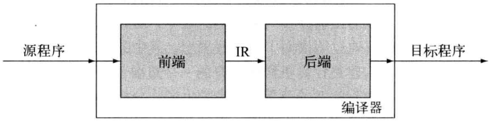
* 前端
   * 专注于理解源语言程序
   * 前端必须将其对源程序的认识编码到某种结构中，以供后端稍后适用
   * 前端必须确保源程序是良构的，而且必须将输入的代码映射到IR
* IR
   * 编译器使用一些数据结构来表示它处理的代码，这种形式称为中间表示(Intermediate Representation，IR)
   * 中间表示IR成为了编译器对所转换代码的权威表示
   * 在编译过程中的每个点，编译器都有一个权威表示
   * 随着编译过程的进展，可以使用几种不同的IR，但在每个点上，都只有一种表示会成为权威的IR
   * 我们可以将权威IR看做编译器各个独立阶段之间所传递程序的版本
* 后端
   * 专注于将程序映射到目标机
   * 后端必须将IR程序映射到目标机的指令集和有限的资源上
   * 由于后端仅处理前端生成的IR，因此它可以认为IR不包括任何语法和语义错误

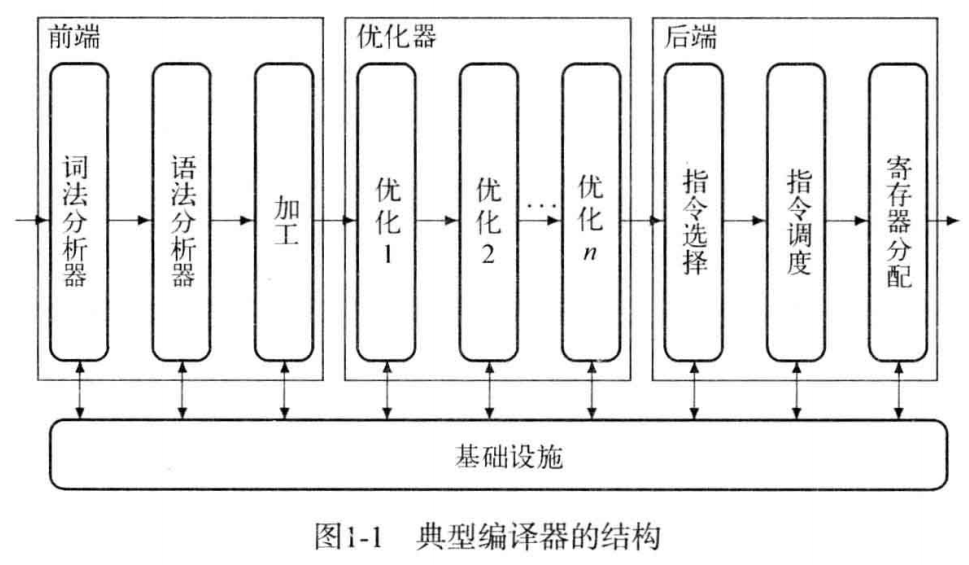

引入IR使得可以向编译增加更多阶段。上图是典型的三阶段优化编译器结构。每个阶段内部都划分为若干趟。
* 前端由两趟或三趟组成，处理识别有效源语言程序的各种细节，并产生该程序的初始IR形式
* 中间部分包含执行不同优化的各趟处理
* 后端由若干趟处理组成，每一趟都将输入的IR程序进一步处理，使之更接近目标机的指令集

### 前端
前端根据语法和语义，判断输入代码是否是良构的。如果前端发现代码是有效的，它会以编译器的IR格式来建立该diamagnetic的一个表示，否则，它向用户回报诊断错误信息，以标识该代码的问题。

#### 检查语法
编译器必须将程序的结构与语言的定义进行比较，需要
* 一种适当的形式化定义
* 一种检测输入是否满足该定义的高效机制
* 如何继续处理无效输入的相关规划

#### 什么是词法分析器？
定义：编译器中的一趟，将字符构成的串转换为单词构成的流。

词法分析器以字符流为输入，并将其转换为已归类单词的流，已归类的单词是形如(p,s)的对，其中p是单词的词类，而s是单词的拼写。以`Compilers are engineered objects。`这个句子为例，词法分析器会将其转换为下述已归类单词的流：
```
(noun,"Compilers"),(verb,"are"),(adjective,"engineered"),(noun,"objects",(endmark,"."))
```

#### 什么是语法分析器？
定义：编译器中的一趟，判断输入流是否是源语言的一个句子。

语法正确的句子可能是无意义的。例如表达式`a <- a * 2 * b * c * d`，在语法上可能是良构的，但如果b和d是字符串，这个语句仍然可能是无效的。再如，过程调用指定的参数数目应该与过程的定义一致。

#### 什么是类型检查？
编译器中的一趟，检查输入程序中对名字的使用再类型方面是否一致。

### 中间表示
编译器前端处理的最后一个问题是生成代码的IR形式。编译器可以使用各种不同种类的IR，这取决于源语言、目标语言和编译器应用的各种特定的转换。

### 优化器
优化器分析代码的IR形式，以发现有关上下文的事实，并利用此项上下文相关知识来重写代码，使之能够以更有效的方式来得到同样的答案。大多数优化都包括两个过程：
* 分析
   * 数据流分析
      * 再编译时推断运行时值的流动
   * 相关性分析
      * 使用数论中的测试方法来推断下表表达式的可能值
* 转换
   * 使用分析的结果将代码重写为一种更高效的形式

### 后端
编译器的后端会遍历代码的IR形式，并针对目标机输出代码。对于每个IR操作，后端都会选择对应的目标机操作来实现它。后端会确定哪些值能够驻留再寄存器中，哪些值需要放置到内存中。

后端的代码生成大致分为四个阶段：
* 指令选择（instruction selection）
   * 将IR操作重写为目标机操作
      * 以表达式`a <- a * 2 * b * c * d`为例，将其表示为ILOC虚拟机的代码(某种简单的RISC机器的汇编语言)，过程如下：<br>
         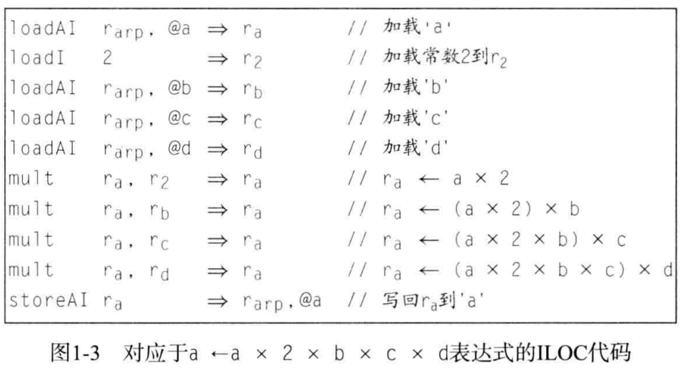
      * 指令选择器可以利用目标机提供的特殊操作。例如，如果目标机有立即数乘法操作(multI)，编译器会将上图中`mult ra,rc -> ra`替换为`multI ra, 2 -> ra`，这样就不需要`loadI 2 > r2`的操作了，而且减少了对寄存器的使用。
* 寄存器分配
   * 在指令选择期间，编译器有意忽略目标机寄存器数目有限的事实。使用所谓机虚拟寄存器（编译器勇气表示某个值可以保存在寄存器中）。实际上，编译的前期对寄存器的要求可能高于硬件的能力，寄存器分配器必须将这些虚拟寄存器映射到实际的目标机寄存器。例如，上图经过寄存器分配器后，代码重写如下（将原来的6个寄存器变为3个）：<br>
      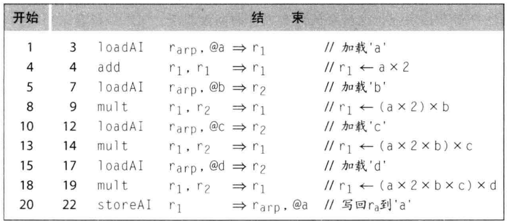
   * 这种优化可能会增加对寄存器的需求，但能够消除稍后需要发出的某些多余指令
* 指令调度
   * 指令调度器重排代码中的各个操作，试图最小化等待操作数所浪费的周期数。
   * 许多处理器都可以在长延迟操作执行期间发起新的操作，因此可以通过改变代码操作顺序，将指令序列从上图的22个周期，优化成下图的13个周期:<br>
      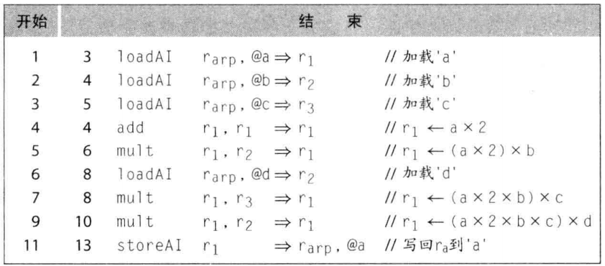
      * 上图虽然优化了执行周期，但是增加了寄存器的使用数目
* 代码生成的各组件间的交互
   * 编译中大多数真正困难的问题出现在代码生成期间。例如，指令调度移动load操作，使之远离依赖load的算术操作。这样做可以增加需要这些值的时间段，但此期间内所需的寄存器数目也会相应地增加。

# 词法分析器
词法分析器的任务是将字符流变换为输入语言的单词流。本章将介绍正则表达式，这是一种用于描述程序设计语言中的有效单词的符号表示法。由此发展出了正则表达式人工或自动生成词法分析器的形式化机制。

## 简介
词法分析器的三种不同方式：
* 表驱动词法分析器
* 直接编码的词法分析器
* 手工编码方法

## 概述
编译器的词法分析器读取由字符组成的输入流，并产生包含“单词”的输出流，每个单词都标记了其“语法范畴”，等效于英文单词的词类。

识别器：
* 可以在字符流中识别特定单词的程序

语法范畴
   * 根据单词的语法用途对单词进行的分类

微语法
   * 语言的词法结构
   * 规定了如何将字符组合为单词，以及反过来如何分开混合在一起的各个单词
   * 西方语言的微语法很简单，相邻的字母由左到右聚集在一起，形成一个单词。构建单词的算法可以查找字典判断其有效性

关键字
   * 为特定语法目的而保留的单词，不能用作标识符
   * 词法分析器会将其归类到另一个语法范畴中

## 识别单词

### 转移图(transition diagram)
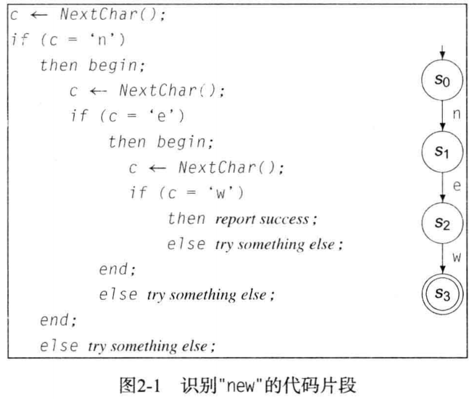

上述代码片段对每个字符执行了一次测试。右侧的转移图表示了一个识别器，每个圆圈都表示计算中的一个抽象状态。状态s0时起始状态，状态s3是接受状态(两个圈表示)。仅当输入为new时，识别器才会到达状态s3。如果不是new输入，会转移到错误状态。对于每个状态来说，各种非规定输入都将转移到错误状态。

下图是while识别器的转图:<br>
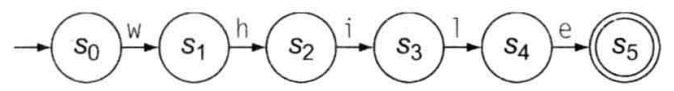

合并多个识别器，可构建用于new/not/while的识别器，如下:<br>
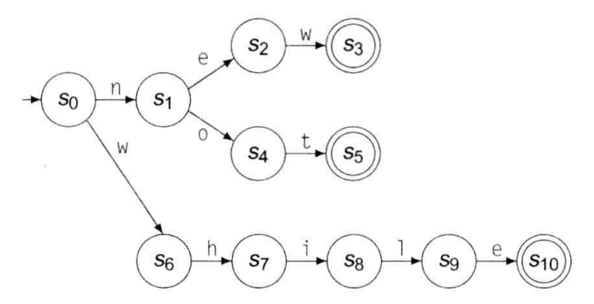

### 识别器的形式化
对于需要实现转移图的代码来说，转移图充当了这些代码的抽象。转移图还可以看做是形式化的数学对象，称为“有限自动机”，它定义了识别器的规格。形式上，有限自动机（Finite Automation）是一个五元组（S，$\sum$，$\delta$，$s_{0}$，$S_{A}$），其中各分量的含义如下：
* S是识别器中的有限状态集，以及一个错误状态Se
* $\sum$是识别器使用的有限字母表，是转移图中边的标签的合集
* $\delta$(s, c)是识别器的转移函数，将每个状态$s \in S$和每个字符$c \in \sum$的组合(s, c)映射到下一个状态。在状态$s_{i}$遇到输入字符c，FA将采用转移$s_{i} \xrightarrow{c} \delta(s_{i}, c)$
* $s_{0}$是起始状态
* $S_{A}$是接受状态

有限自动机
* 识别器的一种形式化方法，包含一个有限状态集、一个字母表、一个转移函数、一个起始状态和一个或多个接受状态。
* 识别new/not/while的FA形式化如下：<br>
   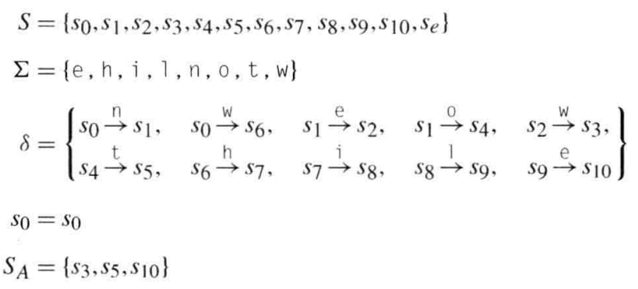

### 识别更复杂的单词
下图是一个能够识别任何数字的转移图:<br>
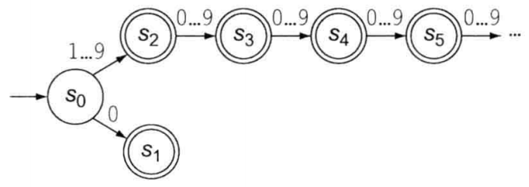

如果我们允许转移图有环，即可显著地简化FA，如下图：<br>
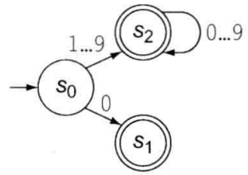

从实现的角度看，有环图更为复杂。我们无法将这种转移图直接转换为一组嵌套if-then-else结构。转换图中的环，产生了对循环控制流的需求。我们可以用`while`循环来实现这种控制流。我们可以使用表来高效地定义$\delta$：<br>
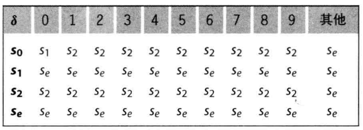
* 从状态s0出发，在不同输入字符下的状态转移
* 从状态s1或者se出发，任意输入字符都进入错误状态se
* 从状态s2出发，循环状态变化

上述转移图的伪代码如下：
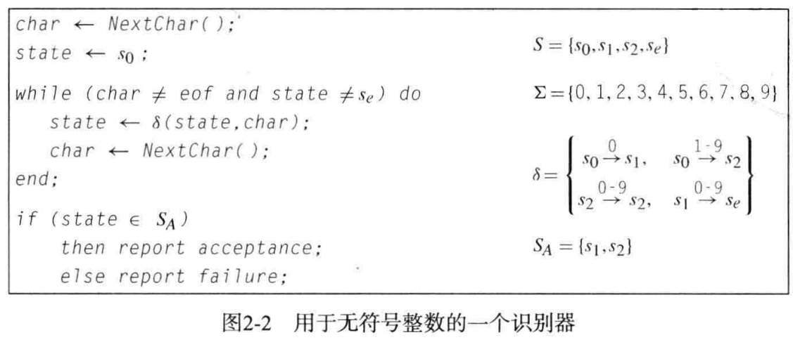

在C或Java这类Algol的语言中，支配标识符名的规则在简化后可能是这样：标识符以一个字母字符开头，后接零或多个字母数字字符：<br>
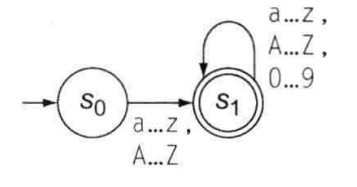

## 正则表达式
对于任一FA，我们还可以使用正则表达式(Regular Expression, RE)来描述。

### 什么是RE？
一个RE描述了一个定义在某个字母表$\sum$上的字符串集合，外加一个表示空串的字符$\epsilon$。我们将字符串的这种集合称为一种语言。对于一个给定的RE`r`来说，我们将他规定的语言记作`L(r)`。

### 符号表示法的形式化
一个RE由三个基本操作构建而成：
* 选择
   * 两个字符串集合R和S的并集，记作R|S
* 连接
   * 两个集合R和S的连接记作RS，其中包含了R中任意一个元素后接S中任意一个元素所形成的所有字符串
* 闭包
   * 集合R的柯林闭包，记作R*，把R与自身连接零次或多次形成的所有集合取并集，例如，$R^3$等价于(R|RR|RRR)
   * 有限闭包：对任一整数i，RE $R^i$指定了R出现一次到i次的情形
   * 正闭包：RE $R^+$表示R出现一次或多次

为消除二义性，括号具有最高优先级，接下来顺次为闭包、连接和选择。

在使用RE构建词法分析器的过程中，闭包性质发挥了关键作用：
* 在并集操作下的闭包性质
   * 意味着任何有限语言都是一种正则语言。我们可以对任何有限单词集合构建一个RE，只需要通过一个大的选择操作将所有单词列出即可。因为RE的集合对并集运算封闭，选择操作的结果是一个RE，而对应的语言也是正则的。
* 在连接操作下的闭包性质
   * 使得我们可以通过连接比较简单的RE而构建复杂的RE，只要a和b都是RE，那么ab必然是RE
* 在柯林闭包和有限闭包操作下
   * 使得我们可以用有限的模式，来定义特定种类的庞大乃至于无限的集合

## 从正则表达式到词法分析器
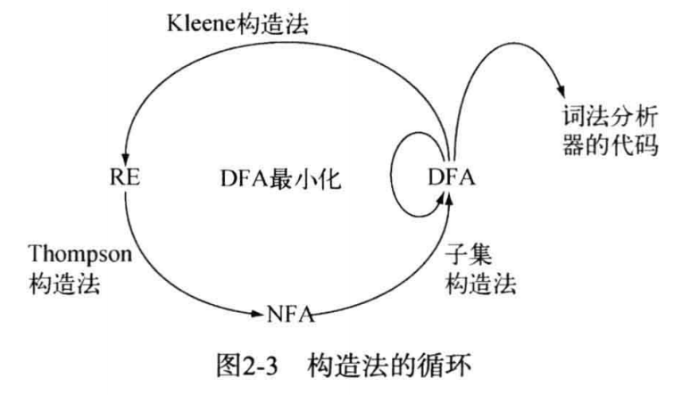

### 非确定性有限自动机
如果一个FA包含了对单个输入字符由多种可能的转移，则称为非确定性有限自动机(Nondeterministic Finite Automation, NFA)。例如下面的NFA($a^*ab$)，在状态S0遇到输入字母a时，FA可以选择两种不同的转移。可以转移到S2，也可以继续留在S0。诸如S0这样的状态，背离了我们对顺序算法行为的观念。

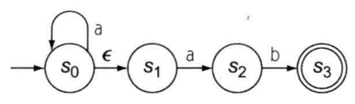

* 关键问题：我们手工构建的FA都不包含$\epsilon$，但一些RE确实用到了$\epsilon$。在FA中$\epsilon$发挥什么作用？
   * $\epsilon$转移：针对空串输入$\epsilon$进行的转移，不会改变输入流中的读写位置
   * 我们可以使用针对$\epsilon$输入的转移来合并FA，并组成用于更复杂的RE的FA

* 非确定性FA
   * 允许在空串输入$\epsilon$上继续转移的FA，其状态对同一个字符输入可能由多种转移
* 确定性FA
   * 转移函数为单值的FA称为DFA。DFA不允许空串转移$\epsilon$

* NFA和DFA的等价性
   * NFA和DFA在表达力上是等价的
   * 任何DFA都是某个NFA的一个特例
   * 任何NFA都可以通过一个DFA模拟
      * 例如：$a^*ab$于$aa^*b$所定义的单词集合是相同的


### 从正则表达式到NFA：Thompson构造法
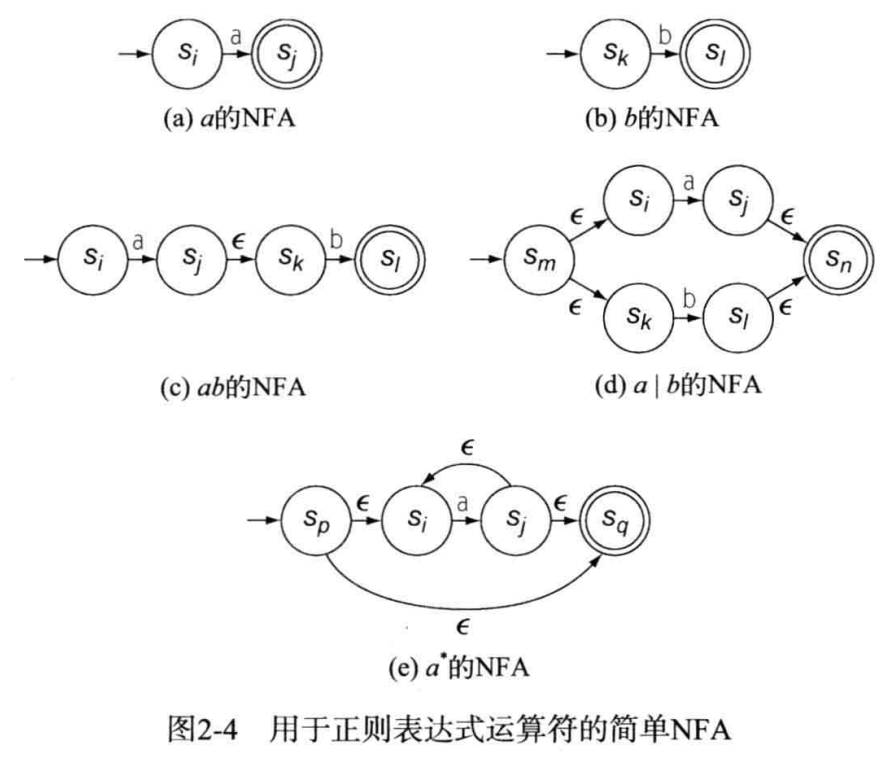

这个构造法从为输入RE中每个字符构建简单的NFA开始。接下来，它按照优先级和括号规定的顺序，对简单NFA的集合应用选择、连接和闭包等转换。

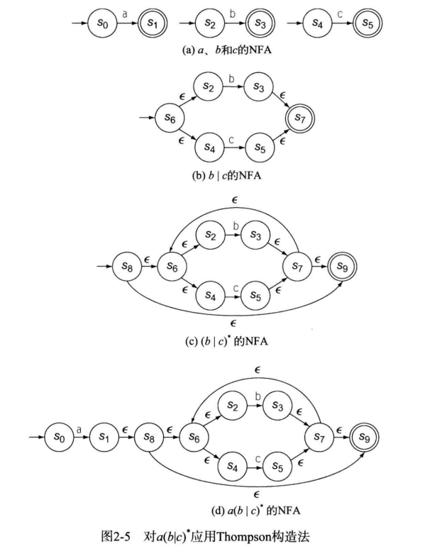

上图给出了Thompson构造法为$a(b|c)^*$构建的NFA。与下图由人生成的DFA相比，这个NFA中的状态要多得多。该NFA还包含了许多显然不必要的$\epsilon$转移。在构造的后续阶段将消除它们。

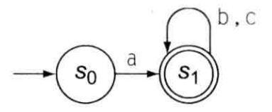

### 从NFA到DFA：子集构造法
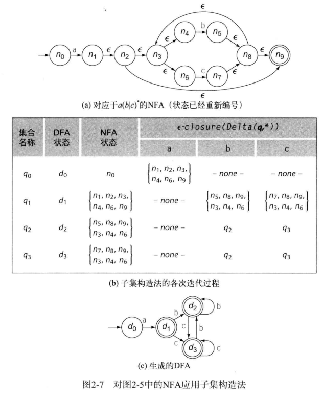
* $\epsilon-closure(S)$返回根据S构造的一组NFA状态，表示从si（$s_{i} \in S$）出发通过一个或多个$\epsilon$转移所能达到的任何状态都添加到S中。通俗地讲，S中的每个状态实际意义都是一样的，可以合并。
   * 因此，`{n1,n2,n3,n4,n6,n9}`都是一样的，可以合并为一个节点`d0`，其他的类似。
   * 最后合并后只剩下4各有效节点，构成DFA

### 从DFA到最小DFA：Hopcroft算法
为了最小化DFA中的状态数目，我们需要一种技术来检测两个状态是否等价，即二者是否对任何输入字符串都产生同样的行为。

关键问题：如何判断各状态是否等价?
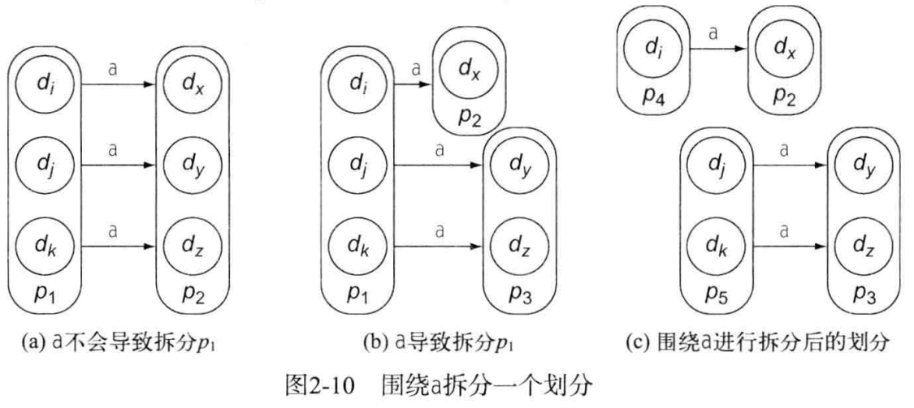
* 上图的最终结果是：判断出了di和{dj,dk}不是等价的
   * 在已知p2和p3不是等价的时候，通过a的转移，推导出了di和{dj,dk}不是等价的


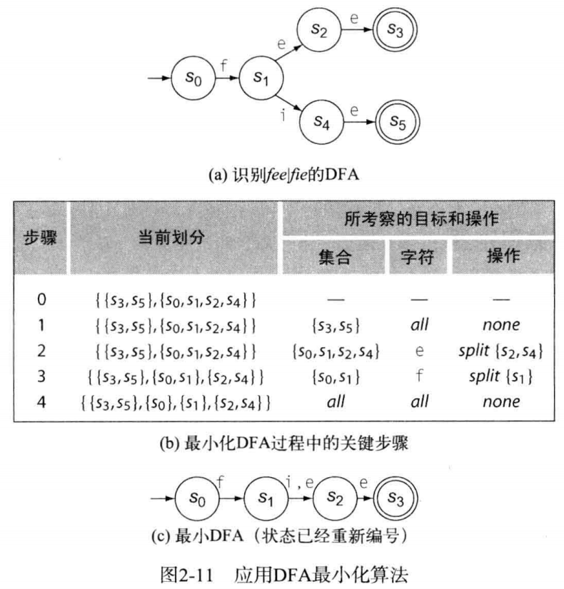

上图，以`fee|fie`的DFA为例子，解释如何最小化DFA。从图中目测可以看出状态s3和s5的作用是相同的。二者都是接受状态，均只能通过针对输入字母e的转移进入。二者都没有离开该状态的转移。我们预期DFA最小化算法能够发现这一事实，并用单一状态替换它们。
* 初始划分，如步骤0所示，将接受状态与非接受状态分开
* 考察集合{s3,s5}
   * 由于两个状态都没有退出自身的转移，这一集合不会因任何字符而进行拆分
* 考察集合{s0,s1,s2,s4}
   * 针对输入字符e，算法将{s2,s4}从该集合拆分出来
* 考察集合{s0,s1}
   * 围绕字符f拆分

下图显示了如何最小化Thompson构造法和子集构造法产生的用于识别$a(b|c)^*$的DFA。最小化算法的第一步构造了一个初始划分{{d0},{d1,d2,d3}}。由于p1只有一个状态，它是不能拆分的。在算法考察p2时，它发现p2中任何状态都没有针对输入a的转移。对于b和c，p2中的每个状态都由一个转移，只是转移的目标又回到了p2中。因此，任何符号都不会导致p2发生拆分，最终划分就是{{d0},{d1,d2,d3}}。

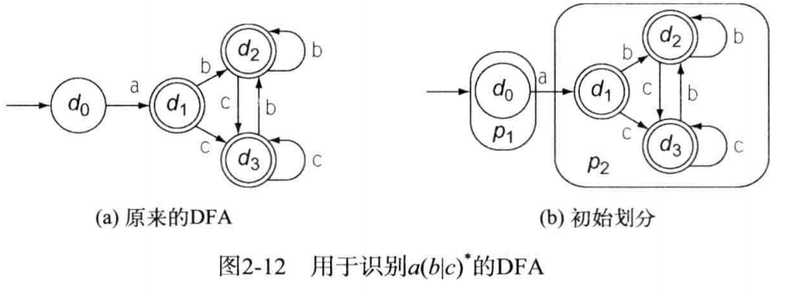

