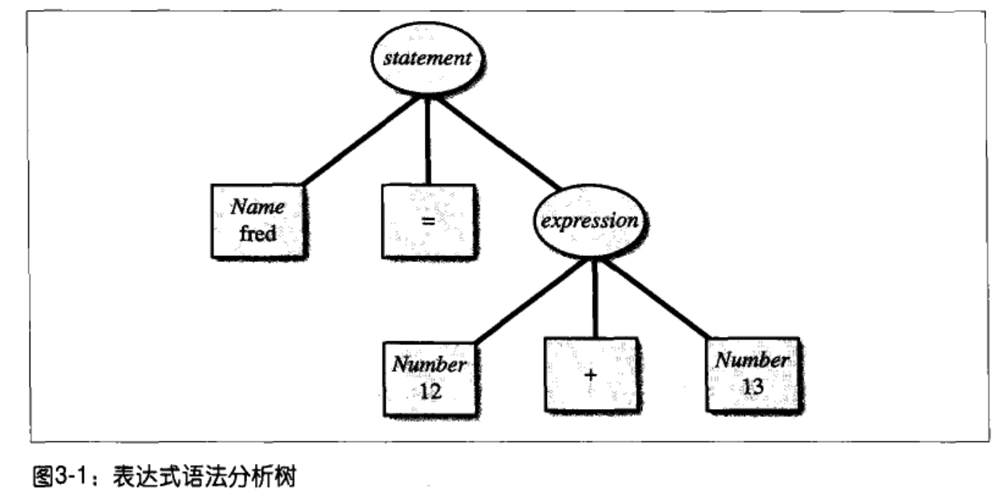

# 序
《flex与bison》读书笔记

# Flex和Bison简介
## 我们的第一个Flex程序
```
%{
int chars = 0;
int words = 0;
int lines = 0;
%}

%%

[a-zA-Z]+   { words++; chars += strlen(yytext); }
\n          { chars++; lines++; }
.           { chars++; }

%%

main (int argc, char **argv)
{
   yylex();
   printf("%8d%8d%8d\n", lines, words, chars);
}
```
* flex程序包含三个部分(通过`%%`分割)：
   * 声明和选项设置
      * `%{`和`}%`之间的代码会被原样照抄到生成的C文件的开头部分
   * 一系列的模式和动作
      * 模式(前面不能有空格) + {需要执行的C代码}
      * 模式如果用引号引起，则告诉flex使用引号内的文本的原义，而不是把他们解释成正则表达式，如："+"代表加号
      * 在任意一个flex的动作中，变量`yytext`总是被设为指向本次匹配的输入文本
   * 会被拷贝到生成的词法分析器里面的C代码
      * 主程序，主要负责调用flex提供的词法分析例程`yylex()`

* 词法分析器在动作中返回与不返回有什么区别？
   * 不返回：`"+" { printf("PLUS\n"); }`，参加[例子](./code/calc/fb1-3.l)
   * 返回：`"+"   { return ADD; }`，参加[例子](./code/calc/fb1-4.l)
      * 如果动作有返回，词法分析器会在下一次`yylex()`调用时继续
      * 如果动作没有返回，词法分析器将会立即继续进行

## 记号编号和记号值
* 当flex词法分析器返回一个记号流时，每个记号实际上有两个组成部分
   * 记号编号
   * 记号值

## 文法与语法分析
* BNF文法
   * BNF范式时书写上下文无关文法的标准格式
   * 例如下列BNF可用于描述简单的算术表达式：
      ```
      <exp> ::= <factor>
            | <exp> + <factor>
      <factor> ::= NUMBER
            | <factor> * NUMBER
      ```
      * 每一行就是一条规则，用来说明如何创建语法分析树的分支
      * 在BNF里，`::=`被读作“是”或者“变成”，|读作“或者”
      * 规则左边的名称是语法符号(symbol)

## Bison的规则描述语言
* bison程序包含了与flex程序相同的三部分结构：
   * 声明部分
      * 包含了会被原样拷贝到目标分析程序开头的C代码
      * `%token`记号声明，以便告诉bison在语法分析程序中记号的名称
      * 任何没有声明为记号的语法符号必须出现在至少一条规则的左边
   * 规则部分
      * 分号被用来表示规则的结束
      * C的动作代码在每条规则之后用花括号括起
      * 第一条规则左边的语法符号是**语法其实符号**，整个输入必须被它匹配
      * 目标符号(冒号左边的语法符号)的值在动作中代码用`$$`代替
      * 右边语法符合的语义值依次为`$1`、`$2`，直到这条规则的结束
      * 当词法分析器返回记号时，记号值总是存储在`yyval`里
      * 如果一个规则缺少显式的动作，语法分析器将把`$1`赋予`$$`
   * C代码部分

# 使用Flex
## Flex如何处理二义性模式
* 词法分析器匹配输入时匹配尽可能多的字符串
* 如果两个模式都可以匹配的话，匹配在程序中更早出现的模式

## Flex词法分析器的输入
* 输入管理的三个层次
   * 设置yyin来读取所需文件
   * 创建并使用YY_BUFFER_STATE输入缓冲区
   * 重定义YY_INPUT

# Flex规范参考
* Flex常见变量和函数
   * https://zhuanlan.zhihu.com/p/120819122
* flex程序由三部分构成
   * 定义部分
      * 定义部分的文字块会被拷贝到`yylex()`的开始部分之前
      * 文字块通常包括规则部分代码所需要使用的变量和函数声明，也包括引入头文件的`#include`
      * 如果以`%top{`开始的话，文字块会被拷贝到生成程序的头部附近
   * 规则部分
      * 规则部分开始处的文字块将被拷贝到`yylex()`中本地变量声明之后
      * 它可以包含更多的声明和设置代码
      * 规则部分其他位置的文字块在`yylex()`中的拷贝位置并不确定，所以它只应该包含注释
   * 用户子例程
* 匹配方式
   * 当flex词法分析器运行时，它根据规则部分的模式进行匹配。每次它发现一个匹配，它指向这个模式所关联的C代码
      * 如果模式后面紧跟一个竖线而不是C代码的话，该模式使用与这个文件中下一模式相同的C代码
      * 当输入字符无法匹配任何模式时，词法分析器将任务它匹配了一个动作代码位ECHO的模式，相应地，该记号被拷贝输出

## BEGIN
* 词法分析器从状态0开始，该状态也被称为`INITIAL`
* 其他所有状态必须在定义部分通过`%s`或者`%x`行来命名
* 通过`BEGIN statename;`，可切换起始状态

## NAME
* 允许对正则表达式进行命名，然后在规则部分通过名字来引用它们
* 通过`NAME expression`，可为正则表达式expression取别名，方便规则匹配

## Flex库
* `-lfx`可链接此库，库中包含`main()`和`yywrap()`

## 合并的词法分析器
* 可以使用起始状态来合并两个词法分析器
* 通常会把合并的词法分析器与合并的语法分析器结合起来使用

## 编译词法分析器的选项
* 两种形式的选项
   * 在词法分析器的开头部分写成如`%option name`的形式
      * `%option noyywrap`
   * 写成命令行上的`--name`的形式
      * `--noyywrap`

## 可重入词法分析器
* 通过`yylex_init()`来创建词法分析器
   * 每次都会产生一个独立的词法分析器，多个词法分析器可以同时生效
* 把`yyscan_t`的地址作为参数输入
* 可以把`yyscan_t`代入任何依次`yylex()`的调用中
* 最后通过`yylex_destroy`来删除`yyscan_t`
* 参考[例子](。/code/reentrancy_pure_scanner)

## 常用函数

### yylex()和YY_DECL
* 通常来说，`yylex`的调用并没有参数，它主要通过全局变量与程序的其他部分交互
* 宏`YY_DECL`定义了它的调用顺序，可以重定义它来添加参数
   ```
   %{
   #define YY_DECL int yylex(int *fruitp)
   %}
   %%
   apple|orange {(*fruitp)++;}
   ```

### yyrestart()
* 调用`yyrestart(f)`来使得词法分析器从打开的标准输入输出文件f来读取输入

### yywrap()
* 当词法分析器到达文件的末尾时，会调用`yywrap()`
   * 如果返回0，则继续分析
   * 如果返回1，则词法分析将返回一个零记号来表明文件结束
* `%option noyywrap`可以用来移除对`yywrap()`的调用

# 使用Bison
* flex把输入流分解为若干个片段，而bison则分析这些记号并基于逻辑进行组合

## Bison语法分析器如何匹配输入
### 移进/归约分析
* 移进(shift)
   * 当bison在处理时，会创建一组状态，每个状态都反映出一个或者多个部分分析过的规则中可能的位置
   * 当语法分析器读取记号时，每当它读到的记号无法结束一条规则时，它将把这个记号压入一个内部堆栈，然后切换到一个新状态，这个状态能够反映出刚刚读取的记号
* 归约(reduction)
   * 当发现压入的所有语法符号已经可以组成规则的右部时，它将把又不符号全部从堆栈中弹出，然后把左部语法压入堆栈
   * 每当bison归约一条规则时，它会指向该规则关联的用户代码。该代码也就是你对语法分析器分析的内容实际要做的事情
* 例子`fred = 12 + 13`<br>
   
   * 语法分析器开始时依次移进一个记号到内部堆栈中：
   ```
   fred
   fred =
   fred = 12
   fred = 12 +
   fred = 12 + 13
   ```
   * 这时它可以归约规则`expression: NUMBER + NUMBER`，所以它从堆栈中弹出12、加号和13，并把它们替换为`expression`
   ```
   fred = expression
   ```
   * 现在它又可以归约规则`statement: NAME = expression`，所以它弹出fred、=和expression，并把它们替换为statement
   * 我们到达输入的末尾而堆栈被归约成起始符号，所以输入对于这个语法是有效的

## Bison的LALR(1)语法分析器无法分析的语法
* bison语法分析器可以使用两种分析方法
   * LALR(1) - 自左向右向前查看一个记号
      * 比GRL更快，更容易使用
      * 但是不能处理需要向前查看多个记号才能确定是否匹配规则的语法
   * GLR - 通用的自左向右
      * 功能更强大
* 特殊的例子
   ```
   phrase: cart_animal AND CART
      | work_animal AND PLOW
   cart_animal: HORSE | GOAT
   work_animal: HORSE | OX
   ```
   * 这个语法虽然没有歧义，但是bison无法处理它，因为它需要向前查看两个符号
      * 例如，对于`HORSE AND CART`这个输入，在看到CART之前它无法区别HORSE是一个cart_animal还是一个work_animal
   * 如果修改成一些规则，则bison没有问题，因为bison能够向前查看一个记号来确定HORSE之后是否是CART
      ```
      phrase: cart_animal CART
         | work_animal PLOW
      ```

## Bison语法分析器
* bison规范同样由三部分组成
   * 定义部分
      * 处理语法分析器的控制信息，建立分析器操作所需要的执行环境
   * 规则部分
      * 包含语法分析器的规则
   * C代码
      * 会被逐字拷贝到C程序中去
* bison通过把每个片段插入到标准的框架文件中来创建C程序
* 规则会被编译成数组的形式，数组的内容代表了可以匹配输入记号的状态机
* 语义动作中的`$N`和`@N`的值会首先翻译成C代码，然后被放置到`yyparse()`中的switch语句中
* `yyparse()`会在归约发生时执行相应的动作

## 抽象语法树
* 参见[例子(./code/calc_2)

# Bison规范参考
## Bison语法结构
* bison程序由三部分构成
   * 定义部分
      * 文字块存在于`%{`和`%}`或者`%code`中，通常包括声明和`#include`行
         * 声明包括`%union`, `%start`，`%token`，`%type`，`%left`，`%right`和`%nonassoc`
         * 文字块的内容会被拷贝到`yyparse()`开头之前
   * 规则部分
      * 包含语法规则和语义动作的C代码
   * 用户子例程

## 规则动作
* 动作可以通过一个美元符号加上一个数字来使用规则中语法符号所关联的值，冒号后第一个语法符号的数字时1
* `$$`指向左部符号--也就是冒号左边的符号的值
   * 符号值(语义值)可以有不同的C类型
* 没有语义动作的规则，默认动作：{ $$ = $1;}
   * 如果有个规则没有右部符号，而左部符号右声明了类型，必须为它编写一个语义动作来赋值

## 嵌入动作
* 下面两个规则时等价的
   ```
   thing: A { printf("seen an A"); } B;
   thing: A fakename B;
   fakename: /* 空 */ { printf("seen an A"); };
   ```

## 移进/归约冲突
* 移进/归约(shift/reduce)冲突
   * 是指一个输入字符串存在两种可能的语法分析器
      * 并且其中一个分析器结束一条规则(选择归约)
      * 而另一个并不结束(选择移进)
* 例子
   ```
   e: 'X'
      | e '+' e
      ;
   ```
   * 输入字符串`X+X+X`，有两种可能的语法分析器
      * (X+X)+X   - 选择归约
      * X+(X+X)   - 选择移进，除法用户使用操作符的优先级声明，否则bison选择移进

## 归约/归约冲突
* 归约/归约发生在同一个记号可以结束两条不同规则的时候，例如
   ```
   prog: proga | progb ;
   proga: 'X';
   progb: 'X';
   ```
   * X可以是proga也可以是progb

## Bison程序的问题
* 无限递归
   * 创建了一个递归规则，但是并没有任何方法来结束这个递归
      ```
      xlist: xlist 'X';
      ```
* 互换优先级
   ```
   %token NUMBER
   %left PLUS
   %left MUL
   %%
   expr  :  expr PLUS expr %prec MUL
         |  expr MUL expr %prec PLUS
         |  NUMBER
         ;
   ```

## 词法反馈
* 语法分析器可以反馈一些信息给词法分析器
* 例如，当特定规则是上下文相关时，就在语法分析器中设置一个标志：
   ```
   /* 语法分析器 */
   %{
   int parenstring = 0;
   %}
   ...
   %%
   statement: MESSAGE { parenstring = 1; } '(' STRING ')';
   ```
   * 然后在词法分析器中判定该标记：
      ```
      %{
      extern int parenstring;
      %}
      %s PSTRING
      %%
      ...
      "message" return MESSAGE;
      "("   {
               if (parenstring) BEGIN PSTRING;
               return '(';
            }
      <PSTRING>[^)]* {
                        yylval.svalue = strdump(yytext);
                        BEGIN INITIAL;
                        return STRING;
                     }
      ```
      * 通过这样，就可以处理`message (any characters)`这样的语句了。不然，每次看到左圆括号都决定开始分析字符串，是不对的，因为左圆括号在该语法的其他地方可能有不同的解释，必须结合右圆括号一起分析

## 文字记号
* bison把单引号引起的字符也看作一个记号
   * 例如：`expr: '(' expr ')';`，其中左圆括号和右圆括号都是文字记号(literal token)
   * 词法分析器通常从输入中对应的单个字符来产生这些记号，如：`return yytext[0];`

## 位置
* 在动作代码中，每个符号的位置可以使用`@$`来代表左部符号，第一个右部符号使用`@1`

## %parse-param
* 如果语法分析器需要从周边程序导入一些信息，它可以使用全局变量，或者也可以为其定义添加参数：
   ```
   %parse-param { char *modulename }
   %parse-param { int intensity }
   ```
   * 这样就允许调用：`yyparse("mymodule", 42)`，然后在语法分析器的动作代码中使用`modulename`和`intensity`

## 库文件
* 在bison库文件中的例程通常是`main()`和`yyerror()`，通常不需要。

## 字符编码
* bison将自己的数值赋值给符号记号，所以如果一个语法分析器只使用符号记号的话，它可以被成功移植

## 优先级和结合性声明
* 当bison处理二义性语法时，它使用默认规则来决定如何分析具有二义性的序列。但这种规则通常并不会产生我们期望的结果，所以bison使用操作符声明来使得你可以改变它处理“移进/归约”冲突的方式。
* 决定操作符和操作数关系的规则被称为优先级(precedence)和结合性(associativity)

* 优先级
   * 优先级为每个操作符赋予一个优先“级别”
* 结合性
   * 结合性决定语法在使用相同操作符或者具有相同优先级的操作符时如何对表达式分组
   * 左结合，`A-B-C` == `(A-B)-C`
   * 右结合，`A-B-C` == `A-(B-C)`

### 优先级声明
* %left , %right
   * 左结合, 右结合
* %nonassoc
   * 没有结合性的操作符
* 操作符按照优先级的升序被声明
   * 在同一行的所有操作符具有相同的优先级

### 使用优先级和结合性解决冲突
* 符号优先级
   * 每个记号通过优先级声明获得优先级
* 规则优先级
   * 每条规则也有各自的优先级和结合性
   * 规则通过规则中的%prec子句来声明，如果没有%prec子句，该规则的优先级由最右记号决定
* 当出现移进/归约冲突时，bison会毕竟可能移进的记号和可能归约的规则的优先级
   * 如果记号的优先级更高，那么就移进
   * 如果规则的优先级更高，那么就归约
   * 如果两者具有相同的优先级
      * 如果它们是左结合，就归约
      * 如果它们是右结合，就移进
      * 如果没有结合性，就报错

## 递归规则
* 为了分析不定长的项目列表，需要使用递归规则，也就是用自身来定义自己
   * 例如,
   ```
   numberlist: /* 空 */
      | numberlist NUMBER
      ;
   // 通过逗号分隔的不为空的表达式列表
   exprlist: expr
      |      exprlist ',' expr
      ;
   // 通过交互的递归规则，彼此引用对方
   exp:  term
      |  term '+' term
   term: '(' exp ')'
      |  VARIABLE
      ;
   ```
   * 任何递归规则或者交互递归规则组里的每个规则都必须至少有一条非递归的分支(不指向自身)
      * 否则，将没有任何途径来终止它所匹配的字符串

### 左递归和右递归
* 可以把递归的引用放在规则右部的左端(左端)或者右端(右递归)：
   ```
   // 左递归
   exprlist: exprlist ',' expr;

   // 右递归
   exprlist: expr ',' exprlist;
   ```
* bison处理左递归要比处理右递归更有效率
   * 这是因为右递归的内部堆栈需要追踪到目前为止所有还处在分析中的规则的全部符号
      * 如果使用右递归版本的表达式(例如，10个表达式)，当读取第10个表达式的时候，堆栈中会有20个元素。当列表结束时，所有嵌套的exprlist都需要按照从右向左的顺序来归约
      * 如果使用左递归的版本，exprlist将在每个expr只有进行归约，这样在内部堆栈中列表将永远不会超过三个元素
* `YYINITDEPTH`可以用来控制堆栈的长度

## 规则
* 规则的右部可以空
* 规则可以在末尾显式声明优先级
   ```
   expr: expr '*' expr
      |  expr '-' expr
      | '-' expr %prec UMINUS;
   ```
   * 优先级仅用来处理那些有二义性的语法

## %start声明
* 通常起始规则是第一个出现的规则，如果希望以其他规则作为起始规则，那么可在声明部分如下编写：`%start somename`，则以规则somename作为起始规则。

## 符号值
* bison中每个符号都有关联的值
   * 如果记号是NUMBER，那么它的值就是特定的数值
      * int或者double类型
   * 如果记号是STRING，它的值可能是指向字符串拷贝的指针
      * `char *`类型
   * 如果记号是SYMBOL，它的值可能是指向符号表中描述该符号的条目的指针

### 声明符号类型
* bison通过C语言的联合类型来声明符号值，使得它可以包含所有类型
   * 在`%union`声明中列出所有可能的类型，bison会把它们转化为`YYSTYPE`
* 对于每个在动作代码中需要被使用或者设置值的符号，必须声明它的类型，参见[例子](./code/calc_2/fb3-1.y)
   * 使用`%type`来声明非终结符
   * 使用`%token, %left, %right, %nonassoc`来声明记号，以便在联合类型的域定义中使用记号的名字和对应的类型
   * 接着，当你通过$$, $1等来使用符号值时，bison将自动使用联合类型中的恰当域

* 显式符号类型
   * bison允许在使用符号值的地方声明该符号的显式类型，更推荐用声明符号类型
   * 通过`<>`把类型名括起，例如：`$<XXX>$`

## 记号
* bison语法分析器需要新的记号时，会调用`yylex()`，在输入结束时，会返回零
* 所有被用来作为记号的符号必须在定义部分显式声明：
   * `%token UP DOWN LEFT RIGHT`
   * 记号也可以通过`%left, %right, %nonassoc`声明

* 记号编号
   * bison负责给记号编号(也可以自己指定)，可通过生成的头文件，将记号编号传递给词法分析器
* 记号值
   * 每个符号都有关联值，需要在词法分析器返回记号给语法分析器时来设置
   * 记号值总是保存在变量`yylval`中
      * 最简单的语法分析器里，`yylval`就是int变量，可在词法分析器中如下设置：`[0-9]+   { yylval = atoi(yytext); return NUMBER;}`
      * 大多数情况下，不同的符号会有不同的值类型，可通过`%union, %type`声明类型
   * 所有值必须有类型，需要把相应的联合类型中的标记名字用尖括号括起，放到`%token`或者优先级声明中，例如：
      ```
      %union {
         enum optype opval;
         double dval;
      }
      %nonassoc <opval> RELOP
      %token <dval> REAL
      %union { char *sval; }
      %token <sval> STRING
      ```
      * 当在词法分析器中返回记号时，需要设置`yylval`中相应的域
      ```
      %{
      #include "parser.tab.h"
      %}
      ...
      [0-9]+\.[0-9]* {yylval.dval = atof(yytext); return REAL;}
      \"[^:]*\"      {yylval.sval = strdup(yytext); return STRING;}
      "=="           {yyval.opval = OPEQUAL; return RELOP;}
      ```

## %type声明
* `%type <type> name, name, ...`
* `%type`被用来声明非终结符，对于记号而言，需要使用`%token, %left, %right, %nonassoc`来声明

## union声明
* `%union`声明可能拥有所有C类型，bison将其拷贝到`YYSTYPE`的C的union声明里
* 如果不存在`%union`声明，bison把`YYSTYPE`定义为int
* 可以通过`%type`来把`%union`中声明的类型与特定的符号关联起来
