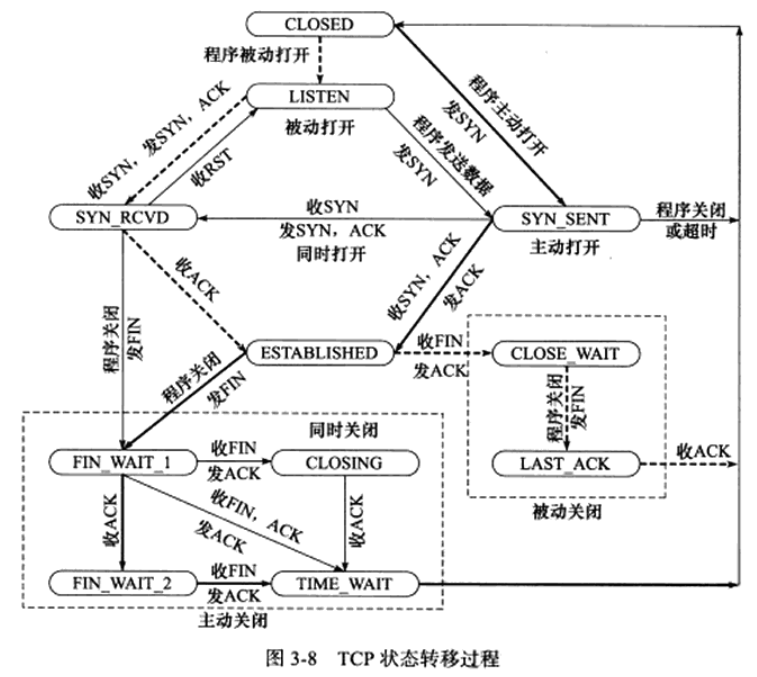
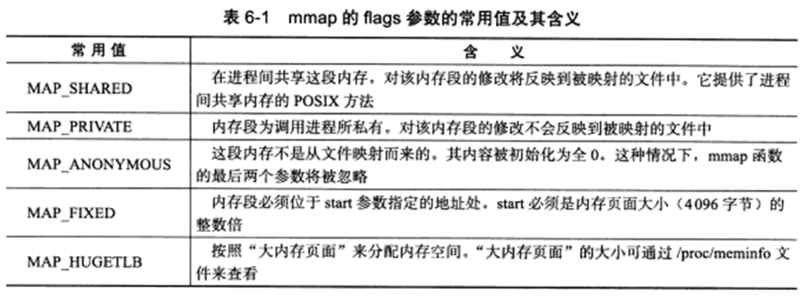
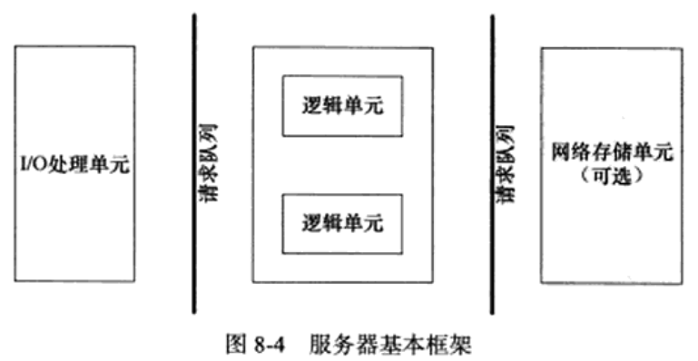
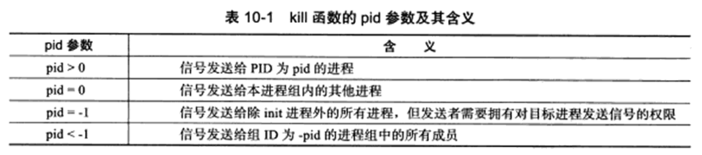
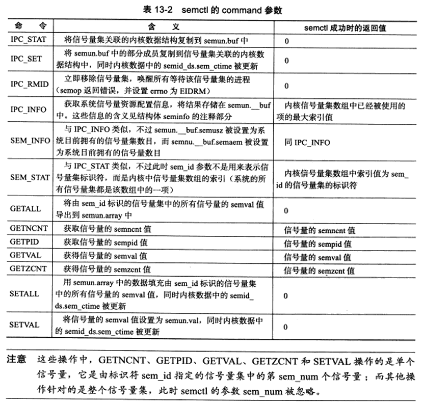

# 序
《Linux高性能服务器编程》 -- 游双

# TCP/IP协议族
## TCP/IP协议族体系结构以及主要协议


### 数据链路层
* 目的 - 实现了IP地址和机器物理地址(MAC地址)之间的转换
    * ARP协议(Address Resolve Protocol, 地址解析协议)
    * RARP协议(Reverse Address Resolve Protocol, 逆地址解析协议)
* 抽象 - 数据链路层隐藏了物理媒介的不同

### 网络层
* 目的 - 实现数据包的选路和转发，网络层的任务是选择主机之间的路由节点，以确定两台主机之间的通信路径
    * IP协议(Internet Protocol, 因特网协议)
    * ICMP协议(Internet Control Message Protocol, 因特网控制报文协议)
        * 用于检测网络连接
* 抽象 - 网络层隐藏了网络拓扑连接的细节

### 传输层


* 目的 - 为两台主机上的应用程序提供端到端(end to end)的通信，与网络层使用的逐跳通信方式不同，传输层只关心通信的起始端和目的端
    * TCP协议(Transmission Control Protocol, 传输控制协议)
    * UDP协议(User Datagram Protocol，用户数报协议)
    * SCTP协议(Stream Control Transmission Protocol, 流控制传输协议)

### 应用层
* 目的 - 处理应用程序的逻辑，在用户空间实现(其他层级在内核中实现)
    * ping应用程序
        * 利用ICMP报文检测网络连接
    * telnet协议
        * 远程登陆协议
    * OSPF协议(Open Shortest Path First, 开放最短路径优先)
        * 动态路由更新协议，用于路由之间的通信
    * DNS协议(Domain Name Service, 域名服务)
        * 提供机器域名到IP地址的转换

## 封装(encapsulation)


### TCP封装


* TCP报文段(TCP message segment) - 经TCP封装后的数据
    * 上图中的虚线框构成了TCP报文段，由TCP头部信息和TCP内核缓冲区构成
* UDP数据报(UDP datagram) - 经UDP封装后的数据
    * UDP不保存数据副本，数据发送成功后，内核缓冲区的数据就丢弃了

### IP封装
* IP数据报(IP datagram) - 经过IP封装后的数据
    * 其数据部分可能是
        * TCP报文段
        * UDP数据报
        * ICMP报文

### 数据链路层封装
* 帧(frame) - 经过数据链路层封装的数据
    * 以太网帧(ethernet frame) - 在以太网上传输
    * 令牌环帧(token ring frame) - 在令牌环网络上传输


* 最大传输单元(Max Transmit Unit, MTU) - 最多能携带多少上层协议数据
    * 上图的以太网帧的MTU是1500字节，过长的IP数据报需要被分片(fragment)传输

## 分用(demultiplexing)
!(demultiplexing)[./pictures/demultiplexing.png]
* 分用
    * 当帧到达目的主机时，将沿着协议栈自底向上依次传递。各层协议依次处理帧中本层负责的头部数据，以获取所需的信息，并最终将处理后的帧交给目标应用程序。
    * 分用时依靠头部信息中的类型字段实现的
* 如何区分IP、ARP和RARP帧？
    * 帧头部有2字节的类型字段，0x800为IP数据报，0x806为ARP请求应答报文，0x835为RARP请求或应答报文
* 如何区分ICMP、TCP和UDP的IP数据报？
    * IP数据报的头部采用16位的协议字段来区分
* 如何区分TCP/UDP的不同上层应用？
    * 通过头部中的16位的端口号(port number)来区分，53为DNS协议，80为HTTP协议

## 测试网络
本文用虚拟机模拟了两个网卡：
* 主网卡
    * 192.168.179.132
    * 00:0c:29:35:c3:33
    * ens33
* 次网卡
    * 192.168.179.139
    * 00:0c:29:35:c3:3d
    * ens38
* 默认网关
    * 192.168.179.2, _gateway
    * 00:50:56:ee:0b:41
* Host用于与NAT虚拟网络进行通信的虚拟网卡
    * 192.168.179.1
    * 00:50:56:c0:00:08

## ARP协议工作原理
* 工作原理
    * 主机向自己所在的网络广播一个ARP请求，该请求包含目标机器的网络地址。此网络上的其他机器都将收到这个请求，但只有被请求的目标机器会回应一个ARP应答，其中包含自己的物理地址

### 以太网ARP请求/应答报文详解


### ARP高速缓存的查看和修改
ARP维护一个高速缓存，其中包含经常访问(比如默认网关)或最近访问的机器的IP地址到物理地址的映射。利用`arp -a`可以查看ARP高速缓存，例如：
```bash
> arp -a
? (192.168.179.1) at 00:50:56:c0:00:08 [ether] on ens33
? (192.168.179.1) at 00:50:56:c0:00:08 [ether] on ens38
_gateway (192.168.179.2) at 00:50:56:ee:0b:41 [ether] on ens33
_gateway (192.168.179.2) at 00:50:56:ee:0b:41 [ether] on ens3
? (192.168.179.254) at 00:50:56:f9:51:f7 [ether] on ens33
? (192.168.179.254) at 00:50:56:f9:51:f7 [ether] on ens38
```
* 其中，前两条描述的是HOST端的虚拟网卡，中间两条描述的是默认网关，最后两条描述的是路由
    * 默认网关的IP是：192.168.179.2, MAC地址是：00:50:56:ee:0b:41, 这和`ip`命令的结果是一致的：
    ```bash
    > ip neigh
    192.168.179.2 dev ens33 lladdr 00:50:56:ee:0b:41 STALE
    192.168.179.2 dev ens38 lladdr 00:50:56:ee:0b:41 STALE
    > ip route
    default via 192.168.179.2 dev ens33 proto dhcp metric 100
    default via 192.168.179.2 dev ens38 proto dhcp metric 101 
    ```

### 使用tcpdump观察ARP通信过程
* 实验
    * 在Host端执行telnet命令登录到虚拟机192.168.179.139，并用tcpdump抓取这个过程中两台机器之间交换的以太网帧
* 命令
    * 虚拟机
        * 清楚ARP cache: `sudo ip -s -s neigh flush all`
        * 捕获目标或者源是192.168.179.132的ARP包：`sudo tcpdump -i ens33 -ent '(arp and dst 192.168.179.132) or (arp and src 192.168.179.132)'`
    * HOST：telnet -a 192.168.179.132
    * 捕获如下ARP包：
        * `00:0c:29:35:c3:33`是主虚拟网卡`192.168.179.132`的MAC地址
        * `00:50:56:ee:0b:41`是默认网关的MAC地址
        * 主虚拟网卡向默认网关要其MAC地址
        * 默认网关返回ARP Reply包给主虚拟网卡，并告知其MAC地址是`00:50:56:ee:0b:41`
        * `arp -n`中添加了如下条目：
            * `192.168.179.2            ether   00:50:56:ee:0b:41   C                     ens33`
    ```bash
    00:0c:29:35:c3:33 > 00:50:56:ee:0b:41, ethertype ARP (0x0806), length 42: Request who-has 192.168.179.2 tell 192.168.179.132, length 28
    00:50:56:ee:0b:41 > 00:0c:29:35:c3:33, ethertype ARP (0x0806), length 60: Reply 192.168.179.2 is-at 00:50:56:ee:0b:41, length 46
    ```


* 上图中，路由器也收到了以太网帧1，因为该帧是一个广播帧，不过路由器并没有回应其中的ARP请求。

## DNS工作原理


* DNS查询类型
    * 类型A，值是1，表示获取目标主机的IP地址
    * 类型CNAME，值是5，表示获得目标主机的别名
    * 类型PRT，值是12，表示反向查询

### Linux下访问DNS服务
* `/etc/resolv.conf`存放了DNS服务器的IP地址`nameserver`
* `host -t A <addr-name>` - 查询类型A的机器名对应的IP

### 使用tcpdump观察DNS通信过程
* `sudo tcpdump -i ens33 -nt -s 500 port domain`
    * 只抓取`ens33`上的使用domain(域名)服务的数据包，即DNS查询和应答报文
* `host -t A www.baidu.com`执行后，抓取的数据：
    * 第一个数据包中，
        * 56694是DNS查询报文的标识值，因此该值也出现在了DNS应答报文中
        * “+”表示递归查询
        * “A?”表示使用A类型的查询方式
        * 括号中的数值42是DNS查询报文的长度(以字节为单位)
    * 第二个数据包中，
        * “4/0/1”表示该报文中包含4个应答资源记录、0个授权资源记录和1个额外信息记录
            * `CNAME www.a.shifen.com., CNAME www.wshifen.com., A 119.63.197.139, A 119.63.197.151`表示4个应答资源记录
    ```bash
    IP 192.168.179.132.49122 > 192.168.179.2.53: 56694+ [1au] A? www.baidu.com. (42)
    IP 192.168.179.2.53 > 192.168.179.132.49122: 56694 4/0/1 CNAME www.a.shifen.com., CNAME www.wshifen.com., A 119.63.197.139, A 119.63.197.151 (127)
    ```

## socket和TCP/IP协议族的关系
数据链路层、网络层、传输层协议在内核中实现，操作系统提供了两套系统调用来访问这些协议，分别是：
* socket
* XTI (基本不用)

socket API提供了两点功能：
* 将应用程序数据从用户缓冲区中复制到TCP/UDP内核发送缓冲区，以交付内核来发送数据；或从内核TCP/UDP接收缓冲区中复制数据到用户缓冲区，以读取数据
* 应用程序可通过它们来修改内核中各层协议的某些头部信息或其他数据结构，从而精细地控制底层通信的行为

# IP协议详解
本章从两个方面讨论IP协议：
* IP头部信息
    * 用于指定IP通信的源端和目的端
* IP数据报的路由和转发

## IP服务的特点
IP协议为上层协议提供无状态、无连接、不可靠的服务：
* 无状态
    * IP通信双方不同步传输数据的状态信息，没有上下文关系
    * 优点是简单、高效
* 无连接
    * IP通信双方都不长久地维持对方的任何信息，上层协议每次发送数据的时候，都必须明确指定对方的IP地址
* 不可靠
    * IP协议不能保证IP数据报准确地到达接收端，使用IP服务的上层协议需要自己实现数据确认、超时重传等机制以达到可靠传输的目的

## IPv4头部结构


* 长度通常为20字节

### 使用tcpdump观察IPv4头部结构
```bash
> sudo tcpdump -ntx -i lo port 23
tcpdump: verbose output suppressed, use -v or -vv for full protocol decode
listening on lo, link-type EN10MB (Ethernet), capture size 262144 bytes
IP 127.0.0.1.41684 > 127.0.0.1.23: Flags [S], seq 3956412104, win 65495, options [mss 65495,sackOK,TS val 2922181685 ecr 0,nop,wscale 7], length 0
        0x0000:  4510 003c c09e 4000 4006 7c0b 7f00 0001
        0x0010:  7f00 0001 a2d4 0017 ebd2 0ec8 0000 0000
        0x0020:  a002 ffd7 fe30 0000 0204 ffd7 0402 080a
        0x0030:  ae2c f435 0000 0000 0103 0307
```
* 我们使用telnet登录本机，所以IP数据报的源端IP地址和目的端IP地址都是“127.0.0.1”
* telnet服务器程序使用的端口号是23，而telnet客户端使用临时端口号41684与服务器通信
* `-x`选项输出了二进制码，此数据包共60字节，前20字节是IP头部，后40字节是TCP头部，不包含应用程序数据(length值为0)
    * 
        * 其中数据报标识是：0xc09e

## IP分片
当IP数据报长度超过MTU时，它会被分片，并最终在目标机器的IP模块中被重新组装。IP头部中下面三个字段给IP的分片和重组提供了足够信息：
* 数据报标识
* 标志
* 片偏移

`ifconfig`命令可查看MTU的值。例如，“192.168.179.132”的MTU值是1500，表明其IP数据报最多是1480字节(IP头部占用20字节)。如果要封装一个长度为1481字节的ICMP报文，则必须分片，如下图。
```bash
> ifconfig
ens33: flags=4163<UP,BROADCAST,RUNNING,MULTICAST>  mtu 1500
        inet 192.168.179.132  netmask 255.255.255.0  broadcast 192.168.179.255
```


### 使用tcpdump观察IP分片
* `sudo tcpdump -ntv -i ens38 icmp` - 监听ens38上的ICMP报文
* `ping 127.0.0.1 -s 1473` - 向本机发送1473字节的数据
* tcpdump输出的一个IP数据报的两个分片，这两个分片的标识值都是`42695`，第一个分片的偏移值为0，第二个分片的偏移值为1480。`flags [+]`标识(More Fragment, MF)，意味着还有后续分片。`flags [none]`没有设置任何标志位
    ```bash
    IP (tos 0x0, ttl 128, id 42695, offset 0, flags [+], proto ICMP (1), length 1500)
    192.168.179.1 > 192.168.179.132: ICMP echo request, id 112, seq 1, length 1480
    IP (tos 0x0, ttl 128, id 42695, offset 1480, flags [none], proto ICMP (1), length 21)
    192.168.179.1 > 192.168.179.132: ip-proto-1
    ```

## IP路由
IP协议的一个核心任务是数据报的路由，即决定发送数据报到目标机器的路径。

### IP模块工作流程

* 从右下角开始分析，当IP模块接收到来自数据链路层的IP数据报时，它首先对该数据报的头部做CRC校验，确认无误后就分析其头部的具体信息
    * 如果该IP数据报的头部设置了源站选路选项，则IP模块调用数据报转发子模块来处理该数据报
    * 如果该IP数据报的头部中目标IP地址时本机的某个IP地址，或者是广播地址，即该数据报时发送给本机的，则IP模块就根据数据报头部中的协议字段来决定将它派发给那个上层应用(分用)
* 数据报转发子模块首先检测系统是否允许转发，如果不允许，则丢弃。如果允许，则转发数据报到下一跳路由。
* 上图中虚线箭头显示了路由表更新过程

### 路由机制
* `route`或`netstat`可查看路由表
    ```bash
    > route
    Kernel IP routing table
    Destination     Gateway         Genmask         Flags Metric Ref    Use Iface
    default         _gateway        0.0.0.0         UG    100    0        0 ens33
    default         _gateway        0.0.0.0         UG    101    0        0 ens38
    link-local      0.0.0.0         255.255.0.0     U     1000   0        0 ens33
    172.17.0.0      0.0.0.0         255.255.0.0     U     0      0        0 docker0
    192.168.179.0   0.0.0.0         255.255.255.0   U     100    0        0 ens33
    192.168.179.0   0.0.0.0         255.255.255.0   U     101    0        0 ens38
    ```


* 对于给定的目标IP地址，如何匹配路由表中的哪一项？分三步：
    * 查找路由表中和数据报的目标IP是否完全匹配，如果找到，就使用该路由项
    * 具有相同网路ID的网络IP地址
    * 选择默认路由项，通常意味着下一跳路由是网关

### 路由表更新
* `sudo route add -host 192.168.179.1 dev ens38` - 添加主机“192.168.179.1”对应的路由表
    * 发送给“192.168.179.1”的IP数据报将通过网卡ens38直接发送至目标机器的接收网卡
* `sudo route del -host 192.168.179.1 dev ens38` - 删除主机“192.168.179.1”对应的路由表

## 重定向


* ICMP重定向报文也能用于更新路由表
* 一般来说，主机只能接收ICMP重定向报文，而路由器只能发送ICMP重定向报文

# TCP协议详解
本章从四个方面讨论TCP协议：
* TCP头部信息 - 用于指定源/目标端口
* TCP状态转移过程
* TCP数据流
    * 交互数据流
    * 成块数据流
* TCP数据流的控制
    * 超时重传
    * 拥塞控制

## TCP服务的特点
TCP协议相对于UDP协议的特点是：
* 面向连接
    * 双方需要管理连接的状态和连接上数据的传输
    * 无连接协议UDP更适合广播和多播
* 字节流
    * 发送端执行的写操作次数和接收端执行的读操作次数之间没有任何数量关系，这就是字节流的概念
    * 下图显示了TCP字节流传输和UDP数据传输的区别
* 可靠传输
    * 应答机制
    * 超时重传机制
    * 对接收到的TCP报文重排整理后才交付给应用层


## TCP头部结构


* 16位端口号(port number)
    * 客户端通常使用系统自动选择的临时端口号
    * 服务器则使用知名的服务端口号，可在/etc/services中找到
* 32位序号(sequence number)
    * 一次TCP通信(从TCP连接建立到断开)过程中某**一个传输方向**上的字节流的每个字节的编号。例如，A发送给B的第一个报文被初始化位某个随机值ISN(Initial Sequence Number)，那么后续A到B再次传输1025~2048字节的TCP报文，此报文的序号值就是"ISN+1025"
* 32位确认号(acknowledgement number)
    * 用于对另一方发送来的TCP报文段的响应，其值是收到的TCP报文段的序号值加1。因此，A发送给B的报文，不仅携带自己的序号，也包含B发送来的TCP报文段的确认号
* 4位头部长度(header length)
    * 单位是32bit字，TCP头部最大长度是60字节
* 6位标志位
    * URG，紧急指针是否有效
    * ACK，是否携带ACK标志
    * PSH，接收端要立即从TCP接收缓冲区中读走数据
    * RST，重新建立连接
    * SYN，请求建立一个连接
    * FIN，通知对方本端要关闭连接了
* 16位窗口大小(window size)
    * 接收方告诉发送方接收缓冲区还能容纳多少字节的数据，这样对方就可以控制发送数据的速度

### TCP头部选项


### 使用tcpdump观察TCP头部信息
在分析IP头部信息的实验中，我们得到了如下二进制报文，其中前20字节是IP头部，后40字节是TCP头部：
```bash
> sudo tcpdump -ntx -i lo port 23
tcpdump: verbose output suppressed, use -v or -vv for full protocol decode
listening on lo, link-type EN10MB (Ethernet), capture size 262144 bytes
IP 127.0.0.1.41684 > 127.0.0.1.23: Flags [S], seq 3956412104, win 65495, options [mss 65495,sackOK,TS val 2922181685 ecr 0,nop,wscale 7], length 0
        0x0000:  4510 003c c09e 4000 4006 7c0b 7f00 0001
        0x0010:  7f00 0001 a2d4 0017 ebd2 0ec8 0000 0000
        0x0020:  a002 ffd7 fe30 0000 0204 ffd7 0402 080a
        0x0030:  ae2c f435 0000 0000 0103 0307
```
* tcpdump输出的`Flags[S]`表示该TCP报文段包含SYN标志


## TCP连接的建立和关闭

### 使用tcpdump观察TCP连接的建立和关闭
* 三次握手
    * 55743 -> 23 : SEQ-1632315053
    * 23 -> 55743 : SEQ-848916543, ACK-1632315054
    * 55743 -> 23 : ACK-(ISN+1) // 是相对值，可通过tcpdump -S，打印绝对值
    ```bash
    IP 127.0.0.1.55734 > 127.0.0.1.23: Flags [S], seq 1632315053, win 65495, options [mss 65495,sackOK,TS val 2779934152 ecr 0,nop,wscale 7], length 0
            0x0000:  4510 003c ea0b 4000 4006 529e 7f00 0001
            0x0010:  7f00 0001 d9b6 0017 614b 26ad 0000 0000
            0x0020:  a002 ffd7 fe30 0000 0204 ffd7 0402 080a
            0x0030:  a5b2 6dc8 0000 0000 0103 0307
    IP 127.0.0.1.23 > 127.0.0.1.55734: Flags [S.], seq 848916543, ack 1632315054, win 65483, options [mss 65495,sackOK,TS val 2779934152 ecr 2779934152,nop,wscale 7], length 0
            0x0000:  4500 003c 0000 4000 4006 3cba 7f00 0001
            0x0010:  7f00 0001 0017 d9b6 3299 703f 614b 26ae
            0x0020:  a012 ffcb fe30 0000 0204 ffd7 0402 080a
            0x0030:  a5b2 6dc8 a5b2 6dc8 0103 0307
    IP 127.0.0.1.55734 > 127.0.0.1.23: Flags [.], ack 1, win 512, options [nop,nop,TS val 2779934152 ecr 2779934152], length 0
            0x0000:  4510 0034 ea0c 4000 4006 52a5 7f00 0001
            0x0010:  7f00 0001 d9b6 0017 614b 26ae 3299 7040
            0x0020:  8010 0200 fe28 0000 0101 080a a5b2 6dc8
            0x0030:  a5b2 6dc8
    ```
* 四次挥手(telnet的23端口只有三次，省略了从服务器到客户端的确认报文，所以通过ssh的22端口)
    * 客户端->服务器：发起关闭过程，发送包含FIN标志的TCP包到服务器，SEQ-4586，ACK-4546
    * 服务器->客户端：确认收到客户端的关闭报文，ACK-4587
    * 服务器->客户端：发送关闭报文到客户端，告诉客户端自己以及完成关闭动作，SEQ-4546，ACK-4587
    * 客户端->服务器：确认收到服务器的关闭报文，ACK-4547，结束报文和同步报文一样，也要占用一个序号值
    ```bash
    IP 127.0.0.1.37262 > 127.0.0.1.22: Flags [F.], seq 4586, ack 4546, win 512, options [nop,nop,TS val 2781151112 ecr 2781151111], length 0
            0x0000:  4510 0034 d7b4 4000 4006 64fd 7f00 0001
            0x0010:  7f00 0001 918e 0016 0d25 bfa6 ab2f d17d
            0x0020:  8011 0200 fe28 0000 0101 080a a5c4 ff88
            0x0030:  a5c4 ff87
    IP 127.0.0.1.22 > 127.0.0.1.37262: Flags [.], ack 4587, win 512, options [nop,nop,TS val 2781151112 ecr 2781151112], length 0
            0x0000:  4510 0034 d973 4000 4006 633e 7f00 0001
            0x0010:  7f00 0001 0016 918e ab2f d17d 0d25 bfa7
            0x0020:  8010 0200 fe28 0000 0101 080a a5c4 ff88
            0x0030:  a5c4 ff88
    IP 127.0.0.1.22 > 127.0.0.1.37262: Flags [F.], seq 4546, ack 4587, win 512, options [nop,nop,TS val 2781151117 ecr 2781151112], length 0
            0x0000:  4510 0034 d974 4000 4006 633d 7f00 0001
            0x0010:  7f00 0001 0016 918e ab2f d17d 0d25 bfa7
            0x0020:  8011 0200 fe28 0000 0101 080a a5c4 ff8d
            0x0030:  a5c4 ff88
    IP 127.0.0.1.37262 > 127.0.0.1.22: Flags [.], ack 4547, win 512, options [nop,nop,TS val 2781151117 ecr 2781151117], length 0
            0x0000:  4510 0034 0000 4000 4006 3cb2 7f00 0001
            0x0010:  7f00 0001 918e 0016 0d25 bfa7 ab2f d17e
            0x0020:  8010 0200 50f6 0000 0101 080a a5c4 ff8d
            0x0030:  a5c4 ff8d
    ```

### 半关闭状态

* 本端以及完成了数据的发送，但允许继续接收来自对方的数据，这种状态称为半关闭(half-close)状态
* 判断对方是否已经关闭连接的方法
    * `read`系统调用返回0(收到结束报文段)，如果没有关闭只是没有数据，read会阻塞
* `shutdown`函数提供了对半关闭的支持

## TCP状态转移

* 虚线箭头表示服务器动作
* 实线箭头表示客户端动作

### TCP状态转移总图
* 服务器的典型状态转移过程
    * 建立连接
        * 通过`listen`系统调用进入`LISTEN`状态
        * 收到客户端的同步报文段，进入内核等待队列，并向客户端发送带SYN标志的确认报文段，连接处于`SYN_RCVD`状态
        * 收到客户端的确认报文段，进入`ESTABLISHED`状态
    * 关闭连接
        * 客户端通过`close`或`shutdown`系统调用主动关闭连接时，向服务器发送结束段报文，服务器通过返回确认报文段进入`CLOSE_WAIT`状态，等待服务器应用程序关闭连接
        * 服务器端应用程序关闭完成后，向客户端发送一个结束报文，进入`LAST_ACK`状态
        * 收到客户端的确认报文后，连接彻底关闭，进入`CLOSED`状态
* 客户端的典型状态转移过程
    * 建立连接
        * 通过`connect`系统调用，给服务器发送一个同步报文，进入`SYN_SENT`状态
            * 如果目标端口不存在，或者端口被占用，服务器给客户端发送一个复位报文，connect调用失败，进入`CLOSED`状态
            * 如果在超时时间内未收到服务器的确认报文，同样connect调用失败，进入`CLOSED`状态
        * 收到服务器的**同步报文段和确认报文段**，进入`ESTABLISHED`状态
    * 关闭连接
        * 客户端向服务器发送一个结束报文段后，进入`FIN_WAIT_1`状态
        * 收到服务器发送的确认报文段(确认收到结束报文段)后，进入`FIN_WAIT_2`状态，此时服务器处于`CLOSE_WAIT`状态
        * 收到服务器发送的关闭连接，进入`TIME_WAIT`状态
            * `FIN_WAIT_1`状态也可以直接进入`TIME_WAIT`状态，前提是直接收到服务器带确认信息的结束报文段(而不是先收到确认段，再收到结束报文段)
            * 孤儿连接指客户端长时间停留在`FIN_WAIT_2`状态的连接
                * `/proc/sys/net/ipv4/tcp_max_orphans` - 内核能接管的孤儿连接数目
                * `/proc/sys/net/ipv4/tcp_fin_timeout` - 孤儿连接再内核中的生存时间

下图显示了典型的TCP状态转移路线：


### TIME_WAIT状态
在`TIME_WAIT`状态，客户端连接要等待一段长为2MSL(Maximum Segment Life, 报文段最大生存时间, 其值可通过"cat /proc/sys/net/ipv4/tcp_fin_timeout"得到)的时间，才能完全关闭, 原因是:
* 可靠地中止TCP连接
    * 防止服务器无法收到关闭确认报文
* 保证让迟来的TCP报文有足够的时间被识别并丢弃
    * 防止程序建立一个和刚关闭的连接相同的连接，接收到属于原来连接的报文

## 复位报文段
### 访问不存在的端口
```bash
> sudo tcpdump -nt -i lo port 54321
> telnet 127.0.0.1 54321
tcpdump: verbose output suppressed, use -v or -vv for full protocol decode
listening on lo, link-type EN10MB (Ethernet), capture size 262144 bytes
IP 127.0.0.1.34448 > 127.0.0.1.54321: Flags [S], seq 2402185477, win 65495, options [mss 65495,sackOK,TS val 2792730020 ecr 0,nop,wscale 7], length 0
IP 127.0.0.1.54321 > 127.0.0.1.34448: Flags [R.], seq 0, ack 2402185478, win 0, length 0
```

### 异常终止连接
应用程序可以使用socket选项`SO_LINGER`来发送复位报文段，以异常终止一个连接。

### 处理半打开连接
如果客户端(或服务器)往处于半打开状态的连接写入数据，对方将回应一个复位报文段。

## TCP交互数据流
通过TCP连接交换的应用程序数据，按照长度分为：
* 交互数据
    * 仅包含很少的字节，对实时性要求高，比如telnet、ssh等。
* 成块数据
    * 对传输效率要求高，比如ftp

```bash
> sudo tcpdump -nt -i lo port 23
# 客户端向服务器发送1个字节的应用程序数据："l"
IP 127.0.0.1.56048 > 127.0.0.1.23: Flags [P.], seq 178:179, ack 2544, win 512, options [nop,nop,TS val 2793706867 ecr 2793686126], length 1
# 服务器对上面报文的确认，同时回显字母"l"
IP 127.0.0.1.23 > 127.0.0.1.56048: Flags [P.], seq 2544:2545, ack 179, win 512, options [nop,nop,TS val 2793706867 ecr 2793706867], length 1
# 客户端对上面服务器报文的确认
IP 127.0.0.1.56048 > 127.0.0.1.23: Flags [.], ack 2545, win 512, options [nop,nop,TS val 2793706867 ecr 2793706867], length 0
# 客户端向服务器发送1个字节的应用程序数据："s"
IP 127.0.0.1.56048 > 127.0.0.1.23: Flags [P.], seq 179:180, ack 2545, win 512, options [nop,nop,TS val 2793735273 ecr 2793706867], length 1
IP 127.0.0.1.23 > 127.0.0.1.56048: Flags [P.], seq 2545:2546, ack 180, win 512, options [nop,nop,TS val 2793735273 ecr 2793735273], length 1
IP 127.0.0.1.56048 > 127.0.0.1.23: Flags [.], ack 2546, win 512, options [nop,nop,TS val 2793735273 ecr 2793735273], length 0
# 客户端向服务器发送1个字节的应用程序数据：回车符和流结束符EOF
IP 127.0.0.1.56048 > 127.0.0.1.23: Flags [P.], seq 193:195, ack 2650, win 512, options [nop,nop,TS val 2794004738 ecr 2794000323], length 2
IP 127.0.0.1.23 > 127.0.0.1.56048: Flags [P.], seq 2650:2652, ack 195, win 512, options [nop,nop,TS val 2794004738 ecr 2794004738], length 2
IP 127.0.0.1.56048 > 127.0.0.1.23: Flags [.], ack 2652, win 512, options [nop,nop,TS val 2794004738 ecr 2794004738], length 0
# 服务器向客户端发送客户查询的目录的内容(ls命令的输出)
IP 127.0.0.1.23 > 127.0.0.1.56048: Flags [P.], seq 2652:2992, ack 195, win 512, options [nop,nop,TS val 2794004740 ecr 2794004738], length 340
IP 127.0.0.1.56048 > 127.0.0.1.23: Flags [.], ack 2992, win 510, options [nop,nop,TS val 2794004740 ecr 2794004740], length 0
# 服务器向客户端发送：一个回车符、一个换行符、客户端登录用户的PS1环境变量
IP 127.0.0.1.23 > 127.0.0.1.56048: Flags [P.], seq 2992:3076, ack 195, win 512, options [nop,nop,TS val 2794004740 ecr 2794004740], length 84
IP 127.0.0.1.56048 > 127.0.0.1.23: Flags [.], ack 3076, win 510, options [nop,nop,TS val 2794004740 ecr 2794004740], length 0
```
* 由于服务器对客户请求处理很快，所以它发送确认报文段的时总是有数据一起发送(延时确认)
* 而用户输入速度明显慢于客户端程序的处理速度，所以客户端的确认报文段总是不携带任何用用程序数据

## TCP成块数据流
* 服务器端
    ```bash
    > sudo tcpdump -nt -i lo port 21
    IP 127.0.0.1.45646 > 127.0.0.1.21: Flags [P.], seq 131:139, ack 442, win 512, options [nop,nop,TS val 2798958144 ecr 2798930799], length 8: FTP: TYPE I
    IP 127.0.0.1.21 > 127.0.0.1.45646: Flags [P.], seq 442:473, ack 139, win 512, options [nop,nop,TS val 2798958144 ecr 2798958144], length 31: FTP: 200 Switching to Binary mode.
    IP 127.0.0.1.45646 > 127.0.0.1.21: Flags [.], ack 473, win 512, options [nop,nop,TS val 2798958144 ecr 2798958144], length 0
    IP 127.0.0.1.45646 > 127.0.0.1.21: Flags [P.], seq 139:163, ack 473, win 512, options [nop,nop,TS val 2798958144 ecr 2798958144], length 24: FTP: PORT 127,0,0,1,207,103
    IP 127.0.0.1.21 > 127.0.0.1.45646: Flags [P.], seq 473:524, ack 163, win 512, options [nop,nop,TS val 2798958145 ecr 2798958144], length 51: FTP: 200 PORT command successful. Consider using PASV.
    IP 127.0.0.1.45646 > 127.0.0.1.21: Flags [.], ack 524, win 512, options [nop,nop,TS val 2798958145 ecr 2798958145], length 0
    IP 127.0.0.1.45646 > 127.0.0.1.21: Flags [P.], seq 163:177, ack 524, win 512, options [nop,nop,TS val 2798958145 ecr 2798958145], length 14: FTP: RETR p4v.tgz
    IP 127.0.0.1.21 > 127.0.0.1.45646: Flags [P.], seq 524:596, ack 177, win 512, options [nop,nop,TS val 2798958145 ecr 2798958145], length 72: FTP: 150 Opening BINARY mode data connection for p4v.tgz (125781581 bytes).
    IP 127.0.0.1.45646 > 127.0.0.1.21: Flags [.], ack 596, win 512, options [nop,nop,TS val 2798958145 ecr 2798958145], length 0
    IP 127.0.0.1.21 > 127.0.0.1.45646: Flags [P.], seq 596:620, ack 177, win 512, options [nop,nop,TS val 2798960837 ecr 2798958145], length 24: FTP: 226 Transfer complete.
    IP 127.0.0.1.45646 > 127.0.0.1.21: Flags [.], ack 620, win 512, options [nop,nop,TS val 2798960837 ecr 2798960837], length 0
    ```
* 客户端
    ```bash
    > ftp 127.0.0.1
    ftp> get p4v.tgz
    local: p4v.tgz remote: p4v.tgz
    200 PORT command successful. Consider using PASV.
    150 Opening BINARY mode data connection for p4v.tgz (125781581 bytes).
    226 Transfer complete.
    125781581 bytes received in 2.75 secs (43.5517 MB/s)
    ```

## TCP超时重传
```bash
16:34:04.969902 IP 127.0.0.1.40286 > 127.0.0.1.5001: Flags [S], seq 3144583604, win 65495, options [mss 65495,sackOK,TS val 2799914105 ecr 0,nop,wscale 7], length 0
16:34:04.969916 IP 127.0.0.1.5001 > 127.0.0.1.40286: Flags [S.], seq 3922255266, ack 3144583605, win 65483, options [mss 65495,sackOK,TS val 2799914105 ecr 2799914105,nop,wscale 7], length 0
16:34:04.969931 IP 127.0.0.1.40286 > 127.0.0.1.5001: Flags [.], ack 1, win 512, options [nop,nop,TS val 2799914105 ecr 2799914105], length 0
# 客户端发送“1234”到“perf -s”开启的服务器，长度是6，包括回车、换行两个字符
16:34:29.271590 IP 127.0.0.1.40286 > 127.0.0.1.5001: Flags [P.], seq 1:7, ack 1, win 512, options [nop,nop,TS val 2799938406 ecr 2799914105], length 6
16:34:29.271600 IP 127.0.0.1.5001 > 127.0.0.1.40286: Flags [.], ack 7, win 512, options [nop,nop,TS val 2799938406 ecr 2799938406], length 0
```
* `/proc/sys/net/ipv4/tcp_retries1`
    * 在底层IP接管之前TCP最少执行的重传次数，默认是3
* `/proc/sys/net/ipv4/tcp_retries2`
    * 连接放弃前TCP最多可以执行的重传次数，默认是15

## 拥塞控制
拥塞控制的四个部分：
* 慢启动
    * TCP模块刚开始发送数据时并不知道网络的实际情况，需要用一种试探的方式平滑地增加CWND的大小
* 拥塞避免
    * 当CWND的大小超过门限时，进入拥塞避免阶段，减缓CWND的膨胀
* 快速重传
    * 发送端如果连续收到3个重复的确认报文段，就认为拥塞发生了，需要启动快速重传/恢复来处理拥塞
* 快速恢复

常见拥塞控制算法有(可通过"/proc/sys/net/ipv4/tcp_congestion_control"查看)：
* reno
* vegas
* cubic


* SMSS（Sender Maximum Segment Size）
* SWND (Send Window)
    * 太小会引起网络延时
    * 太大会导致网络拥塞
* RWND (Receive Window)
    * 接收方可通过其接收通告窗口RWND来控制发送端的SWND
* CWND (Congestion Window)

# TCP/IP通信案例：访问Internet上的Web服务器
代理服务器分为：
* 正向代理服务器
    * 要求客户端自己设置代理服务器的地址，客户的每次请求都将直接发送到该代理服务器
* 反向代理服务器
    * 客户端无须任何设置，代理服务器接收Internet上的连接请求，然后将请求转发给内部网络上的服务器，并将从内部服务器上得到的结果返回给客户端
* 透明代理服务器
    * 只能设置在网关上，可以看作正向代理的一种特殊情况


## HTTP通信

* 客户端只给服务器发送了一个HTTP请求(TCP报文段4)，请求136字节
* 代理服务器用6个TCP报文段给客户端返回了总长度为8522字节的HTTP应答
* 客户端用7个TCP报文段应答了这8522字节

### HTTP请求


### HTTP应答


# Linux网络编程基础API

## socket地址API

### 主机字节序和网络字节序
* 小端字节序
    * 低位字节存在低地址
* 主机字节序
    * 现代PC大多采用小端字节序，因此小端字节序又被称为主机字节序
* 网络字节序
    * 大端字节序也称为网络字节序

### 通用socket地址
socket地址的结构体`sockaddr`定义如下：
```c
#include <bits/socket.h>
struct sockaddr
{
    sa_family_t sa_family;
    char sa_data[14];
}
```


* `sa_family_t`是地址族类型，与之对应的还有协议族(protocol family)，两者相同，可以混用
    * `PF_*`和`AF_*`定义相同，可以混用
* `sa_data`用于存放socket地址值，具体内容参见上表
    * 为了容纳IPv6地址(26字节)，Linux定义了新的结构体`sockaddr_storage`

### 专用socket地址
Linux为各个协议族提供了专门的socket地址结构体。但是，所有专用socket地址类型在使用过程中都要转换为通用socket地址类型`sockaddr`，因为所有socket编程接口使用的地址参数的类型都是`sockaddr`。
* UNIX本地域协议族
    ```cpp
    #include <sys/un.h>
    struct sockaddr_un
    {
        sa_family_t sin_family; // 地址族：AF_UNIX
        char sun_path[108];     // 文件路径名
    };
    ```
* TCP/IP协议族
    ```cpp
    struct sockaddr_in
    {
        sa_family_t sin_family; // 地址族：AF_INET
        u_int16_t sin_port;     // 端口号，要用网络字节序表示
        struct in_addr sin_addr;// IPv4地址结构体
    };
    struct in_addr
    {
        u_int32_t s_addr;       // IPv4地址，要用网络字节序表示
    };

    struct sockaddr_in6
    {
        sa_family_t sin6_family;// 地址族: AF_INET6
        u_int16_t sin6_port;    // 端口号，要用网络字节序
        u_int32_t sin6_flowinfo;// 流信息，应设置为0
        struct in6_addr sin6_addr;
        u_int32_t sin6_scope_id;// scope ID
    };
    struct in6_addr
    {
        unsigned char sa_addr[16];  // IPv6地址，要用网络字节序
    };
    ```

### IP地址转换函数
下面几个函数可以用于IPv4地址字符串和整数表示之间的转换：
```cpp
#include <arpa/inet.h>
in_addr_t inet_addr(const char* strptr); // 将用点分十进制字符串的IPv4地址转换为网络字节序整数表示的地址
int inet_aton(const char* cp, struct in_addr* inp); // 和inet_addr功能一样，但将结果存于inp指向的结构中，成功返回1
char* inet_ntoa(struct in_addr in); // 将网络字节序整数表示的IPv4地址转化为用点分十进制字符串的IPv4地址
int inet_pton(int af, const char* src, void* dst);
const char* inet_ntop(int af, const void* src, char* dst, socklen_t cnt); // cnt指定目标存储单元的大小
```
* `inet_ntoa`内部静态变量存了转化结果，所以不可重入，可参考[例子](./code/socket/addr/main.cpp)
* [例子](./code/socket/pton/main.cpp)显示了`inet_pton`和`inet_ntop`的使用方法

## 创建socket
```cpp
#include <sys/types.h>
#include <sys/socket.h>
int socket(int domain, int type, int protocol);
```
* `domain`告诉系统使用哪个底层协议族
    * IPv4: PF_INET
    * IPv6: PF_INET6
    * UNIX本地协议族：PF_UNIX
* `type`用于指定服务类型
    * `SOCK_STREAM`，流服务，用于TCP/IP协议
    * `SOCK_UGRAM`，数据报服务，用于UDP协议
    * `SOCK_NONBLOCK`，非阻塞
    * `SOCK_CLOEXEC`，用fork调用创建子进程时在子进程中关闭该socket
* `protocol`，具体的协议，几乎都是0，表示默认协议

## 命名socket
```cpp
#include <sys/types.h>
#include <sys/socket.h>
int bind(int sockfd, const struct sockaddr* my_addr, socklen_t addrlen);
```
* socket命名
    * 在创建socket时，我们给它指定了地址族，但是并未指定使用该地址族中的哪个具体socket地址。将一个socket与socket地址绑定称为给socket命名。
    * 客户端通常不需要命名socket，采用匿名方式，即使用操作系统自动分配的socket地址
* `bind`将`my_addr`所指的socket地址分配给未命名的sockfd文件描述符，`addrlen`参数指出该socket地址的长度
    * 返回0，成功
    * errno == EACCES，表示地址受保护
    * errno == EADDRINUSE，表示绑定地址正在使用中

## 监听socket
```cpp
#include <sys/socket.h>
int listen(int sockfd, int backlog);
```
* `listen`用户创建一个监听队列以存放待处理的客户连接
* `sockfd`指定被监听的socket
* `backlog`表示内核监听队列的最大长度
    * 参见backlog的[例子](./code/socket/listen/main.cpp)

## 接受连接
```cpp
#include <sys/types.h>
#include <sys/socket.h>
int accept(int sockfd, struct sockaddr *addr, socklen_t *addrlen);
```
* `accept`从listen监听队列中接受一个连接
* `sockfd`是执行过`listen`系统调用的监听socket
* `addr`用来获取被接受连接的远端socket地址
    * 该socket地址长度由`addrlen`指出
* 成功时返回一个新的连接socket，服务器可通过读写该socket来与被接受连接对应的客户端通信
* `accept`只是从监听队列中取出连接，不论连接处于何种状态，更不关心任何网络状况的变化
* 参见[例子](./code/socket/accept/main.cpp)

## 发起连接
```cpp
#include <sys/types.h>
#include <sys/socket.h>
int connect(int sockfd, const struct sockaddr *serv_addr, socklen_t addrlen);
```
* `connect`用来让客户端主动与服务器建立连接
* `serv_addr`是服务器监听的socket地址
    * `addrlen`指定了这个地址的长度
* 成功时返回0，一旦成功建立连接，sockfd就唯一地标识了这个连接，客户端就可以通过读写sockfd来与服务器通信

## 关闭连接
```cpp
#include <unistd.h>
int close(int fd);
```
* `close`并非总是立即关闭一个连接，而是将fd的引用计数减1
    * 多进程程序中，一次`fork`系统调用默认将父进程中打开的socket的引用计数加1，因此我们必须在父进程和子进程中都对该socket执行close调用才能将连接关闭
* 如果要强制终止连接，可使用`shutdown`系统调用
```cpp
#include <sys/socket.h>
int shutdown(int sockfd, int howto);
```

## 数据读写
### TCP数据读写
```cpp
#include <sys/types.h>
#include <sys/socket.h>
ssize_t recv(int sockfd, void *buf, size_t len, int flags);
ssize_t send(int sockfd, const void *buf, size_t len, int flags);
```

### UDP数据读写
```cpp
#include <sys/types.h>
#include <sys/socket.h>
ssize_t recvfrom(int sockfd, void *buf, size_t len, int flags, struct sockaddr* src_addr, socklen_t* addrlen);
ssize_t sendto(int sockfd, const void *buf, size_t len, int flags, struct sockaddr* dest_addr, socklen_t addrlen);
```
* 因为UDP通信没有连接的概念，所以我们每次读取数据都要获取发送端的socket地址；同样发送数据也需要接收端的socket地址

### 通用数据读写函数
```cpp
#include <sys/socket.h>
ssize_t recvmsg(int sockfd, struct msghdr* msg, int flags);
ssize_t sendmsg(int sockfd, struct msghdr* msg, int flags);

struct msghdr
{
    void* msg_name; // socket地址，指向一个socket地址结构变量，对于TCP协议，该成员必须是NULL
    socklen_t msg_namelen;
    struct iovec* msg_iov; // 分散的内存块
    int msg_iovlen; // 分散的内存卡数量
    void* msg_control; // 指向辅助数据的起始位置
    socklen_t msg_controllen;
    int msg_flags;  // 无须设定
}

struct iovec
{
    void *iov_base; // 内存起始地址
    size_t iov_len;
}
```

## 地址信息函数
```cpp
#include <sys/socket.h>
int getsockname(int sockfd, struct sockaddr* address, socklen_t* address_len);
int getpeername(int sockfd, struct sockaddr* address, socklen_t* address_len);
```
* `getsockname`获取sockfd对应的本端socket地址
* `getpeername`获取sockfd对应的远端socket地址

## socket选项

```cpp
#include <sys/socket.h>
int getsockopt(int sockfd, int level, int optname, void *restrict optval, socklen_t *restrict optlen);
int setsockopt(int sockfd, int level, int optname, const void *optval, socklen_t optlen);
```
* 对服务器socket选项的配置最好在`listen`之前
    * 对监听socket设置的socket选项，那accept返回的连接socket将自动继承这些选项
* 客户端socket选项的配置最好在`connect`之前

### SO_REUSEADDR选项
```cpp
int reuse = 1;
setsockopt(sock, SOL_SOCKET, SO_REUSEADDR, &reuse, sizeof(reuse));
```
* `SO_REUSEADDR`选项可以强制使用处于`TIME_WAIT`状态的连接占用的socket地址

### SO_RCVBUF和SO_SNDBUF选项
* `SO_RCVBUF`表示TCP接收缓冲区的大小
* `SO_SNDBUF`表示TCP发送缓冲区的大小
* 当我们设置缓冲区大小是，系统都会将其值加倍，缓冲区的系统默认最小值可查看
    * 接收缓冲区：/proc/sys/net/ipv4/tcp_rmem
    * 发送缓冲区：/proc/sys/net/ipv4/tcp_wmem
* 参考[例子]

### SO_RCVLOWAT和SO_SNDLOWAT选项
* TCP接收缓冲区和发送缓冲区的低水位标记
* 当TCP接收缓冲区中可读数据的总数大于其低水位标记时，I/O复用系统调用将通知应用程序可以从对应的socket上读取数据
* 当TCP发送缓冲区中的空闲空间大于其低水位标记时，I/O复用系统调用将通知应用程序可以往对应的socket上写入数据

### SO_LINGER选项
```cpp
#include <sys/socket.h>
struct linger
{
    int l_onoff;    //开启/关闭此选项
    int l_linger;   //滞留时间
};
```
* 用于控制close系统调用在关闭TCP连接时的行为
* l_linger大于0时，close不立即返回，而是取决于两个条件：
    * 被关闭的socket对应的TCP发送缓冲区中是否还有残留的数据
    * socket是阻塞的，还是非阻塞的
        * 对于阻塞socket，close将等待一段长为l_linger的时间，直到发送完数据并收到确认
        * 对于非阻塞socket，close立即返回-1

## 网络信息API
### gethostbyname和gethostbyaddr
* 两个函数都返回类型为`hostent`的主机完整信息：
```cpp
#include <netdb.h>
struct hostent
{
    char* h_name;           //主机名
    char** h_aliases;       //主机别名，有可能有多个
    int h_addrtype;         //地址族
    int h_length;           //地址长度
    char** h_addr_list;     //按网络字节序列出的主机IP地址列表
};
```

### getservbyname和getservbyport
* 两个函数都返回类型为`servent`的某个服务的完整信息：
```cpp
#include <netdb.h>
struct servent
{
    char* s_name;           //服务名
    char** s_aliases;       //服务的别名，有可能有多个
    int s_port;             //服务端口号
    char* s_proto;           //tcp/udp
};
```
* 参考[例子](./code/socket/get_serv/main.cpp)

### getaddrinfo
```cpp
struct addrinfo
{
    int ai_flags;
    int ai_family;
    int ai_socktype;    // 服务类型，SOCK_STREAM/SOCK_DGRAM
    int ai_protocol;
    socklen_t ai_addrlen;
    char* ai_canonname; // 别名
    struct sockaddr* ai_addr;
    struct addrinfo* ai_next;
};
```
* `getaddrinfo`是对`gethostbyname`和`getservbyname`的封装，根据主机名/服务名，获得主机或者服务的地址信息，返回`addrinfo`类型

### gertnameinfo
* `gertnameinfo`是对`gethostbyaddr`和`getservbyport`的封装，根据主机/服务地址信息，获得以字符串表示的主机/服务名

# 高级I/O函数
高级I/O函数大致分三类：
* 用于创建文件描述符的函数，包括pipe、dup/dup2函数
* 用于读写数据的函数，包括readv/writev, sendfile, mmap/munmap, splice和tee函数
* 用于控制I/O行为和属性的函数，包括fcntl函数

## pipe函数
```cpp
#include <unistd.h>
int pipe(int fd[2]);
```
* 目的是用于创建一个管道(两个文件描述符)，以实现进程间通信
* 函数成功时返回0，并将一对打开的文件描述符值填入其参数指向的数组
* 创建的两个文件描述符fd[0]和fd[1]构成了管道的两端，往fd[1]写入数据可以从fd[0]读出
    * 如果要实现双向的数据传输，就应该使用两个管道
    * 如果管道的写端文件描述符fd[1]的引用计数减少至0，则对fd[0]的read操作将返回0(注意，如果只是没有数据会阻塞)，读取到文件结束标记EOF
    * 如果管道的读端文件描述符fd[0]的引用计数减少至0，则对fd[1]的write操作失败，并引发`SIGPIPE`信号
* 参见[例子](./code/io/pipe/main.cpp)

### 双向管道
```cpp
#include <sys/types.h>
#include <sys/socket.h>
int socketpair(int domain, int type, int protocol, int fd[2]);
```
* 参见[例子](./code/io/socketpair/main.cpp)

## dup函数和dup2函数
* 需求
    * 把标准输入重定向到一个文件
    * 把标准输出重定向到一个网络连接

```cpp
#include <unistd.h>
int dup(int file_descriptor);
int dup2(int file_descriptor_one, int file_descriptor_two)
```
* `dup`创建一个新的文件描述符，该文件描述符和原有文件描述符指向相同的文件、管道或者网络连接
    * 参见[例子](./code/io/dup/main.cpp)
* `dup2`和`dup`功能类似，但是`dup`创建的新文件描述符是由系统定的(取可用的最小值)，而`dup2`可由用户指定为`file_descriptor_two`
    * 参见[例子](./code/io/dup2/main.cpp)

## readv函数和writev函数
```cpp
#include <sys/uio.h>
ssize_t readv(int fd, const struct iovec* vector, int count);
ssize_t writev(int fd, const struct iovec* vector, int count);
```
* `readv`将数据从文件描述符读到分散的内存块中，即分散读
* `writev`将多块分散的内存数据一并写入文件描述符中，即集中写

## sendfile函数
```cpp
#include <sys/sendfile.h>
ssize_t sendfile(int out_fd, int in_fd, off_t* offset, size_t count);
```
* `sendfile`函数在两个文件描述符之间直接传递数据(完全在内核中操作)，从而避免了内核缓冲区和用户缓冲区之间的数据拷贝，效率很高
* `in_fd`必须是一个支持类似mmap函数的文件描述符，即真实的文件，而不能是socket或管道
* `out_fd`必须是一个socket
* 参考[例子](./code/io/sendfile/main.cpp)

## mmap函数和munmap函数
```cpp
#include <sys/mman.h>
void* mmap(void *start, size_t length, int prot, int flags, int fd, off_t offset);
int munmap(void *start, size_t length);
```
* `mmap`用于申请一段内存空间，我们可以将这段内存作为进程间通信的共享内存，也可用将文件直接映射到其中
* `prot`用于设置内存段的访问权限
* `flags`控制内存段内容被修改后程序的行为
    * 
* [例子](./code/io/mmap/main.cpp)利用mmap实现了文件的复制

## splice函数
```cpp
#include <fcntl.h>
ssize_t splice(int fd_in, loff_t* off_in, int fd_out, loff_t* off_out, size_t len, unsigned int flags);
```
* `splice`在两个文件描述符之间移动数据
* `fd_in`和`fd_out`必须至少有一个是管道文件描述符
* `splice`返回移动字节的数量，0表示没有数据移动
* [例子](./code/io/splice/main.cpp)通过`splice`实例了回显服务

## tee函数
```cpp
#include <fcntl.h>
ssize_t tee(int fd_in, int fd_out, size_t len, unsigned int flags);
```
* `tee`函数在两个管道文件描述符之间复制数据，也是零拷贝操作
* 要求两个文件描述符都是管道文件描述符
* [例子](./code/io/tee/main.cpp)通过`tee`将标准输入的内容写入文件

## fcntl函数
```cpp
#include <fcntl.h>
int fcntl(int fd, int cmd, ...); // file control
```


# Linux服务器程序规范

## 日志
### Linux系统日志


* Linux提供了一个守护进程来处理系统日志--syslogd
    * 配置文件`/etc/rsyslog.conf`指定了日志信息具体如何分发，一般最终输出文件都在`/var/log`中
* syslogd既能接收用户进程输出的日志，又能接收内核日志
* 用户进程生成系统日志
    * `syslog`函数将日志输出到一个UNIX本地socket类型的文件`/dev/log`中，最终输出到`/var/log/syslog`文件中，参考[例子](high_perf_linux_server_prog/code/system/syslog/main.cpp)
* 内核日志
    * `printk`函数答应日志到内核的环状缓存(ring buffer)中，映射到`/proc/kmsg`文件中，默认内核日志输出到`/var/log/kern.log`中，参考[例子](./code/system/printk/hello.c)

### syslog函数
```cpp
#include <syslog.h>
void syslog(int priority, const char* message, ...);
```

## 用户信息
* [参考文档](https://blog.csdn.net/jiqiren007/article/details/6142502)
* Linux中每个进程有两种用户
    * 真实用户(启动进程者)
        * real user/group ID
    * 有效用户，一般与真实用户相同，除非通过`chmod +s`设置了`set-user/group-id`标志，例如`su`的有效用户是root，因此普通用户运行`su`，就获得了root权限
        * effective user/group ID
        * 设置`set-user/group-id`标志
            * saved set-user/group-ID
* [例子](./code/system/euid/main.cpp)中，用普通用户运行程序，却获得了root权限的有效用户

## 进程间关系


```bash
$ ps -o pid,ppid,pgid,sid,comm | less
 PID   PPID  PGID  SID  COMMAND
 1943  1942  1943  1943 bash
 2298  1943  2298  1943 ps
 2299  1943  2298  1943 less
```
* `ps`和`less`的父进程是`bash`
* 三条命令创建了一个会话(sessionID, SID, 1943)和2个进程组(PGID, 1943, 2298)
* `bash`是会话的首领，也是组1943的首领
* `ps`是组2298的首领

# 高性能服务器程序框架

## 服务器模型
### C/S模型

* 缺点
    * 服务器是通信的中心，当访问量过大时，可能所有客户都将得到很慢的响应

### P2P模型
!(P2P_Model)[./pictures/P2P_Model.png]
* 缺点
    * 当用户之间传输的请求过多时，网络的负载加重

## 服务器编程框架

* I/O处理单元
    * 处理客户连接，读写网络数据
* 逻辑单元
    * 业务进程或线程
* 网络存储单元
    * 本地数据库、文件或缓存
* 请求队列
    * 各单元之间的通信方式

## I/O模型
* socket的基础API中，可能被阻塞的系统调用包括：`accept`, `send`, `recv`, 和`connect`
* 非阻塞I/O通常要和其他I/O通知机制一起使用，比如I/O复用和SIGIO信号

### I/O复用
* 应用程序通过I/O复用函数(select, poll, epoll_wait)向内核注册一组事件
* 内核通过I/O复用函数把其中就绪的事件通知给应用程序
* I/O复用函数本身时阻塞的，它们能提高程序效率的原因在于**它们具有同时监听多个I/O事件的能力**

### SIGIO信号
* SIGIO信号可用来报告I/O事件

### 同步I/O和异步I/O


* 同步I/O向应用程序通知的是I/O就绪事件
    * 阻塞I/O，I/O复用和信号驱动I/O都是同步I/O模型
* 异步I/O向应用程序通知的是I/O完成事件

## 两种高效的事件处理模式

### Reactor模式


* 主线程只负责监听文件描述符上是否有事件发生，有的话立即将事件通知工作线程

### Proactor模式


* 将所有I/O操作都交给主线程和内核来处理，工作线程仅负责业务逻辑

# I/O复用
网络程序在下列情况下需要使用I/O复用技术：
* 客户端要同时处理多个socket，比如非阻塞connect技术
* 客户端要同时处理用户输入和网络连接，比如聊天室
* TCP服务器要同时处理监听socket和连接socket
* 服务器要同时处理TCP/UDP请求
* 服务器要同时监听多个端口，或者处理多种服务

## select系统调用
* 用途
    * 在一段指定时间内，监听用户感兴趣的文件描述符上的可读、可写和异常等事件

### select API
```cpp
#include <sys/select.h>
int select(int nfds, fd_set* readfds, fd_set* writefds, fd_set* exceptfds, struct timeval* timeout);
```
* `nfds`指定被监听的文件描述符的总数，通常是select监听的所有文件描述符的最大值加1，因为文件描述符是从0开始计数的
* `fd_set`是一个整形数组，每个元素的每一位标记一个文件描述符

### 文件描述符就绪条件
socket可读情况：
* 接收缓存区的字节数大于或等于SO_RCVLOWAT
* socket通信的对方关闭连接，此时对该socket的读操作将返回0
* 监听socket上有新的连接请求
* socket上有未处理的错误

socket可写情况：
* 发送缓存区的字节数大于或等于SO_SNDLOWAT
* socket的写操作被关闭
* socket使用非阻塞connect连接成功后者失败(超时)之后
* socket上有未处理的错误

### 处理带外数据
socket上接收到普通数据和带外数据都将使select返回，但socket处于不同的就绪状态：前者处于可读状态，后者处于异常状态。
* 例子
    * [服务器](./code/io_multiplex/select/server.cpp)
    * [客户端](./code/io_multiplex/select/client.cpp)
    * 服务器终端输出：
        ```bash
        [Server] Test select
        get 3 bytes of normal data: 123
        get 2 bytes of normal data: ab
        get 1 bytes of obb data: c
        get 3 bytes of normal data: 123
        the socket is closed
        Stop the server
        ```
    * tcpdump解析
        ```bash
        $ sudo tcpdump -i lo -lnt port 12345
        tcpdump: verbose output suppressed, use -v or -vv for full protocol decode
        listening on lo, link-type EN10MB (Ethernet), capture size 262144 bytes
        # client->server 第一次握手，client发送SYNC请求
        IP 127.0.0.1.55826 > 127.0.0.1.12345: Flags [S], seq 3734453983, win 65495, options [mss 65495,sackOK,TS val 3304476585 ecr 0,nop,wscale 7], length 0
        # server->client 第二次握手，server回复确认SYNC+ACK
        IP 127.0.0.1.12345 > 127.0.0.1.55826: Flags [S.], seq 1408571082, ack 3734453984, win 65483, options [mss 65495,sackOK,TS val 3304476585 ecr 3304476585,nop,wscale 7], length 0
        # client->server 第三次握手，client回复确认服务器的连接成功
        IP 127.0.0.1.55826 > 127.0.0.1.12345: Flags [.], ack 1, win 512, options [nop,nop,TS val 3304476585 ecr 3304476585], length 0
        # client->server 发送3字节正常数据"123"，并要求服务器立即读取(P表示PSH)
        IP 127.0.0.1.55826 > 127.0.0.1.12345: Flags [P.], seq 1:4, ack 1, win 512, options [nop,nop,TS val 3304476586 ecr 3304476585], length 3
        # server->client 服务器回复收到正常数据"123"，并成功读取
        IP 127.0.0.1.12345 > 127.0.0.1.55826: Flags [.], ack 4, win 512, options [nop,nop,TS val 3304476586 ecr 3304476586], length 0
        # client->server 发送OOB 3字节数据"abc"，要求服务器立即读取，并带有紧急指针(U表示URG，紧急指针)
        IP 127.0.0.1.55826 > 127.0.0.1.12345: Flags [P.U], seq 4:7, ack 1, win 512, urg 3, options [nop,nop,TS val 3304476586 ecr 3304476586], length 3
        # server->client 服务器回复收到3字节OOB数据
        IP 127.0.0.1.12345 > 127.0.0.1.55826: Flags [.], ack 7, win 512, options [nop,nop,TS val 3304476586 ecr 3304476586], length 0
        # client->server 发送3字节正常数据"123"，并要求服务器立即读取(P表示PSH)
        IP 127.0.0.1.55826 > 127.0.0.1.12345: Flags [P.], seq 7:10, ack 1, win 512, options [nop,nop,TS val 3304476586 ecr 3304476586], length 3
        # server->client 服务器回复收到正常数据"123"，并成功读取
        IP 127.0.0.1.12345 > 127.0.0.1.55826: Flags [.], ack 10, win 512, options [nop,nop,TS val 3304476586 ecr 3304476586], length 0
        # client->server 客户端发起关闭请求，带上FIN标志
        IP 127.0.0.1.55826 > 127.0.0.1.12345: Flags [F.], seq 10, ack 1, win 512, options [nop,nop,TS val 3304476586 ecr 3304476586], length 0
        # server->client 服务器关闭服务完成后回复客户端带有FIN标志的报文
        IP 127.0.0.1.12345 > 127.0.0.1.55826: Flags [F.], seq 1, ack 11, win 512, options [nop,nop,TS val 3304476586 ecr 3304476586], length 0
        # client->server 客户方回复确认关闭后，结束连接
        IP 127.0.0.1.55826 > 127.0.0.1.12345: Flags [.], ack 2, win 512, options [nop,nop,TS val 3304476586 ecr 3304476586], length 0
        ```

## poll系统调用
```cpp
#include <poll.h>
int poll(struct pollfd* fds, nfds_t nfds, int timeout);
```
* poll系统调用在指定时间内轮询一定数量的文件描述符，以测试其中是否有就绪者。
* `fds`使一个pollfd结构类的数组，可指定我们感兴趣的事件，事件类型如下表
    * 
* [例子](./code/io_multiplex/poll/server.cpp)中用`poll`替换了`select`，实现了同样的功能

## epoll系列系统调用
### 内核事件表
```cpp
#include <sys/epoll.h>
int epoll_create(int size);
int epoll_ctl(int epfd, int op, int fd, struct epoll_event *event);
struct epoll_event
{
    __uint32_t events; //epoll事件
    epoll_data_t data; //用户数据
};
typedef union epoll_data
{
    void* ptr;
    int fd;
    uint32_t u32;
    uint64_t u64;
} epoll_data_t;
```
* epoll把用户关心的文件描述符上的事件放在内核里的一个事件表中，从而无须像select和poll那样每次调用都要重复传入文件描述符集或事件集
* 但epoll需要使用一个额外的文件描述符，来唯一标识内核中的这个事件表

### epoll_wait函数
```cpp
#include <sys/epoll.h>
int epoll_wait(int epfd, struct epoll_event* events, int maxevents, int timeout);
```
* 该函数成功时返回就绪的文件描述符的个数
* 该函数如果检测到事件，就将所有就绪的事件从内核事件表(由epfd参数指定)中复制到它的第二个参数events指向的数组中
    * 这个数组只用于输出epoll_wait检测到的就绪事件，而不像select和poll的数组参数那样既用于传入用户注册的事件，又用于输出内核检测到的就绪事件
* [例子](./code/io_multiplex/epoll/server.cpp)中用`epoll`替换了`select`，实现了同样的功能

### EPOLLONESHOT事件
对于注册了EPOLLONESHOT事件的文件描述符，操作系统最多触发其上注册的一个可读、可写或者异常事件。这样我们就可用保证某个线程在处理某个socket上的事件时，其他线程不会接收到此socket上的任何事件。当此线程处理完成后，重置这个socket上的EPOLLONESHOT事件(看下面的代码)，以确保此socket上的事件又能重新被触发。这样就保证了，一个时间段，只有一个线程在处理某个socket上的事件。

```cpp
// 重置fd上的事件，这样操作之后，尽管fd上的EPOLLONESHOT事件被注册，但是操作系统仍然会只触发一次fd上的EPOLLIN事件
void reset_oneshot(int epollfd, int fd)
{
    epoll_event event;
    event.data.fd = fd;
    event.events = EPOLLIN | EPOLLONESHOT;
    epoll_ctl(epollfd, EPOLL_CTL_MOD, fd, &event);
}
```

## 三组I/O复用函数的比较
* 共同点
    * 能同时监听多个文件描述符
    * 都通过某种结构体变量来告诉内核监听哪些文件描述符上的哪些事件
* 不同点
    * 注册/获取事件
        * select
            * `fd_set`没有将文件描述符和事件绑定，仅仅时一个文件描述符的集合，并且需要提供3个集合，以标识可读、可写及异常等事件，能处理的事件类型非常有限
        * poll
            *  `pollfd`包括了文件描述符和事件，任何事件都被同一处理，可处理更多事件类型
        * epoll
            * `select`和`poll`每次都返回整个用户注册的事件集合(包括就绪的和未就绪的)，需要应用程序自己检索就绪事件。而epoll在内核中维护一个事件表，`epoll_wait`仅返回就绪的事件
    * 最大监听数
        * poll和epoll最大监听数都可达到最大文件描述符数目(65535)，而select允许监听的最大文件描述符数量通常有限制
    * ET高效模式
        * select和poll都只能工作在相对低效的LT模式，而epoll可以工作在ET高效模式(默认时LT模式)，可减少事件触发次数


# 信号
Linux信号可由如下条件产生：
* 对于前台进程，用户可以通过输入特殊的终端字符来给它发送信号。比如输入Ctrl+C通常会给进程发送一个中断信号
* 系统异常。比如浮点异常和非法内存访问
* 系统状态变化。比如alarm定时器到期将引起SIGALRM信号
* 运行kill命令或调用kill函数

## Linux信号概述
### 发送信号
```cpp
#include <sys/types.h>
#include <signal.h>
int kill(pid_t pid, int sig);
```
* 把函数信号sig发送给目标进程



### 信号处理方式
```cpp
#include <signal.h>
typedef void (* __sighandler_t) (int);
#include <bits/signum.h>
#define SIG_DFL ((__sighandler_t) 0) // 使用信号的默认处理方式
#define SIG_IGN ((__sighandler_t) 1) // 忽略目标信号
```
* 信号处理函数必须是可重入的(可以被中断)
* 信号的默认处理方式有
    * 结束进程(Term)
    * 忽略信号(Ign)
    * 结束进程并生成核心转储文件(Core)
    * 暂停进程(Stop)
    * 继续进程(Cont)

### Linux信号


和网络编程相关的信号有：
* SIGHUP
    * Term，控制终端挂起
* SIGPIPE
    * Term，往读端被关闭的管道或者socket连接中写数据
* SIGURG
    * Ign，socket连接上接收到紧急数据
* SIGALRM
    * Term，由alarm或计时器设置的实时闹钟超时
* SIGCHLD
    * Ign，子进程状态发送变化(退出或者暂停)

### 中断系统调用
* 程序正在执行处于阻塞状态的系统调用，此时接收到信号，
    * 如果我们为该信号设置了信号处理函数，则当前系统调用被中断，且errno被设置为EINTR
    * 可用`sigaction`为信号设置`SA_RESTART`标志以紫铜启动被该信号中断的系统调用
* 对于默认行为是暂停进程的信号(SIGSTOP, SIGTTIN)，即使我们没有为它们设置处理函数，它们也可以中断某些系统调用(比如，connect, epoll_wait等)

## 信号函数
### signal系统调用
```cpp
#include <signal.h>
_sighandler_t signal(int sig, _sighandler_t _handler); //设置信号处理函数
```
* 成功时，返回前一次调用signal函数时传入的函数指针，或者时默认处理函数指针SIG_DEF
* 失败时，返回SIG_ERR

### sigaction系统调用
```cpp
#include <signal.h>
int sigaction(int sig, const struct sigaction* act, struct sigaction* oact);

struct sigaction
{
#ifdef __USE_POSIX199309
    union
    {
        _sighandler_t sa_handler;
        void (*sa_sigaction) (int, siginfo_t*, void*);
    }__sigaction_handler;
    #define sa_handler __sigaction_handler.sa_handler
    #define sa_sigaction __sigaction_handler.sa_sigaction
#else
    _sighandler_t sa_handler;
#endif

    _sigset_t sa_mask;
    int sa_flags;
    void (*sa_restorer) (void); // obsolete
};
```
* `act`指定新的信号处理方式
* `oact`输出信号先前的处理方式
* `sigaction.sa_mask`设置进程的信号掩码，以指定哪些信号不能发送给本进程
* `sa_flags`用于设置程序收到信号时的行为
    * 

## 信号集

### 信号集函数
```cpp
#include <bits/sigset.h>
#define _SIGSET_NWORDS (1024 / (8 * sizeof(unsigned long int)))
typedef struct
{
    unsigned long int __val[_SIGSET_NWORDS];
}__sigset_t;

#include <signal.h>
int sigemptyset(sigset_t* _set); //清空信号集
int sigfillset(sigset_t* _set);  //设置所有信号
int sigaddset(sigset_t* _set, int _signo); //将信号_signo添加至信号集中
int sigdelset(sigset_t* _set, int _signo); //将信号_signo从信号集中删除
int sigismember(_const sigset_t* _set, int _signo); //测试_signo是否在信号集中
```
* `sigset_t`的每个位表示一个信号

### 进程信号掩码
```cpp
#include <signal.h>
//除了sigaction函数可以设置信号掩码外，此函数也可以设置或查看进程的信号掩码
int sigprocmask(int _how, _const sigset_t* _set, sigset_t* _oset);
```
* `_set`指定新的信号掩码
* `_oset`输出原来的信号掩码
* `_how`指定设置进程信号掩码的方式
    * 
* 参见[例子](./code/signal/mask/main.cpp)

### 被挂起的信号
```cpp
#include <signal.h>
int sigpending(sigset_t* set); //获得当前被挂起的信号集
```
* 一个被屏蔽的信号会被挂起，如果我们取消对被挂起信号的屏蔽，它能立即被进程接收
* `set`用于保存被挂起的信号集，即使多次接收到同一个被挂起的信号，也只能反映一次，也只能被解除屏蔽后触发一次
* `fork`调用产生的子进程将继承父进程的信号掩码，但具有一个空的挂起信号集

## 统一事件源
信号处理函数不应该执行太久，一种典型的解决方案是：
* 把信号的主要处理逻辑放到程序的主循环中，当信号处理函数被触发时，它只是简单地通知主循环程序接收到的信号，并把信号值传递给主循环，主循环在根据接收到的信号值执行目标信号对应的逻辑代码
    * 信号处理函数通常使用管道来将信号“传递”给主循环
    * 主循环使用I/O复用来监听管道的读端文件描述符上的可读事件
* 参见[例子](./code/signal/io_handler/server.cpp)

## 网络编程相关信号

### SIGURG
* [例子](./code/signal/urgent/server.cpp)中用`signal SIGURG`实现了前面章节中用IO复用技术对外带数据操作的同样功能

# 定时器
Linux提供了三种定时方法：
* socket选项SO_RCVTIMEO和SO_SNDTIMEO
* SIGALRM信号
* I/O复用系统调用的超时参数

## socket选项SO_RCVTIMEO和SO_SNDTIMEO

* connect超时例子

## SIGALRM信号

### 基于升序链表的定时器
定时器至少包含两个成员：
* 超时时间
* 任务回调函数

参见定时器链表的[例子](./code/timer/container/timer_list.h)

### 处理非活动连接

参见[例子](./code/timer/container/server.cpp)

## 高性能定时器

### 时间轮

* 一个滴答(tick，时间为si)，时间轮转动一格
* 一共有N个时间槽
* 每个槽上的定时器链表具有相同的特征：它们的定时时间相差N*si的整数被
* 插入槽ts(time slot) = (cs + ti/si) % N, 其中，ci是当前槽，ti是要添加的定时时间ti

### 时间堆


* 将所有定时器中超时最小的定时器的超时值作为心搏间隔

# 高性能I/O框架库Libevent


基于Reactor模式的I/O框架库包含：
* 句柄
    * I/O库要处理的对象，包括：I/O事件(文件描述符)，信号(信号值)和定时事件
* 事件多路分发器
    * 利用I/O复用系统分发事件，包括：select, poll, epoll_wait等函数
    * 添加和删除事件：register_event和remove_event
* 事件处理器
    * 执行事件对应的业务逻辑，包含handler_event回调函数的接口
* 具体的事件处理器
    * 用户继承接口实现自己的事件处理器
    * 事件多路分发器检测到有事件发生时，通过句柄来通知应用程序来处理事件，因此事件处理器和句柄需要绑定，以获取事件正确的处理器
* Reactor
    * `handle_events`等待事件，一次处理所有就绪事件对应的事件处理器
    * `register_handler`往事件多路分发器中注册一个事件
    * `remove_handler`从事件多路分发器中删除一个事件

时序图：


## Libevent源码分析
* [例子](./code/libevent/hello/main.cpp)实现了`signal SIGINT`事件和一秒的定时器事件的监控和分发
    * 对于Libevent的环境配置，可参考[文档](./code/libevent/hello/README.md)

# 多进程编程

## fork系统调用
```cpp
#include <sys/types.h>
#include <unistd.h>
pid_t fork(void);
```
* 新的进程大部分属性和原进程相同，存在个别不同：如信号位图被清除，原进程设置的信号处理函数不再起作用
* 子进程的数据复制采用写时复制，写时触发缺页中断，然后操作系统给子进程分配内存并复制父进程的数据
* 父进程中打开的文件描述符默认在子进程中也是打开的，且文件描述符的引用计数加1

## exec系列调用
```cpp
#include <unistd.h>
extern char** environ;
int execl(const char* path, const char* arg, ...); // path为全路径
int execlp(const char* file, const char* arg, ...); // file在PATH中搜索
```
* `exec`函数正常情况下不返回，后面的代码都不执行，除非出错
* `exec`函数不会关闭原程序打开的文件描述符，除非设置了SOCK_CLOEXEC属性

## 处理僵尸进程
如果父进程没有正确处理子进程的返回信息，子进程将停留在僵尸态。例如，
* 当子进程结束运行时，内核不会立即释放该进程的进程表项，父进程读取其退出状态之前，我们称该子进程处于僵尸态。
* 另一种子进程进入僵尸态的情况时，父进程结束或者异常终止，而子进程继续运行。此时子进程的PPID将被操作系统设置为1，即init进程。在父进程退出之后，子进程退出之前，该子进程处于僵尸态。

```cpp
#include <sys/types.h>
#include <sys/wait.h>
// 阻塞进程，直到该进程的某个子进程结束运行为止
pid_t wait(int* stat_loc);
// pid == -1, 和wait行为相同，等待任意一个子进程结束
// options可以控制此函数是否阻塞，WNOHANG为非阻塞
pid_t waitpid(pid_t pid, int* stat_loc, int options);
```


## IPC (Inter-process communication)
`System V`和`POSIX`都对IPC做了相关规定，两者之间存在一定差异，具体可参考[文档](https://www.tutorialspoint.com/inter_process_communication/inter_process_communication_system_v_posix.htm)。

[文档](https://tldp.org/LDP/lpg/node7.html)介绍了System V IPC的一些基础概念。System V IPC主要规定了三种途径：
* 信号量
* 共享内存
* 消息队列

## 信号量


* 3个系统调用: semget, semop, semctl, 都操作的是一组信号量，而不是单个信号量
    * [例子](https://www.prodevelopertutorial.com/system-v-semaphores-in-c-using-semget-semctl-semop-system-v-system-calls-in-linux/)

### semget系统调用
```cpp
#include <sys/sem.h>
int semget(key_t key, int num_sems, int sem_flags); // 创建一个新的信号量集，或获取已经存在的信号量集
```
* `key`是一共全局唯一的标识，用于标记当前信号量集，可通过`ftok()`系统调用生成，例如：`key_t mykey = ftok("/tmp/myapp", 'a');`，详情可参考[文档](https://tldp.org/LDP/lpg/node24.html#SECTION00741200000000000000)
* `num_sems`指定要创建的信号量集中，信号量的数目，如果是已经存在的信号量，此参数无效，可设置为0
* `sem_flags`指定信号量的权限，除了常规的权限设置外，还可以有：
    * IPC_CREATE - 创建新的信号量集
    * IPC_EXCL - 类似O_EXCL，如果已经存在会报错

`semget`会在内核中创建`semid_ds`结构体：
```cpp
#include <sys/sem.h>
// 该结构体用于描述IPC对象(信号量，共享内存和消息队列)的权限
struct ipc_perm
{
    key_t key; // 键值
    uid_t uid;  // 所有者
    gid_t gid;
    uid_t cuid; // 创建者
    gid_t cgid;
    mode_t mode; // 访问权限
};

struct semid_ds
{
    struct ipc_perm sem_perm; // 信号量的操作权限
    unsigned long int sem_nsems; // 该信号量集中的信号量数目
    time_t sem_otime; // 最后一次调用semop的时间
    time_t sem_ctime; // 最后一次调用semctl的时间
};
```
* [例子](./code/multi_process/semaphore/create/main.cpp)中创建了一个信号量，然后销毁。可打断点，并通过`ipcs -s -i <semid>`查看信号量的信息

### semop系统调用
```cpp
unsigned short semval;  // 信号量的值
unsigned short semzcnt; // 等待信号量值变为0的进程数量
unsigned short semncnt; // 等待信号量值增加的进程数量
pid_t sempid;           // 最后一次执行semop操作的进程ID

#include <sys/sem.h>
int semop(int sem_id, struct sembuf* sem_ops, size_t num_sem_ops);
struct sembuf
{
    unsigned short int sem_num; // 信号量集中的信号量的编号，0表示信号量集中的第一个信号量
    short int sem_op; // 指定操作类型
    short int sem_flg; // IPC_NOWAIT - 无论操作是否成功，立即返回。SEM_UNDO - 当进程退出时取消正在进程的semop操作
};
```
* `sem_id`是由`semget`调用返回的信号量集标识符
* `sem_ops`中，`sem_op`和`sem_flg`规则如下：
    * 如果`sem_op`大于0，则`semop`将被操作的信号量的值`semval`增加`sem_op`。该操作要求调用进程对被操作信号量集拥有写权限。此时若设置了`SEM_UNDO`标志，则系统将更新进程的`semadj`变量，以跟踪进程对信号量的修改情况
    * 如果`sem_op`等于0，则表示这是一共“等待0”(wait-for-zero)操作。该操作要求调用进程对被操作信号量拥有读权限。如果此时信号量的值时0，则调用立即成功返回。如果信号量的值不是0，则`semop`失败或者阻塞进程以等待信号量变为0。当`IPC_NOWAIT`未配置时，进程挂起，`semzcnt`加1。三种情况下，进程被唤醒：
        * `semval`变为0
        * 被操作信号量所在的信号量集被进程移除，调用失败，errno置为EIDRM
        * 被信号中断，调用失败，errno置为EINTR
    * 如果`sem_op`小于0，则表示对信号量进行减操作，即期望获得信号量。该操作要求调用进程对被操作信号集拥有写权限。如果信号量的值`semval`大于或等于`sem_op`的绝对值，则`semop`操作成功。如果信号量的值`semval`小于`sem_op`的绝对值，则`semop`失败返回或者阻塞进程以等待信号量可用。当`IPC_NOWAIT`未配置时，进程挂起，`semncnt`加1。三种情况下，进程被唤醒：
        * `semval`变得大于或等于`sem_op`的绝对值
        * 被操作信号量所在的信号量集被进程移除
        * 调用被信号中断
* `num_sem_ops`指定要执行的操作个数，即`sem_ops`数组中元素的个数
* [实例代码](./code/multi_process/semaphore/op/main.cpp)通过`semop`实现了父进程和子进程之间的同步

### semctl系统调用
```cpp
#include <sys/sem.h>
int semctl(int sem_id, int sem_num, int command, ...); // 对信号量进行直接控制

// 参数类型推荐，需要用户自定义
union semun
{
    int val; // 用于SETVAL命令
    struct semid_ds* buf; //用于IPC_STAT和IPC_SET命令
    unsigned short* array; //用于GETALL和SETALL命令
    struct seminfo* __buf; //用于IPC_INFO命令
};
```
* `sem_num`指定被操作的信号量在信号量集中的编号
* `command`指定了要执行的命令，后接命令的参数，不同的命令有不同的参数，通过自定义的`union semun`类型传入
    * 
* [实例代码](./code/multi_process/semaphore/control/main.cpp)实现了`SETVAL`命令，对信号量#0的值进行了设置，并利用`IPC_RMID`命令销毁了信号量集。

### 特殊键值IPC_PRIVATE
* `IPC_PRIVATE`(其值时0)，无论该信号量是否已经存在，semget都将创建一个新的信号量。它并不是私有的，子进程也能访问，更应该叫`IPC_NEW`
    * 参考[例子](./code/multi_process/semaphore/op/main.cpp)

## 共享内存
共享内存时最高效的，因为它不涉及进程之间的任何数据传输。但是，它必须用其他辅助手段来同步进程对共享内存的访问。包括4个系统调用：
* shmget
* shmat
* shmdt
* shmctl

### shmget系统调用
```cpp
#include <sys/shm.h>
int shmget(key_t key, size_t size, int shmflg); //创建/获取一段新的共享内存

// 创建的内核数据结构
struct shmid_ds
{
    struct ipc_perm shm_perm;   // 操作权限
    size_t shm_segsz;           // 共享内存大小
    __time_t shm_atime;         // 最后一次调用shmat的时间
    __time_t shm_dtime;         // 最后一次调用shmdt的时间
    __time_t shm_ctime;         // 最后一次调用shmctl的时间
    __pid_t shm_cpid;           // 创建者PID
    __pid_t shm_lpid;           // 最后一次执行shmat或shmdt操作的进程的PID
    shmatt_t shm_nattach;       // 目前关联到此共享内存的进程数量
};
```
* `key`和`semget`一样，全局的标识
* `size`指定内存大小(字节)，如果共享内存已经创建，size不生效，可为零
* `shmflg`除了常规的标志外，还有
    * SHM_HUGETLB，类似mmap的MAP_HUGETLB，系统将使用“大页面”来为共享内存分配空间
    * SHM_NORESERVE，类似mmap的MAP_NORESERVE，不为共享内存保留交换分区，这样，当物理内存不足的时候，对该共享内存执行写操作将触发SIGSEGV信号
* `shmget`创建的内存，所有字节都被初始化为0，与之关联的内核数据结构`shmid_ds`将被创建，和`semid_ds`类似。
* [实例代码](./code/multi_process/shm/shmget/main.cpp)创建了共享内存，并在结束的时候销毁

### shmat和shmdt系统调用
```cpp
#include <sys/shm.h>
void* shmat(int shm_id, const void* shm_addr, int shmflg); // 将共享内存关联到进程的地址空间中
int shmdt(const void* shm_addr); // 将共享内存从进程地址空间分离
```
* `shm_addr`为NULL时，由操作系统选择被关联的地址
* `shmflg`支持如下标志：
    * SHM_RDONLY
    * SHM_REMAP - 重新关联
* `shmat`成功时返回被关联到的地址

### shmctl系统调用
```cpp
#include <sys/shm.h>
int shmctl(int shm_id, int command, struct shmid_ds* buf);
```


### 共享内存的POSIX方法
Linux提供了一种利用mmap在无关进程之间共享内存的方式。这种方式无须任何文件的支持，但它需要使用如下函数创建或打开一共POSIX共享内存对象：
```cpp
#include <sys/mman.h>
#include <sys/stat.h>
#include <fcntl.h>
int shm_open(const char* name, int oflg, mode_t mode);
int shm_unlink(const char* name);
```
* `name`指定要创建/打开的共享内存对象
* `shm_open`返回一个文件描述符，该文件描述符可用于后续的`mmap`调用，从而将共享内存关联到调用进程
* `shm_unlink`将name指定的共享内存对象**标记**为等待删除。当所有使用该共享内存对象的进程都使用`ummap`将它从进程中分离之后，系统将销毁这个共享内存对象所占据的资源
* [实例代码](./code/multi_process/shm/shm_open/main.cpp)利用`shm_open`创建了一个共享内存的文件描述符，并利用`mmap`关联到了当前进程
    * [实例代码](./code/multi_process/shm/shmget2/main.cpp)利用`shmget`完成了同样的功能

## 消息队列
消息队列是在两个进程之间传递二进制块数据的一种简单有效的方式，包括4个系统调用：
* msgget
* msgsnd
* msgrcv
* msgctl

消息队列的系统配置：
```bash
$ ipcs -l

------ Messages Limits --------
max queues system wide = 32000
max size of message (bytes) = 8192
default max size of queue (bytes) = 16384
```
* /proc/sys/kernel/msgmni (32000)
    * 系统中同时运行的最大的消息队列的个数
* /proc/sys/kernel/msgmax (8192)
    * 一个消息的最大字节数
* /proc/sys/kernel/msgmnb (16384)
    * 一个消息队列总共最大字节数

### msgget系统调用
```cpp
#include <sys/msg.h>
int msgget(key_t key, int msgflg); // 创建/获取消息队列

struct msqid_ds
{
    struct ipc_perm msg_perm;   // 操作权限
    time_t msg_stime;           // 最后一次调用msgsnd的时间
    time_t msg_rtime;           // 最后一次调用msgrcv的时间
    time_t msg_ctime;           // 最后一次被修改的时间
    unsigned long __msg_cbytes; // 消息队列中已有的字节数
    msgqnum_t msg_qnum;         // 消息队列中已有的消息数
    msglen_t msg_qbytes;        // 消息队列允许的最大字节数
    pid_t msg_lspid;            // 最后执行msgsnd的进程的PID
    pit_t msg_lrpid;            // 最后执行msgrcv的进程的PID
};
```
* `msgget`成功时返回一共消息队列的标识符
* [实例代码](./code/multi_process/msg_queue/msgget/main.cpp)创建了一个消息队列，并销毁

### msgsnd系统调用
```cpp
#include <sys/msg.h>
int msgsnd(int msqid, const void* msg_ptr, size_t msg_sz, int msgflg); // 把一条消息添加到消息队列中
```
* `msg_ptr`指向一个准备发送的消息，消息必须定义为如下类型：
    ```cpp
    struct msgbuf
    {
        long mtype; // 消息类型
        char mtext[512]; // 消息数据
    };
    ```
* `msg_sz`时数据部分(mtext)的长度
* `msgflg`控制`msgsnd`行为，如果`IPC_NOWAIT`标志没有被指定，消息队列满了，则`msgsnd`将阻塞
* `msgsnd`成功时返回0，并将修改内核数据结构`msqid_ds`的部分字段：
    * `msg_qnum`加1
    * `msg_lspid`设置为调用进程的PID
    * `msg_stime`设置为当前的时间

### msgrcv系统调用
```cpp
#include <sys/msg.h>
int msgrcv(int msqid, void* msg_ptr, size_t msg_sz, long int msgtype, int msgflg);
```
* `msg_ptr`用于存储接收的消息，`msg_sz`指的是消息数据部分的长度
* `msgtype`指定接收何种类型的消息，
    * `msgtype`等于0，读取消息队列中的第一个消息
    * `msgtype`大于0，读取消息队列中第一个类型为`msgtype`的消息
    * `msgtype`小于0，读取消息队列中第一个类型值比`msgtype`的绝对值小的消息
* `msgflg`控制函数行为
    * `IPC_NOWAIT`，如果消息队列中没有消息，立即返回并设置errno为ENOMSG
    * `MSG_EXCEPT`，如果msgtype大于0，则接收消息队列中第一个非msgtype类型的消息
    * `MSG_NOERROR`，如果消息数据部分的长度超过了msg_sz，就将它截断
* `msgrcv`成功时返回0，并将修改内核数据结构`msqid_ds`的部分字段：
    * `msg_qnum`减1
    * `msg_lrpid`设置为调用进程的PID
    * `msg_rtime`设置为当前的时间

### msgctl系统调用
```cpp
#include <sys/msg.h>
int msgctl(int msqid, int command, struct msqid_ds* buf);
```
* `msgctl`支持的命令如下：
    * 
* [实例代码](./code/multi_process/msg_queue/snd_rcv/main.cpp)通过消息队列在两个进程之间传递了数据

## 在进程间传递文件描述符
在Linux下，可以利用UNIX域socket在两个不相干的进程间传递特殊的辅助数据，以实现文件描述符的传递，参考[文档](https://zhuanlan.zhihu.com/p/381683155)
* [示例代码](./code/multi_process/snd_fd/main.cpp)

# 多线程编程
Linux早期并不支持线程，经历了LinuxThreads -> NGPT(Next Generation POSIX Threads) -> NPTL(Native POSIX Thread Library)的发展，NPTL已经称为了glibc的一部分。

## Linux线程概述
### 线程模型
线程是程序中完成一个独立任务的完整执行序列，即一个可调度的实体。分为：
* 内核线程
    * 也称为LWP(Light Weight Process, 轻量级进程)
    * 运行在内核空间，由内核来调度
* 用户线程
    * 运行在用户空间，由线程库来调度
    * 当进程的一个内核线程获得CPU的使用权时，它就加载并运行一个用户线程

一个进程可以拥有M个内核线程和N个用户线程，其中，M<=N。在一个系统的所有进程中，M和N的比值都是固定的。按照M:N的取值，线程的实现方式分为三种模式：
* 完全在用户空间实现
    * 实现的线程由线程库利用`longjmp`来切换线程的执行，内核仍然把整个进程作为最小单位来调度。
    * 优点：创建和调度线程都无须内核干预，速度快，不会对系统性能造成明显的影响
    * 缺点：对于多处理器系统，一个进程的多个线程无法运行在不同的CPU上。线程的优先级只对同一个进程中的线程有效，比较不同进程中的线程的优先级时没有意义的
* 完全由内核调度
    * 现代Linux内核已经大大增强了对线程的支持，满足M:N=1:1
    * 优缺点和完全在用户空间实现的方式相反
* 双层调度(two level scheduler)

### Linux线程库
可通过`getconf GNU_LIBPTHREAD_VERSION`查看当前系统上所使用的线程库。
* LinuxThreads线程库
    * `clone`系统调用，用进程来模拟内核线程，存在以下问题：
        * 每个线程拥有不同的PID，不符合POSIX规范
        * Linux信号处理本来时基于进程的，但现在一个进程内部的所有线程都能而且必须处理信号
        * 用户ID，组ID对一个进程中的不同线程来说可能是不一样的
        * 程序产生的核心转储文件不会包含所有线程的信息，而只包含产生该核心转储文件的线程的信息
        * 由于每个线程都是一个进程，因此系统允许的最大进程数也就是最大线程数
* NPTL线程库
    * 内核线程不再是一个进程，因此避免了很多用进程模拟内核线程导致的语义问题
    * 摒弃了管理线程，终止线程、回收线程堆栈等工作都可以由内核来完成
    * 由于不存在管理线程，所以一个进程的线程可以运行在不同的CPU上，从而充分利用了多处理器系统的优势
    * 线程的同步由内核来完成。隶属于不同进程的线程也能共享互斥锁，因此可实现跨进程的线程同步

## 创建线程和结束线程
### pthread_create
```cpp
#include <pthread.h>
int pthread_create(pthread_t* thread, const pthread_attr_t* attr, void*(*stat_routine)(void*), void* arg);

#include <bits/pthreadtypes.h>
typedef unsigned long int pthread_t;
```
* `thread`是新线程的标识符，后续"pthread_*"函数通过它来引用新线程
* `attr`用于设置新线程的属性，NULL表示使用默认线程属性
* `start_routine`和`arg`指定新线程将运行的函数及其参数
* `pthread_create`成功时返回0，一个用户打开的线程数量不能超过`RLIMIT_NPROC`(可通过`cat /proc/sys/kernel/threads-max`查看，最大进程数量可通过`prlimit --nproc`查看)

### pthread_exit
```cpp
#include <pthread.h>
void pthread_exit(void* retval);
```
* **线程函数**在结束时最好调用`pthread_exit`以确保安全、干净地退出
* `retval`参数像线程的调用者传递其退出信息，线程调用者可通过`pthread_join`拿到此值

### pthread_join
```cpp
#include <pthread.h>
int pthread_join(pthread_t thread, void** retval);
```
* `retval`是目标线程返回的退出信息
* 该函数会一直阻塞，直到线程结束
* 参考[例子](./code/multi_thread/exit/main.cpp)


### pthread_cancel
```cpp
#include <pthread.h>
int pthread_cancel(pthread_t thread);
int pthread_setcancelstate(int state, int *oldstate);
int pthread_setcanceltype(int type, int *oldtype);
```
* state参数可为：
    * PTHREAD_CANCEL_ENABLE
    * PTHREAD_CANCEL_DISABLE
* type参数可为：
    * PTHREAD_CANCEL_ASYNCHRONOUS，随时都可被取消
    * PTHREAD_CANCEL_DEFERRED，线程推迟行动

## 线程属性
```cpp
#include <bits/pthreadtypes.h>
#define __SIZEOF_PTHREAD_ATTR_T 36
typedef union
{
    char __size[__SIZEOF_PTHREAD_ATTR_T];
    long int __align;
} pthread_attr_t;
```
* 各种线程属性全部包含在一个字符数组中
* 线程库定义了一系列函数来操作`pthread_attr_t`类型的变量，包括：
```cpp
#include <pthread.h>
// 初始化线程属性对象
int pthread_attr_init(pthread_attr_t* attr);
// 销毁线程属性对象
int pthread_attr_destroy(pthread_attr_t* attr);
// 获取和设置属性对象的某个属性
int pthread_attr_getdetachstate(const pthread_attr_t* attr, int* detachstate);
int pthread_attr_getstackaddr(const pthread_attr_t* attr, void** stackaddr);
int pthread_attr_getstacksize(const pthread_attr_t* attr, size_t* stacksize);
int pthread_attr_getstack(const pthread_attr_t* attr, void** stackaddr, size_t* stacksize);
...
```

## POSIX信号量
三种专门用于线程同步的机制：
* POSIX信号量
* 互斥量
* 条件变量

Linux上，信号量API由两组，一组是前面讨论过的`System V IPC`，另一组是POSIX信号量，包括：
```cpp
#include <semaphore.h>
// 初始化一个未命名的信号量
int sem_init(sem_t* sem, int pshared, unsigned int value);
// 销毁信号量
int sem_destroy(sem_t* sem);
// 以原子操作的方式将信号量的值减1，如果信号量的值为0，则阻塞
int sem_wait(sem_t* sem);
// 不阻塞，如果信号量为0，返回-1，并设置errno为EAGAIN
int sem_trywait(sem_t* sem);
// 以原子操作的方式将信号量的值加1
int sem_post(sem_t* sem);
```
* `pshared`参数指定信号量的类型
    * 0表示这个信号量是当前进程的局部信号量，否则该信号量就可以在多个进程之间共享
* 参考[例子](./code/multi_thread/posix_sem/main.cpp)

