# Intro
Notes of "Introduction to Linear Algebra"

# Preface
## Ax = b
The vector `Ax` is **a combination of the columns of A**, x is a colum, such as: $$\begin{bmatrix} 1\\2 \end{bmatrix} \quad$$

The vector `xA` is **a combination of the rows of A**, x is a row, such as: $$\begin{bmatrix} 1&&2 \end{bmatrix} \quad$$

The solution vector x comes at three levels:
* Direct solution
* Matrix solution
* Particular solution plus nullspace solution

* Augmented Matrix (增广矩阵)

# Introduction to Vectors

## Vectors and Linear Combinations
Linear algebra is built on these operations:
* adding vectors
* multiplying by scalars

We have three ways to describe vector `v`:
* two numbers
* arrow from (0, 0)
* point in the plane

## Lengths and Dot Products
* The length $\|v\|$ is the sequence root of $v \cdot v$

## Matrices
* [Four viewpoints of matrix multiplying: AB = C](./pictures/matrix_mult.png)
   * dot products

      $$ \begin{bmatrix} 1&&3\\2&&4 \end{bmatrix} \cdot \begin{bmatrix} x_1\\x_2 \end{bmatrix} = \begin{bmatrix} (1,3) \cdot (x_1, x_2) \\ (2,4) \cdot (x_1, x_2) \end{bmatrix} $$
   * columns of C are combinations(B) of columns of A

      $$ \begin{bmatrix} 1&&3\\2&&4 \end{bmatrix} \cdot \begin{bmatrix} x_1\\x_2 \end{bmatrix} = \begin{bmatrix} 1\\2 \end{bmatrix} x_1 + \begin{bmatrix} 3\\4 \end{bmatrix} x_2 $$
   * rows of C are combinations(A) of raws of B

      $$ \begin{bmatrix} x_1&&x_2 \end{bmatrix} \cdot \begin{bmatrix} 1&&3\\2&&4 \end{bmatrix} =  x_1 \begin{bmatrix} 1&&3 \end{bmatrix} + x_2 \begin{bmatrix} 2&&4 \end{bmatrix} $$
   * column of A * row of B

      $$ \begin{bmatrix} 1\\2 \end{bmatrix} \cdot \begin{bmatrix} 3&&4 \end{bmatrix} = \begin{bmatrix} 3&&4\\6&&8 \end{bmatrix} $$

* invertible matrix
   * independent columns: Ax = 0 has one solution(zero solutions)
* singular matrix
   * dependent columns: Cx = 0 has many solutions

# Solving Linear Equations

## Vectors and Linear Equations
* column picture of Ax = b
   * vector view
   * a combination of n columns of A (vectors) produces the vector b
* row picture of Ax = b
   * algebraic geometry view
   * m equations from m rows give m planes meeting at x, think about, in 3-dimensional coordinate, 3 planes get a point x

Four steps to understanding elimination using matrices:
* Elimination goes from A to a triangular U by a sequence of matrix steps Eij
   * Eij means that subtracts a multiple l of row j from row i
* The triangular system is solved by back substitution: working bottom to top
* In matrix language A is factored into LU = (lower triangular)(upper triangular)
* Elimination succeeds if A is invertible. (But it may need row exchanges.)

### What does it mean to "multiply A times x"?
* Multiplication by rows 
   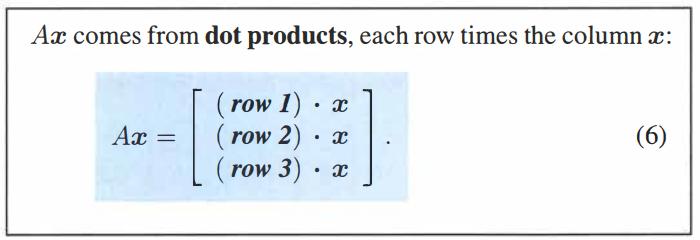
* Multiplication by columns 
   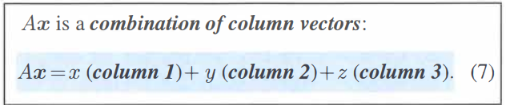

## The idea of elimination
Breakdown of Elimination:
* No solution
   * Fails with no solution to 0y = 8 
   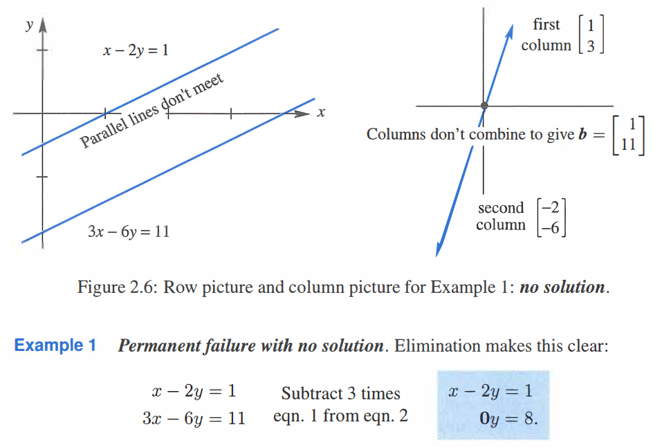
* Too many solutions
   * Fails with too many solutions to 0y = 0 
   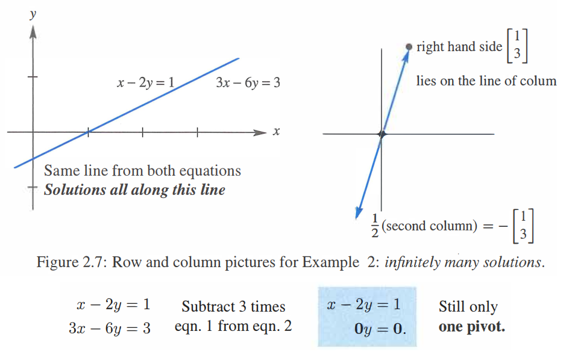

## Rules for Matrix Operations
To multiply AB, it has four ways:
* First way (dot product)
   * The entry in row i and column j of AB is (row i of A) * (column j of B)
* Second way (column picture)
   * Each column of AB is a combination of the columns of A
* Third way (row picture)
   * Each row of AB is a combination of the rows of B
* Fourth way (columns multiply rows)
   * Multiply columns of 1 to n of A times rows 1 to n of B. Add those matrices.

## Elimination = Factorization: A = LU
* Elimination on Ax = b reaches Ux = c. Then back-substitution solves Ux = c.
* Solving a triangular system takes n^2/2 multiply-subtracts. Elimination of find U takes n^3/3.
* Assume on row exchanges, A = LU,
   * When a row of A starts with zeros, so does that row of L.
   * When a column of A starts with zeros, so does that column of U.
* How to solve Ax = b?
   * Factor into L and U, by elimination on the left side matrix A
   * Solve forward elimination on b using L, then back substitution for x using U
      * Forward for elimination and change b to a new right side c: Lc = b
      * Backward to get x: Ux = c
* The cost of elimination
   * Elimination on A requires about 1/3*n^3 multiplications and 1/3*n^3 subtractions
   * Each right side needs n^2 multiplications and n^2 subtractions

# Vector Spaces and Subspaces

## Spaces of Vectors
* A real vector space is a set of "vector" together with rules for vector addition and for multiplication by real numbers.
* subspace
   * a subspace of a vector space is a set of vectors(including 0) that satisfies two requirements: If v and w are vectors in the subspace and c is any scalar, then:
      * v + w is in the subspace
      * cv is in the subspace
   * all linear combinations stay in the subspace

### Ax = b
* To solve Ax = b is to express b as a combination of the columns
* The system Ax = b is solvable if and only if b is in the column space of A

## The Nullspace of A: Solving Ax = 0 and Rx = 0
* The nullspace N(A) consists of all solutions to Ax = 0. These vectors x are in R^n.
* nullspace is a subspace

### The Reduced Row Echelon Form R
* Best Matrix R
   * After elimination for U, we can continue to make the matrix simpler to R
      * Produce zeros above the pivots. Use pivot rows to eliminate upward in R.
      * Produce ones in the pivots. Divide the whole pivot row by its pivot.
   * For Ax = 0
      * N(A) = N(U) = N(R)
      * reduced row echelon from R = rref(A)
      * The pivot columns of R contain I
   * 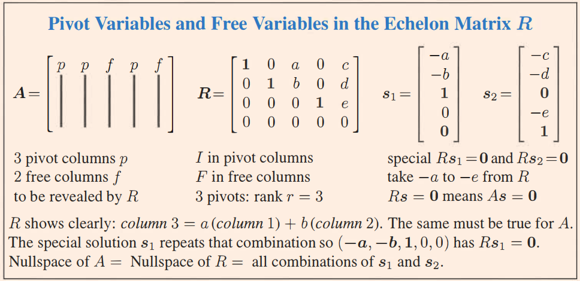
* For many matrices, the only solution to Ax = 0 is x = 0
   * It says the columns of A are **independent**
   * No combination of columns gives the zero vector
   * All columns have pivots, and no columns are free
* The nullspace is a subspace. Its "dimension" is the number of **free variables**

### The Rank of a Matrix
* Rand Definition
   * The rank of A is the number of pivots. This number is r
   * All three matrices A and U and R have r independent rows
   * The rank r is the "dimension" of the column space. It is also the dimension of the row space. The great thing is that n - r is the dimension of the nullspace.

### Elimination: The Big Picture
* Is this column a combination of previous columns?
   * If the column contains a pivot, the answer is no. Pivot columns are "independent" of previous columns.
* Is this row a combination of previous row?
   * If the row contains a pivot, the answer is no. Pivot rows are "independent" of previous rows.

## The Complete Solution to Ax = b
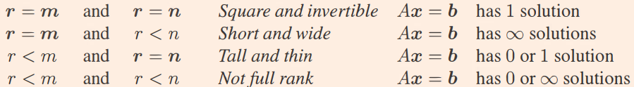
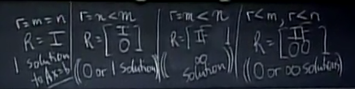

## Independence, Basis and Dimension
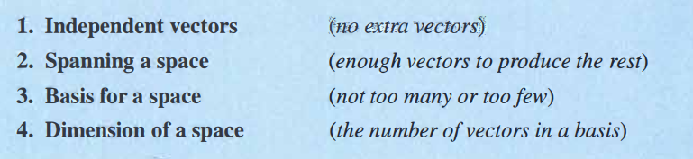

* basis
   * The basis vectors are linearly independent and they span the space
   * Independent vectors that span the space
* dimension
   * The number of vectors, in any and every basis, is the "dimension" of the space
   * The dimension of a space is the number of vectors in every basis
   * All bases for a vector space contain the same number of vectors
   * The pivot columns of A are a basis for its column space

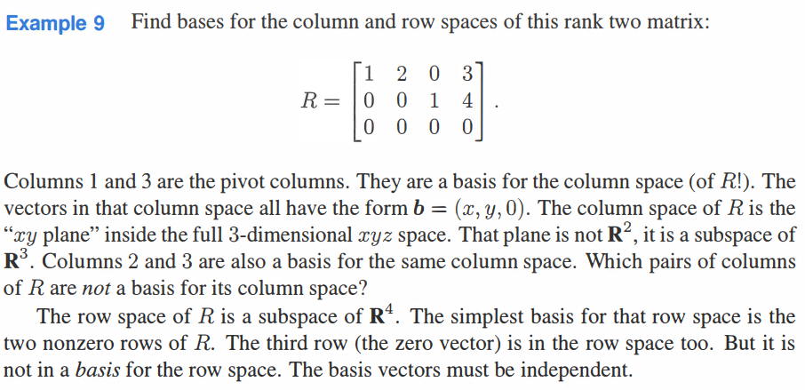

## Dimensions of the Four Subspaces
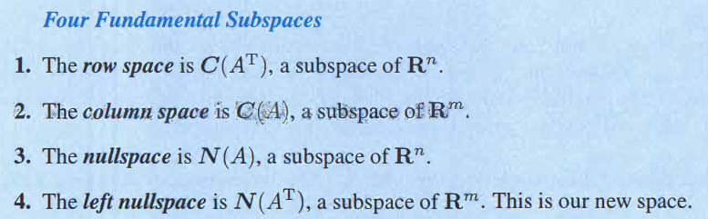
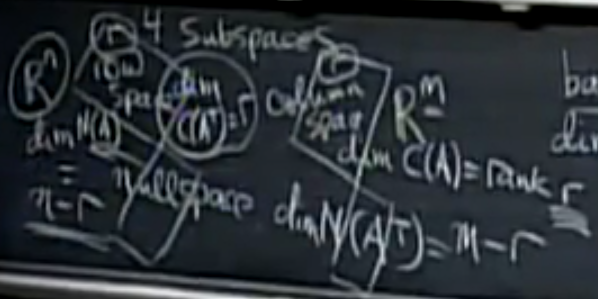
* Ax = 0
   下面两个子空间正交，且维度是A的列数n
   * A的行空间C(A^T)
   * 零空间N(A)
* x^T A = 0
   下面两个子空间正交，且维度是A的行数m
   * A的列空间C(A)
   * 左零空间N(A^T)，因为: A^T y = 0

# Orthogonality

## Orthogonality of the Four Subspaces
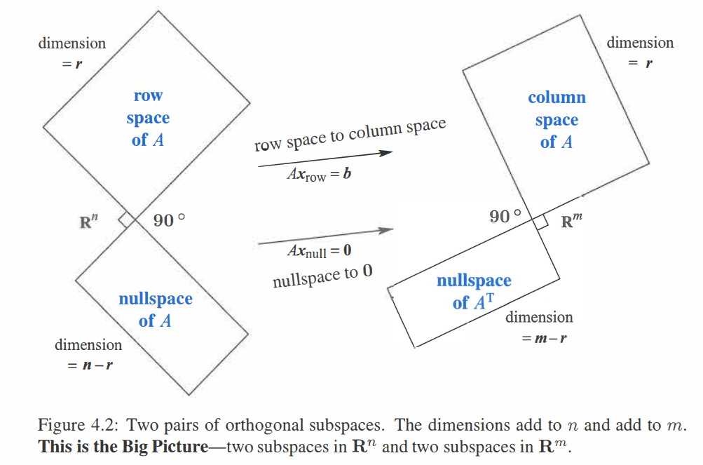

Subspace S is orthogonal to subspace T means
* every vector in S is orthogonal to every vector in T

Nullspace and rowspace are orthogonal complements in R(n)
* Nullspace contains all vectors orthogonal to rowspace

N(A^TA) = N(A), rank of A^TA = rank of A

A^TA is invertible exactly if A has independent columns

## Projection
Why project?
* Because Ax = b may have no solution, solve Ax = P instead (P is proj of b onto column space)

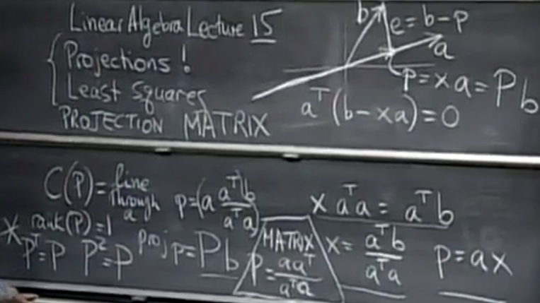

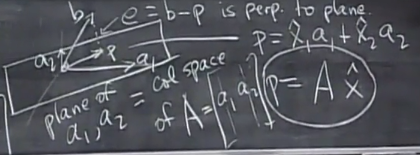

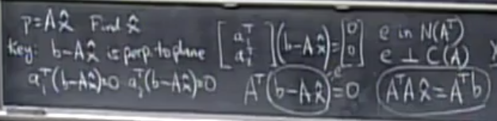

Important formula:
* A^T A x = A^T b
* P = A (A^TA)^-1 A^T
   * If b in column space, Pb = b
   * If b perpendicular column space, Pb = 0

## Least Squares Approximations

## Orthonormal Bases and Gram-Schmidt

