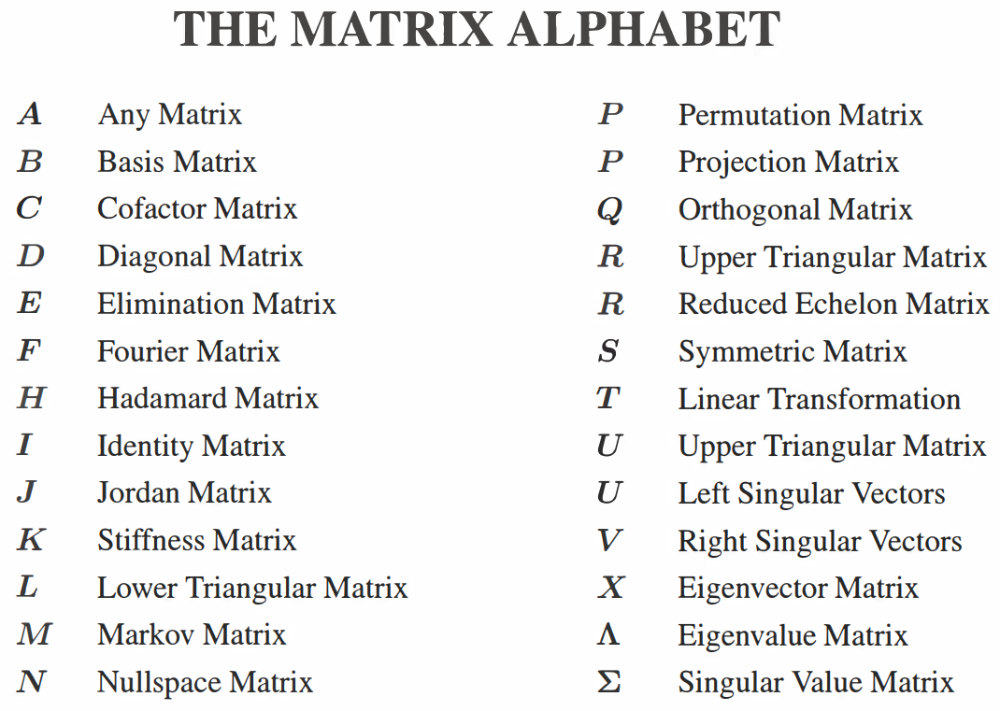

# Intro
Notes of "Introduction to Linear Algebra"

# Preface
## Ax = b
The vector `Ax` is **a combination of the columns of A**.

The solution vector x comes at three levels:
* Direct solution
* Matrix solution
* Particular solution plus nullspace solution

