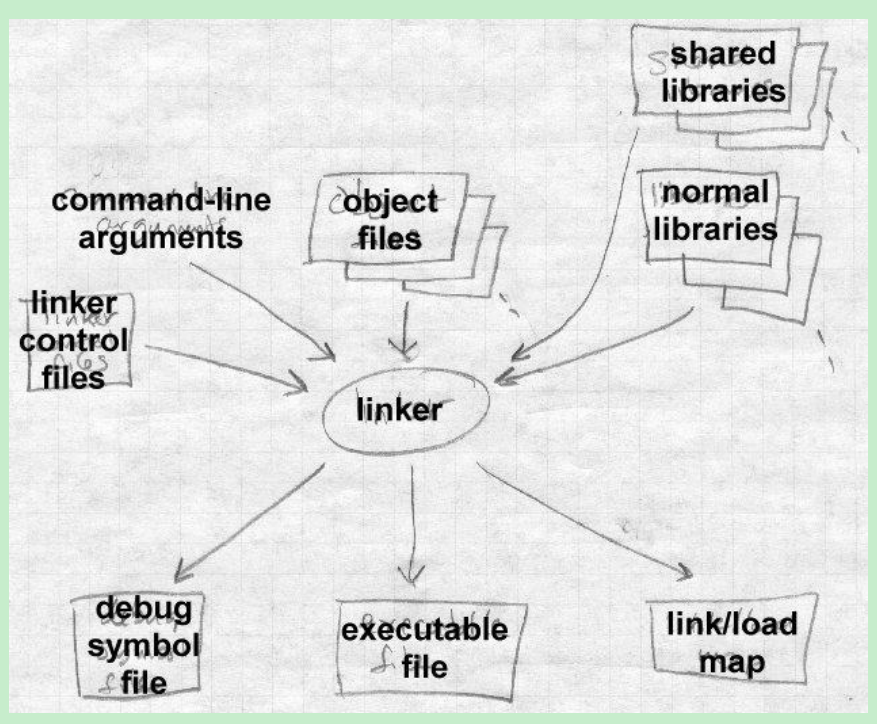

# Introduction
This is notes for "liners and loaders" book.

# Chapter 1 Linking and Loading
## Address binding: a historical perspective
* Problem 
The names were bound to address too early.
* Comes out two basic linker functions to use libraries of subprograms
   * relocation: allow programers to write each subprogram as though it would start at location zero, and to defer the actual address binding until the subprograms were linked with a particular main program.
   * library search
* Solution
Divide up the work
   * Linker: assigning relative addresses with each program
   * Loader: assign actual addresses
## Linking vs. loading
* Two-pass linking

* Linking: a true-life example
