# 序章
本文以下三本书的读书笔记：
* 《Linux设备驱动程序》- 1
* 《深入Linux设备驱动程序内核机制》(陈学松) - 2
* 《Linux设备驱动开发详解：基于最新的Linux 4.0内核》(宋宝华) - 3

# 编译运行Linux驱动
目的：在ubuntu20上基于[Makefile](./code/hello/Makefile)编译驱动[hello.c](./code/hello/hello.c)

### 如何基于kbuild编译第三方驱动?
[kbuild](https://www.kernel.org/doc/html/latest/kbuild/modules.html)是linux内核的编译系统，所有内核的目标都通过kbuild得到。在编译第三方驱动前，需要先编译好内核，以保证相关配置文件已经准备好。Ubuntu20在`/lib/modules/<uname -r>/build`目录下已经有编译好的内核。因此，可通过以下命令编译第三方驱动。
```bash
make -C /lib/modules/`uname -r`/build M=$(PWD) modules
```
当然，也可以自己编译内核，让后基于自己编译的内核编译驱动，具体可参考[Makefile](./code/hello/Makefile)。

## 编译运行hello驱动
* 进入[hello目录](./code/hello)
* 编译`make`
   * 输出hello.ko
* 加载hello驱动
   * `sudo insmod hello.ko`
   * 查看加载信息：`dmesg`
      * 在最后出现了：`[202496.365080] Hello World enter`
* 卸载hello驱动
   * `sudo rmmod hello.ko`
   * 可能是由于虚拟机的原因，卸载的信息会在下一次加载hello驱动的时候，才出现在dmesg中

### 如何编译Ubuntu20兼容的内核？
前面我们编译了ARM的内核，同样我们可以编译x86的内核，以兼容Ubuntu系统。
* 查看Ubuntu20的内核版本
   * `uname -r`: "5.8.0-43-generic"
* checkout对应版本的内核
   * `git checkout v5.8`
* 通过以下脚本编译x86内核
   ```bash
   export ARCH=x86
   export EXTRADIR=${PWD}/extra
   make x86_64_defconfig
   make bzImage -j8
   make modules -j8
   cp arch/x86/boot/bzImage extra/
   cp .config extra/
   ```

# 搭建ARM-QEMU开发环境
此文的开发环境参考了《Linux设备驱动开发详解：基于最新的Linux 4.0内核》的开发环境：QEMU模拟的vexpress Cortex-A9SMP四核处理器开发板。

## 安装交叉编译器"arm-linux-gnueabihf-gcc"
由于《Linux设备驱动开发详解》是基于4.0-rc1内核版本的，因此交叉编译器的版本也不能太高。交叉编译器安装后，能得到如下结果：<br>
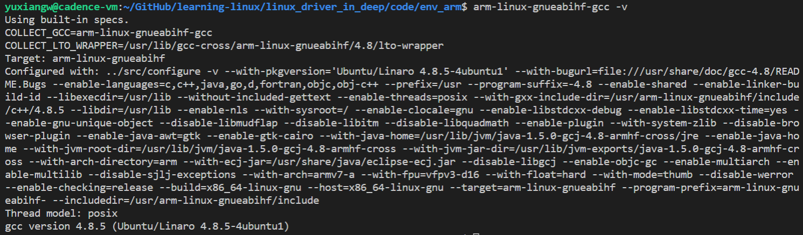

### 如何在Ubuntu20上安装"arm-linux-gnueabihf-gcc-4.8"?
可[参考链接](https://askubuntu.com/questions/1235819/ubuntu-20-04-gcc-version-lower-than-gcc-7)，步骤如下：
* 添加gcc-4.8的源
   * `sudo vim /etc/apt/sources.list`
      ```bash
      deb http://dk.archive.ubuntu.com/ubuntu/ xenial main
      deb http://dk.archive.ubuntu.com/ubuntu/ xenial universe
      ```
* 安装"arm-linux-gnueabihf-gcc-4.8"
   * `sudo apt update`
   * `sudo apt install gcc-4.8-arm-linux-gnueabihf-base gcc-4.8-arm-linux-gnueabihf -y`
* 修改软链接"arm-linux-gnueabihf-gcc"
   * `sudo ln -s /usr/bin/arm-linux-gnueabihf-gcc-4.8 /usr/bin/arm-linux-gnueabihf-gcc`

## 编译vexpress的内核
* 下载kernel代码
   * `git clone https://github.com/torvalds/linux.git`
* checkout "v4.0-rc1" kernel tag
   * `git checkout v4.0-rc1`
* 编译-[build.sh](./code/env_arm/build.sh)
   * 编译内核 - zImage
   * 编译模块 - modules
   * 编译设备树 - dtbs
* 更新模块并安装 - [module.sh](./code/env_arm/module.sh)
   * 安装到根文件系统"vexpress.img"，此文件作为虚拟SD被QEMU模拟的vexpress启用

## 运行vexpress
* 安装QEMU
   * 在搜索引擎中寻找安装步骤，目的是使系统支持`qemu-system-arm`命令，如：`sudo apt update && sudo apt-get install qemu-system`
   * 查看支持的ARM硬件种类：`qemu-system-arm -M help`
   ```bash
   vexpress-a15         ARM Versatile Express for Cortex-A15
   vexpress-a9          ARM Versatile Express for Cortex-A9
   ```
* 从上面内核编译的结果中，拷贝相关文件用于QEMU启动
   * [zImage](./code/env_arm/zImage)：linux kernel(v4.0-rc1)镜像
   * [vexpress.img](./code/env_arm/vexpress.img): 虚拟SD卡，将作为根文件系统的存放接指，它能以loop的形式被挂载，如挂载到"img"文件夹上：
      * `sudo mount -o loop,offset=$((2048*512)) vexpress.img img`
   * [vexpress-v2p-ca9.dtb](./code/env_arm/vexpress-v2p-ca9.dtb)
      * vexpress-a9的设备树文件
      * 什么是设备树DTS，可参考此[文档](https://e-mailky.github.io/2019-01-14-dts-1)
      * A "dtb" file contains a Device Tree Blob (or Binary)(nice description here). It's the new(er) way to pass hardware information about the board to the Linux kernel.
* 运行vexpress
   * [Makefile](./code/env_arm/Makefile)指定了两种启动方式，一个会在当前窗口打开，另一个会新启一个QEMU的窗口
   * 运行结果如下：<br>
      

# Linux设备驱动概述[3]
## 无操作系统是的设备驱动
* 无操作系统时，设备驱动和应用软件，硬件的合理关系：<br>
   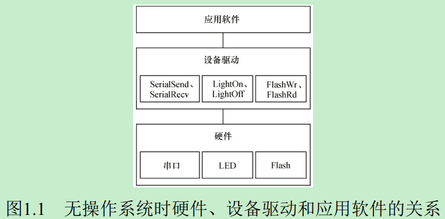
* 无操作系统时，设备驱动和应用软件，硬件的不合理关系：<br>
   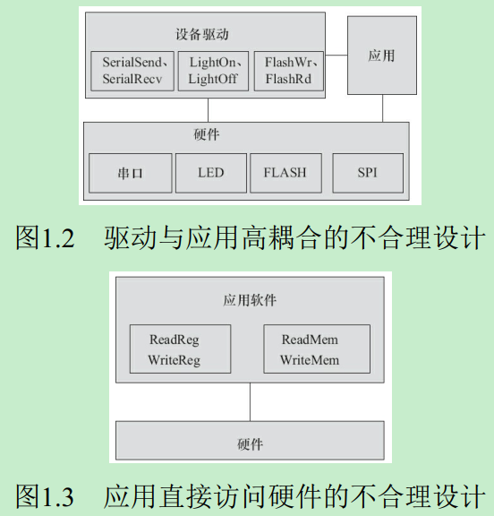

## 有操作系统时的设备驱动
有操作系统时，设备驱动和操作系统，应用，硬件的关系：<br>
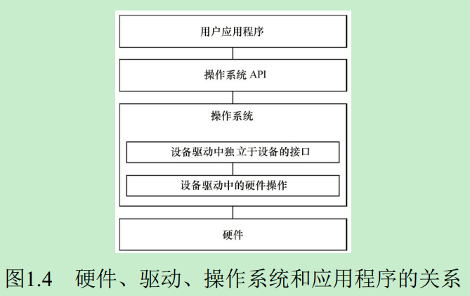
* 所有设备的驱动需设计面向操作系统内核的接口，这样的接口由操作系统规定，对一类设备而言结构一致，独立于具体的设备
* 对外呈现为操作系统的API

## Linux设备驱动
### 设备的分类及特点
* 字符设备
   * 指那些必须以串行顺序依次进行访问的设备，如触摸屏、磁带驱动器、鼠标等
   * 适合面向字符的数据交换，因其数据传输量较低。对这种设备的读写是按字符进行的，而且这些字符是连续地形成一个数据流。他不具备缓冲区，所以对这种设备的读写时实时的，如终端、磁带机、串口、键盘等
* 块设备
   * 可以按任意顺序进行访问，以块为单位进行操作，如硬盘、eMMC等
   * 是一种具有一定结构的随机存取设备，对这种设备的读写时按固定大小的数据块进行的，它使用缓冲区来存放暂时的数据，待条件成熟后，从缓存一次性写入设备或从设备中一次性读出放入缓冲区。块设备通常都是以安装文件系统的方式使用的。
* 网络设备
   * 网络设备面向数据包的接收和发送而设计，它并不倾向于对应于文件系统的节点，而是对应套接字

### 字符设备和块设备的区别
* 字符设备只能以字节未最小单位访问，而块设备以固定长度的块为单位，例如512字节，1024字节等，即使只请求一个字节的数据，也会从设备中取出完整块的数据；
* 块设备可以随机访问(在数据中的任何位置进行访问)，但是字符设备不做要求(有些字符设备可以提供数据的随机访问，驱动程序可选择是否实现)；
* 块设备的读写回有大规模的缓存，已经读取的数据会保存在内存中，如果再次读取则直接从内存中获取，写入操作也使用了缓存一遍延迟处理，减少了IO次数和CPU占用时间。而字符设备每次的读写请求必须与设备交互才能完成，因此没有必要使用缓存。

### Linux设备驱动于整个软硬件系统的关系
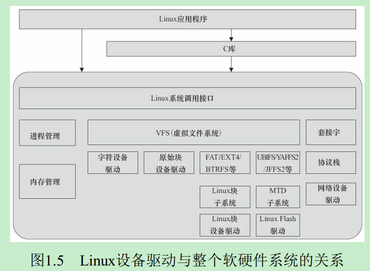

除网络设备外，字符设备与块设备都被映射到Linux文件系统的文件和目录，通过文件系统的系统调用接口open(), write(), read(), close()等即可访问字符设备和块设备。

Linux的块设备有两种访问方法：
* 类似dd命令对应的原始块设备，如"/dev/sdb1"等
* 在块设备上建立FAT、EXT4、BTRFS等文件系统，然后以文件路径的形式访问

# 驱动设计的硬件基础[3]
## 通用处理器
中央处理器的体系结构：<br>
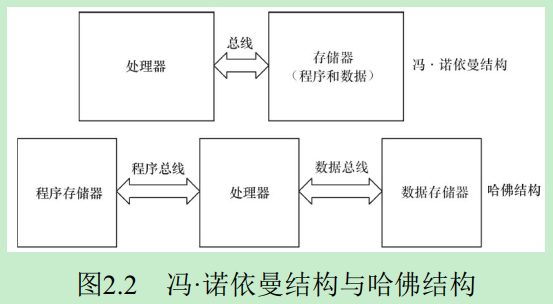
* 冯诺依曼结构(普林斯顿结构)
   * Intel, ARM7
   * 将程序指令存储器和数据存储器合并在一起的存储结构，因此程序指令和数据的宽度相同
* 哈佛结构
   * ARM11, Cortex A系列
   * 指令和数据分开存储，指令和数据可以有不同的数据宽度
   * 独立的程序总线和数据总线

从指令集角度分类：
* 精简指令集RISC
   * 强调尽量减少指令集、指令单周期执行
   * 但是目标代码会更大
* 复杂指令集CISC
   * 强调增强指令的能力、减少目标代码的数量
   * 但是指令复杂、指令周期长

## 数字信号处理器
数字信号处理器DSP针对通信、图像、语音和视频处理等领域的算法而设计。乘法指令可在单周期完成，且优化了卷积等复杂运算。

数字信号处理器DSP分两类：
* 定点DSP
   * 只能用运算模拟浮点运算
* 浮点DSP
   * 浮点运算用硬件来实现，可在单周期内完成

总结下来，处理器的分类大致如下：<br>
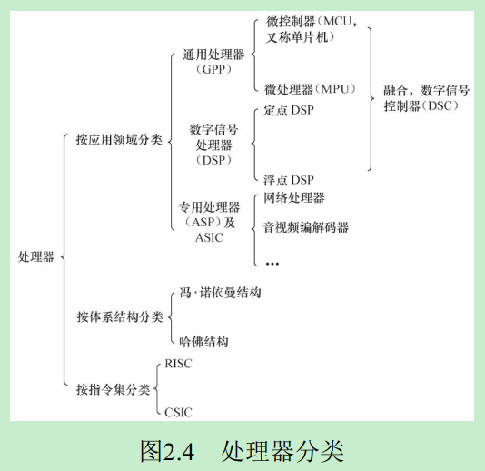

## 存储器
存储器主要分：
* 只读存储器ROM
   * 不可编程ROM
   * 可编程ROM(PROM)
   * 可擦除可编程ROM(EPROM)
   * 电可擦除可编程ROM(E2PROM)
* 闪存Flash
   * NOR(或非) Flash
      * 和CPU的接口属于典型的SRAM接口，不需要额外增加控制电路
   * NAND(与非) Flash
      * 和CPU的接口必须由相应的控制电路进行转换，如：公共闪存接口CFI
      * 优势是容量大、价格低，擦除、编程速度远超NOR Flash
      * 劣势是读写更容易出错(1位反转)，因此需要EDC/ECC算法纠正
* 随机存取存储器
   * 静态RAM(SRAM)
      * 不需要刷新
   * 动态RAM(DRAM)
      * 以电荷形式进行存储，因此需要定期刷新
      * “DDR SDRAM”较SDRAM传输速率加倍，因为上升沿和下降沿都传输数据
   * 双端口RAM(DPRAM)<br>
      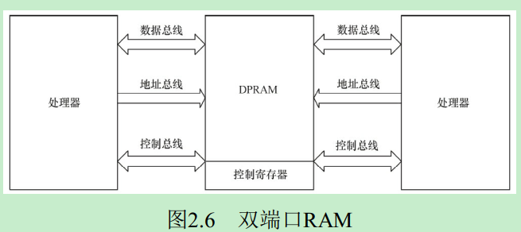
      * 优点是通信速度快、实时性强、接口简单
   * 内容寻址RAM(CAM)<br>
      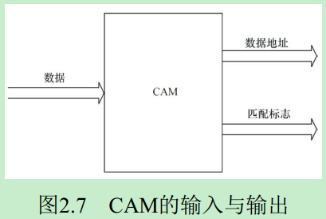
      * CAM是以内容进行寻址的存储器，是一种特殊的存储阵列RAM
      * 用于数据检索的优势是软件无法比拟的
   * FIFO
* 光/磁介质存储器

总结下来，存储器的分类大致如下：<br>
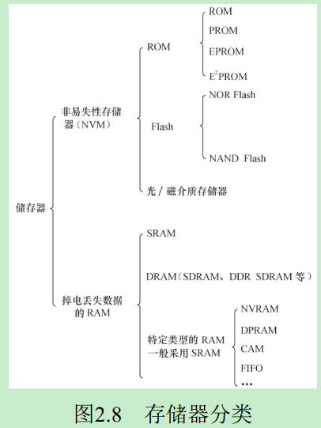

## 接口与总线
### 串口
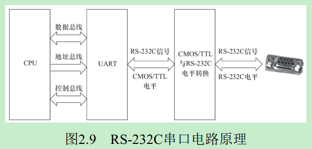

串口从"RS-232 -> RS-422 -> RS-485"标准的变化，增强了串行数据传输是效率与可靠性
* 上图中的UART通用异步接收器发送器，作用是完成并/串转换

### I2C
I2C(内置集成电路)总线是由Philips公司开发的两线式串行总线：
* 优势是：简单而有效，占用空间小，设计简单

### SPI
SPI(Serial Peripheral Interface, 串行外设接口)总线式一种同步串行外设接口，它可以使CPU与各种外围设备以串行方式进行通信以交换信息。一般主控SoC作为SPI的主，而外设作为SPI的从。

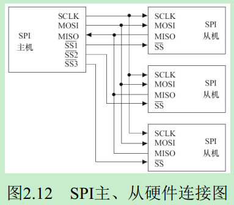

### USB
USB(通用串行总线)是Intel、Microsoft等厂商提出的，具有数据传输速率高、易扩展、支持即插即用和热插拔的优点。

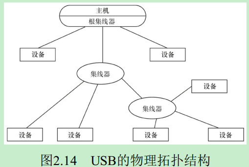

USB提供了多种传输方式：
* 控制传输方式
   * 双向传输，数据量小，用于查询、配置和给USB设备发送通用命令
* 同步传输方式
   * 用于要求恒定数据传送率的即时应用，如语音业务传输
* 中断传输方式
   * 单向的，对USB主机而言，只有输入。用于定时查询设备是否由中断数据要传送，如键盘、鼠标等设备
* 批量传输方式
   * 在没有带宽、间隔时间要求的批量数据的传送和接收中，如打印机和扫描仪等设备

### 以太网接口
以太网接口由MAC(以太网媒体接入控制器)和PHY(物理接口收发器)组成。

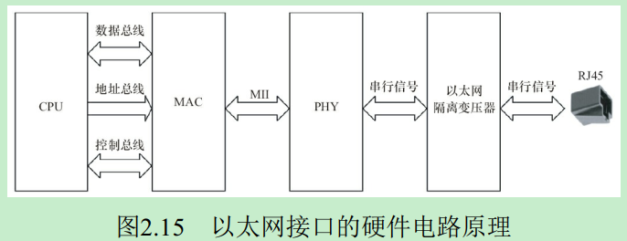

### PCI和PCIe
PCI(外围部件互连)是由Intel在1991年推出的一种局部总线，作为一种通用的总线接口标准。

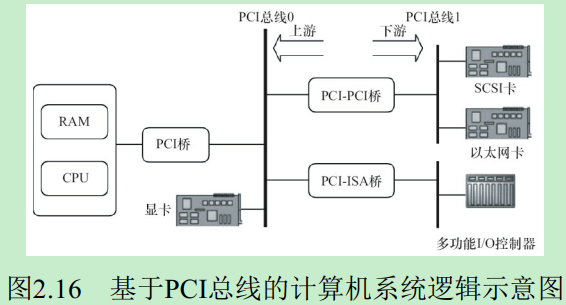

PCI-E(PCI Express)是Intel推出的新一代总线接口，采用点对点串行连接。每个设备都有自己的专用连接，采用串行方式传输数据，不需要向整个总线请求带宽，并可以把数据传输提高到一个很高的频率。

### SD和SDIO
SD(Secure Digital)是一种关于Flash存储卡的标准，在设计上与MMC(Multi-Media Card)保持了兼容。

SDIO(Secure Digital Input Output Card)在SD标准的基础上，定义了除存储卡以外的外设接口。现在已经有很多手机都支持SDIO的功能，以连接WiFi、蓝牙、GPS等模块。

eMMC(Embedded Multi Media Card)是当前移动设备本地存储的主流解决方案，目的在于简化手机存储器的设计。eMMC就是NAND Flash、闪存控制芯片和标准接口封装的集合。

## CPLD和FPGA
CPLD(复杂可编程逻辑器件)由完全可编程的与或门阵列以及宏单元构成。

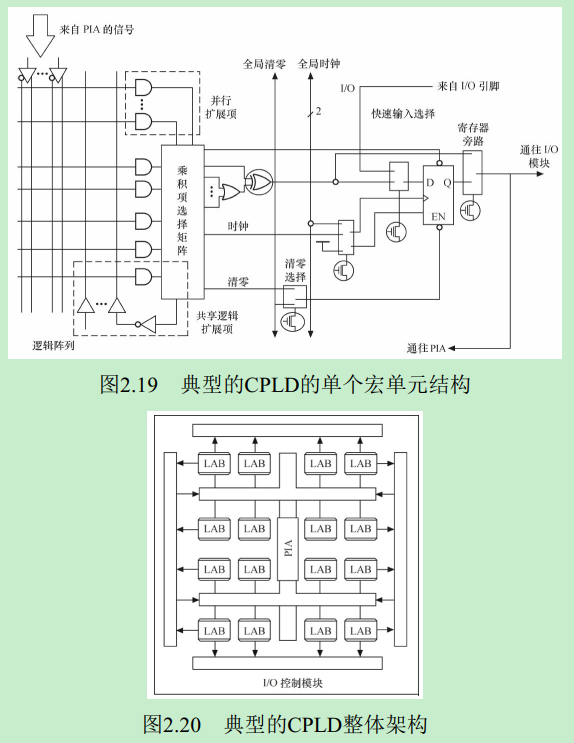

上图是一个非常典型的CPLD的单个宏单元结构。宏单元由一些
* “与或”阵列完成组合逻辑功能
   * 与阵列输出称为乘积项
      * 乘积阵列实际上就是一个与或阵列，每个交叉点都是一个可编程熔丝，如果导通就是“与”逻辑
   * “与”阵列后一遍还有一个“或”阵列，用以完成最小逻辑表达式中的“或”关系
* 触发器完成时序逻辑功能

与CPLD不同，FPGA基于LUT(查找表)工艺。查找表本质上是一片RAM，当用户通过原理图或HDL描述了一个逻辑电路以后，FPGA开发软件会自动计算逻辑电路所有可能的结果，并把结果事先写入RAM。这样，输入一组信号进行逻辑运算就等于输入一个地址进行查表以输出对应地址的内容。

下表是一个4输入LUT的实际逻辑电路与LUT实现的对应关系：<br>
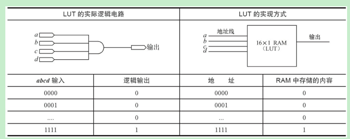

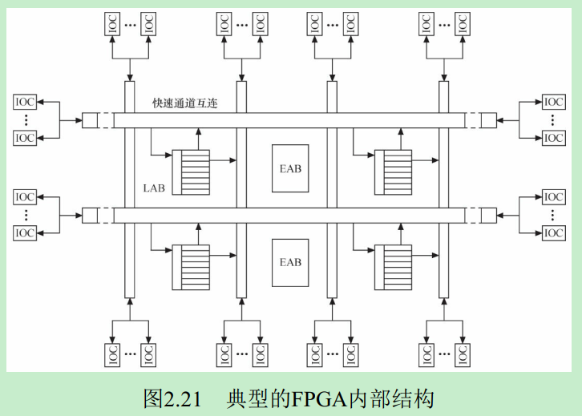
* IOC - 输入/输出控制模块
* EAB - 嵌入式阵列块
   * 不仅可以用作存储器，还可以事先写入查表值以用来构成如乘法器、纠错逻辑等
* LAB
   * 用于逻辑电路设计，一个LAB包括多个LE(逻辑单元)，每个LE包括组合逻辑及一个可编程触发器。一系列LAB构成的逻辑阵列可实现计数器、加法器、状态机等
* 快速通道
   * 用于内部信号的互连

# Linux内核及内核编程

## Linux内核的组成

### Linux内核源代码的目录结构
* arch
   * 包含和硬件体系结构相关的代码，存放各平台对Linux内核的进程调度、内存管理、中断等的支持
* block
   * 块设备驱动程序I/O调度
* crypto
   * 加密和散列算法，还有一些压缩和CRC校验算法
* drivers
   * 每个不同的驱动占用一个子目录，如char、block、net等
* fs (操作系统-永久化)
   * 各种文件系统，如EXT、FAT等
* include
   * 与系统相关的头文件放置在include/linux子目录下
* init
   * 内核初始化代码，如`start_kernel()`就位于init/main.c
* ipc (操作系统-并发)
   * 进程间通信的代码
* kernel (操作系统-虚拟化CPU)
   * 内核最核心的部分，包括进程调度、定时器等，而和平台相关的部分放在arch/*/kernel目录下
* lib
   * 库文件代码
* mm (操作系统-虚拟化内存)
   * 内存管理代码，和平台相关的放在arch/*/mm目录下
* net
   * 实现各种常见网络协议
* script
   * 用于配置内核的脚本文件
* security
   * SELinux的模块
* sound
   * ALSA、OSS音频设备的驱动核心代码和常用设备驱动
* usr
   * 实现用于打包和压缩的cpio等

内核一般要做到drivers与arch的软件架构分离，驱动中不包含板级信息，让驱动跨平台。同时内核的通用部分(如kernel、fs、ipc、net等)则与具体的硬件(arch和drivers)剥离。

### Linux内核的组成部分
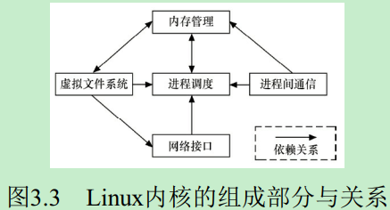

Linux内核主要由五个子系统组成：
* 进程调度(SCHED)
   * 其他子系统都依赖它
* 内存管理(MM)<br>
   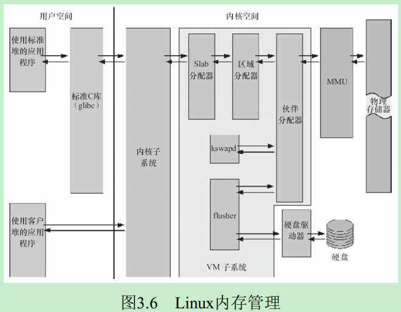
   * 网络接口不直接依赖内存管理
* 虚拟文件系统(VFS)<br>
   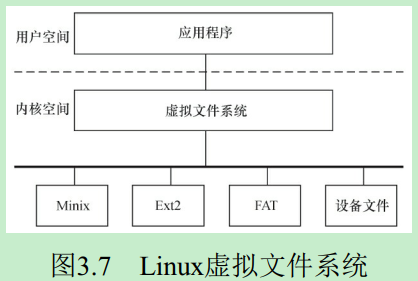
   * 为上层的应用程序提供了统一的vfs_read()、vfs_write()等接口
   * 并调用具体底层文件系统或者设备驱动中实现的`file_operations`结构体的成员函数
   * 利用内存管理支持RAMDISK设备，利用网络接口支持网络文件系统NFS
* 网络接口(NET)<br>
   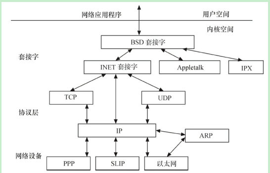
   * 网络协议负责实现每一种可能的网络传输协议，如：Internet、NFC、CAN等协议
   * 网络驱动程序负责与硬件设备通信，每种硬件设备都有相应的设备驱动程序
* 进程间通信(IPC)

### Linux内核的编译及加载

配置内核的方法有：
* `make config` - 基于文本的最为传统的配置界面
* `make menuconfig` - 基于文本菜单的配置界面
* `make xconfig` - 要求QT被安装
* `make gconfig` - 要求GTK+被安装

如果想使用默认配置，也可以通过`arch/xxx/configs/xxx_defconfig`中的默认配置，只需要运行`make ARCH=xxx xxx_defconfig`即可。例如`make ARCH=arm vexpress_defconfig`就配置了vexpress-arm板。内核配置的最终会在根目录下产生一个`.config`文件，用于内核编译。

编译ARM内核和模块的方法是：
* `make ARCH=arm zImage`
* `make ARCH=arm modules`

编译完后会出现以下文件：
* 根目录下会得到未压缩的内核映像vmlinux和内核符号表文件System.map
* 在arch/arm/boot目录下会得到压缩的内核映像zImage
* 在内核各对应目录内得到选中的内核模块

Linux内核的配置系统由以下3个部分组成：
* Makefile
   * 分布在Linux内核源代码中，定义Linux内核的编译规则
* 配置文件Kconfig
   * 给用户提供配置选择的功能
* 配置工具
   * 包括配置命令解释器和配置用户界面，都是脚本语言写的

### 如何在Linux内核中增加程序?
增加Linux内核程序需要：
* 将编写的源代码复制到Linux内核源代码的相应目录中
* 在目录的`Kconfig`文件中增加关于新源代码对应项目的编译配置选项
* 在目录的`Makefile`文件中增加对新源代码的编译条目

### Kconfig
`Kconfig`用于配置，定义相关变量给`Makefile`编译。下面是`TTY_PRINTK`的一部分配置：
```
config TTY_PRINTK
	tristate "TTY driver to output user messages via printk"
	depends on EXPERT && TTY
	default n
	help
	  If you say Y here, the support for writing user messages (i.e.
	  console messages) via printk is available.
```
其中，最主要的是`tristate`三态配置项：
* 可编译入内核 - y
* 可不编译 - n
* 可编译为内核模块 - m

这三个值会在Makefile中以`CONFiG_TTY_PRINTK`变量体现：
```
obj-$(CONFIG_TTY_PRINTK)   += ttyprintk.o
```

### Makefile
内核的编译系统kbuild的Makefile有以下几种类型的目标：
* 单文件目标
   * 常见例子： `obj-$(CONFIG_FOO) += foo.o`
   * `obj-y`表示该文件编译并链接进内核
   * `obj-m`表示该文件要作为模块编译，生成xxx.ko
   * `obj-n`表示目标不会被编译
* 多文件模块目标
   * `模块名-y`来定义模块的组成文件，
   * 常见例子：
      ```
      obj-$(CONfiG_EXT2_FS) += ext2.o
      ext2-y := balloc.o dir.o
      ext2-$(CONfiG_EXT2_FS_XATTR) += xattr.o xattr_user.o
      ```
      * 上例中，模块名为ext2，由balloc.o, dir.o等多个文件生成ext2.o直至ext2.ko，并且是否包括xattr.o等取决于内核配置文件
* 目录层次的迭代
   * 例子：`obj-$(CONFIG_EXT2_FS) += ext2/`
      * 当CONFIG_EXT2_FS的值是y或m时，kbuild会把ext2目录也进行编译，寻找此文件夹下的Makefile。

### Linux内核
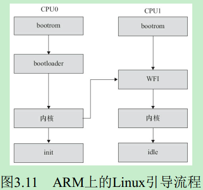

* SoC厂商的bootrom引导Linux的bootloader
* bootloader(如：U-Boot)引导内核镜像(如：zImage)，此过程可能会需要dtb设备树信息
* 内核镜像自行解压，并被加载如内存后，唤醒其他CPU加载内核
* 内核启动时会调用用户空间的init程序，如:busybox init, SysVinit, systemd
* 最终整个系统启动，形成一个进程树

# Linux内核模块

## Linux内核模块简介
Linux模块具有这样的特点：
* 模块本身不被编译入内核映像，从而控制了内核的大小
* 模块一旦被加载，它就和内核中的其他部分完全一样

模块[Hello World例子](。/code/hello/hello.c)包含：
* 内核模块加载函数`module_init`
* 内核模块卸载函数`module_exit`
* 对GPL v2许可权限的声明以及一些描述信息

模块的编译、加载与卸载：
* 编译模块
   * `make -C /lib/modules/`uname -r`/build M=$(PWD) modules`
   * 编译输出：`hello.ko`
   * 打印模块信息：`modinfo hello.ko`，输出：
      ```
      filename:       hello.ko
      alias:          a simplest module
      description:    A simple Hello World Module
      license:        GPL v2
      author:         Barry Song <21cnbao@gmail.com>
      srcversion:     081230411494509792BD4A3
      depends:        
      retpoline:      Y
      name:           hello
      vermagic:       5.8.0-43-generic SMP mod_unload
      ```
* 加载模块：
   * `sudo insmod ./hello.ko`
   * 可通过dmesg查看加载信息
   * 可通过lsmod查看所有已经加载的模块
* 卸载模块：
   * `sudo rmmod ./hello.ko`

## 模块参数
我们可以用“module_param(参数名, 参数类型, 参数读写权限)”为模块定义一个参数，例如下面的代码定义了1个整型参数和1个字符指针参数：
```
static char *book_name = "dissecting Linux Device Driver";
module_param(book_name, charp, S_IRUGO);
static int book_num = 4000;
module_param(book_num, int, S_IRUGO);
```
参数的类型可以是：byte、 short、 ushort、 int、 uint、 long、 ulong、 charp（字符指针）、 bool或invbool（布
尔的反），在模块被编译时会将module_param中声明的类型与变量定义的类型进行比较，判断是否一致。

以[book](./code/param/book.c)驱动为例，加载完此驱动后，可在/sys/module/book/parameters目录下生成一系列以参数名命名的文件节点，这些文件的权限值就是传入`module_param()`的“参数读写权限”，而文件的内容为参数的值。

## 导出符号
模块可以使用如下宏导出符号到内核符号表中，如例子[export_symb](./code/export/export_symb.c)所示：
```c
EXPORT_SYMBOL(符号名);
EXPORT_SYMBOL_GPL(符号名); //只适用于包含GPL许可权的模块
```

## 模块声明与描述
模块可以使用如下宏声明模块的作者、描述、版权、设备表和别名等信息：
```c
MODULE_AUTHOR(author);
MODULE_DESCRIPTION(description);
MODULE_VERSION(version_string);
MODULE_DEVICE_TABLE(table_info);
MODULE_ALIAS(alternate_name);
```

# Linux文件系统与设备文件

## Linux文件系统
* /bin
   * 基本命令
* /sbin
   * 系统命令，如modprobe、hwclock、ifconfig等，大多是设计系统管理的命令
* /dev
   * 设备文件存储目录，应用程序通过对这些文件的读写和控制以访问实际的设备
* /etc
   * 系统配置文件的所在地，一些服务器的配置文件也在这里，如用户账号及密码配置文件。busybox的启动脚本也存放在该目录
* /lib
   * 系统库文件存放目录
* /mnt
   * /mnt这个目录一般是用于存放挂载存储设备的挂载目录，比如含有cdrom等目录
* /opt
   * opt是可选的意思，有些软件包会被安装在这里
* /proc
   * 操作系统运行时，进程及内核信息(比如CPU、硬盘分区、内存信息等)存放在这里。/proc目录为伪文件系统proc的挂载目录，proc并不是真正的文件系统，它存在于内存之中
* /tmp
   * 存放临时文件
* /usr
   * 这个是系统存放程序的目录，比如用户命令、用户库等
* /var
   * var表示变化的意思，这个目录的内容进程变动，如/var/log目录被用来存放系统日志
* /sys
   * Linux2.6以后的内核所支持的sysfs文件系统被映射在此目录上。Linux设备驱动模型中的总线、驱动和设备都可以在sysfs文件系统中找到对应的节点。当内核检测到在系统中出现了新设备后，内核会在sysfs文件系统中为该新设备生成一项新的记录。

### Linux文件系统与设备驱动
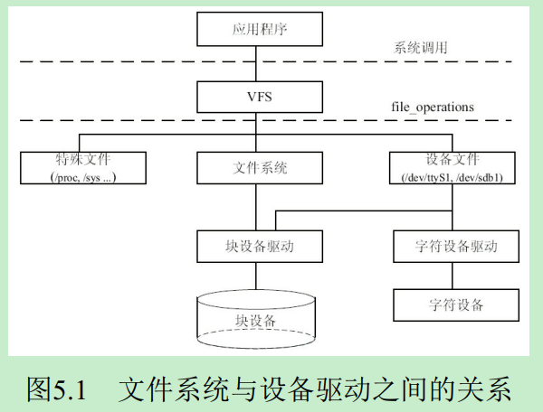

上图是Linux中虚拟文件系统VFS、磁盘文件系统及一般的设备文件与设备驱动之间的关系。
* 应用程序和VFS之间的接口是系统调用
* VFS与文件系统以及设备文件之间的接口是`file_operations`结构体成员函数，这个结构体包含对文件进行打开、关闭、读写、控制的一系列成员函数，关系如下图：<br>
   * 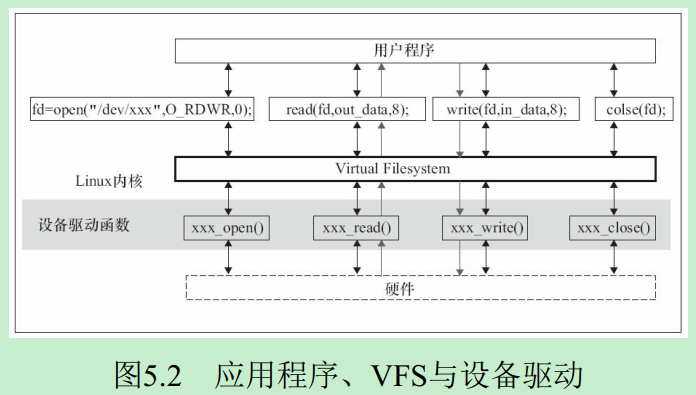
* 字符设备
   * 由于字符设备的上层没有类似于磁盘的ext2等文件系统，所以字符设备的`file_operations`成员函数就之恶杰由设备驱动提供了
* 块设备的两种访问方法
   * 不通过文件系统直接访问裸设备
      * Linux内核实现了统一的`def_blk_fops`这一`file_operations`，源码位于"fs/block_dev.c"
      * 当我们运行类似于`dd if=/dev/sdb1 of=sdb1.img`的命令把整个/dev/sdb1裸分区复制到sdb1.img的时候，就是利用`def_blk_fops`完成的
   * 通过文件系统来访问设备
      * `file_operations`的实现位于文件系统内，文件系统会把针对文件的读写转换为针对块设备原始扇区的读写
      * ext2、fat、Btrfs等文件系统中会实现针对VFS的`file_operations`成员函数，设备驱动层将看不到file_operations的存在。在设备驱动程序的设计中，一般而言，会关心file和inode这两个结构体。相当于设备驱动层和VFS层中间加了一个文件系统层。

## 设备文件系统devfs
devfs(设备文件系统)是由Linux2.4内核引入的，它的出现使得设备驱动程序能自主地管理自己的设备文件，其有以下优点：
* 可以通过程序在设备初始化时在/dev目录下创建设备文件，卸载设备时将它删除
* 设备驱动程序可以指定设备名、所有者和权限位，用户空间程序仍可以修改所有者和权限位
* 不再需要为设备驱动程序分配主设备号以及处理次设备号，在程序中可以直接给`register_chrdev()`传递0主设备号以获得可用的主设备号，并在`devfs_register()`中指定次设备号

驱动程序调用下面这些函数来进行设备文件的创建和撤销工作：
```c
/* 创建设备目录 */
devfs_handle_t devfs_mk_dir(devfs_handle_t dir, const char *name, void *info);
/* 创建设备文件 */
devfs_handle_t devfs_register(devfs_handle_t dir, const char *name, unsigned int flags, unsigned int major, unsigned int minor, umode_t mode, void *ops, void *info);
/* 撤销设备文件 */
void devfs_unregister(devfs_handle_t de);
```

## udev用户空间设备管理
### udev与devfs的区别
在Linux2.6中，用udev取代了devfs，原因是：
* devfs所做的工作被确信可以在用户态来完成
* devfs存在一些无法修复的bug

udev完全在用户态工作，利用设备加入或移除时内核所发送的热插拔事件(Hotplug Event)来工作。
* 在热插拔时，设备的详细信息会由内核通过`netlink`套接字发送出来，发出的事件叫`uevent`。
* udev的设备命名策略、权限控制和事件处理都是在用户态下完成的，它利用从内核收到的信息来进行创建设备文件节点等工作

对于冷插拔的设备(开机前就存在)，Linux内核提供了sysfs下面一个uevent节点，可以往该节点写一个“add”，导致内核重新发送netlink，之后udev就可以收到冷插拔的netlink消息了。

devfs与udev最大的区别在于：
* 当一个并不存在的/dev节点被打开时，devfs会自动加载对应的驱动，而udev不这么做
* udev的设计者认为Linux应该在设备被发现的时候加载驱动模块，而不是当它被访问的时候。系统中所有的设备都应该产生热插拔事件并加载恰当的驱动

### sysfs文件系统与Linux设备模型
Linux2.6以后的内核引入了sysfs文件系统，其时一个虚拟的文件系统，被看成时与proc同类别的文件系统。它可以产生一个包括所有系统硬件的层级视图，与提供进程和状态信息的proc、devfs文件系统十分类似。

sysfs把连接在系统上的设备和总线组织成为一个分级的文件，他们可以由用户空间存取，向用户空间导出内核数据结构以及他们的属性。sysfs的一个目的就是展示设备驱动模型中各组件的层次关系，其顶级目录包括
* block
   * 包含所有的块设备
* bus
   * 包含系统中所有的总线类型
   * 其pci等子目录下，又会分出drivers和devices目录
      * devices目录中的文件是对/sys/devices目录中文件的符号连接
* devices
   * 包含系统所有的设备，并根据设备挂接的总线类型组织成层次结构
* class
   * 包含系统中的设备类型(如网卡设备、声卡设备、输入设备等)
   * 其目录下也包含许多/sys/devices下文件的链接
* module
   * 包含设备驱动信息，lsmod所打印的加载了的驱动，都可以在这个文件夹中找到

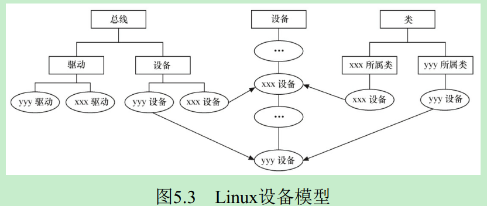

上图显示了Linux设备模型与设备、驱动、总线和类的对应关系。在Linux内核中分别表示为(代码参见：include/linux/device.h)：
* `bus_type` - 总线
* `device_driver` - 驱动
   * 包含`bus_type`指针
* `device` - 设备
   * 包含`bus_type`指针

在Linux内核中，设备和驱动时分开注册的。每个设备和驱动涌入内核的时候，都会去寻找自己的另一半，而正是bus_type的`match()`成员函数将两者捆绑在一起。一段设备和驱动配对成功，xxx_driver的`probe()`就被执行(xxx是总线名，如platform, pci等)。

总线、驱动和设备都会落实为sysfs中的一个目录。各个attribute则落实为sysfs的1个文件，attribute会伴随着`show()`和`store()`这两个函数，分别用于读写该attribute对应的sysfs文件。

### udev的工作过程
udev的工作过程如下：
* 当内核检测到系统中出现了新设备后，内核会通过netlink套接字发送uevent
* udev获取内核发送的信息，进行规则的匹配。匹配的事务包括SUBSYSTEM、ACTION、attribute、内核提供的名称以及其他环境变量

一个简单的例子可以看出udev和devfs在命名方面的差异。如果系统中有两个USB打印机，一个可能被称为/dev/usb/lp0，另一个便是/dev/usb/lp1。但是到底哪个文件对应哪个打印机是无法确定的，lp0、lp1和实际的设备没有一一对应的关系，映射关系会因为设备发现的顺序、打印机本身关闭等而不确定。因此，理想的方式是两个打印机应该采用基于它们的序列号或者其他标识信息的办法来进行确定的映射，devfs无法做到这一点，udev却可以做到。使用如下规则：
```
SUBSYSTEM="usb",ATTR{serial}="HXOLL0012202323480",NAME="lp_epson",SYMLINK+="printers/epson_stylus"
```
该规则中的匹配项目有SUBSYSTEM和ATTR，赋值项目为NAME和SYMLINK，它意味着当一台USB打印机的序列号为“HXOLL0012202323480”时，创建/dev/lp_epson文件，并同时创建一个符号链接/dev/printers/epson_styles，从而固定了设备名。


# 字符设备驱动
## Linux字符设备驱动结构
### cdev结构体
```c
struct cdev {
   struct kobject kobj; /* 内嵌的kobject对象 */
   struct module* owner; /* 所属模块*/
   struct file_operations* ops; /* 文件操作结构体*/
   struct list_head list;
   dev_t dev; /* 设备号, 12位为主设备号，20位为次设备号 */
   unsigned int count;
};
```
其中，`file_operations`定义了字符设备驱动提供给虚拟文件系统的接口函数。

Linux内核提供了一组函数以用于操作cdev结构体：
```c
void cdev_init(struct cdev *, struct file_operations *);
struct cdev *cdev_alloc(void);
void cdev_put(struct cdev *p);
int cdev_add(struct cdev *, dev_t, unsigned);
void cdev_del(struct cdev *);
```

* `cdev_init()`函数用于初始化cdev的成员，并建立cdev和file_operations之间的连接，其源代码如下：
   ```c
   void cdev_init(struct cdev *cdev, struct file_operations *fops)
   {
      memset(cdev, 0, sizeof *cdev);
      INIT_LIST_HEAD(&cdev->list);
      kobject_init(&cdev->kobj, &ktype_cdev_default);
      cdev->ops = fops; /* 将传入的文件操作结构体指针赋值给cdev的ops*/
   }
   ```
* `cdev_alloc()`函数用于动态申请一个cdev内存，其代码如下：
   ```c
   struct cdev *cdev_alloc(void)
   {
      struct cdev *p = kzalloc(sizeof(struct cdev), GFP_KERNEL);
      if (p) {
         INIT_LIST_HEAD(&p->list);
         kobject_init(&p->kobj, &ktype_cdev_dynamic);
      }
      return p;
   }
   ```
* `cdev_add()`函数和`cdev_del()`函数分别向系统添加和删除一个cdev，完成字符设备的注册和注销。对`cdev_add()`的调用通常发生在字符设备驱动模块加载函数中，而对`cdev_del()`函数的调用则通常发生在字符设备驱动模块卸载函数中。

### 分配和释放设备号
在调用`cdev_add()`函数向系统注册设备之前，应首先调用`register_chrdev_region()`或`alloc_chrdev_region()`函数向系统申请设备号，函数原型如下：
```c
int register_chrdev_region(dev_t from, unsigned count, const char *name);
int alloc_chrdev_region(dev_t *dev, unsigned baseminor, unsigned count, const char *name); //优点在于会自动避开设备号重复的冲突
```

相应地，在调用`cdev_del()`函数从系统注销字符设备之后，`unregister_chrdev_region()`应该被调用以释放原先申请的设备号，函数原型如下：
```c
void unregister_chrdev_region(dev_t from, unsigned count);
```

### file_operations结构体
`file_operations`结构体中的成员函数是字符设备驱动程序设计的主体内容，这些函数实际会在应用程序进行Linux的open()、write()、read()、close()等系统调用时最终被内核调用，其定于如下：
```c
struct file_operations {
   struct module *owner;
   loff_t (*llseek) (struct file *, loff_t, int);
   ssize_t (*read) (struct file *, char __user *, size_t, loff_t *);
   ssize_t (*write) (struct file *, const char __user *, size_t, loff_t *);
   ssize_t (*aio_read) (struct kiocb *, const struct iovec *, unsigned long, loff_t);
   ssize_t (*aio_write) (struct kiocb *, const struct iovec *, unsigned long, loff_t);
   int (*iterate) (struct file *, struct dir_context *);
   unsigned int (*poll) (struct file *, struct poll_table_struct *);
   long (*unlocked_ioctl) (struct file *, unsigned int, unsigned long);
   long (*compat_ioctl) (struct file *, unsigned int, unsigned long);
   int (*mmap) (struct file *, struct vm_area_struct *);
   int (*open) (struct inode *, struct file *);
   int (*flush) (struct file *, fl_owner_t id);
   int (*release) (struct inode *, struct file *);
   int (*fsync) (struct file *, loff_t, loff_t, int datasync);
   int (*aio_fsync) (struct kiocb *, int datasync);
   int (*fasync) (int, struct file *, int);
   int (*lock) (struct file *, int, struct file_lock *);
   ssize_t (*sendpage) (struct file *, struct page *, int, size_t, loff_t *, int);
   unsigned long (*get_unmapped_area)(struct file *, unsigned long, unsigned long,
unsigned long, unsigned long);
   int (*check_flags)(int);
   int (*flock) (struct file *, int, struct file_lock *);
   ssize_t (*splice_write)(struct pipe_inode_info *, struct file *, loff_t *, size_t, unsigned int);
   ssize_t (*splice_read)(struct file *, loff_t *, struct pipe_inode_info *, size_t, unsigned int);
   int (*setlease)(struct file *, long, struct file_lock **);
   long (*fallocate)(struct file *file, int mode, loff_t offset,
   loff_t len);
   int (*show_fdinfo)(struct seq_file *m, struct file *f);
};
```
* `unlocked_ioctl()`提供设备相关控制命令的实现(既不是读操作，也不是写操作)，当调用成功时，返回给调用程序一个非负值。它与用户空间应用程序调用`int fcntl(int fd, int cmd, .../*arg*/)`和`int ioctl(int d, int request, ...)`对应
* `mmap()`函数将设备内存映射到进程的虚拟地址空间中，如果设备驱动未实现此函数，用户进行mmap()系统调用时将获得-ENODEV返回值。这个函数对于缓冲等设备特别有意义，帧缓冲被映射到用户空间后，应用程序可以直接访问它而无需在内核和应用间进行内存复制。它与用户空间应用程序中的`void* mmap(void* addr, size_t length, int prot, int flags, int fd, off_t offset)`函数对应。
* `poll()`函数一般用于询问设备是否可被非阻塞地立即读写。当询问的条件未触发时，用户空间进行`select()`和`poll()`系统调用将引起进程的阻塞。
* `aio_read()`和`aio_write()`函数分别对与文件描述符对应的设备进行异步读、写操作。设备实现这两个函数后，用户空间可以对该设备文件描述符执行`SYS_io_setup`、`SYS_io_submit`、`SYS_io_getevents`、`SYS_io_destroy`等系统调用进行读写。