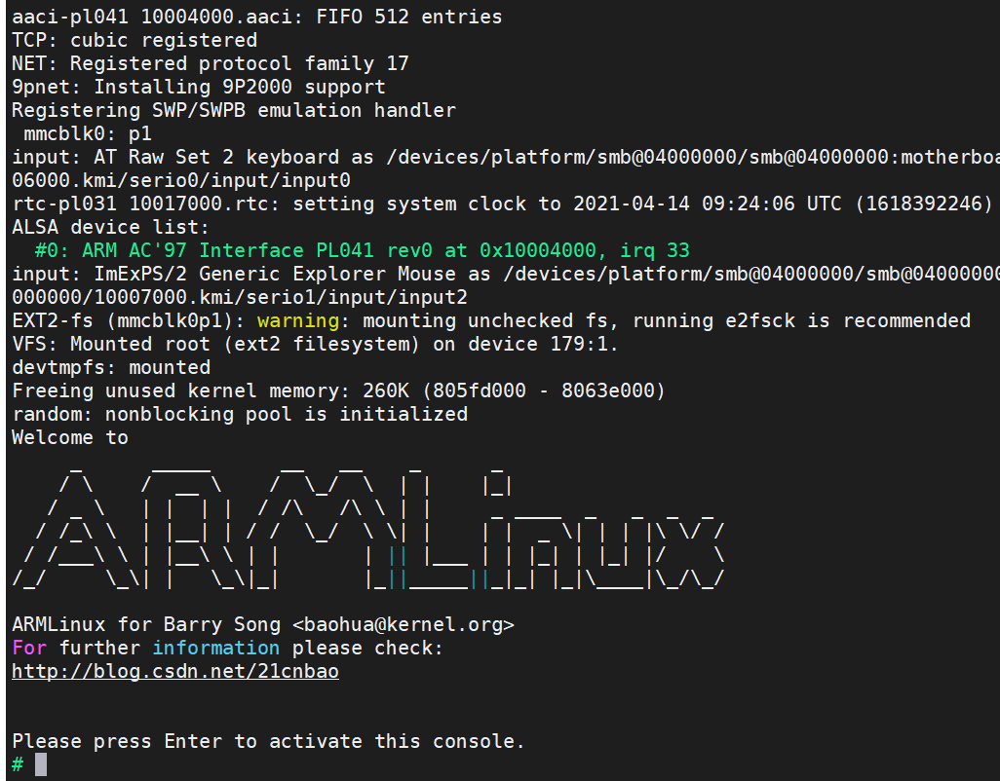

# 序章
本文以下三本书的读书笔记：
* 《Linux设备驱动程序》- 1
* 《深入Linux设备驱动程序内核机制》(陈学松) - 2
* 《Linux设备驱动开发详解：基于最新的Linux 4.0内核》(宋宝华) - 3

# 搭建ARM-QEMU开发环境
此文的开发环境参考了《Linux设备驱动开发详解：基于最新的Linux 4.0内核》的开发环境：QEMU模拟的vexpress Cortex-A9SMP四核处理器开发板。

## 安装交叉编译器"arm-linux-gnueabihf-gcc"
由于《Linux设备驱动开发详解》是基于4.0-rc1内核版本的，因此交叉编译器的版本也不能太高。交叉编译器安装后，能得到如下结果：<br>


### 如何在Ubuntu20上安装"arm-linux-gnueabihf-gcc-4.8"?
可[参考链接](https://askubuntu.com/questions/1235819/ubuntu-20-04-gcc-version-lower-than-gcc-7)，步骤如下：
* 添加gcc-4.8的源
   * `sudo vim /etc/apt/sources.list`
      ```bash
      deb http://dk.archive.ubuntu.com/ubuntu/ xenial main
      deb http://dk.archive.ubuntu.com/ubuntu/ xenial universe
      ```
* 安装"arm-linux-gnueabihf-gcc-4.8"
   * `sudo apt update`
   * `sudo apt install gcc-4.8-arm-linux-gnueabihf-base gcc-4.8-arm-linux-gnueabihf -y`
* 修改软链接"arm-linux-gnueabihf-gcc"
   * `sudo ln -s /usr/bin/arm-linux-gnueabihf-gcc-4.8 /usr/bin/arm-linux-gnueabihf-gcc`

## 编译vexpress的内核
* 下载kernel代码
   * `git clone https://github.com/torvalds/linux.git`
* checkout "v4.0-rc1" kernel tag
   * `git checkout v4.0-rc1`
* 编译-[build.sh](./code/env_arm/build.sh)
   * 编译内核 - zImage
   * 编译模块 - modules
   * 编译设备树 - dtbs
* 更新模块并安装 - [module.sh](./code/env_arm/module.sh)
   * 安装到根文件系统"vexpress.img"，此文件作为虚拟SD被QEMU模拟的vexpress启用

## 运行vexpress
* 安装QEMU
   * 在搜索引擎中寻找安装步骤，目的是使系统支持`qemu-system-arm`命令，如：`sudo apt update && sudo apt-get install qemu-system`
   * 查看支持的ARM硬件种类：`qemu-system-arm -M help`
   ```bash
   vexpress-a15         ARM Versatile Express for Cortex-A15
   vexpress-a9          ARM Versatile Express for Cortex-A9
   ```
* 从上面内核编译的结果中，拷贝相关文件用于QEMU启动
   * [zImage](./code/env_arm/zImage)：linux kernel(v4.0-rc1)镜像
   * [vexpress.img](./code/env_arm/vexpress.img): 虚拟SD卡，将作为根文件系统的存放接指，它能以loop的形式被挂载，如挂载到"img"文件夹上：
      * `sudo mount -o loop,offset=$((2048*512)) vexpress.img img`
   * [vexpress-v2p-ca9.dtb](./code/env_arm/vexpress-v2p-ca9.dtb)
      * vexpress-a9的设备树文件
      * A "dtb" file contains a Device Tree Blob (or Binary)(nice description here). It's the new(er) way to pass hardware information about the board to the Linux kernel.
* 运行vexpress
   * [Makefile](./code/env_arm/Makefile)指定了两种启动方式，一个会在当前窗口打开，另一个会新启一个QEMU的窗口
   * 运行结果如下：<br>
      

## 编译第三方驱动
目的：在ubuntu20上基于[Makefile](./code/hello/Makefile)编译驱动[hello.c](./code/hello/hello.c)

### 如何基于kbuild编译第三方驱动?
[kbuild](https://www.kernel.org/doc/html/latest/kbuild/modules.html)是linux内核的编译系统，所有内核的目标都通过kbuild得到。在编译第三方驱动前，需要先编译好内核，以保证相关配置文件已经准备好。Ubuntu20在`/lib/modules/<uname -r>/build`目录下已经有编译好的内核。因此，可通过以下命令编译第三方驱动。
```bash
make -C /lib/modules/`uname -r`/build M=$(PWD) modules
```
当然，也可以自己编译内核，让后基于自己编译的内核编译驱动，具体可参考[Makefile](./code/hello/Makefile)。

### 如何编译Ubuntu20兼容的内核？
前面我们编译了ARM的内核，同样我们可以编译x86的内核，以兼容Ubuntu系统。
* 查看Ubuntu20的内核版本
   * `uname -r`: "5.8.0-43-generic"
* checkout对应版本的内核
   * `git checkout v5.8`
* 通过以下脚本编译x86内核
   ```bash
   export ARCH=x86
   export EXTRADIR=${PWD}/extra
   make x86_64_defconfig
   make bzImage -j8
   make modules -j8
   cp arch/x86/boot/bzImage extra/
   cp .config extra/
   ```

# Linux设备驱动概述[3]
## 无操作系统是的设备驱动
* 无操作系统时，设备驱动和应用软件，硬件的合理关系：<br>
   
* 无操作系统时，设备驱动和应用软件，硬件的不合理关系：<br>
   

## 有操作系统时的设备驱动
有操作系统时，设备驱动和操作系统，应用，硬件的关系：<br>

* 所有设备的驱动需设计面向操作系统内核的接口，这样的接口由操作系统规定，对一类设备而言结构一致，独立于具体的设备
* 对外呈现为操作系统的API

## Linux设备驱动
### 设备的分类及特点
* 字符设备
   * 指那些必须以串行顺序依次进行访问的设备，如触摸屏、磁带驱动器、鼠标等
* 块设备
   * 可以按任意顺序进行访问，以块为单位进行操作，如硬盘、eMMC等
* 网络设备
   * 网络设备面向数据包的接收和发送而设计，它并不倾向于对应于文件系统的节点，而是对应套接字

### Linux设备驱动于整个软硬件系统的关系


除网络设备外，字符设备与块设备都被映射到Linux文件系统的文件和目录，通过文件系统的系统调用接口open(), write(), read(), close()等即可访问字符设备和块设备。

Linux的块设备有两种访问方法：
* 类似dd命令对应的原始块设备，如"/dev/sdb1"等
* 在块设备上建立FAT、EXT4、BTRFS等文件系统，然后以文件路径的形式访问

# 驱动设计的硬件基础[3]
## 通用处理器
中央处理器的体系结构：<br>

* 冯诺依曼结构(普林斯顿结构)
   * Intel, ARM7
   * 将程序指令存储器和数据存储器合并在一起的存储结构，因此程序指令和数据的宽度相同
* 哈佛结构
   * ARM11, Cortex A系列
   * 指令和数据分开存储，指令和数据可以有不同的数据宽度
   * 独立的程序总线和数据总线

从指令集角度分类：
* 精简指令集RISC
   * 强调尽量减少指令集、指令单周期执行
   * 但是目标代码会更大
* 复杂指令集CISC
   * 强调增强指令的能力、减少目标代码的数量
   * 但是指令复杂、指令周期长

## 数字信号处理器
数字信号处理器DSP针对通信、图像、语音和视频处理等领域的算法而设计。乘法指令可在单周期完成，且优化了卷积等复杂运算。

数字信号处理器DSP分两类：
* 定点DSP
   * 只能用运算模拟浮点运算
* 浮点DSP
   * 浮点运算用硬件来实现，可在单周期内完成

总结下来，处理器的分类大致如下：<br>


## 存储器
存储器主要分：
* 只读存储器ROM
   * 不可编程ROM
   * 可编程ROM(PROM)
   * 可擦除可编程ROM(EPROM)
   * 电可擦除可编程ROM(E2PROM)
* 闪存Flash
   * NOR(或非) Flash
      * 和CPU的接口属于典型的SRAM接口，不需要额外增加控制电路
   * NAND(与非) Flash
      * 和CPU的接口必须由相应的控制电路进行转换，如：公共闪存接口CFI
      * 优势是容量大、价格低，擦除、编程速度远超NOR Flash
      * 劣势是读写更容易出错(1位反转)，因此需要EDC/ECC算法纠正
* 随机存取存储器
   * 静态RAM(SRAM)
      * 不需要刷新
   * 动态RAM(DRAM)
      * 以电荷形式进行存储，因此需要定期刷新
      * “DDR SDRAM”较SDRAM传输速率加倍，因为上升沿和下降沿都传输数据
   * 双端口RAM(DPRAM)<br>
      
      * 优点是通信速度快、实时性强、接口简单
   * 内容寻址RAM(CAM)<br>
      
      * CAM是以内容进行寻址的存储器，是一种特殊的存储阵列RAM
      * 用于数据检索的优势是软件无法比拟的
   * FIFO
* 光/磁介质存储器

总结下来，存储器的分类大致如下：<br>


## 接口与总线
### 串口


串口从"RS-232 -> RS-422 -> RS-485"标准的变化，增强了串行数据传输是效率与可靠性
* 上图中的UART通用异步接收器发送器，作用是完成并/串转换

### I2C
I2C(内置集成电路)总线是由Philips公司开发的两线式串行总线：
* 优势是：简单而有效，占用空间小，设计简单

### SPI
SPI(Serial Peripheral Interface, 串行外设接口)总线式一种同步串行外设接口，它可以使CPU与各种外围设备以串行方式进行通信以交换信息。一般主控SoC作为SPI的主，而外设作为SPI的从。


### USB
USB(通用串行总线)是Intel、Microsoft等厂商提出的，具有数据传输速率高、易扩展、支持即插即用和热插拔的优点。


USB提供了多种传输方式：
* 控制传输方式
   * 双向传输，数据量小，用于查询、配置和给USB设备发送通用命令
* 同步传输方式
   * 用于要求恒定数据传送率的即时应用，如语音业务传输
* 中断传输方式
   * 单向的，对USB主机而言，只有输入。用于定时查询设备是否由中断数据要传送，如键盘、鼠标等设备
* 批量传输方式
   * 在没有带宽、间隔时间要求的批量数据的传送和接收中，如打印机和扫描仪等设备

### 以太网接口
以太网接口由MAC(以太网媒体接入控制器)和PHY(物理接口收发器)组成。


### PCI和PCIe
PCI(外围部件互连)是由Intel在1991年推出的一种局部总线，作为一种通用的总线接口标准。


PCI-E(PCI Express)是Intel推出的新一代总线接口，采用点对点串行连接。每个设备都有自己的专用连接，采用串行方式传输数据，不需要向整个总线请求带宽，并可以把数据传输提高到一个很高的频率。

### SD和SDIO
SD(Secure Digital)是一种关于Flash存储卡的标准，在设计上与MMC(Multi-Media Card)保持了兼容。

SDIO(Secure Digital Input Output Card)在SD标准的基础上，定义了除存储卡以外的外设接口。现在已经有很多手机都支持SDIO的功能，以连接WiFi、蓝牙、GPS等模块。

eMMC(Embedded Multi Media Card)是当前移动设备本地存储的主流解决方案，目的在于简化手机存储器的设计。eMMC就是NAND Flash、闪存控制芯片和标准接口封装的集合。

## CPLD和FPGA
CPLD(复杂可编程逻辑器件)由完全可编程的与或门阵列以及宏单元构成。


上图是一个非常典型的CPLD的单个宏单元结构。宏单元由一些
* “与或”阵列完成组合逻辑功能
   * 与阵列输出称为乘积项
      * 乘积阵列实际上就是一个与或阵列，每个交叉点都是一个可编程熔丝，如果导通就是“与”逻辑
   * “与”阵列后一遍还有一个“或”阵列，用以完成最小逻辑表达式中的“或”关系
* 触发器完成时序逻辑功能

与CPLD不同，FPGA基于LUT(查找表)工艺。查找表本质上是一片RAM，当用户通过原理图或HDL描述了一个逻辑电路以后，FPGA开发软件会自动计算逻辑电路所有可能的结果，并把结果事先写入RAM。这样，输入一组信号进行逻辑运算就等于输入一个地址进行查表以输出对应地址的内容。

下表是一个4输入LUT的实际逻辑电路与LUT实现的对应关系：<br>


* IOC - 输入/输出控制模块
* EAB - 嵌入式阵列块
   * 不仅可以用作存储器，还可以事先写入查表值以用来构成如乘法器、纠错逻辑等
* LAB
   * 用于逻辑电路设计，一个LAB包括多个LE(逻辑单元)，每个LE包括组合逻辑及一个可编程触发器。一系列LAB构成的逻辑阵列可实现计数器、加法器、状态机等
* 快速通道
   * 用于内部信号的互连

## 硬件时序分析

