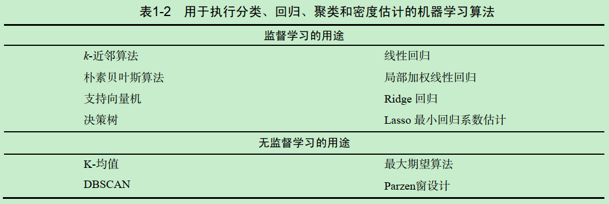
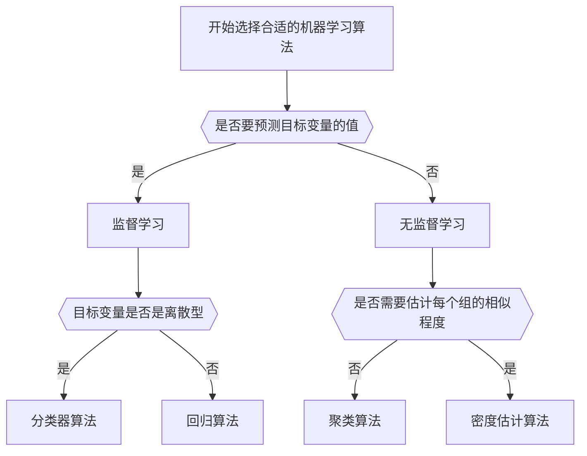

# 机器学习基础
* 监督学习
    * 分类 - 目标变量是标称型(结果只在有限目标集中取值)
        * k-近邻算法、决策树、朴素贝叶斯分类
    * 回归 - 目标变量可从无限的数值型中取值
        * Logistic回归、支持向量机
* 无监督学习 - 不会给定目标值
    * 聚类

## 常见述语

* 特征
    * 数据的各种属性
* 特征类型
    * 数值型(连续)、二值型(两种)、枚举型(多种)
* 目标类型
    * 分类算法的目标类型：标称型
    * 回归算法的目标类型：连续性
* 机器学习的目的
    * 发现特征和目标变量之间的关系
* 分类问题中的目标变量称为**类别**
* 训练数据和测试数据
* 知识表示
    * 判断机器学习是否满足要求的方法，即测试数据结果是否良好

## 机器学习的主要算法

* 监督学习的左列算法为分类，右列为回归
    * 这类算法知道预测什么，即目标变量的值信息
* 无监督学习的左列算法为聚类，右列为密度估计
    * 这类算法没有类别信息，也不会给定目标值

### 如何选择合适的算法

