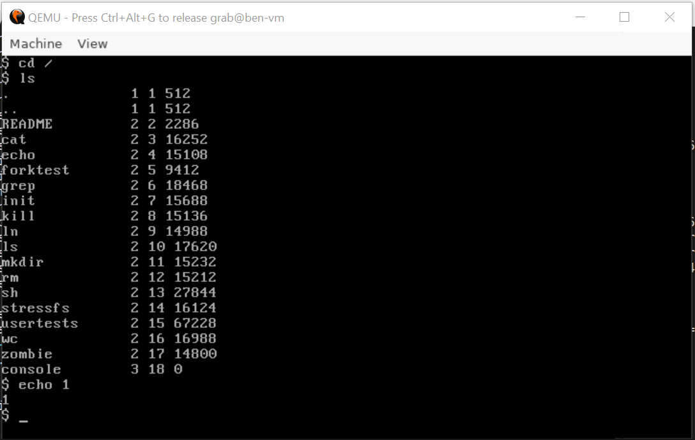
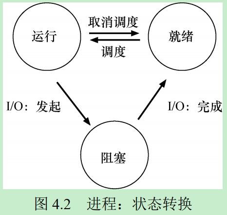
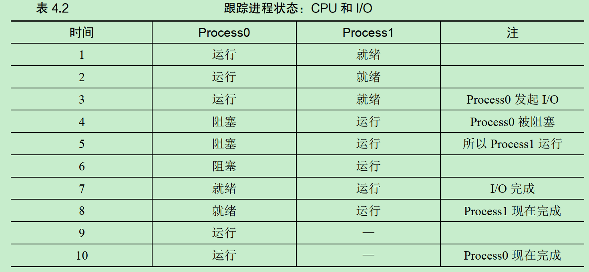
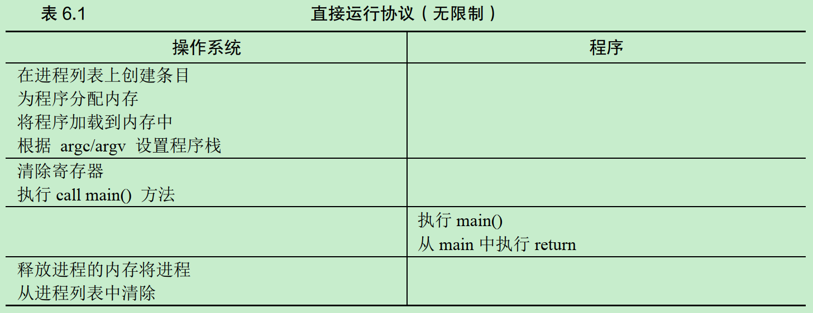
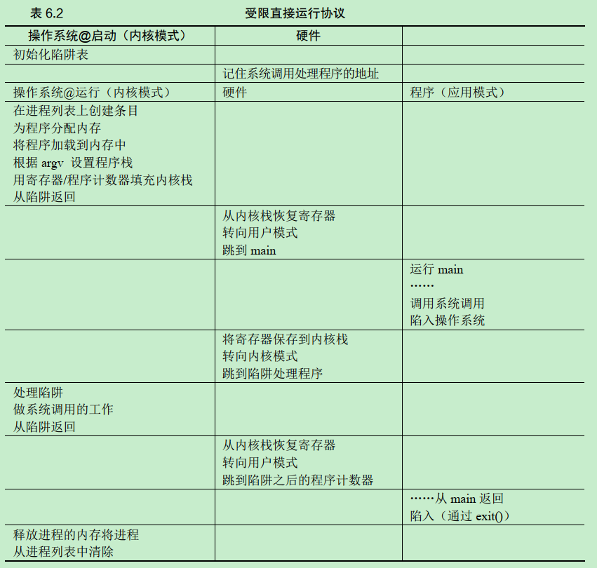
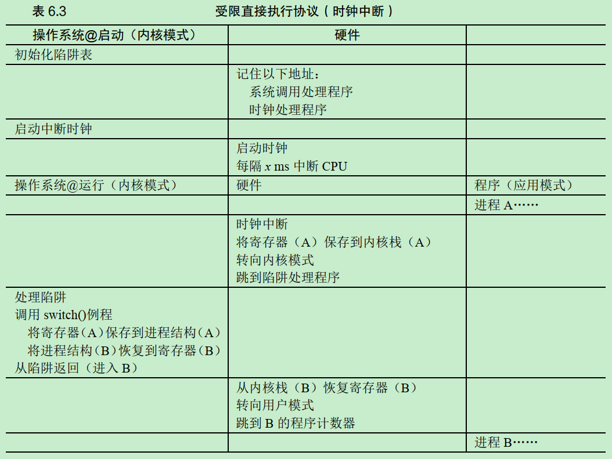

# 配置环境
## 安装“XV6”系统
* Ubuntu下安装qemu
   > sudo apt update && sudo apt-get install qemu-system
   * 安装完成后需要支持`qemu-system-i386`或者`qemu-system-x86_64`命令，否则会出现`Error: Couldn't find a working QEMU executable.`错误。可自行搜索相关依赖
* 安装xv6
   > git clone git://github.com/mit-pdos/xv6-public.git
   > make
* 启动xv6
   > make qemu
   * 在xv6目录下输入上面的命令，即可出现如下xv6窗口：
   

# 第2章 操作系统介绍
## 关键问题
* 如何将资源虚拟化？
   * 操作系统通过哪些机制和策略来实现虚拟化？
   * 操作系统如何有效地实现虚拟化？
   * 需要哪些硬件支持？

操作系统将物理资源(如处理器、内存或磁盘)转换为更通用、更强大且更易于使用的虚拟形式。

## 虚拟化CPU
* 所谓的虚拟化CPU，即系统将单个CPU(或其中一小部分)转换为看似无限数量的CPU
* [例子"virtualizing_cpu"](./code/virtualizing_cpu)可以在一个CPU上同时运行多个程序

## 虚拟化内存
* 每个进程访问自己的私有虚拟地址空间，操作系统以某种方式映射到机器的物理内存上
* [例子"virtualizing_memory"](./code/virtualizing_memory)可以在同一个地址(虚拟地址)上读写数据
   ```bash
   > make run
   (480896) memory address of static_var: 0x555555558010
   (480896) memory address of p: 0x5555555596b0

   (480897) memory address of static_var: 0x555555558010
   (480897) memory address of p: 0x5555555596b0
   ```

## 并发
### 关键问题
* 如何构建正确的并发程序？
   * 如果同一个内存空间中有很多并发执行的线程，如何构建一个正确的工作程序？
   * 操作系统需要什么原语？
   * 硬件应该提供哪些机制？
   * 我们如何利用它们来解决并发问题？

并发程序有可能会导致一些深刻而有趣的问题，如：
* [例子"concurrency_thread"](./code/concurrency_thread)展示了并发运行时有可能出现的意外(计数器的值不是期望值)

## 持久性
操作系统通过管理磁盘的软件(文件系统file system)来持久地为用户保存数据。不像操作系统为CPU和内存提供的抽象，操作系统不会为每个应用程序创建专用的虚拟磁盘。相反，它假设用户经常需要共享文件中的信息。
### 关键问题
* 如何持久地存储数据？
   * 持久性需要哪些技术才能正确地实现？
   * 需要哪些机制和策略才能高性能地实现
   * 面对硬件和软件故障，可靠性如何实现？

* [例子"persistence_io"](./code/persistence_io)通过系统调用向磁盘中记录了`hello`信息。

## 设计目标
* 操作系统能做什么
   * 取得CPU、内存和磁盘等物理资源，并对它们进行虚拟化
   * 处理与并发有关的麻烦且棘手的问题
   * 持久地存储文件，从而使它们长期安全
* 设计操作系统的要求
   * 提供高性能
   * 在应用程序之间以及在OS和应用程序之间提供保护
   * 高度可靠，可不间断运行
   * 安全性、移动性

# 第4章 抽象：进程
## 关键问题
* 如何提供有许多CPU的假象？
   * 时分共享
      * CPU在时间上划分给多个任务
   * 空分共享
      * 磁盘在空间上划分给多个任务

* 操作系统以什么策略做出调度决定？
   * 历史信息
      * 哪个程序在最后一分钟要运行更多？
   * 工作负载
      * 运行什么类型的程序？
   * 性能指标
      * 系统是否针对交互式性能或吞吐量进行优化？

* 什么是操作系统的策略和机制分离？
   * 一个通用的设计范式是将高级策略与低级机制分开
   * 机制是解决how问题
      * 例如，操作系统如何执行上下文切换
   * 策略是解决which问题
      * 例如操作系统现在应该运行哪个进程
   * 将策略和机制分开可以轻松针对某个策略改变策略，而不必重新考虑机制

## 什么是进程？
操作系统为正在运行的程序提供的抽象，就是进程。进程的机器状态有下面几个部分组成：
* 内存
   * 指令
   * 数据
* 寄存器
   * PC寄存器
      * 告诉我们程序当前正在执行哪个指令
   * 栈指针stack pointer 和帧指针frame pointer
      * 用于管理函数参数栈、局部变量和返回地址
* 持久存储设备
   * 当前打开的文件列表

## 进程状态
* 运行running
   * 进程正在处理器上执行指令
* 就绪ready
   * 进程已准备好运行，但由于某种原因，操作系统选择不在此时运行
* 阻塞blocked
   * 进程执行了某种操作，直到发生其他事件时才会准备运行




上表中，Process0发起I/O并被阻塞，等待I/O完成。例如，当从磁盘读取数据或等待网络数据包时，进程会被阻塞。OS发现Process0不使用CPU，则开始运行Process1。当Process1运行时，I/O完成，将Process0移回就绪状态。最后，Process1结束，Process0运行，然后完成。OS在上面步骤中做了以下两个决策：
* 决定在Process0发出I/O时，运行Process1
* 当I/O完成时，系统决定不切回Process0

## 进程数据结构
操作系统有一些关键的数据结构来跟踪进程的状态，称为进程列表(process list)或者进程控制块(Process Control Block, PCB)。下面是xv6内核中每个进程的信息：
```c
// the registers xv6 will save and restore
// to stop and subsequently restart a process
struct context
{
   int eip;
   int esp;
   int ebx;
   int ecx;
   int edx;
   int esi;
   int edi;
   int ebp;
};
// the different states a process can be in
enum proc_state
{
   UNUSED,
   EMBRYO,
   SLEEPING,
   RUNNABLE,
   RUNNING,
   ZOMBIE
};
// the information xv6 tracks about each process
// including its register context and state
struct proc
{
   char *mem;    // Start of process memory
   uint sz;      // Size of process memory
   char *kstack; // Bottom of kernel stack for this process
   enum proc_state state;      // Process state
   int pid;                    // Process ID
   struct proc *parent;        // Parent process
   void *chan;                 // If non-zero, sleeping on chan
   int killed;                 // If non-zero, have been killed
   struct file *ofile[NOFILE]; // Open files
   struct inode *cwd;          // Current directory
   struct context context;     // Switch here to run process
   struct trapframe *tf;       // Trap frame for the current interrupt
};
```

# 第5章 插叙：进程API
## 关键问题
* 为什么设计`fork`和`exec`这种奇怪的接口来完成简单的、创建新进程的任务？
   * 分离`fork`和`exec`的做法在构建UNIX shell的时候非常有用，因为这给了shell在fork之后exec之前运行代码的机会，这些代码可以在运行新程序前改变环境，从而让一系列有趣的功能很容易实现。比如，`wc p3.c > newfile.txt` 重定向很容易实现，shell在调用`exec`之前先关闭标准输出，打开文件newfile.txt即可。
   * 参考例子[redirect](./code/redirect)

# 第6章：受限直接执行
## 关键问题
* 如何高效、可控地虚拟化CPU？
   * 操作系统必须以高性能的方式虚拟化CPU，同时保持对系统的控制。为此，需要硬件和操作系统支持。操作系统通常会明智地利用硬件支持，以便高效地实现其工作。

## 基本技巧：受限直接执行

上表是无限制的直接执行协议，有如下两个问题：
* 如果我们只运行一个程序，操作系统怎么能确保程序不做任何我们不希望它做的事情，同时仍然高效地运行它？
* 当我们运行一个进程时，操作系统如何让它停下来并切换到另一个进程，从而实现虚拟化CPU所需的时分共享？

### 关键问题1：受限制的操作
* 如何执行受限制的操作？
   * 一个进程必须能够执行I/O和其他一些受限制的操作，但又不能让进程完全控制系统。操作系统和硬件如何写作实现这一点？

* 操作系统通过在用户模式(user mode)和内核模式(kernel mode)之间进行切换，使进程能受到一定的限制。用户如果想执行某种特权模式操作，可
   * 通过系统调用，使进程执行特殊的陷阱(trap)指令，同时跳入内核并将特权级别提升到内核模式
   * 进入内核模式后，通过陷阱表(trap table)，执行需要的特权操作
   * 完成后，操作系统调用一个特殊的从陷阱返回(return-from-trap)指令，返回到用户模式

* Limited Direct Execution (LDE)
LDE协议有两个阶段：
   * 第一个阶段在系统引导时，内核初始化陷阱表，并且CPU记住它的位置以供随后使用
   * 第二阶段在运行进程时，引导程序在使用从陷阱返回指令开始执行进程之前，会为进程做一些初始化工作(如，内存分配)


上表展示了内核模式和用户模式的切换过程，注意这和函数调用栈的区别。普通函数调用只涉及用户栈，不涉及内核栈。
当从内核模式转向用户模式时，硬件隐式地从内核栈中恢复寄存器；当通过系统调用从用户模式转向内核模式时，也是硬件隐式地将寄存器保存在内核栈，再跳转到内核模式。

### 关键问题2：在进程之间切换
* 如何重获CPU的控制权？
   * 操作系统如何重新获得CPU的控制权(regain control)，以便它可以在进程之间切换？

* 协作方式：等待系统调用
   * 在协作调度系统中，OS通过等待系统调用，或某种非法操作发生，从而重新获得CPU的控制权。进而完成进程切换，或终止违规进程。

* 非协作方式：操作系统进行控制
   * 利用时钟中断(timer interrupt)，在即使进程不协作的情况下，操作系统也可以获得CPU的控制权
   * 产生中断时，当前正在运行的进程停止，操作系统中预先配置的中断处理程序(interrupt handler)会运行

### 关键问题3：保存和恢复上下文
* 当操作系统通过协作或非协作方式获得控制权后，如何决定时继续运行当前进程，还是切换到另一个进程？
   * 由调度程序(scheduler)决定
      * 如果决定进行进程切换，OS就会执行上下文切换(context switch)
         * 为当前正在执行的进程保存一些寄存器(到被切换进程的内核栈)
         * 为即将执行的进程恢复一些寄存器的值(从要切换进程的内核栈)
         * 执行陷阱返回指令后，不是返回老进程，而是执行新进程


上表中有两种类型的寄存器保存/恢复。
* 第一种是发生时钟中断的时候，用户寄存器由硬件隐式保存到内核栈
* 第二种是当操作系统从A切换到B，内核寄存器被OS明确地保存，但这次被存储在该进程的进程结构的内存中。而后，从另一进程结构中恢复寄存器，好像刚刚由B陷入内核而不是A陷入内核一样。
