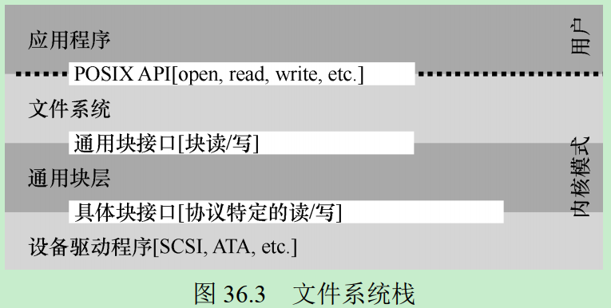

# 配置环境
## 安装“XV6”系统
* Ubuntu下安装qemu
   > sudo apt update && sudo apt-get install qemu-system
   * 安装完成后需要支持`qemu-system-i386`或者`qemu-system-x86_64`命令，否则会出现`Error: Couldn't find a working QEMU executable.`错误。可自行搜索相关依赖
* 安装xv6
   > git clone git://github.com/mit-pdos/xv6-public.git
   > make
* 启动xv6
   > make qemu
   * 在xv6目录下输入上面的命令，即可出现如下xv6窗口：
   

# 第2章 操作系统介绍
## 关键问题
* 如何将资源虚拟化？
   * 操作系统通过哪些机制和策略来实现虚拟化？
   * 操作系统如何有效地实现虚拟化？
   * 需要哪些硬件支持？

操作系统将物理资源(如处理器、内存或磁盘)转换为更通用、更强大且更易于使用的虚拟形式。

## 虚拟化CPU
* 所谓的虚拟化CPU，即系统将单个CPU(或其中一小部分)转换为看似无限数量的CPU
* [例子"virtualizing_cpu"](./code/virtualizing_cpu)可以在一个CPU上同时运行多个程序

## 虚拟化内存
* 每个进程访问自己的私有虚拟地址空间，操作系统以某种方式映射到机器的物理内存上
* [例子"virtualizing_memory"](./code/virtualizing_memory)可以在同一个地址(虚拟地址)上读写数据
   ```bash
   > make run
   (480896) memory address of static_var: 0x555555558010
   (480896) memory address of p: 0x5555555596b0

   (480897) memory address of static_var: 0x555555558010
   (480897) memory address of p: 0x5555555596b0
   ```

## 并发
### 关键问题
* 如何构建正确的并发程序？
   * 如果同一个内存空间中有很多并发执行的线程，如何构建一个正确的工作程序？
   * 操作系统需要什么原语？
   * 硬件应该提供哪些机制？
   * 我们如何利用它们来解决并发问题？

并发程序有可能会导致一些深刻而有趣的问题，如：
* [例子"concurrency_thread"](./code/concurrency_thread)展示了并发运行时有可能出现的意外(计数器的值不是期望值)

## 持久性
操作系统通过管理磁盘的软件(文件系统file system)来持久地为用户保存数据。不像操作系统为CPU和内存提供的抽象，操作系统不会为每个应用程序创建专用的虚拟磁盘。相反，它假设用户经常需要共享文件中的信息。
### 关键问题
* 如何持久地存储数据？
   * 持久性需要哪些技术才能正确地实现？
   * 需要哪些机制和策略才能高性能地实现
   * 面对硬件和软件故障，可靠性如何实现？

* [例子"persistence_io"](./code/persistence_io)通过系统调用向磁盘中记录了`hello`信息。

## 设计目标
* 操作系统能做什么
   * 取得CPU、内存和磁盘等物理资源，并对它们进行虚拟化
   * 处理与并发有关的麻烦且棘手的问题
   * 持久地存储文件，从而使它们长期安全
* 设计操作系统的要求
   * 提供高性能
   * 在应用程序之间以及在OS和应用程序之间提供保护
   * 高度可靠，可不间断运行
   * 安全性、移动性

# 第4章 抽象：进程
## 关键问题
* 如何提供有许多CPU的假象？
   * 时分共享
      * CPU在时间上划分给多个任务
   * 空分共享
      * 磁盘在空间上划分给多个任务

* 操作系统以什么策略做出调度决定？
   * 历史信息
      * 哪个程序在最后一分钟要运行更多？
   * 工作负载
      * 运行什么类型的程序？
   * 性能指标
      * 系统是否针对交互式性能或吞吐量进行优化？

* 什么是操作系统的策略和机制分离？
   * 一个通用的设计范式是将高级策略与低级机制分开
   * 机制是解决how问题
      * 例如，操作系统如何执行上下文切换
   * 策略是解决which问题
      * 例如操作系统现在应该运行哪个进程
   * 将策略和机制分开可以轻松针对某个策略改变策略，而不必重新考虑机制

## 什么是进程？
操作系统为正在运行的程序提供的抽象，就是进程。进程的机器状态有下面几个部分组成：
* 内存
   * 指令
   * 数据
* 寄存器
   * PC寄存器
      * 告诉我们程序当前正在执行哪个指令
   * 栈指针stack pointer 和帧指针frame pointer
      * 用于管理函数参数栈、局部变量和返回地址
* 持久存储设备
   * 当前打开的文件列表

## 进程状态
* 运行running
   * 进程正在处理器上执行指令
* 就绪ready
   * 进程已准备好运行，但由于某种原因，操作系统选择不在此时运行
* 阻塞blocked
   * 进程执行了某种操作，直到发生其他事件时才会准备运行


上表中，Process0发起I/O并被阻塞，等待I/O完成。例如，当从磁盘读取数据或等待网络数据包时，进程会被阻塞。OS发现Process0不使用CPU，则开始运行Process1。当Process1运行时，I/O完成，将Process0移回就绪状态。最后，Process1结束，Process0运行，然后完成。OS在上面步骤中做了以下两个决策：
* 决定在Process0发出I/O时，运行Process1
* 当I/O完成时，系统决定不切回Process0

## 进程数据结构
操作系统有一些关键的数据结构来跟踪进程的状态，称为进程列表(process list)或者进程控制块(Process Control Block, PCB)。下面是xv6内核中每个进程的信息：
```c
// the registers xv6 will save and restore
// to stop and subsequently restart a process
struct context
{
   int eip;
   int esp;
   int ebx;
   int ecx;
   int edx;
   int esi;
   int edi;
   int ebp;
};
// the different states a process can be in
enum proc_state
{
   UNUSED,
   EMBRYO,
   SLEEPING,
   RUNNABLE,
   RUNNING,
   ZOMBIE
};
// the information xv6 tracks about each process
// including its register context and state
struct proc
{
   char *mem;    // Start of process memory
   uint sz;      // Size of process memory
   char *kstack; // Bottom of kernel stack for this process
   enum proc_state state;      // Process state
   int pid;                    // Process ID
   struct proc *parent;        // Parent process
   void *chan;                 // If non-zero, sleeping on chan
   int killed;                 // If non-zero, have been killed
   struct file *ofile[NOFILE]; // Open files
   struct inode *cwd;          // Current directory
   struct context context;     // Switch here to run process
   struct trapframe *tf;       // Trap frame for the current interrupt
};
```

# 第5章 插叙：进程API
## 关键问题
* 为什么设计`fork`和`exec`这种奇怪的接口来完成简单的、创建新进程的任务？
   * 分离`fork`和`exec`的做法在构建UNIX shell的时候非常有用，因为这给了shell在fork之后exec之前运行代码的机会，这些代码可以在运行新程序前改变环境，从而让一系列有趣的功能很容易实现。比如，`wc p3.c > newfile.txt` 重定向很容易实现，shell在调用`exec`之前先关闭标准输出，打开文件newfile.txt即可。
   * 参考例子[redirect](./code/redirect)

# 第6章：受限直接执行
## 关键问题
* 如何高效、可控地虚拟化CPU？
   * 操作系统必须以高性能的方式虚拟化CPU，同时保持对系统的控制。为此，需要硬件和操作系统支持。操作系统通常会明智地利用硬件支持，以便高效地实现其工作。

## 基本技巧：受限直接执行

上表是无限制的直接执行协议，有如下两个问题：
* 如果我们只运行一个程序，操作系统怎么能确保程序不做任何我们不希望它做的事情，同时仍然高效地运行它？
* 当我们运行一个进程时，操作系统如何让它停下来并切换到另一个进程，从而实现虚拟化CPU所需的时分共享？

### 关键问题1：受限制的操作
* 如何执行受限制的操作？
   * 一个进程必须能够执行I/O和其他一些受限制的操作，但又不能让进程完全控制系统。操作系统和硬件如何写作实现这一点？

* 操作系统通过在用户模式(user mode)和内核模式(kernel mode)之间进行切换，使进程能受到一定的限制。用户如果想执行某种特权模式操作，可
   * 通过系统调用，使进程执行特殊的陷阱(trap)指令，同时跳入内核并将特权级别提升到内核模式
   * 进入内核模式后，通过陷阱表(trap table)，执行需要的特权操作
   * 完成后，操作系统调用一个特殊的从陷阱返回(return-from-trap)指令，返回到用户模式

* Limited Direct Execution (LDE)
LDE协议有两个阶段：
   * 第一个阶段在系统引导时，内核初始化陷阱表，并且CPU记住它的位置以供随后使用
   * 第二阶段在运行进程时，引导程序在使用从陷阱返回指令开始执行进程之前，会为进程做一些初始化工作(如，内存分配)


上表展示了内核模式和用户模式的切换过程，注意这和函数调用栈的区别。普通函数调用只涉及用户栈，不涉及内核栈。
当从内核模式转向用户模式时，硬件隐式地从内核栈中恢复寄存器；当通过系统调用从用户模式转向内核模式时，也是硬件隐式地将寄存器保存在内核栈，再跳转到内核模式。

### 关键问题2：在进程之间切换
* 如何重获CPU的控制权？
   * 操作系统如何重新获得CPU的控制权(regain control)，以便它可以在进程之间切换？

* 协作方式：等待系统调用
   * 在协作调度系统中，OS通过等待系统调用，或某种非法操作发生，从而重新获得CPU的控制权。进而完成进程切换，或终止违规进程。

* 非协作方式：操作系统进行控制
   * 利用时钟中断(timer interrupt)，在即使进程不协作的情况下，操作系统也可以获得CPU的控制权
   * 产生中断时，当前正在运行的进程停止，操作系统中预先配置的中断处理程序(interrupt handler)会运行

### 关键问题3：保存和恢复上下文
* 当操作系统通过协作或非协作方式获得控制权后，如何决定时继续运行当前进程，还是切换到另一个进程？
   * 由调度程序(scheduler)决定
      * 如果决定进行进程切换，OS就会执行上下文切换(context switch)
         * 为当前正在执行的进程保存一些寄存器(到被切换进程的内核栈)
         * 为即将执行的进程恢复一些寄存器的值(从要切换进程的内核栈)
         * 执行陷阱返回指令后，不是返回老进程，而是执行新进程


上表中有两种类型的寄存器保存/恢复。
* 第一种是发生时钟中断的时候，用户寄存器由硬件隐式保存到内核栈
* 第二种是当操作系统从A切换到B，内核寄存器被OS明确地保存，但这次被存储在该进程的进程结构的内存中。而后，从另一进程结构中恢复寄存器，好像刚刚由B陷入内核而不是A陷入内核一样。

# 第7章 进程调度：介绍
## 关键问题
* 如何开发调度策略？
   * 我们该如何开发一个考虑调度策略的基本框架？什么时关键假设？哪些指标非常重要？哪些基本方法已经在早期的系统中使用过？

## 调度指标
* 非分时系统
   * T(周转时间) = T(完成时间) - T(到达时间)
* 分时系统
   * T(响应时间) = T(首次运行) - T(到达时间)

## 调度策略对比
* 先进先出(FIFO)
   * 问题：如果第一个任务时间远大于后面的任务，T(周转时间)会远大于后面的任务先执行，违背了SJF原则
* 最短任务优先(SJF, Shortest Job First)
   * 问题：如果执行时间少的任务晚于执行时间大的任务达到，在不抢占正在执行任务的前提下，仍然存在问题
* 最短完成时间优先(STCF)
   * 每当新工作进入系统时，确定剩余工作和新工作中谁的剩余时间最少，然后调度该工作
* 轮转(RR, Round Robin)
   * RR在一个时间片(time slice)内运行一个工作，然后切换到运行队列中的下一个任务
   * 如果周转时间是我们的指标，那么RR确实是最糟糕的策略之一。因为周转时间只关心作业何时完成。

## 结合I/O


# 第8章 调度：多级反馈队列 Multi-Level Feedback Queue, MLFQ
多级反馈队列解决了：
* 在不知道工作要运行多久时，无法使用SJF或STCF优化周转时间
* 优化响应时间，但不能像轮转那样牺牲了周转时间

## 关键问题
* 没有完备的知识如何调度？
   * 没有工作长度的先验知识，如何设计一个能同时减少响应时间和周转时间的调度程序？

## MLFQ 基本规则
MLFQ中有许多独立的队列，每个队列有不同的优先级。任何时刻，一个工作只能存在于一个队列中。MLFQ总是优先执行较高优先级的工作。每个队列中可能会有多个工作，因此具有同样的优先级。在这种情况下，我们就对这些工作采用轮转调度。
* 如何设置优先级？
   * 根据观察到的行为，动态调整每个工作的优先级
      * 如果一个工作不断放弃CPU去等待键盘输入，这是交互型进程的可能行为，MLFQ因此会让它保持高优先级
      * 如果一个工作长时间地占用CPU，MLFQ会降低其优先级
* 规则
   * 如果A的优先级 > B的优先级，运行A(不运行B)
   * 如果A的优先级 = B的优先级，轮转运行A和B

## 尝试1：如何改变优先级
* 规则
   * 工作进入系统时，放在最高优先级
   * 工作用完整个时间片后，降低其优先级
   * 如果工作在其时间片以内主动释放CPU，则优先级不变
* 实例1：单个长工作
   * 对于单个长工作来说，最终任务会一直在低优先级的队列中运行
* 实例2：来了一个短工作
   * 如果来了一个短工作，由于它的运行时间很短，在被移入最低优先级队列之前就执行完了
   * 目标：如果不知道工作是短工作还是长工作，那么就在开始的时候假设其是短工作，并赋予最高优先级。
* 实例3：如果有I/O呢
   * 如果进程在时间片用完之前主动放弃CPU，则保持它的优先级不变
* 总结
   * 优点
      * 长工作之间可以公平地分享CPU
      * 又能给短工作或交互型工作很好的响应时间
   * 缺点
      * 会又饥饿问题，如果又太多交互型工作，长工作永远无法得到CPU

## 尝试2：提升优先级
* 规则
   * 经过一段时间S，就将系统中所有工作重新加入最高优先级队列


* 问题
   * 如何设置S的值？
      * S设置得太高，长工作会饥饿
      * S设置得太低，交互型工作又得不到合适的CPU时间比例

## 尝试3： 更好的计时方式
* 规则
   * 为了防止调度程序被愚弄，一旦工作用完了其在某一层中的时间配额(无论中间主动放弃了多少次CPU)，就降低其优先级

## 小结
* MLFQ规则
   * 如果A的优先级 > B的优先级，运行A
   * 如果A的优先级 = B的优先级，轮转A和B
   * 工作进入系统时，放在最高优先级
   * 一旦工作用完了其在某一层中的时间配额(无论中间主动放弃了多少次CPU)，就降低其优先级
   * 经过一段时间S，就将系统中所有工作重新加入最高优先级队列

# 第9章 调度：比例份额
比例份额(proportional-share)调度，有时也称公平份额(fair-share)调度，目的是确保每个工作获得一定比例的CPU时间，而不是优化周转时间和响应时间。

## 彩票调度
比例份额调度有一个非常优秀的现代例子，就是彩票调度(lottery scheduling)，即利用随机性决定调度机制。随机性的好处有：
* 随机方法可以避免奇怪的边角情况
* 随机方法很轻量
* 随机方法很快

## 步长调度
步长调度可以解决彩票调度在短时长任务存在不公平的问题，但是需要全局状态。如一个新的进程在步长调度执行过程中加入系统，无法确定它的行程值。

## 比例份额调度的应用
由于以下的原因，比例份额调度并没有作为CPU调度程序被广泛使用：
* 不能很好地适合I/O
* 票数分配问题没有确定的解决方式，如：如何知道浏览器进程应该拥有多少票数？

比例份额调度只有在特定的领域得到应用。例如虚拟数据中心中，你可能会希望分配1/4的CPU周期给Windows虚拟机，剩余给Linux系统，比例分配的方式可以更简单高效。

# 第10章 多处理器调度(高级)
## 关键问题
* 多处理器系统面临的问题
   * 应用程序并行执行问题
      * 多线程应用可以将工作分散到多个CPU上，因此CPU资源越多就运行越快
   * 多处理器调度问题
      * 操作系统应该如何在多CPU上调度工作？会遇到什么新问题？已有的技术依旧适用吗？是否需要新的思路？

## 背景：多处理器架构

### 缓存一致性(cache coherence)问题
多CPU由于存在多个缓存，会存在缓存一致性(cache coherence)问题。硬件提供了这个问题的基本解决方案：
* 通过监控内存访问，硬件可以保证获得正确的数据，并保证共享内存的唯一性。
   * 在基于总线的系统中，一种方式是使用总线窥探。每个缓存都通过监听链接所有缓存和内存的总线，来发现内存访问。如果CPU发现对它放在缓存中的数据的更新，会作废(invalidate)本地副本(从缓存中移除)，或更新(update)它。

### 缓存亲和度(cache affinity)问题
一个进程在某个CPU上运行时，会在该CPU的缓存中维护许多状态。下次该进程在相同CPU上运行时，由于缓存中的数据而执行得更快。相反，在不同的CPU上执行，会由于需要重新加载数据而很慢(好在硬件保证的缓存一致性可以保证正确执行)。因此多处理调度应该考虑到这种缓存亲和性，并尽可能将进程保持在同一个CPU上。

## 单队列调度 SQMS, Single Queue Multiprocessor Scheduling
简单地复用单处理器调度的基本架构，缺点是：
* 缺乏可扩展性scalability
   * 为了保证在多CPU上正常运行，调度程序的开发者需要在代码中通过加锁locking来保证原子性。在SQMS访问单个队列时(如寻找下一个运行的工作)，锁确保得到正确的结果。
* 缓存亲和性
   * 如：调度队列 A->B->C->D->E-NULL。下面是每个CPU可能的调度序列：<br>
   
   * 即使做了如下改进，E任务还是没法保证缓存亲和性: <br>
   

## 多队列调度 MQMS，Multi-Queue Multiprocessor Scheduling
在MQMS中，基本调度框架包含多个调度队列，每个队列可以使用不同的调度规则，比如轮转或其他任何可能的算法。当一个工作进入系统后，系统会依照一些启发性规则(如随机或选择较空的队列)将其放入某个调度队列。这样一来，每个CPU调度之间相互独立，就避免了单队列的方式中由于数据共享及同步带来的问题。


### 关键问题
* 如何应对MQMS存在负载不均的问题
   * 多队列多处理器调度程序应该如何处理负载不均问题，从而更好地实现预期的调度目标？
* 通过迁移模式可以解决负载不均的问题，但是系统应该如何迁移？
   * 一个基本的方法是采用一种技术，名为工作窃取(working stealing)。通过这种方法，工作量较少的(源)队列不定期地"偷看"其他队列是不是比自己工作多。如果目标队列比源队列显著地更满，就从目标队列"窃取"一个或多个工作，实现负载均衡。

### Linux多处理器调度
Linux有三种调度模式：
* O(1)调度程序
   * 多队列
   * 基于优先级(类似MLFQ)
* 完全公平调度程序(CFS)
   * 多队列
   * 基于比例调度(类似步长调度)
* BF调度程序(BFS)
   * 单队列
   * 基于比例调度，最早最合适虚拟截止时间优先算法(EEVEF)

# 第13章 抽象：地址空间
## 关键问题
* 如何虚拟化内存
   * 操作系统如何在单一的物理内存上为多个运行的进程(所有进程共享内存)构建一个私有的、可能很大的地址空间的抽象？

## 虚拟内存系统的目标
* 透明transparency
   * 程序不应该感知到内存被虚拟化的事实
* 效率efficiency
   * 操作系统应该在时间和空间上更高效
* 保护protection
   * 保护进程不受其他进程影响

# 第14章 插叙：内存操作API
## 关键问题
* 如何分配和管理内存
   * 在UNIX/C程序中，理解如何分配和管理内存是构建健壮和可靠软件的重要基础。通常使用哪些接口？哪些错误需要避免？

## 内存类型
* 栈
   * 申请和释放操作时编译器来隐式管理的
* 堆
   * 申请和释放由人为控制

## 底层操作系统支持
`malloc`和`free`不是系统调用，而是库调用。它们底层是通过系统调用实现的。
### 系统调用brk
系统调用`brk`被用来改变程序分断的位置：堆结束的位置。它需要一个参数(新分断的地址)，从而根据新分断是大于还是小于当前分断，来增加或减小堆的大小。另一个调用`sbrk`要求传入一个增量，但目的是一样的。
### 系统调用mmap
通过`mmap`可以从操作系统获取内存。通过传入正确的参数，`mmap`可以在程序中创建一个匿名内存区域。这个区域不予任何特定文件相关联，而是于交换空间(swap space)相关联。

# 第15章 机制：地址转换
## 关键问题
* 如何高效、灵活地虚拟化内存
   * 如何实现高效的内存虚拟化？
   * 如何提供应用程序所需的灵活性？
   * 如何保持控制应用程序可访问的内存位置，从而确保应用程序的内存访问受到合理的限制？
   * 如何高效得实现这一切？

## 基于硬件的地址转换(hardware-based address translation)
硬件对每次内存访问进行处理，将指令中的虚拟地址转换为数据实际存储的物理地址。当然，仅仅依靠硬件不足以实现虚拟内存，因为它只是提供了底层机制来提高效率。操作系统必须在关键的位置介入，设置好硬件，以便完成正确的地址转换。因此它必须管理内存(manage memory)，记录被占用和空闲的内存位置，并明智而谨慎地介入，保持对内存使用的控制。

## 一个例子
设想一个进程的地址空间如下图所示：

其中，代码段C语言形式如下：
```c
void func() {
   int x;
   x = x + 3;
...
```
汇编形式如下：
```asm
movl 0x0(%ebx), %eax ;load 0+ebx into eax
addl $0x03, %eax     ;add 3 to eax register
movl %eax, 0x0(%ebx) ;store eax back to mem
```
上面的汇编代码假定x的地址已经存入寄存器ebx，之后通过movl指令将这个地址的值加载到通用寄存器eax。吓一跳指令对eax的内容加3。最后一条指令将eax中的值协会到内存的同一位置。

在上图中，代码和数据都位于进程的地址空间，3条指令序列位于地址128(靠近头部的代码段)，变量x的值位于地址15KB(在靠近底部的栈中)，x的初始值是3000。

如果这3条指令执行，从进程的角度来看，发生了以下几次内存访问：
* 从地址128获取指令；
* 执行指令(从地址15KB加载数据)；
* 从地址132获取指令；
* 执行指令(没有内存访问)；
* 从地址135获取指令；
* 执行指令(新值存入地址15KB)。

从程序的角度看，它的地址空间从0开始到16KB结束。操作系统希望将这个进程地址空间放在物理内存的其他位置，有如下几个问题：
* 怎样在内存中重定位这个进程，同时对该进程透明？
* 怎么样提供一种虚拟地址空间从0开始的假象，而实际上地址空间位于另外某个物理地址？

下图展示了一个例子，说明这个进程的地址空间被放入物理内存后可能的样子。操作系统将第一块物理内存留给了自己，并将上述例子中的进程地址空间重定位到从32KB开始的物理内存地址。剩下的两块内存空闲(16~32KB和48~64KB)。


## 动态(基于硬件)重定位
基址加界限机制(base and bound)，有时又称为动态重定位(dynamic relocation)。具体来说，每个CPU需要两个硬件寄存器：
* 基址(base)寄存器
* 界限(bound)寄存器

这组基址和界限寄存器，让我们能够将地址空间放在物理内存的任何位置，同时又能确保进程只能访问自己的地址空间。进程中使用的内存引用都是虚拟地址，硬件接下来将虚拟地址加上基址寄存器中的内容，得到物理地址，再发给内存系统。

* 基于软件的静态重定位
   * 一些早期系统采用纯软件的重定位方式，称为静态重定位
   * 存在访问保护问题，而且很难将内存空间重定位到其他位置
* 基于硬件的动态重定位
   * 一个基址寄存器将虚拟地址转换为物理地址
   * 一个界限寄存器确保这个地址在进程空间的范围内

这种基址寄存器配合界限寄存器的硬件结构是存在芯片中的，如果进程需要访问超过这个界限或者为负数的虚拟地址，CPU将触发异常。有时我们将CPU的这个负载地址转换的部分统称为内存管理单元(Memory Management Unit, MMU)。

## 重定位硬件支持：总结


## 操作系统的职责


## 动态重定位的受限执行协议


## 小结
简单的动态重定位技术又效率低下的问题。例如，上面重定位的进程使用了从32KB到48KB的物理内存，但由于该进程的栈区和堆区并不大，导致这块内存区域中大量的空间被浪费。这种浪费通常称为内部碎片(internal fragmentation)，指的是已经分配的内存单元内部有未使用的空间(即碎片)。第一次尝试解决是将基址加界限的概念稍稍泛化，得到分段(segmentation)的概念。

# 第16章 分段
## 关键问题
* 怎么支持大地址空间
   * 怎么支持大地址空间，高效利用栈和堆之间可能出现的大量空闲空间？

## 分段：泛化的基址/界限
在MMU中引入不止一个基址和界限寄存器对，而是给地址空间内的每个逻辑段(segment)一对。一个段只是地址空间里的一个连续定长的区域。在典型的地址空间里有3个逻辑不同的段：代码、栈和堆。

为了达到上表的映射关系，需要3对基址和界限寄存器。

## 我们引用哪个段
### 关键问题
* 硬件在地址转换时使用段寄存器。它如何知道段内的偏移量，以及地址引用了哪个段?

### 显式(explicit)方式
显示方式就是用虚拟地址的开头几位来标识不同的段。例如下图的虚拟地址，前两位(01)告诉硬件我们引用哪个段。剩下的12位时段内偏移。偏移量与基址寄存器相加，硬件就得到了最终的物理地址。


### 隐式(implicit)方式
硬件通过地址产生的方式来确定段。例如，如果地址由程序计数器产生(即它是指令获取)，那么地址在代码段。如果基于栈或基址指针，它一定在栈段。其他地址则在堆段。

## 支持共享
随着分段机制的不断改进，系统设计人员很快意识到，通过再多一点的硬件支持，就能实现新的效率提升。具体来说，要节省内存，有时候再地址空间之间共享(share)某些内存段是有用的。为了支持共享，硬件需要保护位来标识程序是否能读写该段，或执行其中的代码。

## 细粒度与粗粒度的分段
支持更加细粒度的段，需要在内存中保存某种段表(segment table)。有了操作系统和硬件的支持，编译器可以将代码段和数据段划分位许多不同的部分，从而可以更高效地利用内存。

## 操作系统支持
分段带来的新问题：
* 操作系统上下文切换时应该做什么？
   * 各个段寄存器中的内容必须保存和恢复。
* 如何管理物理内存的空闲空间？
   * 因为每个段的大小可能不同，物理内存会充满许多空闲空间的小洞，因而很难分配给新的段，或扩大已有的段。这种问题被称为外部碎片。

### 外部碎片问题解决方案
* 紧凑物理内存
   * 目的：重新安排原有的段
   * 操作系统先终止运行的进程，规整到连续的内存中，再重新运行
   * 缺点是成本很高，因为拷贝段时内存密集型，一般会占用大量的处理时间
   
* 利用空闲列表管理法
   * 目的：试图保留大的内存块用于分配
   * 实现：存在很多算法
      * 最优匹配
      * 最坏匹配
      * 首次匹配
      * 伙伴算法

## 小结
分段的优点：
* 避免地址空间的逻辑段之间的大量潜在的内存浪费
* 更好支持稀疏地址空间
* 适合硬件实现，开销很小
* 可代码共享

分段的缺点
* 由于段的大小不同，引入了外部碎片
* 分段还不足以支持更一般化的系数地址空间。例如，如果有一个很大但是稀疏的堆，都在一个逻辑段中，整个堆仍然必须完整地加载到内存中

# 第17章 空闲空间管理
* 如果需要管理的空间被划分为固定大小的单元，管理空闲空间就很容易。在这种情况下，只需要维护这些大小固定的单元的列表，如果由请求，就返回列表中的第一项。
* 如果要管理的空间由大小不同的单元构成，管理就变得困难。这种情况会出现在用户级的内存分配库(如malloc()和free())，或者操作系统用分段(segmentation)的方式实现虚拟内存。这两种情况下，出现了外部碎片的问题：
   * 空闲空间被分割成不同大小的小块，成为碎片，后续的请求可能失败，因为没有一块足够大的连续空闲空间，即使这是总的空闲空间超出了请求的大小。

## 关键问题
* 如何管理空闲空间
   * 要满足变长的分配请求，应该如何管理空闲空间？
   * 什么策略可以让碎片最小化？
   * 不同方法的时间和空间开销如何？

## 底层机制
### 分割与合并
空闲列表包含一组元素，记录了堆中的哪些空间还没有分配。

* 分割
此时，任何大于10字节的分配请求都会失败。如果只申请一个字节的内存，分配程序会执行所谓的分割(splitting)动作，空闲列表会边变成这样：

* 合并
如果通过free释放掉某个空间时，会检测其前后是否时空闲的，如果是，则合并到一块。大多数分配程序都会在头块中保存一点额外的信息，记录分配块的大小。因此实际分配或释放的空间要大于用户指定的大小。

## 嵌入空闲列表
下面介绍内存分配的过程，其中一个列表节点描述：
```c
typedef struct node_t {
   int size;
   struct node_t* next;
} node_t;
```
构建4096大小的堆：
```c
// mmap() returns a pointer to a chunk of free space
node_t* head = mmap(NULL, 4096, PROT_READ|PROT_WRITE, MAP_ANON|MAP_PRIVATE, -1, 0);
head->size = 4096 - sizeof(node_t);
head->next = NULL;
```


最后一幅图的空闲列表包括一个小空闲块(100字节，由列表的头指向)和一个大空闲块(3764字节)。现在假设剩余的两块已分配的空间也被释放，没有合并，空闲列表将非常破碎，如下图：

解决方案很简单：遍历列表，合并相邻块。

## 让堆增长
大多数传统的分配程序会从很小的堆开始，当空间耗尽时，再向操作系统申请更大的空间。通常，这意味着它们进行了某种系统调用(如UNIX系统中的sbrk)，让堆增长。操作系统在执行sbrk系统调用时，会找到空闲的物理内存页，将它们映射到请求进程的地址空间中去，并返回新的堆的末尾地址，并返回新的堆的末尾地址。如果内存空间耗尽，则返回NULL表示失败。

## 基本策略
### 最优匹配
首先遍历整个空闲列表，找到和请求大小一样或更大的空闲块，然后返回这组候选者中最小的一块。
* 优点
   * 避免空间浪费
* 缺点
   * 遍历查找开销大

### 最差匹配
与最优匹配相反，尝试找最大的空闲块，分割并满足用户需求后，将剩余的块加入空闲列表。大多数研究表明它的表现非常差，导致过量的碎片，同时还有很大开销。

### 首次匹配
找到第一个足够大的块，将请求的空间返回给用户。同样，剩余的空闲空间留给后续请求。
* 优点
   * 不需要遍历所有空闲块
* 缺点
   * 会让空闲列表开头的部分由很多小块

### 下次匹配
多维护一个指针，指向上次查找结束的位置。其想法时将堆空闲空间的查找操作扩散到整个列表中去，避免堆列表开头频繁的分割。
* 优点
   * 性能和首次匹配相近，同样避免了遍历查找

### 分离空闲列表
如果某个应用程序经常申请一种或几种大小的内存空间，那就用一个独立的列表，只管理这样大小的对象。其他大小的请求都交给更通用的内存分配程序。
* 优点
   * 针对经常申请的内存空间，不存在碎片问题
   * 没有复杂的列表查找过程
* 应该拿出多少内存来专门为某种大小的请求服务？
   * 内核启动时，对频繁申请的对象，为其创建特定的空闲列表
   * 如果空闲空间快耗尽时，就向通用内存分配程序申请一些内存厚块slab
   * 如果给定厚块中对象的引用计数变为0，通用的内存分配程序可以从专门的分配程序中回收这些空间
   * 厚块分配程序避免了频繁的初始化和销毁，从而显著降低了开销

### 伙伴系统
针对合并的开销，二分伙伴分配程序让合并变得简单。

* 空闲空间从概念上被看成大小为2^N的大空间
* 如果用户请求7KB空间，会按上图分配8KB空间给用户，因此存在内部碎片
* 如果这8KB空间释放时，此算法会不断上溯合并。如8KB和8KB合并为16KB，32KB...

# 第18章 分页：介绍
操作系统管理空间的两种方法：
* 将空间分割成不同长度的分片，就像虚拟内存管理中的分段
   * 此方法的缺点是会造成空间外部碎片化
* 将空间分割成固定长度的分片

## 关键问题
* 如何通过分页来实现虚拟内存
   * 如何通过页来实现虚拟内存，从而避免分段的碎片问题？
   * 基本技术是什么？
   * 如何让这些技术运行良好，并尽可能减少空间和时间开销？

## 一个简单例子

上图显示了虚拟地址空间和物理内存空间按页的映射关系，分页的优点有：
* 操作系统能高效地提供地址空间，而不管进程如何使用地址空间
* 空闲空间管理简单

### 页表
为了记录地址空间的每个虚拟页放在物理内存中的位置，操作系统通常为每个**进程**保存一个数据结构，称为页表(page table)。其主要作用是：
* 为地址空间的每个虚拟页面保存地址转换(address translation)
* 例如，上图的页表具有以下4个条目：
   * 虚拟页VP0 -> 物理帧PF3
   * 虚拟页VP1 -> 物理帧PF7
   * 虚拟页VP2 -> 物理帧PF5
   * 虚拟页VP3 -> 物理帧PF2
* 如何利用页表从虚拟地址找到物理地址？
   * 虚拟地址由`虚拟页号VPN`和`偏移量`组成。
   * 通过页表将虚拟页号转换成物理帧号
   * 结合偏移量，在物理帧号中定位到指定点

### 页表存在哪里
页表可以变得非常大，例如，一个典型的32为地址空间，带有4KB的页。这个虚拟地址分成20位的VPN和12位的偏移量。意味着操作系统必须为每个进程管理2^20个地址转换。如果每个页表条目PTE需要4字节，一个页表就需要4MB内存。

由于页表如此之大，很多操作系统内存本身都可以虚拟化，因此页表可以存储在操作系统的虚拟内存中(甚至可以交换到磁盘上)。

### 列表中究竟有什么
页表用于将虚拟地址映射到物理地址，最简单的形式称为线性页表。操作系统通过虚拟页号VPN检索该数组，并在该索引处查找页表项PTE，以便找到期望的物理帧号PFN。

每个PTE的内容：
* 有效位valid bit
   * 标记转换是否有效
   * 当程序开始运行时，所有未使用的中间空间都将被标记未无效，对其访问会终止该程序
* 保护位protection bit
   * 表明页是否可以读取、写入或执行
* 存在位present bit
   * 表示该页时是在物理存储器还是在磁盘上(即它已被换出，swapped out)
* 参考位reference bit
   * 用于追踪页是否被访问，也用于确定哪些也很受欢迎，因此应该保留在内存中

## 分页：也很慢
以`movl 21, %eax`为例，我们假定硬件为我们执行地址转换。要获取所需数据，系统必须首先将虚拟地址`21`转换为正确的物理地址`117`。因此，在从地址117获取数据之前，系统必须首先从进程的页表中提取适当的页表项，执行转换，然后从物理内存中加载数据。硬件需要知道当前正在运行的进程的页表位置。假设有一个页表基址寄存器(page-table base register)，那么硬件需要执行以下的功能：
```
VPN = (VirtualAddress & VPN_MASK) >> SHIFT
PTEAddr = PageTableBaseRegister + (VPN * sizeof(PTE))
```
找到PTE后，再结合偏移量，形成所需的物理地址：
```
// Extract the VPN from the virtual address
VPN = (VirtualAddress & VPN_MASK) >> SHIFT;

// Form the address of the page-table entry (PTE)
PTEAddr = PageTableBaseRegister + (VPN * sizeof(PTE));

// Fetch the PTE
PTE = AccessMemory(PTEAddr)

// Check if process can access the page
if (PTE.Valid == False)
   RaiseException(SEGMENTATION_FAULT)
else if (CanAccess(PTE.ProtectBits) == False)
   RaiseException(PROTECTION_FAULT)
else
   // Access is OK: form physical address and fetch it
   offset = VirtualAddress & OFFSET_MASK
   PhysAddr = (PTE.PFN << PFN_SHIFT) | offset
   Register = AccessMemory(PhysAddr)
```

## 内存追踪
下面通过一个简单的内存访问示例，演示使用分页时产生的所有内存访问。
C代码如下：
```c
int array[1000];
...
for (i = 0; i < 1000; i++)
   array[i] = 0;
```
汇编代码如下：
```asm
0x1024 movl $0x0,(%edi,%eax,4)
0x1028 incl %eax
0x102c cmpl $0x03e8,%eax
0x1030 jne 0x1024
```
* 第一条指令
   * 将零值移动到数组位置的虚拟内存地址，这个地址时通过取%edi的内容并将其加上%eax乘以4来计算的。因此，%edi保存数组的基址，而%eax保存数组索引i。我们乘以4，因为数组时一个整型数组，每个元素的大小为4个字节。
* 第二条指令
   * 增加保存再%eax中的数组索引
* 第三条指令
   * 将该寄存器的内容与十六进制0x03e8或十进制数1000进行比较
* 第四条指令
   * 如果比较结果显示两个值不相等，就跳回到循环的顶部

我们假设:
   * 一个大小为64KB的虚拟地址空间，页面大小为1KB
   * 一个线性的页表，它位于物理地址1KB。
   * 代码所在虚拟页映射到物理帧(VPN1 -> PFN4)
   * 数组大小时4000字节，假设它驻留在虚拟地址40000到44000。它的虚拟页的十进制范围是：VPN=39....VPN=42，映射关系如下
      * (PN39 -> PFN7), (PN40 -> PFN8), (PN41 -> PFN9), (PN42 -> PFN10)

追踪程序内存引用：
   * 下图展示了前5此循环迭代的整个过程。
   * 最下面的图显示了y轴上的指令内存引用(黑色虚拟地址和右边的实际物理地址)
   * 中间的图以深灰色展示了数组访问
   * 最后，最上面的图展示了浅灰色的页表内存访问(只有物理的，因为本例中的页表位于物理内存中)

整个追踪的x轴显示循环的前5个迭代中内存访问，每个循环有10次内存访问，其中包括4次取指令，一次显示更新内存，以及5次页表访问(为这4次获取和一次显示更新进行地址转换)。


## 小结
分页的优点：
   * 不会导致外部碎片
   * 非常灵活，支持稀疏虚拟地址空间
缺点：
   * 会导致较慢的机器(有许多额外的内存访问来访问页表)
   * 内存浪费(内存被页表塞满而不是有用的应用数据)

# 第19章 分页：快速地址转换 TLB(Translation Lookaside Buffer)
## 关键问题
* 如何加速地址转换
   * 每次指令获取、显示加载或保存，都需要额外读一次内存以得到转换信息
   * 如何才能加速虚拟地址转换，尽量避免额外的内存访问？
   * 需要什么样的硬件支持？
   * 操作系统该如何支持？

## 硬件的帮助
为了某些东西更快，常常需要硬件的帮助。这里我们需要转换旁路缓冲存储器(translation-lookaside buffer, TLB)，它就是频繁发生的虚拟到物理地址转换的硬件缓存(cache)。对每次内存访问，硬件先检测TLB，看看其中是否有期望的转换映射，如果有，就完成转换，不用访问页表。

## TLB的基本算法
```
VPN = (VirtualAddress & VPN_MASK) >> SHIFT
(Success, TlbEntry) = TLB_Lookup(VPN)
if (Success == True) // TLB Hit
   if (CanAccess(TlbEntry.ProtectBits) == True)
      Offset = VirtualAddress & OFFSET_MASK
      PhysAddr = (TlbEntry.PFN << SHIFT) | Offset
      AccessMemory(PhysAddr)
   else
      RaiseException(PROTECTION_FAULT)
else // TLB Miss
   PTEAddr = PTBR + (VPN * sizeof(PTE))
   PTE = AccessMemory(PTEAddr)
   if (PTE.Valid == False)
      RaiseException(SEGMENTATION_FAULT)
   else if (CanAccess(PTE.ProtectBits) == False)
      RaiseException(PROTECTION_FAULT)
   else
      TLB_Insert(VPN, PTE.PFN, PTE.ProtectBits)
      RetryInstruction()
```

## 示例：访问数组
```c
int sum = 0;
for (i = 0; i < 10; i++) {
   sum += a[i];
}
```
数组`a[]`的虚拟内存分布如下：

总结下来，10次数组访问操作中TLB的行为表现：未命中(a[0]), 命中(a[1]), 命中, 未命中(a[3]), 命中，命中，命中，未命中(a[7])，命中，命中。TLB的命中率为70%。得益于空间局部性，TLB还是提高了性能。

如果提高页大小，数组访问遇到的未命中会更少。

### 尽可能利用缓存
硬件缓存背后的思想是利用指令引用的局部性：
* 时间局部性
* 空间局部性

## 谁来处理TLB未命中
* 复杂指令集CISC
   * 由硬件处理TLB未命中
* 精简指令集RIS
   * 由操作系统处理TLB未命中
   * 发生TLB未命中时，硬件抛出一个异常，暂停当前指令流，将特权级提升至内核模式，跳转至陷阱处理程序，由处理程序处理TLB未命中
      * 从TLB未命中的陷阱返回后，硬件必须从导致陷阱的指令继续执行，这次TLB就会命中
      * 运行TLB未命中处理代码时，操作系统需要格外小心避免引起TLB未命中的无限递归

## 上下文切换时对TLB的处理
### 关键问题
* 进程切换时如何管理TLB的内容
   * 如果发生进程间上下文切换，上一个进程在TLB中的地址映射对于即将运行的进程是无意义的。硬件或操作系统应该做些什么来解决这个问题呢？

一个简单的解决方案是在上下文切换的时候，清空TLB。但是这开销很大。为此，一些系统增加了硬件支持，实现跨上下文切换的TLB共享。比如有的系统在TLB中添加了一个地址空间标识符(Address Space Identifier, ASID)。可以把它看作是进程标识符PID。

## TLB替换策略
### 关键问题
* 如何设计TLB替换策略
   * 在向TLB添加新项时，应该替换哪个旧项？
   * 目标当然时减小TLB未命中率，从而改进性能
* 几种典型的策略：
   * LRU(least-recently-used)
      * 替换最近较少使用的项
   * 随机策略
      * 例如，一个程序循环访问n+1个页，但TLB大小只能存放n个页。那LRU就不如随机策略好。

## 实际系统的TLB表项

* MIPS R4000支持32位的地址空间，页大小为4KB
   * 预期会有20位的VPN(2^32 / 2^12)，和12位的偏移量。但是上图只有19位的VPN。因为用户只占地址空间的一半(剩下的留给内核)
* VPN转换成最大24位的物理帧号(PFN)，因此可最多支持64GB物理内存(2^24 * 2^12)的系统。
* 全局位G，用来指示这个页是不是所有进程全局共享
   * 如果全局位置为1，就会忽略ASID
* 3个一致性位(Coherence, C)
   * 决定硬件如何缓存该页
* 脏位(dirty)
   * 表示该页是否被写入新数据
* 有效位(valid)
   * 告诉硬件该项的地址映射是否有效

## 小结
TLB的问题：
* 超出TBL覆盖范围
   * 如果一个程序短时间内访问的页数超过了TLB中的页数，就会产生大量的TLB未命中，运行速度就会变慢。
   * 解决：数据库管理系统DBMS，Database Management System
      * 把关键数据结构放在程序地址空间的某些区域，这些区域被映射到更大的页
* 访问TLB很容易成为CPU流水线的瓶颈，尤其是有所谓的物理地址索引缓存(地址转换必须发生在访问该缓存之前)

# 第20章 分页：较小的表
上一章通过TLB解决了地址转换的性能问题，这一章来解决分页的另一个问题：页表太长。每个进程都有一个页表，页表的大小直接决定了内存的使用量。
## 关键问题
* 如何让页表更小？
   * 简单的基于数组的页表(通常称为线性页表)太大，如何让页表更小？
   * 关键的思路是什么？
   * 由于这些新的数据结构，会出现什么效率影响？

## 简单的解决方案：更大的页
可以是页的大小增大，从而在一定的地址空间内，减少页表的条目。
* 缺点
   * 大内存页导致每页内的浪费，称为内部碎片问题

## 混合方法：分页和分段
为了减少大页造成的内部碎片问题，引入分段的概念，将内存分段后，每一段又有对应的页表。
```
SN = (VirtualAddress & SEG_MASK) >> SN_SHIFT
VPN = (VirtualAddress & VPN_MASK) >> VPN_SHIFT
AddressOfPTE = Base[SN] + (VPN * sizeof(PTE))
```
* 缺点
   * 会存在外部碎片问题

## 多级页表
试图不依赖分段，解决相同的问题：如何去掉页表中的所有无效区域，而不是将它们全部保留在内存中？
我们称这种方法叫多级页表(multi-level page table)
* 将页表分成页大小的单元
* 如果整页的页表项PTE无效，就完全不分配该页的页表
* 为了追踪页表的页是否有效(以及如果有效，它在内存中的位置)，使用了名为页目录(page directory)的新结构
   * 页目录因此可以告诉你页表的页在哪里，或者页表的整个页不包含有效页


* 多级页表的优点：
   * 多级页表分配的页表空间，与你正在使用的地址空间内存量成比例。因此它很紧凑，且支持稀疏的地址空间
   * 如果仔细构建，页表的每个部分都可以整齐地放入一页中，从而更容易管理内存。
* 缺点：
   * 复杂性增加
   * 无论是操作系统还是硬件处理页表查找(在TLB未命中时)，都更复杂

### 详细的多级示例
设想一个大小为16KB的小地址空间，其中包含64个字节的页。因此，我们有一个14位的虚拟地址空间，VPN有8位，偏移量有6位(2^6 = 64)。即使只有一小部分地址空间正在使用，线性页表也会有2^8(256)个项，如下图所示：

这个例子中，虚拟页0和1用于代码，虚拟页4和5用于堆，虚拟页254和255用于栈。地址空间的其余页未被使用。
* 目的
   * 为这个地址空间构建一个两级页表
* 线性页表描述
   * 一个完整线性页表有256个项，假设每个PTE的大小是4个字节，因此页表大小为1KB(256*4字节)
* 分割线性页表
   * 1KB的页表可以分为16个64字节的页，每个页可以容纳16个PTE
* 如何获取VPN，并用它来首先索引页目录
   * 页目录索引(PDIndex)
      * 有256个项，分布在16个页上，页目录需要为页表的每页提供一个项。因此，页目录有16个项，需要4位VPN来索引目录。我们使用VPN的前4位表示，如下：
      
   * 页目录项(PDE)
      * `PDEAddr = PageDirBase + (PDIndex*sizeof(PDE))`
      * 如果页目录项标记为无效，则引发异常
   * 页表索引PTIndex
      * VPN剩余部分为页表索引，如下：
      
   * 页表项(PTE)
      * `PTEAddr = (PDE.PFN << SHIFT) + (PTIndex * sizeof(PTE))`
* 页目录和页表
   * 例子中，内存空间为16KB，页大小为64字节，一共256个虚拟页。其中，虚拟页0和1用于代码，虚拟页4和5用于堆，虚拟页254和255用于栈，地址空间的其余页未被使用。
   * 下表中，一级页表为页目录(Page Directory)，一共16块，其中，PFN100和PFN101为有效块
   * 下表中，二级页表为页表(Page of PT)，一共16块，其中，PFN10和PFN23为虚拟页0和1用于代码，PFN80和PFN59为虚拟页4和5用于堆，PFN55和PFN45为虚拟页254和255用于栈
   
* 地址转换
   * 对VPN254的第0个字节进行地址转换
      * VPN254的第0个字节的14位虚拟地址(8VPN+6偏移)为：0b11_111_1000_0000，或0x3F80
      * VPN前4位是页目录索引PDIndex，1111表示第15个页目录。通过上表可知，1111的页目录索引对应地址101的页表的有效页
      * VPN后4位是页表索引PTIndex，1110表示第14个页表PTE。通过上表可知，虚拟地址空间的页254映射到物理页55
   * 计算实际物理地址
      * PFN=55(或0x37)和offset=000000，通过公式：`PhysAddr = (PTE.PFN << SHIFT) + offset = 0b00_1101_1100_0000`得到实际物理地址为0x0DC0

### 超过两级的页表
构建多级页表的目标：使页表的每一部分都能放入一个页。因此当页目录太大，而无法放入一个页时，就需要多级页表了。

假设我们有一个30位的虚拟地址空间和一个小的(512字节)页。因此我们的虚拟地址有一个21位的虚拟页号和一个9位偏移量，如下图：

鉴于页大小为512，假设PTE大小为4字节，那么单个页上最多放置128个PTE，因此需要将21位的VPN分成三部分，分别表示一二三级页表，如下图：


### 地址转换过程：记住TLB
假设硬件管理的TLB，则在任何复杂的多级页表访问发生之前，硬件首先检查TLB。在命中时，物理地址直接形成，而不像之前一样访问页表。只有在TLB未命中时，硬件才需要执行完整的多级查找。
```c
VPN = (VirtualAddress & VPN_MASK) >> SHIFT
(Success, TlbEntry) = TLB_Lookup(VPN)
if (Success == True) // TLB Hit
   if (CanAccess(TlbEntry.ProtectBits) == True)
      Offset = VirtualAddress & OFFSET_MASK
      PhysAddr = (TlbEntry.PFN << SHIFT) | Offset
      Register = AccessMemory(PhysAddr)
   else
      RaiseException(PROTECTION_FAULT)
else // TLB Miss
   // first, get page directory entry
   PDIndex = (VPN & PD_MASK) >> PD_SHIFT
   PDEAddr = PDBR + (PDIndex * sizeof(PDE))
   PDE = AccessMemory(PDEAddr)
   if (PDE.Valid == False)
      RaiseException(SEGMENTATION_FAULT)
   else
      // PDE is valid: now fetch PTE from page table
      PTIndex = (VPN & PT_MASK) >> PT_SHIFT
      PTEAddr = (PDE.PFN << SHIFT) + (PTIndex * sizeof(PTE))
      PTE = AccessMemory(PTEAddr)
      if (PTE.Valid == False)
         RaiseException(SEGMENTATION_FAULT)
      else if (CanAccess(PTE.ProtectBits) == False)
         RaiseException(PROTECTION_FAULT)
      else
         TLB_Insert(VPN, PTE.PFN, PTE.ProtectBits)
         RetryInstruction()
```

## 将页表交换到磁盘
当页表太大无法一次装入内存时，一些系统将这样的页表放入内核虚拟内存(kernel virtual memory)，从而允许系统在内存压力较大时，将这些页表中的一部分交换(swap)到磁盘。

## 小结
真正的页表不一定只是线性数组，而是更复杂的数据结构。这样的页表体现了时间和空间上的折中。

# 第21章 超越物理内存：机制
## 关键问题
* 如何超越物理内存？
   * 操作系统如何利用大而慢的设备，透明地提供巨大虚拟地址空间的假象？

## 交换空间
在硬盘上开辟一部分空间用于物理页的移入和移出，这样的空间称为交换空间(swap space)。

上图的例子中，物理内存有4个页，而交换空间有8个页。3个进程(0,1,2)主动共享物理内存，但3个中的每一个都只有一部分有效页在内存中，剩下的在硬盘的交换空间中。第4个进程(进程3)的所有页都被交换到硬盘上，因此很清楚它目前没有运行。有一块交换空间时空闲的。

## 存在位
硬件(或操作系统，在软件管理TLB时)判断是否在内存中的方法，是通过页表项中的一条新信息，即存在位(present bit)。如果存在位设置为1，则表示该页存在于物理内存中。否则，页不在内存中，而在硬盘上。访问不在物理内存中的页，这种行为通常被称为**页错误(page fault)**。

在页错误时，操作系统被唤起来处理页错误。一段称为"页错误处理程序"(page-fault handler)的代码会执行，来处理页错误。

## 页错误
### 关键问题
* 操作系统如何知道所需的页在哪里？

操作系统可以用页表中的PTE的某些位来存储硬盘地址，这些位通常用来存储像页的PFN(物理内存地址的)这样的数据。当硬盘I/O完成后，操作系统会更新页表，将此页标记为存在，更新页表项PTE的PFN字段以记录新获取页的内存位置，并重试指令。下一次重新访问TLB还是未命中，然而这次因为页在内存中，因此会将页表中的地址更新到TLB中(也可以在处理页错误时更新TLB以避免此步骤)。最后的重试操作会在TLB中找到转换映射，从已转换的内存物理地址，获取所需的数据或命令。

当I/O在运行时，进程处于阻塞(block)状态。因此，当页错误正常处理时，操作系统可以自由地运行其他可执行的进程。

### 为什么硬件不能处理页错误
* 页错误导致的硬盘操作很慢，即使操作系统需要大量时间处理页错误，但相对于硬盘操作，开销仍然很小
* 为了能够处理页故障，硬件必须了解交换空间，如何向硬盘发起I/O操作，以及很多它当前所不知道的细节

## 内存满了怎么办
当从存储交换空间换入页时，内存已经满了时，操作系统可能希望先交换出一个或多个页，以便为操作系统即将交换入的新页留出空间。先择哪些页被交换出或被替换的过程，称为**页交换策略(page-replacement policy)**。

## 页错误处理流程
### 硬件在地址转换过程中所做的工作
```
VPN = (VirtualAddress & VPN_MASK) >> SHIFT
(Success, TlbEntry) = TLB_Lookup(VPN)
   if (Success == True) // TLB Hit
      if (CanAccess(TlbEntry.ProtectBits) == True)
         Offset = VirtualAddress & OFFSET_MASK
         PhysAddr = (TlbEntry.PFN << SHIFT) | Offset
         Register = AccessMemory(PhysAddr)
      else
         RaiseException(PROTECTION_FAULT)
   else // TLB Miss
      PTEAddr = PTBR + (VPN * sizeof(PTE))
      PTE = AccessMemory(PTEAddr)
      if (PTE.Valid == False)
         RaiseException(SEGMENTATION_FAULT)
      else
         if (CanAccess(PTE.ProtectBits) == False)
            RaiseException(PROTECTION_FAULT)
         else if (PTE.Present == True)
            // assuming hardware-managed TLB
            TLB_Insert(VPN, PTE.PFN, PTE.ProtectBits)
            RetryInstruction()
         else if (PTE.Present == False)
            // Cause page fault!!!
            RaiseException(PAGE_FAULT)
```
上面的硬件控制流程中，当TLB未命中有3种情况：
* 该页存在(present)且有效(valid)
   * TLB未命中处理程序可以简单地从PTE中获取PFN，然后重试指令(这次TLB会命中)
* 该页不存在(preset == false)但有效(valid)
   * 页错误处理程序将数据从硬盘搬到五路内存中
* 该页无效(valid == false)
   * 硬件捕获这个非法访问，操作系统陷阱处理程序运行，可能会杀死非法进程


## 操作系统在页错误时所做的工作
```
PFN = FindFreePhysicalPage()
if (PFN == -1) // no free page found
   PFN = EvictPage() // run replacement algorithm
DiskRead(PTE.DiskAddr, pfn) // sleep (waiting for I/O)
PTE.present = True // update page table with present
PTE.PFN = PFN // bit and translation (PFN)
RetryInstruction() // retry instruction
```
上面时操作系统页错误处理程序：
* 操作系统必须未将要换入的页找到一个物理帧
   * 如果没有这样的物理帧，将运行交换算法，从物理内存中换出一些页，释放物理帧供这里使用
* 获得物理帧后，发出I/O请求从交换空间读取页
* 更新页表并重试指令
   * 重试将导致TLB未命中，然后再重试一次，TLB命中，此时硬件将能访问所需的值

## 交换何时真正发生
交换守护进程(swap daemon)或页守护进程(page daemon)会设置高水位线(High Watermark, HW)和低水位线(Low Watermark, LW)，来帮助决定何时从内存中清除页。当操作系统发现有少于LW个页可用时，后台负责释放内存的线程会开始运行，直到HW个可用的物理页，然后进入休眠状态。

# 第22章 超越物理内存：策略
## 关键问题
* 如何决定提出哪个页
   * 操作系统如何决定从内存中踢出哪一页(或哪几页)？
   * 这个决定由系统的替换策略做出，替换策略通常会遵循一些通用的原则，但页会包括一些调整，以避免特殊情况下的行为

## 缓存管理
由于内存只包含系统中所有页的子集，因此可以将其视为系统中虚拟内存页的缓存(cache)。在为这个缓存选择替换策略时，目标是：
* 让缓存未命中(cache miss)最少
* 让缓存命中(cache hit)最多

知道了缓存命中和未命中的次数，可以计算程序的平均内存访问时间(Average Memory Access Time, AMAT)，公式如下：
* AMAT = （P(Hit) * T(M)）+ (P(Miss) * T(D)) <br>
其中，T(M)表示访问内存的成本，T(D)表示访问磁盘的成本，P(Hit)表示在缓存中找到数据的概率，P(Miss)表示在缓存中找不到数据的概率。

## 最优替换策略
替换内存中在最远将来才会被访问到的页，可以达到缓存未命中率最低。但是，很遗憾，这个很难实现，因为未来的访问时无法知道的。因此，在开发一个真正的、可实现的策略时，我们将聚焦于寻找其他决定把哪个页面踢出的方法。最优策略只能作为比较，知道我们的策略有多接近“完美”。

## 简单策略：FIFO和随机
页在进入系统时，简单地放入一个队列。当发生替换时，队列尾部的页(先入页)被踢出。


* 栈特性
   * FIFO或者随机策略都没有栈特性
   * 所谓栈特性就是，大小为N+1的缓存自然包括大小为N的缓存内容
   * 换句话说，一般来说，当缓存变大时，缓存命中率时会提高的，但是FIFO或者随机策略，命中率反而下降了(因为它们可能会踢出一个重要的页，而这个页马上要被引用)。


## 利用历史数据：LRU Least-Recently-Used
任何向FIFO或随机这样简单的策略都会有一个共同的问题：
* 它可能会踢出一个重要的页，而这个页马上要被引用

假设：如果某个程序在过去访问过某个页，则很有可能在不久的将来会再次访问该页(局部性原则)。

* 第一次需要替换页时，LRU会踢出页2，因为页0和页1的访问时间更近
* 第二次LRU踢出页0，因为1和3最近被访问过

## 工作负载示例
下面展示最优、LRU、随机和FIFO的交换策略在不同工作负载下的命中率。

### 无局部性工作负载
当工作负责不存在局部性时，命中率完全由缓存的大小决定，LRU、FIFO和随机的表现都差不多。


### 80-20工作负载
"80-20"负载场景，表现出局部性：80%的引用时访问20%的页(“热门”页)。剩下的20%是对剩余的80%的页("冷门"页)。可以看出LRU策略在此工作负载下明显更好。


### 循环顺序工作负载
循环顺序工作负载，如依次引用50个页，从0开始，然后是1，...，49，然后再循环，重复访问。这种工作负载在许多应用程序中非常常见，LRU或者FIFO表现最差。即使缓存的大小是49页，50个页面的循环连续工作负载也会导致0%的命中率。


## 实现基于历史信息的算法
为了记录哪些页是最少和最近被使用，系统必须对每次内存引用做一些记录工作。如果不十分小心，这样的记录反而会极大地影响性能。此时我们会想到增加一点硬件支持，如，硬件可以在每个页访问时更新内存中的事件字段。但是，随着系统中页数量的增长，扫描所有页的时间字段代价会变得昂贵。

### 关键问题
* 如何实现LRU替换策略
   * 由于实现完美的LRU代价非常昂贵，我们能否实现一个近似的LRU算法，并且依然能够获得预期的效果？

## 近似LRU
近似LRU需要硬件增加一个使用位(use bit)，这些使用位存储在某个地方(例如，它们可能在每个进程的页表中，或者只在某个数组中)。每当页被引用时，硬件将使用位置1，但是硬件不会清除该位，这由操作系统负责。

* 操作系统如何利用使用位来实现近似LRU？
   * 时钟算法(clock algorithm)
      * 系统中所有页都放在一个循环列表中，时钟指针开始时指向某个特定的页。当必须进行页替换时，操作系统检查当前指向的页P的使用位时1还是0。
         * 如果是1，则意味着页面P最近被使用过，因此不适合被替换。然后将P的使用位置为0，时钟指针指向下一页(P+1)
         * 如果是0，意味着这个页最近没有被使用过，替换该页

下图对比了时钟算法和完美的LRU算法：


## 考虑脏页
时钟算法的一个小修改，是对内存中的页是否被修改过进行额外考虑。这样做的原因是：如果页已被修改并因此变脏，则踢出它就必须将它写回磁盘，这是很昂贵的。如果它没有被修改过，踢出就没成本。
为了支持这种算法，硬件设计了一个修改位(modified bit, 又名，dirty bit)。每次写入页时，都会设置此位。

## 其他虚拟内存策略
* 页载入内存策略
   * 按需分页(demand paging)
   * 预取(prefetching)
* 页写入磁盘策略
   * 聚集(clustering)写入，或者分组写入(grouping)

## 抖动
当内存就是被超额请求时，操作系统将不断地进行换页，这种情况称为抖动(thrashing)。针对这个问题，Linux会运行“out-of-memory killer”。这个守护进程选择一个内存密集型进程并杀死它。

# 第23章 VAX/VMS 虚拟内存系统
本章通过VMS操作系统，说明如何在一个完整的内存管理器中，将先前章节提出的一些概念结合在一起。

## 背景
VAX-11小型机体系结构有数字设备公司(DEC)在20世纪70年代末推出。该系统的操作系统被称为VMS。VMS面临通用性的问题，因此它具有一些机制和策略，适用于这一系列广泛的系统(并且运行良好)。

### 关键问题：如何避免通用性“魔咒”
* 操作系统常常有所谓的“通用性魔咒”问题，它们的任务是为广泛的应用程序和系统提供一般支持。其根本结果是操作系统不太可能很好地支持任何一个安装。VAX-11体系结构有许多不同的实现。那么，如何构建操作系统以便在各种系统上有效运行？
* 在VAX硬件中，我们会看到一些例子，也会看到尽管存在这些硬件缺陷，VMS操作系统如何构建一个有效的工作系统

## 一个真实的地址空间

上图中，内核虚拟空间S是每个用户地址空间的一部分。在上下文切换时，操作系统改变P0和P1寄存器以指向即将运行的进程的适当页表。但是，它不会改变S基址和界限寄存器，因此将“相同的”内核结构映射到每个用户的地址空间。

## VAX页替换
VAX中的页表项PTE包含：
* 一个有效位
* 一个包含字段(4位)
* 一个修改(或脏位)位
* 为OS使用保留的字段(5位)
* 物理帧号码PFN

有两个问题：
* 没有引用位，VMS替换算法必须在没有硬件支持的情况下，确定哪些页是活跃的
* 解决“自私贪婪的内存” -- 一些程序占用大量内存，使其他程序难以运行，例如LRU是一种全局策略，不会再进程之间公平分享内存

### 分段的FIFO替换策略
思想：每个进程都有一个可以保存再内存中的最大页数，称为驻留集大小(Resident Set Size, RSS)。当一个进程超过其RSS时，先入的页被驱逐。

## 其他漂亮的虚拟内存技巧
* 惰性优化
   * 按需置零
      * 当页添加到你的地址空间时，操作系统的工作很少。它会再页表中放入一个标记页不可访问的条目。
         * 当进程读取或写入该页时，会向操作系统发送陷阱，此时才置零。
         * 如果该进程从不访问该页，则可以避免所有的工作
   * 写入时复制 COW，copy-on-write
      * 如果操作系统需要将一个页面从一个地址空间复制到另一个地址空间，不实际复制它，而是将其映射到目标地址空间，并再两个地址空间中将其标记位只读
         * 如果两个地址空间都只读取页面，则不会采取进一步操作
         * 如果其中一个地址空间尝试写入页面，就会陷入操作系统处理函数。操作系统会注意到该页时一个COW页面，就分配一个新页，填充数据，并将这个新页映射过去

# 第26章 并发：介绍
每个线程类似于独立的进程，只有一点区别：它们共享地址空间，从而能够访问相同的数据。线程拥有：
* 一个程序计数器PC，记录程序从哪里获取指令
* 一组用于计算的寄存器

进程和线程的区别：
* 对线程上下文切换时，不需要切换当前使用的页表，因为地址空间保持不变
* 线程栈和进程(单线程进程)栈也不同
   * 每个线程都有一个栈
   

## 实例：线程创建
* [例子](./code/thread)

## 为什么更糟糕：共享数据
* [例子](./code/share_global)

## 原子性愿望
我们希望以原子方式执行3个指令的序列：
```asm
mov 0x8049a1c, %eax
add $0x1, %eax
mov %eax, 0x8049a1c
```

一般情况下，不会有这样的一条指令，一起完成上面的三件事情。我们要做的是要求硬件提供一些有用的指令，可以在这些指令上构建一个通用的集合，即所谓的同步原语(synchronization primitive)。通过使用这些硬件同步原语，加上操作系统的一些帮助，我们将能够构建多线程代码。

### 关键并发术语
* 临界区(critical section)
   * 访问共享资源的一段代码，资源通常是一个变量或数据结构
* 竞态条件(race condition)
   * 出现在多个执行线程大致同时进入临界区时，它们都试图更新共享的数据结构，导致了令人惊讶的结果
* 不确定性(indeterminate)
   * 程序由一个或多个竞态条件组成，程序的输出因运行而异，具体取决于哪些线程在何时运行
* 互斥执行(mutual exclusion)
   * 线程应使用互斥原语，保证只有一个线程进入临界区，从而避免出现竞态，并产生确定的程序输出

## 两个关键问题
* 同步原语 -- 如何构建对同步原语的支持来支持原子性
   * 为了构建有用的同步原语，需要从硬件中获得哪些支持？
   * 如何正确有效地构建这些原语？
   * 程序如何使用它们来获得期望的结果？

* 条件变量 -- 如何协调多个线程的依赖执行，即一个线程在继续之前必须等待另一个线程完成某些操作
   * 如，支持在多线程程序中常见的睡眠/唤醒交互机制

# 第27章 插叙：线程API
## 关键问题
* 如何创建和控制线程？
   * 操作系统应该提供哪些创建和控制线程的接口？
   * 这些接口如何设计得易用和实用？

## 创建线程
在POSIX中，创建线程API如下：
```c
#include <pthread.h>
int pthread_create
(
   pthread_t* thread,               // 我们将利用这个结构与改线程交互
   const pthread_attr_t* attr,      // 用于指定该线程可能具有的属性，包括栈大小等，可用“pthread_attr_init()”来初始化属性
   void* (*start_routine)(void*),   // 指定线程中应该运行的函数，参数和返回值可以是其它类型
   void* arg                        // 要传递给线程开始执行的函数参数
);
```
* [例子](./code/thread_arg_ret)

## 线程完成
```c
int pthread_join
(
   pthread_t thread,
   void** ret        // 指向返回值的指针，因为可以返回任何东西，所以它被指定为一个指向void的指针
);
```
* [例子](./code/thread_arg_ret)
* 线程注意事项
   * 永远不要在线程中返回一个指针，并让它指向栈上分配的东西
   * 如果返回一个指针，则线程退出时，栈上的空间会被自动释放
   * 因此应该返回一个堆上的指针，并将此指针强制转换成`(void*)`传出去
   * 再用`(void**)`二级指针接住，二级指针会将其指向的一级指针赋值

## 锁
```c
int pthread_mutex_lock(pthread_mutex_t* mutex);
int pthread_mutex_unlock(pthread_mutex_t* mutex);
```
* 如何初始化锁`mutex`
   * 使用`PTHREAD_MUTEX_INITIALIZER`
   ```
   pthread_mutex_t lock = PTHREAD_MUTEX_INITIALIZER
   ```
   * 使用`pthread_mutex_init`
   ```
   pthread_mutex_t lock;
   int rc = pthread_mutex_init(&lock, NULL); //传入NULL就是默认值，和上面的方法一样
   assert(rc == 0);
   ```

* 如何获取锁而避免卡住
```
int pthread_mutex_trylock(pthread_mutex_t* mutex);
int pthread_mutex_timedlock(pthread_mutex_t* mutex, struct timespec* abs_timeout);
```

## 条件变量
当线程之间必须发生某种信号时，如果一个线程在等待另一个线程继续执行某些操作，条件变量就很有用。
```c
int pthread_cond_wait(pthread_cond_t* cond, pthread_mutex_t* mutex);
int pthread_cond_signal(pthread_cond_t* cond);
```
要使用条件变量，必须另外有一个与此条件相关的锁。在调用上述任何一个函数时，应该持有这个锁。

* 如何等待其他信号发出信号
```c
pthread_mutex_t lock = PTHREAD_MUTEX_INITIALIZER;
pthread_cond_t cond = PTHREAD_COND_INITIALIZER;
pthread_mutex_lock(&lock);
while(read == 0)  // 一个线程检查变量ready是否已经被设置为零，如果没有，调用等待函数以便休眠，知道其他线程唤醒它
   thread_cond_wait(&cond, &lock);
pthread_mutex_unlock(&lock);
```
* 如何唤醒其他线程
```c
pthread_mutex_lock(&lock);
ready = 1;
pthread_cond_signal(&cond);
pthread_mutex_unlock(&lock);
```

* 为什么信号等待调用需要将锁作为第二参数传入，而信号调用仅需要一个条件？
   * 因为等待调用除了时调用线程进入睡眠状态外，还会让调用者睡眠时释放锁
   * 在被唤醒之后，重新获取该锁

* 为什么时循环`while`等待，而不是用`if`语句？
   * 为了安全考虑
   * 因为有一些pthread实现可能会错误地唤醒等待的线程

* 空转的问题
   * 如何不用条件变量而用标志同步(如下)，不仅性能有问题，更容易出错。
   ```c
   while (ready == 0);
   ```

## 小结
* 通过锁创建互斥执行
* 通过条件变量实现等待

# 第28章 锁

## 锁的基本思想
```c
lock_t mutex; // some globally-allocated lock 'mutex'
...
lock(&mutex);
balance = balance + 1;
unlock(&mutex);
```

## Pthread锁
POSIX库将锁称为互斥量(mutex)，因为它被用来提供线程之间的互斥。

## 关键问题
* 怎样实现一个锁？
   * 如何构建一个高效的锁？高效的锁能够以低成本提供互斥，同时能够实现一些特性。
   * 需要什么硬件支持？
   * 需要什么操作系统支持？

## 评价锁
* 如何评价一种锁实现的效果？
   * 互斥性
      * 锁是否有效，能否提供互斥以阻止多个线程进入临界区？
   * 公平性
      * 是否有竞争锁的线程会饿死，一直无法获得锁？
   * 性能
      * 没有竞争的情况，即只有一个线程抢锁、释放锁的开支如何？
      * 多个CPU，多个线程竞争时的性能如何?

## 控制中断
最早的互斥解决方案之一，就是在临界区关闭中断。这个方案时为单处理器系统开发的。
```c
void lock() {
   DisableInterrupts();
}
void unlock() {
   EnableInterrupts();
}
```
* 优点
   * 简单
   * 没有中断，线程可用确信不被其他线程干扰
* 缺点
   * 给线程太大的权力，如果其一直不开启中断，只能重启系统
   * 这中方案不支持多处理器
      * 关闭中断无法阻止线程在其他处理器上运行
   * 关闭中断可能导致中断丢失
      * 假如磁盘设备完成了读请求，但CPU错失了这一事实，那么，操作系统如何知道去唤醒等待的读取进程？
   * 效率低
      * 关闭/打开中断的指令慢

## 测试并设置指令(原子交换)
最简单的硬件支持锁的指令是"测试并设置指令(test-and-set instruction)"，也叫作原子交换(atomic exchange)。
### 第一次锁实现：简单标志
```c
typedef struct lock_t {int flag;} lock_t;

void init(lock_t* mutex) {
   mutex->flag = 0;
}

void lock(lock_t* mutex) {
   while (mutex->flag == 1);
   mutex->flag = 1;
}

void unlock(lock_t* mutex) {
   mutex->flag = 0;
}
```
* 问题
   * 正确性
      * 我们很容易构造出两个线程都将标志设置为1，都能进入临界区的场景
   * 性能
      * 等待锁是，采用了自旋等待(spin-waiting)的技术

## 实现可用的自旋锁
上面的简单实现在硬件指令支持下，是能完成互斥功能的。这个强大的指令是测试设置(test-and-set)指令：
* 在SPARC上，这个指令叫`ldstub`(load/store unsigned byte，加载/保存无符号字节)
* 在x86上，是`xchg`(atomic exchange, 原子交换)指令

如果用C代码飘荡来定义测试并设置指令，如下：
```c
int TestAndSet(int* old_ptr, int new)
{
   int old = *old_ptr;
   *old_ptr = new;
   return old;
}
```
用原子测试设置指令可用完成简单的自旋锁，如下：
```c
typedef struct lock_t {int flag;} lock_t;

void init(lock_t* mutex) {
   mutex->flag = 0;
}

void lock(lock_t* mutex) {
   // 进入锁的操作保持了原子性，所以可用保证互斥
   while (TestAndSet(&lock->flag, 1) == 1);
}

void unlock(lock_t* mutex) {
   mutex->flag = 0;
}
```
* 缺点
   * 在单处理器上，需要抢占式的调度器，即不断通过时钟中断一个线程，运行其他线程。否则，自旋锁在单CPU上无法使用，因为一个自旋的线程永远不会主动放弃CPU。

## 比较并交换指令
某些系统提供了另一个硬件原语，即比较并交换指令(SPARC系统中是compare-and-swap, x86系统中是compare-and-exchange)，C语言伪代码如下：
```c
int CompareAndSwap(int* ptr, int expected, int new) {
   int actual = *ptr;
   if (actual == expected)
      *ptr = new;
   return actual;
}
```
利用比较并交换指令，可实现锁：
```c
void lock(lock_t* lock) {
   while(CompareAndSwap(&lock->flag, 0, 1) == 1);
}
```
比较并交换指令比测试并设置指令更强大，特别体现在无等待同步。

## 链接的加载和条件式存储指令
在MIPS架构中，链接的加载(load-linked)和条件式存储(store-conditional)可用配合使用，实现其他并发结构。C语言伪代码如下：
```c
int LoadLinked(int* ptr) {
   return *ptr;
}
int StoreConditional(int* ptr, int value) {
   // 只有上一次加载的地址在期间都没有更新时，才会成功
   if (no one has updated *ptr since the LoadLinked to this address) {
      // 同时更新刚才链接的加载的地址的值
      *ptr = value;
      return 1;
   } else {
      return 0;
   }
}
```
lock代码如下：
```c
void lock(lock_t* lock) {
   while(1) {
      while (LoadLinked(&lock->flag) == 1); // spin until it is zero
      if (StoreConditional(&lock->flag, 1) == 1) return; // if set-it-to-1 was a success
   }
}
// 简洁版
void lock(lock_t* lock) {
   while(LoadLinked(&lock->flag) || !StoreConditional(&lock->flag, 1));
}
```

## 获取并增加指令
获取并增加(fetch-and-add)指令能原子地返回特定地址的旧值，并且让该值自增一。
```c
int FetchAndAdd(int* ptr) {
   int old = *ptr;
   *ptr = old + 1;
   return old;
}

type struct lock_t {
   int ticket;
   int turn;
} lock_t;

void lock_init(lock_t* lock) {
   lock->ticket = 0;
   lock->turn = 0;
}

void lock(lock_t* lock) {
   int myturn = FetchAndAdd(&lock->ticket);
   while (lock->turn != myturn);
}

void unlock(lock_t* lock) {
   FetchAndAdd(&lock->turn);
}
```

## 自旋过多：怎么办
* 如何让锁不会不必要地自旋，浪费CPU时间？
   * 只有硬件支持是不够的，我们还需要操作系统支持。

## 简单方法：让出来吧，宝贝
```c
void lock() {
   while(TestAndSet(&flag, 1) == 1)
      yield(); // give up the CPU
}
```
* 操作系统原语`yield`
   * `yield`可以让线程状态从运行态变为就绪态，本质上是取消调度了它自己

* 缺点
   * 如果有100个线程反复竞争一把锁，一个线程持有锁，在释放锁之前被抢占，其他99个线程分别调用lock()，发现锁被抢占，然后让出CPU。假定采用某种轮转调度程序，这99个线程会一直处于运行--让出模式，知道持有锁的线程再次运行。这样上下文切换的开销，仍然不小。
   * 更糟的是，可能会出现饿死的问题。一个线程可能一直处于让出的循环，而其他线程反复进出临界区。

## 使用队列：休眠代替自旋
前面两种方法都存在太多偶然性，如果调度不合理：
* 自旋 - 线程一直处于自旋
   * 造成浪费
* yield - 线程立刻让出CPU
   * 出现饿死

因此，我们必须显式地施加控制，决定锁释放时，谁能抢到锁。为了做到这一点，我们需要操作系统的更多支持，并需要一个队列来保存等待锁的线程。

以Solaris系统为例，其提供两个调用：
* `park()`
   * 让调用线程休眠
* `unpark(threadID)`
   * 唤醒threadID标识的线程

用这两个调用来实现锁：
```c
typedef struct lock_t {
   int flag;
   int guard;
   queue_t* q;
} lock_t;

void lock_init(lock_t* m) {
   m->flag = 0;
   m->guard = 0;
   queue_init(m->q);
}

void lock(lock_t* m) {
   while(TestAndSet(&m->guard, 1) == 1);
   if (m->flag == 0) {
      m->flag = 1;
      m->guard = 0;
   } else {
      queue_add(m->q, gettid());
      m->guard = 0;
      park();
   }
}

void unlock(lock_t* m) {
   while (TestAndSet(&m->guard, 1) == 1);
   if (queue_empty(m->q))
      m->flag = 0; // let go of lock; no one wants it
   else
      unpark(queue_remove(m->q)); //hold lock for next thread
   m->guard = 0;
}

```
这个例子和上面`yield`例子不同之处在于，通过队列来控制谁会获得锁，避免饿死。这里把锁从释放的线程传递给下一个获得锁的线程，期间`flag`不必置0。
* 此算法的问题：唤醒/等待竞争(wakeup/waiting race)
   * 如果不凑巧，假设线程1将要park(m->guard已经为零，但还没有park)时，切换到了其他线程，其他线程全都执行完成后，才回到线程1。线程1开始park，那么线程1将永远不会被唤醒。

Solaris通过增加了第三个系统调用`setpark()`来解决这一问题。通过`setpark()`，一个线程表明自己马上要park。如果刚好另一个线程被调度，并且调用了unpark，那么后续的park调用就会直接返回，而不是一直睡眠，修改如下
```c
queue_add(m->q, gettid());
setpark();
m->guard() = 0;
park();
```

## 不同操作系统，不同实现
为了构建更有效的锁，Linux提供了`futex`。具体来说，每个futex都关联一个特定的物理内存位置，也有一个事先建好的内核队列。调用者通过futex调用来睡眠或者唤醒。
```c
futex_wait(address, expected) - 如果address处的值等于expected，就会让调线程睡眠。否则，调用立刻返回。
futex_wake(address) - 唤醒等待队列中的一个线程
```
```c
void mutex_lock(int* mutex) {
   int v;
   // Bit 31 was clear, we got the mutex
   if (atomic_bit_test_set(mutex, 31) == 0) return;
   atomic_increment(mutex);
   while(1) {
      if (atomic_bit_test_set(mutex, 31) == 0) {
         atomic_decrement(mutex);
         return;
      }
      // We have to wait now. First make sure the futex value
      // we are monitoring is truly negative
      v = *mutex;
      if (v >= 0) continue;
      futex_wait(mutex, v);
   }
}

void mutex_unlock(int* mutex) {
   // Adding 0x80000000 to the counter results in 0 if and only if there are not other interested threads
   if (atomic_add_zero(mutex, 0x80000000)) return;

   // There are other threads waiting for this mutex, wake one of them up.
   futex_wake(mutex);
}
```
利用了一个整数，同时记录锁是否被持有(整数的最高位)，以及等待者的个数(整数的其余所有位)。因此，如果锁时负的，它就被持有(因为最高位被设置，该位决定了整数的符号)。

## 两阶段锁
锁实现方案的两个阶段：
* 第一阶段
   * 会先自旋一段时间，希望它可以获取锁
* 第二阶段
   * 调用者会睡眠，知道锁可用

上面的Linux实现，就是这种机制。不过只自旋一次，更常见的方式是在循环中指定自旋的次数，然后使用futex睡眠。

# 第29章 基于锁的并发数据结构
## 关键问题
* 如何给数据结构枷锁？
   * 对于特定数据结构，如何加锁才能让该结构功能正常？
   * 进一步，如何对该数据结构枷锁，能保证高性能，让许多线程同时访问该结构，即并发访问？

## 并发计数器
### 简单的互斥
```c
typedef struct counter_t {
   int value;
   pthread_mutex_t lock;
} counter_t;

void init(counter_t* c) {
   c->value = 0;
   pthread_mutex_init(&c->lock, NULL);
}

void increment(counter_t* c) {
   pthread_mutex_lock(&c->lock);
   c->value++;
   pthread_mutex_unlock(&c->lock);
}

void decrement(counter_t* c) {
   pthread_mutex_lock(&c->lock);
   c->value--;
   pthread_mutex_unlock(&c->lock);
}

int get(counter_t* c) {
   pthread_mutex_lock(&c->lock);
   int rc = c->value;
   pthread_mutex_unlock(&c->lock);
   return rc;
}

```
* 这种方式性能不高
   * 理想情况下，我们期望多处理器上运行的多线程就像单线程一样快。

### 可扩展的计数 - 懒惰计数器
懒惰计数器通过多个局部计数器和一个全局计数器来实现一个逻辑计数器，其中每个CPU核心有一个局部计数器。例如，在4个CPU的机器上，有4个局部计数器和1个全局计数器。除了这些计数器，还有锁：每个局部计数器有一个锁，全局计数器有一个锁。

懒惰计数器的基本思想：如果一个核心上的线程想增加计数器，那就增加它的局部计数器，访问这个局部计数器是通过对应的局部锁同步的。因为每个CPU有自己的局部计数器，不同CPU上的线程不会竞争，所以计数器的更新操作可扩展性好。

为了保持全局计数器更新(以防止某个线程要读取该值)，局部值会定期转移给全局计数器，方法是获取全局锁，让全局计数器加上局部计数器的值，然后将局部计数器置零。

详情可参考例子：[sloppy counter](./code/sloppy_counter)

## 并发链表
```c
typedef struct node_t {
   int key;
   struct node_t* next;
} node_t;

typedef struct list_t {
   node_t* head;
   pthread_mutex_t lock;
} list_t;

void List_Init(list_t* L) {
   L->head = NULL;
   pthread_mutex_init(&L->lock, NULL);
}

void List_Insert(list_t* L, int key) {
   node_t* new = malloc(sizeof(node_t));
   if (new == NULL) {
      perror("malloc");
      return;
   }
   new->key = key;

   pthread_mutex_lock(&L->lock);
   new->next = L->head;
   L->head = new;
   pthread_mutex_unlock(&L->lock);
}

int List_Lookup(list_t* L, int key) {
   int rv = -1;
   pthread_mutex_lock(&L->lock);
   node_t* curr = L->head;
   while (curr) {
      if (curr->key == key) {
         rv = 0;
         break;
      }
      curr = curr->next;
   }
   pthread_mutex_unlock(&L->lock);
   return rv;
}
```
* 过手锁(hand-over-hand locking)
   * 也称为耦合锁(lock coupling)，每个节点都有一个锁，代替对整个链表上锁。遍历链表的时候，首先抢占下一个节点的锁，然后释放当前节点的锁。
   * 实际上，在遍历链表的时候，每个节点取锁、释放锁的开销巨大，过手锁很难比单锁的方法更快

## 并发队列
```c
typedef struct __node_t {
   int value;
   struct __node_t* next;
} node_t;

typedef struct queue_t {
   node_t* head;
   node_t* tail;
   pthread_mutex_t headLock;
   pthread_mutex_t tailLock;
} queue_t;

void Queue_Init(queue_t* q) {
   node_t* tmp = malloc(sizeof(node_t));
   tmp->next = NULL;
   q->head = q->tail = tmp;
   pthread_mutex_init(&q>headLock, NULL);
   pthread_mutex_init(&q>tailLock, NULL);
}

void Queue_Enqueue(queue_t* q, int value) {
   node_t* tmp = malloc(sizeof(node_t));
   assert(tmp != NULL);
   tmp->value = value;
   tmp->next = NULL;

   pthread_mutex_lock(&q->tailLock);
   q->tail->next = tmp
   q->tail = tmp;
   pthread_mutex_unlock(&q->tailLock);
}

int Queue_Dequeue(queue_t* q, int* value) {
   pthread_mutex_lock(&q->headLock);
   node_t* tmp = q->head;
   node_t* newHead = tmp->next;
   if (newHead == NULL) {
      pthread_mutex_unlock(&q->headLock);
      return -1;
   }
   *value = newHead->value;
   q->head = newHead;
   pthread_mutex_unlock(&q->headLock);
   free(tmp);
   return 0;
}

```

## 并发散列表
```c
#define BUCKETS (101)

typedef struct __hash_t {
   list_t lists[BUCKETS];
} hash_t;

void Hash_Init(hash_t *H) {
   int i;
   for (i = 0; i < BUCKETS; i++) {
      List_Init(&H->lists[i]);
   }
}

int Hash_Insert(hash_t *H, int key) {
   int bucket = key % BUCKETS;
   return List_Insert(&H->lists[bucket], key);
}

int Hash_Lookup(hash_t *H, int key) {
   int bucket = key % BUCKETS;
   return List_Lookup(&H->lists[bucket], key);
}

```

# 第30章 条件变量
## 关键问题
* 如何等待一个条件？
   * 多线程程序中，一个线程等待某些条件是很常见的。简单的方案是自旋直到条件满足，这是极其低效的，某些情况下甚至是错误的。那么，线程应该如何等待一个条件？

## 定义和程序
线程可以使用条件变量(condition variable)，来等待一个条件变成真。条件变量是一个显式队列，当某些执行状态(即条件，condition)不满足时，线程可以把自己加入队列，等待(waiting)该条件。另外某个线程，当它改变了上述状态时，就可以唤醒一个或多个等待线程(通过在该条件上发信号)，让它们继续执行。

POSIX的条件变量有两种相关操作：
```c
pthread_cond_wait(pthread_cond_t *c, pthread_mutex_t *m);
pthread_cond_signal(pthread_cond_t *c);
```

通过例子[thr_join](./code/thr_join)，可明白如何通过POSIX的条件变量实现`thread_join`的功能。其中，wait()调用有一个参数，它是互斥量。它假定在wait()调用时，这个互斥量是已上锁状态。wait()的职责是释放锁，并让调用线程休眠(原子地)。当线程被唤醒时，它必须重新获取锁，再返回调用者。

这里有两种情况：
* 父线程创建子线程后继续运行
   * 父线程会调用wait()等待子线程完成
* 父线程创建子线程后，子线程立即运行
   * 父线程通过变量done直接退出

### 是否需要状态变量done?
以下代码有什么问题：
```c
void thr_exit() {
   pthread_mutex_lock(&m);
   pthread_cond_signal(&c);
   pthread_mutex_unlock(&m);
}

void thr_join() {
   pthread_mutex_lock(&m);
   pthread_cond_wait(&c, &m);
   pthread_mutex_unlock(&m);
}
```
假设子线程立刻运行，并且调用`thr_exit()`发送信号，但是此时却没有在条件变量上睡眠等待的线程(父线程还没有调用`wait()`)。然后，父线程运行，由于没有状态变量`done`，父线程就会调用`wait()`并卡在哪里，没有其他线程会唤醒它。

### 如果线程在发信号和等待时都不加锁，会有什么问题？
```c
void thr_exit() {
   done = 1;
   pthread_cond_signal(&c);
}

void thr_join() {
   if (done == 0)
      pthread_cond_wait(&c);
}
```
这里存在一个竞态条件。如果父线程调用`thr_join()`，然后检查完done的值为0，再试图睡眠。但是再调用wait进入睡眠之前，父线程被子线程中断了。子线程修改变量done为1，发出信号，发现没有等待的线程。子线程结束后，父线程再次运行调用wait，而后长眠不醒。

* 发信号时最好总是持有锁
   * hold the lock when calling signal
* 调用wait的时候必须有锁
   * 因为wait调用总是假设你调用它时已经持有锁、调用者睡眠之前会释放锁以及返回前重新持有锁

### 为什么对条件变量的wait用while而不是if？
多线程程序在检查条件变量时，使用while循环总是对的。if语句可能会对，这取决于发信号的语义。因此，总是使用while，代码就会符合预期。
对条件变量使用while循环，也解决了假唤醒(spurious wakeup)的情况。某些线程库中，由于实现的细节，有可能出现一个信号唤醒两个线程的情况。每次检查线程的等待条件，假唤醒是另一个原因。

## 生产者/消费者(有界缓冲区)问题
为了简单起见，我们先拿一个整数来做缓冲区，后面我们会将其变成一个数组。
```c
int buffer;
int count = 0;

void put(int value) {
   assert(count == 0);
   count = 1;
   buffer = value;
}

int get() {
   assert(count == 1);
   count = 0;
   return buffer;
}
```
### 有问题的方案
在例子[producer_consumer](./code/producer_consumer)中，如果生产者/消费者的实现如下：
```c
void* producer(void* arg) {
   int i;
   int loops = (intptr_t)arg;
   for (i = 0; i < loops; i++) {
      pthread_mutex_lock(&mutex);
      if (count == 1)
         pthread_cond_wait(&cond, &mutex);
      put(i);
      pthread_cond_signal(&cond);
      pthread_mutex_unlock(&mutex);
   }
}

void* consumer(void* arg) {
   int i;
   int loops = (intptr_t)arg;
   for (i = 0; i < loops; i++) {
      pthread_mutex_lock(&mutex);
      if (count == 0)
         pthread_cond_wait(&cond, &mutex);
      int tmp = get();
      pthread_cond_signal(&cond);
      pthread_mutex_unlock(&mutex);
      printf("%d\n", tmp);
   }
}
```
此方案在一个生产者和一个消费者的情况下是没有问题的，但是如果是一个生产者和多个消费者时，会出现消费者对一个空缓存区进行访问，因为缓冲区被另一个消费者访问过了。具体过程可参考下表：


此现象发生的原因时：发信号给线程只是唤醒它们，按时状态发生了变化，但并不会保证在它运行之前一直时期望的情况。

### 较好但仍有问题的方案：使用while语句替代if
```c
void* producer(void* arg) {
   int i;
   int loops = (intptr_t)arg;
   for (i = 0; i < loops; i++) {
      pthread_mutex_lock(&mutex);
      while (count == 1)
         pthread_cond_wait(&cond, &mutex);
      put(i);
      pthread_cond_signal(&cond);
      pthread_mutex_unlock(&mutex);
   }
}

void* consumer(void* arg) {
   int i;
   int loops = (intptr_t)arg;
   for (i = 0; i < loops; i++) {
      pthread_mutex_lock(&mutex);
      while (count == 0)
         pthread_cond_wait(&cond, &mutex);
      int tmp = get();
      pthread_cond_signal(&cond);
      pthread_mutex_unlock(&mutex);
      printf("%d\n", tmp);
   }
}
```
把`if`替换成`while`后，当消费者被唤醒后，立刻再次检查共享变量。如果缓冲区此时为空，消费者就会回去继续睡眠。但是此方案仍然存在一个问题问题：

假设一个生产者和两个消费者，虽然解决了消费者访问空缓冲区的问题(通过循环检测共享变量)，但是仍然存在一个信号是唤醒消费者还是唤醒生产者的问题，具体步骤参考下表：


信号显然需要更有指向性。消费者不应该唤醒消费者，而应该只唤醒生产者，反之亦然。

### 单值缓冲区的生产者/消费者方案
使用两个条件变量，可以解决上面的问题。
```c
pthread_mutex_t mutex = PTHREAD_MUTEX_INITIALIZER;
pthread_cond_t empty = PTHREAD_COND_INITIALIZER;
pthread_cond_t fill = PTHREAD_COND_INITIALIZER;

void* producer(void* arg) {
   int i;
   int loops = (intptr_t)arg;
   for (i = 0; i < loops; i++) {
      pthread_mutex_lock(&mutex);
      while (count == 1)
         pthread_cond_wait(&empty, &mutex);
      put(i);
      pthread_cond_signal(&fill);
      pthread_mutex_unlock(&mutex);
   }
}

void* consumer(void* arg) {
   int i;
   int loops = (intptr_t)arg;
   for (i = 0; i < loops; i++) {
      pthread_mutex_lock(&mutex);
      if (count == 0)
         pthread_cond_wait(&fill, &mutex);
      int tmp = get();
      pthread_cond_signal(&empty);
      pthread_mutex_unlock(&mutex);
      printf("%d\n", tmp);
   }
}
```

### 最终的生产者/消费者方案
* 例子：[producer_consumer](./code/producer_consumer)

## 覆盖条件

* 当信号唤醒多个等待线程时，应该唤醒哪个线程？
   * 如果不知道唤醒哪个线程，可通过`pthread_cond_broadcast()`代替`pthread_cond_signal()`唤醒所有等待线程，将它们都变成就绪状态。
   * 如果这些线程不应该被唤醒，则其被唤醒后，重新检查条件，马上再次睡眠

这种条件变量叫做"覆盖体条件"(covering condition)，因为它能覆盖所有需要唤醒线程的场景。成本就是会影响一些性能。

## 小结
我们看到了引入锁之外的另一个重要同步原语：条件变量。当某些程序状态不符合要求时，通过允许线程进入休眠状态，条件变量使我们能够漂亮地解决许多重要的同步问题，包括著名的生产者/消费者问题，以及覆盖条件。

# 第31章 信号量
作为与同步有关的所有工作的唯一原语，你会看到，可以使用信号量作为锁和条件变量。
## 关键问题
* 如何使用信号量？
   * 如何使用信号量代替锁和条件变量？
   * 什么是信号量？
   * 什么是二值信号量？
   * 用锁和条件变量来实现信号量是否简单？
   * 不用锁和条件变量，如何实现信号量？

## 信号量的定义
信号量是有一个整数值的对象，可以用两个函数来操作它。在POSIX标准中，是`sem_wait()`和`sem_post()`。信号量在使用前需要初始化：
```c
#include <semaphore.h>
sem_t s;
sem_init(&s, 0, 1);
```
其中，第三个参数是信号量的初始值，此处将它初始化为1。第二个参数设置为0，表示此信号量是在同一个进程的多个线程共享的。
```c
int sem_wait(sem_t* s) {
   decrement the value of semaphore s by one
   wait if value of semaphore s is negative
}

int sem_post(sem_t* s) {
   increment the value of semaphore s by one
   if there are one or more threads waiting, wake one
}
```
当信号量的值为负数时，这个值就是等待线程的个数。虽然这个值通常不会暴露给信号量的使用者，但这个恒定的关系值得了解，可能有助于记住信号量的工作原理。

## 二值信号量(锁)
信号量的第一种用法：
* 用信号量作为锁
```c
sem_t m;
sem_init(&m, 0, 1);

sem_wait(&m);
// critical section here
sem_post(&m);
```
两个线程的调度过程可能如下：


## 信号量用作条件变量
```c
sem_t s;
void* chile(void* arg) {
   printf("child\n");
   sem_post(&s);
   return NULL;
}

int main(int argc, char* argv[]) {
   sem_init(&s, 0, 0); // 这里是0而不是1，不同于锁的实现
   printf("parent:begin\n");

   pthread_t c;
   pthread_create(c, NULL, child, NULL);
   sem_wait(&s);

   printf("parent:end\n");
   return 0;
}
```
如果父线程创建子线程，但父线程继续运行：

如果父线程创建子线程，子线程马上运行：


## 生产者/消费者(有界缓冲区)问题
用信号量实现像[producer_consumer](./code/producer_consumer)这样的有界缓冲区问题，需要三个信号量，分别代替两个条件变量，和一个锁。这会造成程序的可读性下降，建议不要使用，代码如下：
```c
sem_t empty;
sem_t full;
sem_t mutex;

void *producer(void *arg) {
   int i;
   for (i = 0; i < loops; i++) {
      sem_wait(&empty); // line p1
      sem_wait(&mutex); // line p1.5 (MOVED MUTEX HERE...)
      put(i); // line p2
      sem_post(&mutex); // line p2.5 (... AND HERE)
      sem_post(&full); // line p3
   }
}

void *consumer(void *arg) {
   int i;
   for (i = 0; i < loops; i++) {
      sem_wait(&full); // line c1
      sem_wait(&mutex); // line c1.5 (MOVED MUTEX HERE...)
      int tmp = get(); // line c2
      sem_post(&mutex); // line c2.5 (... AND HERE)
      sem_post(&empty); // line c3
      printf("%d\n", tmp);
   }
}

int main(int argc, char *argv[]) {
   // ...
   sem_init(&empty, 0, MAX); // MAX buffers are empty to begin with...
   sem_init(&full, 0, 0); // ... and 0 are full
   sem_init(&mutex, 0, 1); // mutex=1 because it is a lock
   // ...
}
```

## 读者--写者锁
```c
typedef struct _rwlock_t {
   sem_t lock; // binary semaphore (basic lock)
   sem_t writelock; // used to allow ONE write or MANY readers
   int readers;
} rwlock_t;

void rwlock_init(rwlock_t* rw) {
   rw->readers = 0;
   sem_init(&rw->lock, 0, 1);
   sem_init(&rw->writelock, 0, 1);
}

void rwlock_acquire_readlock(rwlock_t* rw) {
   sem_wait(&rw->lock);
   rw->readers++;
   if (rw->readers == 1)
      sem_wait(&rw->writelock); // first reader acquires writelock
   sem_post(&rw->lock);
}

void rwlock_release_readlock(rwlock_t* rw) {
   sem_wait(&rw->lock);
   rw->readers--;
   if (rw->readers == 0)
      sem_post(&rw->writelock); // last reader releases writelock
   sem_post(&rw->lock);
}

void rwlock_acquire_writelock(rwlock_t* rw) {
   sem_wait(&rw->writelock);
}

void rwlock_release_writelock(rwlock_t* rw) {
   sem_post(&rw->writelock);
}

```

## 哲学家就餐问题

由于餐具是互斥的有限资源，所以我们构建五个二值信号量`sem_t forks[5]`代表餐具。

### 如何拿起或放下左右的餐具
* 有问题的方案
   * 会造成死锁，例如所有哲学家都拿起了左手边的餐具
   ```c
   void getforks() {
      sem_wait(forks[left(p)]);
      sem_wait(forks[right(p)])
   }

   void putforks() {
      sem_post(forks[left(p)]);
      sem_post(forks[right(p)])
   }
   ```

* 一种方案：破除依赖
```c
void getforks() {
   if (p == 4) {
      sem_wait(forks[right(p)]);
      sem_wait(forks[left(p)]);
   }
   else {
      sem_wait(forks[left(p)]);
      sem_wait(forks[right(p)]);
   }
}
```

## 如何实现信号量
我们用更底层的同步原语(锁和条件变量)，来实现自己的信号量。
```c
typedef struct _Zem_t {
   int value;
   pthread_cond_t cond;
   pthread_mutex_t lock;
} Zem_t;

// only one thread can call this
void Zem_init(Zem_t* s, int value) {
   s->value = value;
   Cond_init(&s->cond);
   Mutex_init(&s->lock);
}

void Zem_wait(Zem_t* s) {
   Mutex_lock(&s->lock);
   while (s->value <= 0)
      Cond_wait(&s->cond, &s->lock);
   s->value--;
   Mutex_unlock(&s->lock);
}

void Zem_post(Zem_t* s) {
   Mutex_lock(&s->lock);
   s->value++;
   Cond_signal(&s->cond);
   Mutex_unlock(&s->lock);
}
```

## 小心泛化
在系统设计中，泛化的抽象技术是很有用处的。一个好的想法稍微扩展之后，就可以解决更大一类问题。然而，泛化时要小心。我们可以把信号量当作锁和条件变量的泛化。但这种泛化有必要吗？考虑基于信号量去实现条件变量的难度，可能这种泛化并没有你想的那么通用。

# 第32章 常见并发问题
## 有哪些类型的缺陷
4个重要的关于并发的开源应用：
* MySQL - 流行的数据库管理系统
* Apache - 著名的Web服务器
* Mozilla - 著名的Web浏览器
* OpenOffice - 微软办公套件的开源版本
其中，大概两种类型的缺陷：
* 非死锁的缺陷
* 死锁缺陷

## 非死锁缺陷
主要两种：
* 违反原子性(atomicity violation)缺陷
* 错误顺序(order violation)缺陷
### 违反原子性缺陷
```c
Thread 1::
   if (thd->proc_info) {
      ...
      fputs(thd->proc_info, ...);
      ...
   }

Thread 2::
   thd->proc_info = NULL;
```
违反原子性的定义：违反了多次内存访问中预期的可串行性，即代码段本意是原子的，但在执行中并没有强制实现原子性。
* 解决方法是：给共享变量加锁

### 违反顺序缺陷
```c
Thread 1::
   void init() {
      ...
      mThread = PR_CreateThread(mMain, ...);
      ...
   }

Thread 2::
   void mMain(...) {
      ...
      mState = mThread->State;
      ...
   }
```
违反顺序的定义：两个内存访问的预期顺序被打破了，即A应该在B之前执行，但是实际运行中却不是这个顺序。
* 解决方法是：条件变量
```c
pthread_mutex_t mtLock = PTHREAD_MUTEX_INITIALIZER;
pthread_cond_t mtCond = PTHREAD_COND_INITIALIZER;
int mtInit = 0;

Thread 1::
   void init() {
      ...
      mThread = PR_CreateThread(mMain, ...);

      // signal that the thread has been created...
      pthread_mutex_lock(&mtLock);
      mtInit = 1;
      pthread_cond_signal(&mtCond);
      pthread_mutex_unlock(&mtLock);
      ...
   }

Thread 2::
   void mMain(...) {
      ...
      // wait for the thread to be initialized...
      pthread_mutex_lock(&mtLock);
      while (mtInit == 0)
         pthread_cond_wait(&mtCond, &mtLock);
      pthread_mutex_unlock(&mtLock);

      mState = mThread->State;
      ...
   }
```

## 死锁缺陷
### 为什么发生死锁
产生死锁的4个必要条件：
* 互斥
   * 线程对于需要的资源进行互斥的访问，例如一个线程抢到锁
* 持有并等待
   * 线程持有了资源(例如已将持有的锁)，同时又在等待其他资源(例如需要获得的锁)
* 非抢占
   * 线程获得的资源，不能被抢占
* 循环等待
   * 线程之间存在一个环路，环路上每个线程都额外持有一个资源，而这个资源又是下一个线程要申请的

下面针对每个条件，提出4种预防死锁的方法
* 循环等待
   * 全序(total ordering)
      * 不产生循环等待最直接的方法就是获取锁时提供一个全序。假如系统共有两个锁(L1和L2)，那么我们每次都先申请L1，然后申请L2，就可以避免死锁了。
   * 偏序(partial ordering)
      * 系统中不会只有两个锁，锁的全序可能很难做到。偏序就是规定了某些锁的顺序
   * 通过锁的地址来强制锁的顺序
   ```c
   if (m1 > m2) { // grab locks in high-to-low address order
      pthread_mutex_lock(m1);
      pthread_mutex_lock(m2);
   } else {
      pthread_mutex_lock(m2);
      pthread_mutex_lock(m1);
   }
   ```

* 持有并等待
   * 持有并等待条件，可以通过原子地抢锁来避免
   ```c
   lock(prevention);
   lock(L1);
   lock(L2);
   ...
   unlock(prevention);
   ```
   * 由于上了一把`prevention`的大锁，L1和L2要么同时被一个线程占用，要么没有一个线程占用
   * 缺点是并发性降低了

* 非抢占
   * 通过`trylock`，释放已抢占的锁
   ```c
   top:
      lock(L1);
      if (trylock(L2) == -1) {
         unlock(L1);
         goto top;
      }
   ```

* 互斥
   * 通过强大的硬件指令，我们可以构造出不需要锁的数据结构
   * 强大的指令是`CompareAndSwap`:
   ```c
   int CompareAndSwap(int *address, int expected, int new) {
      if (*address == expected) {
         *address = new;
         return 1; // success
      }
      return 0; // failure
   }
   ```
   * 无锁编程实现加法
   ```c
   void AtomicIncrement(int *value, int amount) {
      do {
         int old = *value;
      } while (CompareAndSwap(value, old, old + amount) == 0);
   }
   ```
   * 对比链表插入的有锁版本和无锁版本
   ```c
   void insert(int value) {
      node_t *n = malloc(sizeof(node_t));
      assert(n != NULL);
      n->value = value;
      lock(listlock); // begin critical section
      n->next = head;
      head = n;
      unlock(listlock); // end of critical section
   }
   ```
   ```c
   void insert(int value) {
      node_t *n = malloc(sizeof(node_t));
      assert(n != NULL);
      n->value = value;
      do {
         n->next = head;
      } while (CompareAndSwap(&head, n->next, n) == 0);
   }
   ```

* 通过调度避免死锁
   * 本质上是通过限制并发来避免死锁，只让不可能产生死锁的线程并发运行

## 小结
实践中自行设计抢锁的顺序，从而避免死锁发生。无等待的方案也很有希望，在一些通用库和系统中，包括Linux，都已经有了一些无等待的实现。然而，这种方案不够通用，并且设计一个新的无等待的数据结构及其复杂，以至于不够实用。也许，最好的死锁解决方案是开发一种新的并发编程模型：在类似MapReduce这样的系统中，程序员可以完成一些类型的并行计算，无须任何锁。

# 第33章 基于事件的并发
基于事件的并发(event-based concurrency)，如node.js，主要正对线程并发的两方面问题:
* 正确处理锁等线程并发机制有难度
* 开发者无法控制多线程在某一时刻的调度，调度完全由操作系统控制，但某些时候操作系统调度并不是最优的
## 关键问题
* 不用线程，如何构建并发服务器？
   * 不用线程，同时保证对并发的控制，避免多线程应用中出现的问题，我们应该如何构建一个并发服务器？

## 基本想法：事件循环
基于事件的并发是：我们等待某事(即，事件)发生；当它发生时，检查事件类型，然后做少量的相应工作(可能时I/O请求，或者调度其他事件准备后续处理)。
一些基于图形用户界面的应用，或某些类型的网络服务器，常常采用基于事件的并发。所谓基于事件的并发，其实是对事件的异步处理。比如，对鼠标点击，网络连接等事件的异步处理。

* 事件循环的例子
```c
while(1) {
   events = getEvents();
   for (e in events)
      processEvent(e);
}
```

* 问题
   * 基于事件的服务器如何决定哪个事件发生，尤其时对于网络和磁盘I/O？
   * 具体来说，事件服务器如何确定是否有它的消息已经到达？

## 重要API：select() 或 poll()
```c
int select
(
   int nfds,
   fd_set *readfds, //watched to see if they are ready for reading
   fd_set *writefds, //watched to see if they are ready for writing
   fd_set *exceptfds, //watched for "exceptional conditions"
   struct timeval *timeout
);
```

* 阻塞与非阻塞接口
   * 阻塞(或同步)接口在返回给调用者之前完成所有工作
      * 通常是调用某种I/O
   * 非阻塞(或异步)接口开始一些工作，但立即返回，从而让所有需要完成的工作都在后台完成
      * 可用于任何类型的编程，但在基于事件的方法中非常重要，因为阻塞的调用会阻止所有进展

`select`和`poll`这些基本原语为我们提供了一种构建非阻塞事件循环的方法，它可以简单地检查传入数据包，从带有消息的套接字中读取数据，并根据需要进行回复。

## 使用select()
```c
#include <stdio.h>
#include <stdlib.h>
#include <sys/time.h>
#include <sys/types.h>
#include <unistd.h>
int main(void) {
   // open and set up a bunch of sockets (not shown)
   // main loop
   while (1) {
      // initialize the fd_set to all zero
      fd_set readFDs;
      FD_ZERO(&readFDs);
      // now set the bits for the descriptors
      // this server is interested in
      // (for simplicity, all of them from min to max)
      int fd;
      for (fd = minFD; fd < maxFD; fd++)
         FD_SET(fd, &readFDs);
      // do the select
      int rc = select(maxFD+1, &readFDs, NULL, NULL, NULL);
      // check which actually have data using FD_ISSET()
      int fd;
      for (fd = minFD; fd < maxFD; fd++)
         if (FD_ISSET(fd, &readFDs))
         processFD(fd);
   }
}
```

## 阻塞系统调用
* 请勿阻塞基于事件的服务器
   * 基于事件的服务器可以对任务调度进行细粒度的控制。但是，基于事件的服务器不能被另一个线程中断，因为它是单线程的。也不可以有阻止调用者执行的调用。否则将导致基于事件的服务器阻塞。

* 如何解决阻塞的系统调用？
   * 异步I/O
      * 异步请求使应用程序能够发出I/O请求，并在I/O完成之前立即将控制权返回给调用者

* 如何确定异步I/O是否完成？
   * 轮询
      * 应用程序可以通过周期性的轮询，确定I/O是否完成
   * 中断
      * 使用信号signal在异步I/O完成时通知应用程序，消除重复询问系统的需要

* 如何管理异步I/O的状态？
   * 不同于基于线程的程序，异步调用需要打包一些程序的状态，以便下一个事件处理程序在I/O最终完成时使用，称为手工栈管理
   * 解决方法是，在某些数据结构中，记录完成处理该事件需要的信息，当事件发生时(即磁盘I/O完成时)，查找所需信息并处理事件

## 什么事情仍然很难
* 多CPU
   * 当出现多CPU时，事件必须并行处理多个事件，就出现了同步问题
* 基于事件的方法不能与某系系统活动很好地集成，如分页
   * 如果事件处理程序发生页错误，它将被阻塞，丙夜因此服务器在页错误完成之前不会有进展。尽管服务器的结构可以避免显示阻塞，但由于页错误导致的隐式阻塞很难避免
* 代码很难管理
   * 各种函数的确切语义因为异步操作发生了变化。如果函数从非阻塞变为阻塞，则调用者也要剥离阻塞部分的调用

# 第36章 I/O设备

## 关键问题
* 如何将I/O集成进计算机系统中？
   * I/O应该如何集成进系统中？
   * 其中的一般机制是什么？
   * 如何让它们变得高效？

## 系统架构

* 为什么要用这样的分层架构？
   * 为了不局及造价成本
      * 越快的总线越短，因此高性能的内存总线没有足够的空间连接太多设备
      * 让要求高性能的设备(比如显卡)离CPU更近一些，低性能设备离CPU远一些

## 标准设备

上图是一个标准设备(不是真实存在的)，是一个包含两部分重要组件的设备。
* 第一部分是向系统其他部分展现的硬件接口(interface)
   * 负责让系统软件来控制设备的操作
* 第二部分是它的内部结构(internal structure)
   * 负责实现接口

## 标准协议
一个简化的设备接口包含3个寄存器，通过读写这些寄存器，操作系统可以控制设备的行为。
* 状态status寄存器
   * 用于读取并查看设备的当前状态
* 命令command寄存器
   * 用于通知设备执行某个具体任务
* 数据data寄存器
   * 用于将数据传给设备或从设备接收数据
操作系统与设备交互的协议如下：
```c
while(STATUS == BUSY)
   ; // wait until device is not busy
write data to DATA register
write command to COMMAND register
   (Doing so status the device and executes the command)
while(STATUS == BUSY)
   ; // wait until device is done with your request
```
### 关键问题
* 如何减少轮询开销？
   * 操作系统检查设备状态时如何避免频繁轮询，从而降低管理设备的CPU开销？

## 利用中断减少CPU开销
有了中断后，CPU不再需要不断轮询设备，而是向设备发出一个请求，然后就可以让对应进程睡眠，切换执行其他任务。当设备完成了自身操作，会抛出一个硬件中断，引发CPU跳转执行操作系统预先定义好的中断服务例程(Interrupt Service Routine, ISR)，或更为简单的中断处理程序(interrupt handler)。中断处理程序时一小段操作系统代码，它会结束之前的请求(比如从设备读取到了数据或错误码)请求唤醒等待I/O的进程继续执行。

* 中断并非总是比PIO好
   * 尽管中断可以做到计算与I/O的重叠，但这仅在慢速设备上有意义。否则，额外的中断处理和上下文切换的代价反而会超过其收益。
   * 另一个不要使用中断的场景时网络。网络端收到大量数据包，如果一个包都发生一次中断，那么有可能导致操作系统发生活锁，即不断处理中断而无法处理用户层的请求。例如，假设一个Web服务器因为“点杠效应”而突然承受很重的负载。这种情况下，偶尔使用轮询的方式可以更好地控制系统的行为，并允许Web服务器先服务一些用户请求，再回去检查网卡设备是否有更多数据包到达。
   * 另一个基于中断的优化就是合并(coalescing)，设备在抛出中断指甲钳往往会等待一小段事件，在此期间，其他请求可能很快完成，因此多次中断可以合并为一次中断抛出。

## 利用DMA进行高效的数据传送
### 关键问题
* 如何减少PIO的开销？
   * 使用PIO的方式，CPU的时间会浪费在向设备传输数据或从设备传出数据的过程中，如何才能分离这项工作，从而提高CPU的利用率？

解决方案是使用DMA(Direct Memory Access)。DMA引擎是系统中的一个特殊设备，它可以协调完成内存和设备间的数据传递，不需要CPU介入。


上图对比了无DMA参与和有DMA参与的IO操作。当没有DMA时，CPU需要将数据从内存拷贝到磁盘(上图中的c标识)。而有DMA参与的IO操作，CPU有更多的时间运行进程2，而数据的拷贝工作由DMA替CPU做了。

## 设备交互的方法
### 关键问题
* 如何与设备通信？
   * 硬件如何与设备通信？
   * 是否需要一些明确的指令？或者其他的方式？

主要有两种方式来实现与设备的交互
* 明确的I/O指令
   * 这些指令规定了操作系统将数据发送到特定寄存器的方法，从而允许构造上文提到的协议
   * 例如x86上，`in`和`out`指令可以用来与设备进行交互。当需要发送数据给设备时，调用者指定一个存入数据的特定寄存器及一个代表设备的特定端口。执行这个指令就可以实现期望的行为。
* 内存映射I/O(memory-mapped I/O)
   * 通过这种方式，硬件将设备寄存器作为内存地址提供。当需要访问设备寄存器时，操作系统装载(读取)或者存入(写入)到该内存地址；然后硬件会将装载/存入转移到设备上，而不是物理内存。
   * 内存映射I/O的好处时不需要引入新指令来实现设备交互

## 纳入操作系统：设备驱动程序
### 关键问题
* 如何实现一个设备无关的操作系统？
   * 如何保持操作系统的大部分与设备无关，从而对操作系统的主要子系统隐藏设备交互的细节？


通过抽象可以将设备交互细节隐藏。上图时Linux软件的组织方式。其中，文件系统和应用程序完全不清楚它使用的是什么类型的磁盘。它只需要简单地向通用块设备层发送读写请求即可，块设备层会将这些请求路由给对应的设备驱动，然后又设备驱动来完成真正的底层操作。

## 案例研究：简单的IDE磁盘驱动程序
IDE硬盘暴露给操作系统的接口比较简单：
* 4种类型的寄存器
   * 控制、命令块、状态和错误
在x86上，利用I/O指令in和out向特定的I/O地址读取或写入时，可以访问这些寄存器。

### IDE的寄存器
```c
Control Register:
   Address 0x3F6 = 0x80 (000 1RE0): R=reset, E=0 means "enable interrupt"

Command Block Registers:
   Address 0x1F0 = Data Port
   Address 0x1F1 = Error
   Address 0x1F2 = Sector Count
   Address 0x1F3 = LBA low byte
   Address 0x1F4 = LBA mid byte
   Address 0x1F5 = LBA hi byte
   Address 0x1F6 = 1B1D TOP4LBA: B=LBA, D=drive
   Address 0x1F7 = Command/status

Status Register (Address 0x1F7):
   7    6     5     4    3   2    1     0
   BUSY READY FAULT SEEK DRQ CORR IDDEX ERROR

Error Register (Address 0x1F1): (check when Status ERROR==1)
   7   6   5  4    3   2    1    0
   BBK UNC MC IDNF MCR ABRT T0NF AMNF
   BBK = Bad Block
   UNC = Uncorrectable data error
   MC = Media Changed
   IDNF = ID mark Not Found
   MCR = Media Change Requested
   ABRT = Command aborted
   T0NF = Track 0 Not Found
   AMNF = Address Mark Not Found
```

### IDE的操作协议
从上文中提到的操作系统与设备的交互协议可知，一般操作设备的包括：等待设备就绪 -> 向色好吧写入数据与命令 -> 等待设备执行完成 -> 检测错误。

* 等待设备就绪
   * 检测寄存器(0x1F7)，直到READY而非忙碌
   ```c
   static int ide_wait_ready() {
      while (((int r = inb(0x1f7)) & IDE_BSY) || !(r & IDE_DRDY))
         ;  // loop until drive isn't busy
   }
   ```
* 向设备写入数据与命令
   * 选择扇区并开启I/O，向命令寄存器(0x1F7)中写入READ-WRITE命令
   * 数据传送，等待直到驱动状态为READY和DRQ(驱动请求数据)，向数据端口写入数据
   ```c
   static void ide_start_request(struct buf* b) {
      ide_wait_ready();
      outb(0x3f6, 0);      // generate interrupt
      outb(0x1f2, 1);      // how many sectors
      outb(0x1f3, b->sector & 0xff);         // LBA low byte
      outb(0x1f4, (b->sector >> 8) & 0xff);  // LBA mid byte
      outb(0x1f5, (b->sector >> 16) & 0xff); // LBA high byte
      outb(0x1f6, 0xe0 | ((b->dev&1)<<4) | ((b->sector>>24)&0x0f));
      if (b0>flags & B_DIRTY) {
         outb(0x1f7, IDE_CMD_WRITE);   // this is a WRITE
         outsl(0x1f0, b->data, 512/4); // transfer data too
      } else {
         outb(0x1f7, IDE_CMD_READ);    // this is a READ (no data)
      }
   }
   ```
* 等待设备执行完成
   * 中断处理，每个扇区的数据传送结束后会触发一次中断处理程序，读取数据
   ```c
   void ide_intr() {
      struct buf* b;
      acquire(&ide_lock);
      if (!(b->flags & D_DIRTY) && ide_wait_ready() >= 0)
         insl(0x1f0, b->data, 512/4); // if READ: get data
      b->flags |= B_VALID;
      b->flags &= ~B_DIRTY;
      wakeup(b);     // wake waiting process
      if ((ide_queue = b->next) != 0)  // start next request
         ide_start_request(ide_queue); // if one exits
      release(&ide_lock);
   }
   ```
* 检测错误
   * 读取状态寄存器

调用者通过`ide_rw()`完成一次IDE的访问，其定义如下：
```cw
void ide_rw(struct buf* b) {
   acquire(&ide_lock);
   for (struct buf **pp = &ide_queue; *pp; pp= &(*pp)->qnext)
      ;                 // walk queue
   *pp = b;             // add request to end
   if (ide_queue = b)   // if q is empty
      ide_start_request(b);   // send req to dist
   while((b->flags & (B_VALID | B_DIRTY)) != B_VALID)
      sleep(b, &ide_lock);    // wait for completion
   release(&ide_lock);
}
```
它会将一个请求加入队列，或者直接将请求发送到磁盘(通过`ide_start_request()`)。

## 历史记录
在20世纪50年代中期，就有系统的I/O设备可以直接和内存交互，并在完成后中断CPU。

## 小结
本章介绍了两种技术，可用于提高设备效率：
* 中断
* DMA

还介绍了两种访问设备寄存器的方法：
* I/O指令
* 内存映射I/O

# 第37章 磁盘驱动器
## 关键问题
* 如何存储和访问磁盘上的数据？
   * 现代磁盘驱动器如何存储数据？
   * 接口是什么？
   * 数据是如何安排和访问的？
   * 磁盘调度如何提高性能？

## 接口
* 磁盘
   * 扇区0~n-1
      * 一个扇区512字节块
         * 单个512字节的写入是原子的

## 简单的磁盘驱动器

假设我们有一个单一磁道的简单磁盘(如上图)，该磁道只有12个扇区，每个扇区的大小为512字节。
### 单磁道延迟：旋转延迟
要读某个特定扇区，必须等待期望的扇区旋转到磁头下，这种等待是I/O服务时间的重要组成部分，它有一个特殊的名称：旋转延迟(rotational delay)。如果完整的旋转延迟是R，那么磁盘必须产生大约为R/2的旋转延迟。

### 多磁道：寻道时间

在多磁道情况下，如果要读取远处扇区的情况：
* 寻道(seek)过程
   * 将磁盘臂移动到正确的磁道
* 等待转动延迟
   * 盘片在寻道过程中旋转，目的是定位到指定扇区
* 传输(transfer)过程
   * 定位到指定扇区后，数据从表面读取或写入表面

## I/O时间：用数学
T(I/O) = T(寻道) + T(旋转) + T(传输)

## 磁盘调度
* SSTF：最短寻道时间优先
   * SSTF按磁道对I/O请求队列排序，选择在最近磁道上的请求先完成
   * 缺点：会出现处理磁盘饥饿
* 电梯(又称SCAN或C-SCAN)
   * 简单地以跨越磁道的顺序来服务磁盘请求，如果请求的块所属的磁道在这次扫一遍中已经服务过了，就不会立即处理，而是排队等待下次扫一遍。如同电梯一样，只会上或者下，不会来回上下乱窜。这样也就解决了饥饿的问题。
* SPTF：最短定位时间优先
   * 视情况而定，到底是否选择SSTF算法。如下图的例子，当前定位在内圈磁道扇区30上方。下一个请求应该选择扇区16还是扇区8？
      * 如果寻道时间远远高于旋转延迟，那么用SSTF，选择扇区16
      * 如果寻道比旋转快得多，那么寻道远一点的、在外圈磁道的服务请求扇区8更高效
   
* 其他调度问题
   * 现代系统上执行磁盘调度的地方在哪里？
      * 较早的系统中，操作系统完成了所有的调度
      * 现代系统中，磁盘本身具有复杂的内部调度程序，可以准确地实现SPTF
   * I/O合并
      * 磁盘调度另一个重要任务是I/O合并，以减少发送到磁盘请求数量，降低开销
   * 非工作保全方法
      * 在向磁盘发出I/O之前，操作系统应该等待多久？
         * 通过等待新的和更好的请求可能会到达磁盘，立即向驱动器发出请求并不是最优选择

# 第38章 廉价冗余磁盘阵列(RAID)
## 关键问题
* 如何得到大型、快速、可靠的磁盘？
   * 我们如何构建一个大型、快速和可靠的存储系统？
   * 关键技术是什么？
   * 不同方法之间的折中是什么？

## 如何评估RAID
我们可以从3个方面评估RAID设计：
* 容量capacity
* 可靠性reliability
   * 给定设计允许又多少磁盘故障？
* 性能performance

三个重要的RAID设计：
* RAID 0级：条带化
   * 以轮转方式将磁盘阵列的块分布在磁盘上
   * 目的：从阵列中获取最大的并行性
   * 容量顶级(无冗余)，可靠性最糟糕(无冗余)，性能非常好(并行)
* RAID 1级：镜像
   * 每个逻辑块保留两个物理副本
   * 容量减半，可靠性良好，性能与单个磁盘差不多(一次写请求，两次并行写入)
* RAID 4/5级：基于奇偶校验的冗余
   * 试图使用较少的容量，从而克服由镜像系统付出的巨大空间损失，不过这样的代价试性能
   * 如何利用奇偶校验信息从故障中恢复？
      * 通过奇偶校验位可直到阵列中1的个数试奇数还是偶数，如果某一个阵列故障了，可结合其他阵列的值恢复此故障
      * 如果丢失多个磁盘，则无法重建丢失的数据
   * 容量减少一个阵列(用于奇偶校验)，性能能稍有丢失，

# 第39章 插叙：文件和目录
## 关键问题
* 如何管理持久存储设备？
   * 操作系统应该如何管理持久存储设备？
   * 都需要哪些API？
   * 实现有哪些重要方面？

## 文件和目录
存储虚拟化两个关键的抽象：
* 文件file
   * 一个线性字节数组
   * 每个文件都有一个与其关联的inode号
* 目录directory
   * 也有一个低级名字(即inode号)，并且同时与目录名关联
   * 目录中的每个条目都指向文件或其他目录

## 创建文件
通过系统调用`open()`并传入O_CREATE标志，程序可以创建一个新文件。
```c
int fd = open("foo", O_CREATE | O_WRONLY | O_TRUNC);
```
返回文件描述符(file descriptor)，每个进程私有，可将它作为指向文件类型对象的指针。

## 读写文件
```bash
prompt> strace cat foo
...
open("foo", O_RDONLY|O_LARGEFILE) = 3
read(3, "hello\n", 4096) = 6
write(1, "hello\n", 6) = 6
hello
read(3, "", 4096) = 0
close(3) = 0
...
prompt>
```

## 读取和写入，但不按顺序
lseek()系统调用：
```c
off_t lseek(int fildes, off_t offset, int whence);
/*
If whence is SEEK_SET, the offset is set to offset bytes.
If whence is SEEK_CUR, the offset is set to its current location plus offset bytes.
If whence is SEEK_END, the offset is set to the size of the file plus offset bytes.
*/
```
* 如何更新打开文件的当前偏移量：
   * 每次读写都会隐式更新偏移量
   * lseek也会改变偏移量

## 用fsync()立即写入
当程序调用write()时，只是告诉文件系统：请在将来的某个时刻，将此数据写入持久存储。出于性能的原因，文件系统会将这些写入在内存中缓冲一段时间(5s或30s)。在稍后的时间点，写入实际发送到存储设备。

当进程针对特定文件描述符调用`fsync()`时，文件系统通过强制将所有脏(dirty)数据(即尚未写入的)写入磁盘来响应。有时不仅需要`fsync()`文件，还需要`fsync()`文件夹。

## 文件重命名
```c
rename(char* old, char* new);
```
* `rename`是原子操作
   * 对文件状态进行原子更新的应用就是调用了`rename`
   ```c
   int fd = open("foo.txt.tmp", O_WRONLY|O_CREAT|O_TRUNC);
   write(fd, buffer, size); // write out new version of file
   fsync(fd);
   close(fd);
   rename("foo.txt.tmp", "foo.txt");
   ```

## 获取文件信息
使用`stat()`或`fstat()`可以查看文件信息，称为文件元数据metadata。
```c
struct stat {
   dev_t st_dev; /* ID of device containing file */
   ino_t st_ino; /* inode number */
   mode_t st_mode; /* protection */
   nlink_t st_nlink; /* number of hard links */
   uid_t st_uid; /* user ID of owner */
   gid_t st_gid; /* group ID of owner */
   dev_t st_rdev; /* device ID (if special file) */
   off_t st_size; /* total size, in bytes */
   blksize_t st_blksize; /* blocksize for filesystem I/O */
   blkcnt_t st_blocks; /* number of blocks allocated */
   time_t st_atime; /* time of last access */
   time_t st_mtime; /* time of last modification */
   time_t st_ctime; /* time of last status change */
};
```

## 删除文件
系统调用`unlink()`用来删除文件。为什么叫unlink？
* 在后面“硬链接”中，会解释

## 创建目录
不能直接写入目录，因为目录的格式被视为文件系统元数据，只能间接更新目录。
系统调用`mkdir()`用于创建目录。
空目录有两个条目：
* 一个引用自身的条目：`.`
* 一个引用父目录的条目：`..`

## 读取目录
`opendir()`,`readdir()`和`closedir()`这三个系统调用用于读取目录，下面代码可以打印目录内容：
```c
int main(int argc, char* argv[]) {
   DIR* dp = opendir(".");
   assert(dp != NULL);
   struct dirent* d;
   while((d = readdir(dp)) != NULL) {
      printf("%d %s\n", (int)d->d_ino, d->d_name);
   }
   closedir(dp);
   return 0;
}
```
目录中每个条目的信息有：
```c
struct dirent {
   char d_name[256]; // filename
   ino_t d_ino;      // inode number
   off_t d_off;      // offset to next dirent
   unsigned short d_reclen;   //length of this record
   unsigned char d_type;      // type of file
}
```

## 删除目录
`rmdir()`用于删除目录。

## 硬链接
`link()`系统调用有两个参数：
* 一个旧路径
* 一个新路径

```c
prompt> echo hello > file
prompt> cat file
hello
prompt> ln file file2
prompt> cat file2
hello
prompt> ls -i file file2
67158084 file
67158084 file2
prompt>
```

link只是在要创建连接的目录中创建了另一个名称，并将其指向原有文件的相同inode号。该文件不以任何方式赋值。相反，其创建了两个人类可读的名称(file和file2)，都指向同一个文件。硬链接只是对同一个inode号创建了新的引用，并增加inode中`links count`的值。

* 创建一个文件时，实际上做了两件事：
   * 要构建一个结构(inode)，它将跟踪几乎所有关于文件的信息，包括其大小、文件块在磁盘上的位置等等
   * 将人类可读的名称链接到该文件，并将该链接放入目录中

在创建文件的硬链接之后，在文件系统中，原有文件名file和新创建的文件名file2之间没有区别。实际上，它们都只是指向文件底层元数据的链接，可以在inode编号67158084中找到。

* 系统调用`unlink()`用来删除文件。为什么叫unlink？
   * 当文件系统取消链接文件时，它检查inode号中的引用计数(reference count)。该引用计数允许文件系统跟踪有多少不同的文件名已经链接到这个inode。调用unlink时，会删除人类可读的名称与给定inode号之间的“链接”，并减少引用计数。只有当引用计数达到零时，文件系统才会释放inode和相关数据块，从而真正“删除”该文件。
   ```bash
   prompt> echo hello > file
   prompt> stat file
   ... Inode: 67158084 Links: 1 ...
   prompt> ln file file2
   prompt> stat file
   ... Inode: 67158084 Links: 2 ...
   prompt> stat file2
   ... Inode: 67158084 Links: 2 ...
   prompt> ln file2 file3
   prompt> stat file
   ... Inode: 67158084 Links: 3 ...
   prompt> rm file
   prompt> stat file2
   ... Inode: 67158084 Links: 2 ...
   prompt> rm file2
   prompt> stat file3
   ... Inode: 67158084 Links: 1 ...
   prompt> rm file3
   ```

## 符号链接 - 软链接
硬链接的局限：
* 你不能创建目录的硬链接，因为担心会在目录树中创建一个环
* 你不能硬链接到其他磁盘分区中的文件，因为inode号在特定文件系统中时唯一的，而不是跨文件系统

因此，人们创建了一种称为符号链接的新型链接。符号链接与硬链接的区别：
* 符号链接本身实际上是一个不同类型的文件
   * 我们已经讨论过常规文件、目录，而符号链接时第三种类型
   ```bash
   prompt> stat file2
   ... symbolic link ...
   prompt> ls -al
   drwxr-x--- 2 remzi remzi 29 May 3 19:10 ./
   drwxr-x--- 27 remzi remzi 4096 May 3 15:14 ../
   -rw-r----- 1 remzi remzi 6 May 3 19:10 file
   lrwxrwxrwx 1 remzi remzi 4 May 3 19:10 file2 -> file
   ```
* 删除原始文件
   * 对于硬链接，只是减少了一个inode号的引用计数
   * 对于软链接，会导致符号链接指向不再存在的路径名

## 创建并挂载文件系统
### 关键问题
* 如何从许多底层文件系统组建完整的目录树？
   * 通过mkfs工具，以一个设备(例如磁盘分区，例如/dev/sda1)，一种文件系统类型(例如ext3)作为输入，在该磁盘分区上写入一个空文件系统，从根目录开始。
   * 再通过mount程序，以现有目录作为目标挂载点(mount point)，本质上是将新的文件系统粘贴到目录树的这个点上。

例如，`prompt> mount -t ext3 /dev/sda1 /home/users`命令是将类型为ext3的文件系统分区/dev/sda1挂载到/home/users目录树上。

运行mount命令，可遍历所有的挂载信息，例如：
```bash
/dev/sda1 on / type ext3 (rw)
proc on /proc type proc (rw)
sysfs on /sys type sysfs (rw)
/dev/sda5 on /tmp type ext3 (rw)
/dev/sda7 on /var/vice/cache type ext3 (rw)
tmpfs on /dev/shm type tmpfs (rw)
AFS on /afs type afs (rw)
```

# 第40章 文件系统实现
## 关键问题
* 如何实现简单的文件系统？
   * 如何构建一个简单的文件系统？
   * 磁盘上需要什么结构？
   * 它们需要记录什么？它们如何访问？

## 思考方式
文件系统基本工作原理有两个方面：
* 文件系统的数据结构
   * 换言之，文件系统再磁盘上使用哪些类型的结构来组织其数据和元数据？
   * 例如，简单的文件系统通过数组来组织数据，而复杂的文件系统可能采用树来组织数据
* 文件系统的访问方法
   * 如何将进程发出的调用，如open/read/write，映射到它的结构上？
   * 在执行特定系统调用期间读取哪些结构？改写哪些结构？
   * 所有这些步骤的执行效率如何？

## 整体组织
* 将磁盘分块block(4KB)
   * 假设我们有64块分区
   
* 将块划分为不同区域

   * 数据区域(data region, 上图中的D)
      * 用于存放用户数据的磁盘区
   * inode表(inode table, 上图中的I)
      * 用于存放文件元数据inode
      * inode表的大小限制了文件系统可以拥有的最大文件数量
   * 数据位图(data bitmap, 上图中的d)
      * 记录数据库是空闲还是已分配的，可以用空闲链表或者位图完成
      * 位图是一种简单的结构，每个位用于指示相应的对象/块是空闲(0)还是正在使用(1)
   * inode位图(inode bitmap, 上图中的i)
      * 记录inode是空闲还是已分配的
      * 一个4KB的块可以记录32KB对象是否分配，上图只有80个inode(一个inode256字节)和54个数据块，完全够用
   * 超级块(superblock，上图中的S)
      * 包含关于该特定文件系统的信息，包括
         * 文件系统有多少个inode和数据块、inode表的开始位置(块3)等等
         * 一些幻数，来标识文件系统类型
         * 操作系统在挂载文件系统时，首先读取超级块，初始化各种参数，然后将该卷添加到文件系统树种。当卷中的文件被访问时，系统就会知道在哪里查找所需的磁盘上的结构。

## 文件组织：index node(inode)
* 数据结构--inode
   * inode是index node(索引节点)的缩写，因为inode号用于索引磁盘上的inode数组，以便查找该inode号对应的inode。


每个inode都是由一个数字(称为inumber)隐式引用，我们称之为文件的低级名称。如上图例子中的inode表：80个inode(每个inode为256字节)组成inode表。我们需要通过一定的方法，找到inode数字对应的扇区地址。假设我们要读取inode号32，则此扇区地址iaddr计算方法如下：
```c
blk = (inumber * sizeof(inode_t)) / blockSize;
sector = ((blk * blockSize) + inodeStartAddr) / sectorSize;
```

inode最重要的目的是得到它引用数据块的位置，下面是ext2的inode信息:

其中，inode记录了：
* 文件类型
   * 常规文件或目录
* 文件大小
* 分配给它的块数
* 保护信息
* 时间信息
* 数据块驻留在磁盘上的位置信息(如某种类型的指针)

### 多级索引
inode中一个指针指向一个数据区域块，一个数据块的大小是固定的(如上图的数据块大小是32KB)。如果inode的大小会随着文件大小的增大而增大(指针数量变多了)。因此，为了支持更大的文件，文件系统设计者必须在inode中引入不同的结构(间接指针，或基于范围而不是指针)。

## 目录组织
一个目录基本上只包含一个二元组(条目名称，inode号)的列表。目录数据块中的字符串，可能还有一个长度信息。如下，目录dir（inode号是5）中有3个文件(foo、bar和foobar)，它们的inode号分别为12、13和24：

删除一个文件(unlink())会在目录中间留下一段空白空间，新条目可能会重复使用旧的、更大的条目，从而在其中留有额外的空间。目录有一个inode代表自己，位于inode表中的某处。此inode指向的数据块保存了上述此目录内部文件的记录。

## 空闲空间管理
空闲空间的常见管理方法：
* 位图
* 空闲列表
* B树

当我们创建一个文件时，我们必须为该文件分配一个inode。文件系统将通过位图搜索一个空闲的内容，并将其分配给该文件。文件系统必须将inode标记被已使用(用1)，并最终用正确的信息更新磁盘上的位图。分配数据块时会发生类似的一组活动。

## 访问路径：读取和写入
对于下面的例子，我们假设文件系统已经挂载，因此超级块已经在内存中。其他所有内容(如inode、目录)仍在磁盘上。

### 从磁盘读取文件
假设只想打开一个文件(如/foo/bar，读取它，然后关闭它)，此文件的大小只有4KB(即1块)。
* `open("/foo/bar", O_RDONLY)`
   * 从根目录开始遍历路径名
      * 根的inode号一般为2
      * 读入inode号2的块
      * 在根目录的inode中查找指向数据块的指针
      * 在根目录的数据块中寻址foo的条目
   * 找到foo的inode号(假定是44)
      * 根据inode号和根目录查找方式一样，在foo的数据块中寻址bar的条目
   * 找到文件bar的inode号
      * 得到bar的inode内容
   * 将bar的inode读入内存
   * 文件系统进行最后的权限检查，在每个进程的打开文件表中，为此进程分配一个文件描述符，并将它返回给用户
* `read()`系统调用
   * 查阅inode找到第一块数据块
   * 用新的最后访问时间更新inode的内容
   * 更新此文件描述符在进程中的打开文件表，更新文件偏移量，以便下一次读取会读取第二个文件块
   * 读取不会访问分配结构(如位图)，分配结构只有在需要分配时才会访问。inode、目录和间接块具有完成读取请求所需的所有信息
* `close()`系统调用
   * 释放文件描述符


### 写入磁盘
每次写入文件在逻辑上会导致5个I/O(可参考下图)：
* 读取数据位图
   * 更新以标记新分配的块被使用
* 写入位图
   * 将它的新状态存入磁盘
* 读取文件inode
   * 找到新分配的数据块
* 写入新数据块
   * 真正写入数据
* 更新文件inode
   * 用新块的位置更新

创建文件需要10此I/O访问：


## 关键问题
* 如何降低文件系统I/O成本？
   * 即使是最简单的操作，如打开、读取或写入文件，也会产生大量I/O操作，分散在磁盘上。文件系统可以做些什么，来降低执行如此多I/O的高成本？

## 缓存和缓冲
现代系统采用动态划分(dynamic partitioning)方法，缓存常用的文件块。
* 提高读效率
   * 当第一次打开可能会产生很多I/O流量，来读取目录的inode和数据，但是随后文件打开的同一文件(或同一目录中的文件)，大部分会命中，因此不需要I/O。
* 提高写效率
   * 写缓冲，减少I/O次数

## 小结
* 目录
   * 只是“存储名称->inode号”映射的特定类型文件
* 位图
   * 记录哪些inode或数据块是空闲的或已分配的

# 第41章 局部性和快速文件系统FFS

上图是最古老的“老UNIX文件系统”，其存在一些问题：
* 数据遍布各处，没有考虑保存数据的介质是磁盘，从而会导致昂贵的寻道
* 非常碎片化，因为空闲空间没有得到精心管理
## 关键问题
* 如何组织磁盘数据以提高性能？
   * 如何组织文件系统数据结构以提高性能？
   * 在这些数据结构之上，需要哪些类型的分配策略？
   * 如何让文件系统具有“磁盘意识”？

## FFS：磁盘意识是解决方案
快速文件系统(Fast File System, FFS)思路是让文件系统的结构和分配策略具有“磁盘意识”，从而提高性能。

## 组织结构：柱面组
划分柱面组的目的：确保先后访问两个文件不会导致穿越磁盘的长时间寻道
柱面组的构成：
* 每个组中都有超级块(super block)的一个副本
* 每个组都有inode位图和数据位图，管理inode块和数据块的空闲空间
* inode和数据块区域就像之前的极简文件系统一样

## 策略：如何分配文件和目录
* 如何再磁盘上放置文件和目录以及相关的元数据，以提高性能？
   * 相关的东西放在一起
   * 什么是相关的东西？

### 目录的放置
策略：找到分配数量少的柱面组(因为我们希望跨组平衡目录)和大量的自由inode（因为我们希望随后能够分配一堆文件），并将目录数据和inode放在该分组中。
FFS做两件事：
* 确保将文件的数据块分配到与其inode相同的组中，防止长时间寻道
* 将位于同一目录中的所有文件，放在它们所在目录的柱面组中

## 大文件例外
策略：大文件将填满它首先放入的块组(可能会破坏文件的局部性)

## 小文件的处理
对于小文件(如2KB)，使用4KB块虽然有利于传输数据，但是空间效率不好，会出现内部碎片。FFS引入子块(sub-block)，这些子块512字节，将子块分配给文件。如果文件增大到4KB，系统再将子块复制到一个4KB的块中，并释放子块。

# 第42章 崩溃一致性：FSCK和日志
## 关键问题
* 考虑到崩溃，如何更新磁盘？
   * 系统可能在任何两次写入之间崩溃或断电，因此磁盘上状态可能仅部分地更新。崩溃后，系统启动并希望再次挂载文件系统(以便访问文件等)。鉴于崩溃可能发生在任意时间点，如何确保文件系统将磁盘上的映像保持在合理的状态？

一个更新文件的动作，可能会包括三个IO动作：
* 写数据块
* 更新inode内容
* 更新位图(因为空闲数据块有变化)

下面分别讨论各各种情况的一致性问题：
* 只写入了新的数据块
   * 无碍，因为这就像没有写入数据一样
* 只更新了inode
   * 出现文件系统不一致，inode中的新加入的指针会**指向垃圾数据**
* 只更新了位图
   * 出现文件系统不一致，将导致**空间泄露**，文件系统将永远无法使用此数据块
* 更新了位图和inode
   * 无碍，只是数据块会是垃圾
* 写入了新的数据块，更新了inode
   * 出现文件系统不一致
* 写入了新的数据块，更新了位图
   * 出现文件系统不一致，无法定位新块属于哪个文件

## 解决方案1：文件系统检查程序
策略：让不一致发生，然后再修复它们(重启时)。
缺点：
* 无法解决所有问题，例如，inode指向垃圾数据。
* 太慢

## 解决方案2：日志(或预写日志)
策略：更新磁盘时，再覆写结构之前，首先写入一点小注记(在磁盘上的其他地方)，描述你将要做的事情。写下这个注记就是“预写”部分，我们把它写入一个结构，并组织成“日志”。因此，就有了预写日志。子啊崩溃后通过预写日志，就知道修复的内容了。

Linux ext3是一种流行的日志文件系统。相对于ext2，ext3文件系统添加了日志`Journal`结构(如上图)。

## 数据日志
假设要进行如下三个IO操作：
* 更新inode(I[v2])
* 更新位图(B[v2])
* 更新数据块(Db)

对着三个IO的操作顺序如下：
* 日志写入
   * 在将它们写入最终磁盘位置之前，先将它们写入日志，如下：
   
      * 事务开始(TxB)告诉我们有关此更新的信息，包括事务标识符(transaction identifier, TID)
      * 中间3各块只包含块本身的确切内容，称为物理日志(physical logging)
      * 事务结束标志(TxE)，也包括TID
* 加检查点
   * 将待处理的元数据和数据更新写入文件系统中的最终位置

如果写入日志期间发生崩溃怎么办？由于存在写缓冲，可能会出现下图这样的日志，它看上去像一个有效的事务，其实它的Db部分是无效的。

为了避免该问题，文件系统分两步发出事务写入。首先，将除TxE块之外的所有块写入日志。完成后，再发出TxE块的写入。此过程必须保证TxE(磁盘保证任何512字节写入都是原子的)是原子写入的。因此，更新文件变成了三个步骤：
* 日志写入：将事务的内容写入日志
* 日志提交：将事务提交块(TxE)写入日志
* 加检查点

### 恢复
如果崩溃发生在事务被安全地写入日志之前(上面的第二步)：
* 简单的跳过执行的更新

如果在事务已经提交到日志之后但在加检查点完成之前发生崩溃，则文件系统可以按如下方式恢复更新(重做日志)：
* 扫描日志，并查找已提交到磁盘的事务
* 按顺序重放(replay)这些事务
* 将事务中的块写入它们最终的磁盘位置

### 批处理日志更新
为了提高性能，避免过多的写入流量，可将所有更新缓冲到全局事务中。

### 更新文件的基本协议
文件系统缓冲内存中的更新一段时间。最后写入磁盘时，文件系统首先仔细地将事务的详细信息写入日志(即预写日志)。事务完成后，文件系统会加检查点，将这些块写入磁盘上的最终位置。

### 使日志有限

为了解决日志空间有限的问题，文件系统将日志视为循环数据结构，旧的日志空间会被释放。因此文件更新的基本协议加入一个释放的步骤：
* 日志写入
* 日志提交
* 加检查点
* 释放

### 元数据日志
上面的协议，会使写入流量加倍。为了提高性能，可只预写元数据日志。

元数据日志的协议如下：
* 数据写入
* 日志元数据写入
* 日志提交
* 加检查点元数据
* 释放

## 小结
![journal_timeline.png]
日志可在崩溃和重启后大大加快恢复速度，因此许多现代文件系统都使用日志。最常用的日志使元数据日志，它可以减少日志流量，同时仍然保证文件系统元数据和用户数据的合理一致性。


# 第43章 日志结构文件系统 LFS
日志结构文件系统(Log-structured File System, LFS)试图解决以下几个问题：
* 随着内存大小不断增长，写性能成为瓶颈
   * 随着内存越来越大，可以在内存中缓存更多数据。因此，读取大部分可在缓存中进行，磁盘性能很大程度上就取决于写的性能了
* 顺序I/O的优势较随机I/O越来越明显
   * 由于传输带宽的增加，寻道和选择延迟的延迟比重越来越大，导致顺序I/O性能较随机I/O性能优势越来越大
* 现有文件系统在许多常见工作负载上表现不佳
   * FFS会导致许多短寻道和随后的旋转延迟
* 文件系统不支持RAID
   * RAID-4和RAID-5具有小写入问题

## 关键问题
* 如何让所有写入变成顺序写入？
   * 文件系统如何将所有写入转换为顺序写入？
   * 对于读取，此任务是不可能的，因为要读取的所需块可能是磁盘上的任何位置。但是，对于写入，文件系统总是有一个选择，而这正是我们希望利用的选择。

## 按顺序写入磁盘
LFS的核心是：简单地将所有更新(例如数据块、inode等)顺序写入磁盘。


## 顺序而高效地写入
为了向驱动器发出大量连续写入(或一次大写入)，LFS使用了一种称为写入缓冲的古老技术。在写入磁盘之前，LFS会跟踪内存中的更新。收到足够数量的更新时，会立即将它们写入磁盘，从而确保有效使用磁盘。

* LFS inode不同于FFS，没有固定位置的inode表，其分散在磁盘的各个位置，那么如何找到这些inode呢？
   
   * 上图中，CR(checkpoint region)位置固定且定期更新(30s左右)。因此可以通过映射关系找到inode：
      * CR -> imap -> inode -> Data

## 从磁盘读取文件：回顾
假设从内存中没有任何东西开始读取：
* 读取检查点区域
* 读入整个inode映射
* 在imap中查找inode号到inode磁盘地址的映射
* 读入最新版本的inode
* 读取文件中的块

## 一个新问题：垃圾回收
LFS会反复将最新版本的文件(包括其inode和数据)写入磁盘上的新位置。此过程在保持写入效率的同时，意味着LFS会在整个磁盘中分散旧版本的文件结构。我们将这些旧版本称为垃圾(garbage)。
* 旧版本的数据和inode都无效
   
* 旧版本的inode无效，数据有效
   

LFS清理程序的策略：确定哪些块在这些段中存在，然后写出一组新的段，只包含其中活着的块，从而释放旧块。此策略存在两个问题：
* LFS如何判断段内的哪些块时活的，哪些块已经死了？
* 清理程序应该多久运行一次，以及应该选择清理哪些部分？

## 确定块的死活
LFS可以通过磁盘段S检测某个地址是否有inode指向，如果没有被inode指向，即表明此地址未被使用，可以释放。伪代码如下：
```c
(N, T) = SegmentSummary[A];
inode = Read(imap[N]);
if (inode[T] == A)
   // block D is alive
else
   // block D is garbage
```

## 策略问题：要清理哪些块，何时清理
有三种选择：
* 周期性的
* 空闲时间
* 磁盘已满

## LFS
LFS引入了一种更新磁盘的新方法。LFS总是写入磁盘的未使用部分，然后通过清理回收旧空间，而不是在原来的位置覆盖文件。这种方法在数据库系统中称为影子分页(shadow paging)，在文件系统中有时称为写时复制(copy-on-write)，可实现高效写入，因为LFS可以将所有更新收集到内存的段中，然后按顺序一起写入。

# 第47章 分布式系统
## 关键问题
* 如何构建在组件故障时仍能工作的系统？
   * 如何用无法一直正常工作的部件，来构建能工作系统？
   * 这个基本问题应该让你想起，我们在RAID存储阵列中讨论的一些主题。然而，这里的问题往往更加复杂，解决方案也是如此。

## 通信基础
丢包时网络的基本现象，应该如何处理丢包？

## 不可靠的通信层


## 可靠的通信层
为了构建可靠的通信层，我们需要一些新的机制和技术来处理数据包丢失。
* 发送方如何知道接收方实际收到了消息？
   * 通过确认ack技术
      * 超时/重试(timeout/retry)以处理发送方丢失消息(下图左)
      * 标识每个消息以防止接收方重复接收数据(下图右)
         * 通过顺序计数器(sequence counter)机制，在发送方和接收方中协调消息顺序
            * 下图右中，确认丢失，发送方超时，重新发送消息N。但接收器的技术器更高(N+1)，因此接收器知道它已经收到该消息。因此它会确认该消息，但不会将其传递给应用程序，以此避免重复
      

## 通信抽象
构建分布式系统时，应该使用什么抽象通信？

## 远程过程调用 RPC
操作系统抽象(分布式共享内存DSM)对于构建分布式系统来说是一个糟糕的选择(无法很好处理故障)，但变成语言(PL)抽象要有意义得多。最主要的抽象是基于远程过程调用(Remote Procedure Call)，或简称RPC。

RPC系统通常有两部分：
* 存根生成器(stub generator,有时称为协议编译器，protocol compiler)
* 运行时库(run-time library)

### 存根生成器
存根生成器通过自动化，将函数参数和结果打包成消息。存根生成器的输入是服务器希望导出到客户端的一组调用，如：
```c
interface {
   int func1(int arg1);
   int func2(int arg1, int arg2);
};
```
存根生成器接收这样的接口，生成一些不同的代码片段。对于客户端，代码只是作为函数调用出现(例如，客户端调用`func1(x)`)。在内部，`func1()`的客户端存根中的代码执行此操作：
* 创建消息缓冲区
   * 消息缓冲区通常只是某种大小的连续字节数组
* 将所需信息打包到消息缓冲区中
   * 该信息包括要调用的函数的某种标识符，以及函数所需的所有参数。将所有这些信息放入单个连续缓冲区的过程，有时被称为参数的封送处理(marshaling)或消息的序列化(serialization)。
* 将消息发送到目标RPC服务器
   * 与RPC服务器的通信，以及使其正常运行所需的所有细节，都由RPC运行时库处理
* 等待回复
   * 函数调用通常是同步的
* 解包返回代码和其他参数
   * 如果函数只返回复杂的结果，存根需要对它们解包。此步骤也称为解封送处理(unmarshaling)或反序列化(deserialization)
* 返回调用者
   * 最后，只需从客户端存根返回到客户端代码

对于服务器，也会生成代码。在服务器上执行的步骤如下：
* 解包消息
   * unmarshaling或deserialization，将信息从传入消息中取出，提取函数标识符和参数
* 调用实际函数
   * 调用ID指定的函数
* 打包结果
   * 返回参数被marshaling到回复缓冲区
* 发送回复
   * 回复最终被发送给调用者

存根编译器需要解决两个问题:
* 如何发送复杂的数据结构？
   * 用众所周知的类型
   * 通过更多信息注释数据结构
* 如何让服务器支持并发执行？
   * 线程池

### 运行时库
需要解决的问题：
* 如何找到远程服务？
* RPC系统应该使用可靠的协议(TCP/IP)，还是建立在不可靠的通信层(UDP/IP)上？

# 第48章 Sun的网络文件系统(NFS)

## 关键问题
* 如何构建分布式文件系统
   * 如何构建分布式文件系统？
   * 要考虑哪些关键方面？
   * 哪里容易出错？
   * 我们可以从现有系统中学到什么？

## 基本分布式文件系统
分布式文件系统提供了对文件的透明(transparent)访问。

客户端文件系统和文件服务器共同决定了分布式文件系统的行为。

## 快速崩溃恢复的关键：无状态
NFS采用无状态方法：每个客户端操作都包含完成请求的所有信息。服务器不需要崩溃恢复，服务器重启后，客户端负责重试请求。

## NFSv2协议
### 关键问题
* 如何定义无状态文件协议？
   * 如何定义网络协议来支持无状态操作？
   * 如何定义协议，让它既无状态，又支持POSIX文件系统API？

NFS通过文件句柄唯一地描述文件或目录，有3个重要组件：
* 卷标识符
   * 通知服务器，请求指向哪个文件系统(NFS服务器可以导出多个文件系统)
* inode号
   * 告诉服务器，请求访问该分区中的哪个文件
* 世代号
   * 复用inode号时需要世代号，确保具有旧文件句柄的客户端不会意外地访问新分配的文件

## 缓存一致性问题
* 问题1：客户端缓冲写入，可能导致其他客户端获得文件的陈旧版本
   * 解决：关闭时刷新，确保后续从另一个节点打开文件，会看到最新的版本
* 问题2：陈旧的缓存(stale cache)
   * 解决：客户端隔一段时间发送GETATTR请求给服务器，确认缓存是否陈旧，如果陈旧，则更新缓存

# 第49章 Andrew文件系统 AFS
* 如何设计分布式文件系统(如服务器)可以支持尽可能多的客户端？
   * NFS协议强制客户端定期检查服务器，以确定缓存的内容是否已修改，从而限制可扩展性

## 小结
AFS的协议通过让服务器交互最少(通过全文件缓存和回调)，每个服务器可以支持许多客户端，从而减少管理特定站点所需的服务器数量。许多其他功能，包括单一命名空间、安全性和访问控制列表，让AFS非常好用。
