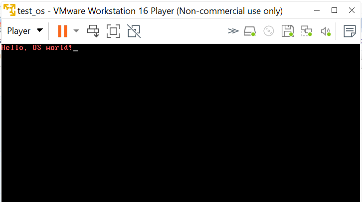
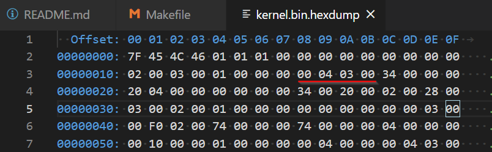
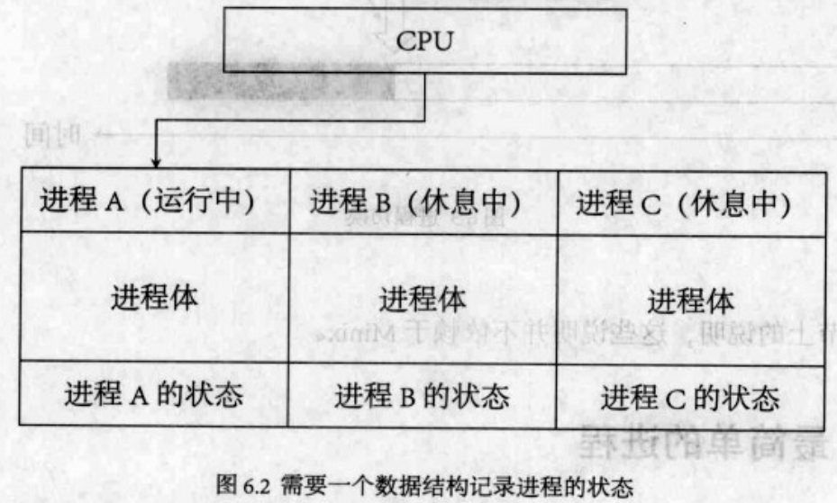
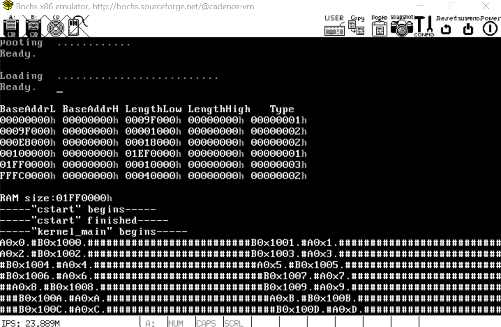

# 于渊《ORANGE'S 一个操作系统的实现》读书笔记
# 第1章 环境准备
通过这一章，搭建此文的工作环境，目的是：
* 在VMware的Ubuntu20上，基于Debug Mode的Bochs(2.6.11)，跑起来本书的第一个hello world演示程序。

## 软件版本：
* Ubuntu 20.04.1 LTS on VMware
* Bochs x86 Emulator 2.6.11

## 配置步骤
假设已经安装好Ubuntu20，下面开始编译安装Bochs(2.6.11)。
### 编译安装Bochs
* 下载[bochs-2.6.11.tar.gz](https://sourceforge.net/projects/bochs/files/bochs/)
* 解压并进入主目录: `cd ./bochs-2.6.11`
* 配置工程，开启调试功能：`./configure --enable-debugger --enable-disasm`
* 编译：`make`
   * 如果出现以下错误：`x.cc:37:10: fatal error: X11/Xlib.h: No such file or directory`
   * 安装libx11-dev: `sudo apt-get install libx11-dev`
   * 重新编译：`make dist-clean`, `./configure --enable-debugger --enable-disasm`, `make`
* 安装：`sudo make install`
* 退出"bochs-2.6.11"目录，启动bochs: `cd ~`, `bochs`
   * 出现bochs菜单选项
   
* 选择“6. Begin simulation”，输入"c"继续，由于没有指定启动方式，会出现下图：<br>

* Continue后，得到下图：<br>


### 启动第一个image
* 准备好image文件"a.img"和bochs配置文件“bochsrc”
   * 文件的准备过程可参考后面的下一章节，这里直接拷贝到[hello_img](./code/hello_img)
* 以配置文件[bochsrc](./code/hello_img/bochsrc)启动bochs：`cd ./code/hello_img`，`bochs -f ./bochsrc`
   * 出现某些文件找不到的错误，请更新配置文件[bochsrc](./code/hello_img/bochsrc)
* 选择“6. Begin simulation”，输入"c"继续后，出现"Hello, OS world!"界面：<br>

   * 如果出现错误：`>>PANIC<< bochs: cannot connect to X server`，请选择支持"X server"的终端，如：“MobaXterm”，或者直接登录ubuntu的图形界面操作

### 通过VMware启动镜像
* 利用VMware创建一个系统，系统类型选择other，并添加软驱floppy，软驱镜像选择上面生成的a.img，配置如下：

* 启动后出现期望界面<br>


### 通过Qemu启动镜像
* 安装Qemu：`sudo apt update && sudo apt-get install qemu-system`
* 启动镜像：`qemu-system-i386 -fda ./a.img`
   * "-fda file"的意思是：“use 'file' as floppy disk 0/1 image”
* 出现期望的启动界面<br>


# 第2章 马上动手写一个最小的“操作系统”
## NASM语法
* 方括号[]的使用
   * 在NASM中，任何不被方括号[]括起来的标签或变量名都被认为是地址，例如：
      ```asm
      foo: dw 1   ; 等价于：foo dw 1
      move ax, foo
      move bx, [foo]
      ```
      * `move ax, foo`是把foo的地址传给ax
      * `move bx, [foo]`是把bx的值赋值为foo的值1
* 关于`$`和`$$`
   * `$`表示当前行被汇编后的地址
   * `$$`表示一个节(section)的开始地址，例子[boot.asm](./code/hello_boot/boot.asm)只有一个节，所以值是0x7c00。
      * `times 510-($-$$) db 0`表示将0这个字节重复510-($-$$)遍，也就是将剩下的空间一直填0，直到510字节。

## 生成hello镜像
所有命令都在[Makefile](./code/hello_boot/Makefile)中:
* `make bin`: 汇编[boot.asm](./code/hello_boot/boot.asm)，生成二进制文件"boot.bin"
   * 打开二进制文件"boot.bin"，总共512(0 ~ 0x1ff)字节，最后两个字节内容是“55 AA”，其他内容是：<br>
   
* `make dis`：反汇编二进制文件“boot.bin”
   ```bash
   # https://stackoverflow.com/questions/14530461/first-os-a-few-assembly-line-explanations
   # nasm boot.asm -o boot.bin
   # ndisasm -o 0x7c00 boot.bin, 起始地址是0x7c00: "org 07c00h"
   00007C00  8CC8              mov ax,cs
   00007C02  8ED8              mov ds,ax
   00007C04  8EC0              mov es,ax
   00007C06  E80200            call 0x7c0b         # 0x7c0b是DispStr的地址
   00007C09  EBFE              jmp short 0x7c09
   00007C0B  B81E7C            mov ax,0x7c1e       # 0x7c1e是字符串“Hello, OS world!”的起始地址
   00007C0E  89C5              mov bp,ax           # ES:BP -> string to write
   00007C10  B91000            mov cx,0x10         # CX = number of characters in string，设置字符串长度0x10
   00007C13  B80113            mov ax,0x1301       # AH = 0x13 表示写字符串，AL = 0x01 表示写模式1
   00007C16  BB0C00            mov bx,0xc          # BH = 0x00 表示page number, BL = 0x0c 表示字符串颜色
   00007C19  B200              mov dl,0x0          # DH,DL = row,column at which to start writing.
   00007C1B  CD10              int 0x10            # http://www.ctyme.com/intr/int-10.htm
   00007C1D  C3                ret
   00007C1E  48                dec ax              # H的ASCII码：0x48
   00007C1F  656C              gs insb             # el
   00007C21  6C                insb                # l
   00007C22  6F                outsw               # o
   00007C23  2C20              sub al,0x20         # , 
   00007C25  4F                dec di              # O
   00007C26  53                push bx             # S
   00007C27  20776F            and [bx+0x6f],dh    #  wo
   00007C2A  726C              jc 0x7c98           # rl
   00007C2C  642100            and [fs:bx+si],ax   # d!
   00007C2F  0000              add [bx+si],al
   ...
   00007DFD  0055AA            add [di-0x56],dl
   ```
* `make img`：生成镜像文件“a.img”
   * “a.img”和“boot.bin”的内容是一样的
* `make bochs`：bochs启动hello界面
* `make qemu`：qemu启动hello界面

## 用Bochs调试操作系统
* Bochs官方调试手册：http://bochs.sourceforge.net/doc/docbook/user/internal-debugger.html
* 常用命令
   * 断点：`b 0x7c00`
   * 继续执行：`c`
   * 查看CPU信息：`info cpu`
   * 查看寄存器：`r`
   * 查看后面Memory的内容(以byte方式，十六进制形式，打印后面30个bytes的memory)：`x /30bx`
   * 单步运行：`s`
   * 开启寄存器跟踪：`trace-reg on`
* Bochs调试命令表:<br>


### Bochs调试例子
* `r`<br>

* `x /30bx 0x7c00`<br>

   * 可以发现上图的内容和[a.img](./code/hello_img/a.img)是一致的
* `trace-reg on`<br>


# 第3章 保护模式(Protect Mode)

## 认识保护模式

### GDT(Global Descriptor Table)


GDT的作用是用来提供段式存储机制，这种机制式通过段寄存器和GDT中的描述符共同提供的。上图是代码段和数据段的描述符格式，此外还有系统段描述符和门描述符。

### 如何将cs、ds等段寄存器和GDT中的描述符对应起来？


简单来说，是通过“选择子Selector”将两者联系起来的。选择子的结构如上如，TI和RPL都为零时，选择子就变成了对应描述符想读与GDT基址的偏移(一个描述符8字节)，如同下面例子中的`LABEL_DESC_VIDEO	- LABEL_GDT`。
```nasm
SelectorVideo		equ	LABEL_DESC_VIDEO	- LABEL_GDT
mov	ax, SelectorVideo
mov	gs, ax
```

### 如何将逻辑地址(段：偏移)转化成线性地址？


### 如何从实模式到保护模式？
参见代码[“pmtest1”](./code/protect_mode/base/pmtest1.asm)，过程如下：
* 准备好GDT
* 通过指令`lgdt`配置GDTR寄存器，其结构如下：<br>
   
   * 打开地址线A20
   ```nasm
   ; 打开地址线A20
   in	al, 92h
   or	al, 00000010b
   out	92h, a
   ```
* 配置CR0寄存器使能保护位<br>
   
   ```nasm
   ; 准备切换到保护模式
   mov	eax, cr0
   or	eax, 1
   mov	cr0, ea
   ```
* 把代码段的选择子装入cs段寄存器
   ```nasm
   ; 真正进入保护模式
   jmp	dword SelectorCode32:0	; 执行这一句会把 SelectorCode32 装入 cs,
                                 ; 并跳转到 Code32Selector:0  
   ```

### 描述符的属性有哪些位组成？
* P位
   * 表示在段内是否存在
* DPL位
   * 表示特权级，Descriptor Privilege Level
* S位
   * 1：数据段/代码段描述符
   * 0：系统段/门描述符
* TYPE位<br>
   
   
   * 上图中“依从”就是“一致”
* G位
   * 0：段界限粒度为字节
   * 1：段界限粒度为4KB
* D/B位
   * 可执行代码段描述符
      * 1：指令使用32位地址及32位或8位操作数
      * 0：指令使用16位地址及16位或8位操作数
   * 向下扩展数据段描述符
      * 1：段的上部界限位4GB
      * 0：段的上部界限为64KB
   * 堆栈段
      * 1：使用32位堆栈指针寄存器esp
      * 0：使用16位堆栈指针寄存器sp

### 什么是一致码段Conforming Code Segment？
向特权级更高的代码段转移：
* 一致代码段
   * 当前的特权级会被延续
   * 不访问受保护的资源的系统代码和某些类型的异常处理(比如，除法错误或溢出错误)，可以被放在一致代码段中
* 非一致代码段
   * 会引起常规保护错误(general-protection exception, #GP)，除非使用调用门或者任务门
   * 为避免低特权级的程序访问而被保护起来的系统代码应放到非一致代码段中

无论是不是一致代码段，都不能通过call或者jmp，向特权级低的代码段转移，尝试这样的转移将会导致常规保护错误。

所有数据段都是非一致的，这意味着不可能被低特权级的代码访问到。然而，与代码段不同，数据段可以被更高特权级的代码访问到，而不需要使用特定的门。


### 如何在保护模式下访问超过1MB地址空间，并退回到实模式？
参见代码[“pmtest”](./code/protect_mode/enhance/pmtest.asm)，其主要功能是：
* 从实模式进入保护模式
* 在保护模式下从0x0500000线性地址位置读写8字节
* 从保护模式返回实模式

与上节[代码](./code/protect_mode/dos/pmtest1.asm)不同之处在于，此程序在dos下可正常退出，运行结果如下：


### LDT(Local Descriptor Table)
LDT和GDT区别仅仅在于全局和局部的不同，参加代码["pmtest"](./code/protect_mode/ldt/pmtest.asm)。LDT选择子比GDT选择子多出了一个属性`SA_TIL`，其值是4，对应选择子TI位。如果此位被置位，系统会从LDT中寻找描述符，而不是从GDT中寻找描述符。
```nasm
; LDT 选择子
SelectorLDTCodeA	equ	LABEL_LDT_DESC_CODEA	- LABEL_LDT + SA_TIL
```
创建LDT需要以下额外几个步骤：
* GDT中需要加入LDT的描述符
* 需要用`lldt`指令加载ldtr
   * `lldt`的操作数是GDT中用来描述LDT的描述符
* LDT选择子的TI位要置1
   * 系统发现选择子中的TI位被置位，会从ldtr指向的LDT中寻找对应的描述符

代码执行结果如下，LDT的代码段只是打印一个字符"L":


## 特权级概述


CPL(Current Privilege Level)
* 存在于cs和ss的第0位和第1位
* 当程序转移到不同特权级的代码时，处理器将改变CPL，一致代码除外

DPL(Descriptor Privilege Level)
* 存在于段或门的描述符中
* DPL将会和CPL以及段或门选择子的RPL相比较，不同类型描述符中的DPL意义不同
   * 数据段：DPL规定了可以访问此段的最低特权级。比如，一个数据段的DPL是1，那么只有运行在CPL为0或者1的程序才有权访问它。
   * 非一致代码段(不使用调用门的情况下)：DPL规定访问此段的特权级。比如，一个非一致代码段的特权级为0，那么只有CPL为0的程序才可以访问它。
   * 调用门：DPL规定了当前执行的程序或任务可以访问此调用门的最低特权级(这与数据段的规则是一致的)。
   * 一致代码段和通过调用门访问的非一致代码段：DPL规定了访问此段的最高特权级。比如，一个一致代码段的DPL是2，那么CPL为0和1的程序将无法访问此段。
   * TSS：DPL规定了可以访问此TSS的最低特权级(这与数据段的规则是一致的)。

RPL(Requested Privilege Level)
* 存在于选择子的第0位和第1位
* 从RPL和CPL中选取特权级低的值起作用
* RPL用来避免低特权级应用程序访问高特权级段内的数据

### 不同特权级代码段之间的转移
程序从一个代码段转移到另一个代码段之前，目标代码段的选择子会被加载到cs中。作为加载过程的一部分，处理器将会检查描述符的界限、类型、特权级等内容。如果检验成功，cs将被加载，程序控制将转移到新的代码段中，从eip指示的位置开始执行。

程序控制转移的发生，可由指令`jmp, call, ret, sysenter, sysexit, int n, iret`引起。使用jmp或call指令可以实现以下几种转移：
* 直接转移
   * 目标操作数包含目标代码段的段选择子
* 间接转移
   * 目标操作数指向一个包含目标代码段选择子的调用门描述符
   * 目标操作数指向一个包含目标代码段选择子的TSS
   * 目标操作数指向一个任务门，这个任务门指向一个包含目标代码段选择子的TSS

### 如何在不同的特权级之间转移？
通过jmp或call的直接转移，
* 对于非一致代码，只能在相同特权级代码之间转移
* 对于一致代码，只能从低特权级到高特权级，且CPL不会改变

如果想自由地进行不同特权级之间转移，需要运用门描述符或者TSS。不同于代码段或数据段的描述符，门描述符的结构如下：<br>

* 上图中S位是0，代表是门描述符或者系统描述符

一个门描述符由一个选择子和一个偏移所指定的线性地址，程序正是通过这个地址进行转移的。门描述符分别为4种：
* 调用门(Call gates)
* 中断门(Interrupt gates)
* 陷阱门(Trap gates)
* 任务门(Task gates)

代码[call_gate](./code/protect_mode/call_gate/pmtest.asm)中，在GDT中创建了一个调用门描述符，虽然没有特权级的转移，但是阐释了如果通过调用门描述符，转移到目标代码段。
* 在GDT中创建一个调用门描述符
   ```nasm
   LABEL_CALL_GATE_TEST: Gate SelectorCodeDest,   0,     0, DA_386CGate+DA_DPL0
   ```
* 调用门对应的选择子
   ```nasm
   SelectorCallGateTest	equ	LABEL_CALL_GATE_TEST	- LABEL_GDT
   ```
* 通过调用门描述符转移代码
   ```nasm
   ; 测试调用门（无特权级变换），将打印字母 'C'
   call	SelectorCallGateTest:0
   ```

假设我们想由代码A转移到代码B，涉及到：CPL、RPL、代码B的DPL(记做DPL_B)、调用门G的DPL(记做DPL_G)。A访问G这个调用门时，规则相当于访问一个数据段，要求CPL和RPL都小于或者等于DPL_G，总结规则如下：<br>

* 通过调用门和call指令，可以实现从低特权级到高特权级的转移，无论目标代码段时一致的还是非一致的。

## 短调用和长调用中，调用时和返回时的堆栈是如何的？
* 短调用调用时的堆栈<br>
   
* 短调用返回时的堆栈<br>
   
* 长调用调用时的堆栈<br>
   
* 长调用返回时的堆栈<br>
   

## 当特权级发生变化时，堆栈是如何变化的？
当特权级别变化的时候，堆栈也要发生变化。处理器的这种机制避免了高特权级的过程由于栈空间不足而崩溃。而且，如果不同特权级共享同一个堆栈的话，高特权级的程序可能因此受到有意或无意的干扰。

当发生特权级变化，我们在堆栈A中压入参数和返回时地址，等到需要使用它们的时候堆栈已经变成B了，这该怎么办？Intel提供了这样的一种机制，将堆栈A的诸多内容复制到堆栈B中，如下图。


当发生从低特权级到高特权级转移，处理器从TSS(Task-State Stack)数据结构中获得其余堆栈的ss和esp。并且只有从低特权级到高特权级切换时，新堆栈才会从TS中取得，所以TSS中没有最外层的ring3的堆栈信息。

从低特权级到高特权级转移的过程如下：
* 根据目标代码段的DPL从TSS中选择应该切换至哪个ss和esp
* 从TSS中读取新的ss和esp
* 暂时性地保存当前ss和esp的值
* 加载新的ss和esp
* 将刚刚保存起来的ss和esp的值压入新栈
* 从调用者堆栈中将参数复制到被调用者堆栈(新堆栈)中，复制参数的数目由调用门中Param Count一项来决定。如果Param Count是零的话，将不会复制参数
* 将当前的cs和eip压栈
* 加载调用门中指定的新的cs和eip，开始指向被调用者过程

## 如何从高特权级转移到低特权级？
通过调用门，`call`和`jmp`指令可以实现从低特权级到高特权级的转移，那如何从高特权级转移到低特权级呢？答案是，可以通过`ret`指令。`ret`指令执行前，准备好目标代码段的cs、eip，以及ss和esp，如下图所示：<br>


代码[“ret”](./code/protect_mode/ret/pmtest.asm)通过以下代码，在进入保护模式显示字符“In Protect Mode now.”之后，直接从ring0转移到ring3。
```nasm
push	SelectorStack3
push	TopOfStack3
push	SelectorCodeRing3
push	0
retf
```

执行结果如下：<br>


## 如何从低特权级转移到高特权级？
调用门和call指令可以使代码从低特权级转移到高特权级，但是由于转移时需要从TSS中获取新的ss和esp，需要通过`ltr`指令加载一个准备好的TSS基地址和大小：
```nasm
mov	ax, SelectorTSS
ltr	ax
```

TSS的结构如下：<br>


参加代码[TSS](./code/protect_mode/tss/pmtest.asm)，运行结果如下：


从上图中发现，不仅用ring3代码显示了“3”，还通过调用门显示了“C”，代码如下。此程序实现了两次从高特权级到低特权级(retf指令和call调用门)，以及一次从低特权级到高特权级的转移(call调用门)。
```nasm
LABEL_CODE_RING3:
mov	ax, SelectorVideo
mov	gs, ax
mov	edi, (80 * 14 + 0) * 2
mov	ah, 0Ch
mov	al, '3'
mov	[gs:edi], ax

call	SelectorCallGateTest:0

jmp	$
```

## 保护模式总结
代码["final"](./code/protect_mode/final/pmtest.asm)，完成了以下几个过程：
* 构建GDT
   * 其中包括各种描述符：数据描述符、代码描述符、堆栈描述符、LDT描述符、门描述符，TSS描述符等
* 构建LDT
   * 其中的描述符和GDT结构是一样的
* 进入16位实模式
   * 配置正确的段基址到GDT和LDT中，此时就需要创建个描述符对应的代码或数据
   * 通过`lgdt`指令加载GDT
* 进入32位保护模式
   * 显示字符串“In Protect Mode now. ^-^”
   * 通过`ltr`指令加载TSS
   * 通过`retf`指令，从高特权转移到低特权
      * 打印字符“3”
      * 通过调用门，从低特权转移到高特权：`call	SelectorCallGateTest:0`
         * 打印字符“C”
         * 通过`lldt`指令加载LDT
         * 跳入同特权级的局部代码：`jmp	SelectorLDTCodeA:0`
            * 打印字符“L”
            * 跳入同特权级的代码：`jmp	SelectorCode16:0`
               * 关闭保护模式
* 进入16位实模式
   * 正常结束退出


## 页式存储

### 分页机制是如何将线性地址转换成物理地址的？

在未开启分页时，线性地址等于物理地址。开启分页后，线性地址需要通过分页机制转换成物理地址，其过程如下：


上图中，页目录大小为4KB，每个表项简称PDE(Page Directory Entry)，每个表项4字节，共有1024各表项。每个页目录的表项PDE对应一个页表，页表的表项简称PTE(Page Table Entry)，共有1024各表项，因此一个页表也是4KB大小。每个页表的表项对应一个物理页，一个物理页的大小也是4KB。

下图是PDE和PTE的结构：


* P位
   * 0：表示页不在内存中，访问将会产生页异常(page-fault exception)
   * 1: 表示存在
* R/W位
   * 0：表示只读
   * 1：表示可读可写
* U/S位
   * 0：表示系统级别
   * 1：表示用户级别

代码[page](./code/page/init/pmtest.asm)的页目录和页表分布如下：<br>


我们用4MB的空间来存放页表(1024张页表 * 4KB大小)，它映射了4GB的内存空间。建立页目录和页表的过程如下：
* 初始化一个4KB的页目录，一共1024各表项，每个表项填入页表的地址
* 初始化1024个页表，每个页表里有1024个表项，每个表项填入物理地址的地址
* 将页目录地址填入CR3寄存器
* 使能CR0寄存器

### 如何动态获取内存大小进行分页？
代码[monitor](./code/page/monitor/pmtest.asm)利用了BIOS中断`int 15h`，在实模式下对内存进程了检测。得到了内存大小后，根据内存大小创建大小合适的页表，以防止过大的页表造成内存空间浪费。


### 如何利用分页机制实现线性地址到不同物理地址的转换？
前面的例子虽然创建了页目录和页表，但是线性地址和物理地址都是一样的。分页机制最大的作用是对内存的抽象，用户不需要关心程序运行时的实际物理内存，只需要对线性内存进行操作。因此，下面的代码[switch](./code/page/switch/pmtest.asm)，实现了同一线性地址根据不同的页表，转换成不同的物理地址。


上图中，`Foo`和`Bar`都是通过调用`call	SelectorFlatC:ProcPagingDemo`打印的，中间做了一次页目录切换：
```nasm
call	SelectorFlatC:ProcPagingDemo
call	PSwitch			; 切换页目录，改变地址映射关系
call	SelectorFlatC:ProcPagingDemo
```

页目录切换前，线性地址和物理地址映射关系如下：<br>


页目录切换后，线性地址和物理地址映射关系如下：<br>


## 中断和异常
实模式下的中断向量表，在保护模式下变成了中断描述符表IDT(Interrupt Descriptor Table)。IDT中的描述符可以是下面三种之一：
* 中断门描述符
* 陷阱门描述符
* 任务门描述符

IDT的作用是将每一个中断向量和一共描述符对应起来。下图显示了中断向量到中断处理程序的对应过程：<br>


中断门和陷阱门的作用机理和调用门几乎一样，指示调用门使用`call`指令，而这里使用`int`指令。下图中，中断门和陷阱门的低5位变成了保留位，而不再是`Param Count`。TYPE也变成了0xE(中断门)或0xF(陷阱门)。


### 保护模式下的中断和异常有哪些？

中断分三类：
* 非屏蔽的外部中断
   * 一般是严重的错误，如电源异常等
* 可屏蔽的外部中断
   * 如IO中断
* `int n`指令产生的中断
   * 称为软中断，也称为同步中断

异常有三种类型：
* Fault
   * 处理程序返回时，指向产生fault的指令，而不是后面的指令
* Trap
   * 处理程序返回的时产生trap指令的后面那条指令
* Abort
   * 不允许程序或任务继续执行

### 如何实现软中断？
代码["soft"](./code/int/soft/pmtest.asm)实现了一个软中断“0x80”，通过中断门在屏幕上打印一个"I"字符，过程如下：
* 创建IDT
   * 加入中断门描述符，表中的0x80位置需要指向中断处理程序
* 用`lidt`指令加载IDT到处理器中断IDTR寄存器
* 用`int 80h`触发软中断

### 如何在保护模式下配置外部中断？


通过给8259A相应端口写入特定的ICW(Initialization Command Word)，可编程中断控制器。初始化过程如下：
* 往端口20h(主片)或A0h(从片)写入ICW1
* 往端口21h(主片)或A1h(从片)写入ICW2
* 往端口21h(主片)或A1h(从片)写入ICW3
* 往端口21h(主片)或A1h(从片)写入ICW4

ICW的格式如下：<br>


通过ICW2，可配置IRQ0~IRQ7对应的中断向量20h~27h；类似地，IRQ8~IRQ15对应中断向量28h~2Fh.再通过OCW完成：
* 屏幕或打开外部中断
* 发送EOI给8259A以通知它中断处理结束


### 如何实现外部时钟中断？
代码["extern_int"](./code/int/extern/pmtest.asm)实现了外部时钟中断，10ms产生一个中断，改变屏幕上显示的字符，其过程如下：
* 创建IDT
   * 加入中断门描述符，其中硬件中断和软件中断对应不同的处理函数
* 配置8259A中断控制器
   * 通过ICW1/2/3，给每个IRQ端口配置了对应的中断向量
   * 通过OCW1，打开中断屏蔽寄存器IMR中断相关中断
* 时钟中断的处理程序
   * 通过OCW2发送EOI给8259A以通知它中断处理结束
   * 通过`iretd`指令返回
* 通过`cli`指令清IF位，暂时不响应可屏蔽中断
* 用`lidt`指令加载IDT到处理器中断IDTR寄存器
* 用`int 80h`触发软中断
* 通过`sti`指令设置IF位，打开中断，然后循环等待时钟中断发生
* 每10ms，都会进入时钟中断处理函数，处理完后通过发送EOI给8259A以通知它中断处理结束，并返回会主程序

### 中断或异常发生时的堆栈变化


出错码(Error Code)只会在特定的中断号中出现。中断或异常返回时必须使用指令`iretd`，它同时会改变eflags的值。只有当CPL为0时，eflags中的IOPL域才会改变，而且只有当CPL<=IOPL时，IF才会被改变。

### 中断门和陷阱门的区别
中断允许标志IF的影响。由中断向量引起的中断会复位IF，因为可以比卖你其他中断干扰当前中断的处理。随后的`iret`指令会从堆栈上恢复IF的原值；而陷阱门产生的中断不会改变IF。

## 保护模式下的I/O
用户进程通过IOPL和I/O许可位图，可控制I/O操作。IOPL位于寄存器eflags的第12、13位，如下图：<br>


指令in、ins、out、outs、cli、sti只有在CPL<=IOPL时才能执行。这些指令被称为I/O敏感指令(I/O Sensitive Instructions)。可以改变IOPL的指令只有`popf`和`iretd`，但只有运行在ring0的程序才能将其改变。

TSS偏移102字节处有一共被称做"I/O位图基址"的东西，它是一个以TSS的地址位基址的偏移，指向的便是I/O许可位图。每一位表示一个字节的端口地址是否可用。如果某一位是0，则表示此位对应的端口号可用，1则不可用。如果I/O位图基址大于或等于TSS段界限，就表示没有I/O许可位图，如果此时CPL<=IOPL，则所有I/O指令都会引起异常。I/O许可位图的使用使得即使在同一特权级下不同的任务也可以有不同的I/O访问权限。

# 让操作系统走进保护模式

## 如何通过引导扇区加载一个文件到内存？
由于引导扇区最多512字节，我们需要一个方法，能加载更大的文件到内存，并将权限交给它，从而可以运行更大的程序。因此，引导程序需要有方法从磁盘或软盘中读取文件。我们以软盘为例子，引导程序需要解决一个重要问题：
* 如何解析软盘文件结构，加载所需文件？

### FAT12文件系统
FAT12把磁盘划分为三个层次：
* 扇区(Sector)：磁盘上的最小数据单元
* 簇(Cluster)：一个或多个扇区
* 分区(Partition)：通常指整个文件系统

1.44MB软盘的扇区排布如下：<br>

* 引导扇区
   * 其格式如下：<br>
   
* FAT1表和FAT2表
   * FAT2可看作是FAT1的备份
   * FAT表的目的：用于定位文件(占多簇)位置
* 根目录信息
   * 19号扇区开始，由32字节目录条目(Directory Entry)组成
   * 目录条目最大值由引导扇区中`BPB_RootEntCnt`指定<br>
   

代码["empty_floppy"](./code/load/empty_floppy/boot.asm)根据FAT12引导扇区的格式，初始化引导软盘。这样的软盘可以被操作系统(如，ubuntu)驱动读取，由于只初始化了引导扇区，所以软盘里面的内容是空的，如下：<br>


### 读取软盘上的文件
在实模式下，BIOS提供了中断`int 13h`，可读取软盘指定位置的内容，用法如下：<br>


因此，通过BIOS中断`int 13h`，并结合FAT12文件系统的格式，将软盘上的文件，加载到内存指定位置。最终跳转的加载的位置，并执行。代码[“load”](./code/load/prog/boot.asm)阐释了此过程。


# 内核雏形

## 在Linux下用汇编写Hello World
参见代码[“hello_linux”](./code/hello_linux/hello.asm)

## 汇编和C同步使用
代码["c_asm"](./code/c_asm)阐释了汇编语言和C语言相互调用的过程，汇编通过`global`导出函数。
* 汇编代码调用C函数
   ```nasm
   push	dword [num2nd]	;
   push	dword [num1st]	;
   call	choose			; 调用C函数 choose(num1st, num2nd);
   add	esp, 8			; pop出栈上的num2nd和num1st，调用者需要负责出栈
   ```

## ELF (Executable and Linkable Format)


ELF文件由4部分组成：
* ELF头(ELF header)
   * 描述了ELF文件类型，入口函数，其他各部分的排布等信息
* 程序头表(Program header table)
   * 描述了系统准备程序运行所需的一个段在文件中的位置、大小以及它被放进内存后所在的位置和大小
* 节(Sections)
* 节头表(Section header table)

## 如何加载并运行ELF可执行文件？
* 引导程序["boot.asm"](./code/kernel/load/boot.asm)
   * 加载["loader"](./code/kernel/load/loader.asm)程序，并跳转
   * 引导程序由于只能512KB大小，因此只负责在实模式下从软盘上读取并加载"loader"程序
* "loader"程序
   * 加载"kernel"程序，见[“loader”](./code/kernel/load/loader.asm)
   * 跳入保护模式，见[“loader”](./code/kernel/pm/loader.asm)<br>
   
   * 重新放置内核，见["loader"](./code/kernel/elf/loader.asm)
      * 通过ld的选项`-Ttext 0x30400`修改内核入口地址为0x30400<br>
      
      * 利用类C语言`memcpy(p_vaddr, BaseOfLoaderPhyAddr + p_offset, p_filesz)`的方法，将各段拷贝到指定内存位置，可见代码中的`InitKernel`函数
   * 向内核交出控制权
      * `jmp	SelectorFlatC:KernelEntryPointPhyAddr`
      * KernelEntryPointPhyAddr值为0x30400，与编译时指定的地址一致
      * 最终由kernel代码在屏幕上打印出“K”<br>
      

## 刚进入内核时，内存和寄存器是如何的？
```
              ┃                                    ┃
              ┃                 .                  ┃
              ┃                 .                  ┃
              ┃                 .                  ┃
              ┣━━━━━━━━━━━━━━━━━━━━━━━━━━━━━━━━━━━━┫
              ┃■■■■■■■■■■■■■■■■■■■■■■■■■■■■■■■■■■■■┃
              ┃■■■■■■Page  Tables■■■■■■■■■■■■■■■■■■┃
              ┃■■■■■(大小由LOADER决定)■■■■■■■■■■■■■■┃
    00101000h ┃■■■■■■■■■■■■■■■■■■■■■■■■■■■■■■■■■■■■┃ PageTblBase
              ┣━━━━━━━━━━━━━━━━━━━━━━━━━━━━━━━━━━━━┫
              ┃■■■■■■■■■■■■■■■■■■■■■■■■■■■■■■■■■■■■┃
    00100000h ┃■■■■Page Directory Table■■■■■■■■■■■■┃ PageDirBase  <- 1M
              ┣━━━━━━━━━━━━━━━━━━━━━━━━━━━━━━━━━━━━┫
              ┃□□□□□□□□□□□□□□□□□□□□□□□□□□□□□□□□□□□□┃
       F0000h ┃□□□□□□□System ROM□□□□□□□□□□□□□□□□□□□┃
              ┣━━━━━━━━━━━━━━━━━━━━━━━━━━━━━━━━━━━━┫
              ┃□□□□□□□□□□□□□□□□□□□□□□□□□□□□□□□□□□□□┃
       E0000h ┃□□□□Expansion of system ROM □□□□□□□□┃
              ┣━━━━━━━━━━━━━━━━━━━━━━━━━━━━━━━━━━━━┫
              ┃□□□□□□□□□□□□□□□□□□□□□□□□□□□□□□□□□□□□┃
       C0000h ┃□□□Reserved for ROM expansion□□□□□□□┃
              ┣━━━━━━━━━━━━━━━━━━━━━━━━━━━━━━━━━━━━┫
              ┃□□□□□□□□□□□□□□□□□□□□□□□□□□□□□□□□□□□□┃ B8000h ← gs
       A0000h ┃□□□Display adapter reserved□□□□□□□□□┃
              ┣━━━━━━━━━━━━━━━━━━━━━━━━━━━━━━━━━━━━┫
              ┃□□□□□□□□□□□□□□□□□□□□□□□□□□□□□□□□□□□□┃
       9FC00h ┃□□extended BIOS data area (EBDA)□□□□┃
              ┣━━━━━━━━━━━━━━━━━━━━━━━━━━━━━━━━━━━━┫
              ┃■■■■■■■■■■■■■■■■■■■■■■■■■■■■■■■■■■■■┃
       90000h ┃■■■■■■■LOADER.BIN■■■■■■■■■■■■■■■■■■■┃ somewhere in LOADER ← esp
              ┣━━━━━━━━━━━━━━━━━━━━━━━━━━━━━━━━━━━━┫
              ┃■■■■■■■■■■■■■■■■■■■■■■■■■■■■■■■■■■■■┃
       80000h ┃■■■■■■■KERNEL.BIN■■■■■■■■■■■■■■■■■■■┃
              ┣━━━━━━━━━━━━━━━━━━━━━━━━━━━━━━━━━━━━┫
              ┃■■■■■■■■■■■■■■■■■■■■■■■■■■■■■■■■■■■■┃
       30000h ┃■■■■■■■■KERNEL■■■■■■■■■■■■■■■■■■■■■■┃ 30400h ← KERNEL 入口 (KernelEntryPointPhyAddr)
              ┣━━━━━━━━━━━━━━━━━━━━━━━━━━━━━━━━━━━━┫
              ┃                                    ┃
        7E00h ┃              F  R  E  E            ┃
              ┣━━━━━━━━━━━━━━━━━━━━━━━━━━━━━━━━━━━━┫
              ┃■■■■■■■■■■■■■■■■■■■■■■■■■■■■■■■■■■■■┃
        7C00h ┃■■■■■■BOOT  SECTOR■■■■■■■■■■■■■■■■■■┃
              ┣━━━━━━━━━━━━━━━━━━━━━━━━━━━━━━━━━━━━┫
              ┃                                    ┃
         500h ┃              F  R  E  E            ┃
              ┣━━━━━━━━━━━━━━━━━━━━━━━━━━━━━━━━━━━━┫
              ┃□□□□□□□□□□□□□□□□□□□□□□□□□□□□□□□□□□□□┃
         400h ┃□□□□ROM BIOS parameter area □□□□□□□□┃
              ┣━━━━━━━━━━━━━━━━━━━━━━━━━━━━━━━━━━━━┫
              ┃◇◇◇◇◇◇◇◇◇◇◇◇◇◇◇◇◇◇◇◇◇◇◇◇┃
           0h ┃◇◇◇◇◇◇Int  Vectors◇◇◇◇◇◇◇◇◇◇┃
              ┗━━━━━━━━━━━━━━━━━━━━━━━━━━━━━━━━━━━━┛ ← cs, ds, es, fs, ss
```

## 扩充内核
目的：将esp和GDT等内容从Loader放进内核中。

代码["enhance_kernel"](./code/kernel/enhance)，完成了下面几件事情：
* ["boot.asm"](./code/kernel/enhance/boot.asm)，用于引导系统，加载"loader"程序
* ["loader.asm"](./code/kernel/enhance/loader.asm)，用于加载ELF格式的"kernel"到指定地址
   * `InitKernel`函数通过解析ELF格式的kernel，将指定段加载到指定地址(在ELF文件中存在地址信息)
   * `InitKernel`函数结束后，入口函数的地址已经确定，直接跳转过去即可
* ["kernel.asm"](./code/kernel/enhance/kernel.asm)，将权限转交给C代码

代码整理后，可参见["enhance_kernel_sort"](./code/kernel/enhance_sort)，其中修改了`disp_str`函数的一个Bug。

## 内部软件异常
目的：建立中断描述符表IDT，当发生异常时(如：非法指令)，能进入指定的异常处理函数进程处理。

代码["int_internal"](./code/kernel/int_internal)实现了“无效操作码”#UD异常，并在异常处理程序中打印出相关信息，其过程如下：
* 引导程序建立GDT，依据ELF格式信息加载内核各段到指定位置，最后将权限转交给内核的入口函数(编译ELF时已经指定)
* 内核的入口函数将权限交给C函数[cstart](./code/kernel/int_internal/kernel/start.c)，其如主要完成
   * 复制引导程序建立的GDT到本地内存的GDT中
   * 建立中断描述符表IDT，见["init_prot()"](./code/kernel/int_internal/kernel/protect.c)，中断向量的标号可参考前面介绍异常章节中的异常列表
* C入口函数结束后，内核汇编代码加载新的GDT和IDT到相关寄存器
* 指向无效操作码，触发异常后，在异常处理程序中，打印出如下内容：<br>


## 外部时钟中断
目的：配置外部中断，可检测键盘中断

代码["int_extern"](./code/kernel/int_extern)实现了对键盘中断的监控，当敲击键盘时，可在屏幕中打印出处理程序的信息，其过程如下：
* 引导程序将内核加载并移交权限到入口函数
* 内核入口函数需
   * 初始化中断控制器
      * [init_8259A()](./code/kernel/int_extern/kernel/i8259.c)函数配置中断向量表，并将键盘中断打开
   * 初始化中断向量表
      * ["init_prot()"](./code/kernel/int_internal/kernel/protect.c)函数不仅向中断向量表中添加了异常处理函数的中断门，还添加了外部中断的中断门(起始位：主0x20，从0x28)
* 加载完GDT和IDT后，通过`sti`指令设置IF位，等待键盘中断到来
* 键盘中断到来后，触发`spurious_irq`中断函数执行，结果如下：<br>


# 进程

## 开始准备创建进程


按时间顺序，进程切换过程如下：
* 进程A运行中
* 时钟中断发生，ring1 -> ring0，时钟中断处理程序启动
* 进程调度，下一个应允许的进程(假设为进程B)被指定
* 进程B被恢复，ring0 -> ring1
* 进程B运行中

### 进程的哪些状态需要被保存？
只有可能被改变的才有保存的必要。因为不同进程共享一个CPU的一套寄存器，所有这些寄存器的值都要保存。

### 进程的状态需要何时以及怎样被保存？
为了保证进程状态完整，不被破坏，应该再进程刚刚被挂起是保存所有寄存器的值。

### 如何恢复进程B的状态？
当恢复所有寄存器后，通过指令iretd，就回到进程B了。

### 进程表的引入
进程表(或叫进程控制块，PCB)维护了素有进程的状态，用于描述进程，独立于所有进程之外。


### 进程栈和内核栈
通过push/pop操作进程表时，需要切换esp指向的位置。因此在进程切换过程中，esp的位置出现在3个不同的区域。


* 进程栈 - 进程运行时的自身的堆栈
* 进程表 - 存储进程状态信息的数据结构
* 内核栈 - 进程调度模块运行时使用的堆栈

### 特权级变换
* ring1 -> ring0
   * 从低到高转移，通过TSS获取高特权级的ss和esp
* ring0 -> ring1
   * 从高到低转移，通过指令`iretd`和准备好的栈(包括eip、cs、eflags、esp和ss等)

## 从内核态到进程态(ring0 -> ring1)
目标：通过`iretd`指令从ring0的内核态，切换到ring1的进程态，在低权限下执行程序。

设计：下图是此程序的4个主要部分：进程表(包括了LDT)，进程体，GDT和TSS。


这四个部分的主要关系大致分为三个部分：
* 进程表和GDT。进程表内的LDT Selector对应GDT中的一个描述符，而这个描述符所指向的内存空间就存在于进程表内。
* 进程表和进程。进程表是进程的描述，进程运行过程中如果被中断，各个寄存器的值都会被保存进进程表中。
* GDT和TSS。GDT中需要有一个描述符来对应TSS，需要事先初始化这个描述符。TSS存储的是全局共享的信息，这和GDT一样，而进程表中每个条目是每个进程的私有信息。

程序["ring0_to_1"](./code/process/ring0_to_1)在初始化完成后，通过`iretd`指令从ring0转移到了ring1，并在ring1下执行了一个不断循环打印的程序，下面分部分介绍。

### 首先准备一个小的进程体
以一个不停循环打印的程序作为u进程体的功能：
```c
void TestA()
{
	int i = 0;
	while(1){
		disp_str("A");
		disp_int(i++);
		disp_str(".");
		delay(1);
	}
}
```
下面，我们要想办法如何在ring1特权级下，运行该进程体。

### 定义进程表结构
虽然此程序没有进程程序切换，而且进程表中也只有一个程序信息，但是为了后续支持进程切换，我们需要考虑设计合适的进程表结构，以保证能保存当前进程环境信息。为了保存所有寄存器的信息，以及完成高权限到低权限的转移，进程表中每一项的结构如下：<br>

* 一部分是被中断处理程序相关寄存器的值
* 另一部分是从高特权级到低特权级转移时所需的信息(低特权级转移到高特权级会从TSS中拿相关信息，而不需要从栈中获取)。

这样，当我们想要切换到低权限的进程时，就可以通过将进程表中要切换进程的内存作为栈空间，弹出相关寄存器的值，再通过`retd`指令和esp寄存器(指向合适位置)，完成切换。

除了上述寄存器需要在切换前准备，还需要加载要切换进程的LDT，因此我们可以将进程表每一项结构定义如下：
```c
typedef struct s_stackframe {
	u32	gs;		/* \                                    */
	u32	fs;		/* |                                    */
	u32	es;		/* |                                    */
	u32	ds;		/* |                                    */
	u32	edi;		/* |                                    */
	u32	esi;		/* | pushed by save()                   */
	u32	ebp;		/* |                                    */
	u32	kernel_esp;	/* <- 'popad' will ignore it            */
	u32	ebx;		/* |                                    */
	u32	edx;		/* |                                    */
	u32	ecx;		/* |                                    */
	u32	eax;		/* /                                    */
	u32	retaddr;	/* return addr for kernel.asm::save()   */
	u32	eip;		/* \                                    */
	u32	cs;		/* |                                    */
	u32	eflags;		/* | pushed by CPU during interrupt     */
	u32	esp;		/* |                                    */
	u32	ss;		/* /                                    */
}STACK_FRAME;


typedef struct s_proc {
	STACK_FRAME regs;          /* process registers saved in stack frame */

	u16 ldt_sel;               /* gdt selector giving ldt base and limit */
	DESCRIPTOR ldts[LDT_SIZE]; /* local descriptors for code and data */
	u32 pid;                   /* process id passed in from MM */
	char p_name[16];           /* name of the process */
}PROCESS;
```
因此，进程表可定义为：`PUBLIC PROCESS proc_table[NR_TASKS]`，其中`NR_TASKS`定义了最大允许进程数。

### 向GDT中添加LDT
LDT内容定义在进程表的每一项中，由每个程序私有。`s_proc`结构中的`DESCRIPTOR ldts[LDT_SIZE]`就是LDT的内容。但是，其不是一个固定地址，如何定位到每个进程的LDT呢？

通过将每个进程的LDT的描述符添加到全局的GDT中，就可以定位到相应的LDT了，并且将GDT的16位的LDT选择子保存到`s_proc`结构中的`u16 ldt_sel`。
```c
/* 填充 GDT 中进程的 LDT 的描述符 */
init_descriptor(&gdt[INDEX_LDT_FIRST],
	vir2phys(seg2phys(SELECTOR_KERNEL_DS), proc_table[0].ldts),
	LDT_SIZE * sizeof(DESCRIPTOR) - 1,
	DA_LDT);
```
### 向GDT中添加TSS
不同于LDT，TSS是全局的，因此我们需要开辟一个全局的空间，让后将它的系统描述符加入GDT中。
```c
/* 填充 GDT 中 TSS 这个描述符 */
memset(&tss, 0, sizeof(tss));
tss.ss0 = SELECTOR_KERNEL_DS;
init_descriptor(&gdt[INDEX_TSS],
		vir2phys(seg2phys(SELECTOR_KERNEL_DS), &tss),
		sizeof(tss) - 1,
		DA_386TSS);
tss.iobase = sizeof(tss); /* 没有I/O许可位图 */

// TSS Structure
typedef struct s_tss {
	u32	backlink;
	u32	esp0;	/* stack pointer to use during interrupt */
	u32	ss0;	/*   "   segment  "  "    "        "     */
	u32	esp1;
	u32	ss1;
	u32	esp2;
	u32	ss2;
	u32	cr3;
	u32	eip;
	u32	flags;
	u32	eax;
	u32	ecx;
	u32	edx;
	u32	ebx;
	u32	esp;
	u32	ebp;
	u32	esi;
	u32	edi;
	u32	es;
	u32	cs;
	u32	ss;
	u32	ds;
	u32	fs;
	u32	gs;
	u32	ldt;
	u16	trap;
	u16	iobase;	/* I/O位图基址大于或等于TSS段界限，就表示没有I/O许可位图 */
}TSS;
```
需要注意的是当发生低权限到高权限切换时，系统会自动从TSS中获取对应权限所需的栈信息`eps`和`ss`值，进行栈的切换。因此，我们需要确保，在发生低权限到高权限转移前，相对应的TSS中的高权限的`eps`和`ss`值是期望的，以便保存低权限时的相关寄存器(具体实验，后面会讲到)。

同时，需要通过`ltr`指令，将TSS的描述符加载到指定的段寄存器。类似于用`lgdt`指令加载GDT，或者用`lidt`加载IDT。
```nasm
xor	eax, eax
mov	ax, SELECTOR_TSS	;GDT中第4个选择子: 0x20/8 = 4，由protect.c::init_prot()函数添加
ltr	ax
```

### 初始化进程表
当准备好了进程体、LDT和栈空间后，我们就可以初始化进程表中的各项值了(可配置合适的特权级)：
```c
PROCESS* p_proc	= proc_table;

p_proc->ldt_sel	= SELECTOR_LDT_FIRST; // GDT中第5个选择子: 0x28/8 = 5，由protect.c::init_prot()函数添加
memcpy(&p_proc->ldts[0], &gdt[SELECTOR_KERNEL_CS>>3], sizeof(DESCRIPTOR));  // 构建LDT第一个描述符
p_proc->ldts[0].attr1 = DA_C | PRIVILEGE_TASK << 5;	// change the DPL
memcpy(&p_proc->ldts[1], &gdt[SELECTOR_KERNEL_DS>>3], sizeof(DESCRIPTOR));  // 构建LDT第二个描述符
p_proc->ldts[1].attr1 = DA_DRW | PRIVILEGE_TASK << 5;	// change the DPL

p_proc->regs.cs	= (0 & SA_RPL_MASK & SA_TI_MASK) | SA_TIL | RPL_TASK; // 指向LDT第一个描述符
p_proc->regs.ds	= (8 & SA_RPL_MASK & SA_TI_MASK) | SA_TIL | RPL_TASK; // 指向LDT第二个描述符
p_proc->regs.es	= (8 & SA_RPL_MASK & SA_TI_MASK) | SA_TIL | RPL_TASK; // 指向LDT第二个描述符
p_proc->regs.fs	= (8 & SA_RPL_MASK & SA_TI_MASK) | SA_TIL | RPL_TASK; // 指向LDT第二个描述符
p_proc->regs.ss	= (8 & SA_RPL_MASK & SA_TI_MASK) | SA_TIL | RPL_TASK; // 指向LDT第二个描述符
p_proc->regs.gs	= (SELECTOR_KERNEL_GS & SA_RPL_MASK) | RPL_TASK; // 指向GDT中的显存，RPL发生改变
p_proc->regs.eip= (u32) TestA;
p_proc->regs.esp= (u32) task_stack + STACK_SIZE_TOTAL; // global.c中定义的单独栈，栈是递减的，所以取最大地址起始
p_proc->regs.eflags = 0x1202;	// IF=1, IOPL=1, bit 2 is always 1. 这样，进程就可以使用I/O指令，并且中断会iretd执行时被打开
```

### 最后通过iretd进行转移
```asm
mov	esp, [p_proc_ready]
lldt	[esp + P_LDT_SEL] 
lea	eax, [esp + P_STACKTOP]
mov	dword [tss + TSS3_S_SP0], eax	; 配置TSS中的ESP0为当前进程的栈顶，当前进程的堆栈选择子SS0已经在初始化的时候配置好了

pop	gs
pop	fs
pop	es
pop	ds
popad

add	esp, 4

iretd
```
在通过`iretd`进行转移之前，对于要转移的进程，需要做如下的事情：
* 通过`lldt`，加载要转移进程的LDT
* 设置TSS中对应位置的ESP值，以便发生低权限到高权限转移时，能获得合适的栈空间
* 弹出要转移进程的所有寄存器的值

### 最终结果
引导程序加载完内核，将权限交给内核的入口函数后，内核
* 通过`cstart`函数
   * 创建了新的GDT，并向GDT中添加了TSS和LDT
   * 创建了IDT，并初始化了中断向量表，注册了中断处理函数
* 加载GDT, IDT, TSS到相应段寄存器
* 通过`kernel_main`函数
   * 创建了进程表，并初始化了相关内容
* 通过`iretd`指令进行了转移，但在这之前需加载LDT，并通过进程表准备环境
* 最终得到如下图的运行结果，程序在ring1特权级下不断打印字符`A0x0.A0x1....`：<br>
   

下图是各时间段，此程序的运行状态：<br>


## 进程被时钟中断切换，从ring1到ring0再回到ring1
上面的例子解释了如何从ring0转移到ring1，执行进程A的程序。现在，我们开始通过时钟中断，中断进程A的运行，从ring1到ring0。中断程序完成后，再从ring0回到ring1，重新执行进程A的程序。

### 配置时钟中断
我们需要做两件事情：
* 代开中断控制权的时钟中断
   * ["i8259.c"](./code/process/ring1_to_0/kernel/i8259.c)在配置8259时，开启了主控的时钟中断
   ```c
   out_byte(INT_M_CTLMASK,	0xFE);	// Master 8259, OCW1. 打开时钟中断
   out_byte(INT_S_CTLMASK,	0xFF);	// Slave  8259, OCW1.
   ```
* 设置EOI
   * ["kernel1.asm"](./code/process/ring1_to_0/kernel/kernel1.asm)的IRQ0时钟中断程序设置了EOI，因此中断可以不停地发生
   ```nasm
   ALIGN	16
   hwint00:		; Interrupt routine for irq 0 (the clock).
      mov	al, EOI		; `. reenable
      out	INT_M_CTL, al	; / master 8259
      iretd
   ```

### 现场的保护与恢复
在特权级发生变化时，需要对现场进行保护与恢复。下面我们介绍：
* 从ring1到ring0对进程A现场的保护
* 从ring0到ring1对进程A现场的恢复

#### ring1->ring0的保护
目的：在执行中断处理程序前，将进程A当前的所有寄存器的值保存到进程表对应的数据结构中

从ring1到ring0转移，系统会自动从TSS中获取esp0和ss0的值(具体过程，请参加前面的章节)。因此，首先我们需要知道，在发生中断之前，TSS中的tss.esp0和tss.ss0是什么值。
* ["restart"](./code/process/ring1_to_0/kernel/kernel.final.asm)函数在执行进程A之前，已经将tss.esp0设置为进程A在进程表中`STACK_FRAME`结构的尾部，作为中断程序现场保护的栈
   ```nasm
   restart:
      mov	esp, [p_proc_ready]
      lldt	[esp + P_LDT_SEL] 
      lea	eax, [esp + P_STACKTOP]       ; P_STACKTOP的值和P_LDT_SEL是一样的，代表STACK_FRAME的尾地址
      mov	dword [tss + TSS3_S_SP0], eax ; 当发生ring1->ring0的转移时，ring0的程序会得到进程表中的STACK_FRAME结构作为栈进程现场保护
   ```
* ["init_prot"](./code/process/ring1_to_0/kernel/protect.c)函数在初始化阶段，已经配置好了tss.ss0的值
   ```c
   PUBLIC void init_prot() {
      ...
      /* 填充 GDT 中 TSS 这个描述符 */
      memset(&tss, 0, sizeof(tss));
      tss.ss0		= SELECTOR_KERNEL_DS;
   }
   ```

tss.esp0和tss.ss0配置好后，发生时钟中断。通过前的章节，我们可知，有特权级变化的中断发生时，系统会自动压栈`eip`,`cs`,`eflags`, `esp`, `ss`(可能还有`ErrorCode`)到tss.esp0和tss.ss0(假设转移到ring0)指向的栈中。因此当进入中断后，esp已经指向了`s_stackframe`结构中的`retaddr`位置。

下面，我们开始保护进程A的现场:
* [中断处理函数"hwint00"](./code/process/ring1_to_0/kernel/kernel4.asm)要做的第一件事情就是将当前的所有寄存器保存到进程A在进程表中相应的数据结构中
   ```nasm
   ALIGN	16
   hwint00:		; Interrupt routine for irq 0 (the clock).
      sub	esp,4	; 减4跳过retaddr
      pushad		; `.
      push	ds	;  |
      push	es	;  | 保存原寄存器值，和s_stackframe中定义的寄存器顺序相反
      push	fs	;  |
      push	gs	; /
      mov	dx, ss
      mov	ds, dx
      mov	es, dx
      ...
   ```

#### ring0->ring1的恢复
目的：在结束中断处理程序返回进程A前，将进程A的所有寄存器的值从进程表的相关数据结构中恢复到当前所有寄存器中

由于我们现在还只有一个进程A，在中断处理程序完成后，我们需要恢复到进程A。因此在通过`iretd`命令从ring0转移到ring1之前，我们需要配置好`tss.esp0`和所有进程A相关的寄存器。下面的程序从`s_stackframe`的起始位开始出栈恢复`gs`,`fs`等寄存器，最后跳过`retaddr`，指向了进程A转移时存入的`eip`,`cs`,`eflags`,`esp`和`ss`。这和最初进入进程A时的动作是一样的。
```nasm
ALIGN	16
hwint00:		; Interrupt routine for irq 0 (the clock).
   ...
	mov	esp, [p_proc_ready]	; 离开内核栈

	lea	eax, [esp + P_STACKTOP]
	mov	dword [tss + TSS3_S_SP0], eax

	pop	gs	; `.
	pop	fs	;  |
	pop	es	;  | 恢复原寄存器值
	pop	ds	;  |
	popad		; /
	add	esp, 4   ;跳过retaddr

	iretd
```

### 加入内核栈
刚进入中断处理程序时，esp指向的是进程表。进程表只是用于保护现场，不能当作正常的栈进程操作。因此，我们需要在执行真正的中断处理程序时，切换堆栈，将esp指向另外的位置。并在结束前，切回到进程表，以进行现场恢复。
* ["hwint00"](./code/process/ring1_to_0/kernel/kernel.final.asm)展示了一个完整的中断处理程序
   ```nasm
   ALIGN	16
   hwint00:		; Interrupt routine for irq 0 (the clock).
      sub	esp, 4
      pushad		; `.
      push	ds	;  |
      push	es	;  | 保存原寄存器值
      push	fs	;  |
      push	gs	; /
      mov	dx, ss
      mov	ds, dx
      mov	es, dx
      
      mov	esp, StackTop		; 切到内核栈

      inc	byte [gs:0]		; 改变屏幕第 0 行, 第 0 列的字符

      mov	al, EOI			; `. reenable
      out	INT_M_CTL, al		; /  master 8259
      
      push	clock_int_msg
      call	disp_str
      add	esp, 4
      
      mov	esp, [p_proc_ready]	; 离开内核栈

      lea	eax, [esp + P_STACKTOP]
      mov	dword [tss + TSS3_S_SP0], eax

      pop	gs	; `.
      pop	fs	;  |
      pop	es	;  | 恢复原寄存器值
      pop	ds	;  |
      popad		; /
      add	esp, 4

      iretd
   ```

此中断处理程序，会在屏幕上打印`^`符号。加上进程A会隔段时间打印字符`A0x0...`，[ring1_to_0](./code/process/ring1_to_0)程序运行的结果如下：<br>


## 中断重入
为了在执行中断处理程序时，系统仍然可以接收其他中断(不然进程调度时按键就无法再响应了)。我们需要做两件事情：
* 通过sti指令在中断处理程序的合适位置打开中断
   * 因为CPU在响应中断的过程中会自动关闭中断，在中断结束后再自动开启中断。为了在中断执行过程中接收中断，需要人为控制中断的开关(通过`sti`指令开中断和`cli`指令关中断)
* 避免中断嵌套现象的发生
   * 如果中断发生了嵌套，可能会出现一直在此中断中，而无法执行其他代码
   * 可通过一个标志位判断一下，如果嵌套了，就直接不执行中断处理程序，直接退出

[代码](./code/process/reenter)虽然执行现象和前面的程序没有区别，但是此时在中断处理函数已经支持了，接收其他中断了。

## 多进程
在完成了上面的程序后，我们可以很容易实现两个进程切换运行。例子["multi_proc"](./code/process/mult_proc)就实现了进程A和进程B通过时钟中断处理程序不断切换，打印字符。在这个程序中，我们主要关注几件事情：进程体、进程表、GDT、TSS、LDT和进程调度。

### 进程体
* [main.c](./code/process/mult_proc/kernel/main.c)添加了一个新的进程体`TestB`
   ```c
   void TestB()
   {
      int i = 0x1000;
      while(1){
         disp_str("B");
         disp_int(i++);
         disp_str(".");
         delay(1);
      }
   }
   ```

### 进程表
[main.c](./code/process/mult_proc/kernel/main.c)通过一个`For`循环初始化各进程的在进程表中的内容。在初始化进程表时，我们借助了一个数据结构`TASK`将每个进程不同的内容(程序体，栈大小，程序名)抽取出来，以便于初始化操作。
* TASK结构体定义如下：
   ```c
   typedef struct s_task {
      task_f	initial_eip;
      int	stacksize;
      char	name[32];
   }TASK;
   ```
* 借助TASK结构体，初始化进程表的代码如下：
   ```c
   PUBLIC int kernel_main()
   {
      ...
      TASK*		p_task		= task_table;
      PROCESS*	p_proc		= proc_table;
      char*		p_task_stack	= task_stack + STACK_SIZE_TOTAL;
      u16		selector_ldt	= SELECTOR_LDT_FIRST;
      int i;
      for (i=0; i < NR_TASKS; i++) {
         ...
         p_proc->ldt_sel = selector_ldt;
         ...
         p_proc->regs.eip = (u32)p_task->initial_eip;
         p_proc->regs.esp = (u32)p_task_stack;
         ...
         p_task_stack -= p_task->stacksize;
         p_proc++;
         p_task++;
         selector_ldt += 1 << 3;
      }
      ...
   }
   ```

### LDT和GDT
在初始化进程表时，我们发现不仅`TASK`结构体里的内容每个进程不一样，每个进程的LDT选择子也是不同的。LDT的内容是每个进程私有的，我们刚进入内核时的`cstart`函数中，就为所有进程建立了LDT表，并将描述符加入到GDT中(有几个进程，GDT中就有几个LDT描述符)。当进程切换时，需要重新加载ldtr。
```c
// 填充 GDT 中进程的 LDT 的描述符
int i;
PROCESS* p_proc	= proc_table;
u16 selector_ldt = INDEX_LDT_FIRST << 3;
for(i=0; i < NR_TASKS; i++){
   init_descriptor(&gdt[selector_ldt>>3],
         vir2phys(seg2phys(SELECTOR_KERNEL_DS),
            proc_table[i].ldts),
         LDT_SIZE * sizeof(DESCRIPTOR) - 1,
         DA_LDT);
   p_proc++;
   selector_ldt += 1 << 3;
}
```

### TSS和进程调度
在从ring0到低权限进程切换时，需要保证TSS中的tss.esp0指向了要转移进程的进程表现场保护空间，以便在以后从此进程转移到ring0时，可以保存此进程的现场到其程序表中。

下面是进程调度的C代码，其最主要的目的是改变`p_proc_ready`指针的值，使其指向要切换进程的进程表项。
```c
PUBLIC void clock_handler(int irq)
{
   disp_str("#");
   p_proc_ready++;
   if (p_proc_ready >= proc_table + NR_TASKS)
      p_proc_ready = proc_table;
}
```
得到要切换进程的进程表项指针`p_proc_ready`后，我们还需要：
* 加载LDT到段寄存器
* 设置tss.eps0到要切换进程的现场保护数据结构
* 从要切换进程的现场保护数据结构种弹出相关寄存器
* 通过`iretd`指令完成切换
```nasm
	sti
	
	push	0
	call	clock_handler
	add	esp, 4
	
	cli
	
	mov	esp, [p_proc_ready]	; 离开内核栈
	lldt	[esp + P_LDT_SEL]
	lea	eax, [esp + P_STACKTOP]
	mov	dword [tss + TSS3_S_SP0], eax

.re_enter:	; 如果(k_reenter != 0)，会跳转到这里
	dec	dword [k_reenter]
	pop	gs	; `.
	pop	fs	;  |
	pop	es	;  | 恢复原寄存器值
	pop	ds	;  |
	popad		; /
	add	esp, 4

	iretd
```

### 运行程序
最终，我们可以得到交替运行的进程A和进程B，结果如下：<br>


添加一个任务的步骤如下：
* 在task_table种增加一项(global.c)
* 让NR_TASKS加1(proc.h)
* 定义任务堆栈(proc.h)
* 修改STACK_SIZE_TOTAL(proc.h)
* 添加新任务执行体的函数声明(proto.h)

### 如何通用化中断处理程序？
["mult_proc_clean"](./code/process/mult_proc_clean)整理了上面的程序，将中断处理程序通用化成如下形式：
```nasm
; 中断和异常 -- 硬件中断
; ---------------------------------
%macro	hwint_master	1
	call	save
	in	al, INT_M_CTLMASK       ; `.
	or	al, (1 << %1)		      ;  | 屏蔽当前中断
	out	INT_M_CTLMASK, al	   ; /
	mov	al, EOI			      ; `. 置EOI位
	out	INT_M_CTL, al		   ; /
	sti	                     ; CPU在响应中断的过程中会自动关中断，这句之后就允许响应新的中断
	push	%1			            ; `.
	call	[irq_table + 4 * %1]	;  | 中断处理程序
	pop	ecx			         ; / 压出程序调用前压入的%1
	cli
	in	al, INT_M_CTLMASK	      ; `.
	and	al, ~(1 << %1)		   ;  | 恢复接受当前中断
	out	INT_M_CTLMASK, al	   ; /
	ret
%endmacro
```
* `save`函数
   * `save`函数有点类似python的装饰器，完成了对现场的保护和恢复的工作
   * 由于`save`执行时可能会改变栈空间，所以不能用`ret`返回，只能通过jmp地址返回：`jmp [eax + RETADR - P_STACKBASE]`，`[eax + RETADR - P_STACKBASE]`是在`call save`的时候被压入的
   * 在`save`函数完成现场保护后，esp指向了进程表的起始地址：
      * 如果中断非重入，切换栈空间，并将`restart`压栈，以供中断程序`ret`时调用
      * 如果中断重入，不切换栈空间，直接将`restart_reenter`压栈，供中断程序`ret`调用(?这里好像用来非法的栈空间来存储`restart_reenter`?)
   ```
   save:
         pushad          ; `.
         push    ds      ;  |
         push    es      ;  | 保存原寄存器值
         push    fs      ;  |
         push    gs      ; /
         mov     dx, ss
         mov     ds, dx
         mov     es, dx

         mov     eax, esp                    ;eax = 进程表起始地址

         inc     dword [k_reenter]           ;k_reenter++;
         cmp     dword [k_reenter], 0        ;if(k_reenter ==0)
         jne     .1                          ;{
         mov     esp, StackTop               ;  mov esp, StackTop <--切换到内核栈
         push    restart                     ;  push restart
         jmp     [eax + RETADR - P_STACKBASE];  return;
   .1:                                         ;} else { 已经在内核栈，不需要再切换
         push    restart_reenter             ;  push restart_reenter
         jmp     [eax + RETADR - P_STACKBASE];  return;
                                             ;}
   ```
* 由于中断程序屏蔽了当前中断，所以可重入标记`k_reenter`值都是零，并不会打印`!`符号
* 三个进程切换的运行结果如下<br>
   
   * 为什么ABC打印的顺序不一致？
      * 虽然中断程序切换顺序都是按"A->B->C->A->B->C->A..."这样的顺序切换的，但是有可能切换过去的时候程序A还在delay，等下一个中断到来时，delay还没有结束，所以打印字符就延时到下一次切换了
* 程序流程如下<br>


## 系统调用
系统调用需要解决两个问题(参考[代码](./code/sys_call))：
* 如何通过一个中断向量，执行不同的系统函数？
   * 建立一张系统调用表，通过eax传递用户要调用的系统函数的在系统调用表中的索引，需要确保eax在使用前保持不变。
* 如何得到系统调用的返回值？
   * C函数的int类型返回值，在函数结束后，存于eax。因此，可在函数结束时，将eax的值放在进程表中eax的位置，以便进程被恢复时eax中装的是正确的返回值。

### 如何实现简单的系统调用？
* `sys_call`的实现
   ```nasm
   sys_call:
      call    save
      sti
      call    [sys_call_table + eax * 4]
      mov     [esi + EAXREG - P_STACKBASE], eax
      cli
      ret
   ```
* 往IDT中添加系统调用中断门
   ```c
   init_idt_desc(INT_VECTOR_SYS_CALL, DA_386IGate, sys_call, PRIVILEGE_USER);
   ```
* 往`sys_call_table`中添加系统调用
   ```c
   PUBLIC system_call sys_call_table[NR_SYS_CALL] = {sys_get_ticks};
   ```
* 用户调用
   ```nasm
   get_ticks:
      mov	eax, _NR_get_ticks   ;_NR_get_ticks等于零
      int	INT_VECTOR_SYS_CALL
      ret
   ```
* 实验结果<br>
   

### Minix的系统调用
Minix只有3个系统调用：send、receive和sendrec，并以此为基础建立了一套消息机制，需要系统支持的功能都是通过这套消息机制来实现的。所以，很显然Minix是微内核。上面的例子中，`get_ticks`直接用系统调用来实现，看上去与Minix不同，更像Linux的宏内核的样子。

## 进程调度
通过修改进程调度函数，并在进程表中为每个进程添加优先级标志，可实现简易的进程调度。
* 在进程表中添加`ticks`和`priority`
   ```c
   typedef struct s_proc {
      STACK_FRAME regs;          /* process registers saved in stack frame */

      u16 ldt_sel;               /* gdt selector giving ldt base and limit */
      DESCRIPTOR ldts[LDT_SIZE]; /* local descriptors for code and data */

      int ticks;                 /* remained ticks */
      int priority;

      u32 pid;                   /* process id passed in from MM */
      char p_name[16];           /* name of the process */
   }PROCESS;
   ```
* 修改调度函数
   ```c
   // clock.c
   PUBLIC void clock_handler(int irq)
   {
      ticks++;
      p_proc_ready->ticks--;

      if (k_reenter != 0) {
         return;
      }

      if (p_proc_ready->ticks > 0) {
         return;
      }

      schedule();

   }
   // proc.c
   PUBLIC void schedule()
   {
      PROCESS* p;
      int	 greatest_ticks = 0;

      while (!greatest_ticks) {
         for (p = proc_table; p < proc_table+NR_TASKS; p++) {
            if (p->ticks > greatest_ticks) {
               greatest_ticks = p->ticks;
               p_proc_ready = p;
            }
         }

         if (!greatest_ticks) {
            for (p = proc_table; p < proc_table+NR_TASKS; p++) {
               p->ticks = p->priority;
            }
         }
      }
   }
   ```
* 实验结果如下<br>
   

# 输入/输出系统

## 键盘

### 键盘是如何工作的？

* 键盘编码器
   * 位于键盘中
   * 用于监视键盘的输入，并把适当的数据传送给计算机
* 键盘控制器
   * 位于计算机主板上
   * 用于接收和解码来自键盘的数据，并于8259A进行通信

敲击键盘有两方面的含义：动作和内容。动作可分为三类：按下、保持按住的状态以及放开；内容则是键盘上不同的键。因此，8048的编码，既要反映按键的动作，又要反映按键的内容。

### 如何读取键盘按键并显示按键内容？
[代码-keyboard](./code/io/keyboard)实现了对键盘按键内容的显示，实验结果如下：<br>


为了实现对键盘的支持，主要需要做以下的事情：
* 配置键盘中断
   * 8259A的IRQ1对应的是键盘，因此修改中断向量表中IRQ1对应的处理函数为`keyboard_handler`，并开启键盘中断
   ```c
   PUBLIC void init_keyboard()
   {
      put_irq_handler(KEYBOARD_IRQ, keyboard_handler);/*设定键盘中断处理程序*/
      enable_irq(KEYBOARD_IRQ);                       /*开键盘中断*/
   }
   ```
* 键盘中断处理函数
   * 从8042的0x60端口读取扫描码
      * `in_byte(0x60)`可读取8位数据
      * 每次按键都会产生一个Make Code(按下或保持)和一个Break Code(弹起)，一共产生2次中断
      * 下面的代码会打印十六进制数字，一次按键打印两个8位十六进制的数字，如：按下a键，会出现:`0x1E0x9E`
      ```c
      PUBLIC void keyboard_handler(int irq)
      {
         u8 scan_code = in_byte(KB_DATA);
         disp_int(scan_code);
      }
      ```
      * 扫描码总共有三套，分别是：
         * Scan code set 1 (8042编码)
            * [编码表](http://users.utcluj.ro/~baruch/sie/labor/PS2/Scan_Codes_Set_1.htm)中，`0x1E`对应的就是按键a的Make Code
         * Scan code set 2
         * Scan code set 3
   * 为了让中断函数尽量简单，将读取的扫描码存入列表`kb_in`，在中断函数之外处理
      ```c
      PUBLIC void keyboard_handler(int irq)
      {
         u8 scan_code = in_byte(KB_DATA);

         if (kb_in.count < KB_IN_BYTES) {
            *(kb_in.p_head) = scan_code;
            kb_in.p_head++;
            if (kb_in.p_head == kb_in.buf + KB_IN_BYTES) {
               kb_in.p_head = kb_in.buf;
            }
            kb_in.count++;
         }
      }
      ```
* 通过任务`task_tty`解析键盘列表中的扫描码，并打印在屏幕上
   ```c
   PUBLIC void task_tty()
   {
      while (1) {
         keyboard_read();
      }
   }
   ```
   * 解析过程是通过[keymap](./code/io/keyboard/include/keymap.h)实现的

## 显示器

### 初识TTY


对于不同的TTY，我们可以理解成上图的样式。虽然不同的TTY对应的输入设备是同一个键盘，但输出却好比是在不同的显示器上，因为不同的TTY对应的屏幕画面可能是迥然不同的。实际上，我们当然是在使用同一个显示器，画面的不同只不过是因为显示了显存的不同位置罢了。那么，如何在切换CONSOLE的瞬间，让屏幕显示显存中某个位置的内容？

### 基本概念
* 屏幕上每个字符对应的2字节<br>
   
* 字符属性位颜色详解<br>
   
* VGA寄存器<br>
   
* CRT Controller Data Registers<br>
   
   * 例子[cursor](./code/io/cursor)就诠释了如何利用VGA寄存器，控制光标的位置，其主要代码如下：
   ```c
   disable_int();
   out_byte(CRTC_ADDR_REG, CURSOR_H);
   out_byte(CRTC_DATA_REG, ((disp_pos/2)>>8)&0xFF);
   out_byte(CRTC_ADDR_REG, CURSOR_L);
   out_byte(CRTC_DATA_REG, (disp_pos/2)&0xFF);
   enable_int();
   ```
   * 此例子的运行结果如下：<br>
      