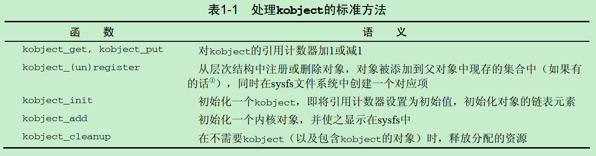

> 《深入Linux内核架构》

# 简介和概述

## 内核实现策略

两种范型：

* 微内核
    * 只有最基本的功能有内核实现，其他功能都委托给一些独立的进程，并通过明确定义的通信接口于中心内核通信
    * 缺点是各个组件之间支持复杂通信需要额外的CPU时间，在实用性方面进展甚微
* 宏内核
    * 与微内核相反，所有功能打包在一个文件
    * 缺点是如果编程时不小心，很可能会导致源代码中出现复杂的嵌套
    * 优点是性能强于微内核

## 内核组成


### UNIX进程

#### 线程
* fork
* exec
* clone

#### 命名空间
每个命名空间可以包含一个特定的PID集合，或可以提供文件系统的不同视图，在某个命名空间中挂载的卷不会传播到其他命名空间中

### 地址空间与特权级别

#### 特权级别
用户状态禁止访问内核空间，进入内核的两种方法：
* 用户进程系统调用
* 异步硬件中断
    * 区别在于：中断上下文中不能访问虚拟地址空间中的用户空间部分，因为中断可能是随机发生的，与用户进程无关
    

#### 内核线程
内核线程无权处理用户空间，与中断上下文运转的内核相比，内核线程可以进程睡眠状态，更像一个用户进程。通过`ps fax`可以查看内核线程，下面置于方括号内的都是内核线程：
    ```bash
    > ps fax
        PID TTY      STAT   TIME COMMAND
        2 ?        S      0:00 [kthreadd]
        3 ?        I<     0:00  \_ [rcu_gp]
        4 ?        I<     0:00  \_ [rcu_par_gp]
        6 ?        I<     0:00  \_ [kworker/0:0H-kblockd]
        9 ?        I<     0:00  \_ [mm_percpu_wq]
        10 ?        S      0:13  \_ [ksoftirqd/0]
        11 ?        I      2:58  \_ [rcu_sched]
    ```

#### 虚拟和物理地址空间
物理内存页经常称作**页帧**，**页**则专指虚拟地址空间中的页

### 页表
* 页表定义
    * 将虚拟地址空间映射到物理哦那估计的数据结构

#### 多级分页
* 目的
    * 为了减少页表的大小
        * 对虚拟地址空间中不需要的区域，不必创建中间页目录或页表


* 组成
    * 全局页目录(Page Global Directory)
    * 中间页目录(Page Middle Directory)
    * 页表数组(Page Table Entry)

* 缺点
    * 多级转换，速度慢

* 加速方法
    * MMU(Memory Management Unit)，CPU中硬件
    * TLB(Translation Lookaside Buffer)，频繁转换的地址，将其缓存

#### 内存映射
* 定义
    * 将任意来源的数据传输进程的虚拟地址空间中
* 应用
    * 内核在实现设备驱动程序时，直接使用了内存映射。外设的输入/输出可以映射到虚拟地址空间的区域中。对相关内存区域的读写会由系统重定向到设备，从而大大简化了驱动程序的实现。

### 物理内存的分配
* 内核分配内存
    * 记录页帧的已分配状态或空闲状态
    * 只分配完整的页帧
* 用户空间标准库分配内存
    * 将页帧划分为更小的部分

#### 伙伴系统


* 目的
    * 分配连续页
* 实现手段
    * 将系统中的空闲内存连续块，两两分组，称为伙伴
    * 相同大小的连续内存(1,2,4,8,16或其他数目的页)，由同一个列表管理
    * 当需要连续内存时
        * 分离伙伴，调整列表
    * 当程序释放内存时
        * 检查地址，判断是否能够创建一组伙伴，并合并为一个更大的内存块放回到伙伴列表中
* 缺点
    * 频繁的分配和释放页帧导致内存碎片，虽然有空闲内存，但无法分配一块很大的连续内存

#### slab缓存

* 目的
    * 在内核中频繁申请小内存
* 实现手段
    * `kmalloc`和`kfree`


#### 页面交换和页面回收
* 目的
    * 利用磁盘空间增大可用内存

### 计时
* 目的
    * 提供时间信息
* 实现
    * `jiffies`时间坐标，是一个全局变量，每秒递增一定的值

### 系统调用
* 分类
    * 进程管理：创建新进程，查询信息，调试。
    * 信号：发送信号，定时器以及相关处理机制。
    * 文件：创建、打开和关闭文件，从文件读取和向文件写入，查询信息和状态。
    * 目录和文件系统：创建、删除和重命名目录，查询信息，链接，变更目录。
    * 保护机制：读取和变更UID/GID，命名空间的处理。
    * 定时器函数：定时器函数和统计信息
* 执行系统调用方式，从用户态到内核态
    * Linux使用了一个专用软件中断

### 设备驱动程序、块设备和字符设备

### 网络

* 套接字可用看作应用程序、文件接口、内核的网络实现之间的代理

### 文件系统

* 文件系统使用目录结构组织存储的数据，并将其他元信息与实际数据关联起来

* 实现
    * Ext2基于inode，对每个文件都构造了一个单独的管理结构`inode`
        * `inode`包含了文件所有的元信息，以及指向相关数据块的指针
        * 目录的可以表示为普通文件，他的数据包括了指向目录下所有文件的`inode`指针

#### VFS(Virtual Filesystem)
* 目的
    * 将底层文件系统与应用层(和内核自身)隔离
* 实现
    * 既是向下的接口(所有文件系统都必须实现其接口)
    * 也是向上的接口(用户能通过系统调用访问文件系统)


### 模块和热插拔
* 目的
    * 模块用于在运行时动态地向内核添加功能

### 缓存
* 目的
    * 改进系统性能
* 实现
    * 从低速的块设备读取的数据会暂时保存在内存中

### 链表处理


```cpp
// 内核提供的标准链表
struct list_head {
    struct list_head *next, *prev;
};

// 放置到任意数据结构中，将此数据结构彼此连接
struct task_struct {
    ...
    struct list_head run_list;
    ...
};

// 对链表的操作

// 查找链表元素：list_entry(ptr, type, member)
//  ptr - 指向数据结构中list_head成员实例
//  type - 数据结构类型
//  member - 数据结构中表示链表元素的成员名，如上面定义的`run_list`
struct task_struct = list_entry(ptr, struct task_struct, run_list)

// 遍历链表所有元素：list_for_each(pos, head)
//  pos表示链表中的当前位置
//  head指定了表头
struct list_head *p;
list_for_each(p, &list)
    if (condition)
        return list_entry(p, struct task_struct, run_list);
return NULL;
```

### 对象管理和引用计数
* 目的
    * 为内核不同部分管理的对象提供一致的视图
* 内核对象机制有下列对象操作
    * 引用计数
    * 管理对象链表
    * 集合加锁
    * 将对象属性导出到用户空间(通过sysfs文件系统)

#### 一般性的内核对象
```cpp
<kobject.h>
struct kobject {
    const char *k_name;     // 对象名，利用sysfs导出到用户空间
    struct kref kref;       // 用于简化引用计数的管理
    struct list_head entry; // 用于将若干kobject放置到一个链表中
    struct kobject *parent; // 用于在kobject之间建立层次结构
    struct kset *kset;      // 将多个对象放置到一个集合中
    struct kobj_type *ktype;// 用于释放改数据结构资源的析构器函数
    struct sysfs_dirent *sd;// 用于支持内核对象与sysfs之间的关联
};

// 和链表一样，将kobject嵌入到其他结构，实现对象的管理
struct sample {
    ...
    struct kobject kobj;
    ...
};

<kref.h>
struct kref {
    atomic_t refcount;  // 给出了内核中当前使用某个对象的计数，计数器为0时，就不需要该对象了，可以从内存中删除
};
```



#### 对象集合
* 目的
    * 将不同的内核对象归类到集合中
        * 例如所有字符设备集合，所有基于PCI的设备集合

```cpp
<kobject.h>

struct kset {
    struct kobj_type *ktype;    // 指向kset中各个内核对象公用的kobj_type结构
    struct list_head list;      // 所有属于当前集合的内核对象的链表
    ...
    struct kobject kobj;
    struct kset_uevent_ops *uevent_ops; // 用于将集合的状态信息传递给用户层
};

// 该结构提供了与sysfs文件系统的接口
struct kobj_type {
    ...
    struct sysfs_ops *sysfs_ops;
    struct attribute ** default_attrs;
};
```

#### 引用计数
* 目的
    * 用于检测内核中有多少地方使用了某个对象

```cpp
<kref.h>
struct kref {
    atomic_t refcount;  // 给出了内核中当前使用某个对象的计数，计数器为0时，就不需要该对象了，可以从内存中删除
};
```

### 数据类型
#### 类型定义
#### 字节序

* `cpu_to_le64` - 将64位数据类型转换位小端格式

#### per-cpu变量
* 通过`define_per_cpu(name, type)`声明。在有若干CPU的SMP系统上，会为每个CPU分别创建变量的一个实例
* 通过`get_cpu(name, cpu)`返回某个特定CPU的实例，`smp_processor_id()`可得到当前CPU的ID

#### 访问用户空间

* 内核通过`__user`标记，来标识指向用户地址空间中区域的指针

# 进程管理和调度

* 进程调度要解决的问题：
    * 各应用程序不能彼此干扰
    * CPU时间必须在各种应用程序之间尽可能公平地共享

## 进程优先级

### 抢占式多任务处理(preemptive multitasking)
* 定义
    * 各进程在一定时间之后，都会被收回控制权，按照时间片轮转运行
    * 优先级/重要性高的进程，分配的时间片多
    * 

* 缺点
    * 进程在某些时间可能无事可做而无法立即执行
        * 通过进程状态进行分类
    * 无法让重要进程马上执行，以抢占当前的进程
        * 内核抢占(kernel preemption)可解决

## 进程生命周期

* 分类进程状态的目的
    * 防止CPU时间被分配到无法立即运行的进程，例如，进程等待在键盘输入上

* 进程可能有以下几种状态
    * 运行
    * 等待
        * 进程能够运行，但没有得到许可
    * 睡眠
        * 进程无法运行，因为在等待一个外部事件
    * 其他状态
        * 僵尸进程
            * 进程表中存留进程信息，但是其进程资源已经被释放
            * 原因是父进程没有通过`wait for`确认子进程的终结
        * 用户状态(受限)/核心态
            * 从用户态切到核心态的方法
                * 系统调用
                * 中断

## 进程表示

```cpp
<sched.h>
struct task_struct {
    volatile long state;
    ...
};
```

### 进程类型
* 进程
    * `fork`
    * `exec`
* 线程
    * `clone`
    * 线程库NGPT

### 命名空间

* 概念
    * 命名空间只使用一个内核在一台物理机上运作，将全局资源通过命名空间抽象起来


* 创建命名空间
    * 方法一
        * `chroot`系统调用
    * 方法二
        * `fork`/`clone`创建新进程，并通过选项控制建立新的命名空间
        * `unshare`系统调用将进程的某些部分从父进程分离，包括命名空间

#### 实现


```cpp
<nsproxy.h>

// 用于汇集指向特定于子系统的命名空间包装器的指针
struct nsproxy {
    struct uts_namespace *uts_ns; // UNIX Timesharing System 命名空间包含了内核信息
    struct ipc_namespace *ipc_ns; // 所有与IPC有关的信息
    struct mnt_namespace *mnt_ns; // 已经装载的文件系统视图
    struct pid_namespace *pid_ns; // 进程ID
    struct user_namespace *user_ns; // 保存用于限制每个用户资源使用的信息
    struct net *net_ns; // 包含所有网络相关的命名空间参数
};
```

UTS命名空间，没有层次组织，`cat /proc/sys/kernel/ostype`等命令，就是查看UTS的数据结构。
```cpp
<utsname.h>

struct uts_namespace {
    struct kref kerf;
    struct new_utsname name;
};

struct new_utsname {
    char sysname[65];
    char nodename[65];
    char release[65];
    char version[65];
    char machine[65];
    char domainname[65];
};
```

### 进程ID号


```cpp
<sched.h>
struct task_struct {
    ...
    pid_t pid;  // LWP id, return by gettid()
    pid_t tgid; // thread group id, return by getpid()
    ...
};

// SID
task_struct->signal->__session

// PGID
task_struct->signal->__pgrp

// PID枚举类型不包括TGID，因为线程组ID无非是线程组组长的PID而已
<pid.h>
enum pid_type
{
    PIDTYPE_PID,
    PIDTYPE_PGID,
    PIDTYPE_SID,
    PIDTYPE_MAX
};

```

### 进程关系
