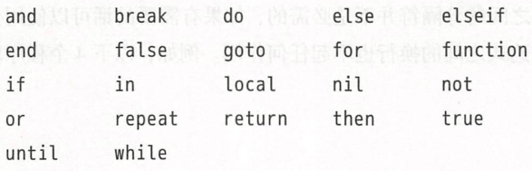
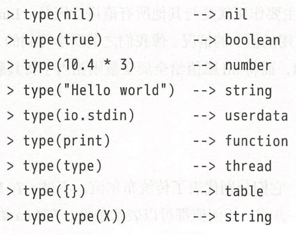
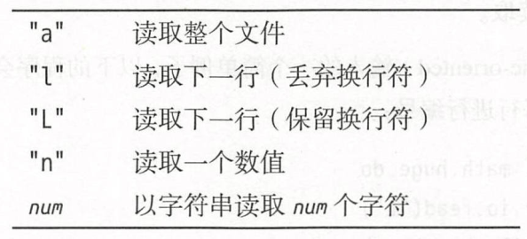

# 序
《Lua程序设计》的阅读笔记

# Lua语言入门
## 一些词法规范
* Lua语言的保留字<br>
   

* Lua语言中，连续语句之间的分隔符并不是必需的，可以用分号来进行分隔，如：
   * `a = 1 b = a * 2`和`a = 1; b = a * 2`是一样的

## 全局变量
* 全局变量无须声明即可使用(结果是nil)

## 类型和值
* 八种基本类型<br>
   

## 独立解释器
独立解释器(Stand-alone interpreter, 由于源文件名为lua.c，所以也被称为lua.c；又由于可执行文件为lua，所以也被称为lua)是一个可以直接使用Lua语言的小程序。
* lua命令的完整参数形如下：`lua [options] [script [args]]`
   * -e参数允许我们直接在命令行中输入代码
   * -l参数用于加载库
   * -i参数用于在运行完其他命令行参数后进入交互式模式

# 数值
* Lua5.3开始为数值模式提供了两种选择(以前版本的数值都以双精度浮点格式表示)
   * integer：64位整型
   * float：双精度浮点类型

## 数值常量
* 具有十进制小数或者指数的数值会被当作浮点型值，否则会被当作整型值。
* 由于整型值和浮点型值的类型都是`number`，所以它们是可以互相转换的：`1 == 1.0 --> true`
   * 如需要区分整型值和浮点型值：`math.type(3) --> integer`，`math.type(3.0) --> float`

### Lua数值的精度限制
* 用十进制表示的有限小数再用二进制表示时可能是无限小数
   * `12.7 - 20 + 7.3`用双精度表示也不是0，由于12.7和7.3的二进制表示不是有限小数
* 由于整型值和浮点型值的表示范围不同，因此当超过它们的表示范围时，整型值和浮点型值的算术运算会产生不同的结果
   ```lua
   math.maxinteger + 2   --> -9223372036854775807
   math.maxinteger + 2.0 --> 9.2233720368548e+18
   math.maxinteger + 0.0 --> 9.2233720368548e+18
   math.maxinteger + 2.0 == math.maxinteger + 1.0 --> true
   ```
* 浮点型能够表示的整数范围被精确地限制在[-2^53, 2^53]之间，超出这个范围后，我们则应该谨慎地思考所使用的表示方式
   * 小于2^53的所有整型值的表示与双精度浮点型值的表示一样，对于绝对值超过了这个值的整型值而言，在将其强制转换位浮点型值时可能导致精度的损失
   ```lua
   9007199254740991 + 0.0 == 9007199254740991   -> true
   9007199254740992 + 0.0 == 9007199254740992   -> true
   9007199254740993 + 0.0 == 9007199254740993   -> false
   ```
   * 整型转浮点型
      * `-3 + 0.0`
   * 浮点型整数转整型
      * `2^53 | 0`
      * `math.tointeger`函数会在输入参数无法转换位整型值时返回nil
         * `math.tointeger(-258.0) --> -258`
         * `math.tointeger(5.01) --> nil`

# 字符串
Lua语言中的字符串是不可变值(immutable value)，我们可以通过创建一个新字符串的方式来达到修改的目的。字符串的常见操作有：
```lua
a = "one string"
b - string.gsub(a, "one", "another") -- 改变字符串中的某些部分
print(b)    --> another string
print(#b)   --> 获取字符串b的长度，#操作符返回字符串占用的字节数，在某些编码中，这个值可能与字符串中的字符个数不同
print("hello ".."world")   --> 使用..来进行字符串的连接
```

## 字符串常量
* 长\多行字符串
   * 使用一对双方括号来声明长字符串常量
   ```lua
   data = [[
      hello
      world
   ]]
   print(data) --> hello
               --> world
   ```
   * 使用转义序列`\z`跳过其后的所有空白字符
   ```lua
   print("hello\z
    world")          --> helloworld
   ```

## 强制类型转换
* Lua不仅在算术操作时将字符串转换为数值，也会在需要字符串的地方将数值转换为字符串
   * `print(10 .. 20)   -> 1020`
* 建议通过函数`tonumber`显式地将字符串转换为有效数字
* 建议通过函数`tostring`显式地将数字转换成字符串

## 字符串标准库
* `string.len(s)`       - 返回字符串s的长度
* `string.rep(s,n)`     - 返回将字符串s重复n次的结果
* `string.reverse`      - 用于字符串翻转
* `string.lower(s)`     - 返回一份s的副本，将大写字母转成小写
* `string.sub(s, i, j)` - 从字符串s中提取第i个到第j个字符(包括第i个和第j个字符，字符串的第一个字符索引为1), -1代表最后一个字符
* `string.format`       - 用于进行字符串格式化
   ```lua
   string.format("x = %d  y = %d", 10, 20)      --> x = 10  y = 20
   string.format("x = %x", 200)                 --> x = c8
   string.format("x = 0x%X", 200)               --> x = 0xC8
   string.format("x = %f", 200)                 --> x = 200.000000
   tag, title = "h1", "a title"
   string.format("<%s>%s</%s>", tag, title, tag) --> <h1>a title</h1>
   string.format("pi = %.4f", math.pi)           --> pi = 3.1416
   d = 5; m = 11; y = 1990
   string.format("%02d/%02d/%04d", d, m , y)     --> 05/11/1990
   ```

# 表
* Lua语言中的表本质上是一种辅助数组，这种数组不仅可以使用数值作为索引，也可以使用字符串或其他任意类型的值作为索引(nil除外)
* 表是一种动态分配的对象，程序只能操作指向表的引用(或指针)，除此以外，Lua不会进行隐藏的拷贝或创建新的表

## 表构造器
* 空构造器`{}`
* 初始化列表
   ```lua
   days = {"Sunday", "Monday"}
   days[1]  --> Sunday
   ```
* 初始化记录式
   ```lua
   a = {x = 10, y = 20} --> 等价于：a = {}; a.x = 10; a.y = 20
   a["x"]               --> 10
   a[x]                 --> nil，因此初始化记录式构造方式的键值都是字符串，"a.x"等同于"a["x"]"，而不同于a[x]
   ```
* 通过方括号括起来的表达式显示地指定每一个索引
   ```
   {x = 0, y = 0}    <-->  {["x"] = 0, ["y"] = 0}
   {"r", "g", "b"}   <-->  {[1] = "r", [w] = "g", [3] = "b"}
   ```

## 数组、列表和序列
* 数组(array)或列表(list)，只需要使用整型作为索引的表即可。
   ```lua
   a = {}
   for i = 1, 10 do
      a[i] = io.read()
   end
   ```
* 序列(sequence)是由指定的n个正整数值类型的键所组成集合{1,...,n}形成的表(值为nil的键实际不在表中)
   * 不包含数值类型键的表就是长度为零的序列(`#`操作符可以获得序列的长度，如果存在值为nil，则`#`操作符不可靠)

## 遍历表
我们可以使用pairs迭代器遍历表中的键值对(nil元素会被忽略)：
```lua
t = {10, print, x = 12, nil, k = "hi"}
for k, v in pairs(t) do
   print(k, v)
end
   --> 1 10
   --> k hi
   --> 2 function:042061
   --> x 12
```

## 表标准库
* `table.insert`  - 向序列的指定位置插入一个元素，其他元素依次后移
* `table.remove`  - 删除并返回序列指定位置的元素
* `table.move`    - table.move(a, f, e, t)将表a中从索引f到e的元素移动到位置t上

# 函数
* Lua语言也为面向对象风格的调用提供了一种特殊的语法，即冒号操作符。形如`o:foo(x)`的表达式意为调用对象o的foo方法。
* 一个Lua程序既可以调用Lua语言编写的函数，也可以调用C语言(或者宿主程序使用的其他任意语言)编写的函数。
* 调用函数时使用的参数个数可以与定义函数时使用的参数个数不一致，多余的参数会抛弃，不足的参数设置为nil

## 多返回值
* 逗号隔开
* 如果用括号包起来，返回值变为一个

## 可变长参数函数
```lua
function add (...)
   local s = 0
   for _, v in ipairs{...} do
      s = s + v
   end
   return s
end
--> 如果要计入nil元素，可使用table.pack(1,2,nil)
--> 如果不想构建表，也可以使用select函数，从一堆数据中选择
```

## 函数table.unpack
```lua
print(table.unpack{10,20,30}) --> 10 20 30
a,b = table.unpack{10,20,30}  --> a=10, b=20, 30被丢弃
```
`unpack`把Lua语言中的真实的列表转换成一组返回值，进而可以作为另一个函数的参数使用。


# 输入输出
## 简单I/O模型
* 函数`io.input`和函数`io.output`可以用于改变当前的输入输出流，默认时stdin和stdout

### io.write
* 是`io.output():write`的简写
* 如果想要完全地控制数值转换为字符串，使用`string.format`
* 不会添加换行符

### io.read
* 是`io.input():read`的简写
* 从当前输入流中读取字符串，其参数决定了读取的数据：<br>
   

## 完整I/O模型
```lua
local f = assert(io.open(filename, "r"))
local t = f:read("a")
f:close()
```

## 其他系统调用
* `os.exit`    - 终止程序的执行
* `os.execute` - 用于运行系统命令，等价于C语言中的函数system
* `io.popen`   - 运行一条系统命令，但该函数还可以重定向命令的输入/输出，从而使得程序可以向命令中写入或从命令的输出中读取

# 补充知识
## 局部变量和代码块
* Lua语言中的变量在默认情况下是全局变量，所有的局部变量在使用前必须声明
* 局部变量的生效范围仅限于声明它的代码块
   * 一个代码块(block)是一个控制结构的主体(如，while循环)，或是一个函数的主体
   ```lua
   x = 10
   local i = 1 -- 对于代码段来说是局部的

   while i <= x do
      local x = i * 2   --> 对于循环体来说是局部的
      print(x)          --> 2, 4, 6...
      i = i + 1
   end

   if i > 20 then
      local x -- 对于“then”来说是局部的
      x = 20
      print(x + 2)      --> 22
   else
      print(x)          --> 10 全局的
   end

   print(x)             --> 10 全局的
   ```
   * 上述示例不能再交互模式中正常运行，因为交互模式下，每一行代码就是一个代码段

## 控制结构
* 条件执行`if/end`
   * 所有不是false和nil的值当作真
* 循环`while/end`，`repeat/until`，`for/end`
   * 和大多数其他编程语言不同，在Lua语言中，循环体内声明的局部变量的作用域包括测试条件

### 泛型for
使用恰当的迭代器可以在保证代码可读性的情况下遍历几乎所有的数据结构，如: `pairs`, `ipairs`, `io.lines`等

```lua
u={}
u[1]="a"
u[3]="b"
u[2]="c"
u[4]="d"
u["hello"]="world"
for key,value in ipairs(u) do print(key,value) end
--[[
  a
  c
  b
  d
--]]
for key,value in pairs(u) do print(key,value) end
--[[
  a
  hello   world
  b
  c
  d
--]]
```

# 闭包
在Lua语言中，函数是严格遵循词法定界(lexical scoping)的第一类值(first-class value)
* "第一类值"意味着Lua语言中的函数与其他常见类型的值(例如数值和字符串)具有同等权限：一个程序可以将某个函数保存到变量中(全局变量和局部变量均可)或表中，也可以将某个函数作为参数传递给其他函数，还可以将某个函数作为其他函数的返回值返回。
* "词法定界"意味着Lua语言中的函数可以访问包含其自身的外部函数中的变量(也意味着Lua语言完全支持Lambda演算)

## 函数是第一类值
以下演示了第一类值的含义：
```lua
a = {p = print}      -- 'a.p'指向'print'函数
a.p("Hello World")   --> Hello World
print = math.sin     -- 'print'现在指向sin函数
a.p(print(1))        --> 0.8414
math.sin = a.p       -- 'sin'现在指向print函数
math.sin(10, 20)     --> 10   20
```

* 在Lua语言中，所有的函数都是匿名的。像其他所有的值一样，函数并没有名字。当讨论函数名时，实际上指的是保存该函数的变量。
* 高阶函数指以另一个函数为参数的函数，可利用高阶函数实现导数
   ```lua
   function derivative (f, delta)
      delta = delta or 1e-4
      return function(x) return (f(x + delta) - f(x))/delta end
   end
   c = derivative(math.sin)
   print(math.cos(math.pi/3), c(math.pi/3))  --> 0.5   0.49995669789693
   ```

## 非全局函数
* 函数不仅可以被存储在全局变量中，还可以被存储在表字段和局部变量中
* 当把一个函数存储到局部变量时，就得到了一个局部函数(local function)
   * 有时需要通过前向声明，定义局部函数的递归情况

## 词法定界
当编写一个被其他函数B包含的函数A时，被包含的函数A可以访问包含其的函数B的所有局部变量，我们将这种特性称为词法定界(lexical scoping)。
闭包的例子：
```lua
function newCounter ()
   local count = 0
   return function()
         count = count + 1
         return count
      end
end

c1 = newCounter()
print(c1())    --> 1
print(c1())    --> 2
c2 = newCounter()
print(c2())    --> 1
print(c1())    --> 3
print(c1())    --> 2
```
* 从技术上讲，Lua语言中只有闭包而没有函数，函数本身只是闭包的一种原型

## 小试函数式编程
```lua
-- 定义一个根据指定的圆心和半径创建圆盘的工厂
function disk(cx, cy, r)
   return function (x, y) return (x - cx)^2 + (y - cy)^2 <= r^2 end end
disk(1.0, 3.0, 4.5)  --> 创建了一个以点(1.0, 3.0)为圆心、半径4.5的圆盘

-- 定义一个指定边界的轴对称矩形工厂
function rect(left, right, bottom, up)
   return function(x, y)
            return left <= x and x <= right and bottom <= y and y <= up
         end
end

-- 创建任何区域的补集，同样方法可以创建并集、交集和差集
function complement(r)
   return function(x, y)
            return not r(x, y)
         end
end

function difference (r1, r2)
   return function(x, y)
            return r1(x, y) and not r2(x, y)
         end
end

function translate(r, dx, dy)
   return function(x, y)
            return r(x -dx, y -dy)
         end
end

function plot(r, M, N)
   io.write("P1\n", M, " ", N, "\n")
   for i = 1, N do
      local y = (N - i * 2) / N
      for j = 1, M do
         local x = (j * 2 - M) / M
         io.write(r(x, y) and "1" or "0")
      end
      io.write("\n")
   end
end

c1 = disk(0, 0, 1)
plot(difference(c1, translate(c1, 0.3, 0)), 500, 500)
```

