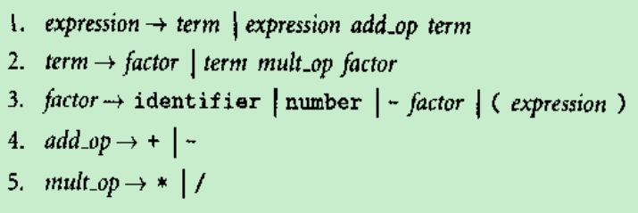

# 序
《程序设计语言--实践之路》读书笔记

# 引言

## 语言设计的艺术
在设计语言时，我们需要从下面两个方面做出折中，常常需要在对一种特征诉求与其实现代价之间做出某种平衡：
* 程序员
* 语言实现者

## 程序设计语言的谱系

* 说明式语言
   * 关注的式计算机做什么
   * 级别更高，更贴近程序员的观点，距离实现者的观点更远一些
* 命令式语言
   * 关注计算机如何去做要求它做的事情
   * 占据着统治地位还是因为性能原因

在说明式和命令式语言族里，又各有几个重要的子类：
* 函数式语言
   * 采用一种计语递归表示的函数定义的计算模型
   * Lisp、ML和Haskell
* 数据流语言
   * 将计算看成在一些基本的功能节点之间流动的信息流
   * Id,Val
* 逻辑式或基于限制的语言
   * 把计算看作式通过一种目标制导的搜索，设法根据一集逻辑规则找出满足某些特定关系的值
   * Excel
* 冯诺依曼语言
   * 把修改变量当作基本计算方式的语言
   * C
* 面向对象语言
   * 不是把计算描绘为一个处理器在一个存储区上的操作，而是看作一些比较独立的对象之间的相互作用，每个对象有其自身的内部状态，以及一些管理这种状态的可执行函数
   * C++

## 编译和解释


* 解释性语言的优势
   * 有些语言特征不用解释的方式几乎根本无法处理。例如，在Lisp和Prolog里，一个程序可以为自己生成代码片段，并且可以随后就去执行他们。把有关程序实现的决策推迟到运行时才做，这种方式被称为“迟约束”。
* 编译性语言的优势
   * 有更好的性能
   * 可以在编译时就做出决策以节省运行时的时间。如果编译器可以保证变量x总是被安排在某个位置，那么无论源程序里的任何地方引用x，它都可以生成一条访问这个位置的及其语言指令。与此相反，解释器则需要在每次访问x时到一个表格里取查找它。

许多语言实现采用的是编译和解释的混合模式：<br>

* 如果初始阶段的翻译器比较简单，我们就说这个语言是“解释的”。如果翻译器对程序做了彻底的分析（而不是只做某种“机械的”变换），而且有关的中间语言程序与源程序并没有很强的相似性，我们就认为这个语言是编译的。因此，下面两点是刻画编译方式的标志性特征：
   * 彻底的分析
   * 非平凡的变换

“编译”一词适用于一切从一种语言到另一种语言的非平凡的自动翻译，只要其中包含着对输入的意义分析。

## 编译概览

* 前端
   * 前面几个阶段(直至语义分析)的作用是挖掘出源程序的语义
* 后端
   * 后面介个阶段的工作是构造出等价的目标程序

### 词法和语法分析
* 扫描又称词法分析。扫描器的主要作用就是为了简化分析器的工作，它能减小输入的规模并删除额外的字符。
* 语法分析阶段得到的单词组织为一棵“语法分析树”

### 语义分析和中间代码生成
* 语义分析也就是确定程序的意义
   * 语义分析器需要跟踪标识符和表达式的类型，这既是为了验证使用的相容性，也用于知道后面阶段的代码生成
   * 语义分析器通常构造并维护着一个符号表数据结构，符号表把每个标识符映射到有关它的已知信息
      * 这些信息包括各个标识符的类型信息、内部结构，以及作用域

语法分析树有时也被称作“具体语法树”，因为这种树完全而具体。在语义分析后续的编译阶段并不需要语法分析树上的许多信息了。因此，语义分析器通常会把这种语法分析树转换为一棵“抽象语法树”(AST，简称语法树)，删除树额你不大部分“人为”结点。
```pascal
program gcd (input, output);
var i, j : integer;
begin
   read (i, j);
   while i <> j do
      if i > j then ; := i - j
      else j := j - i;
   writeln(i)
end.
```
对于上面的最大公约数算法，其语法树如下：<br>


在许多编译器里，带标注的语法树就是从前端传递到后端的中间形式，而在另一些编译器里，语义分析器最后还要遍历这棵树，生成某种另外的中间形式。这一形式通常类似于某种特别简单的理想机器的汇编语言。对于一组相关的编译器，几种语言的前端和为几种机器服务的后端可能共享着同一种中间形式。

### 目标代码生成
编译器的代码生成阶段把中间形式翻译到目标语言。代码生成器需要：
* 遍历整个符号表，给每个变量指定位置
* 遍历语法树，生成对这些变量的装入和保存动作，插入适当的算术运算、检测和分支

### 代码改进
* 在中间形式上通过一些变换完成优化
   * 刚刚做完语义分析和中间代码生成之后做
* 深入了解目标机器后完成优化
   * 在做完目标代码生成之后做


# 程序设计语言的语法
## 关键问题
* 如何描述程序设计语言的结构规则？
* 编译器如何识别给定输入程序的结构？
* 确定给定的程序是如何(或者是否)按照这些规则构造起来的：
   * 程序员主要关心的事情
      * 如何写出合法的程序？
      * 依赖“正则表达式”和“上下文无关文法”
   * 编译器主要关心的工作
      * 如何分析这些程序？
         * 依赖“扫描器”和“语法分析器”

## 描述语法：正则表达式和上下文无关文法
* 正则语言
   * 由正则表达式生成，由扫描器识别
   * 只需三类规则描述：
      * 拼接
      * 选择
      * “星号”（任意次的重复）
* 上下文无关语言(CFL)
   * 由上下文无关文法(CFG)定义，由语法分析器识别
   * 如果一个字符串集合可以通过加入递归后的规则形式地定义，就称它是一个上下文无关语言

### 单词和正则表达式
* 单词(Tokens)包括：
   * 关键字
   * 标识符
   * 数
   * 各种标点符号
   * 其他符号

大部分现代语言或多或少是自由格式的，其中的程序也就是一个单词的序列，起作用的只是这些单词之间的顺序，而与他们在一个打印行或者页里的物理位置无关。

正则表达式不允许基于自己定义自己(递归)。递归定义是上下文无关文法的标志性特征。

### 上下文无关文法
对于定义单词而言，正则表达式工作得很好，但是它们无法描述嵌套的结构。基于一种结构定义其自身是至关重要的，递归定义使我们能保证左右括号配对，而正则表达式就无法做到这一点。

* 产生式
   * 上下文无关文法里的一条规则
* 变量或非终结符
   * 位于产生式左部的符号称
* 终结符
   * 构成由文法导出 串的那些符号
   * 不能出现在产生式的左部
   * 对于一个程序设计语言，相应上下文无关文法的终结符就是该语言里的各种单词

### 推导和语法分析树


* 推导
   * 如何从一个开始符号导出一个非终结符的串称为一个推导
   * 最右推导：每一步都用某个产生式的右部替换掉位置在最右边的非终结符
   * 最左推导
* 句型
   * 在一个推导过程中得到的各个符号串称为句型
* 产出式
   * 最后的句型仅仅由终结符构成，称为这一推导的产出式
* 语法分析树
   * 根是语言的开始符号
   * 叶是它的产出
   * 每个中间结点及其子结点表示一次产生式应用
* 歧义性
   * 某些串可以生成多于一个语法分析树
   * 我们可以通过产生式控制各种运算符的结合性和优先性，从而消除歧义
      * 确定优先级的方式式让factor、term和expression中一个在另一个之上构造<br>
      

## 识别语法：扫描器和语法分析器
从理论上看，一个扫描器就是一个识别某个程序设计语言单词的“确定性的有限自动机DFA”；而一个语法分析器也就是一个识别该语言的上下文无关的语法的“下推自动机PDA”。因此，我们完全可以从正则表达式和CFG自动地生成扫描器和语法分析器。

### 扫描


在报告所发现的单词后，扫描器返回到语法分析器。如果再次调用它，它又从头开始这一算法，并以下一个可用字符作为输出(包括了上次向前探查但却没有使用的字符)。扫描器的工作准则式：
* 在每次调用中接受最长的可能单词


* 如何构建一个扫描器，让它显示地反映有限自动机的“圆圈和箭头”结构？
   * 一种方式式用goto或者嵌套的case(switch)语句，把自动机嵌入到程序的控制流里
      * 手写扫描器倾向于使用此方式
   * 另一种方式是使用一个表格和一个驱动程序
      * 自动生成的扫描器倾向于使用此方式
      * 需要用特殊机制去处理注释和“空白”

### 自上而下和自下而上的语法分析
对于任何CFG，我们都可以构造出一个运行时间为O(n^3)的语法分析器。存在着一些文法类，对于它们可以构造出运行时间为线性的分析器，这些文法类里最重要的分类称为LL和LR。

* LL分析器
   * “自上而下”或者“预测式”的分析器
   * 从左向右，最左推导
* LR分析器
   * “自下而上”分析器
   * 从左向右，最右推导
   * 文法类LR较LL更大，使用得更普遍一些

实例：<br>


上图显示了对于串`A, B, C;`的自上而下和自下而上的方式，构造语法分析树的逐步过程。
* 自上而下分析器(LL)
   * 开始预测到树的根(id_list)将被"id id_list_tail"取代
   * 随后用id与由扫描器得到的下一个单词匹配
   * 下移到它的第一个非终结子结点，并预测“id_list_tail”将被“, id_list_tail”取代
   * 为了这一预测，需要去查看随后的单词(一个逗号)
   * 而后分析器匹配逗号和下一个id，并下以到随后的"id_list_tail"
* 自下而上分析器(LR)
   * 从识别出这棵树的最左树叶是一个id开始
   * 下一个树叶是逗号，再下一个树叶是另一个id
   * 分析器把从扫描器得到的一个个新叶结点移植进一个部分完成的语法分析树片段的森林里，直到发现这些片段中的某些构成里存在一个产生式的完整右部
   * 由于掌握了这个右部，该分析器就把这个分号归约到`id_list_tail`
   * 而后把`, id id_list_tail`归约到另一个`id_list_tail`
   * 最后把`id id_list_tail`归约到树的根`id_list`
   * 移入-归约
      * 自下而上的分析器在任何时候都不会预测自己随后将要看到什么，它只是不断把单词移入自己的森林，直至识别出一个产生式的右部，这是就把它归约为相应的左部
      * 移入-归约分析器正好是反向地追溯出最右(规范)推导，例如上图中，最开始进行的是对“分号”的归约

### 递归下降(Recursive Descent)

#### 关键问题：如何通过计算器LL文法，做自上而下的语法分析？
我们从树的顶端开始，基于树种当前的最左非终结符和当前输入单词预测所需的产生式，有两种方式可以将这一过程形式化：
* 手工构造一个递归下降语法分析器
   * 常常用于分析那些相对较容易分析的语言
* 用语法分析器的生成器构造一个LL分析表格，并用一个驱动程序读入

* 计算器LL文法<br>
   
* 计算器LR文法<br>
   
   * 无法根据上图的LR文法，用自上而下的语法分析。因为，如果我们在期望expression时，看到的时输入里的一个identifier，无法确定应该在两个可能的产生式里预测哪一个(term or expression add_op term)
   * LL文法避免了上面的问题，即可以通过向前探查一个单词，就可以确定产生式

现在我们分析如下一个简单的计算器程序，该程序读入两个数，打印出它们的和与平均值：
```
read A
read B
sum := A + B
write sum
write sum / 2
```

* 递归下降式语法分析器的难点：
   * 如何确定哪些单词应该作为case语句分支的标号，预测所对应的产生式
* 单词x可能因为两个理由预测某个产生式:
   * 该产生式的右部递归展开后能得到一个以x开头的串
   * 这个右部可能什么都不产生，即，产生出空串，或者产生出一个非终结符，而该非终结符产生出空串，而x可能式随后的生成物的开始


