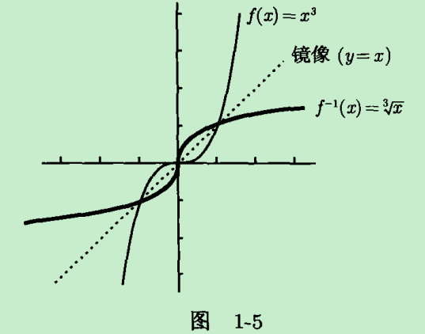

# 序
《普林斯顿微积分读本》读书笔记

# 函数、图像和直线
## 函数
* 上域(codomain)
   * 函数的起始对象称为输入，来自定义域的集合；返回的对象称为输出，来自上域的集合
   * 可能输出的集合
* 值域(range)
   * 所有可能的输出所组成的集合
   * 是上域的一个子集
   * f(x) = x^2, 其定义域和上域都是R(实数集)，而其值域是非负数的集合

* 定义域表征
   * 区间表示法
* 值域表征
   * 利用图像求值域
* 函数特征
   * 通过垂线检验是否是函数

## 反函数
* 通过水平线检验是否存在反函数
* 如何求函数f的反函数 
   

