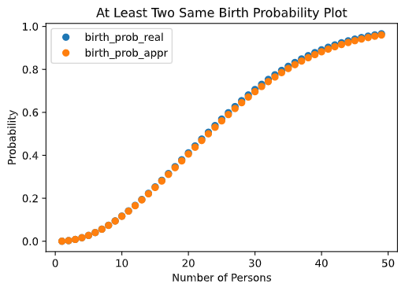
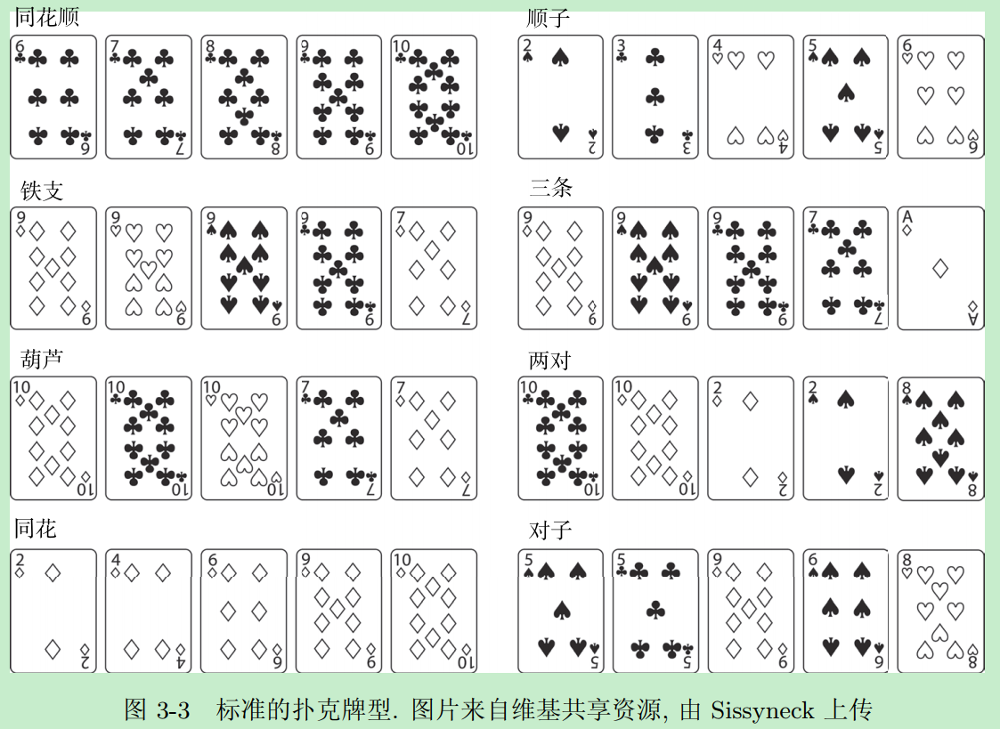

# 序
《普林斯顿概率论读本》读书笔记

# 一般性理论

# 引言
## 生日问题
* 问题表述
   * 房间里有多少人才能保证其中至少两个人的生日再同一天的概率不小于50%？
   * 假设对每个人来说，出生再一年中任何一天的概率都是相等的。那么，房间里有多少人才能保证其中至少两个人的生日再同一天的概率不小于50%？
   * 假设客人的出生日期都是相互独立的，并且每个人都等可能地出生再一年中的任何一天(2月29日除外)，那么房间里有多少人才能保证其中至少两个人的生日再同一天的概率不小于50%？
* 解决问题
   * 狄利克雷鸽巢原理(抽屉原理)：设A1~An是一组集合，并且A1+...+An中至少有n+1个元素，那么至少有一个Ai包含了不少于两个元素
   * 计算对立事件的概率
   * [概率计算](./code/birth/same_birth_prob.py)
      * 概率分布图 
      
* 对问题和答案的推广：效率
   * 假设我们有一些麦片包装盒， 每个盒子都等可能地放着n个不同玩具中的一个，那么再首次得到两个相同的玩具之前，我们已经得到了多少个玩具？
   * 假设某种东西正在破坏某个系统，必须击中两次才能完全破坏。如果在每次攻击中，所有地方都等可能地被击中，那么需要进行多少次攻击才能使得至少一个系统被摧毁？
   * 生日问题的概率公式：
   )
      * 利用`ln(1-x)`的泰勒级数近似`-x`，可得：
      
      * 最终：
      
* 数值验证
   * 验证上面的近似公式["code"](./code/birth/verify.py)，对比如下： 
   

## 从投篮到几何级数
* 问题和解答
   * 对于某个不断重复的进程，找到它首次成功所需要等待时间的分布
   * 解答方法1
      * 几何级数
   * 解答方法2
      * 无记忆进程，通过对每个独立的进程联立方程求解。例如，设每组的起始时刻开始，某人赢的概率为x。
* 编程模拟纸牌游戏
   * Alice、Bob和Charlie玩纸牌游戏，第一个拿到方块牌的人获胜。Alice先抽， 之后Bob，最后Charlie。
   * 通过计算可得三人赢的概率分别是：16/37，12/37，9/37
   * 通过计算机模拟结果是一样的，参见[代码](./code/get_diamond/get_diamond.py)

# 基本概率定律
## 悖论
* 罗素悖论
   * 并不是所有描述都能构成一个集合的，如：由那些不属于自身的对象构成的集合，那此集合的自身是否属于此集合
   * 为了解决罗素悖论，要求“集合的元素必须明确”

## 集合论综述
### 漫谈编程
* [代码1](./code/four_square_sum/violent_solution.py)和[代码2](./code/four_square_sum/better_solution.py)

### 无穷大的大小和概率
* 集合论的一个重要结果是存在不同程度的无穷大(有些无穷大要比其他的无穷大更大)。
* 映射概念
   * 一对一函数，或者“单射”
      * 不同的输入对应到不同的输出
      * 平行于x轴的直线，只有一个交点
   * 映上函数，或者“满射”
      * 所有y均有对应的x
      * 没有多余的输出没有对应的输入
   * 如果f既是一对一的又是满射的，那么我们就说f是“**双射**”的。
* 集合的大小
   * 有限 < 可数 < 不可数
   * 如果在A和正整数集之间存在一个“双射”，则A是“可数”的
   * 如果A既不是有限的，也不是可数的，则A是“不可数”的
   * 可数集不仅有无穷多个元素，而且它的大小是**最小的无穷大**
      * 如果A是B的一个真子集，A和B的大小相等也是有可能的，如
         * 正偶数集E和正整数集P，存在一个双射f(x) = x/2。因此，E的每一个元素都与P中的唯一元素相匹配，反之亦然。
* 常见集合大小
   * 正整数集、整数集Z，有理数集Q，以及Q^n(n元有理数组的集合)具有相同的大小，这些集都是可数的。
   * 实数集R、平面R^2和n维空间R^n都是不可数的。
* 如果集合A和B之间存在两个满射函数，f: A->B和g: B->A，那么A和B的基数相同，即|A|=|B|
* 对于集合A来说，如果存在一个映射f:A->A是一对一的，但不是满射的，那么集合A就是“无限的”
   * 任意一个有限集都不可能使到自身的映射是单射但不是满射的
* 只能讨论可数事件的并的概率，也就是说，对于不可数个事件的并，我们无法讨论其概率。

### 开集和闭集
* 如果对于任意给定的a属于A，都存在1个r，使得Ba(r)是A的真子集，那么就说集合A是开的。如果A的补集是开的，那么A就是闭的。
   * 一个没有边界的圆或球是一个开集；如果把边界包括在内，就得到了一个闭集。

## 结果空间、事件和概率公理
* 如何合理地谈论概率？
   * 样本空间或结果空间Ω：所有可能的结果都是样本空间的子集
   * 事件：样本空间中的元素称为事件
   * 概率函数Prob：指定了样本空间中的不同元素(事件)的概率

## 概率公理
* 概率空间
   * 样本空间Ω
   * 样本空间中可能的子集Σ
      * 如果Ω中有n个元素，那么Ω的2^n个子集就构成了Σ
   * 概率函数Prob
      * 三元组(Ω，Σ，Prob)称为概率空间，利用函数Prob，我们把概率分配给Σ的子集，其中Σ是一个定义了函数Prob的特殊σ代数
* 柯尔莫戈洛夫的概率公理
   * Ω是一个样本(结果)空间，Σ是一个σ代数。如果概率函数满足下列条件，那么(Ω，Σ，Prob)就是一个概率空间。
      * 如果A∈Σ，那么Pr(A)是有定义的，并且0≤Pr(A)≤1
      * Pr(Φ)=0且Pr(Ω)=1
      * 设{Ai}是由有限个或可数个两两互不相交的集合构成的集族，并且每一个集合都是Σ中的元素，那么：
      %20=%20\sum_{i}Pr(A_{i}))
         * 如果A和B不能同时发生，那么他们中有一个发生的概率就是他们各自发生的概率之和
* 概率空间例子
   * 计数模型
      * Ω = {ω1, ω2, ..., ωn}; Prob(ωk) = 1/n。那么，Prob(A) = #A/#Ω，其中#S表示S中元素的个数

## 基本概率规则
* 我们不是把概率分配给所有事件，而是只对特殊集合分配概率。
* 设(Ω，Σ，Prob)是一个概率空间，Σ是样本空间Ω的一个σ代数，概率函数Prob:Σ→[0,1]。那么可得以下结论
   * 全概率公式
      * 如果A∈Σ，那么Pr(A)+P(A补)=1
   * 容斥原理
      * Pr(A∪B)=Pr(A)+P(B)-Pr(A∩B)
      * 大部分时候，事件的交比事件的并更好求概率
   * A是B的子集，那么Pr(A)≤Pr(B)。但是如果A是B的真子集，不能说Pr(A)＜Pr(B)
   * 如果对于任意的i，均有Ai是B的子集，那么Pr(∪iAi)≤Pr(B)
      * 对于给定的并集，我们通常希望能把它写成几个互不相交的集合的并

## 概率空间和σ代数
* 按照统一的方式为所有可能发生的事件分配概率是有问题的，例如：
   * 随机地向单位圆投掷一个飞镖，则
      * 结果空间Ω={(x,y): x²+y²≤1}
      * 设Ax,y为飞镖落在(x,y)这一事件，那么Pr(Ax,y)是多少？
   * 问题出在我们如何定义事件。当有无穷多个事件时，我们必须更加谨慎地考虑什么才能被看作事件
      * 解决方案：集合的**σ代数**
* 对于一个不可数集A，**不存在**满足下列条件的概率函数：
   * 对任意的a∈A均有Pr(a)＞0，并且=1)
   * 例如此公式就出现了不可数个集合的并：![$$1=Pr([0,1])=Pr(\bigcup_{x\in{[0,1]}}\{x\})=\sum_{x\in{[0,1]}}Pr(\{x\})=\sum_{x\in{[0,1]}}?=0$$](https://render.githubusercontent.com/render/math?math=1=Pr([0,1])=Pr(\bigcup_{x\in{[0,1]}}\{x\})=\sum_{x\in{[0,1]}}Pr(\{x\})=\sum_{x\in{[0,1]}}?=0)
* 对于一个可数集B，**存在**概率函数，使得
   * Pr(b)>0对所有的b∈B均成立，并且=1)
   * 例如，Pr(n)=1/2^(n+1)，n是非负整数。通过几何公式可知，可数集的概率和是1

# 计数1：纸牌
## 阶乘和二项式系数
* 关键问题
   * 对集合中的元素进行排序，一共有多少种方法？
      * 排列问题，涉及阶乘函数
   * 在不考虑次序的前提下，从中挑选出若干元素，一共有多少种方法？
      * 组合问题，可导出二项式系数
## 扑克牌

* 牌型大小
   * 对子最小，其次两对，三条...，同花顺最大
* 从52张牌种无序挑出5张牌的方法数：) = 52!/(5!47!) = 2598960

### 最小牌型
* 计算5张牌点数都不相同的方法数
   * 思路1：先从13个数中选5个不同的数，再分别为每个点数，从4个花色中选择一共点数
   * 公式：\left(\begin{array}{c}4\\\\1\end{array}\right)\left(\begin{array}{c}4\\\\1\end{array}\right)\left(\begin{array}{c}4\\\\1\end{array}\right)\left(\begin{array}{c}4\\\\1\end{array}\right))
   * 思路2：第二张牌不能和第一张牌点数相同，所以相当于有(52-4 = 48)种选择，以此类推，5张牌一种(52 * 48 * 44 * 40 * 36)种“有序”选择。但是5张牌是无序的，所以还要除去5!
   * 拿到最小牌的概率约为50%，参加[代码](./code/poker/no_pair.py)

### 对子
* 计算只有一个对子
   * 思路1：二项式系数法，对子组合+其余牌组合
      * \left(\begin{array}{c}4\\\\2\end{array}\right)\cdot\left(\begin{array}{c}12\\\\3\end{array}\right)\left(\begin{array}{c}4\\\\1\end{array}\right)^{3}%20)
   * 思路2：列举组合数法，无须的对子组合数量+其余不同牌的组合数量
      * (52 * 3 / (2!))*(48 * 44 * 40 / (3!))
   * 拿到对子的概率约为42%，参加[代码](./code/poker/one_pair.py)

### 两对
* 计算只有两个对子的概率
   * 思路：分两组(一组是两个对，另一组是单的，如果分三组需要除去两个对的顺序)分别组合
      * \left(\begin{array}{c}4\\\\2\end{array}\right)^{2}\cdot\left(\begin{array}{c}11\\\\1\end{array}\right)\left(\begin{array}{c}4\\\\1\end{array}\right))
   * 拿到两个对子的概率约为4.7%，参加[代码](./code/poker/two_pairs.py)

### 三条
* 计算三条且另外两张牌点数不一样的概率
   * 思路：分两组(一组三条，另一组两张点数不同)
      * \left(\begin{array}{c}4\\\\3\end{array}\right)\cdot\left(\begin{array}{c}12\\\\2\end{array}\right)\left(\begin{array}{c}4\\\\1\end{array}\right)^{2})
   * 拿到三条的概率约为2.1%，参加[代码](./code/poker/three_of_a_kind.py)
