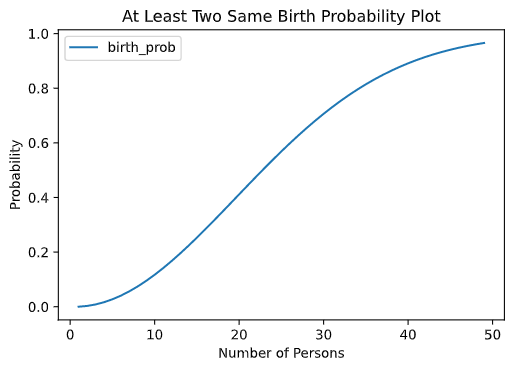

# 序
《普林斯顿概率论读本》读书笔记

# 一般性理论

# 引言
## 生日问题
* 问题表述
   * 房间里有多少人才能保证其中至少两个人的生日再同一天的概率不小于50%？
   * 假设对每个人来说，出生再一年中任何一天的概率都是相等的。那么，房间里有多少人才能保证其中至少两个人的生日再同一天的概率不小于50%？
   * 假设客人的出生日期都是相互独立的，并且每个人都等可能地出生再一年中的任何一天(2月29日除外)，那么房间里有多少人才能保证其中至少两个人的生日再同一天的概率不小于50%？
* 解决问题
   * 狄利克雷鸽巢原理(抽屉原理)：设A1~An是一组集合，并且A1+...+An中至少有n+1个元素，那么至少有一个Ai包含了不少于两个元素
   * 计算对立事件的概率
   * 概率分布图 
   
