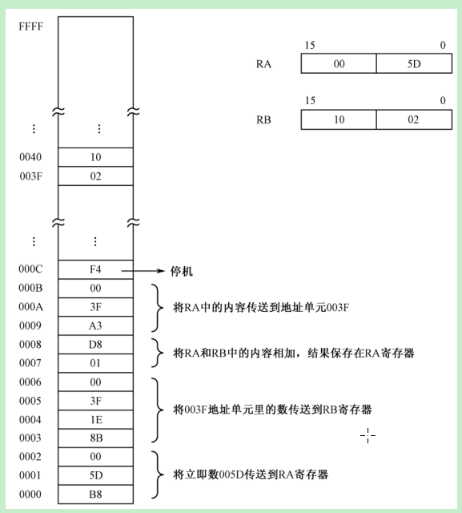
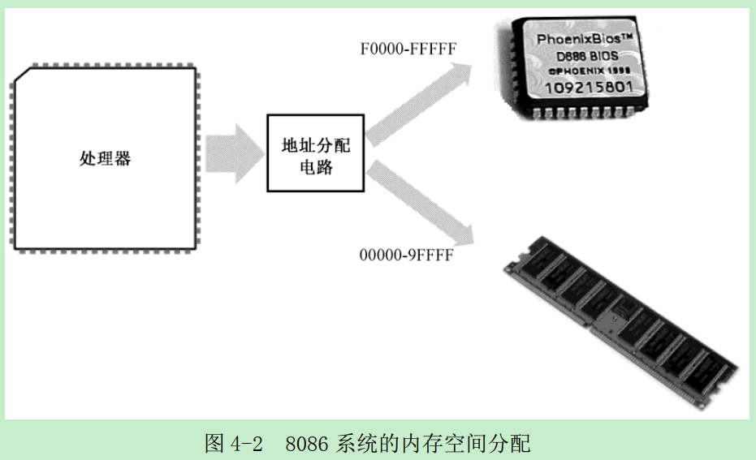
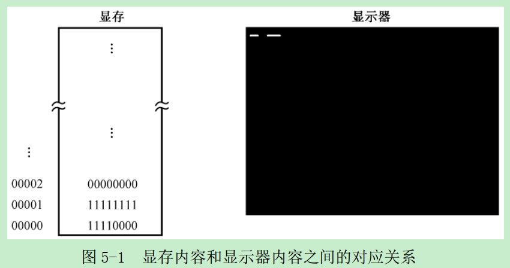
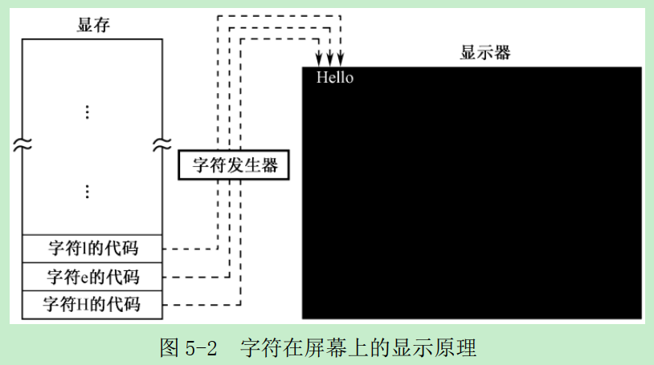
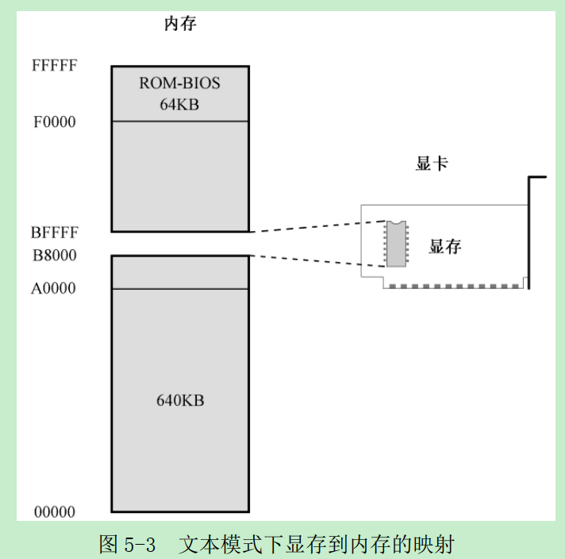
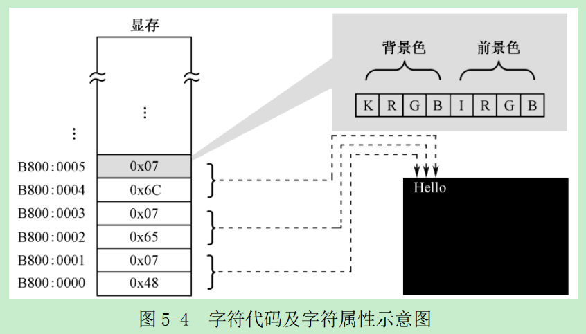
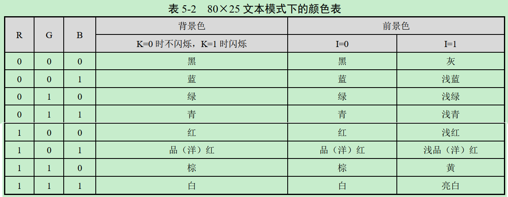
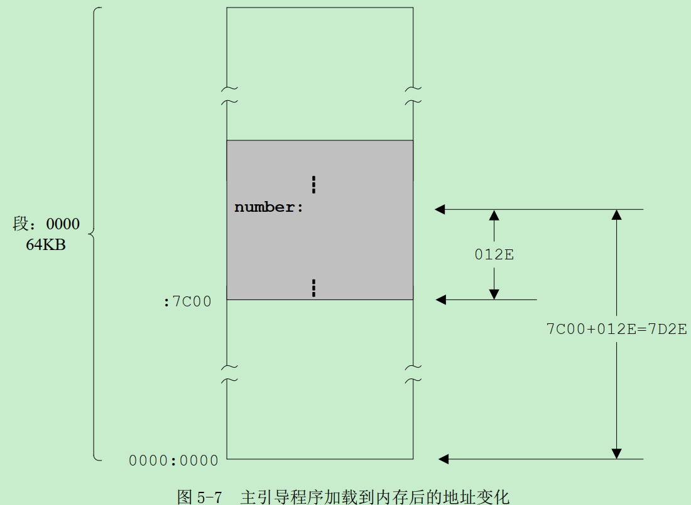
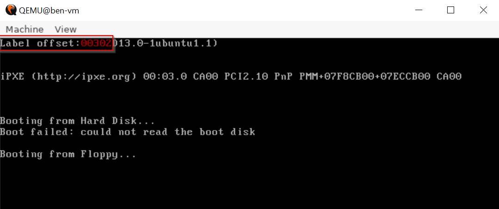

# 李忠《x86汇编语言：从实模式到保护模式》读书笔记

# 第2章 处理器、内存和指令


从上图中，注意区分代码中的指令(代表各种操作)、立即数(操作的对象)、内存地址(操作的对象)。

## 古老的Intel 8086处理器
* 8086如何处理程序的重定位问题？
   * 由于8086访问内存时使用了分段机制，代码中的地址就是段内偏移量(相当于相对地址)，所以天然支持重定位(段：偏移)，只需要更改段的内容就可以了。
   * 8086提供了两个段，分别是代码段(Code Segment, CS)寄存器和数据段(Data Segment, DS)寄存器。
* 8086重定位举例子
   * 假如物理地址00000H(20位)开始，一直到82251H处都被其他程序占用着，而后面一致到FFFFFH的地址空间都是自由的。那么你可以从物理内存地址82251H之后的地方加载你的程序
   * 定义段地址并设置处理器的段地址CS
      * 82260H是第一个符合条件的物理地址，因为它的偏移地址是0000H，段地址就是8226H。由此可看出8086是按16字节对齐的

# 第3章 汇编语言和汇编软件
## NASM编译器
理论上只要针对Intel处理器开发的软件，底层的机器指令代码都是相同的。但是仅仅具有一致的底层机器代码还远远不够，这些代码要被处理器来一次执行，首先需要加载到内存并实施重定位。因此，软件还需要一些额外的信息来告诉操作系统，如何加载自己。因为每个操作系统都会根据自身的工作特点，定义自己所能识别的软件可执行文件格式，而缺乏通用性。

# 第4章 虚拟机的安装和使用
## 计算机的启动过程
* 计算机的加电和复位
   * 对于8086，复位将使代码段寄存器CS的内容为0xFFFF，其他所有寄存器的内容都为0x0000，包括指令指针寄存器IP
* 基本输入输出系统
   * 8086内存排布
      
      * ROM占据着整个内存空间顶端的64KB，物理地址范围使0xF0000~0xFFFFF，里面固化了开机时要执行的指令
      * DRAM占据着较低端的640KB，地址范围时0x00000~0X9FFFF
      * 中间还有一部分分给了其他外围设备
   * 初始跳转
      * 8086加电复位时，它取的第一条指令位于物理地址FFFF:0000(物理地址0xFFFF0)，正好位于ROM中，哪里固化了开机时需要执行的指令。此指令时一个跳转指令，通过它改变CS和IP的内容，使处理器从ROM中的较低地址处开始取指令执行。
   * 执行ROM中的指令
      * ROM芯片中的内容包括很多部分，主要是进行硬件的诊断、检测和初始化，只针对哪些最基本的、对于使用计算机而言最重要的设备。
   * 从辅助存储设备读取指令数据
      * 当ROM-BIOS完成后，从辅助存储设备读取指令数据，然后转到哪里开始执行
* 一切从主引导扇区开始
   * 如果计算机的设置从硬盘启动，那么，ROM-BIOS将读取硬盘主引导扇区(0面0道1扇区)的内容，将它加载道内存地址0000:7c00(物理地址0x07c00)，然后用一个jmp指令跳转道那里接着执行。

# 第5章 编写主引导扇区代码
一段精心编写的主引导扇区代码将检测用来启动计算机的操作系统，并计算出它所在的硬盘位置。然后，它把操作系统的自举代码加载到内存，也用jmp指令跳转到那里继续执行，直到操作系统完全启动。

## 在屏幕上显示文字
[例子print_mbr](./code/mbr/print_mbr.asm)是在屏幕上打印“Label offset:”加上一个数字，这个数字是“number”的汇编地址。
### 显卡和显存
显卡的工作是周期性地从显存中提取比特位，并把它们按顺序显示在屏幕上<br>

   * 如果比特是“0”，则像素保持原来的状态不变，因为屏幕本来就是黑的
   * 如果比特是“1”，则点亮对应的像素
   * 如果是黑白色，一个比特位就够了。如果是真彩色，需要24个比特位，可显示2^24中颜色
文本模式和图形模式是显卡的两种基本工作模式<br>

为了方便访问显存，设计人员将显存映射到处理器可以直接访问的地址空间<br>
   
   * 例如8086可以访问1MB内存，其中，0x00000~0x9FFFF属于常规内存，有内存条提供；0xF0000~0XFFFFF有主板上的一个芯片提供，即ROM-BIOS。
   * 这样一来，中间还有一个320KB的空间，即0xA0000~0xEFFF。这段空间由特定的外围设备来提供，其中就包括显卡。
   * 加电自检之后，显卡会把自己初始化到文本模式，0xB8000~BFFFF这段物理空间留给显卡
### 初始化段寄存器
考虑到文本模式下显存的起始物理地址是0xB800，所以初始CS段寄存器为0xB800，偏移地址从0x0000延伸到0xFFFF。
访问内存可以使用段寄存器DS，也可以使用ES(extra segment)。
为了往显存中写数据，将ES寄存器设置为0xB800，可参考[print_mbr.asm](./code/mbr/print_mbr.asm)最开始两行
### 显存的访问和ASCII代码
屏幕上的每个字符对应着显存中的两个连续字节，前一个是字符的ASCII代码，后面是字符的显示属性，包括字符颜色和底色。如下图，字符"H"的ASCII代码是0x48，其显示属性是0x07；字符“e”的ASCII代码是0x65，其显示属性是0x07<br>

低4位是前景色，高4位是背景色。K是闪烁位(1是闪烁)，I是亮度位(1是高亮)<br>

下面的代码是在往显存中写入数据：
```nasm
;以下显示字符串"Label offset:"
mov byte [es:0x00],'L'
mov byte [es:0x01],0x07
mov byte [es:0x02],'a'
mov byte [es:0x03],0x07
...
```
其中关键字“byte”用来修饰目的操作数，指出本次传送是以字节的方式进行的。单次mov的传送宽度可以由目的操作数或源操作数来判断。但是这里的目的操作数是偏移地址“es::0x00”，它即可以是字节byte，也可以是word；而源操作数也无法判断长度。因此，这里必须用“byte”或“word”加以修饰。
### 显示标号的汇编地址
汇编地址是在源程序编译期间，编译器为每条指令确定的汇编位置，也就是每条指令相对于整个程序开头的偏移量，以字节计。当编译后的程序装入物理内存后，它又是该指令在内存段内的偏移地址。
* 如何给指令标号？
   * 有三种写法，其中near关键字是伪指令表示目标依然在当前代码段内：
      * 若jump后跟物理地址(即，段地址：偏移地址)，则jump的操作码是0xEA (直接转移指令)
      * 若jump后跟汇编地址，则jump的操作码是0xE9 (相对转移指令)
   ```
   infi: jmp near infi
   ```
   ```
   infi jmp near infi
   ```
   infi:
      jmp near infi
   ```
   ```
### 如何显示十进制数字
标号`number`位于[源程序](./code/mbr/print_mbr.asm)第100行。由于标号可用用来代表指令的汇编地址，所以可用通过`mov ax,number`将汇编地址传递到寄存器AX。
传送到寄存器AX的值是在源程序编译时确定的，在编译阶段，编译器会将标号number转换成立即数。编译后，number的汇编地址是0x012E，因此，这条上面的语句其实就是`mov ax,0x012E`。
* 在程序中声明并初始化数据，四种数据声明伪指令，数据不能超过伪指令所指示的大小
   * DB指令来声明字节Byte
   * DW用于声明字数据Word
   * DD用于声明双字Double Word
   * DQ用于声明四字Quad Word
* 分解数的各个位数
   * 程序第46行，div指令用DX:AX作为被除数，除以BX的内容，执行后得到的商在AX中，余数在DX中。因为除数是10，余数自然比10小，可从DL中取得
   * 第47行中，偏移地址并非理论上的“number+0x00”，而是0x7c00+number+0x00。这个0x7c00是从那里来的？
      * 标号number所代表的汇编地址，其数值是在源程序编译阶段确定的，而且是相对于整个程序的开头，从0开始计算的。主引导扇区代码是被加载到0x0000:0x7C00处，而非0x0000:0000。
      
### 显示分解出来的各个位数
经过上面5次除法操作，寄存器AX中的数分解成单独的数位，并存到DS指向的位置。为了将数字显示到屏幕上，从DS指向的数据段依次取出这些数位，并写入ES指向的附加段(显示缓冲区)。源程序第71行，将AL中的内容加上0x30，得到该数字对应的ASCII代码。

### 使程序进入无限循环状态
为了避免发生问题，源程序第98行，安排了一个无限循环：`infi: jmp near infi`。jmp是转移指令，用于使处理器脱离当前的执行序列，转移到指定的地方执行。关键字near表示目标位置依然在当前代码段内。
* 为什么不写成`jmp near 0x7c00+infi`?
   * 若jump后跟物理地址(即，段地址：偏移地址)，则jump的操作码是0xEA (直接转移指令)
   * 若jump后跟汇编地址，则jump的操作码是0xE9 (相对转移指令)

### 加载和运行主引导扇区代码
通过[Makefile](./code/mbr/Makefile)中的命令，可用生成启动镜像a.img，可用于bochs或者qemu虚拟机启动。`make && make qemu`运行结果如下：<br>
