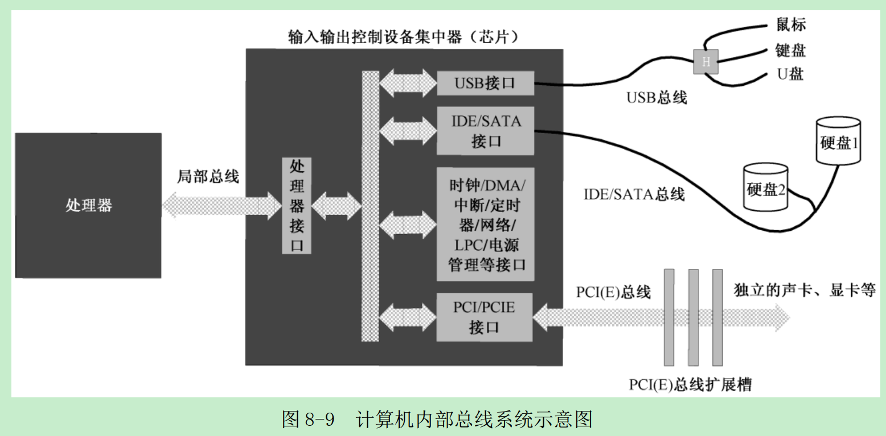
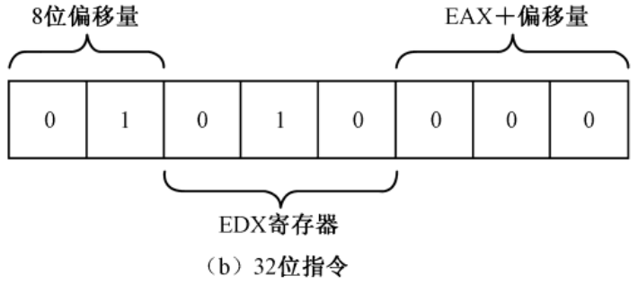
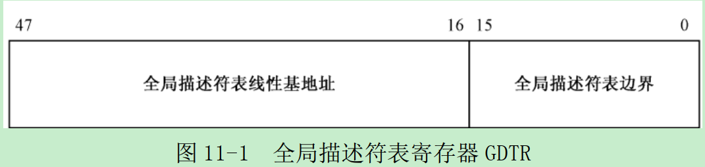
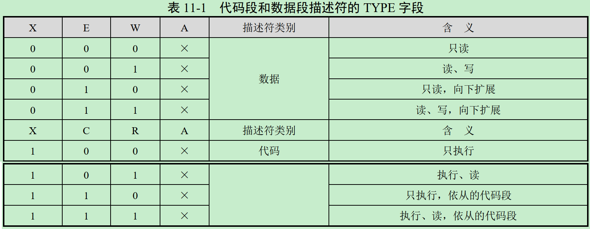

# 李忠《x86汇编语言：从实模式到保护模式》读书笔记

# 第2章 处理器、内存和指令


从上图中，注意区分代码中的指令(代表各种操作)、立即数(操作的对象)、内存地址(操作的对象)。

## 古老的Intel 8086处理器
* 8086如何处理程序的重定位问题？
   * 由于8086访问内存时使用了分段机制，代码中的地址就是段内偏移量(相当于相对地址)，所以天然支持重定位(段：偏移)，只需要更改段的内容就可以了。
   * 8086提供了两个段，分别是代码段(Code Segment, CS)寄存器和数据段(Data Segment, DS)寄存器。
* 8086重定位举例子
   * 假如物理地址00000H(20位)开始，一直到82251H处都被其他程序占用着，而后面一致到FFFFFH的地址空间都是自由的。那么你可以从物理内存地址82251H之后的地方加载你的程序
   * 定义段地址并设置处理器的段地址CS
      * 82260H是第一个符合条件的物理地址，因为它的偏移地址是0000H，段地址就是8226H。由此可看出8086是按16字节对齐的

# 第3章 汇编语言和汇编软件
## NASM编译器
理论上只要针对Intel处理器开发的软件，底层的机器指令代码都是相同的。但是仅仅具有一致的底层机器代码还远远不够，这些代码要被处理器来一次执行，首先需要加载到内存并实施重定位。因此，软件还需要一些额外的信息来告诉操作系统，如何加载自己。因为每个操作系统都会根据自身的工作特点，定义自己所能识别的软件可执行文件格式，而缺乏通用性。

# 第4章 虚拟机的安装和使用
## 计算机的启动过程
* 计算机的加电和复位
   * 对于8086，复位将使代码段寄存器CS的内容为0xFFFF，其他所有寄存器的内容都为0x0000，包括指令指针寄存器IP
* 基本输入输出系统
   * 8086内存排布
      
      * ROM占据着整个内存空间顶端的64KB，物理地址范围使0xF0000~0xFFFFF，里面固化了开机时要执行的指令
      * DRAM占据着较低端的640KB，地址范围时0x00000~0X9FFFF
      * 中间还有一部分分给了其他外围设备
   * 初始跳转
      * 8086加电复位时，它取的第一条指令位于物理地址FFFF:0000(物理地址0xFFFF0)，正好位于ROM中，哪里固化了开机时需要执行的指令。此指令时一个跳转指令，通过它改变CS和IP的内容，使处理器从ROM中的较低地址处开始取指令执行。
   * 执行ROM中的指令
      * ROM芯片中的内容包括很多部分，主要是进行硬件的诊断、检测和初始化，只针对哪些最基本的、对于使用计算机而言最重要的设备。
   * 从辅助存储设备读取指令数据
      * 当ROM-BIOS完成后，从辅助存储设备读取指令数据，然后转到哪里开始执行
* 一切从主引导扇区开始
   * 如果计算机的设置从硬盘启动，那么，ROM-BIOS将读取硬盘主引导扇区(0面0道1扇区)的内容，将它加载道内存地址0000:7c00(物理地址0x07c00)，然后用一个jmp指令跳转道那里接着执行。

# 第5章 编写主引导扇区代码
一段精心编写的主引导扇区代码将检测用来启动计算机的操作系统，并计算出它所在的硬盘位置。然后，它把操作系统的自举代码加载到内存，也用jmp指令跳转到那里继续执行，直到操作系统完全启动。

## 在屏幕上显示文字
[例子print_mbr](./code/mbr/mbr.asm)是在屏幕上打印“Label offset:”加上一个数字，这个数字是“number”的汇编地址。
### 显卡和显存
显卡的工作是周期性地从显存中提取比特位，并把它们按顺序显示在屏幕上<br>

   * 如果比特是“0”，则像素保持原来的状态不变，因为屏幕本来就是黑的
   * 如果比特是“1”，则点亮对应的像素
   * 如果是黑白色，一个比特位就够了。如果是真彩色，需要24个比特位，可显示2^24中颜色
文本模式和图形模式是显卡的两种基本工作模式<br>


为了方便访问显存，设计人员将显存映射到处理器可以直接访问的地址空间<br>
   
   * 例如8086可以访问1MB内存，其中，0x00000-0x9FFFF属于常规内存，有内存条提供；0xF0000-0XFFFFF有主板上的一个芯片提供，即ROM-BIOS。
   * 这样一来，中间还有一个320KB的空间，即0xA0000~0xEFFF。这段空间由特定的外围设备来提供，其中就包括显卡。
   * 加电自检之后，显卡会把自己初始化到文本模式，0xB8000~BFFFF这段物理空间留给显卡
### 初始化段寄存器
考虑到文本模式下显存的起始物理地址是0xB800，所以初始CS段寄存器为0xB800，偏移地址从0x0000延伸到0xFFFF。
访问内存可以使用段寄存器DS，也可以使用ES(extra segment)。
为了往显存中写数据，将ES寄存器设置为0xB800，可参考[mbr.asm](./code/mbr/mbr.asm)最开始两行
### 显存的访问和ASCII代码
屏幕上的每个字符对应着显存中的两个连续字节，前一个是字符的ASCII代码，后面是字符的显示属性，包括字符颜色和底色。如下图，字符"H"的ASCII代码是0x48，其显示属性是0x07；字符“e”的ASCII代码是0x65，其显示属性是0x07<br>


低4位是前景色，高4位是背景色。K是闪烁位(1是闪烁)，I是亮度位(1是高亮)<br>


下面的代码是在往显存中写入数据：
```nasm
;以下显示字符串"Label offset:"
mov byte [es:0x00],'L'
mov byte [es:0x01],0x07
mov byte [es:0x02],'a'
mov byte [es:0x03],0x07
...
```
其中关键字“byte”用来修饰目的操作数，指出本次传送是以字节的方式进行的。单次mov的传送宽度可以由目的操作数或源操作数来判断。但是这里的目的操作数是偏移地址“es::0x00”，它即可以是字节byte，也可以是word；而源操作数也无法判断长度。因此，这里必须用“byte”或“word”加以修饰。
### 显示标号的汇编地址
汇编地址是在源程序编译期间，编译器为每条指令确定的汇编位置，也就是每条指令相对于整个程序开头的偏移量，以字节计。当编译后的程序装入物理内存后，它又是该指令在内存段内的偏移地址。
* 如何给指令标号？
   * 有三种写法，其中near关键字是伪指令表示目标依然在当前代码段内：
      * 若jump后跟物理地址(即，段地址：偏移地址)，则jump的操作码是0xEA (直接转移指令)
      * 若jump后跟汇编地址，则jump的操作码是0xE9 (相对转移指令)
   ```nasm
   infi: jmp near infi
   infi jmp near infi
   infi:
      jmp near infi
   ```
### 如何显示十进制数字
标号`number`位于[源程序](./code/mbr/mbr.asm)第100行。由于标号可用用来代表指令的汇编地址，所以可用通过`mov ax,number`将汇编地址传递到寄存器AX。
传送到寄存器AX的值是在源程序编译时确定的，在编译阶段，编译器会将标号number转换成立即数。编译后，number的汇编地址是0x012E，因此，这条上面的语句其实就是`mov ax,0x012E`。
* 在程序中声明并初始化数据，四种数据声明伪指令，数据不能超过伪指令所指示的大小
   * DB指令来声明字节Byte
   * DW用于声明字数据Word
   * DD用于声明双字Double Word
   * DQ用于声明四字Quad Word
* 分解数的各个位数
   * 程序第46行，div指令用DX:AX作为被除数，除以BX的内容，执行后得到的商在AX中，余数在DX中。因为除数是10，余数自然比10小，可从DL中取得
   * 第47行中，偏移地址并非理论上的“number+0x00”，而是0x7c00+number+0x00。这个0x7c00是从那里来的？
      * 标号number所代表的汇编地址，其数值是在源程序编译阶段确定的，而且是相对于整个程序的开头，从0开始计算的。主引导扇区代码是被加载到0x0000:0x7C00处，而非0x0000:0000。
      

### 显示分解出来的各个位数
经过上面5次除法操作，寄存器AX中的数分解成单独的数位，并存到DS指向的位置。为了将数字显示到屏幕上，从DS指向的数据段依次取出这些数位，并写入ES指向的附加段(显示缓冲区)。源程序第71行，将AL中的内容加上0x30，得到该数字对应的ASCII代码。

### 使程序进入无限循环状态
为了避免发生问题，源程序第98行，安排了一个无限循环：`infi: jmp near infi`。jmp是转移指令，用于使处理器脱离当前的执行序列，转移到指定的地方执行。关键字near表示目标位置依然在当前代码段内。
* 为什么不写成`jmp near 0x7c00+infi`?
   * 若jump后跟物理地址(即，段地址：偏移地址)，则jump的操作码是0xEA (直接转移指令)
   * 若jump后跟汇编地址，则jump的操作码是0xE9 (相对转移指令)

### 加载和运行主引导扇区代码
通过[Makefile](./code/mbr/Makefile)中的命令，可用生成启动镜像a.img，可用于bochs或者qemu虚拟机启动。`make && make qemu`运行结果如下：<br>


# 第6章 相同的功能，不同的代码
本章介绍三种不同的程序流程控制方法(参见[例子](./code/mbr2))，实现上一章(参见[例子](./code/mbr))一样的程序功能。

## 跳过非指令的数据区
```nasm
6:   jmp near start
7:
8:   mytext db 'L',0x07,'a',0x07,'b',0x07,'e',0x07,'l',0x07,' ',0x07,'o',0x07,\
9:            'f',0x07,'f',0x07,'s',0x07,'e',0x07,'t',0x07,':',0x07
10:  number db 0,0,0,0,0
```
* 跳转指令`jmp near start`
   * 源程序第8行和第10行声明了非指令的数据，通过第6行的跳转指令，越过这些不可执行的数据，转移到后面的代码出执行。
* 在数据声明中使用字面值
   * 源程序第8行和第9行，将字面值用数据声明，便于修改

## 段之间的批量数据传送
两个指令可用于把数据从内存中的一个地方批量地传动到另一个地方。原始数据串的地址由DS:SI指定，要传送的目的地址由ES:DI指定，传送的字节数由CX指定。
* `rep movsb` - 以字节为单位
* `rep movsw` - 以字为单位

## 使用循环分解数位
循环依赖的使循环指令loop，可参见程序的第37行，处理器在执行loop指令时会做两件事：
* 将寄存器CX的内容减一
* 如果CX的内容不为零，转到指定的位置处执行，否则顺序执行后面的指令

对比存储数位的两种不同形式：
* 通过BX寄存器，相对地址存储
```nasm
  digit: 
         xor dx,dx
         div si
         mov [bx],dl                   ;保存数位
         inc bx 
         loop digit
```
* 以绝对地址存储，需要加上数据段地址0x7c00
   * 通过反汇编可看出，`mov [0x7c00+number+0x01],dl`是内存的绝对地址
```nasm
         ;求个位上的数字
         mov dx,0
         div bx                        ;被除数是dx:ax，除数是bx，执行后，余数存到dx中，商存到ax中
         mov [0x7c00+number+0x00],dl   ;保存个位上的数字

         ;求十位上的数字
         xor dx,dx
         div bx
         mov [0x7c00+number+0x01],dl   ;保存十位上的数字
```

## 数位的显示
```nasm
   show:
         mov al,[bx+si]
         add al,0x30
         mov ah,0x04
         mov [es:di],ax
         add di,2
         dec si
         jns show
```
`jns show`的意思是，如果未设置符号位，则转移到“show”所在的位置处执行。标志寄存器里有符号位SF，dec指令会影响到该位。如果计算结果的最高位不是0，则SF置1。因此，`dec si`指令在SI的内容变负的时候，循环退出。

## NASM编译器的$和$$标记
* $是当前行的汇编地址
* $$是当前汇编节的其实汇编地址，如果没定义节或段，就默认自成一个汇编段，起始汇编地址是0
程序第53行`jmp near $`是一个无限循环，相当于`infi: jmp near infi`。

## 运行结果


## 堆栈
不同与前面的例子，用堆栈的方法将寄存器中的数字显示在屏幕上。

和代码段、数据段一样，堆栈被定义成一个内存段，有段寄存器SS指向。压栈和出栈只能在一端进行，所以需要用堆栈指针寄存器SP来指示下一个数据应当压入堆栈内的什么位置，或数据从那里出栈。

此例子的内存排布如下：<br>

* 总内存1MB，物理地址0x00000~0xFFFFF
* 假定数据段长度是64KB，物理地址0x07C00~0x17BFF，对应逻辑地址是：0x07C0:0x0000~0x07C0:0xFFFF
* 代码段和堆栈段是同一段，0x00000~0x0FFFF

# 第7章 8086处理器
## 8086寄存器类型

* AX寄存器
   * 累加器Accumulator，与它有关的指令还会做指令长度上的优化
* BX寄存器
   * 基址寄存器Base Address，提供偏移地址
* CX寄存器
   * 计数器Counter
* DX寄存器
   * 数据寄存器Data，除了作为通用寄存器使用外，还专门用于和外设之间进行数据传送
* SI寄存器
   * 源索引寄存器Source Index
* DI寄存器
   * 目标索引寄存器Destination Index，用于数据传送操作

## 8086标志位
* 符号标志位SF - Sign Flag
* 奇偶标志位PF
   * 如果运算结果低8位中，由偶数个为1的比特，则PF=1
* 进位标志位CF
   * 如果最高位由向前进位或借位的情况发生，则CF=1
* 溢出标志OF
   * 如果结果超出了目标操作数所能容纳的范围，OF=1
### 现有指令对标志位的影响

### 条件转移指令


## 8086寻址方式

8086有多种寻址方式：
* 寄存器寻址
   * 指令执行时，操作的数位于寄存器中
   * `mov ax,cx`，`inc dx`
* 立即寻址
   * 指令的操作数时一个立即数
   * `add bx,0xf000`，`mov dx,label_a`
* 内存寻址
   * 直接寻址
      * 操作数是一个偏移地址，而且给出了该偏移地址的具体数值
      * `mov ax,[0x5c0f]` - 处理器将数据段寄存器DS的内容左移4位，加上0x5c0f，形成20位物理地址
      * `add word [0x0230],0x5000`
      * `xor byte [es:label_b],0x05`
   * 基址寻址
      * 指令的地址部分使用基址寄存器BX或BP来提供偏移地址
      * `buffer dw 0x20,0x100,0x0f,0x300,0xff00`
      * `mov [bx],dx` - 目的操作数采用了基址寻址，处理器将数据段寄存器DS的内容左移4位，加上基址寄存器BX中的内容
      * `add byte [bx],0x55`
      * `mov ax,[bp]` - 处理器将栈段寄存器SS的内容左移4位，加上寄存器BP的内容，形成20位的物理地址
   * 变址寻址
      * 使用变址寄存器SI和DI
      * `mov [si],dx` - 处理器将数据段寄存器DS的内容左移4位，加上变址寄存器SI中的内容
      * `and byte [di+label_a],0x80`
   * 基址变址寻址
      * 使用基址变址的操作数可用使用一个基址寄存器(BX或者BP)，外加一个变址寄存器(SI或者DI)
      * `mov ax,[bx+si]` - 处理器把数据段寄存器DS的内容左移4位，加上基址寄存器BX的内容，再加上变址寄存器SI的内容，通过形成了20位的物理地址
      * `add word [bx+di],0x3000`

# 第8章 硬盘和显卡的访问与控制
本章把主引导扇区改造成一个程序加载器，加载用户程序，并执行该程序。

## 用户程序的结构
### 分段、段的汇编地址和段内汇编地址
一个规范的程序，应当包括：
* 代码段
* 数据段
* 附加段
* 堆栈段

NASM如何定义段？
* `SECTION 段名称` 或者 `SEGMENT 段名称`
* 一旦定义段，后面的内容属于该段，除非又出现另一个段的定义
* NASM编译器不关心段的用途，段只用来分隔程序中的不同内容
* NASM对段的数量没有限制，一个程序可拥有不止一个代码段和数据段
* Intel处理器要求段在内存中的起始物理地址是16字节对齐的，在段定义中使用`align=`指定某个SECTION的汇编地址对齐方式

如何取得每个段的汇编起始地址？
* `section.段名称.start`

如何计算段内标号的汇编地址？
* 如果段定义中有`vstart=0`，例如[program.asm](./code/load/program.asm)中的`SECTION code_1 align=16 vstart=0`,
   * 则此段内的标号是相对与段data起始处的长度，而不是从程序头开始计算
* 如果段定义中没有`vstart=0`，例如[program.asm](./code/load/program.asm)中的`SECTION trail align=16`,
   * 则此段内的标号从整个程序开头计算，如，`program_end`标号

## 加载器是如何加载用户程序


加载器必须与用户之间有一个固定的协议，比如，在用户程序内部的某个固定位置，包含一些基本的结构信息，每个用户程序都必须把自己的情况放在这里，而加载器也固定在这个位置读取。一般这个位置就是用户程序头部，例如[program.asm](./code/load/program.asm)中的`SECTION header vstart=0`段。

### 用户程序头
用户程序头一般包括下面的信息：
* 用户程序的尺寸
```nasm
program_length  dd program_end          ;程序总长度[0x00]
```
   * 以字节位单位，加载器需要根据这一信息来决定读取多少个逻辑扇区
   * 伪指令dd用于声明和初始化一个双字，即32位数据
* 应用程序的入口点，包括段地址和偏移地址
```nasm
;用户程序入口点
code_entry      dw start                ;偏移地址[0x04]
                  dd section.code_1.start ;段地址[0x06]
```
* 段重定位表
```nasm
realloc_tbl_len dw (header_end-code_1_segment)/4
                                          ;段重定位表项个数[0x0a]
;段重定位表
code_1_segment  dd section.code_1.start ;[0x0c]
code_2_segment  dd section.code_2.start ;[0x10]
data_1_segment  dd section.data_1.start ;[0x14]
data_2_segment  dd section.data_2.start ;[0x18]
stack_segment   dd section.stack.start  ;[0x1c]
```
   * 加载器需要知道每个段在用户程序内的位置

### 加载器
加载器需要加载一个用户程序，并使之开始执行，需要决定两件事情：
* 看看内存中的什么地方是空闲的，即从哪个物理内存地址开始加载用户程序
* 用户程序位于硬盘上的什么位置，它的起始逻辑扇区号是多少

[加载器例子](./code/load/mbr.asm)中，先用伪指令equ声明了以给常量。和其他伪指令db、dw、dd不同，用equ声明的数值不占用任何汇编地址，也不再运行时占用任何内存位置。


加载器需要做以下的工作：
* 初始化工作
   * 设置栈，代码行12~14
* 加载用户程序到内存
   * 定位内存加载位置，修改DS的值，代码行16~21
   * 从磁盘扇区中读入数据，通过read_hard_disk_0调用完成
* 重定位
   * 重定位程序入口段地址
   * 重定位重定位表中的各段
* 跳转到用户程序入口函数

### 用户程序
[加载器](./code/load/mbr.asm)将权限转交给[用户程序](./code/load/program.asm)入口函数`start`后，用户程序开始执行自己的逻辑：
* 设置栈顶SS:SP，指向自己的栈
* 设置自己的数据段寄存器DS，指向自己的数据段
* 保持ES不变，指向header段，用于从header段中找到其他段的段地址
* 时刻注意代码段寄存器CS的值，如果要切换代码段，要注意改变CS的值

将加载器二进制文件mbr.bin写入VHD硬盘的扇区0，将用户程序二进制文件program.bin写入VHD硬盘的扇区100，运行虚拟机可得到以下输出：<br>


## I/O端口和端口访问
不可能将所有的I/O接口直接和处理器相连，设备那么多，还有些设备现在没有发明出来，将来一定会有。你怎么办？即如何扩展？
* 采用总线技术，I/O设备和总线打交道，总线再和处理器打交道，增加一层抽象

每个设备的I/O接口都抢着和处理器说明，不发生冲突都难。你怎么办？即如何解决I/O访问的冲突问题？
* 输入输出控制设备集中器(I/O Controller Hub, ICH)

   * 协调各个I/O接口对处理器的访问，即南桥
   * 处理器想和某个设备说话时，ICH会接到通知，然后它负责提供相应的传输通道和其他辅助支持，并命令其他所有无关设备闭嘴

处理器通过端口(Port)来和外围设备打交道。本质上，端口就是一些寄存器，类似于处理器内部的寄存器。不同之处在于，这些叫做端口的寄存器位于I/O接口电路中。每个I/O接口都可能拥有好几个端口。

CPU如何方法各种端口和外围设备通信？

* CPU有两种方式访问外围设备
   * 端口号映射到内存地址空间，比如显卡的访问
   * 端口时独立编址的，不和内存发生关系
      * 如上图中，M/IO#低电平时，CPU访问I/O端口；而其高电平时，访问内存
      * 以PATA/SATA接口为例，其被分配了8个端口。ICH芯片内部通常集成了两个PATA/SATA接口，分别时主硬盘接口和副硬盘接口。主硬盘接口分配的端口号是：0x1f0-0x1f7。副硬盘接口分配的端口号是0x170-0x177

独立编址访问IO设备的方式是什么？
* in指令从端口读
   * `in al,dx`或者`in ax,dx`，8位用al，16位用ax
   * `in al,0xf0`或者`in ax,0x03`，操作源是一字节立即数，只能访问0~255号端口
* out指令写端口
   * 目的操作数可用是8位立即数或寄存器DX，操作源必须是寄存器AL或者AX
   ```nasm
   out 0x37,al       ;写0x37号端口
   out 0xf5,ax       ;写0xf5号端口
   out dx,al         ;8位端口，端口号在DX中
   out dx,ax         ;16位端口，端口号在DX中
   ```

如何读取硬盘上的数据？
* 两种模式
   * CHS模式
      * 磁头号，柱面号和扇区号访问，比较原始
   * LBA28模式
      * 同一编址，从扇区0开始
      * LBA28用28比特来表示逻辑扇区号
* LBA28读取一个扇区的步骤
   * 设置访问扇区地址
      * 通过端口0x1f2设置读取扇区数
      * 通过端口0x1f3，0x1f4，0x1f5设置24位逻辑扇区号
      * 通过端口0x1f6设置LBA模式
   * 发送读命令
      * 通过端口0x1f7设置读操作
   * 等待读命令完成
      * 通过轮询端口0x1f7的第7位，等待读操作完成
   * 从数据端口读入数据到数据段
      * 通过数据端口0x1f0，读取512字节的数据到由段寄存器DS指定的数据段，偏移地址由寄存器BX指定
   * 检测错误
      * 通过0x1f1端口，可用检测最后一次执行命令的状态

## 8086有几种调用方式
8086支持四种调用方式：
* 16位相对近调用(操作码0xE8)
```nasm
call near proc_1  ;near是关键字，可用省略
call proc_1       ;标号proc_1会按照一定的规则计算，存入机器码，操作码需要能通过它正确找到调用地址
call 0x0500       ;0x0500直接存入机器码，用于计算调用地址
```
   * 相对调用：指当前call指令相对于目标过程的偏移量
      * 偏移量的计算过程是：用目标过程的汇编地址减去当前call指令的汇编地址，再减去当前call指令以字节为单位的长度(3)，例如上面的“proc_1”处的汇编地址减去本指令的汇编地址，在减去3，作为机器指令的操作数
   * 近调用：指被调用的目标过程位于当前代码段内
* 16位间接绝对近调用(操作码0xFF)
```nasm
call cx           ;目标地址在CX中，省略了关键字near
call [0x3000]
call [bx+si+0x02]
```
   * 指令中的操作数不是偏移量，而是被调用过程的真实偏移地址，故称为绝对地址
   * 只能段内调用
* 16位直接绝对远调用(操作码0x9A)
```nasm
call 0x2000:0x0030
```
   * 上面指令的机器码为`9A 30 00 00 20`，后面跟着的连个字分别是偏移地址(在前)和段地址(在后)
* 16位间接绝对远调用
```nasm
call far [0x2000]
call far [proc_1]   ;proc_1 dw 0x0102,0x2000
call far [bx]
call far [bx+si]
```
   * 必须给出被调用过程的段地址和偏移地址

## 8086有几种跳转方式
* 相对短转移(操作码0xEB)
```nasm
jmp short infinite
```
   * 只允许转移到距离当前指令-128~127字节的地方
   * short关键字不能省略
   * 编译器会检查标号infinite所代表的值，如果数值超过了一字节所能允许的数字范围，会报错
* 16位相对近转移(操作码0xE9)
```nasm
jum near infinite
jmp near 0x3000
```
   * 因为是近转移，属于段内转移，指令长度是3
   * 编译器用目标位置的汇编地址减去当前指令的汇编地址，再减去当前指令的长度(3)，保留16位的结果
* 16位间接绝对近转移
```nasm
jmp near bx
jmp near cx
jmp [jump_dest]      ;jump_dest dw 0xc000, 省略了near
jmp [bx]
jmp [bx+si]
```
   * 目标地址不是再指令中直接给出的，而是用一个16位的通用寄存器或者内存地址来间接给出的
   * 以上两条指令用BX或者CX的内容来取代指令指针寄存器IP的当前内容
* 16位直接绝对远转移(操作码是0xEA)
```nasm
jmp 0x0000:0x7c00    ;段地址：偏移地址
```
* 16位间接绝对远转移
```nasm
jmp far [jump_far]   ;jump_far dw 0x33c0,0xf000
jmp far [0x40]
```
   * 指向这条指令后，访问段寄存器DS所指向的数据段，从指令中给出的偏移地址处取出两个字，分别用来替代段寄存器CS和指令指针寄存器IF的内容

## 如何读取磁盘上的用户代码到内存
通过例子中`read_hard_disk_0`的调用栈，实现了对一个扇区的读取，其调用时的栈内存如下：


将用户程序从扇区中读到`phy_base`的内存位置后，需要对用户程序重定位：


# 第9章 中断和动态时钟显示

## 外部硬件中断
当外部设备发生错误，或者又数据要传送，或者处理器给它的事情处理完了，它们都会产生中断。外部中断有两种类型：
* 非屏蔽中断(Non Maskable Interrupt, NMI)
   * NMI被赋予了统一的中断号2，没有再细分。因为NMI发生了，通常只能让专业人员来修理
   * NMI中断不会从外部获得中断号，它自动生成中断号2
* 可屏蔽中断(INTR)
   * 通过中断代理8259芯片对来自外部设备的中断进行仲裁
   * Intel处理器允许256个中断，8259负责提供其中的15个，这15个设备都是相当重要的，如键盘和鼠标、串行口、并行口、软磁盘驱动器、IDE硬盘等<br>
   
   * CPU内部有一个中断标志IF，通过指令cli和sti可改变IF
   * 8259会记住陆续到来的中断，按照优先级传送给CPU

### 中断向量表(Interrupt Vector Table, IVT)
在实模式下，处理器要求将中断处理程序的入口点集中存放在内存中从物理地址0x00000开始，到0x003ff结束，共1KB的空间。<br>

* 每个中断在中断向量表占2个字(32 bytes)
* 当发生中断时，8259芯片会把对应的中断号告诉处理器，处理器会做以下几件事
   * 保护断点的现场
      * 将标志寄存器FLAGS压栈，清楚它的IF位和TF位。TF时陷阱标志。由于IF标志被清除，在中断处理过程中，处理器将不再响应硬件中断
      * 将当前的代码段寄存器CS和指令指针寄存器IP压栈
   * 执行中断处理程序
      * 根据中断号，从IVT中找到中断程序的偏移地址和段地址(中断号乘以4)，并分别送到IP和CS中
   * 返回到断点接着执行
      * 所有中断最后一句都是iret。这将导致处理器一次从栈中弹出IP、CS和FLAGS的原始内容
* 中断向量表的建立和初始化工作由BIOS在计算机启动时负责
* 当计算机启动后，操作系统会根据自己的需求，修改某些中断的入口地址

## 内部中断
当处理器检测到div或者idiv指令的除数为零时，产生中断0。遇到非法指令，产生中断6。这些都是内部中断

## 软中断
软中断是由int指令引起的中断处理。int指令的格式如下：
```nasm
int3     ;int3不是int 3，它的指令码是CC，用于调试，GDB的调试就是用的这个指令
int imm8 ;imm8是8bit立即数的意思，int 3的指令码是:CD 03
into     ;溢出中毒指令，机器码为0xCE。如果标识寄存器的OF是1，则产生4号中断；否则什么都不做
```

### 常用的BIOS中断
可以为所有的中断类型自定义中断处理过程，包括内部中断、硬件中断和软中断。
最有名的软中断时BIOS中断，之所以称为BIOS中断，是因为这些中断功能是在计算机加电之后，BIOS程序执行期间建立起来的。换句话说，这些中断功能和执行主引导扇区之前，就已经可以使用了。

BIOS中断，又称BIOS功能调用，主要是为了方便地使用最基本的硬件访问功能。不同的硬件使用不同的中断号，比如，使用键盘服务时，中断号是0x16。例如以下指令用于从键盘读取一个按键：
```nasm
mov ah,0x00
int 0x16       ;键盘服务，返回时，字符代码已经在寄存器AL中
```

以下是BIOS的功能调用中断列表:


BIOS是怎么建立起这套调用中断的？
* 一些简单的外围设备，BIOS自己提供
* 对于一些复杂的外围设备，由外部设备的ROM自己提供
   * 在计算机启动期间，BIOS程序会以2KB为单位搜索内存地址C0000~E0000之间的区域，注意此区域已经映射到了某些外围设备的ROM，如显卡
   * 当发现某个区域的头两个字节是0x55和0xAA，那意味着该区域有ROM代码存在
   * 如果ROM代码有效，由外围设备自带的程序指令初始化外部设备，最后填写相关的中断向量表，使它们指向自带的中断处理过程


## 如何编写一个加载器？
代码可参见例子["load"](./code/load)，其通过加载器[“mbr.asm”](./code/load/mbr.asm)加载一个屏幕打印程序[“program.asm”](./code/load/program.asm)，并运行此程序在屏幕上显示字符。

加载器的实现：
* 目的
   * 讲用户程序加载到内存指定位置，修改用户程序的重定位表，最后将权限转交给用户程序
* 过程
   * 读取用户程序头中的信息，包括程序大小
   * 根据程序大小，将整个程序从硬盘读入内存指定位置
   * 处理重定位表，将各段的正确段基址写入重定位表
   * 最后将权限交给用户程序

## 如何编写一个外部中断程序？
代码可参见例子["extern_int"](./code/extern_int)，其通过加载器加载一个外部时钟中断程序，在屏幕上显示运行的时钟。

外部中断程序的实现：
* 目的
   * 被加载器加载后，使能时钟RTC中断，中断到来后进入中断程序，执行完中断程序后，循环等待下一个中断
* 过程
   * 首先，程序必须编写加载器认识的程序头。加载器完成加载工作后，用户程序的入口函数开始执行
   * 初始化寄存器和栈空间
   * 修改中断向量表中的中断处理程序入口地址
      * 实模式下中断向量表IVT有1KB空间(从0x0地址开始)，一共256个中断，每个中断4bytes(2bytes偏移地址+2bytes段地址)
      * 结合硬件连接图，找到需要处理的中断号。如RTC芯片的终端号默认是0x70，因此修改0x70中断号在IVT中的内容
   * 设置RTC的工作状态，使它能够产生中断信号
      * RTC配置的一般步骤
         * 通过0x70端口，索引需要配置的寄存器
         * 通过0x71端口，写入数据配置上面索引的寄存器
      * 通过寄存器B配置RTC中断
      * 通过寄存器C复位现有中断状态
   * 打开中断
      * 配置8259中断芯片，允许RTC中断传到CPU
   * 显示完信息后，进入低功耗状态等待中断
   * 中断处理程序
      * 保护现场
      * 阻断RTC中断
      * 处理中断
      * 开放RTC中断
      * 清楚8259中断标志，表示中断结束
      * 恢复现场

## 如何编写一个内部中断程序？
代码可参见例子["internal_int"](./code/internal_int), 其通过加载器加载一个内部BIOS中断程序，读取键盘字符，并显示在屏幕上。

内部中断程序的实现：
* 目的
   * 通过BIOS中断处理程序，实现屏幕显示字符和键盘读取字符
* 过程
   * 统一的程序头
   * 初始化寄存器和栈
   * 利用BIOS中断0x10的0x0e号显示字符，通过`int 0x10`触发中断，字符显示中断程序被调用
   * 利用BIOS中断0x16的0x00号从键盘读字符，通过`int 0x16`触发中断

# 32位保护模式
在32位模式下，处理器要求在加载程序时，先定义该程序所拥有的段，然后 允许使用这些段。定义段时，除了基地址(起始地址)
外，还附加了段界限、权限级别、类型等属性。当程序访问一共段时，处理器将用固件实施各种检查工作，以防止对内存的违规访问。在32位模式下，传统的段寄存器，如CS、SS、DS、ES保存的不再是16位段基地址，而是段的选择子，用于选择所要访问的段。因此，严格地说，它的新名字叫做段选择器。除了段选择器之外，每个段寄存器还包括一个64位的不可见部分，称为描述符告诉缓存器，里面有段的基地址和各种访问属性。这个部分程序不可访问，由处理器自动使用。


## 线性地址
传统的段地址加偏移量的寻址方式会产生内存的内部碎片，IA-32支持分页功能，将物理内存空间划分成逻辑上的页，解决了内部碎片的问题。下图是开启页功能后，CPU的段部件(产生段寻址方式的20位物理地址)产生的地址就不再是物理地址了，而是线性地址(Linear Address)，线性地址还要经页部件转换后，才是物理地址。


线性地址的概念用来描述任务的地址空间。如上图，IA-32处理器上的每个任务都拥有4GB的虚拟内存空间，这是一段长4GB的平坦空间，就像一段平直的线段，因此叫线性地址空间。相应地，由段部件产生的地址，就对应着线性地址空间上的每一个点，这就是线性地址。

## 寻址方式
### 16位处理器的内存寻址方式

上图是16位处理器的内存寻址方式。允许使用基址寄存器BX或者BP，同变址寄存器SI或者DI结合，再加上8位或者16位偏移量来寻址内存操作数。

### 32位处理器的内存寻址方式

指定有效地址可以使用全部的32位通用寄存器作为基址寄存器。同时，还可以再加上一个除ESP之外的32位通用寄存器作为变址寄存器。变址寄存器还允许乘以1、2、4或者8作为比例因子。最后，还允许加上一个8位或者32位的偏移量。
```nasm
add eax,[0x2008]     ;有效地址为0x00002008
sub eax,[eax+0x08]   ;有效地址是32位
mov ecx,[eax+ebx*8+0x02]   ;有效地址是32位的
```

## 指令码解析
### 16位指令码
以`mov dx,[bx+si+0x02]`为例子，其机器码是`8B 50 02`
* 8B - 内存单元到寄存器的传送指令
* 50 - 寻址方式和操作数类型<br>
   
   * 7~6bit 01 - 使用了基地址变址的寻址方式，而且带有8位偏移量
   * 5~3bit 010 - 目的操作数为寄存器DX
   * 2~0bit 000 - 寻址方式为“BX+SI+8位偏移量”
* 02 - 1字节偏移，即指令中的0x02

### 32位指令码
上面的16位指令，对应的32位指令是`mov edx,[eax+0x02]`。由下图可知，其寻址方式变成了"EAX+8位偏移量"，



```nasm
bits 16
mov cx,dx ;89 D1
mov eax,ebx ;66 89 D8

bits 32
mov cx,dx ;66 89 D1
mov eax,ebx ;89 D8
```
编译器提供了伪指令bits，来指定其后的指令应该被编译成16位的，还是32位的，默认是16位的。

## 常见汇编指令
[汇编指令大全](https://www.cnblogs.com/technology/archive/2010/05/16/1736782.html)

## 高速缓存
寄存器的速度是最快的，原因在于它使用了触发器(ns级别)，如果用来作为存储单元即静态存储器(SRAM)。速度快，但成本高。动态存储器DRAM一般是电容和单个的晶体管组成，由于电容需要定时刷新，使得它的访问速度变慢，通常是十几个纳秒。高速缓存利用局部性原理，保证了命中率，如果没有命中，会以块为单位，将所需数据的邻近内容都转载进来。

## 如何加快指令执行
策略：流水线操作
* 取指令
* 译码
* 寄存器分配和重命名
* 微操作排序
* 执行
* 隐退

### 乱序执行
策略：通过将指令细分，使之能更好地pipeline

为了实现流水线技术，需要将指令拆分成更小的可独立执行部分，即拆分成微操作。比如：`add eax,[mem]`可以拆分成两个微操作，一个用于从内存中读取数据并保存到临时寄存器，另一个用于将EAX寄存器和临时寄存器中的数值相加。一旦将指令拆分成微操作，处理器就可以在必要的时候乱序执行(Out-Of-Order Execution)程序。

```nasm
mov eax,[mem1]
shl eax,5
add eax,[mem2]
mov [mem3],eax
```
上例中，`add eax,[mem2]`可以拆分为两个微操作。如此一来，在执行逻辑左移指令的同时，处理器可以提前从内存中读取mem2的内容。典型地，如果数据不在高速缓存中，那么处理器子啊获取mem1的内容之后，会立即开始获取mem2的内容，与此同时，shl指令的执行早就开始了。

将指令拆分成微操作，也可以使得堆栈的操作更有效率。例如以下代码：
```nasm
push eax
call func
```
这里的`push eax`指令可以拆分成两个微操作，即可以表述为：
```nasm
sub esp,4
mov [esp],eax
```
因此，即使EAX寄存器的内容还没有准备好，微操作`sub esp,4`也可以执行。

### 寄存器重名
策略：利用临时寄存器，作为某个正在操作的通用寄存器的替补，提前完成后续动作

```nasm
mov eax,[mem1]
shl eax,3
mov [mem2],eax
mov eax,[mem3]
add eax,2
mov [mem4],eax
```
通过临时寄存器代替后三句指令的运行，可并行执行加速

### 分支目标预测
随着复杂架构下的流水线变得越来越长，程序分支带来的问题开始变大，造成不处理器无法预测后续步骤，不命中次数越来越多。在1996年的Pentium Pro处理器上，引入了分支预测技术(Branch Prediction)。核心问题是，转移时发生还是不会发生。

例如，`jne branch5`这条指令还没有执行的时候，处理器就必须提前预测相等的条件在这条指令执行的时候是否成立。从统计学的角度来看，有些事情一旦出现，下一次还会出现的概率较大。当jne指令第一次执行时，转移一定会发生。那么，处理器就可以预测，下一次它还会转移。

处理器内部有一个小容量的高速缓存器，叫分支目标缓存器(Branch Target Buffer, BTB)。当处理器执行了一条分支语句后，它会在BTB中记录当前指令的地址、分支目标的地址，以及本次分支预测的结果。下一次，在那条转移指令实际执行前，处理器会查找BTB，看有没有最近的转移记录。如果能找到对应的条目，则推测执行和上一次相同的分支，把该分支的指令送入流水线。如果实际执行时，预测失败，则清空流水线，同时刷新BTB中的记录。

# 进入保护模式

## 全局描述符表
在保护模式下，对内存的访问仍然使用段地址和偏移地址，但是，在每个段能够访问之前，必须先进行登记。登记的信息包括段的起始地址、段的界限等各种访问属性。当你访问的偏移地址超出段的界限时，处理器就会阻止这种访问，并产生一个叫做内部异常的中断。

和一个段有关的信息需要8个字节来描述，所以称为段描述符(Segment Descriptor)，每个段都需要一个描述符。为了存放这些描述符，需要在内存中开辟出一段空间。在这段空间里，所有的描述符都挨在一起，集中存放，这就构成了全局描述符表(Global Descriptor Table, GDT)。在进入保护模式前，必须要定义全局描述符表。

为了跟踪全局描述符表，处理器内部有一个48位的寄存器GDTR，高32位保存的时全局描述表在内存中的起始线性地址，低16位保存的时全局描述符表的边界，其在数值上等于表的大小减一。16位的表明GDT有64KB大小，一个描述符占8字节，所以最多可以定义8192个描述符。



进入保护模式之前需要定义GDT，由于实模式下只能访问1MB的内存，故GDT通常都定义在1MB以下的内存范围。


## 存储器的段描述符
根据保护模式MBR(Master Boot Record)的例子[mbr.asm](./code/protected_mode_mbr/mbr.asm)，其中GDT在内存中的排布如下：


下图描述了8字节段描述符的结构：


* 32位的段起始地址
   * 线性地址，如果未开启分页功能，线性地址就是物理地址
   * 建议16字节对齐
* 20位的段边界
   * 决定了段偏移量的最大值
* G位是粒度，用于解释段界限的含义
   * 0 - 段界限以字节位单位，20位最大可达1MB
   * 1 - 段界限以4KB为单位，20位最大可达4GB
* S位用于指定描述符类型
   * 0 - 表示系统段
   * 1 - 表示代码段或数据段
* DPL表示描述符的特权级(Descriptor Privilege Level)
   * 0 ~ 3 - 级别逐渐降低
* P位是段存在位(Segment Present)，用于指示描述符所对应的段是否存在
   * 当内存空间紧张时，有可能只建立了描述符
   * 当访问不存在的段时，处理器产生异常中断，操作系统负责将该段从磁盘换回内存
* D/B位是“默认的操作数大小”(Default Operation Size)或者“默认的堆栈指针大小”(Default Stack Pointer Size)，又或者“上部边界”(Upper Bound)标志
   * 出于16位兼容性设计
* L位是64位代码段标志(64-bit Code Segment)
* TYPE字段共4位，用于指示描述符的子类型，或者说类别：<br>

   * X标识是否可执行
   * E标识段的扩展方向
   * W标识段的读写属性
   * C位指示段是否允许从低特权级的程序转移到该段执行
   * R位指示代码段是否允许读出(限制非处理器的读)
   * A位用于指示它所指向的段是否最近被访问过，操作系统负责清零，可统计该段使用频率

## 32位处理器内的段寄存器
32位处理器有6个段寄存器，每个段寄存器是80位，前16位和8086相同，在实模式下，它们用于按传统的方式寻址1MB内存，使用方法也没有变化，所以使得8086的程序以继续在32位处理器上运行。同时，每个段寄存器还包括一个不可见的64位部分，称为描述符高速缓存器，用来存放段的线性基地址、段界限和段属性。


如何在保护模式下访问一个段？<br>

* TI是描述符指示器Table Indicator
   * TI=0时，表示描述符在GDT中
   * TI=1时，表示描述符在LDT中
* RPL是请求特权级

下面以代码[protected_mode_mbr](./code/protected_mod_mbr/mbr.asm)中的`flush`为例子，介绍32位的内存访问过程：
* 通过段选择子选择段
   * `00000000000_10_000B`表示从GDT中选择#2号段描述符，特权级别0，因此此段描述符高速缓存器的加载过程如下：<br>
   
   * 从段描述符高速缓存器中可读取段基地址，结合段内偏移，就可以访问到真正的内存位置
      * `mov byte [0x00], 'P'`的内存访问过程如下：
      

如何从实模式跳转到保护模式？
* `jmp dword 0x0008:flush`这句语句解决了两个问题：
   * 保护模式下，段选择器里的内容是描述符选择子，需要尽快刷新CS等段寄存器的内容，包括它们的段选择器和描述符高速缓存器
   * 进入保护模式前，很多指令已经进入了流水线，需要通过跳转指令对其清空
* 在16位模式下编译32位远转移指令jmp，立即jmp到当前指令流的下一条指令
   * `66 EA 80 00 00 00 08 00`是上面用dword编译的32位跳转指令，去掉66就是一条32位指令
   * 当指令执行时，处理器加载段选择器CS，从GDT中取出相应的描述符加载到CS描述符高速缓存
   * 指令中给出的32位偏移量被传送到指令指针寄存器EIP
   * 保护模式下处理器取指令的过程如下：<br>
   
