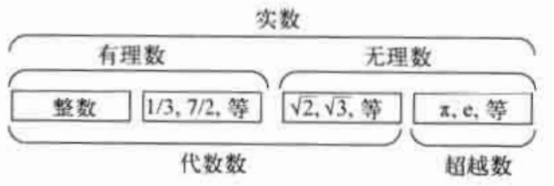
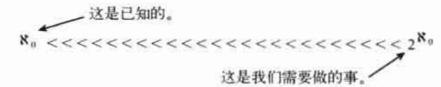

# 第1章 这个墓穴埋葬着丢番图
* 如何验证一个代数方程没有整数解？如著名的费马大定理：`x^3+y^3=z^3`没有整数解。

# 第2章 无理数和超越数
## 什么是超越数？
代数方程的解定义为代数数。有些实数(除负数平方根外的其他数)不是代数方程的解，如圆周率。

图灵论文将数限定在了实数。
## 什么是可数的无穷和不可数的无穷？
自然数、有理数、代数数的无限集合都是可数的，但是超越数、实数是不可数的。
## 集合的概念
* 基数：集合中元素的个数，也叫势
* 等势的集合：具有相同基数的集合
* 实数的各种真子集也有可能是相互等势的
* 我们可以在连续统(直线上的实数)和平面的点，乃至N维空间中的点之间建立一一对应关系。
* 幂集：一个集合的所有子集的集合叫做幂集
* 连续统：连续统指连续不断的数集，原意是为了强调实数的连续性而给实数系的另一名称，现在的含义更广泛了，由于实数与直线上的点一一对应，直觉上直线是连续而不断开点，因此，把实数系称作连续统，由于区间内的点也有类似性质，故把区间也称作连续统、三维连续统等称呼，例如，平面是二维连续统，空间是三维连续统
* 连续统的基数是2的自然数的基数次幂
* 可数集合的基数不仅仅是比连续统的基数小，而且是小非常多
* 连续统与可数集的唯一区别在于是否包含超越数(注意：不是无理数)。因此，超越数几乎占满了所有的实数
