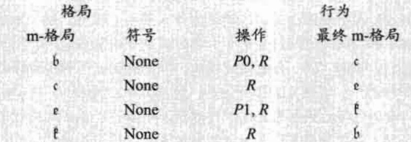
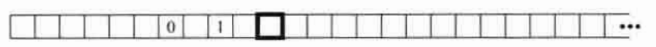
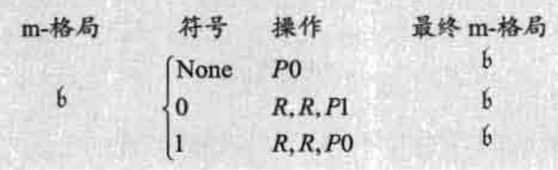

# 第1章 这个墓穴埋葬着丢番图
* 如何验证一个代数方程没有整数解？如著名的费马大定理：`x^3+y^3=z^3`没有整数解。

# 第2章 无理数和超越数
## 什么是超越数？
代数方程的解定义为代数数。有些实数(除负数平方根外的其他数)不是代数方程的解，如圆周率。

图灵论文将数限定在了实数。
## 什么是可数的无穷和不可数的无穷？
自然数、有理数、代数数的无限集合都是可数的，但是超越数、实数是不可数的。
## 集合的概念
* 基数：集合中元素的个数，也叫势
* 等势的集合：具有相同基数的集合
* 实数的各种真子集也有可能是相互等势的
* 我们可以在连续统(直线上的实数)和平面的点，乃至N维空间中的点之间建立一一对应关系。
* 幂集：一个集合的所有子集的集合叫做幂集
* 连续统：连续统指连续不断的数集，原意是为了强调实数的连续性而给实数系的另一名称，现在的含义更广泛了，由于实数与直线上的点一一对应，直觉上直线是连续而不断开点，因此，把实数系称作连续统，由于区间内的点也有类似性质，故把区间也称作连续统、三维连续统等称呼，例如，平面是二维连续统，空间是三维连续统
* 连续统的基数是2的自然数的基数次幂
* 可数集合的基数不仅仅是比连续统的基数小，而且是小非常多
* 连续统与可数集的唯一区别在于是否包含超越数(注意：不是无理数)。因此，超越数几乎占满了所有的实数

# 第3章 几个世纪以来的发展
## 形式化
* 希尔伯特计划 
这个计划的主要目标，是为全部的数学提供一个安全的理论基础。具体地，这个基础应该包括：所有数学的形式化。意思是，所有数学应该用一种统一的严格形式化的语言，并且按照一套严格的规则来使用。
   * 独立性。不存在任何冗余的公理，即没有一个公理可以由其他公理推导出来。
   * 一致性。我们必须证明：运用这一套形式化和它的规则，不可能推导出矛盾。
   * 完备性。我们必须证明以下命题：在形式化之后，数学里所有的真命题都可以被证明（注意区分可证明性和正确性的不同）。
   * 确定性。应该有一个算法，来确定每一个形式化的命题是真命题还是假命题。

# 第4章 图灵的学业
## 判定性问题
希尔伯特的判定性问题，即找到一种机械的方法以判定一行给定的符号所表达的是否是一条可由希尔伯特公理证明的定理，它的一般形式是不可解的。
## 可计算数
可计算数是那些小数表达式可以通过有限步骤计算出来的数。可计算数就是那些可以被机器写下来的数，而现在又用人类记忆的有限性来解释定义中的“有限步骤”。将人与机器随意地关联起来，这种做法是图灵研究的一大特点。
## 自动机和选择机
图灵对自动机和选择机的划分，某种程度上是我们联想到划分程序的一个传统方法：将程序分为批处理的和交互式的。
* 自动机：如果机器在每个阶段的动作完全由格局(状态)所决定，我们成这样的机器为“自动机”
* 选择机：我们也可能出于某些目的，使用那些格局只能部分决定动作的机器
## 图灵机符号类别
* 第一类符号：0和1
* 第二类符号：其他的符号
## 格局
* m-格局是机器的一种状态
* 格局由一个m-格局和一个扫描符组成
* 完全格局是整个纸带在某一时刻的快照，加上当前的m-格局及读写头的位置
## 循环机和非循环机
如果一台计算器只能写下有限个第一类符号，它就被称为是循环的，否则称为非循环的。如果一台机器运行到了某个不能移动的格局上，或者它能继续移动并有可能打印出第二类符号但永远不能打印出第一类符号了，那么它就是循环的。

# 第5章 运作的机器
## 图灵机是如何工作的？

上面的代码在图灵机中运行完后，纸条状态如下：

如果允许字母L、R在操作列中出现多次，那么我们可以简化图灵代码。下图的代码可以产生“0空格1”的循环数列。

# 第6章 通用机
## 描述数
在图灵机的构造中，图灵首先是使用了一系列的符号来标志各种操作，然后将各种符号映射成单独的数字，从而将各种命令的组合转换成了一个整数，也就是描述数。
