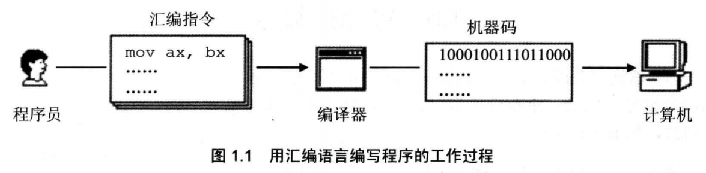
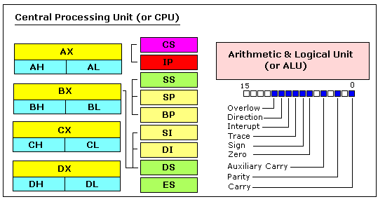
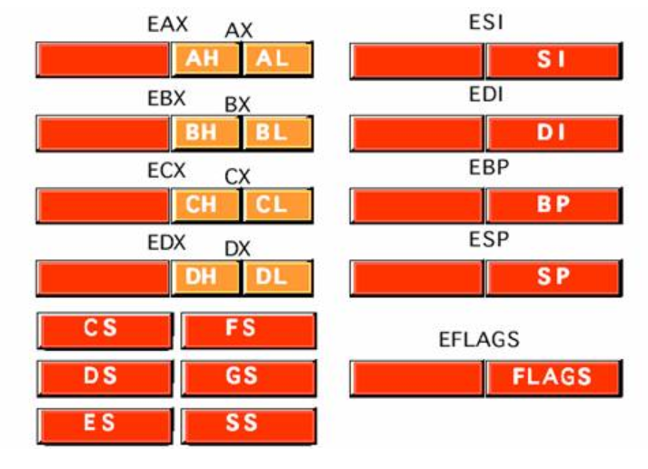
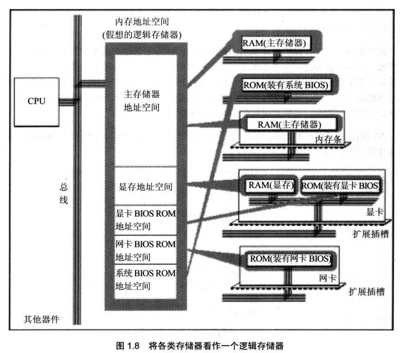
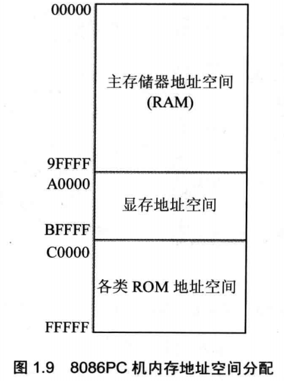
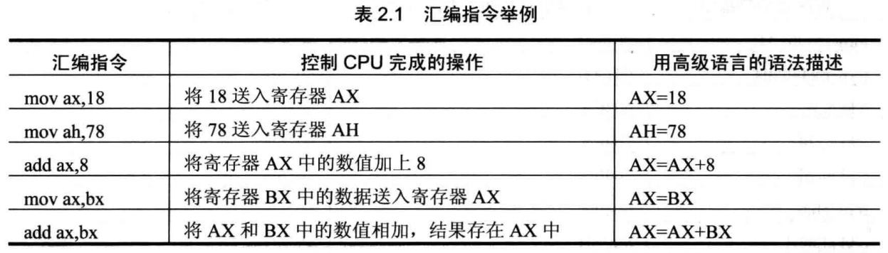
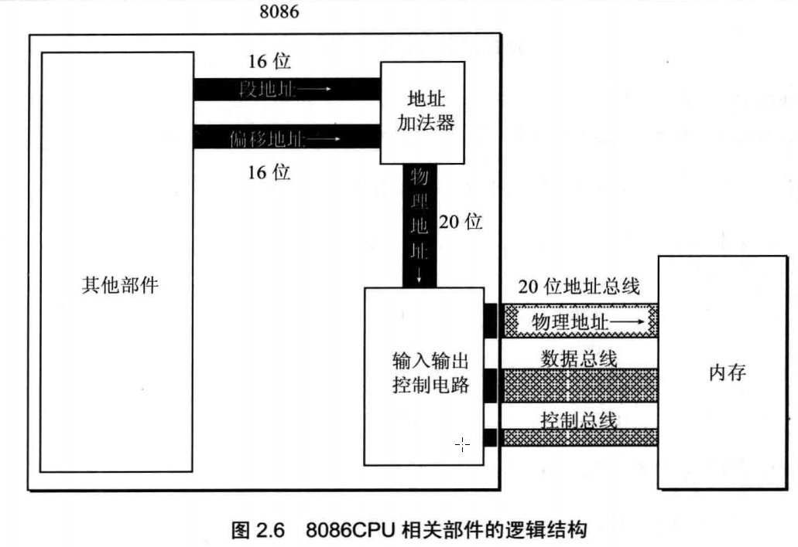

# 第1章 基础知识
## 汇编语言的产生

为了便于人类记忆，将操作机器指令转换成汇编指令：
* 操作：寄存器BX的内容送到AX中
* 机器指令：1000100111011000
* 汇编指令：mov ax,bx

16位x86寄存器： 

32位x86寄存器： 

64位x86寄存器： 

## 汇编语言的组成
汇编语言有3类指令：
* 汇编指令(核心)
   * 机器码的助记符，有对应的机器码
* 伪指令
   * 没有对应的机器码，由编译器执行，计算机并不执行
* 其他符号
   * 如+、-、*、/等，没有对应的机器码

## CPU对存储器的读写
CPU要想进行数据的读写，必须和外部期间进行下面3类信息交互：
* 存储单元的地址(地址信息)
* 器件的选择，读或写的命令(控制信息)
* 读或写的数据(数据信息)

CPU通过总线和存储芯片交互，总线从逻辑上也分3类：
* 地址总线
* 控制总线
* 数据总线

## 内存地址空间

很多外部设备，如内存，显卡，网卡都由RAM或者ROM构成，CPU访问这类设备由一个共同点：
* CPU对它们进行读或写的时候都通过控制线发出内存读写命令

向地址C000~FFFF的内存单元中写入数据的操作是无效的，因为这等于改写只读存储器中的内容。

# 第2章 寄存器
CPU中的内部组件：
* 运算器 - 进行信息处理；
* 寄存器 - 进程信息存储；
* 控制器 - 控制各种器件进行工作；
* 内部总监 - 连接各种器件，在它们之间进行数据的传送。

汇编程序主要是对寄存器的操作，寄存器是CPU中程序员可以用指令读写的部件，程序员通过改变各种寄存器中的内容来实现对CPU的控制。

## 通用寄存器
AX、BX、CX、DX这四个16位寄存器称为通用寄存器，用于存储一般数据。
* 16位数字如何存储到通用寄存器中？
   * 如果AX中存放0x4E20，则表示AH里面是4E，AL里面是20

常见汇编指令: 

## 8086CPU给出物理地址的方法
问题：8086CPU是16位的，但是有20位地址，达到1MB寻址能力。是如何将内部16位地址转换成20位的物理地址？

当8086CPU要读写内存时：
* CPU中的相关部件提供两个16位的地址，一个称为**段地址**，另一个称为偏移地址；
* 段地址和偏移地址通过内部总线送入一个称为地址加法器的部件；
* 地址加法器将两个16位地址合成为一个20位的物理地址；
   * 物理地址=段地址*16+偏移地址
* 地址加法器通过内部总线将20位物理地址送入输入输出控制电路；
* 20位物理地址被地址总线传送到存储器。

## 段寄存器
内存没有被划分成一个一个段，段的划分来自于CPU。8086CPU在访问内存时要由相关部件提供内存单元的段地址和偏移地址。段地址在8086CPU的段寄存器中存放，总共有4个段寄存器：CS、DS、SS、ES

## CS和IP
CS和IP寄存器指示了CPU当前要读取指令的地址

