# 第1章 温故而知新
## 系统软件
* 平台性软件, 如：操作系统内核，驱动程序，运行库等
* 程序开发软件，如：编译器，汇编器，链接器等
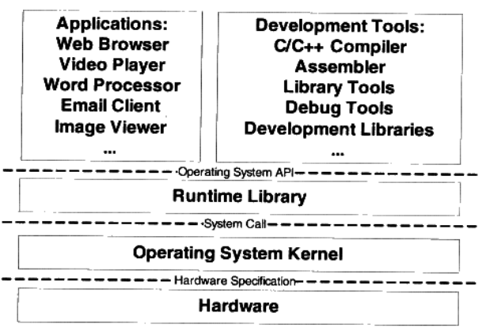

## 为什么要使用虚拟地址
使用物理地址的缺点有：
* 地址空间不隔离
* 内存使用效率低
* 程序运行的地址不确定

第一个和第三个问题可以用简单的分段(Segmentation，对每个进程内存映射)映射解决，但是第二个问题就必须用到分页(Paging)技术。分页技术将内存段进一步划分成页，针对每个页进行映射，就可以结合磁盘存储，达到内存的高效利用。
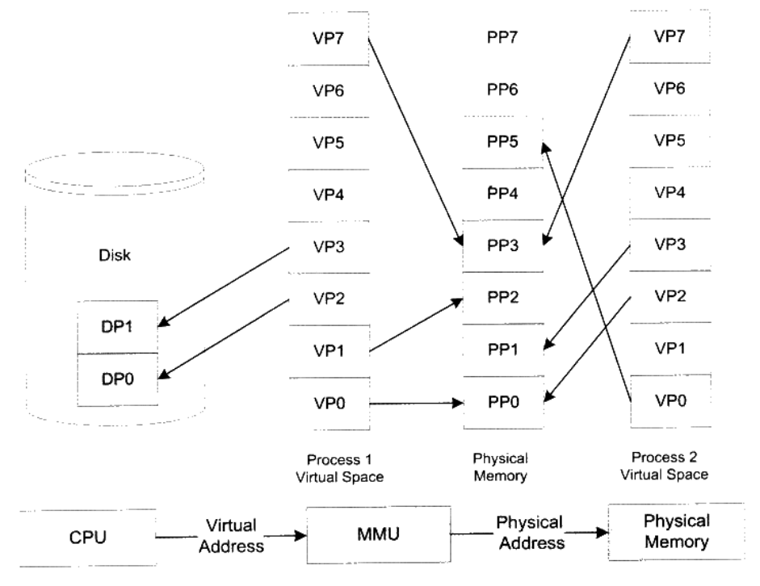

## 线程基础
### 线程的访问权限
* 公共部分<br>
   * 可以访问进程内存里的所有数据
* 私有部分<br>
   * 栈(尽管并非完全无法被其他线程访问，但一般情况下仍然可以认为是私有的数据)
   * 线程局部存储(Thread Local Storage, TLS)
   * 寄存器(包括PC寄存器)

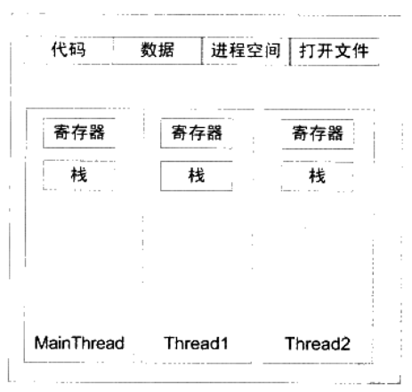
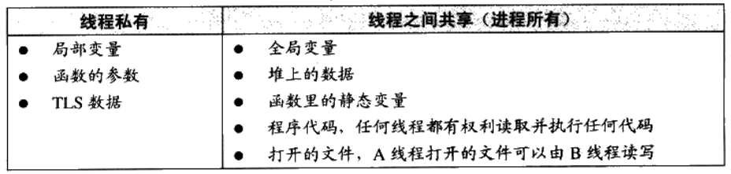

### 线程调度
线程的三个状态：
* 运行(Running)
* 就绪(Ready)
* 等待(Waiting)

调度方法：
* 优先级调度：低优先级的线程需要等待高优先级线程执行完后才执行
* 轮转法：各线程公平地执行一段时间

如何改变优先级，以防止低优先级线程无法执行：
* 用户指定优先级
* 根据进入等待状态的频繁程度提升或降低优先级
* 长时间得不到执行而被提升优先级

不可抢占(Preemption)线程中，线程主动放弃的两种情况：
* 当线程试图等待某事件时(I/O等)
* 线程主动放弃时间片

### Linux的线程实现
* `fork`
   * 复制当前进程，注意是写时复制
* `exec`
   * 使用新的可执行镜像覆盖当前可执行镜像
   * 因此，`fork`和`exec`配合使用，可以新建一个全新的进程
* `clone`
   * 创建子进程并从指定位置开始执行
   * 不同与`fork`，`clone`运行子进程和父进程共享资源，例如，内存，文件描述符等。因此`clone`更像新建了一个线程

### 同步与锁
我们有各种锁实现同步机制，各种机制都有各自的特点。
* 二元信号量(Binary Semaphore)
   * 二元信号量有两种状态，且状态变化时原子的。因此不同线程可以通过检查/修改此二元信号量，达到同步
   * 例子，[sem_process](./code/sem_process)
* 互斥量(Mutex)
   * 类似与二元信号量，互斥量的变化也是原子的，且也是二元的
   * 不同于二元信号量，互斥量的获取与释放必须是同一个线程
   * 例子：
      * [mutex_process](./code/mutex_process)。这个例子利用mutex和shared memory实现了进程间的同步
      * [mutex_process_fail](./code/mutex_process_fail)。这个例子只用了mutex，无法实现进程间的同步。单用linux的mutex只能实现线程同步，可参见例子：[mutex_thread](./code/mutex_thread)。
* 临界区(Critical Section)
   * 临界区和互斥量与信号量的区别在于，互斥量和信号量在系统的任何进程里都是可见的，另一个进程试图去获取该锁是合法的。然而，临界区的作用范围仅限于本进程。
* 读写锁(Read-Write Lock)
   * 读锁是共享的(shared)，而写锁是独占的(unique)
   * C++中的shared_lock和unique_lock，就是读写锁
   * 例子，[rwlock](./code/rwlock)
* 条件变量(Condition Variable)
   * 使用条件变量可以让许多线程一起等待某个事件的发生，当事件发生时，所有的线程可以一起恢复执行，而mutex却不行。
   * C++的`std::condition_variable`需要配合`unique_lock`使用，在`wait`的时候会释放`unique_lock`并阻塞，当条件满足后，阻塞解除，重新获取锁。例子，[cond_var](./code/cond_var)

### 可重入(Reentrant)与线程安全
一个函数被重入，只有两种情况：
* 多个线程同时执行这个函数
* 函数自身(可能是经过多层调用之后)调用自身
一个函数可重入，必须有如下特点：
* 不使用任何局部静态或全局的非const变量
* 不返回任何局部静态或全局的非const变量
* 仅依赖于调用方提供的参数
* 不依赖任何单个资源的锁(mutex等)
* 不调用任何不可重入的函数
* 一个可重入的函数可以在多线程环境下放心使用
* 可重入函数一定是线程安全的，但是线程安全的函数(如加锁保护)不一定是可重入函数

### 过度优化
即使我们正确使用了锁，由于缓存(寄存器)和编译器优化的存在，仍然会出现不同步的事情发生。
* 每个线程都有自己的寄存器，对寄存器的读写无法不能用锁保护，如果没有及时对内存进行写入操作，就有可能发生不同步
* 编译器为了优化代码，有可能会交换代码顺序，因此也会造成不同步的现象
* CPU也会动态调换顺序

`volatile`可以解决问题一和问题二，它可以：
* 阻止编译器为了提高速度将一个变量缓存到寄存器内而**不写回**
* 阻止编译器调整操作volatile变量的指令顺序

`barrier`指令可以解决问题三：
* CPU的`barrier`指令类似于一个拦水坝，阻止换序"穿透"这个大坝。因此，`barrier`指令之前的语句，一定会先于后面的语句执行

# 第2章 编译和链接
## GCC编译过程
* 预编译 `gcc -E hello.c -o hello.i`
   * 经过预编译后的.i文件不包含任何宏定义，因为所有的宏已经被展开，并且包含的文件也已经被插入到.i文件中。
   * 预编译后会添加行号和文件名标识，比如`#2 "hello.c" 2`，以便于编译时编译器产生调试用的行号信息及用于编译时产生编译错误或警告时能够显示行号。
* 编译 `gcc -S hello.i -o hello.s`
   * 编译过程就是把预处理完的文件进行一系列词法分析、语法分析、语义分析及优化后生产相应的汇编代码文件。
* 汇编 `gcc -c hello.s -o hello.o`
   * 将汇编代码转变成机器指令
   * 比较简单，只是把汇编指令和机器指令一一对应
* 链接 `ld`
   * [Makefile](./code/hello/Makefile)中定义了链接所需要的文件

## 编译器
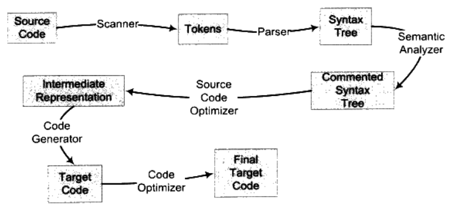
* 词法分析
   * 目的：将源代码分割成一系列的记号(Token)，此时内容不会改变，只做分割
   * 过程：通过扫描器将代码分成如下几种记号：
      * 关键字
      * 标识符
      * 字面量
      * 特殊符号(如加号、等号)
   * `lex`开源工具可以完成这件事
   * 预处理过程不归入编译器，由独立的预处理器完成
* 语法分析
   * 目的：分析Token，产生语法树
   * `yacc`开源工具可以完成语法分析工作
* 语义分析
   * 目的：标识语法树的表达式类型，可能发生类型转换，也可能发生类型报错
   * 过程：分静态语义(编译时确定语义)和动态语义(运行时确定语义，如除0)
   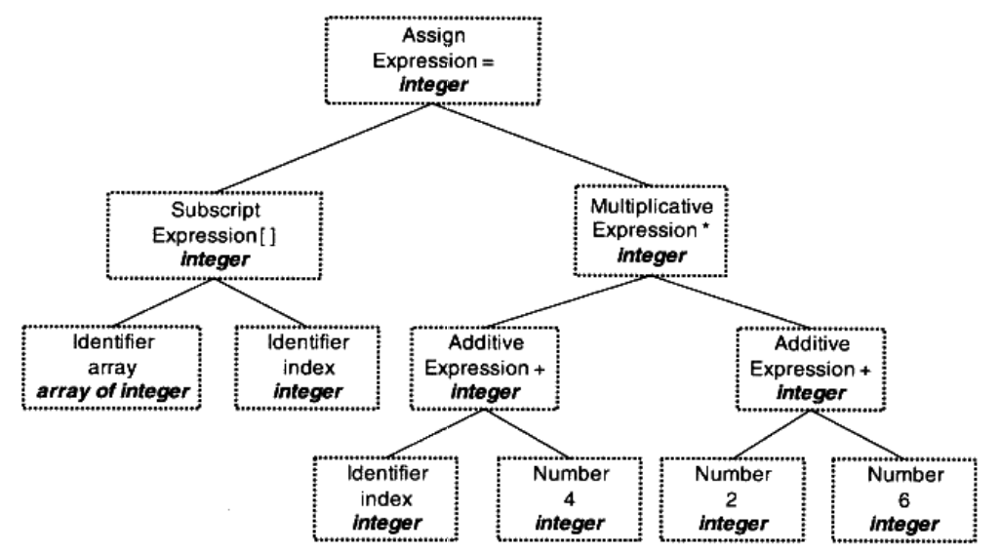
* 中间语言生成
   * 目的：将语法树优化成机器无关的中间代码
   * 中间代码一般跟目标机器和运行时环境是无关的，比如它不包含数据的尺寸、变量地址和寄存器名字等，常见的形式有:
      * 三地址吗(Three-address Code), 如：`x = y op z`
      * P-代码(P-Code)
   * 达到的效果：中间代码使得编译器可以被分为前端和后端
      * 前端：负责产生机器无关的中间代码
      * 后端：将中间代码转换成目标机器代码
* 目标代码生成与优化
   * 目的：将中间代码转换成机器代码
   * 过程，编译器后端主要包括：
      * 代码生成器(Code Generator)
         * 将中间代码转换成目标机器代码，例如x86的汇编
      * 目标代码优化器(Target Code Optimizer)
         * 对机器代码进行优化，比如选择合适的寻址方式、使用位移来代替乘法运算、删除多余的指令等

## 静态链接
链接过程主要包括了：
* 地址和空间分配(Address and Storage Allocation)
* 符号决议(Symbol Resolution)
* 重定位(Relocation)


# 第3章 目标文件里有什么
## 目标文件的格式
ELF文件分为4类(通过file命令可查看)：
* 可重定位文件(Relocatable File), 如：.o文件
* 可执行文件(Executable File), 如：/bin/bash文件
* 共享目标文件(Shared Object File), 如：.so文件
* 核心转储文件(Core Dump File), 如：core dump
## 目标文件是什么样的
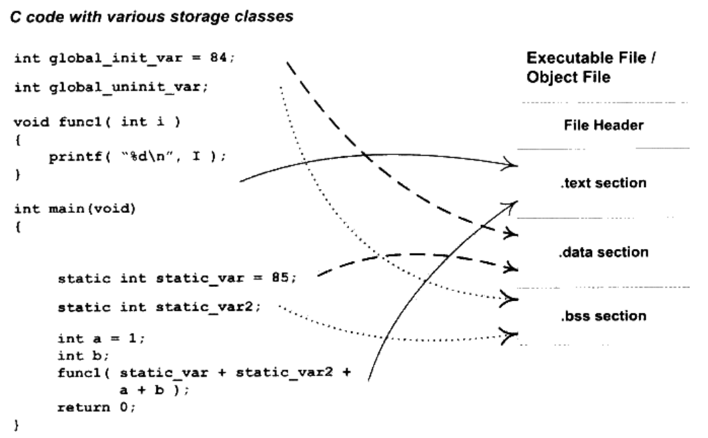
* 文件头 FileHeader
   * 文件类型
   * 入口地址(如果是可执行文件)
   * 目标硬件
   * 目标操作系统
   * 段表(Section Table), 描述文件中各个段在文件中的偏移位置以及段的属性等
* .text段
   * 机器代码
* .data段
   * 已初始化的全局变量和局部静态变量
* .bss段
   * 未初始化的全局变量和局部静态变量
   * 上述变量的默认值都为零，没有必要存在.data段
   * 只是为未初始化的全局变量和局部静态变量预留位置，并没有内容，所以它在文件中也不占据空间

### 为什么要将代码和数据分开存储
* 保护代码只读，不被篡改
* 共享只读数据

## 挖掘SimpleSection.o
### 分析`objdump -h`的打印内容
```bash
SimpleSection.o:     file format elf32-i386

Sections:
Idx Name          Size      VMA       LMA       File off  Algn
  0 .group        00000008  00000000  00000000  00000034  2**2
                  CONTENTS, READONLY, GROUP, LINK_ONCE_DISCARD
  1 .text         00000087  00000000  00000000  0000003c  2**0
                  CONTENTS, ALLOC, LOAD, RELOC, READONLY, CODE
  2 .data         00000008  00000000  00000000  000000c4  2**2
                  CONTENTS, ALLOC, LOAD, DATA
  3 .bss          00000004  00000000  00000000  000000cc  2**2
                  ALLOC
  4 .rodata       00000004  00000000  00000000  000000cc  2**0
                  CONTENTS, ALLOC, LOAD, READONLY, DATA
  5 .text.__x86.get_pc_thunk.ax 00000004  00000000  00000000  000000d0  2**0
                  CONTENTS, ALLOC, LOAD, READONLY, CODE
  6 .comment      0000002b  00000000  00000000  000000d4  2**0
                  CONTENTS, READONLY
  7 .note.GNU-stack 00000000  00000000  00000000  000000ff  2**0
                  CONTENTS, READONLY
  8 .note.gnu.property 0000001c  00000000  00000000  00000100  2**2
                  CONTENTS, ALLOC, LOAD, READONLY, DATA
  9 .eh_frame     0000007c  00000000  00000000  0000011c  2**2
                  CONTENTS, ALLOC, LOAD, RELOC, READONLY, DATA
```
* "CONTENTS"表示该段在文件中存在
   * BSS段没有"CONTENTS", 表示它实际上在ELF文件中不存在内容
   * .note.GNU-stack段虽然有"CONTENTS", 但是它的长度为0

### 代码段
* `objdump -s`
   * 以十六进制打印各段内容，其长度和文件头中定义的段长度是一致的
* `objdump -d`
   * 打印各段反汇编内容，中间列的十六进制数字和`-s`打印出来的内容一致，代表机器码

### 数据段和只读数据段
```bash
Idx Name          Size      VMA       LMA       File off  Algn
  2 .data         00000008  00000000  00000000  000000c4  2**2
                  CONTENTS, ALLOC, LOAD, DATA
  4 .rodata       00000004  00000000  00000000  000000cc  2**0
                  CONTENTS, ALLOC, LOAD, READONLY, DATA

Contents of section .data:
 0000 54000000 55000000                    T...U...        
Contents of section .rodata:
 0000 25640a00                             %d..            
```
* .data段
   * 保存的是那些已经初始化了的全局静态变量和局部静态变量，此处分别是`global_init_var`与`static_var`，因此长度是8字节(32位系统int是4字节)。
   * 内容也是小端模式(低位存低位)存储的84(0x54)和85(0x55)
* .rodata段
   * 存储只读数据，这里存放的是代码中`printf`用到的字符串常量"%d\n"。ASCII码中，`%`对应0x25，`d`对应的是0x64，`\n`对应的是0x0a，最后是`\0`结尾

### BSS段
```bash
Sections:
Idx Name          Size      VMA       LMA       File off  Algn
  3 .bss          00000004  00000000  00000000  000000cc  2**2
                  ALLOC

SYMBOL TABLE:
00000000 l     O .bss   00000004 static_var2.1513
00000004       O *COM*  00000004 global_uninit_var
```
* 在`SYMBOL_TABLE`中显示，只有`static_var2`在.bss段中，`global_uninit_var`只是一个未定义的"COMMON"符号。这其实和不同的语言与不同的编译器实现有关。有些编译器会将全局的未初始化变量存放在目标文件.bss段，而有些只是预留一个未定义的全局变量符号，等到最终链接成可执行文件的时候再在.bss段分配空间。

### 其他段
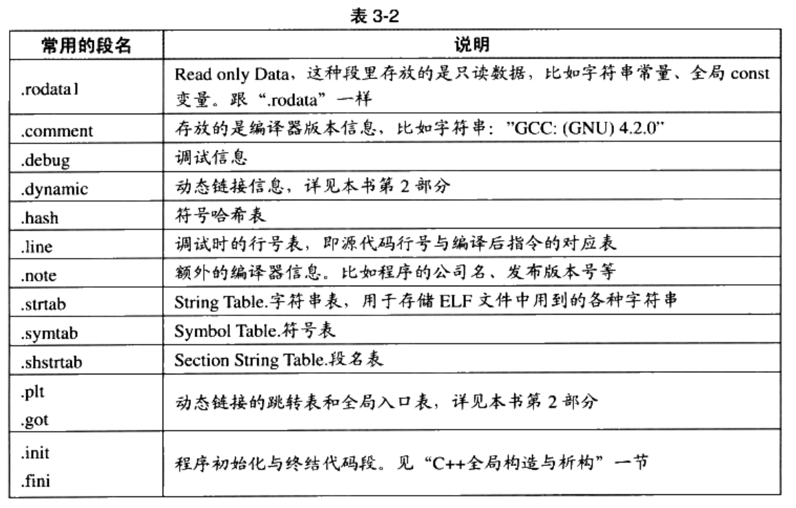

### 自定义段
```c
__attribute__((section("FOO"))) int global = 42;
__attribute__((section("BAR"))) void foo()
{
}
```
我们在全局变量或函数之前加上`__attribute__((section("name")))`属性就可以把相应的变量或函数放到以"name"作为段名的段中。

## ELF文件结构描述
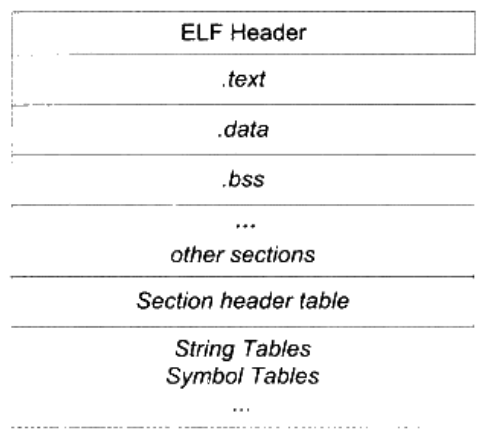
### 文件头
```
readelf -h SimpleSection.o
ELF Header:
  Magic:   7f 45 4c 46 01 01 01 00 00 00 00 00 00 00 00 00 
  Class:                             ELF32
  Data:                              2's complement, little endian
  Version:                           1 (current)
  OS/ABI:                            UNIX - System V
  ABI Version:                       0
  Type:                              REL (Relocatable file)
  Machine:                           Intel 80386
  Version:                           0x1
  Entry point address:               0x0
  Start of program headers:          0 (bytes into file)
  Start of section headers:          1140 (bytes into file)
  Flags:                             0x0
  Size of this header:               52 (bytes)
  Size of program headers:           0 (bytes)
  Number of program headers:         0
  Size of section headers:           40 (bytes)
  Number of section headers:         16
  Section header string table index: 15
```

### 段表 Section Header Table
```
readelf -S SimpleSection.o
There are 16 section headers, starting at offset 0x474:

Section Headers:
  [Nr] Name              Type            Addr     Off    Size   ES Flg Lk Inf Al
  [ 0]                   NULL            00000000 000000 000000 00      0   0  0
  [ 1] .group            GROUP           00000000 000034 000008 04     13  17  4
  [ 2] .text             PROGBITS        00000000 00003c 000087 00  AX  0   0  1
  [ 3] .rel.text         REL             00000000 00037c 000048 08   I 13   2  4
  [ 4] .data             PROGBITS        00000000 0000c4 000008 00  WA  0   0  4
  [ 5] .bss              NOBITS          00000000 0000cc 000004 00  WA  0   0  4
  [ 6] .rodata           PROGBITS        00000000 0000cc 000004 00   A  0   0  1
  [ 7] .text.__x86.get_p PROGBITS        00000000 0000d0 000004 00 AXG  0   0  1
  [ 8] .comment          PROGBITS        00000000 0000d4 00002b 01  MS  0   0  1
  [ 9] .note.GNU-stack   PROGBITS        00000000 0000ff 000000 00      0   0  1
  [10] .note.gnu.propert NOTE            00000000 000100 00001c 00   A  0   0  4
  [11] .eh_frame         PROGBITS        00000000 00011c 00007c 00   A  0   0  4
  [12] .rel.eh_frame     REL             00000000 0003c4 000018 08   I 13  11  4
  [13] .symtab           SYMTAB          00000000 000198 000150 10     14  14  4
  [14] .strtab           STRTAB          00000000 0002e8 000092 00      0   0  1
  [15] .shstrtab         STRTAB          00000000 0003dc 000095 00      0   0  1
Key to Flags:
  W (write), A (alloc), X (execute), M (merge), S (strings), I (info),
  L (link order), O (extra OS processing required), G (group), T (TLS),
  C (compressed), x (unknown), o (OS specific), E (exclude),
  p (processor specific)
```

### 重定位表 (Relocation Table)
对于每个需要重定位的代码段或数据段，都会有一个想定的重定位表`.rel.xxx`

### 字符串表 (String Table)
常见的字符串表：
   * 字符串表`.strtab`
      * 用来保存普通的字符串，比如符号的名字
   * 段表字符串表`.shstrtab`
      * 用来保存段表中用到的字符串，最常见的就是段名(sh_name)

## 链接的接口--符号
### 常见的符号类型
```bash
> nm SimpleSection.o

00000000 T func1                    # T means the symbol is in the text section
00000000 D global_init_var          # D means the symbol is in the initialized data section
         U _GLOBAL_OFFSET_TABLE_    # U means the symbol is undefined
00000004 C global_uninit_var        # C means the symbol is common
00000032 T main
         U printf
00000004 d static_var.1512
00000000 b static_var2.1513         # b means the symbol is in the BSS data section
00000000 T __x86.get_pc_thunk.ax

> readelf -s SimpleSection.o

Symbol table '.symtab' contains 21 entries:
   Num:    Value  Size Type    Bind   Vis      Ndx Name
     0: 00000000     0 NOTYPE  LOCAL  DEFAULT  UND 
     1: 00000000     0 FILE    LOCAL  DEFAULT  ABS SimpleSection.c
     2: 00000000     0 SECTION LOCAL  DEFAULT    2 
     3: 00000000     0 SECTION LOCAL  DEFAULT    4 
     4: 00000000     0 SECTION LOCAL  DEFAULT    5 
     5: 00000000     0 SECTION LOCAL  DEFAULT    6 
     6: 00000004     4 OBJECT  LOCAL  DEFAULT    4 static_var.1512
     7: 00000000     4 OBJECT  LOCAL  DEFAULT    5 static_var2.1513
     8: 00000000     0 SECTION LOCAL  DEFAULT    7 
     9: 00000000     0 SECTION LOCAL  DEFAULT    9 
    10: 00000000     0 SECTION LOCAL  DEFAULT   10 
    11: 00000000     0 SECTION LOCAL  DEFAULT   11 
    12: 00000000     0 SECTION LOCAL  DEFAULT    8 
    13: 00000000     0 SECTION LOCAL  DEFAULT    1 
    14: 00000000     4 OBJECT  GLOBAL DEFAULT    4 global_init_var
    15: 00000004     4 OBJECT  GLOBAL DEFAULT  COM global_uninit_var
    16: 00000000    50 FUNC    GLOBAL DEFAULT    2 func1
    17: 00000000     0 FUNC    GLOBAL HIDDEN     7 __x86.get_pc_thunk.ax
    18: 00000000     0 NOTYPE  GLOBAL DEFAULT  UND _GLOBAL_OFFSET_TABLE_
    19: 00000000     0 NOTYPE  GLOBAL DEFAULT  UND printf
    20: 00000032    85 FUNC    GLOBAL DEFAULT    2 main
```
* 定义在本目标文件的全局符号，可以被其他目标文件引用
   * 比如SimpleSection.o里面的`func1`, `main`等
* 外部符号(External Symbol)
   * 在本目标文件中引用的全局符号，却没有定义在本目标文件
   * 比如SimpleSection.o里面的`printf`
* 段名
   * 由编译器产生，值就是该段的起始地址
   * 比如SimpleSection.o里面的`.text`, `.data`等
* 局部符号
   * 这里符号只有在编译单元内部可见
   * 比如SimpleSection.o里面的`static_var`和`static_var2`
   * 调试器可以使用这些符号来分析程序或崩溃时的的核心转储文件，这些局部符号对链接过程没有作用，链接器往往也忽略他们。
* 行号信息
   * 目标文件指令与源代码中代码行的对应关系

### 特殊符号
当我们使用`ld`作为链接器来链接生产可执行文件时，它会为我们定义很多特殊的符号，我们可以直接声明并引用它。
* `__executable_start`
   * 程序起始地址，注意，不是入口地址，是程序的最开始的地址
* `_etext`
   * 代码结束地址
* `_edata`
   * 数据段结束地址
* `_end`
   * 程序结束地址
可参考例子: [special_symbol](./code/special_symbol)

### 符号修饰与函数签名
为了防止符号名冲突，UNIX下的C语言源代码文件中的所有全局变量和函数前会加上下划线`_`。C++为了防止可能的冲突，还增加了命名空间Namespace来解决多模块的符号冲突问题。
* 符号修饰(Name Decoration)和符号改编(Name Mangling)
   * _Z开头
   * N代表namespace
   * E代表End
   * E后面跟参数类型

### extern "C"
* [例子](./code/extern_c)
```bash
> nm main.o

0000000000000000 T func                   # extern C 函数
                 U _GLOBAL_OFFSET_TABLE_
0000000000000025 T main
                 U printf
0000000000000008 D var3
000000000000000c D var4                   # C++ 全局变量
0000000000000012 T _Z4funcf               # C++ 函数
0000000000000000 D _ZN6myname3varE        # C++ namespace里的变量
0000000000000004 D _ZN6myname4var2E
```

### 弱符号与强符号
* 强符号Strong Symbol
   * 多处定义会链接出错
   * 编译器默认函数和初始化了的全局变量为强符号
* 弱符号Weak Symbol
   * 相对于弱符号
   * 未初始化的全局变量为弱符号
   * 也可通过`__attribute__((weak))`来定义任何一个强符号为弱符号
* [例子](./code/weak_strong_symbol)
```bash
> nm symbols.o

0000000000000000 T main
0000000000000000 D strong
0000000000000004 C weak    # C means the symbol is common. Common symbols are uninitialized data.
0000000000000004 V weak2   # V means the symbol is weak object. When a weak defined symbol is linked with a normal defined symbol, the normal defined symbol is used with no error. When a weak undefined symbol is linked and the symbol is not defined, the value of the weak symbol becomes zero with no error.
```
针对强弱符号的概念，链接器就会按如下规则处理于选择被多次定义的全局符号：
* 规则1：不允许强符号被多次定义
* 规则2：如果一个符号在某个目标文件中是强符号，在其他文件中都是弱符号，那么选择强符号
* 规则3：如果一个符号在所有目标文件中都是弱符号，那么选择其中占用空间最大的一个。
#### 强引用与弱引用
* 强引用
   * 对外部目标文件的符号引用，如果没有找到该符号，链接器就会报符号未定义
* 弱引用
   * 没有发现引用符号，也不会报错
   * `__attribute__((weakref))`这个关键字可声明对一个外部函数的引用未弱引用
   * 下面这段代码可成功编译为可执行文件，但是运行时会报错
   ```c
   __attribute__((weakref)) void foo();
   int main()
   {
      foo();
   }
   ```

弱符号和弱引用对于库来说十分有用，比如库中定义的弱符号可以被用户定义的强符号所覆盖，从而使得程序可以使用自定义版本的库函数。或者程序可以扩展功能模块的引用定义为弱引用，当我们将扩展模块与程序链接在一起时，功能模块就可以正常使用。可参考例子[pthread](./code/pthread)。

## 调试信息
如果编译时加上`-g`参数，目标文件里会产生很多`.debug`段。在Linux下，我们可以使用`strip`命令去掉ELF文件中的`.debug`段。

# 第4章 静态链接
链接器采用相似段合并的方法链接目标文件，一般分为两步：
* 空间与地址分配
* 符号解析与重定位

## 空间与地址分配
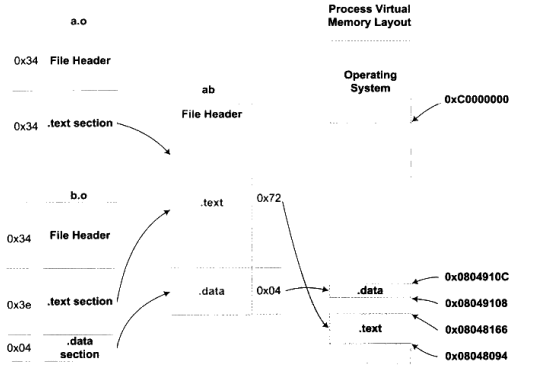

## 符号解析与重定位
* 重定位前
```bash
0000000000000000 <main>:
...
  26:   48 8d 35 00 00 00 00    lea    0x0(%rip),%rsi        # 2d <main+0x2d>
  2d:   48 89 c7                mov    %rax,%rdi
  30:   e8 00 00 00 00          callq  35 <main+0x35>
...
```
* 重定位后
```bash
0000000000401030 <main>:
...
  401056:       48 8d 35 c3 2f 00 00    lea    0x2fc3(%rip),%rsi        # 404020 <shared>
  40105d:       48 89 c7                mov    %rax,%rdi
  401060:       e8 1b 00 00 00          callq  401080 <swap>
...
```
* 链接器是如何知道哪些指令要被调整的？
ELF文件中，有一个重定位表(Relocation Table)的结构专门用来保存这些与重定位相关的信息，它在ELF文件中往往是一个或多个段。
```bash
> objdump -r a.o  # 查看a.o里面要重定位的地方

RELOCATION RECORDS FOR [.text]:
OFFSET           TYPE              VALUE 
0000000000000029 R_X86_64_PC32     shared-0x0000000000000004
0000000000000031 R_X86_64_PLT32    swap-0x0000000000000004
000000000000004a R_X86_64_PLT32    __stack_chk_fail-0x0000000000000004
```
可以发现`0x29`和`0x31`分别是`shared`和`swap`在`.text`段中的位置。

## COMMON块
链接器本身不支持符号的类型，所以当我们定义的多个符号定义类型不一致时，会有三种情况：
* 两个或两个以上强符号类型不一致
   * 链接器报错
* 有一个强符号，其他都是弱符号，出现类型不一致
   * 链接器以强符号为准，如果弱符号空间大于强符号，链接器会警告
* 两个或两个以上弱符号类型不一致
   * 按照COMMON类型的链接规则，以所有弱类型符号占用空间最大的准

### 为什么编译器不直接把未初始化的全局变量也当作未初始化的局部静态变量一样处理，为它在bss段分配空间，而是将其标记为一个COMMON类型的变量？
如果编译单元包含了弱符号，那么该符号最终所占空间的大小在此时是未知的。但是链接器在链接过程中可以确定弱符号的大小，因为当链接器读取所有输入目标文件后，任何一个弱符号的最终大小都可以确定了，所以它可以在最终输出文件的BSS段为其分配空间。所以从总体来看，未初始化全局变量最终还是被放在BSS段的。

## ABI
ABI(ABI Application Binary Interface)，概念类似与API，但是要求更加严格，是二进制层面的接口一致性要求，如两个目标文件能否链接成一个可执行文件。影响ABI的因素非常多：
* 内置类型的大小和存放方式
* 组合类型的存储方式
* 外部符号与用户定义符号的命名方式和解析方式
* 函数调用方式
* 堆栈的分布方式
* 寄存器的使用约定

## 静态库链接
```bash
> ar -t /usr/lib/x86_64-linux-gnu/libc.a

init-first.o
libc-start.o
sysdep.o
version.o
check_fds.o
libc-tls.o
elf-init.o
dso_handle.o
errno.o
errno-loc.o
```

## 链接过程控制
### 不依赖glibc的HelloWorld程序
* [tiny_hello_world](./code/raw_hello)
* 用汇编代码直接触发`0x80`系统调用中断，调用内核API`write`函数，完成print的动作
* `objdump -h main`
   * .text段保存程序指令
   * .rodata保存的是字符串"Hello World!\n"
   * .data保存的是str全局变量
      ```bash
      readelf -S main
      There are 11 section headers, starting at offset 0x3238:

      Section Headers:
      [Nr] Name              Type            Addr     Off    Size   ES Flg Lk Inf Al
      [ 0]                   NULL            00000000 000000 000000 00      0   0  0
      [ 1] .note.gnu.propert NOTE            08048114 000114 00001c 00   A  0   0  4
      [ 2] .text             PROGBITS        08049000 001000 000071 00  AX  0   0  1
      [ 3] .rodata           PROGBITS        0804a000 002000 00000e 00   A  0   0  1
      [ 4] .eh_frame         PROGBITS        0804a010 002010 000090 00   A  0   0  4
      [ 5] .got.plt          PROGBITS        0804c000 003000 00000c 04  WA  0   0  4
      [ 6] .data             PROGBITS        0804c00c 00300c 000004 00  WA  0   0  4
      [ 7] .comment          PROGBITS        00000000 003010 00002a 01  MS  0   0  1
      [ 8] .symtab           SYMTAB          00000000 00303c 000130 10      9  11  4
      [ 9] .strtab           STRTAB          00000000 00316c 00006c 00      0   0  1
      [10] .shstrtab         STRTAB          00000000 0031d8 00005e 00      0   0  1
      ```
* 使用链接脚本[TinyHelloWorld](./code/raw_hello/TinyHelloWorld.lds)将.text, .data和.rodata段合并成tinytext段，并去除.comment段。
```bash
readelf -S main_tiny
There are 10 section headers, starting at offset 0x3cc:

Section Headers:
  [Nr] Name              Type            Addr     Off    Size   ES Flg Lk Inf Al
  [ 0]                   NULL            00000000 000000 000000 00      0   0  0
  [ 1] tinytext          PROGBITS        008480d4 0000d4 00007b 00 WAX  0   0  1
  [ 2] .text.__x86.get_p PROGBITS        0084814f 00014f 000004 00  AX  0   0  1
  [ 3] .eh_frame         PROGBITS        00848154 000154 000090 00   A  0   0  4
  [ 4] .note.gnu.propert NOTE            008481e4 0001e4 00001c 00   A  0   0  4
  [ 5] .data.rel.local   PROGBITS        00848200 000200 000004 00  WA  0   0  4
  [ 6] .got.plt          PROGBITS        00848204 000204 00000c 04  WA  0   0  4
  [ 7] .symtab           SYMTAB          00000000 000210 0000f0 10      8  10  4
  [ 8] .strtab           STRTAB          00000000 000300 000054 00      0   0  1
  [ 9] .shstrtab         STRTAB          00000000 000354 000076 00      0   0  1
```
* 使用strip去除.symtab和.strtab段
```bash
readelf -S main_strip
There are 8 section headers, starting at offset 0x278:

Section Headers:
  [Nr] Name              Type            Addr     Off    Size   ES Flg Lk Inf Al
  [ 0]                   NULL            00000000 000000 000000 00      0   0  0
  [ 1] tinytext          PROGBITS        008480d4 0000d4 00007b 00 WAX  0   0  1
  [ 2] .text.__x86.get_p PROGBITS        0084814f 00014f 000004 00  AX  0   0  1
  [ 3] .eh_frame         PROGBITS        00848154 000154 000090 00   A  0   0  4
  [ 4] .note.gnu.propert NOTE            008481e4 0001e4 00001c 00   A  0   0  4
  [ 5] .data.rel.local   PROGBITS        00848200 000200 000004 00  WA  0   0  4
  [ 6] .got.plt          PROGBITS        00848204 000204 00000c 04  WA  0   0  4
  [ 7] .shstrtab         STRTAB          00000000 000210 000066 00      0   0  1`
```

# 第6章 可执行文件的装载与进程
## 进程虚拟地址空间
32位CPU最多访问4GB的物理内存空间，但是可以通过PAE(Physical Address Extension)地址扩展技术，使得虚拟内存空间超过4GB。如windows下的AWE(Address Windowing Extensions)，Linux下的`mmap()`。

## 装载的方式
* 覆盖装入
   * 已经被淘汰
   * 把挖掘内存潜力的任务交给了程序员
* 页映射
   * 虚拟存储机制的一部分
   * 将内存和所有磁盘中的数据和指令按照“页”为单位划分

## 从操作系统角度看可执行文件的装载
* 进程的建立
   * 创建一个独立的虚拟地址空间(进程拥有独立的虚拟地址空间)
      * 建立虚拟地址空间和实际物理空间的关系
      * 在Linux下，只是分配了一个页目录Page Directory，其他的等到发生页错误的时候再配置
   * 读取可执行文件头，并且建立虚拟空间与可执行文件的映射关系
      * 建立可执行文件和虚拟地址的关系
      * 这种映射关系只是操作系统内部的一个数据结构
      * Linux中，通过段信息VMA(Virtual Memory Area)来定义此映射
   * 将CPU的指令寄存器设置成可执行文件的入口地址，启动运行
      * 通过设置CPU的指令寄存器将控制权转交给进程，直接跳转到可执行文件的入口地址
* 页错误
   * 执行完进程的建立过程后，指令和数据并没有装入内存，而是建立了一种映射关系
   * 当进程开始执行入口函数是，发现页面是个空页面，就发生了一个页错误
   * 发生页错误后，CPU将权限交给操作系统专门的页错误处理例程，从对应的物理地址装载内容到指定虚拟内存
   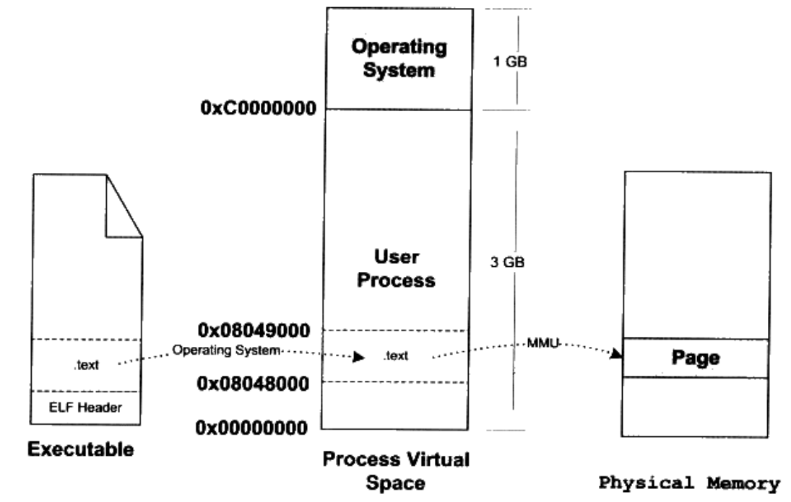

## 进程虚拟空间分布
操作系统通过给进程空间划分一个个VMA来管理进程的虚拟空间，基本原则是将相同权限属性的、有相同映像文件的映射成一个VMA，一个进程基本上可以分为如下几种VMA区域:
* 代码VMA，权限只读、可执行；有映像文件
* 数据VMA，权限可读写、可执行；有映像文件
* 堆VMA，权限可读写、可执行；无映像文件，匿名，可向上扩展
* 栈VMA，权限可读写、不可执行；无映像文件，匿名，可向向下扩展
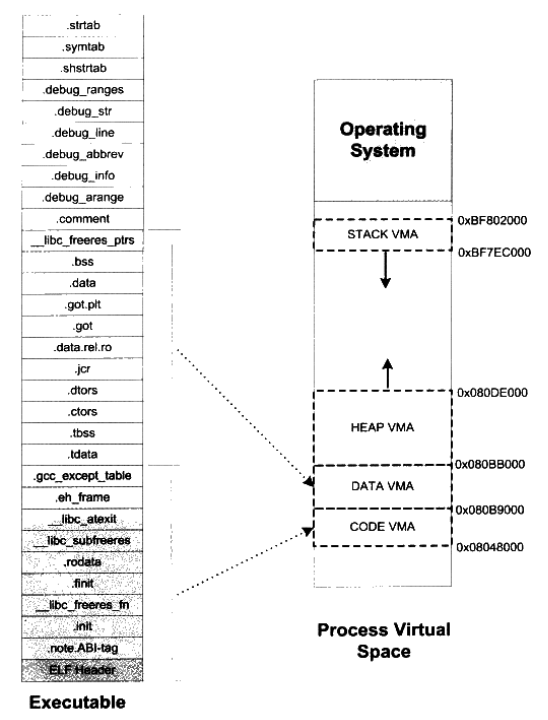

### 以SectionMapping为例
* SectionMapping的Segment，程序头(Program Header)
```bash
> readelf -l SectionMapping.elf

Elf file type is EXEC (Executable file)
Entry point 0x401bc0
There are 10 program headers, starting at offset 64

Program Headers:
  Type           Offset             VirtAddr           PhysAddr
                 FileSiz            MemSiz              Flags  Align
  LOAD           0x0000000000000000 0x0000000000400000 0x0000000000400000
                 0x0000000000000518 0x0000000000000518  R      0x1000
  LOAD           0x0000000000001000 0x0000000000401000 0x0000000000401000
                 0x000000000009375d 0x000000000009375d  R E    0x1000
  LOAD           0x0000000000095000 0x0000000000495000 0x0000000000495000
                 0x0000000000026615 0x0000000000026615  R      0x1000
  LOAD           0x00000000000bc0c0 0x00000000004bd0c0 0x00000000004bd0c0
                 0x0000000000005170 0x00000000000068c0  RW     0x1000
  NOTE           0x0000000000000270 0x0000000000400270 0x0000000000400270
                 0x0000000000000020 0x0000000000000020  R      0x8
  NOTE           0x0000000000000290 0x0000000000400290 0x0000000000400290
                 0x0000000000000044 0x0000000000000044  R      0x4
  TLS            0x00000000000bc0c0 0x00000000004bd0c0 0x00000000004bd0c0
                 0x0000000000000020 0x0000000000000060  R      0x8
  GNU_PROPERTY   0x0000000000000270 0x0000000000400270 0x0000000000400270
                 0x0000000000000020 0x0000000000000020  R      0x8
  GNU_STACK      0x0000000000000000 0x0000000000000000 0x0000000000000000
                 0x0000000000000000 0x0000000000000000  RW     0x10
  GNU_RELRO      0x00000000000bc0c0 0x00000000004bd0c0 0x00000000004bd0c0
                 0x0000000000002f40 0x0000000000002f40  R      0x1
```

* SectionMapping运行时的内存分布，与上面的VirtAddr一致
```bash
> cat /proc/xxx/maps

00400000-00401000 r--p 00000000 08:05 6036873                            ./SectionMapping.elf
00401000-00495000 r-xp 00001000 08:05 6036873                            ./SectionMapping.elf
00495000-004bc000 r--p 00095000 08:05 6036873                            ./SectionMapping.elf
004bd000-004c0000 r--p 000bc000 08:05 6036873                            ./SectionMapping.elf
004c0000-004c3000 rw-p 000bf000 08:05 6036873                            ./SectionMapping.elf
004c3000-004c4000 rw-p 00000000 00:00 0 
00de9000-00e0c000 rw-p 00000000 00:00 0                                  [heap]
7ffc3c368000-7ffc3c389000 rw-p 00000000 00:00 0                          [stack]
7ffc3c3c4000-7ffc3c3c7000 r--p 00000000 00:00 0                          [vvar]
7ffc3c3c7000-7ffc3c3c8000 r-xp 00000000 00:00 0                          [vdso]
ffffffffff600000-ffffffffff601000 --xp 00000000 00:00 0                  [vsyscall]
```

### 段地址对齐
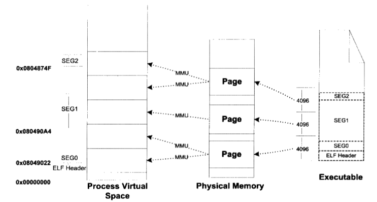
为了节约空间，不仅section被merge成segment，同时在装载的时候，不同的segment也会被合并在一个页中，以防止内存碎片的产生。

### Linux内核装载ELF过程
* 检查ELF可执行文件格式的有效性，比如魔数、程序头表中段(Segment)的数量
* 寻找动态链接的".interp"段，设置动态链接器路径
* 根据ELF可执行文件的程序头表的描述，对ELF文件进行映射，比如代码、数据、只读数据
* 初始化ELF进程环境，比如进程启动时EDX寄存器的地址应该时DT_FINI的地址
* 将系统调用的返回地址修改成ELF可执行文件的入口点。对于静态链接的ELF可执行文件，这个程序入口就是ELF文件的文件头中e_entry所指的地址；对于动态链接的ELF可执行文件，程序入口点是动态链接器。


# 第7章 动态链接

## 一个简单的动态链接例子
* [例子](./code/so)
* 查看动态链接程序的虚拟内存空间分布(cat /proc/xxx/maps)，可发现有以下几个部分：
   * 主可执行文件的映射
   * libc动态链接库的映射
   * Lib.so动态链接库的映射
   * ld动态链接器的映射

## 地址无关代码
* 问题1：共享对象在编译时不能假设自己在进程虚拟地址空间中的位置。
* 问题2：共享对象应该能够在多个进程之间共享。
第一个问题可以通过装载时重定位(`-shared`)解决，而第二个问题需要编写地址无关代码(PIC, Position-independent Code)来解决。

为了产生地址无关代码，将引用分成以下四种：
* 模块内部调用或跳转
   * 相对地址
   * 不需要重定位
* 模块内部的数据访问
   * 利用`__i686.get_pc_thunk.cx`函数实现数据相对地址
   * 不需要重定位
* 模块间数据访问
   * 地址要到装载时才知道
   * 把跟地址相关的部分放到数据段里面建立的指向这些变量的指针数组中，即全局偏移表(Global Offset Table, GOT)
   * 当代码需要引用该全局变量时，可以通过GOT中相对应的项间接引用
   * 链接器在装载模块时会修改GOT中的内容，以确保每个指针所指向的地址正确，又因为其在数据段，所以每个进程都有独立的副本，互不影响
* 模块间调用、跳转
   * 同样可以使用GOT实现

### 共享模块的全局变量问题
* ELF共享库在编译时，默认都把定义在模块内部的全局变量当作定义在其他模块的全局变量
   * 如果某个全局变量在可执行文件中有副本
      * 动态链接器会把GOT中的相应地址指向该副本
   * 如果某个全局变量在可执行文件中有副本，但是未被初始化
      * 动态链接器会将该初始值复制到程序主模块中的变量副本中
   * 如果某个全局变量在可执行文件中没有副本
      * 动态链接器才会把GOT中的相应地址指向模块内部的该变量副本

## 延迟绑定(PLT)
ELF使用PLT(Procedure Linkage Table)在GOT之上有添加了一层，实现了动态库函数第一次被用到时才进行绑定的延时绑定。
以延时绑定`bar()`函数为例子，`bar()`函数在PLT中的项的地址我们称之为`bar@plt`，其定义如下:
```c
bar@plt:
jmp *(bar@GOT)
push n
push moduleID
jump _dl_runtime_resolve
```
* 当第一次调用`bar@plt`时，GOT里存的时上面代码中的`push n`指令，因此相当于没有发生跳转
* `_dl_runtime_resolve`会完成符号的解析和重定位工作，将真正的`bar()`地址填入`bar@GOT`中
* 当第二次调用`bar@plt`时，就可以通过`bar@GOT`找到真正的函数位置

## 动态链接相关结构
### .interp段
```bash
> objdump -s main

Contents of section .interp:
 0318 2f6c6962 36342f6c 642d6c69 6e75782d  /lib64/ld-linux-
 0328 7838362d 36342e73 6f2e3200           x86-64.so.2.
```
.interp段里面就保存了一个字符串，这个字符串时可执行文件需要的动态链接器的路径。

### .dynamic段
这个段里面保存了动态链接器所需要的基本信息，比如依赖于哪些共享对象、动态链接符号表的位置、动态链接重定位表的位置、共享对象初始化代码的地址等。可以看成是动态链接下的ELF文件的头文件。
```bash
> readelf -d Lib.so

Dynamic section at offset 0x2e20 contains 24 entries:
  Tag        Type                         Name/Value
 0x0000000000000001 (NEEDED)             Shared library: [libc.so.6]
 0x000000000000000c (INIT)               0x1000
 0x000000000000000d (FINI)               0x1144
 0x0000000000000019 (INIT_ARRAY)         0x3e10
 0x000000000000001b (INIT_ARRAYSZ)       8 (bytes)
 0x000000000000001a (FINI_ARRAY)         0x3e18
 0x000000000000001c (FINI_ARRAYSZ)       8 (bytes)
 0x000000006ffffef5 (GNU_HASH)           0x2f0
 0x0000000000000005 (STRTAB)             0x3c0
 0x0000000000000006 (SYMTAB)             0x318
 0x000000000000000a (STRSZ)              121 (bytes)
 0x000000000000000b (SYMENT)             24 (bytes)
 0x0000000000000003 (PLTGOT)             0x4000
 0x0000000000000002 (PLTRELSZ)           24 (bytes)
 0x0000000000000014 (PLTREL)             RELA
 0x0000000000000017 (JMPREL)             0x510
 0x0000000000000007 (RELA)               0x468
 0x0000000000000008 (RELASZ)             168 (bytes)
 0x0000000000000009 (RELAENT)            24 (bytes)
 0x000000006ffffffe (VERNEED)            0x448
 0x000000006fffffff (VERNEEDNUM)         1
 0x000000006ffffff0 (VERSYM)             0x43a
 0x000000006ffffff9 (RELACOUNT)          3
 0x0000000000000000 (NULL)               0x0
```

### 动态符号表
在静态链接中有.symtab(Symbol Table)段用来保存所有关于该目标文件的符号定义和引用。
在动态链接模块中有.dynsym和。symtab两个表。.dynsym只保存了与动态链接相关的符号，.symtab中保存了所有符号，包括.dynsym中的符号。

### 动态链接重定位表
动态链接文件有两个重定位表：
* .rel.dyn
   * 对数据引用的修正
   * 修正的位置位于.got以及数据段
* .rel.plt
   * 对函数引用的修正
   * 修正的位置位于.got.plt

### 动态链接时进程堆栈初始化信息
进程初始化的时候，堆栈里不仅保存了关于进程执行环境和命令行参数等信息，还保存了动态链接器所需要的一些辅助信息组(Auxiliary Vector)，主要包括：
* AT_PHDR：可执行文件中程序表头在进程中的地址
* AT_PHENT：可执行文件头中程序头表中每一个入口的大小
* AT_PHNUM：可执行文件头中程序头表中入口的数量
* AT_ENTRY：可执行文件入口地址，即启动地址

可参见例子[print_stack](./code/stack/print_stack.c)

## 动态链接的步骤和实现
* 动态链接器自举
   * 目的：完成动态链接器本身所需要的全局和静态变量的重定位工作
   * 动态链接器入口地址即是自举代码
   * 自举代码不使用全局和静态变量，且不调用函数
* 装载共享对象
   * 目的：将可执行文件和链接器本身的符号表都合并到一个符号表中，即全局符号表(Global Symbol Table)
   * 符号会按照广度优先搜索，如果相同的符号已经被加入到全局符号表，则此符号忽略，此现象叫全局符号介入(Global Symbol Interpose)，可参加[例子](./code/symbol_interpose)
* 重定位和初始化
   * 根据全局符号表，遍历可执行文件和每个共享对象的重定位表，将它们的GOT/PLT中的每个需要重定位的位置进行修正
   * 重定位完后，如果共享对象有.init段，那么执行.init段代码，如C++的全局/静态对象的构造就需要通过.init来初始化。
   * 如果进程的可执行文件也有.init段，那么动态链接库不会执行它，因为可执行文件中的.init段和.finit段由程序初始化部分代码负责执行。

### Linux动态链接器实现
* 内核装载完ELF可执行文件后，返回用户空间，将权限交给程序入口
   * 如果是静态可执行文件，程序入口就是ELF头文件里面定义的e_entry
   * 如果是动态可执行文件，内核会分析它的动态链接器地址(在.interp段)，将控制权交给动态链接器

# 第8章 Linux共享库的组织
## 共享库版本命名
* libname.so.x.y.z
   * x: 主版本号，不同主版本号之间不兼容
   * y: 次版本号，增加一些新接口，但保持原来的符号不变，高的次版本号向后兼容低的次版本号
   * z: 发布版本号，修正一些错误，不同的发布版本号之间完全兼容
* SO-NAME
   * 用来记录共享库的依赖关系
   * 共享库的文件名去掉次版本号和发布版本号，保留主版本号
   * Linux系统中，系统会为最新兼容版本(主版本号相同)的共享库在它所在的目录创建一个跟SO-NAME相同的并且指向它的软链接
   * `ldconfig`工具会遍历所有的默认共享库目录，更新所有的软链接，使它们指向最新版的共享库；如果安装了新的共享库，会为其创建相应的软链接
* 次版本号交会问题
   * 因为SO-NAME并不会判断次版本号信息，所以会出现某程序依赖了高次版号的共享库，但运行在低次版本号的系统中，而产生却是某些符号的错误。
   * 可通过“基于符号的版本机制(Symbol Versioning)”方案解决，使每个符号都保留了次版本号的信息
   * [例子](./code/symbol_version)
      * main依赖的foo符号为：`foo@@VERS_1.2`，带着版本号。所以如果lib.so的版本号不一致，运行报错。
## 共享库系统路径
* 如果.dynamic段(`readelf -d xxx.so`)中的DT_NEED里保存的使绝对路径，则动态链接器就按这个路径查找
* 如果使相对路径，则按照以下顺序搜索：
   * 由环境变量LD_LIBRARY_PATH指定的路径
   * 由路径缓存文件/etc/ld.so.cache指定的路径，ldconfig工具会将共享目录下所有SO-NAME收集起来，存放到/etc/ld.so.cache文件中，以加快查找速度
   * 默认共享目录，/lib, /usr/lib, /usr/local/lib, /etc/ld.so.conf
## 共享库的创建
* 生成共享库： `gcc -shared -fPIC -Wl,-soname,my_soname -o library_name source_files`
   * 如果我们不使用-soname来指定共享库的SO-NAME，那么该共享库默认就没有SO-NAME，即使使用ldconfig更新SO-NAME的软链接时，对该共享库也没有效果
* 链接共享库： `gcc -Wl,-rpath=/home/mylib -o program.out program.o -lsomelib`
   * 这样产生的可执行文件program.out在被动态链接器装载时，动态链接器会首先在“/home/mylib”查找共享库
* 清除符号信息：`strip libfoo.so`
   * strip工具可清除掉共享库或可执行文件的所有符号和调试信息
* 安装共享库
   * 复制到某个标准共享库目录
   * 运行ldconfig
## 共享库构造和析构函数
* [例子](./code/so_init)

# 第10章 内存
## 程序的内存布局
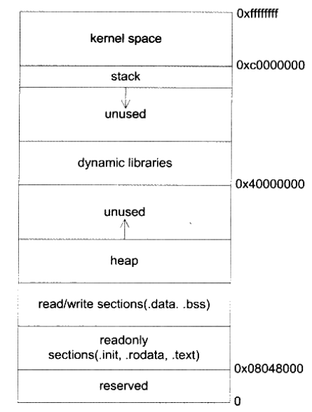

## 栈与调用惯例
栈保存了一个函数调用所需要的维护信息，称作堆栈帧(Stack Frame)或活动记录(Activate Record)。
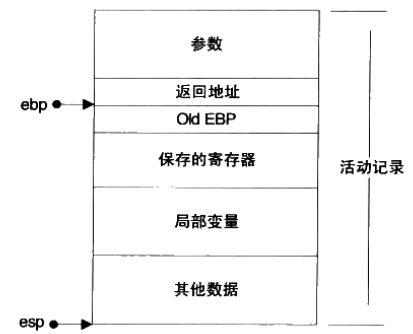
堆栈帧一般包括：
* 函数的返回地址和参数，和caller相关
* 保存的上下文：包括函数调用前后需要保持不变的寄存器，以及函数的非静态局部变量和编译器自动生成的其他临时变量

在i386中，一个函数的活动记录用ebp和esp连个寄存器划定。esp始终指向栈顶，ebp在函数执行的过程中固定不变：
* (ebp-4)指向了这个函数的返回地址
* (ebp-8), (ebp-12)...等指向了这个函数的传入参数
* ebp指向的是调用这个函数之前ebp的值，用于恢复

函数的调用方和被调用方要遵循同样的约定，函数才能被正确调用，这样的约定称为调用惯例。常见的调用惯例有：
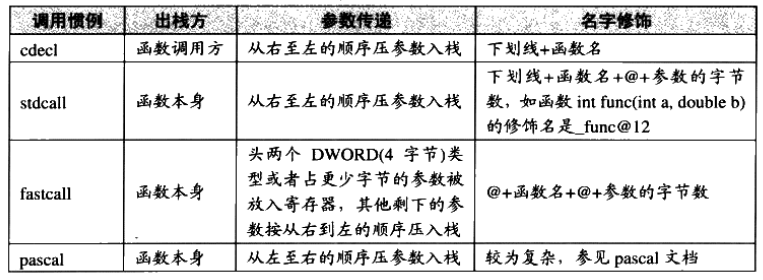
下面是cdecl调用惯例，以如下代码为例子：
```c
void f(int x, int y)
{
   ...
   return;
}
int main()
{
   f(1, 3);
   return 0;
}
```
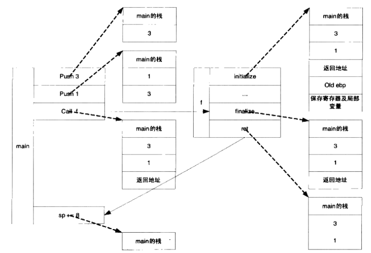

结合ebp和esp，堆栈格局如下：
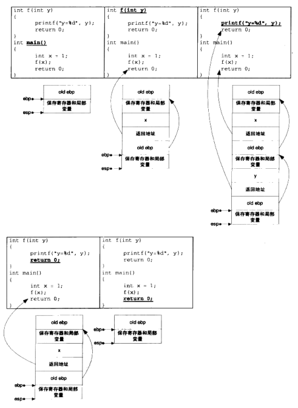

## 函数返回值传递
采用了隐藏参数的方式，完成了大尺寸返回值。
例如以下代码：
```c
typedef struct big_thing
{
   char buf[128];
}big_thing;
big_thing return_test()
{
   big_thing b;
   b.buf[0] = 0;
   return b;
}
int main()
{
   big_thing n = return_test();
}
```
其实会被转换成：
```c
void return_test(void *temp)
{
   big_thing b;
   b.buf[0] = 0;
   memcpy(temp, &b, sizeof(big_thing));
   eax = temp;
}
int main()
{
   big_thing temp;
   big_thing n;
   return_test(&temp);
   memcpy(&n, eax, sizeof(big_thing));
}
```
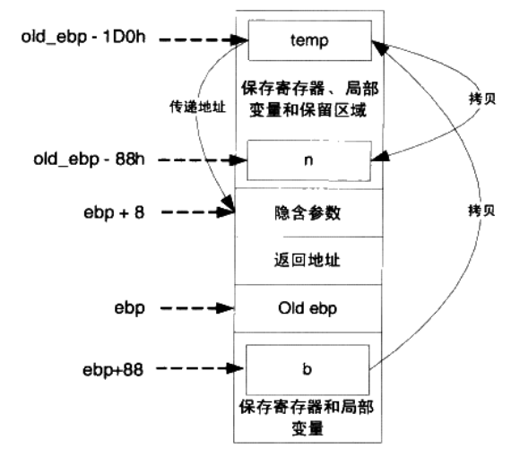

## 堆与内存管理
光有栈对于面向过程的程序设计还远远不够，因为栈上的数据在函数返回的时候就会被释放掉，所以无法将数据传递至函数外部。而全局变量没有办法动态地产生，只能在编译的时候定义。

### Linux进程堆管理

Linux通过两个系统调用完成对空间分配：
* brk()
   * `int brk(void* end_data_segment)`
   * 目的：设置进程数据段(.data段和.bss段)的结束地址，即它可以扩大或缩小数据段
   * 通过将数据段的结束地址向高地址移动，那么扩大的那部分空间就可以被利用
* mmap()
   * `void *mmap(void *start, size_t length, int prot, int flags, int fd, off_t offset)`
   * 目的：向操作系统申请一段虚拟地址空间，这块虚拟地址可以映射到某个文件，也可以是匿名空间。

glibc的malloc函数是这样处理用户的空间请求的：对于小于128KB的请求来说，它会在现有的堆空间里面，按照堆分配算法为它分配一块空间并返回；对于大于128KB的请求来说，它会使用mmap()函数为它分配一块匿名空间，然后在这个匿名空间中为用户分配空间。

### 堆分配算法
目的：管理一大块连续的内存空间，能够按照需求分配、释放其中的空间，常见的方法有：

* 空闲链表
   * 通过链表的方法将空闲的空间链接起来
* 位图
   * 将内存空间按照固定大小的块(如：128字节)分割
   * 通过位图(数组标记)记录各块的状态(头/主体/空闲)

# 第11章 运行库

## 入口函数和程序初始化
程序的入口点实际上是一个程序的初始化和结束部分，它往往是运行库的一部分，一个典型的程序运行步骤大致如下：
* 操作系统在创建进程后，把控制权交到了程序的入口，这个入口往往是运行库中的某个入口函数。
* 入口函数对运行库和程序运行环境进行初始化，包括堆、I/O、线程、全局变量构造，等等。
* 入口函数在完成初始化之后，调用main函数，正式开始执行程序主体部分。
* main函数执行完毕后，返回到入口函数，入口函数进行清理工作，包括全局变量析构、堆销毁、关闭I/O等，然后进行系统调用结束进程。

### GLIBC入口函数
* glibc的程序入口为`_start`
   * `_start` -> `__libc_start_main` -> `exit` -> `_exit`

### I/O文件对象
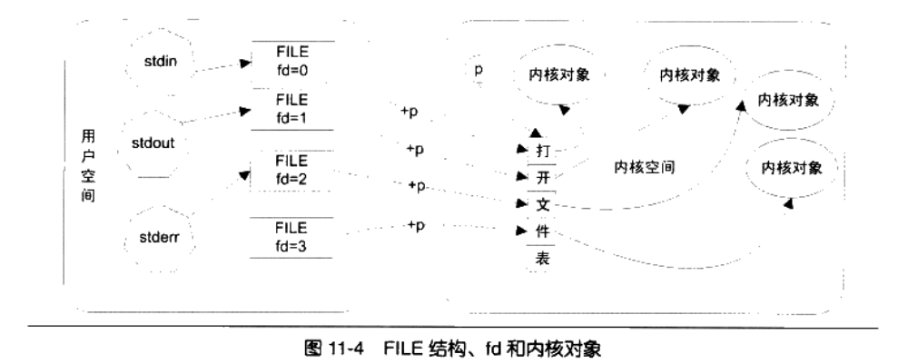
为了防止用户随意访问打开文件对象的地址，内核通过文件描述符(File Descriptor)隐藏了打开的内核对象。在C语言中，FILE结构和f有一对一的关系，每个FILE结构都会记录自己唯一对应的fd。
* fd是什么？<br>
在内核中，每个进程都有一个私有的“打开文件表”(内核中)，这个表是一个指针数组，每个元素都指向一个内核的打开文件对象。而fd就是这个表的下标。
当用户打开一个文件时，内核会在内部生成一个打开文件对象，并在这个表里找到一个空项，让着一项指向生成的打开文件对象，并返回这一项的下标作为fd。

## C/C++运行库
一个C语言运行库大致包含了如下功能：
* 启动与退出：包括入口函数及入口函数所依赖的其他函数等。
* 标准函数：由C语言标准规定的C语言标准库所拥有的函数实现。
* I/O：I/O功能的封装和实现
* 堆：堆的封装和实现
* 语言实现：语言中一些特殊功能的实现
* 调试：实现调试功能的代码

### glibc
glibc的发布版主要由几个部分组成：
* 头文件
   * /usr/include
* 二进制文件，静态和动态两个版本
   * /lib/libc.so.6
   * /usr/lib/libc.a
* 辅助程序运行库
   * /usr/lib/crt1.o
   * /usr/lib/crti.o
   * /usr/lib/crtn.o

#### glibc启动文件
* crt1.o里面包含的就是程序的入口函数`_start`，由它负责调用`__libc_start_main`初始化libc并调用main函数进入真正的程序主体。
* crti.o辅助.init段和.finit段，完成调用main函数之前的构造工作
* crtn.o辅助.init段和.finit段，完成调用main函数之后的析构工作

为了保证最终输出文件中.init和.finit的正确性，我们必须保证在链接时，crti.o必须在用户目标文件和系统库之前，而crtn.o必须在用户目标文件和系统库之后，如
* `ld crt1.o crti.o [user_objects] [system_libraries] crtn.o`
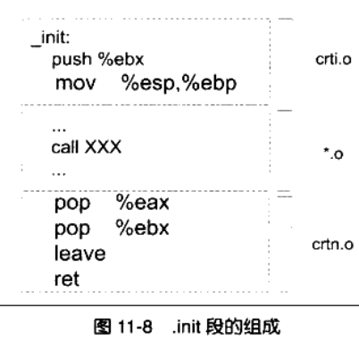

# 系统调用与API

## 系统调用介绍
Linux使用0x80号中断作为系统调用的入口，各个通用寄存器用于传递参数。例如，EAX寄存器用于表示系统调用的接口号，EAX=1表示退出进程(exit)，EXA=2表示创建进程(fork)。每个系统调用都对应于内核源代码中的一个函数，它们都以"sys_"开头，比如exit调用对应内核中的sys_exit函数。当系统调用返回时，EAX又作为调用结果的返回值。
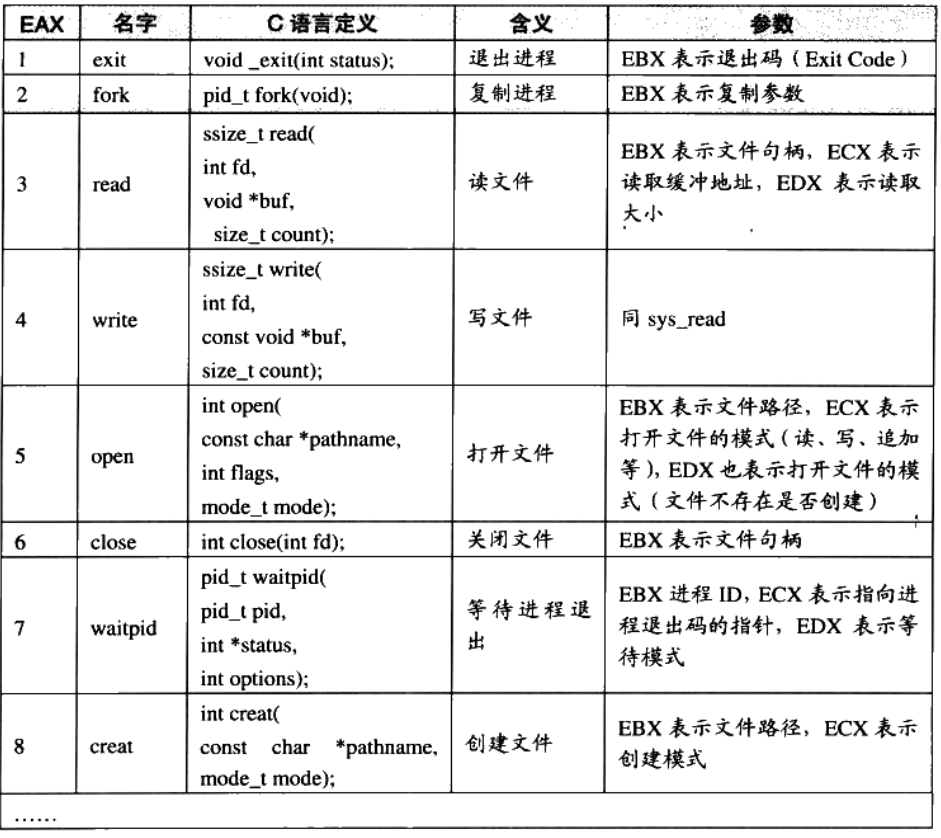
我们可以直接使用系统调用(如：read)，绕过glibc的文件读取机制，所以所有位于glibc中的缓存、按行读取文本文件等这些机制都没有了，读取的就是文件的原始数据。
* 系统调用的弊端
   * 使用不便
   * 各个操作系统之间系统调用不兼容

运行库作为系统调用与程序之间的一个抽象层可以解决上面的弊端，如C语言中的fread，封装了Linux的系统调用`read`和windows的系统调用`ReadFile`。


