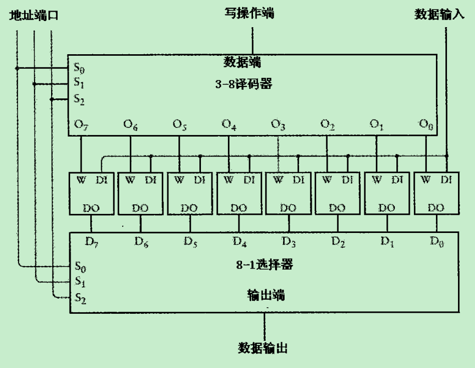
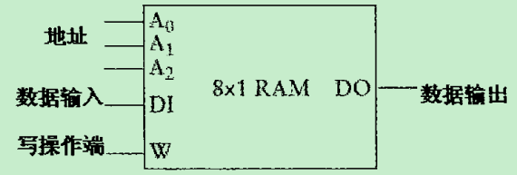
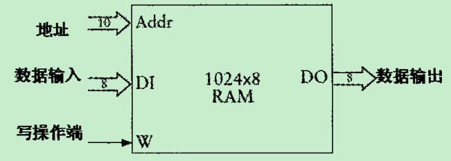
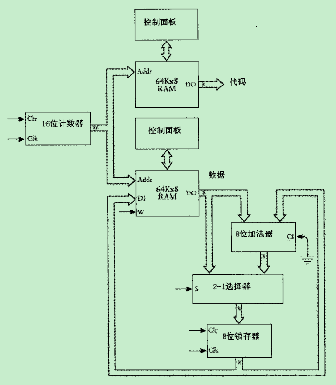
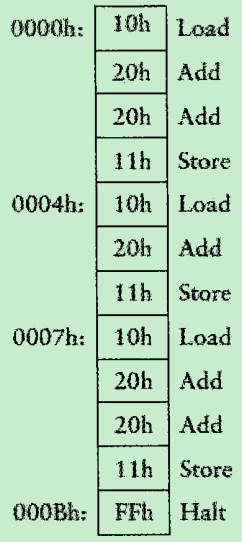
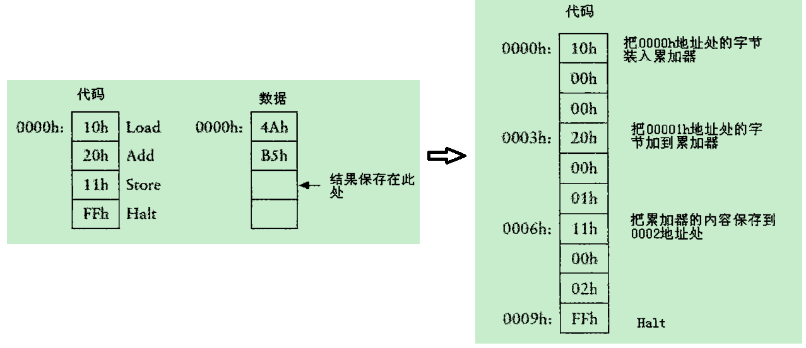
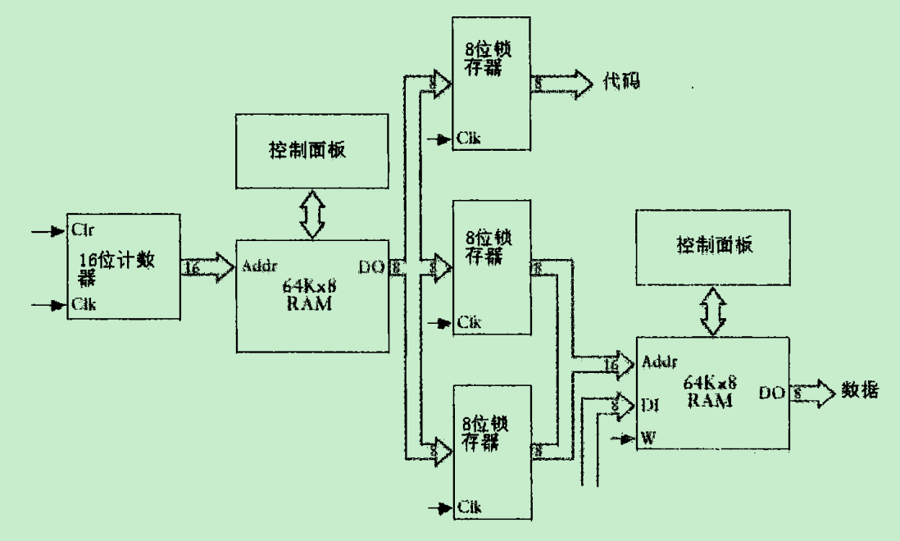
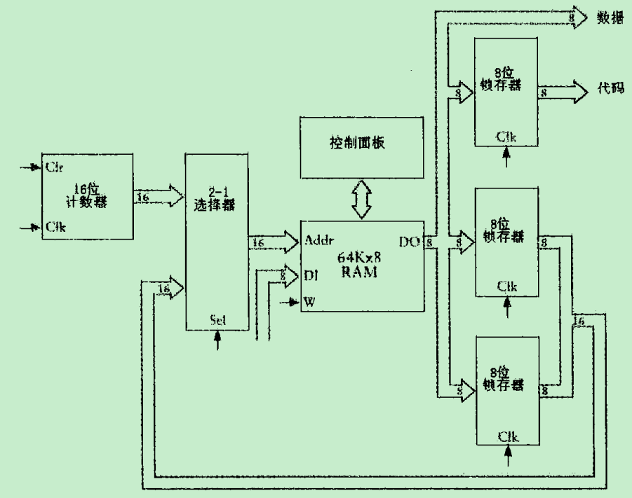
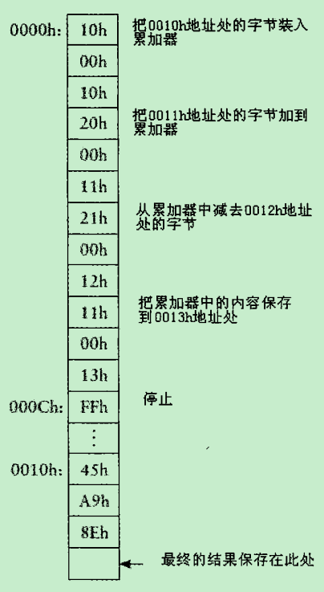
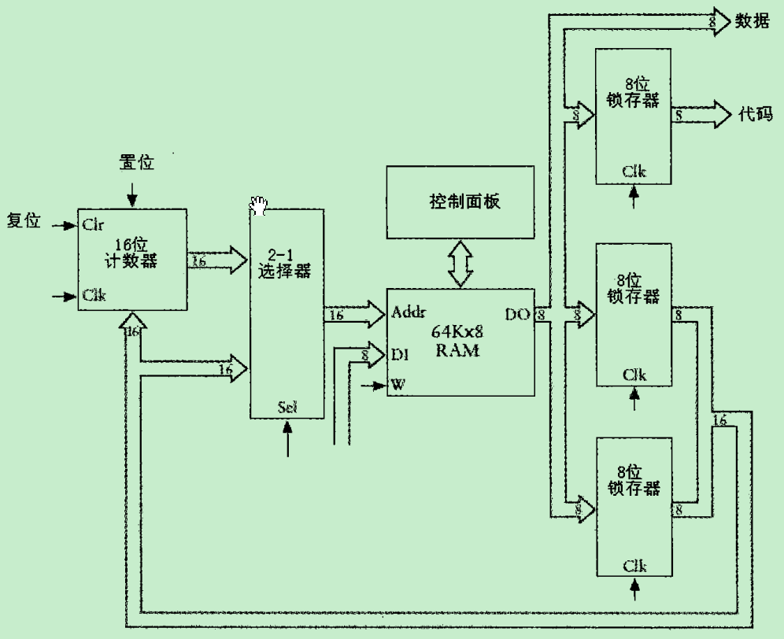

# 第一章 至亲密友
编码不是加密，编码是交流，是传递信息的方式。

# 第十章 逻辑与开关
## 逻辑符号
* 交集：$\bigcap$
* 并集：$\bigcup$

## 语言与逻辑公式
* 例如，所有人都必有一死；苏格拉底是人。
   * P表示所有人的集合
   * M表示必有一死的事物
   * S表示苏格拉底的集合
* 所有人都必有一死可表示为：P * M = P
* 苏格拉底是人可表示为：S * P = S
* 推论，S * (P * M) = S。根据结合律可表示为：(S * P) * M = S --> S * M = S。因此可推导出苏格拉底必有一死。如果推出的公式是：S * M = M，则表示苏格拉底会死，但是其他任何事物都是不死的。

## 布尔代数与传统代数的区别
最大的区别是，布尔代数存在加法分配律：
* W + (B * F) = (W + B) * (W + F)

# 第14章 反馈与触发器
触发器可实现电路的记忆功能，下面是带电平触发器的8位加法器，可实现一连串数字的连续加法：

分频器可由边沿触发器实现：

# 第16章 存储器组织
## 随机访问存储器RAM

由D触发器构成，时钟端由地址位控制，数据端的数据是否能起作用由地址位决定。简化后，结构如下图：

上图所示的电路之所以能够被称为储存器是因为它可以保存信息。它不仅可以在每个锁存器中存储新的数据，也可以检测每个锁存器都存储了什么数据。可以随机访问存储器，读写都很自由。通过排列组合后，可构成下图复杂的RAM阵列：

# 第17章 自动操作
如何优化上面的加法器，使其可以自动化工作，而无需人工一步一步输入。这里巧妙地利用了RAM的存储特点，以RAM为媒介，使输入和输出都以RAM的基础，而不是人的动作。另外通过将数据和操作分开，达到自动化不同行为，而不是单一的动作。
## 第一版累加器

数据与代码指令操作的关系：

## 第二版累加器
如何改进代码段与数据段，使其更加灵活？

实现上图设计的关键是把代码RAM阵列的数据输出到3个8位锁存器中。每个锁存器保存该3字节指令的一个字节。第一个锁存器保存指令代码本身，第二个锁存器保存地址的高字节，第三个锁存器保存地址的低字节。第二个和第三个锁存器的输出构成了数据RAM阵列的16位地址。

* 取指令(instruction fetch)
   * 从存储器取出指令的过程称为取指令。
* 执行指令(execute)
   * 机器相应指令码做一系列操作的过程称为执行指令。

## 第三版累加器
通过选择器将两个RAM并成一个RAM。

## 第四版累加器
为了实现Jump指令，修改上面的累加器。只有当指令代码为Jump指令时，才确保16位计数器的置位信号位1。

## 总结
一台数字计算机主要由4部分构成：处理器(processor)、存储器(memory)，至少一个输入(input)设备和一个输出(output)设备。
### 机器码
能够被处理器相应的操作码，为了便于记忆。
* 把1003h地址的字节加载到累加器
   * `LOD A, [1003h]`。位于指令右侧的A和[1003h]被称为参数，它们时这个Load指令的操作对象。参数由两部分组成，左边的操作数称为目标(destination)操作数(A代表累加器)，右边的操作数称为源(source)操作数。
* 如果零标志位不是1则调转到0000h地址处
   * `JNZ 0000h`, 注意这里没有方括号，因为跳转指令要转移到的地址时0000h，而不是保存于0000h地址的值，即0000h地址就是跳转指令的操作数。

