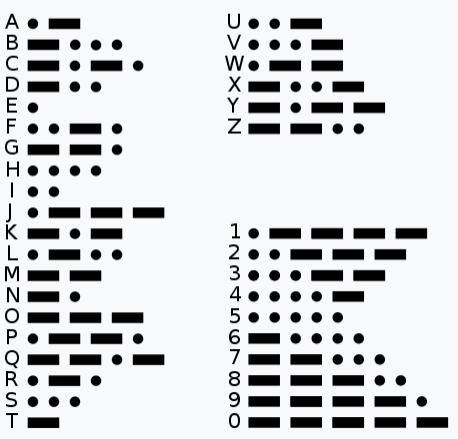
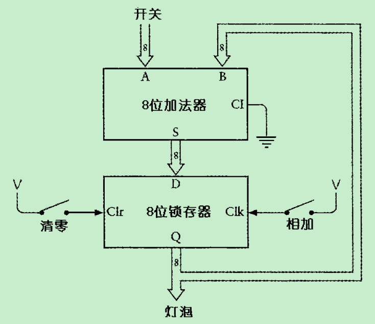
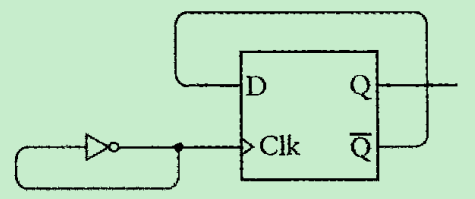

# 第一章 至亲密友
编码不是加密，编码是交流，是传递信息的方式。

# 第十章 逻辑与开关
## 逻辑符号
* 交集：$\bigcap$
* 并集：$\bigcup$

## 语言与逻辑公式
* 例如，所有人都必有一死；苏格拉底是人。
   * P表示所有人的集合
   * M表示必有一死的事物
   * S表示苏格拉底的集合
* 所有人都必有一死可表示为：P * M = P
* 苏格拉底是人可表示为：S * P = S
* 推论，S * (P * M) = S。根据结合律可表示为：(S * P) * M = S --> S * M = S。因此可推导出苏格拉底必有一死。如果推出的公式是：S * M = M，则表示苏格拉底会死，但是其他任何事物都是不死的。

## 布尔代数与传统代数的区别
最大的区别是，布尔代数存在加法分配律：
* W + (B * F) = (W + B) * (W + F)

# 第14章 反馈与触发器
触发器可实现电路的记忆功能，下面是带电平触发器的8位加法器，可实现一连串数字的连续加法：

分频器可由边沿触发器实现：
