# 序
《计算机程序的构造和解释》读书笔记

* 本书中三类需要关注的对象：
    * 人的大脑
    * 计算机程序的集合
    * 计算机本身

## 环境搭建：VSCode + Racket
* 参考文档
    * https://zhuanlan.zhihu.com/p/34313034
    * https://chee5e.space/sicp-vscode-setup/
    * https://docs.racket-lang.org/sicp-manual/Installation.html
* 安装Racket
    ```sh
    sudo add-apt-repository ppa:plt/racket -y
    sudo apt-get install racket -y
    ```
    * 安装过程需要一定时间，完成后可打开如下图形界面：
    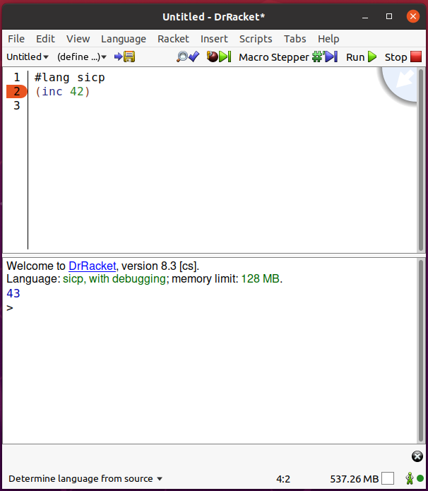
    * 安装完成后检查`racket`和`raco`命令是否能在命令行中正确执行
* 在VSCode中安装Magic Racket插件，并安装racket-langserver
    * `raco pkg install racket-langserver`
* 执行[hello程序](./code/hello/Makefile)
* 通过drRacket图形界面，安装 SICP package，以支持`#lang sicp`
    * 参考：https://docs.racket-lang.org/sicp-manual/Installation.html


# 构造过程抽象
* 心智活动的三个方面
    * 组合
        * 简单认识组合为一个复合认识
    * 类比
        * 将两个认识放在一起对照，得到相互关系的认识
    * 抽象
        * 将有关认识与其他认识隔离

## 程序设计的基本元素
为了将简单的认识组合起来形成更复杂的认识，每种语言都提供了三种机制：
* 基本表达式
    * 用于表示语言所关心的最简单的个体
* 组合的方法
    * 通过它们可以从较简单的东西出发构造出复合的元素
* 抽象的方法
    * 通过它们可以为复合对象命名，并将它们当作单元去操作

程序设计中，需要处理两类要素：
* 数据
    * 是一种我们希望去操作的“东西”
* 过程
    * 是有关操作这些数据的规则的描述

### 表达式
前缀表达式的有点：
* 适用于可能带有任意个实参的过程
* 可以直接扩充，允许出现组合式嵌套的情况

### 命名和环境
命名提供了一种通过名字去使用计算对象的方式，名字标识符称为变量。

### 组合式求值
要求值一个组合式，需要做两件事情：
* 求值该组合式的各个子表达式
* 将运算符的值应用于其他运算对象的值

对于基本表达式(数、内部运算符或者其它名字)，按如下规则处理：
* 数的值就是它们所表示的数值
* 内部运算符的值就是能完成相应操作的机器指令
* 其他名字的值就是在环境中关联于这个名字的那个对象

### 复合过程
以下元素是程序设计语言里必然会出现的：
* 数和算术运算是基本的数据和过程
* 组合式的嵌套提供了一种组织起多个操作的方法
* 定义是一种受限的抽象手段，它为名字关联相应的值

复合过程的使用方式与基本过程完全一样，用户无法分辨其是直接做在解释器里，还是被定义为一个复合过程。

### 过程应用的代换模型
过程应用的计算过程是：将复合过程应用于实际参数，就是将过程体中的每个形参用相应的实参取代后，对这一过程体求值。这一过程称为代换模型。需要强调的是：代换模型只用于帮助理解过程调用，解释器实际工作模式可能不同。

* 应用序
    * 先求值参数而后应用
    * Lisp采用应用序，这样做能避免对于表达式的重复求值
* 正则序
    * 完全展开后归约

### 条件表达式和谓词
根据检测的结果去确定接下来的不同操作。

* if表达式
    * `(if <predicate> <consequent> <alternative>)`
    * 在求值一个if表达式时，解释器从求值其`<predicate>`部分开始，如果`<predicate>`得到真值，解释器就去求值`<consequent>`并返回其值，否则它就去求值`<alternative>`并返回其值。
        * 解释器会在`<consequent>`和`<alternative>`中选择一个执行，这点非常重要，在练习1.6中，普通函数`new-if`会按应用序同时求值`<consequent>`和`<alternative>`，从而导致栈溢出

### 实例：采用牛顿法求平方根
函数与过程之间的矛盾在于：
* 函数是在描述一件事情的特征，是说明性的知识(是什么)，如：√x=那样的y，使得y≧0且y²=x
* 过程是描述如何去做这件事情，是行动性的知识(怎么做)，如：求√x的值

牛顿法求平方根的Lisp表示，求`x`的平方根`guess`：
```c
// 定义sqrt-iter，用牛顿法求x的平方法，初始猜测值为guess
(define (sqrt-iter guess x)
    (if (good-enough? guess x)
        guess
        (sqrt-iter (improve guess x)
                    x
        )
    )
)

// 定义improve，求比guess更精确的x平方根的猜测值
(define (improve guess x)
    average guess (/ x guess)
)

// 定义average，求x,y的平均值
(define (average x y)
    (/ (+ x y) 2)
)

// 定义good-enough?，判断guess是否在x平方根的误差范围
(define (good-enough? guess x)
    (< (abs (- (square guess) x)) 0.001)
)

// 以1作为所有数的初始猜测值
(define (sqrt x)
    (sqrt-iter 1.0 x)
)
```

### 过程作为黑箱抽象
* 局部名
* 内部定义和块结构

## 过程与它们所产生的计算
### 线性的递归和迭代
计算阶乘的两种方式：
* 递归
    * n * (n-1)!
    * 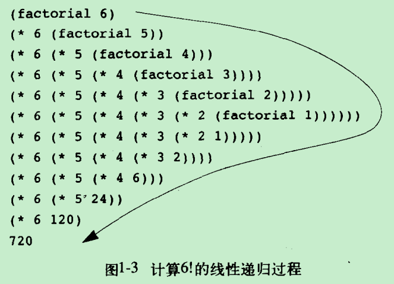
    * 先逐步展开，后收缩
* 迭代
    * (1 * 1）* 2 * 3 ...
    * 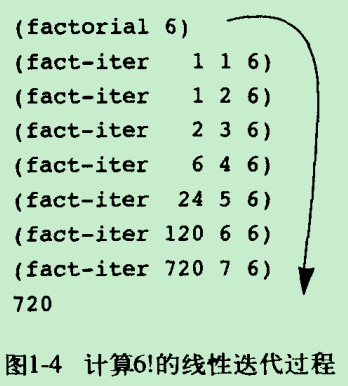
    * 没有增长或收缩
    * 状态可以用固定数目的状态变量描述的计算过程
    * 存在一套固定的规则，描述了计算过程在一个状态到下一状态转换时，这些变量的更新方式

递归和迭代对比：
* 迭代在计算过程中的任何一点，状态变量都提供了完整的描述，如果想要重新唤起一个停止的计算，只需要为解释器提供有关状态变量的值即可
* 但是对于递归计算而言，还存在一些“隐含”信息，它们并未保存在程序变量里，而是由解释器维持着，指明了在所推迟的运算所形成的链条里的漫游中， 这一计算过程处在何处。这个链条越长，需要保存的信息就越多

递归计算过程和递归过程：
* 递归计算过程对应迭代计算过程，即，它的状态不能由状态变量完全描述，需要借助解释器的帮助维持运算链条
* 递归过程可能产生出一个迭代计算过程，如：尾递归

### 树形递归
树形递归是有别于线性递归的另一种递归形式，如斐波那契数列的递归计算过程：

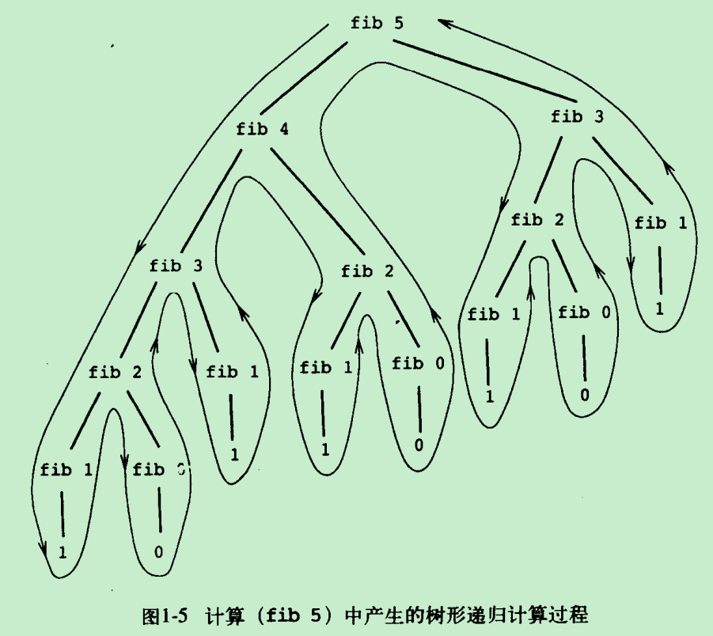
```c
(define (fib n)
    (cond ((= n 0) 0)
          ((= n 1) 1)
          (else (+ (fib (- n 1))
                   (fib (- n 2))
                )
          )
    )
)
```

树形递归的斐波那契数列有很多冗余计算，例如上图中求(fib 3)就重复做了两次。这样，树形递归所用的计算步骤将随着输入增长而指数性地增长。但在另一方面，其空间需求只是随着输入增长而线性增长。一般说，树形递归计算过程里所需要的步骤数正比于树中的结点数，其空间需求正比于树的最大深度。

#### 斐波那契数列的迭代计算过程
```c
(define (fib n)
    (fib-iter 1 0 n)
)

(define (fib-iter a b count)
    (if (= count 0)
        b
        (fib-iter (+ a b) a (- count 1))
    )
)
```
* 对比于树形递归，迭代计算过程所需步骤相对于n为线性的
* 迭代计算过程虽然高效，但是树形递归计算更加直截了当，迭代过程则需要采用三个状态变量的迭代

#### 实例：换零钱方式的统计
将总数为a的现金换成n种硬币的不同方式的数目等于：
* 将现金数a换成除第一种硬币(d)之外的所有其他硬币的不同方式数目，加上
* 将现金数(a-d)换成所有种类的硬币的不同方式数目，其中的d是第一种硬币的币值

这样会产生一个树形的递归计算过程，同样会存在冗余计算。例如，1,5,10硬币换总数a，那么(a-10)和(a-5-5)就会重复计算。

## 用高阶函数做抽象
高阶过程以过程作为参数，或者以过程作为返回值，极大地增强语言的表述能力。

### 过程作为参数
求和记法∑使数学家能去处理求和的概念本身，而不只是某个特定的求和。与此类似，我们也希望所用的语言能写出一个过程，去表述求和的概念，而不是只能写计算特定求和的过程。例如，下面的程序`sum`：
```c
(define (sum term a next b)
    (if (> a b)
        0
        (+ (term a)
           (sum term (next a) next b)
        )
    )
)
```
可被用于定义求a,b之间数的立方和`sum-cubes`，如下：
```c
(define (sum-cubes a b)
    (sum cube a inc b)
)

(define (inc n) (+ n 1))
```

### 用lambda构造过程
* 没有用lambda，计算`pi-sum`：1/(1*3) + 1/(5*7) + ...
    ```c
    (define (pi-sum a b)
        (define (pi-term x) (/ 1.0 (* x (+ x 2))))
        (define (pi-next x) (+ x 4))
        (sum pi-term a pi-next b)
    )
    ```
* 利用lambda后，`pi-sum`可表示为：
    ```c
    (define (pi-sum a b)
        (sum (lambda (x) (/ 1.0 (* x (+ x 2))))
             a
             (lambda (x) (+ x 4))
             b
        )
    )
    ```

# 构造数据抽象
* 为什么在程序设计语言里需要复合数据？
    * 与我们需要复合过程的原因一样：同样是为了提升我们在设计程序时所位于的概念层次，提高设计的模块性，增强语言的表达能力
    * 构造复合过程使我们可能在更高的概念层次上处理计算工作
    * 构造复合数据使我们可能在更高的概念层次上处理与数据有关的各种问题

## 数据抽象导引
数据抽象是一种方法学，它使我们能将一个复合数据对象的使用，与该数据对象怎样由更基本的数据对象构造起来的细节隔离开。
使用数据和定义数据之间的界面是一组过程，称为“选择函数”和“构造函数”。

### 实例：有理数的算术运算
假定有关的构造函数和选择函数如下：
* (make-rat <n> <d>) 返回一个有理数，其分子是整数<n>，分母是整数<d>
* (number <x>) 返回有理数<x>的分子
* (denom <x>) 返回有理数<x>的分母

这样我们就可以基于`make-rat`,`number`,`denom`定义有理数的各种运算，虽然这些构造和选择函数还没有定义

### 抽象屏障
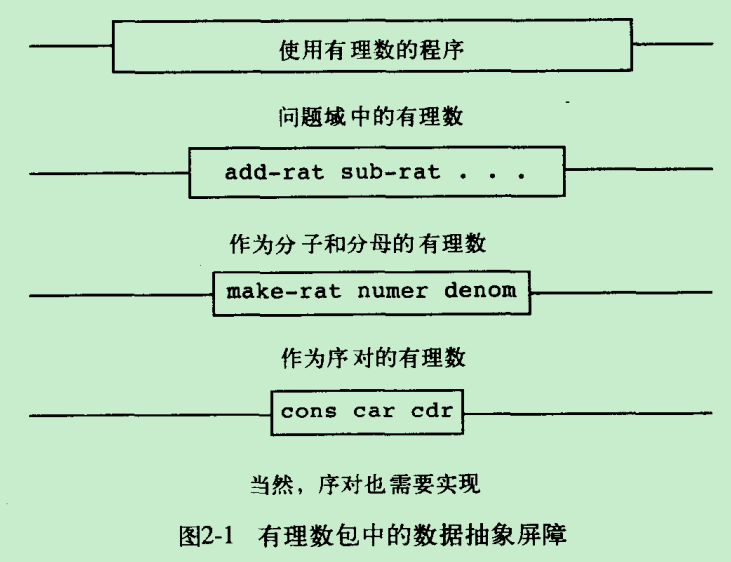
* 抽象屏障把使用数据抽象的程序与实现数据抽象的程序分离开

## 层次性数据和闭包性质
某种组合数据对象的操作满足闭包性质，意思是通过它组合起来的数据对象本身还可以通过同样的操作再进行组合。

### 序列的表示
* 用序对表示序列
    * 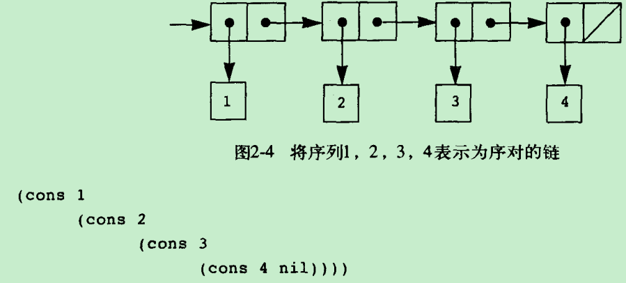
    * 上面的序列也可等价为：`(list <a1> <a2> <a3> ... <an>)`

### 层次性结构
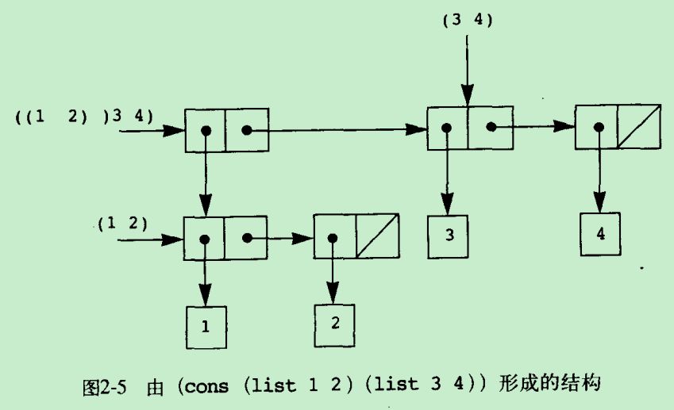
* 用多层序列可以组合成树

### 序列作为一种约定的界面
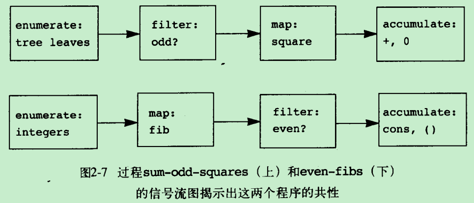

上图揭示了对序列操作的信号流。我们经常将枚举工作散布在程序种，将它与映射、过滤器和累积器混在一起。如果我们能够重新组织程序，使得信号流结构明显表现在写出的过程种，将会大大提高结果代码的清晰性。

## 符号数据
到目前为止，我们使用过的所有复合数据，最终都是从数值出发构造起来的。在这一节里，我们要扩充所用语言的表述能力，引进将任意符号作为数据的功能。
### 引号
将表和符号标记为应该作为数据对象看待，而不是作为应该求值的表达式。
```c
(define a 1)
(define b 2)
(list a b) // (1, 2)
(list 'a 'b) // (a, b)
(list 'a b) // (a, 2)
```

### 实例：集合的表示
集合可由以下不同的形式表示：
* 未排序的表
    * 查找效率：O(n)
    * 求交集或并集的时间复杂度是：O(n^2)
* 排序的表
    * 查找效率：O(n)，平均查找效率：O(n/2)
    * 求交集或并集的时间复杂度是：O(n)
* 二叉树
    * 平衡二叉树的优点在于使查找效率变为：O(log n)

### Huffman编码
如果能够保证，每个字符的完整编码都不是另一字符编码的前缀(称为前缀码)，那么可以采用变长编码节约空间。Huffman编码就是这样的一种编码。

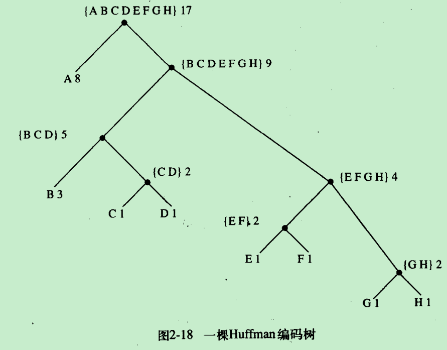

一个Huffman编码可以表示为一棵树，其中
* 树叶是被编码的符号
* 每个节点被赋予权重，表示它的出现频率
* 任意树叶上的符号的编码，可从树根开始向下运动，左0右1，进行编码


## 抽象数据的多重表示
对于一个数据对象可能存在多种表示形式，如：复数有直角坐标形式和极坐标形式。因此，除了需要将表示与使用相隔离外，还需要有抽象屏障去隔离互不相同的设计选择，以便允许不同的设计选择在同一个程序里共存。

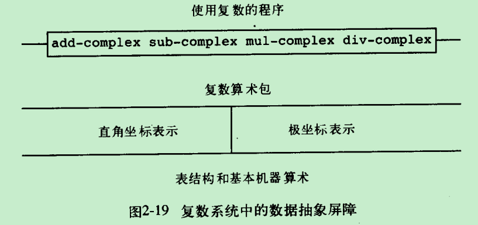

* 如何通过类型标志和通用型操作，使复数的两种表示共存在一个系统中？
    * 构造赛格选择函数：real-part, imag-part, magnitude, angle
    * 添加类型标志，使数据可以为高层过程所识别，基于类型分派


### 数据导向的程序设计和可加性
基于类型的分派的缺点是：在每次增加一种新表示形式时，实现通用选择函数的人都必须修改他们的过程，而那些做独立表示的界面的人也必须修改其代码，以避免名字冲突问题。

数据导向的程序设计提供了进一步模块化，使程序能直接利用表格工作的程序设计技术。如果需要增加一种表示形式，只需要在表格中添加新条目即可。

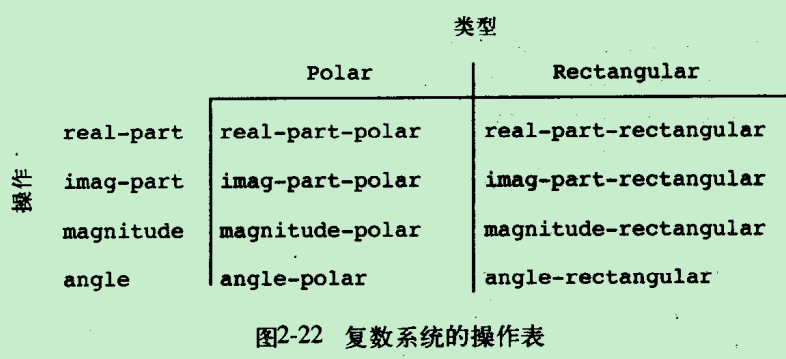

假定有两个过程：
* `(put <op> <type> <item>)`
* `(get <op> <type>)`

定义`apply-generic`根据数据类型，从表格中找到对应的op，并应用于此数据。新增表示类型，这部分代码应不需要修改：
```c
(define (apply-generic op . args)
    (let ((type-tags (map type-tag args)))
        (let ((proc (get op type-tags)))
            (if proc
                (apply proc (map contents args))
                (error "error")
            )
        )
    )
)
```

### 消息传递
在数据导向的程序设计里，最关键的想法使通过显式处理操作-类型表格的方式，管理程序中的各种通用型操作，是一种方式是基于类型进行分派的组织方式。

另一种策略是通过消息传递，将数据对象设想为一个实体，它以“消息”的方式接收所需操作，如下，`make-from-real-imag`返回一个过程，不是数据对象：
```c
(define (make-from-real-imag x y)
    (define (dispatch op)
        (cond ((eq? op 'real-part) x)
                ((eq? op 'imag-part) y)
        )
    )
    dispatch
)
```
