# 序
《计算机程序的构造和解释》读书笔记

* 本书中三类需要关注的对象：
    * 人的大脑
    * 计算机程序的集合
    * 计算机本身

## 环境搭建：VSCode + Racket
* 参考文档
    * https://zhuanlan.zhihu.com/p/34313034
    * https://chee5e.space/sicp-vscode-setup/
    * https://docs.racket-lang.org/sicp-manual/Installation.html
* 安装Racket
    ```sh
    sudo add-apt-repository ppa:plt/racket -y
    sudo apt-get install racket -y
    ```
    * 安装过程需要一定时间，完成后可打开如下图形界面：
    
    * 安装完成后检查`racket`和`raco`命令是否能在命令行中正确执行
* 在VSCode中安装Magic Racket插件，并安装racket-langserver
    * `raco pkg install racket-langserver`
* 执行[hello程序](./code/hello/Makefile)
* 通过drRacket图形界面，安装 SICP package，以支持`#lang sicp`
    * 参考：https://docs.racket-lang.org/sicp-manual/Installation.html


# 构造过程抽象
* 心智活动的三个方面
    * 组合
        * 简单认识组合为一个复合认识
    * 类比
        * 将两个认识放在一起对照，得到相互关系的认识
    * 抽象
        * 将有关认识与其他认识隔离

## 程序设计的基本元素
为了将简单的认识组合起来形成更复杂的认识，每种语言都提供了三种机制：
* 基本表达式
    * 用于表示语言所关心的最简单的个体
* 组合的方法
    * 通过它们可以从较简单的东西出发构造出复合的元素
* 抽象的方法
    * 通过它们可以为复合对象命名，并将它们当作单元去操作

程序设计中，需要处理两类要素：
* 数据
    * 是一种我们希望去操作的“东西”
* 过程
    * 是有关操作这些数据的规则的描述

### 表达式
前缀表达式的有点：
* 适用于可能带有任意个实参的过程
* 可以直接扩充，允许出现组合式嵌套的情况

### 命名和环境
命名提供了一种通过名字去使用计算对象的方式，名字标识符称为变量。

### 组合式求值
要求值一个组合式，需要做两件事情：
* 求值该组合式的各个子表达式
* 将运算符的值应用于其他运算对象的值

对于基本表达式(数、内部运算符或者其它名字)，按如下规则处理：
* 数的值就是它们所表示的数值
* 内部运算符的值就是能完成相应操作的机器指令
* 其他名字的值就是在环境中关联于这个名字的那个对象

### 复合过程
以下元素是程序设计语言里必然会出现的：
* 数和算术运算是基本的数据和过程
* 组合式的嵌套提供了一种组织起多个操作的方法
* 定义是一种受限的抽象手段，它为名字关联相应的值

复合过程的使用方式与基本过程完全一样，用户无法分辨其是直接做在解释器里，还是被定义为一个复合过程。

### 过程应用的代换模型
过程应用的计算过程是：将复合过程应用于实际参数，就是将过程体中的每个形参用相应的实参取代后，对这一过程体求值。这一过程称为代换模型。需要强调的是：代换模型只用于帮助理解过程调用，解释器实际工作模式可能不同。

* 应用序
    * 先求值参数而后应用
    * Lisp采用应用序，这样做能避免对于表达式的重复求值
* 正则序
    * 完全展开后归约

### 条件表达式和谓词
根据检测的结果去确定接下来的不同操作。

* if表达式
    * `(if <predicate> <consequent> <alternative>)`
    * 在求值一个if表达式时，解释器从求值其`<predicate>`部分开始，如果`<predicate>`得到真值，解释器就去求值`<consequent>`并返回其值，否则它就去求值`<alternative>`并返回其值。
        * 解释器会在`<consequent>`和`<alternative>`中选择一个执行，这点非常重要，在练习1.6中，普通函数`new-if`会按应用序同时求值`<consequent>`和`<alternative>`，从而导致栈溢出

### 实例：采用牛顿法求平方根
函数与过程之间的矛盾在于：
* 函数是在描述一件事情的特征，是说明性的知识(是什么)，如：√x=那样的y，使得y≧0且y²=x
* 过程是描述如何去做这件事情，是行动性的知识(怎么做)，如：求√x的值

牛顿法求平方根的Lisp表示，求`x`的平方根`guess`：
```c
// 定义sqrt-iter，用牛顿法求x的平方法，初始猜测值为guess
(define (sqrt-iter guess x)
    (if (good-enough? guess x)
        guess
        (sqrt-iter (improve guess x)
                    x
        )
    )
)

// 定义improve，求比guess更精确的x平方根的猜测值
(define (improve guess x)
    average guess (/ x guess)
)

// 定义average，求x,y的平均值
(define (average x y)
    (/ (+ x y) 2)
)

// 定义good-enough?，判断guess是否在x平方根的误差范围
(define (good-enough? guess x)
    (< (abs (- (square guess) x)) 0.001)
)

// 以1作为所有数的初始猜测值
(define (sqrt x)
    (sqrt-iter 1.0 x)
)
```

### 过程作为黑箱抽象
* 局部名
* 内部定义和块结构

## 过程与它们所产生的计算
### 线性的递归和迭代
计算阶乘的两种方式：
* 递归
    * n * (n-1)!
    * 
    * 先逐步展开，后收缩
* 迭代
    * (1 * 1）* 2 * 3 ...
    * 
    * 没有增长或收缩
    * 状态可以用固定数目的状态变量描述的计算过程
    * 存在一套固定的规则，描述了计算过程在一个状态到下一状态转换时，这些变量的更新方式

递归和迭代对比：
* 迭代在计算过程中的任何一点，状态变量都提供了完整的描述，如果想要重新唤起一个停止的计算，只需要为解释器提供有关状态变量的值即可
* 但是对于递归计算而言，还存在一些“隐含”信息，它们并未保存在程序变量里，而是由解释器维持着，指明了在所推迟的运算所形成的链条里的漫游中， 这一计算过程处在何处。这个链条越长，需要保存的信息就越多

递归计算过程和递归过程：
* 递归计算过程对应迭代计算过程，即，它的状态不能由状态变量完全描述，需要借助解释器的帮助维持运算链条
* 递归过程可能产生出一个迭代计算过程，如：尾递归

### 树形递归
树形递归是有别于线性递归的另一种递归形式，如斐波那契数列的递归计算过程：


```c
(define (fib n)
    (cond ((= n 0) 0)
          ((= n 1) 1)
          (else (+ (fib (- n 1))
                   (fib (- n 2))
                )
          )
    )
)
```

树形递归的斐波那契数列有很多冗余计算，例如上图中求(fib 3)就重复做了两次。这样，树形递归所用的计算步骤将随着输入增长而指数性地增长。但在另一方面，其空间需求只是随着输入增长而线性增长。一般说，树形递归计算过程里所需要的步骤数正比于树中的结点数，其空间需求正比于树的最大深度。

#### 斐波那契数列的迭代计算过程
```c
(define (fib n)
    (fib-iter 1 0 n)
)

(define (fib-iter a b count)
    (if (= count 0)
        b
        (fib-iter (+ a b) a (- count 1))
    )
)
```
* 对比于树形递归，迭代计算过程所需步骤相对于n为线性的
* 迭代计算过程虽然高效，但是树形递归计算更加直截了当，迭代过程则需要采用三个状态变量的迭代

#### 实例：换零钱方式的统计
将总数为a的现金换成n种硬币的不同方式的数目等于：
* 将现金数a换成除第一种硬币(d)之外的所有其他硬币的不同方式数目，加上
* 将现金数(a-d)换成所有种类的硬币的不同方式数目，其中的d是第一种硬币的币值

这样会产生一个树形的递归计算过程，同样会存在冗余计算。例如，1,5,10硬币换总数a，那么(a-10)和(a-5-5)就会重复计算。

## 用高阶函数做抽象
高阶过程以过程作为参数，或者以过程作为返回值，极大地增强语言的表述能力。

### 过程作为参数
求和记法∑使数学家能去处理求和的概念本身，而不只是某个特定的求和。与此类似，我们也希望所用的语言能写出一个过程，去表述求和的概念，而不是只能写计算特定求和的过程。例如，下面的程序`sum`：
```c
(define (sum term a next b)
    (if (> a b)
        0
        (+ (term a)
           (sum term (next a) next b)
        )
    )
)
```
可被用于定义求a,b之间数的立方和`sum-cubes`，如下：
```c
(define (sum-cubes a b)
    (sum cube a inc b)
)

(define (inc n) (+ n 1))
```

### 用lambda构造过程
* 没有用lambda，计算`pi-sum`：1/(1*3) + 1/(5*7) + ...
    ```c
    (define (pi-sum a b)
        (define (pi-term x) (/ 1.0 (* x (+ x 2))))
        (define (pi-next x) (+ x 4))
        (sum pi-term a pi-next b)
    )
    ```
* 利用lambda后，`pi-sum`可表示为：
    ```c
    (define (pi-sum a b)
        (sum (lambda (x) (/ 1.0 (* x (+ x 2))))
             a
             (lambda (x) (+ x 4))
             b
        )
    )
    ```

# 构造数据抽象
* 为什么在程序设计语言里需要复合数据？
    * 与我们需要复合过程的原因一样：同样是为了提升我们在设计程序时所位于的概念层次，提高设计的模块性，增强语言的表达能力
    * 构造复合过程使我们可能在更高的概念层次上处理计算工作
    * 构造复合数据使我们可能在更高的概念层次上处理与数据有关的各种问题

## 数据抽象导引
数据抽象是一种方法学，它使我们能将一个复合数据对象的使用，与该数据对象怎样由更基本的数据对象构造起来的细节隔离开。
使用数据和定义数据之间的界面是一组过程，称为“选择函数”和“构造函数”。

### 实例：有理数的算术运算
假定有关的构造函数和选择函数如下：
* (make-rat <n> <d>) 返回一个有理数，其分子是整数<n>，分母是整数<d>
* (number <x>) 返回有理数<x>的分子
* (denom <x>) 返回有理数<x>的分母

这样我们就可以基于`make-rat`,`number`,`denom`定义有理数的各种运算，虽然这些构造和选择函数还没有定义

### 抽象屏障

* 抽象屏障把使用数据抽象的程序与实现数据抽象的程序分离开

## 层次性数据和闭包性质
某种组合数据对象的操作满足闭包性质，意思是通过它组合起来的数据对象本身还可以通过同样的操作再进行组合。

### 序列的表示
* 用序对表示序列
    * 
    * 上面的序列也可等价为：`(list <a1> <a2> <a3> ... <an>)`

### 层次性结构

* 用多层序列可以组合成树

### 序列作为一种约定的界面


上图揭示了对序列操作的信号流。我们经常将枚举工作散布在程序种，将它与映射、过滤器和累积器混在一起。如果我们能够重新组织程序，使得信号流结构明显表现在写出的过程种，将会大大提高结果代码的清晰性。

## 符号数据
到目前为止，我们使用过的所有复合数据，最终都是从数值出发构造起来的。在这一节里，我们要扩充所用语言的表述能力，引进将任意符号作为数据的功能。
### 引号
将表和符号标记为应该作为数据对象看待，而不是作为应该求值的表达式。
```c
(define a 1)
(define b 2)
(list a b) // (1, 2)
(list 'a 'b) // (a, b)
(list 'a b) // (a, 2)
```

### 实例：集合的表示
集合可由以下不同的形式表示：
* 未排序的表
    * 查找效率：O(n)
    * 求交集或并集的时间复杂度是：O(n^2)
* 排序的表
    * 查找效率：O(n)，平均查找效率：O(n/2)
    * 求交集或并集的时间复杂度是：O(n)
* 二叉树
    * 平衡二叉树的优点在于使查找效率变为：O(log n)

### Huffman编码
如果能够保证，每个字符的完整编码都不是另一字符编码的前缀(称为前缀码)，那么可以采用变长编码节约空间。Huffman编码就是这样的一种编码。


一个Huffman编码可以表示为一棵树，其中
* 树叶是被编码的符号
* 每个节点被赋予权重，表示它的出现频率
* 任意树叶上的符号的编码，可从树根开始向下运动，左0右1，进行编码


## 抽象数据的多重表示
对于一个数据对象可能存在多种表示形式，如：复数有直角坐标形式和极坐标形式。因此，除了需要将表示与使用相隔离外，还需要有抽象屏障去隔离互不相同的设计选择，以便允许不同的设计选择在同一个程序里共存。


* 如何通过类型标志和通用型操作，使复数的两种表示共存在一个系统中？
    * 构造赛格选择函数：real-part, imag-part, magnitude, angle
    * 添加类型标志，使数据可以为高层过程所识别，基于类型分派


### 数据导向的程序设计和可加性
基于类型的分派的缺点是：在每次增加一种新表示形式时，实现通用选择函数的人都必须修改他们的过程，而那些做独立表示的界面的人也必须修改其代码，以避免名字冲突问题。

数据导向的程序设计提供了进一步模块化，使程序能直接利用表格工作的程序设计技术。如果需要增加一种表示形式，只需要在表格中添加新条目即可。


假定有两个过程：
* `(put <op> <type> <item>)`
* `(get <op> <type>)`

定义`apply-generic`根据数据类型，从表格中找到对应的op，并应用于此数据。新增表示类型，这部分代码应不需要修改：
```c
(define (apply-generic op . args)
    (let ((type-tags (map type-tag args)))
        (let ((proc (get op type-tags)))
            (if proc
                (apply proc (map contents args))
                (error "error")
            )
        )
    )
)
```

### 消息传递
在数据导向的程序设计里，最关键的想法使通过显式处理操作-类型表格的方式，管理程序中的各种通用型操作，是一种方式是基于类型进行分派的组织方式。

另一种策略是通过消息传递，将数据对象设想为一个实体，它以“消息”的方式接收所需操作，如下，`make-from-real-imag`返回一个过程，不是数据对象：
```c
(define (make-from-real-imag x y)
    (define (dispatch op)
        (cond ((eq? op 'real-part) x)
                ((eq? op 'imag-part) y)
        )
    )
    dispatch
)
```

# 模块化、对象和状态
在这一章里，我们要研究两种不同的组织策略：
* 将注意力集中在对象上，将一个大型系统看成一大批对象，它们的行为可能随着时间的进展而不断变化
    * 我们必须关注计算对象可以怎样变化而又同时保持其标识
    * 我们需要在这一计算模型中与时间搏斗，如果程序允许并发，事情就会变得困难
* 将注意力集中在流过系统的信息流上，非常像电子工程师观察一个信号处理系统
    * 流方式特别能够用于松解在我们的模型中对时间的模拟与计算机求值过程中的各种事情发生的顺序，称为延时求值的技术

## 赋值和局部状态
从一个复杂计算过程中一部分的观点看，其他部分都像是在随着时间不断变化，它们隐藏起自己的随时间变化的内部状态。与所有状态都必须显式地操作和传递额外参数的方式相比，通过引进赋值和将状态隐藏在局部变量中的技术，我们可能能以一种更模块化的方式构造系统，但是也有例外。

### 引进赋值的代价
不用任何赋值的程序设计称为：函数式程序设计。引入局部状态的对象，我们就不能保证以同样参数对同一过程的两次求值一定产生出同样的结果，因此任何具有“漂亮”数学性质的简单模型，都不能继续适合作为处理程序设计语言里的对象和赋值的框架了。

代换的最终基础是，语言里的符号不过是作为值的名字，而一旦引进了`set!`和变量的值可以变化的想法，一个变量就不再是一个简单的名字了。现在的一个变量索引着一个可以保存值的位置，而存储在那里的值也是可以改变的。

#### 同一和变化
```c
(define (make-simplified-withdraw balance)
    (lambda (amount)
        (set! balance (- balance amount))
        balance
    )
)

(define (make-decrementer balance)
    (lambda (amount)
        (- balance amount)
    )
)
```
* 下面D1和D2是同一的，但是W1和W2却不是
    ```c
    (define D1 (make-decrementer 25))
    (define D2 (make-decrementer 25))
    (define W1 (make-simplified-withdraw 25))
    (define W2 (make-simplified-withdraw 25))
    ```

#### 命令式程序设计的缺陷
与函数式程序设计相对应，广泛采用赋值的程序设计被称为命令式程序设计。带有赋值的程序将强迫人们去考虑赋值的相对顺序，以保证每个语句所用的式被修改变量的正确版本。例如：
* 函数式求阶乘
```c
(define (factorial n)
    (define (iter product counter)
        (if (> counter n)
            product
            (iter (* counter product)
                  (+ counter 1)
            )
        )
    )
    (iter 1 1)
)
```

* 命令式求阶乘
    * 需要保证`set!`的顺序
```c
(define (factorial n)
    (let ((product 1) (counter 1))
        (define (iter)
            (if (> counter n)
                product
                (begin (set! product (* counter product))
                       (set! counter (+ counter 1))
                       (iter)
                )
            )
        )
        (iter)
    )
)
```

## 求值的环境模型
一旦把赋值引入程序，一个变量已经不能再看作仅仅式某个值的名字，代换模型(将一个复合过程应用于一些实际参数，就是在用各个实际参数代换过程体里对应的形式参数之后，求值这个过程体)将不再适用。此时一个变量必须以某种方式制定了一个“位置”，相应的值可以存储在那里。这种位置将维持在称为**环境**的结构中。

一个环境就是框架(frame)的一个序列，每个框架是包含着一些约束的一个表格(可能为空)，这些约束将一些变量名字关联于对应的值(在一个框架里，任何变量至多只能有一个约束)。每个框架还包含着一个指针，指向这一框架的外围环境。如果由于当前讨论的目的，将相应的框架看作是全局的，那么它将没有外围环境。

一个变量相对于某个特定环境的值，也就是这一环境中，包含着该变量的第一个框架里这个变量的约束值。如果在序列中并不存在这一变量的约束，那么我们就说这个变量在该特定环境中是无约束的。

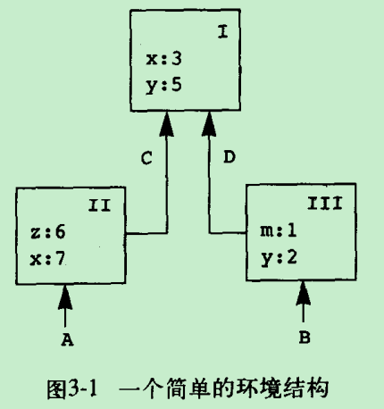

* 上图包含了3个框架(frame)，A,B,C,D都是环境指针
* 相对于环境A，我们说在框架II里x与7的约束遮蔽了框架I里x与3的约束

### 求值规则
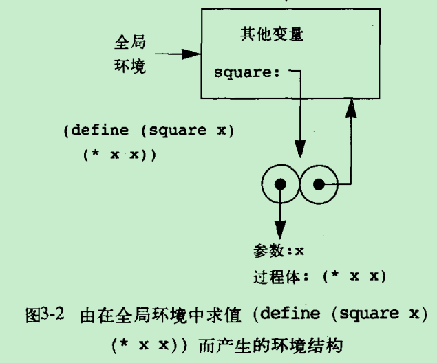
* 上图过程对象的环境部分是一个指向全局环境的指针，define建立定义的方式就是将新的约束加入框架里

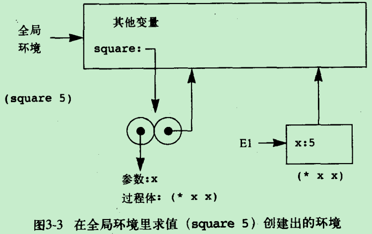
* 将一个过程应用于一组实际参数时，通过在全局环境里对表达式求值而创建了一个新环境E1，这个环境里包含着这个过程的形式参数x，被约束到实际参数5。现在要在E1里求值过程的体(* x x)，所以结果是25。

我们可以把过程应用的环境模型总结为以下两条规则：
* 将一个过程对象应用于一集实际参数，将构造出一个新框架，它的外围环境就是作为被应用的那个过程对象的一部分的环境
* 相对于一个给定环境求值一个lambda表达式，将创建一个过程对象，这个过程对象是一个序对，由该lambda表达式的正文和一个指向环境的指针组成，这一指针指向的就是创建这个过程对象时的环境

### 简单过程的应用
求值`(f 5)`:
```c
(define (square x) (* x x))
(define (sum-of-squares x y) (+ (square x ) (square y)))
(define (f a) (sum-of-squares (+ a 1) (* a 2)))
```
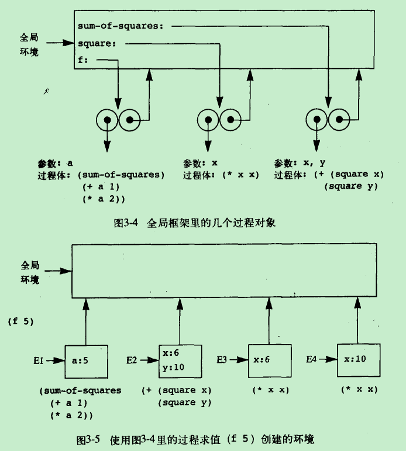

### 将框架看作局部状态的展台
求值`(W1 50)`:
```c
(define (make-withdraw balance)
    (lambda (amount)
        (if (>= balance amount)
            (begin (set! balance (- balance amount))
                balance
            )
            "Insufficient funds"
        )
    )
)

(define W1 (make-withdraw 100))
```
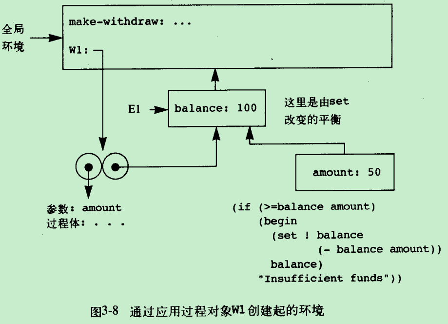
* 当`(W1 50)`发生时，首先要构造一个新框架，W1的形式参数amount在其中约束到实参50。这个框架的外围环境并不是全局环境，而是环境E1，因为它才是由过程对象W1所指定的环境
* 执行完`set!`后，即对W1的调用完成时，balance变成50，而包含着这个balance的框架仍由过程对象W1指着。约束amount的那个框架现在已经无关紧要了，因为下次W1被调用时，又会另起一个新框架，建立起amount的新约束

如果创建第二个对象W2：`(define W2 (make-withdraw 100))`，W1和W2的行为上完全独立：
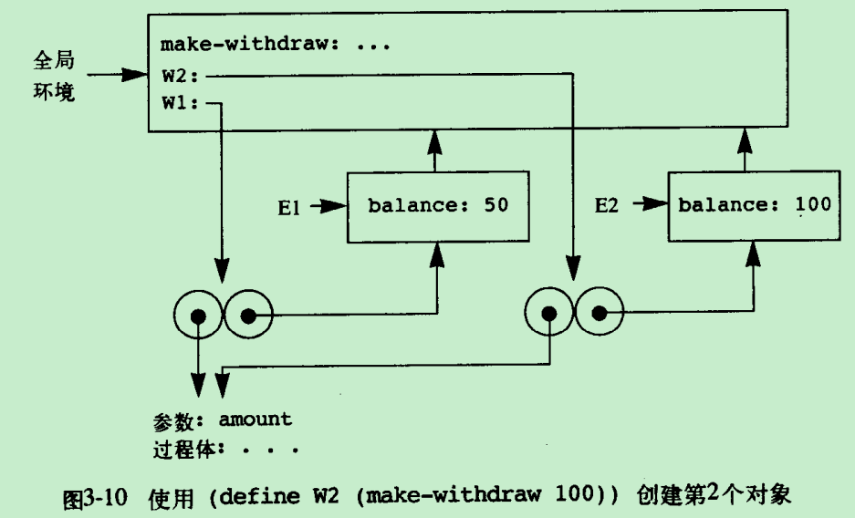

### 内部定义
```c
(define (sqrt x)
    (define (good-enough? guess)
        (< (abs(- (square guess) x)) 0.001)
    )
    (define (improve guess)
        (average guess (/ x guess))
    )
    (define (sqrt-iter guess)
        (if (good-enough? guess)
            guess
            (sqrt-iter (improve guess))
        )
    )
    (sqrt-iter 1.0)
)
```
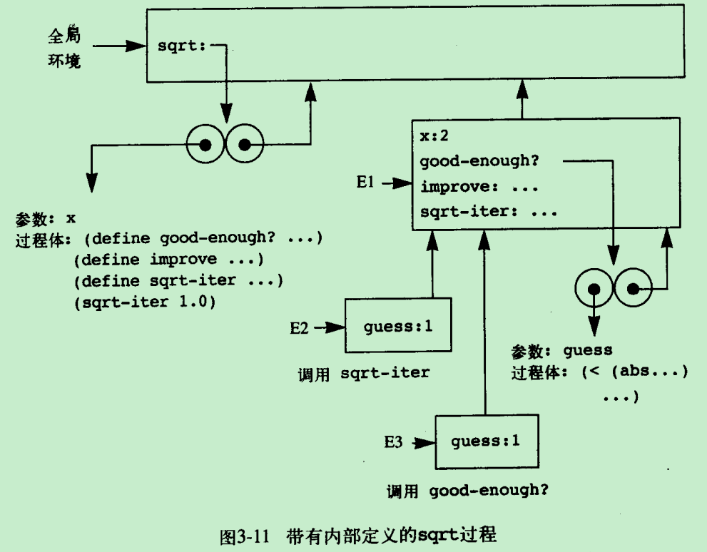
* `sqrt`是全局环境里的一个符号，被约束到一个过程对象，与之关联的是全局环境
* `sqrt`被调用，创建新环境E1
* `good-enough?`, `improve`和`sqrt-iter`在E1里被约束与对应的过程对象，其关联环境是E1
* `sqrt-iter`在E1中被调用，创建新环境E2
* `sqrt-iter`转而以guess的值作为实际参数调用`good-enough?`，创建新环境E3，这里需要注意的是`sqrt-iter`和`good-enough?`都以E1作为自己的外围环境
    * 因此，出现在`good-enough?`体内部的符号x将引用出现在E1里的x约束

## 用变动数据做模拟
### 数字电路的模拟器
通过此章节可以了解一个简单的数字电路仿真器的实现方法，大致分三部分：
* 基本功能块
    * 与或非等门电路
* 线路的表示
    * 连线
* 待处理表
    * 每个仿真时间的事件

### 约束的传播
在这一节里，我们要描述一种语言的设计，这种语言将使我们可以基于各种关系进行工作。例如：华氏温度和摄氏温度的关系是：`9C = 5(F - 32)`。这样的约束关系可以看作是如下的网络，通过基本加法约束、惩罚约束和常量约束组成。

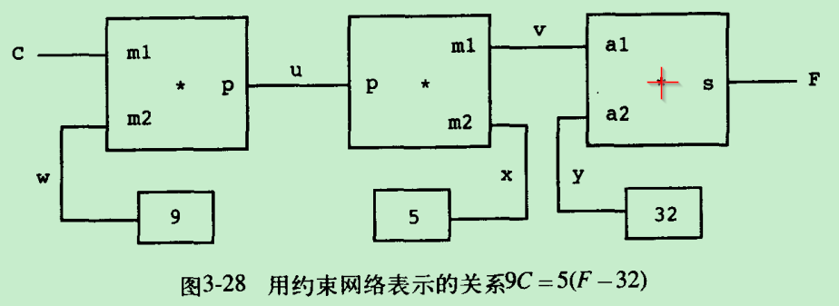


## 并发：时间是一个本质问题
引入赋值之后，我们就必须承认时间在所用的计算模型中的位置。在引入赋值之前，我们的所有程序都没有时间问题，也就是说，任何具有某个值的表达式，将总是具有这个值。

## 流
赋值所带来的复杂性来自于：
* 用具有局部状态的计算对象去模拟真实世界里具有局部状态的对象
* 用计算机里面随着时间的变化去表示真实世界里随着时间的变化，在计算机里，被模拟对象随着时间的变化是通过对那些模拟对象中局部变量的赋值实现的

我们能避免让计算机里的时间去对应于真实世界里的时间吗？我们可以将一个量x随时间变化的行为，描述为一个时间的函数`x(t)`。流处理使我们可以模拟一些包含状态的系统，但却不需要利用赋值或者变动数据实现。

### 流作为延时的表
将序列表示为表，需要付出低效的代码，比较两个程序，它们都计算一个区间里的素数和。
* 迭代版本
    ```c
    (define (sum-primes a b)
        (define (iter count accum)
            (cond ((> count b) accum)
                  ((prime? count) (iter (+ count 1) (+ count accum)))
                  (else (iter (+ count 1 ) accum))
            )
        )
        (iter a 0)
    )
    ```
* 使用序列操作`accumulate`
    ```c
    (define (sum-primes a b)
        (accumulate +
                    0
                    (filter prime? (enumerate-interval a b))
        )
    )
    ```
* 迭代版本只需要维持正在累积的和
* 而后者需要等`enumerate=interval`构造完成一区间里所有的整数表之后才能工作。并且过滤器将再产生另一个表。如果区间很大，这样的开销将无法容忍

流使一种非常巧妙的想法，使我们可能利用各种序列操作，但又不会带来将序列作为表去操作而引起的代价。可以同时满足：
* 像序列操作那么优雅
* 同时又能得到递增计算的效率

流的基本思想是：只是部分地构造出流的结构，如果使用者需要访问这个流的尚未构造出的部分，那么这个流就会自动地继续构造下去。流的实现基于一种称为`delay`的特殊形式。对于`(delay <exp>)`的求值将不对表达式`<exp>`求值，而是返回一个称为延时对象的对象，它可以看作是对在未来的某个时间求值`<exp>`的允诺。例如，创建流序对：`cons-stream <a> <b>`等价于：`(cons <a> (delay <b>))`。用流实现上面的程序：
```c
(stream-car
    (stream-cdr
        (stream-filter prime?
            (stream-enumerate-interval 10000 100000)
        )
    )
)

(define (stream-enumerate-interval low high)
    (if (> low high)
        the-empty-stream
        (cons-stream
            low
            (stream-enumerate-interval (+ low 1) high)
        )
    )
)

(define (stream-filter pred stream)
    (cond ((stream-null? stream) the-empty-stream)
          ((pred (stream-car stream))
           (cons-stream (stream-car stream) (stream-filter pred (stream-cdr stream)))
           (else (stream-filter pred (stream-cdr stream)))
          )
    )
)
```
* `stream-enumerate-interval`返回一个流，其car是10000，而其cdr是一个允诺，其意为如果需要，就能枚举出这个区间里更多的东西，优点类似python里面的generator?
* `stream-filter`中的`stream-cdr`将迫使系统对延时的`stream-enumerate-interval`求值

#### delay和force的实现
* `(delay <exp>)`可以实现为：`(lambda () <expr>)`
* force的实现：
    ```c
    (define (force delayed-object)
        (delayed-object)
    )
    ```

### 无穷流
```c
(define (integers-starting-from n)
    (cons-stream n (integers-starting-from (+ n 1)))
)

(define integers (integers-starting-from 1))
```

### 流计算模式的使用
* 系统地将迭代操作方式表示为流过程
    * 以求平方根为例，在原来的`sqrt`过程里，我们用某一个状态变量的一系列值表示猜测值。换一种方式，我们也可以生成一个无穷的猜测序列：
    ```c
    (define (sqrt-stream x)
        (define guesses
            (cons-stream
                1.0
                (stream-map
                    (lambda (guess) (sqrt-improve guess x))
                    guesses
                )
            )
        )
    )
    ```

* 将流作为信号
    ```c
    (define (integral integrand initial-value dt)
        (define int
            (cons-stream
                initial-value
                (add-streams (scale-stream integrand dt) int)
            )
        )
        int
    )
    ```
    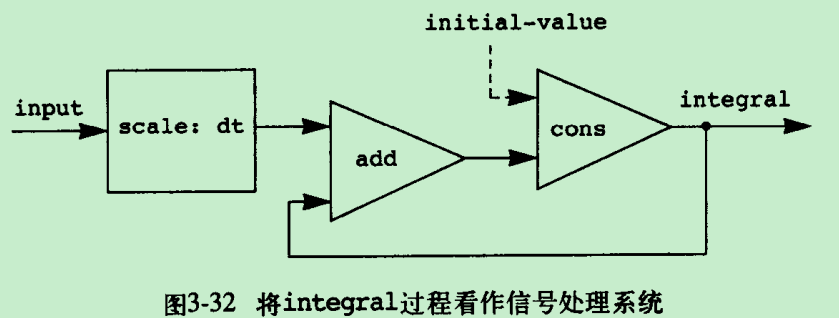
    * 上图是一个积分过程，用流模拟了包含反馈循环的信号处理系统

### 函数式程序的模块化和对象的模块化
引进赋值的主要收益是使我们可以增强系统的模块化。流模型可以提供等价的模块化，同时又不必使用赋值。我们可以将一个提款处理器模拟为一个过程，它以一个余额值和一个提款流作为参数，生成账户中顺序余额的流：
```c
(define (stream-withdraw balance amount-stream)
    (cons-stream
        balance
        (stream-withdraw
            (- balance (stream-car amount-stream))
            (stream-cdr amount-stream)
        )
    )
)
```
* `stream-withdraw`实现了一个具有良好定义的数学函数，其输出完全由输入确定，`amount-stream`是由用户送来的顺序值构成的流。从送入这些值并观看结果的用户的角度看，这一流过程的行为与由`make-simplified-withdraw`创建的对象并没有什么不同。但这里没有局部变量赋值，也就不会有前面的困难，但是这个系统有状态。

# 寄存器机器里的计算
寄存器机器的一条典型指令将一种基本操作作用于某几个寄存器的内容，并将作用的结果赋给另一个寄存器。

## 寄存器机器的设计
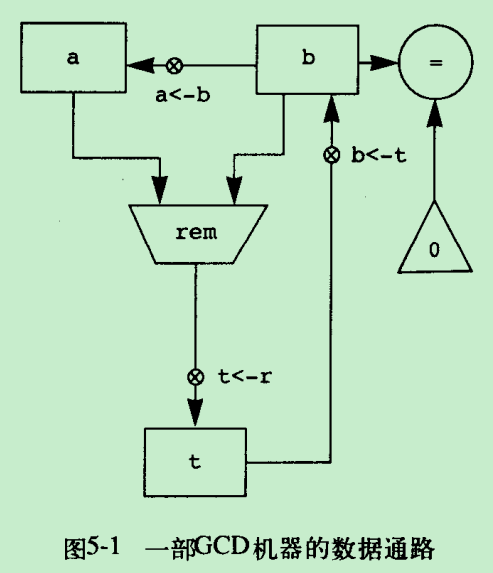
```c
(define (gcd a b)
    (if (= b 0)
        a
        (gcd b (remainder a b))
    )
)
```
* 上图显示了一个最大公约数的数据通路图：
    * rem表示一个计算余数的操作
    * x是一个按钮，再按压它的时候，会允许这个值从数据源流向指定的寄存器
        * 首先将余数放在寄存器t，而后将b的内容存入a中，最后再把保存在t里的余数存入b中
        * 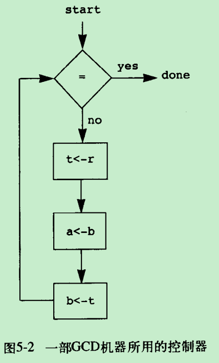

### 一种描述寄存器机器的语言
我们将一部机器的控制器定义为一个指令序列，一条指令可以是下面几种东西之一：
* 数据通路图中的一个按钮，按压它将使一个值被赋给一个寄存器
* test指令，执行相应的检测
* branch指令，有条件地转移到某个由控制器标号指明的位置的分支指令

机器将从控制器指令序列的开始处启动，直到执行达到序列末尾时停止。这些指令总是按照它们列出的顺序执行，除非遇到分支指令改变控制流。用机器语言描述GCD数据通路如下：

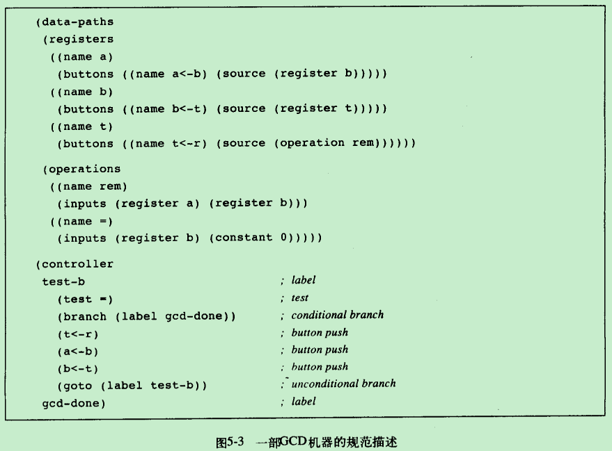

#### 动作
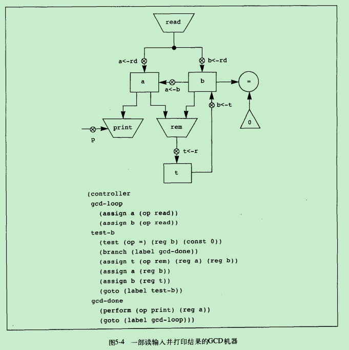

在数据通路图上， 动作的表示形式就像时一个能产生值的操作 - 用一个梯形，其中包含着这个动作的名字：
* read - 读入动作
* print - 写出动作

在控制器序列中为了使控制器可以按压动作的按钮，需增加一个`perform`指令：
* 例如，打印寄存器a的内容：`(perform (op print) (reg a))`

### 机器设计的抽象
我们总能用一些更简单的基本操作来取代复杂的操作(更高的抽象)。例如，我们可以在构造GCD机器时不用求余的操作，而采用减法操作。

### 子程序
子程序完成之后要确定跳转到哪里继续执行，因此需要一个寄存器continue，里面保存控制器序列里一个入口点的标号。为了实现这种能力，我们要扩充寄存器机器里assign指令的能力，允许将控制器序列里的标号作为值(作为一种特殊常量)赋给一个寄存器。还要扩充goto指令的能力，允许执行进程不仅可以从一个常量标号描述的入口点继续，还可以从一个寄存器的内容所描述的入口点继续下去。

### 采用堆栈实现递归
现在我们已经可以通过描述有关的寄存器机器，实现所有的迭代计算过程了，其中用一个寄存器对应于计算过程中的一个状态变量。这种机器反复地执行一个控制器循环，并不断改变各个寄存器的内容，直至满足了某些结束条件。在控制器序列中的每一点，机器的状态(对应于迭代计算过程的状态)完全由这些寄存器的内容(对应于状态变量的值)所确定。

```c
(define (factorial n)
    (if (= n 1)
        1
        (* (factorial (- n 1)) n)
    )
)
```

然而，要实现递归计算过程，我们还需要增加新的机制。例如乘阶的递归方法，不同于GCD的过程，factorial要求计算出另一个阶乘作为一个子问题。在GCD过程里，对于新的GCD计算的回答也就是原来问题的回答。为了计算下一个GCD，我们只需要简单地将新的参数放进GCD机器的输入寄存器里，并通过执行同一个控制序列，重新使用这个机器的数据通路即可。

但是，在乘阶的情形里，对于新的乘阶子问题的回答并不是对原问题的回答。在处理子问题时，寄存器的内容与它们在原问题里的情况不同。我们应该保存起n的原值，在完成对(n-1)的阶乘之后再恢复它。有了堆栈的帮助后，我们就可以重复使用阶乘机器的数据通路的同一个副本，完成所有的阶乘子问题了。

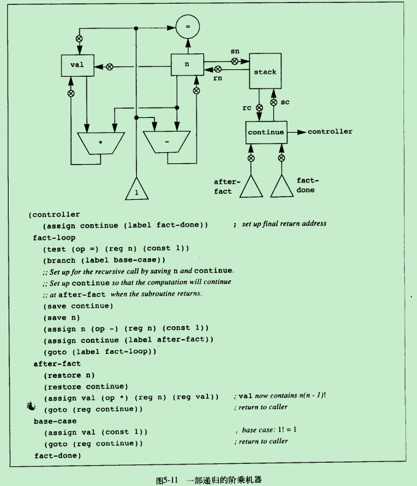
* 我们在寄存器n里存入希望计算阶乘值的数
* 当机器到达fact-done时计算结束，在寄存器val里将能找到对应的回答
* 每次递归调用之前都保存起n和continue，从调用返回时候恢复它们
* 完成从一个调用返回的方式就是转到保存在continue里的位置
* 在机器启动时对continue做初始化，使得机器在最后能返回到fact-done

#### 双重递归
```c
(define (fib n)
    (if (< n 2)
        n
        (+ (fib (- n 1)) (fib (- n 2)))
    )
)
```
* 为了安排好双重递归各个递归调用，我们需要保存起那些后来需要使用的寄存器值


## 一个寄存器机器模拟器
模拟器有四个界面过程：
* 根据一个寄存器机器的描述，为这部机器构造一个模型(一个数据结构，其中的各个部分对应于被模拟机器的各个组成部分)
    * 构造并返回机器的模型，其中包含了给定的寄存器、操作和控制器
    * `(make-machine <register-names> <operations> <controller>)`
* 将一个值存入给定机器的一个被模拟的寄存器里
    * `(set-register-contents! <machine-model> <register-name> <value>)`
* 返回给定机器里一个被模拟的寄存器的内容
    * `(get-register-contents <machine-model> <register-name>)`
* 模拟给定机器的执行，从相应控制器序列的开始处启动，直到这一序列的结束时停止
    * `(start <machine-model>)`

定义gcd-machine如下：
```c
(define gcd-machine
    (make-machine
        '(a b t)
        (list (list 'rem remainder) (list '= =))
        '(test-b
            (test (op =) (reg b) (const 0))
            (branch (label gcd-done))
            (assign t (op rem) (reg a) (reg b))
            (assign a (reg b))
            (assign b (reg t))
            (goto (label test-b))
            gcd-done
        )
    )
)
```
* 第一个参数时寄存器名字的表
* 第二个参数时操作的名字和实现这一操作的过程的表格
* 最后一个参数时描述了相应控制器，用一个标号和机器指令的表表示

### 机器模型
由`make-machine`生成的机器模型被表示为一个包含局部变量的过程。
* `make-new-machine`构造出所有寄存器机器的机器模型里都需要的一些公共部分，其内部包括一个堆栈，另外还有一个初始为空的指令序列和一个操作的表，和一个寄存器的列表
* `make-machine`将扩充这一基本模型，把要定义的特殊机器的寄存器、操作和控制器加进去
* 最后，用一个汇编程序，把控制器列表变换为新机器所用的指令

### 汇编程序
这一汇编程序将一部机器的控制器表达式序列翻译为与之对应的机器指令的表，每条指令都带着相应的执行过程。过程assemble是这个汇编程序的主要入口，它以一个控制器正文和相应机器模型作为参数，返回存储在模型里的指令序列。
```c
(define (assemble controller-text machine)
    (extract-labels controller-text
        (lambda (insts labels)
            (update-insts! insts labels machine)
            insts
        )
    )
)
```

