# 序
《设计与验证：Verilog HDL》读书笔记
## 环境搭建
* [例子1](./code/hello)
* [例子2](./code/wave)

# HDL设计方法简介
## 设计方法的变迁
* 数字设计系统方法演变
   * 早期，使用卡诺图简化后，通过面包板系统验证设计
   * 中期，借助EDA工具通过原理图描述数字系统，通过EDA工具元件库中的元件对原理图进行仿真并分析其性能
   * 后期，由于原理图不利于移植且维护费力，硬件描述语言(HDL)应运而生

* HDL语言描述数字电路系统的不同层次
   * 算法
   * 系统级(System Level)
   * 功能模块级(Function Model Level)
   * 行为级(Behavior Level)
   * 寄存器传输级(RTL, Register Transfer Level)
   * 门级(Gate Level)
   * 开关级(Switch Level)

* EDA工具的目的
   * 层次越高，越容易编写和维护，EDA工具的作用就是将高层次的HDL电路描述通过逻辑综合(Synthesize)，分析到门级
   * EDA综合工具能将高层次的HDL语言、原理图等设计描述翻译成由与、或、非门等基本逻辑单元组成的门级连接(网表)
   * 并根据设计目标与要求(约束条件)优化生成的逻辑连接，输出门级网表文件

## Verilog的语言特点
### HDL与原理图
* 两种描述电路的方法
   * HDL
   * 原理图
      * 优点：直观
      * 缺点：难以重用
* 两种辅助设计方法
   * 波形输入
      * EDA软件根据输入波形和输入波形，自动设计或仿真
   * 状态机输入
      * 设计者只需画出状态转移图，EDA软件就能生成相应的HDL代码或原理图

### 不同层次的HDL语言
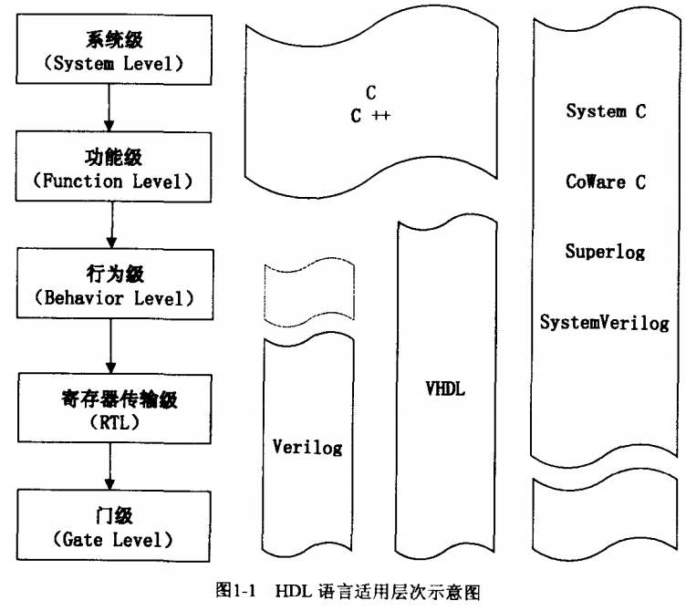

### Verilog和C语言
* 最大区别
   * 互连(connectivity)
      * Verilog的wire型变量能描述网线的互连，C没有互连的概念
   * 并发(concurrency)
      * Verilog可以有效地描述并行的硬件系统，C语言本质上是串行的
   * 时间(time)
      * Verilog定义了绝对和相对的时间度量，在仿真时可以通过时间度量与周期关系描述信号之间的时间关系，C语言没有严格的时间概念，程序运行时长取决于处理器本身
* HDL语言的本质
   * HDL的评判标准时其描述并实现的硬件电路的性能(包括面积和速度两个方面)
   * 片面追求代码的整洁、简短时错误的
   * 首先需要对硬件的结构与连接了解十分透彻，再用适当的HDL语言将其表达出来

### Verilog与C的结合
* Verilog由于要描述硬件，它的抽象要比C语言差一些
* Verilog可以通过PLI(编程语言接口)将Verilog和C联系起来，Verilog负责描述电路，而C语言可以辅助验证，以使验证方式更加灵活

## HDL的设计与验证流程
* HDL的设计与仿真流程如下：<br>
   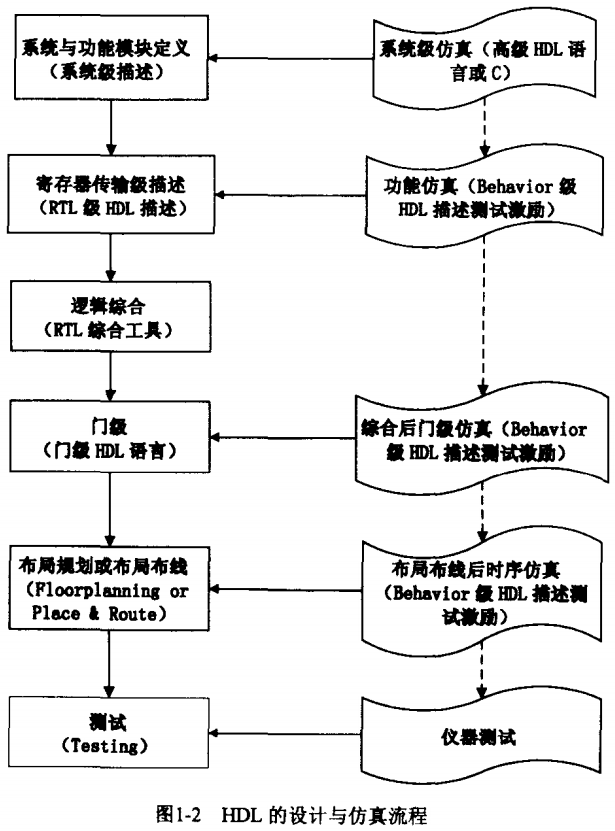
   * 系统与功能模块级
      * 多采用高级语言描述，如：C/C++，System C和System Verilog
      * 主要目标使对系统的整体功能和性能指标进行衡量
      * 系统级描述完成后，应划分模块，定义接口，考虑时序约束，开始功能模块级
   * 行为级描述测试激励
      * 主要使用Verilog和VHDL
      * 此阶段必须明确每个模块间的所有接口和边界
      * 常用行为级描述方式编写测试激励
   * 寄存器传输级
      * 主要使用Verilog和VHDL
      * 通过描述寄存器到寄存器之间的逻辑功能描述电路的HDL层次
      * 可以直接用综合工具将其综合为门级网表
   * 对RTL级描述进行功能仿真
      * 目的使验证RTL级描述是否与设计意图一致
      * 为了提高效率，功能仿真的测试激励一般使用行为级的HDL语言描述
   * 逻辑综合(使用RTL级EDA工具)
      * 将RTL级HDL语言翻译成由与或非等基本逻辑单元组成的门级连接(网表)，并根据设计目标与要求(约束条件)优化所生成的逻辑连接、输出门级网表文件
   * 门级
      * 特点是整个设计用逻辑门实现，通过逻辑门的组合显化描述设计的引脚、功能和时钟周期等信息
   * 综合后门级仿真
      * 在仿真时，把综合生成的标准延时文件反标注到综合仿真模型中去，可估计门延时所带来的影响
      * 综合后仿真虽然比功能仿真要精确一些，但只能估算门延时，不能估算线延时，仿真结果与布线后的实际情况还有一定的差距，并不十分准确
      * 这种仿真的目的在于检查综合后结果是否与原设计一致
   * 布局规划与布局布线
   * 布局布线后的时序仿真与验证
      * 将最终布局规划或布局布线的延时信息反标注到设计网表中进行的仿真就叫时序仿真或布局规划与布局布线后仿真，简称后仿真
      * 时序仿真的主要目的在于发现时序违规(Timing Violation)，即不满足时序约束条件或者器件固有时序规则(建立时间、保持时间等)的情况

# Verilog语言基础
## Top-Down和Bottom-Up
* Verilog对两种设计方法都支持

## Verilog的3种描述方法
### 实例
* 电路描述<br>
   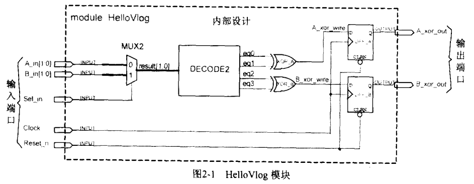
   * 选择器MUX2在2比特输入A_in[1:0]和B_in[1:0]选择一个
   * 2-4译码器将2比特输入解析成4个信号，一个时刻只有一个信号是1
   * 将4个信号分成前后两组取异或
   * 异或结果通过寄存器输出给`A_xor_out`和`B_xor_out`
* 虽然描述的时候是从左到右描述的，但是这些电路都是并行工作的，没有先后顺序关系
* [Module](./code/hello_verilog/hello_vlog.v)
   * 先声明后行为
* [TestBench](./code/hello_verilog/tb.v)
   * 声明
   * 实例化module
   * 行为
      * 时钟
      * 初始化输入引脚
      * 结束仿真`$finish`

### 3种描述方法
* 数据流描述
   * 采用`assign`语句(连续赋值语句)
* 行为描述
   * 使用`always`或`initial`语句块，其中出现的语句被称为过程赋值语句
* 结构化描述
   * 实例化已有的功能模块
      * Module实例化：实例化已有的module
      * 门实例化：实例化基本的门电路原语
      * 用户定义原语(UDP)实例化：实例化用户定义的原语

## 模块和端口
* 通常情况下一个Verilog文件只放一个module定义，而且要使文件名称与module名称一致
* module的结构如下：
   ```
   module 模块名称(端口列表);
   // 声明:
      input, output, inout,
      reg, wire, parameter,
      function, task, ...
   // 语句:
      initial 语句
      always 语句
      module 实例化
      门实例化
      用户定义原语(UDP)实例化
      连续赋值(Continuous assignment)
   ```
   * module的端口
      * 仿真平台的顶层`tb`是一个封闭系统，不含端口
      * module的`input`默认定义为`wire`类型
      * module的`output`可以使wire类型，也可以使`reg`类型
      * module的`inout`是双向的，一般将其设定为`tri`类型，表示其右多个驱动元，如无驱动则为三态
   * 出现在一个module中的语句，互相之间没有任何顺序关系

## 编译指令
* 常用的编译指令
   ```
   `timescale;
   `define, `undef;
   `ifdef, `else, `endif;
   `include;
   `resetall;
   ```
* 编译指令规则
   * 编译器一旦遇到某个编译指令，则该指令在整个编译过程中有效，知道编译器遇到另一个相同的编译指令为止
### `timescale
* timescale编译指令如果在模块外部出现，会影响后面模块中的所有延时值，知道遇到下一个timescale或者resetall
* 以延时`#1.16`为例子，分析不同timescale下的真实延时
   * `timescale 1ns/100ps
      * 最小时间颗粒度是0.1ns
      * 真实延时是1.16ns的十分位四舍五入：1.2ns
   * `timescale 1ns/10ps
      * 最小时间颗粒度是0.01ns
      * 真实延时是1.16ns的百分位四舍五入：1.16ns

### `define
* 用于定义宏
   ```verilog
   // 利用宏定义一个宽度位16的reg类型数据Data
   `define BUS_WIDTH 16
   reg [`BUS_WIDTH-1 : 0] Data;
   ```
* 在一个文件中出现的define可以被多个文件使用(这是define和parameter定义的最大区别)，直到遇到undef指令为止

### `include
* 嵌入某个文件中的内如
   * ``include "HEADFILE.h`，在编译的时候，文件中的内容会完全替换这一行

### `resetall
* 将其他编译指令重新设置位缺省值

## 逻辑值和常量

### 逻辑值
* Verilog里有4种逻辑，除了1和0外，还有XZ(不区分大小写)
   * "X"
      * 表示状态未知
      * 当用作条件判断时(在casex或casez)表示不关心
   * "Z"
      * 表示高阻态，通常用来对三态总线进行建模<br>
      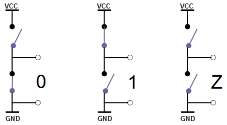

### 常量
* 常量的3种类型
   * 整数型
      * `8'haa` - 8位16进制
      * `6'o33` - 6位8进制
      * `4'b1011` - 4位2进制
      * `3'd7` - 3位十进制
      * 遇到X，在16进制中表示4个X，在八进制中表示3个X
   * 实数型
   * 字符串型
* [例子](./code/type/types.v)

### 变量类型
* Verilog有两种变量类型
   * 线网型`wire`：表示电路间的物理连线
      * 凡是在assign语句中赋值的变量，一定是线网变量
   * 寄存器型`reg`：Verilog中的一个抽象存储单元
      * 凡是在always或initial语句中赋值的变量，一定是寄存器变量

### 网线类型
* 网线类型包括以下几种子类型，它们具有网线的共性
   * wire, tri
      * 表示电路间的物理连线，tri主要用于多驱动源建模
   * wor, trior
      * 表示该连线具有“线或”功能
   * wand, triand
      * 表示该连线具有“线与”功能
   * trireg
      * 表示该连线具有总线保持功能
   * tri0, tri1
      * 表示当无驱动时，连线状态为1(tri1)和0(tri0)
   * supply1, supply0
      * 分别表示电源和地信号
* 除了trireg未初始化时值为X以外，其余子类型未初始化时的值均为Z
* 线网类型主要用在连续赋值语句中，并可作为模块之间的互连信号

### 寄存器类型
* 寄存器类型的变量通常要占据一个仿真内存空间
   * reg
      * 可以时一位、多为或者二维数组
   * integer
      * 整数型数据
      * 存储一个至少32位的整数
   * time
      * 时间类型
      * 存储一个至少64位的时间值
   * real, realtime
      * 实数和实数时间寄存器
* 例子：reg类型定义二位寄存器数组，用于描述存储器Memory
   * `reg [3:0] MEMABC [0:7]` // 定义一个存储器，地址为0~7，每个存储单元都是4bit
   * 不能对存储器中的存储单元进行位选择或部分选择，只能每个单元整体赋值：`MEMABC[1] = 4'b0101;`
   * 除非使用`$readmemb`或`$readmemh`系统任务从文件中读入整个或部分存储器数据，Verilog不存在一条语句可以对整个存储器赋值

### 变量的物理含义
* 在仿真工具进行仿真时
   * 寄存器类型的变量是占用仿真环境的物理内存
   * 线网变量是不占用仿真内存的，它的值由当前所有驱动该线网的其他变量(可以是寄存器变量或线网变量)决定

### 驱动和赋值
* 驱动
   * 线网是被驱动的，该值不被存储，在任意一个仿真步进上都需要重新计算
* 赋值
   * 寄存器是被赋值的，且该值将在仿真过程中被保存，直到再次对该变量进行赋值
* 以异或门电路举例
   * 连续赋值语句，在任意一个仿真时刻，当前时刻eq0和eq1相异或的结果决定了1ns以后线网变量A_xor_wire的值。这个驱动时一直存在的，因此称为连续驱动
   ```verilog
   wire A_xor_wire;
   assign #1 A_xor_wire = eq0 ^eq1;
   ````
   * `always`语句，只有在某些时刻，该语句才会被执行，将eq0和eq1赋值的结果延时1ns以后赋值给A_xor_wire。而在其他时刻，A_xor_wire变量将保持不变。因此从仿真语义上讲，需要一个存储单元，来保存A_xor_wire变量的中间值。
   ```verilog
   reg A_xor_wire;
   always @ (eq0 or eq1)
      A_xor_wire = #1 eq0 ^ eq1;
   ```
   * 不管采用哪种方式，其对应的硬件电路都是完全相同的组合逻辑电路。第二种描述，虽然在语法上定义了reg类型，但是并没有被实现为硬件上的触发器(flip-flop)
   * 有时reg型变量仅仅在仿真语义上被理解为寄存器概念，而在实际电路实现时却被实现为纯组合逻辑

## 参数
* 参数是一种常量，通常出现在module内部(局部定义)，常被用于定义状态机的状态、数据位宽和延时大小等，例如：
   ```verilog
   parameter and_delay = 2;
   parameter xor_delay = 4;
   ```

## Verilog中的并发与顺序
* 在Verilog中，所有语句都是并行发生的
* 在语句块(always和initial)内部可以存在两种语句组：
   * `begin...end;` 顺序语句组
      * 可综合
   * `for...join;` 并行语句组
      * 不可综合

## 操作数、操作符和表达式
### 操作符
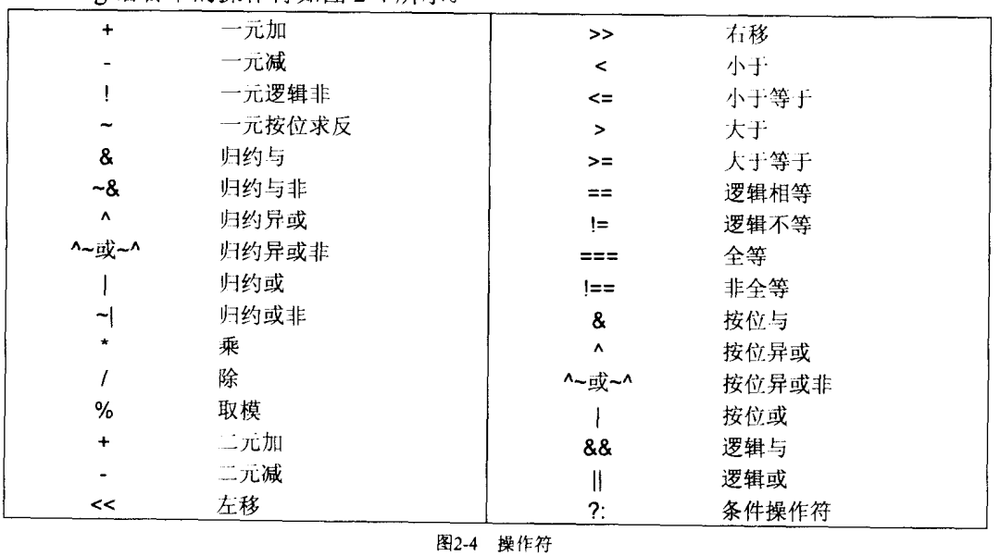

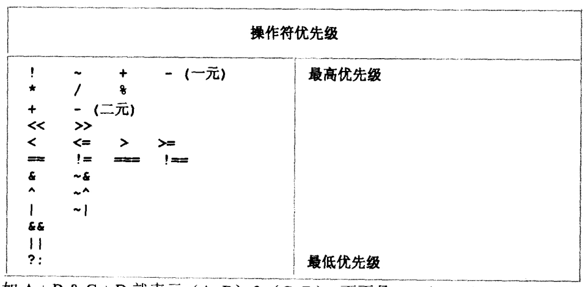
* 按位操作符
   * `m ~^ n` 或 `m ^~ n` - 将m的每个比特与n的相应比特相异或非
* 归约操作符
   * `~^m` 或 `^~m` - 将m中所有比特相异或非(1比特结果)
* 相等操作符
   * `==` - m和n相等吗？(1-bit正确/错误结果，仅比较逻辑1和0)
* 全等操作符
   * `===` - m和n全等吗？(1-bit正确/错误结果，比较逻辑0，1，x和z)
* 连接赋值操作符
   * `{m,n}` - 将m和n连接起来，产生更大的向量
   * `{n{m}}` - 将m重复n次

### 有符号数和无符号数
```
reg[4:0] Opreg; //一个5位的reg型变量，存储无符号数
integer Opint; //一个32位的integer型变量，存储有符号数

Opreg = -4'd12 / 4; //Opreg被赋值为29 (-3的五比特补码)
Opint = -4'd12 / 4; //Opint被赋值为1073741821，(-3的32位补码)

Opreg = -12/4; //Opreg被赋值为29
Opint = -12/4; //Opint被赋值为-3
```

## 系统任务和系统函数
* 显示任务
   * `$display`
   * [例子](./code/display)
* 文件输入/输出任务
   * 写入文件
      * `$fopen, $fdisplay, $fclose`
   * 从文件读出
      * `$readmemb, $readmemh`
* 其他系统任务和系统函数
   * 仿真控制任务
      * `$finish` - 使仿真器退出
      * `$stop` - 使仿真器挂起
   * 时序验证任务和仿真时间函数
      * `$setup` - 用来检测建立时间
      * `$hold` - 用来检测保持时间
      * `$time` - 系统函数，返回64位的模拟时间
   * 概率分布函数
      * `$random` - 系统函数，返回一个32位的有符号整型随机数
* 系统任务/系统函数只可以在仿真器中运行，综合工具和布线工具会将其忽略

# 描述方式和设计层次
* 三种描述方法
   * 数据流
   * 行为
   * 结构化

## 数据流描述
* `assign #1 A_xor_wire = eq0 ^ eq1;`

### 连续赋值语句
* 连续驱动
   * 连续赋值语句使连续驱动的，只要输入发生变化，都会导致该语句的重新计算
* 只有线网类型的变量才能在assign语句中被赋值
   * 由于连续赋值语句中的被赋值的变量在仿真器中不会存储其值
   * 线网类型的变量可以被多重驱动，但寄存器变量就不同了，它不能被不同的行为进程(always)驱动
* 使用assign对组合逻辑几面
   * 连续驱动特点与组合逻辑的行为非常相似
   * 加延时可以非常精确地模拟组合逻辑的惯性延时
* 并行性
* [实例](./code/adder)

### 延时
* 延时类型
   * 上升沿延时
   * 下降沿延时
   * 关闭延时(输出变成高阻态Z)
   * 输出变成X的延时
* 例子
   * `assign #(1,2) A_xor_wire = eq0 ^ eq1;`
      * 上升沿延时为1ns，下降沿延时为2ns，关闭延时和传递到X的延时取两者中最小的，即1ns
   * `assign #(1,2,3) A_xor_wire = eq0 ^ eq1;`
      * 上升沿延时为1ns，下降沿延时为2ns，关闭延时为1ns，传递到X的延时取三者中最小的，即1ns
   * `assign #(4:5:6, 3:4:5) A_xor_wire = eq0 ^ eq1;`
      * 上升沿延时的min:typ:max为4:5:6，下降沿延时的min:typ:max为3:4:5
* 惯性延时的特性
   * 任何小于其延时的信号变化脉冲都会被滤除掉，不会体现在输出端口上
* assign语句中的延时特性通常是被逻辑综合工具忽略的
   * 因为逻辑电路的延时是由基本的单元库和走线延时决定的，不应让用户指定

### 多驱动源线网
* 错误写法
   ```
   module WS (A, B, C, D, WireShort);
   input A, B, C, D;
   output WireShort;
   wire WireShort;
   // 仿真时WireShort的值将是X，但是综合工具会报错
   wire WireShort = A ^ B;
   wire WireShort = C & D;
   ```
* 线与写法
   ```
   module WS (A, B, C, D, WireAnd);
   input A, B, C, D;
   output WireAnd;
   wand WireAnd;
   wire WireAnd = A ^ B;
   wire WireAnd = C & D;
   ```
* 线或写法
   ```
   module WS (A, B, C, D, WireOr);
   input A, B, C, D;
   output WireOr;
   wor WireOr;
   wire WireOr = A ^ B;
   wire WireOr = C & D;
   ```
* 三态总线写法
   ```
   module WS (A, B, C, D, WireTri, En1_n, En2_n);
   input A, B, C, D, En1_n, En2_n;
   output WireTri;
   tri WireTri;
   wire WireTri = En1_n ? 1'bZ : A ^ B;
   wire WireTri = En2_n ? 1'bZ : C & D;
   ```
   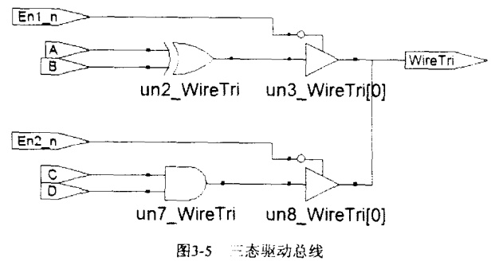

## 行为描述
### 行为描述的语句格式
* initial或always过程块(procedural block)
   * initial语句在0仿真时间执行，而且只执行一次
   * always语句在0仿真时间开始执行，但是它一直循环执行
   * 两者执行顺序随机
* 过程块中的语句种类
   * 非阻塞过程赋值
   * 阻塞过程赋值
   * 连续过程赋值
   * 高级编程语句，如: `if`
   * 语句组，如：`begin...end, fork...join`
* 时序控制
   * 事件语句：`@`
      * 语句块被挂起，直到事件发生，如：`repeat(5) @ (posedge clk);`
   * 延时语句：`#`
   * 等待语句：`wait()`
      * 语句块被挂起，直到括号内的变量为真，如：`wait(Strobe == 1)`

### 过程赋值语句
* 为什么initial和always语句中的赋值语句只能是**寄存器**变量？
   * 寄存器的特点是，这个变量在仿真时需要占据内存空间。虽然综合时，寄存器变量不一定会被映射成一个触发器硬件。但是，在语句块中的变量必须要存相关状态，才能对任意类型(wire类型)的输入的变化敏感
* 阻塞赋值
   * 寄存器变量= 表达式;
      * 右边表达式的计算和对左边寄存器变量的赋值时一个统一的原子操作中的两个动作，两个动作之间不能再插入其他任何动作了；
      * 如果由多个阻塞值语句顺序出现在`begin...end`语句中，则前面的语句在执行时完全阻塞后面的语句，直到前面的语句赋值完成以后，才会执行下一句中右边表达式的计算
         * 例如：`begin m=n;n=m; end`的结果是m和n相等，都等于n的初始值
   * 建议在组合逻辑建模时采用阻塞赋值
* 非阻塞赋值
   * 寄存器变量 <= 表达式;
      * 在执行该语句时，首先计算右边的表达式
      * 而赋值操作在当前仿真事件事件队列中的优先级比较低，因此将赋值操作推迟到当前仿真时刻的后期执行
* 过程连续赋值
   * assign与deassign
      * 在过程语句中强制为寄存器变量赋值并释放
   * force与release
      * 在过程块中对寄存器和线网进行轻质赋值和释放

### 语句组
* 顺序语句组`begin..end`
* 并行语句组`fork..end`

### 高级编程语句
* 为什么需要编程语句？
   * Verilog最重要的特性是：其设计层次比较高，不仅仅停留在晶体管级和门级。为了达到提高描述能力和抽象层次的目的，引入了更高级的编程语句。
* 编程语句只能出现在initial和always的过程块中，大致分三类：
   * if-else语句
   * case语句
   * 循环语句，如：forever, repeat, while和for等
* `if...else`语句
   * 需要注意不要引入Latch电路，即考虑所有情况而不依赖默认行为：
      * 不好的例子，会为了保持q值不变而在综合时加入锁存器，如：
      ```verilog
      always @(sel or a or b or c)
      begin
         if (sel == 2'b00)
            q = a;
         else if (sel == 2'b01)
            q = b;
         else if (sel == 2'b10)
            q = c
      end
      ```
      * 修正后如下：
      ```verilog
      always @(sel or a or b or c)
      begin
         if (sel == 2'b00)
            q = a;
         else if (sel == 2'b01)
            q = b;
         else if (sel == 2'b10)
            q = c
         else
            q = 1'bx; //不关心q值，使其保持不变
      end
      ```
* `case`语句
   * 与if-else语句不同的时，在case语句中，所有被判断的分支条件都具有一样的优先级
   * casez
      * 所有z都不关心，在可改写为？
   * casex
      * 所有x和z都不关心
* 循环语句
   * 循环语句后面可以根语句或语句组

## 结构化描述
* 3中实例类型
   * 实例化其他模块
   * 实例化门
   * 实例化UDP
* 实例化模块的方法
   * 与模块input端口相连
      * 可以是一个线网或者寄存器
   * 与模块output相连
      * 一定是驱动到一个线网
   * 与模块inout端口相连
      * 输入时从一个线网驱动，注意不能用寄存器
      * 输出时驱动到一个线网
   * 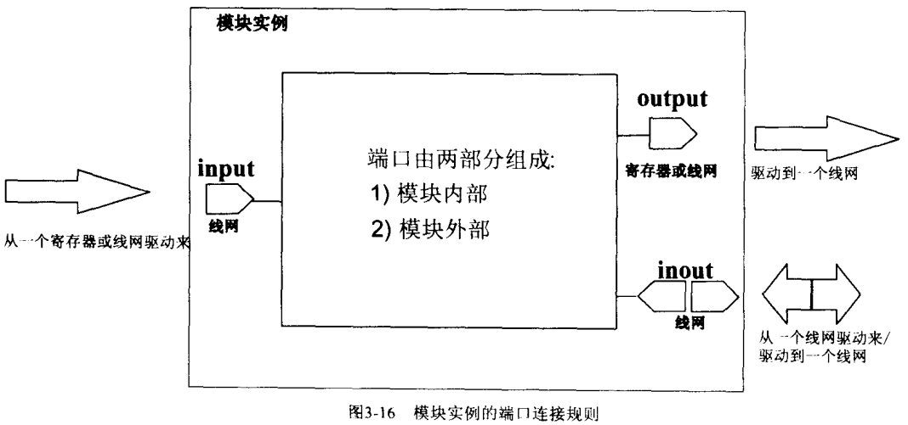

* 模块实例的端口对应方式有：
   * 名称对应
      * 端口对应的顺序时任意的
   * 位置对应
      * 在没有外部对应信号时，留空

### 参数化模块
* 当实例化模块时，用户可以修改模块中的参数，用来实现不同的特性。有两种方式：
   * 通过`defparam`关键字重新定义模块中的参数
      * 将需要修改的参数通过`defparam <inst>.<param> = <modify>, ...`的方式单独修改，例如:
         * `defparam altyscram_component.width_a = 8, //8位宽的数据`
   * 直接在实例化模块时代入参数
      * `#(..., ..., ...)`语法
      * 所有参数都要按顺序列出来，不能遗漏，也不能颠倒顺序

## 设计层次
### 系统级和行为级
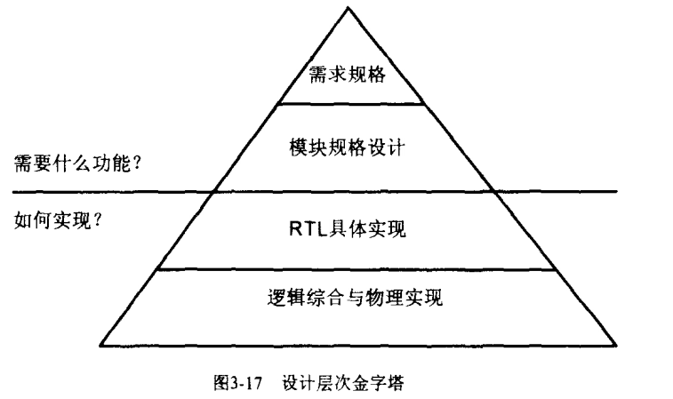
* 不同角色
   * 系统架构师
      * System C
      * 系统级或算法级
   * 逻辑设计工程师
      * Verilog设计RTL代码
   * 物理设计工程师
      * 对门级网表进行布局布线，将其做成实际的芯片
   * 验证工程师
      * 在行为级进行验证
      * 负责对电路进行验证

### RTL级
* 只关心寄存器到寄存器之间的逻辑功能，而不需要关心寄存器和组合逻辑的实现细节(具体用了多少逻辑门等)

### 门级
* 在Verilog语义中，使用一些基本的门原语可以直接描述电路的门级功能，如：
   ```
   module (X, Y, SUM, C_out);
   input X;
   input Y;
   output SUM;
   output C_out;
   xor u_xor (SUM, X, Y);
   and u_and (C_out, X, Y);
   endmodule
   ```
* 门级设计类似于软件中的汇编语言设计，非常精确，但是费时费力

### 晶体管级
* 逻辑门由一个个晶体管组成，Verilog语言中，有用于直接描述NMOS和PMOS的原语。

# RTL概念于RTL级建模

## RTL与综合的概念
* 典型的RTL级设计包含3个部分
   * 时钟域描述
      * 时间主从关系和时钟域之间的转换
   * 时序逻辑描述(寄存器描述)
      * 根据时钟沿的变换，描述寄存器之间的数据传输
   * 组合逻辑描述
      * 描述电平敏感信号的逻辑组合方式和逻辑功能

## 常用的RTL级建模
### 阻塞赋值、非阻塞赋值和连续赋值
* 对于时序逻辑，即always模块的敏感表为**沿**敏感信号，统一使用非阻塞赋值“<=”
   ```
   reg[3:0] cnt_out;
   always @(posedge clock)
      cnt_out <= cnt_out + 1;
   ```
* 对于always模块的敏感表为**电平**敏感信号的组合逻辑，统一使用阻塞赋值“=”
   * "cnt_out_plus"虽然被指定为reg型，但是实际综合后会是组合逻辑
   ```
   reg[3:0] cnt_out_plus;
   always @(cnt_out)
      cnt_out_plus = cnt_out + 1;
   ```
* 对于assign关键字描述的组合逻辑(通常称之为连续赋值语句)，统一使用“=”，变量被定义为wire型信号
   ```
   wire[3:0] cnt_out_plus;
   assign cnt_out_plus = cnt_out + 1;
   ```

### 寄存器电路建模
* 寄存器信号声明
   * 寄存器被定义为reg型，但是reg型变量不一定是寄存器
* 时钟输入
* 异步复位/置位
   ```
   reg [3:0] cnt_reg;
   always @ (posedge clock or negedge reset_)
      if (!reset_)
         cnt_reg <= 4'b0000;
      else
         begin
            ...
         end
   ```
* 同步复位/置位
   ```
   reg [3:0] cnt_reg;
   always @ (posedge clock)
      if (!reset_)
         cnt_reg <= 4'b0000;
      else
         begin
            ...
         end
   ```
* 同时使用时钟上升沿和下降沿的问题
   * 存在抖动、偏移、斜率等问题

### 组合逻辑建模
* 组合逻辑的特点
   * 输出的变化仅仅和输入的电平相关，而与时钟沿无关
* 常用的RTL级组合模有两种
   * always模块的敏感表位电平敏感信号的电路
   * assign等关键字描述的组合逻辑电路

### 双向端口与三态信号建模
* 仅在顶层定义双向总线和实例化的三态信号，并在顶层将双向信号分为输入信号和输出信号两种类型，然后根据需要分别传递到不同的子模块中去

### Mux建模
* 对于简单的Mux
   * 直接用`assign`和`?`表达式建模
   ```
   wire mux_out;
   assign mux_out = (en) ? a : b;
   ```
* 对于复杂的Mux
   * 使用`always`和`if...else...`, `case`等条件判断语句
   ```
   reg mux_out;
   always @ (en or a or b or c or d)
      case (en)
         2'b00: mux_out = a;
         2'b01: mux_out = b;
         2'b10: mux_out = c;
         2'b11: mux_out = d;
      endcase
   ```

### 存储器建模
* 存储单元定义格式：`reg [data_width] MemoryName [address_width];`
* FPGA都内嵌有RAM资源，不推荐使用Verilog直接建模RAM，在PLD中使用存储结构的基本方法如下：
   * 通过器件商的开发平台中内嵌的IP生成器直接生成
   * 直接根据Verilog语言建模存储器，由综合自己优化

### 串并转换建模
```
module srl2pal (clk, rst, srl_in, pal_out);

input        clk;
input        rst;
input        srl_in;
output [7:0] pal_out;
reg    [7:0] pal_out;

always @ (posedge clk or negedge rst)
   if (!rst)
      pal_out <= 8'b0;
   else
      pal_out <= {pal_out,srl_in};

endmodule
```

### 使用case和if...else语句建模
* 没有优先级的分支(推荐)
   * `case`和`if...else`语句<br>
   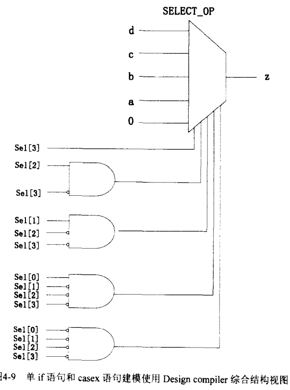
* 有优先级的分支(不推荐)
   * `default value; if...if...if...`<br>
   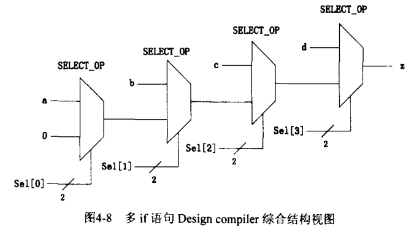
      * 最后一条if语句对应的sel3和d的优先级最高

### 可综合的Verilog语法子集
* 可综合的Verilog语法是一个非常小的子集，包括
   * 模块声明：module...endmodule
   * 端口声明：input, output, inout
   * 信号类型：wire, reg, tri
   * 参数定义：parameter
   * 运算操作符
   * 比较判断
   * 连续赋值
   * always模块
   * begin...end
   * 任务定义：task...endtask
   * 循环语句

# 如何写好状态机
## 状态机的基本概念
### 状态机是一种思想方法
* 例子1<br>
   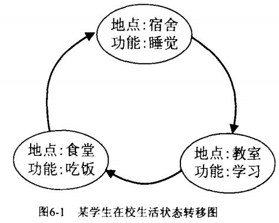
   * 状态 - 地点
   * 状态输出 - 功能
* 例子2<br>
   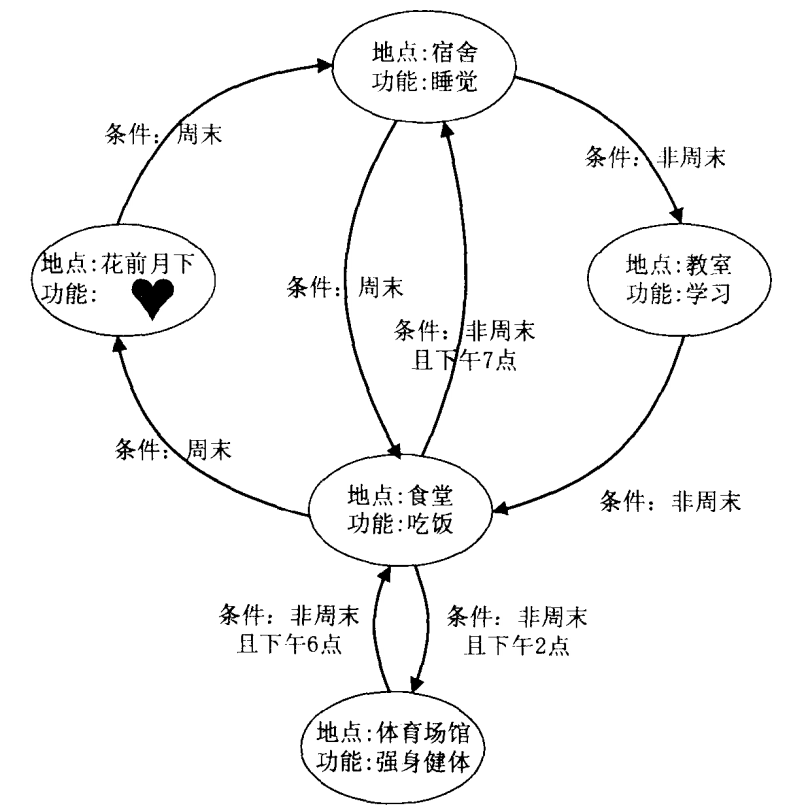
   * 状态 - 地点
   * 状态输出 - 功能
   * 状态输入 - 条件
* 状态机本质
   * 状态机是对具有**逻辑顺序**或**时序规律**的事件进行描述的一种方法
* 如何应用状态机
   * 思路1
      * 从状态变量入手，分析每个状态的输入、状态转移和输出
   * 思路2
      * 从状态输出入手，回溯规划每个状态、状态转移条件以及状态输入

### 状态机的基本要素及分类
* 状态机的三个要素
   * 状态
      * 使用状态划分逻辑顺序和时序规律，如设计电机控制电路时，将电机转速作为状态
   * 输出
      * 在某一个状态时特定发生的事件
      * 如电机控制时转速过高，则输出转速过高报警
   * 输入
      * 进入每个状态的条件
* 根据状态机的输出是否与输入条件相关，可将状态机分为两类
   * 摩尔(Moore)型状态机
      * 输出仅依赖当前状态
      * 如上面的例子1中，状态输出“功能”仅与状态本身“状态”有关
   * 米勒(Mealy)型状态机
      * 输出不仅依赖当前状态，而且取决于该状态的输入条件
      * 如面模的例子2中，状态输出“功能”由状态本身和输入“条件”共同决定。例如，在食堂不一定吃饭，如果是非周末且下午7点，就不吃饭，而是转移宿舍睡觉。

### 状态机的基本描述方式
* 状态机的3中描述方式
   * 状态转移图
   * 状态转移列表
   * HDL语言描述

## 如何写好状态机
### RTL级状态机描述常用的语法
* 设计可综合的FSM的常用关键字
   * wire, reg
      * 状态编码一般用reg
   * parameter
      * 用于描述状态名称，增强代码可读性
      * 例如，独热码的5个状态名称，2个状态编码：
      ```verilog
      reg [3:0] NS, CS; //4位状态编码
      parameter [3:0]   //5个状态名称
      IDLE = 4'b0000,
      S1   = 4'b0001,
      S2   = 4'b0010,
      S3   = 4'b0100,
      ERROR= 4'b1000,
      ```
   * always
      * 根据主时钟沿完成同步时序的状态迁移
      * 根据信号敏感表完成组合逻辑的输出
      * 根据时钟沿完成同步时序逻辑的输出
   * case/endcase
      ```
      case (case_expression)
      case_item1: case_item_statement1;
      case_item2: case_item_statement2;
      ...
      default: case_item_statementn;
      endcase
      ```
      * `case_itm_statement`是每个状态对应的状态转移或者输出，通过修改`NS`完成
      * 当`case_expression`与任意一个`case_item`匹配后，将忽略对其他`case_item`的判断，直接跳出case结构
   * task/endtask
      * 将不同状态所对应的输出封装，增强代码的可读性
      ```
      task IDLE_out;
         begin
         {w_o1, w_o2, w_err} = 3'b000;
         end
      ```

### 推荐的状态机描述方法
* 描述状态机需要解决的问题
   * 如果进行状态转移
   * 每个状态的输出是什么
   * 状态转移是否与输入条件相关
* 3种FSM描述方法
   * 一段式：都放入一个`always`模块
   * 两段式：两个`always`模块
      * 一个采用同步时序的方式描述状态转移
      * 另一个采用组合逻辑的方式判断状态转移条件，描述状态转移规律
   * 三段式：三个`always`模块
      * 一个采用同步时序的方式描述状态转移
      * 一个采用组合逻辑的方式判断状态转移条件，描述转图转移规律
      * 第三个使用同步时序电路描述每个状态的输出
* 3种FSM描述方式对比
   * 一段式FSM描述不利于时序约束、功能更改及调试，容易写出Latches，导致逻辑功能错误
   * 二端是FSM描述利用同步时序提高了状态转移的稳定性。但是，状态输出用组合逻辑实现，仍然会出现毛刺
   * 三段式FSM描述能够更根据状态转移规律，在上以状态根据输入条件判断当前状态的输出，从而在不插入额外时钟节拍的前提下实现寄存器输出

* 实例：[FSM](./code/fsm)<br>
   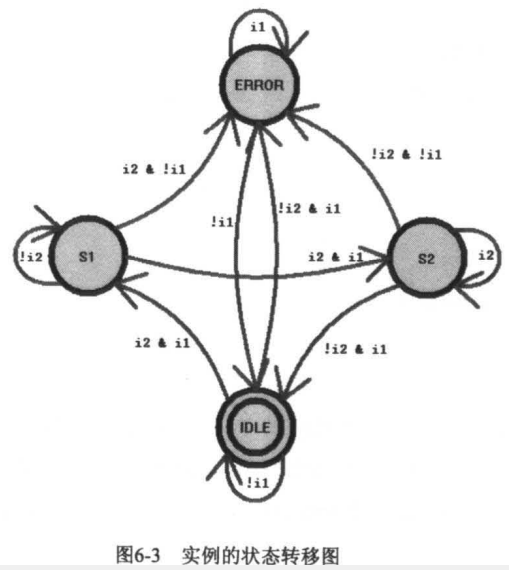
   * 4种状态：IDEL, S1, S2, ERROR
   * 状态输出
      * IDLE - {o1, o2, err} = 3'b000;
      * S1 - {o1, o2, err} = 3'b100;
      * S2 - {o1, o2, err} = 3'b010;
      * ERROR - {o1, o2, err} = 3'b111;
   * 一段式状态机描述：[state1.v](./code/fsm/state1.v)<br>
      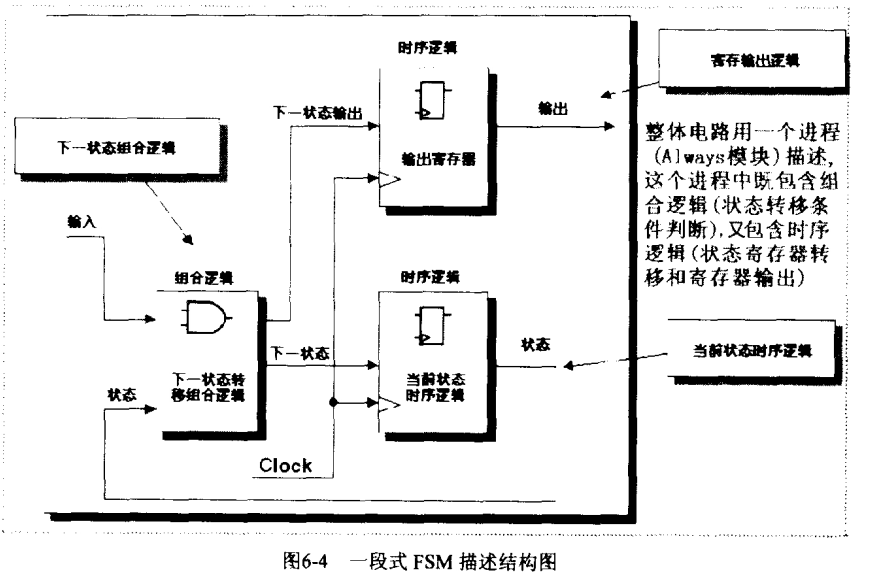
      ```verilog
      //1 always block to describe state transition, state output, state input condition
      always @ (posedge clk or negedge nrst)
      if (!nrst)
         begin
            NS         <= IDLE;
            {o1,o2,err} <= 3'b000;
         end
      else
         begin
            NS         <=  3'bx;
            {o1,o2,err} <=  3'b000;
            case (NS)
            IDLE:  begin
                     if (~i1)         begin{o1,o2,err}<=3'b000;NS <= IDLE; end
                     if (i1 && i2)    begin{o1,o2,err}<=3'b100;NS <= S1;   end
                     if (i1 && ~i2)   begin{o1,o2,err}<=3'b111;NS <= ERROR;end
                     end
            S1:    begin
                     if (~i2)         begin{o1,o2,err}<=3'b100;NS <= S1;   end
                     if (i2 && i1)    begin{o1,o2,err}<=3'b010;NS <= S2;   end
                     if (i2 && (~i1)) begin{o1,o2,err}<=3'b111;NS <= ERROR;end
                     end
            S2:    begin
                     if (i2)          begin{o1,o2,err}<=3'b010;NS <= S2;   end
                     if (~i2 && i1)   begin{o1,o2,err}<=3'b000;NS <= IDLE; end
                     if (~i2 && (~i1))begin{o1,o2,err}<=3'b111;NS <= ERROR;end
                     end
            ERROR: begin
                     if (i1)          begin{o1,o2,err}<=3'b111;NS <= ERROR;end
                     if (~i1)         begin{o1,o2,err}<=3'b000;NS <= IDLE; end
                     end
            endcase
         end
      ```
   * 两段式状态机描述：[state2.v](./code/fsm/state2.v)<br>
      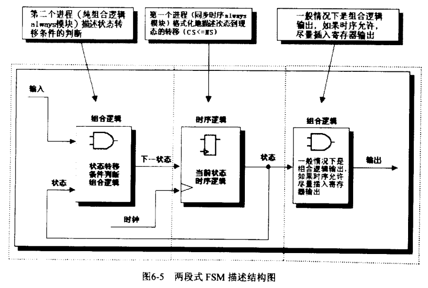
      ```verilog
      //sequential state transition
      always @ (posedge clk or negedge nrst)
            if (!nrst)            
               CS <= IDLE;        
            else                  
               CS <=NS;           

      //combinational condition judgment
      always @ (nrst or CS or i1 or i2)
               begin
                     NS = 3'bx;
                     ERROR_out;
                     case (CS)
                        IDLE:     begin
                                       IDLE_out;
                                       if (~i1)           NS = IDLE;
                                       if (i1 && i2)      NS = S1;
                                       if (i1 && ~i2)     NS = ERROR;
                                    end
                        S1:       begin
                                       S1_out;
                                       if (~i2)           NS = S1;
                                       if (i2 && i1)      NS = S2;
                                       if (i2 && (~i1))   NS = ERROR;
                                    end
                        S2:       begin
                                       S2_out;
                                       if (i2)            NS = S2;
                        if (~i2 && i1)     NS = IDLE;
                                       if (~i2 && (~i1))  NS = ERROR;
                                    end
                        ERROR:    begin
                                       ERROR_out;
                                       if (i1)            NS = ERROR;
                                       if (~i1)           NS = IDLE;
                                    end
                     endcase
               end


      //output task
      task IDLE_out;
         {o1,o2,err} = 3'b000;
      endtask

      task S1_out;
         {o1,o2,err} = 3'b100;
      endtask

      task S2_out;
         {o1,o2,err} = 3'b010;
      endtask

      task ERROR_out;
         {o1,o2,err} = 3'b111;
      endtask
      ```
      * `always`的敏感列表为：`always @ (nrst or CS or i1 or i2)`
         * 当前状态CS
         * 复位信号
         * 输入条件
            * 如果式米勒状态机，则必须由输入条件，如果式摩尔状态机，则敏感表和后续逻辑判定没有输入
      * 敏感表下写入默认的下一状态“NS”的描述：
         ```verilog
         begin
            NS = 3'bx;
            ERROR_out;
         ```
         * 默认状态设计为不确定状态X，这样有两个好处：
            * 在仿真时可以很好地考察所设计的FSM的完备性，如果FSM不完备，会进入任意状态，仿真时很容易发现
            * 综合器对X的处理是"Don't Care"，这里赋值不确定的效果和使用`casez`或`casex`替代`case`的效果很相似
      * 该组合逻辑模块种所有的赋值推荐采用阻塞赋值"="
      * 每个输出都用组合逻辑描述，用`task/endtask`封装起来
         ```
         task S1_out;
            {o1,p2,err} = 3'b100;
         endtask
         ```
         * 这个组合逻辑容易产生毛刺，因此如果时序允许，请对输出插入一个寄存器节拍
   * 三段式状态机描述：[state3.v](./code/fsm/state3.v)<br>
      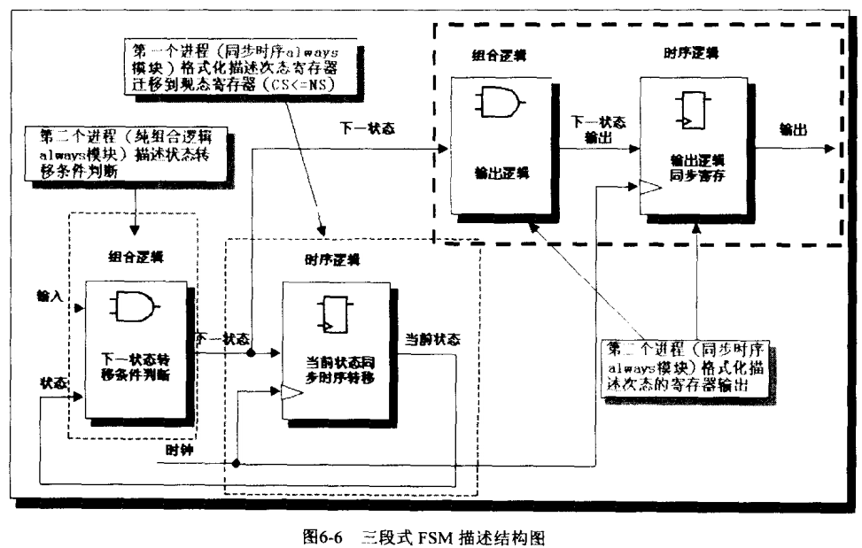
      ```verilog
      //1st always block, sequential state transition
      always @ (posedge clk or negedge nrst)
            if (!nrst)            
               CS <= IDLE;        
            else                  
               CS <=NS;           

      //2nd always block, combinational condition judgment
      always @ (nrst or CS or i1 or i2)
               begin
                     NS = 3'bx;
                     case (CS)
                        IDLE:     begin
                                       if (~i1)           NS = IDLE;
                                       if (i1 && i2)      NS = S1;
                                       if (i1 && ~i2)     NS = ERROR;
                                    end
                        S1:       begin
                                       if (~i2)           NS = S1;
                                       if (i2 && i1)      NS = S2;
                                       if (i2 && (~i1))   NS = ERROR;
                                    end
                        S2:       begin
                                       if (i2)            NS = S2;
                        if (~i2 && i1)     NS = IDLE;
                                       if (~i2 && (~i1))  NS = ERROR;
                                    end
                        ERROR:    begin
                                       if (i1)            NS = ERROR;
                                       if (~i1)           NS = IDLE;
                                    end
                     endcase
               end


      //3rd always block, the sequential FSM output
      always @ (posedge clk or negedge nrst)
      if (!nrst)
            {o1,o2,err} <= 3'b000;
      else
         begin
            {o1,o2,err} <=  3'b000;
            case (NS)
               IDLE:  {o1,o2,err}<=3'b000;

               S1:    {o1,o2,err}<=3'b100;
               S2:    {o1,o2,err}<=3'b010;
               ERROR: {o1,o2,err}<=3'b111;
            endcase
         end
      ```
      * 三段式描述方式的关键在于使用同步时序逻辑寄存FSM的输出

* 3种描述FSM方法比较<br>
   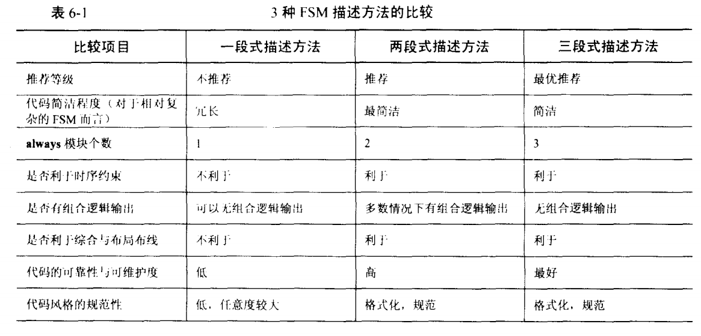

### 状态机设计的其他技巧
* FSM的编码
   * gray-code(格雷码)和binary(二进制编码)使用最少的触发器，较多的组合逻辑
   * one-hot(独热码)使用较多的触发器，但是较少的组合逻辑，在一定程度上减少了毛刺
* FSM初始化状态
   * 采用异步复位信号，让状态机进入初始状态
* FSM状态编码定义
   * 通过`parameter`定义
* FSM输出
   * 简单的输出可以用`?`或`case`语句判断输出
   * 复杂的输出可以用`task/endtask`封装
* 阻塞和非阻塞
   * 时序逻辑always模块用非阻塞"<="
   * 组合逻辑always模块用阻塞赋值"="
* FSM的默认状态
   * 当转移条件不满足或者状态发生突变时，要避免“死循环”
   * `case`语句应该有default分支，一旦电路运行到这个状态，就自动跳转到IDLE状态，从新启动状态机

## 小结
* 设计状态机时时刻要考虑的两件事情
   * 逻辑顺序
   * 时序规律
